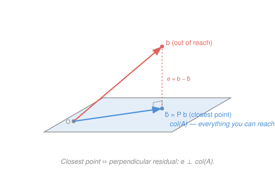

# Linear Algebra · Lesson 4.2: Orthogonal projection and least squares

> ⏱ ~15 min · Module 4: Inner products and orthogonality · Builds on: [4.1 Inner products, norms, and orthogonality](04-01-inner-products-orthogonality.md), [2.2 Inverses and the four fundamental subspaces](02-02-inverses-and-four-subspaces.md) · Unlocks: 4.3 (Gram–Schmidt and QR)

## Why this matters

Most systems the real world hands you have no solution — three data points almost never sit on one line, ten sensor readings never agree on three unknowns. The system $A\mathbf x=\mathbf b$ is over-determined: more equations than freedom, and $\mathbf b$ simply isn't reachable. Least squares is the universal fix: if you can't *hit* $\mathbf b$, hit the closest point you *can* reach. That single geometric move — drop a perpendicular onto the reachable set — is the engine under linear regression, curve fitting, GPS trilateration, and the "best fit" in every science. It's all one picture.

## The idea

Here is the whole lesson in one image. You want to reach a target point $\mathbf b$, but you're confined to a flat sheet — a plane (or line) through the origin, the set of everything you can build from your ingredients. $\mathbf b$ floats above the sheet, off-limits. What's the best you can do?

Stand on the sheet and pick the point $\hat{\mathbf b}$ closest to $\mathbf b$. Intuitively, you find it by dropping straight down: the arrow from $\hat{\mathbf b}$ up to $\mathbf b$ must be **perpendicular** to the sheet. If it leaned at all, you could slide along the sheet a little and get closer — so *closest* and *perpendicular* are the same condition. That leftover arrow $\mathbf e=\mathbf b-\hat{\mathbf b}$ is the **residual**, the part of $\mathbf b$ you were forced to give up.

That's it. "Solve the unsolvable system" means "project $\mathbf b$ onto the reachable subspace," and the projection is pinned down by one demand: the residual is orthogonal to everything reachable.

## The formal version

**Projection onto a line.** The reachable set spanned by a single vector $\mathbf a\neq\mathbf 0$ is the line $\{t\mathbf a\}$. The projection of $\mathbf b$ onto it is

$$\operatorname{proj}_{\mathbf a}\mathbf b=\frac{\mathbf a\cdot\mathbf b}{\mathbf a\cdot\mathbf a}\,\mathbf a,$$

where $\mathbf a\cdot\mathbf b=\mathbf a^\top\mathbf b$ is the inner product from [4.1](04-01-inner-products-orthogonality.md). *In words:* scale $\mathbf a$ by the fraction of it that $\mathbf b$ points along. You can derive it from the one demand: write $\hat{\mathbf b}=\hat x\,\mathbf a$ and force the residual orthogonal, $\mathbf a\cdot(\mathbf b-\hat x\mathbf a)=0$, which gives $\hat x=\frac{\mathbf a\cdot\mathbf b}{\mathbf a\cdot\mathbf a}$.

**Projection onto a subspace.** Now the reachable set is the **column space** of a matrix $A$ (the span of its columns — every $A\mathbf x$; see [2.2](02-02-inverses-and-four-subspaces.md)). We seek $\hat{\mathbf x}$ so that $\hat{\mathbf b}=A\hat{\mathbf x}$ is closest to $\mathbf b$. The residual $\mathbf b-A\hat{\mathbf x}$ must be orthogonal to *every* column of $A$ — i.e. to all of $\operatorname{col}(A)$:

$$A^\top(\mathbf b-A\hat{\mathbf x})=\mathbf 0\qquad\Longrightarrow\qquad \boxed{A^\top A\,\hat{\mathbf x}=A^\top\mathbf b.}$$

These are the **normal equations** ("normal" = perpendicular). *In words:* one small square system, size $n\times n$, that hands you the best coefficients. When $A$ has independent columns, $A^\top A$ is invertible and

$$\hat{\mathbf x}=(A^\top A)^{-1}A^\top\mathbf b,\qquad \hat{\mathbf b}=A\hat{\mathbf x}=\underbrace{A(A^\top A)^{-1}A^\top}_{P}\,\mathbf b.$$

**The projection matrix** $P=A(A^\top A)^{-1}A^\top$ is the single operator that sends any $\mathbf b$ to its shadow $\hat{\mathbf b}$ on $\operatorname{col}(A)$. It satisfies $P^\top=P$ and $P^2=P$: *In words:* projecting twice is the same as projecting once — you're already on the sheet, so nothing moves.

**Least squares.** Minimizing distance means minimizing the squared length $\|A\mathbf x-\mathbf b\|^2$ (squared to avoid the square root — same minimizer, easier algebra). The minimizer is exactly the $\hat{\mathbf x}$ from the normal equations. *In words:* "least squares" and "orthogonal projection" are two names for one solution — the best fit is the perpendicular drop.

## Picture

## Worked examples

**Example 1 (mechanical — project onto a line).** Project $\mathbf b=\begin{bmatrix}1\\1\\1\end{bmatrix}$ onto the line through $\mathbf a=\begin{bmatrix}1\\2\\2\end{bmatrix}$.

$$\mathbf a\cdot\mathbf b=1+2+2=5,\qquad \mathbf a\cdot\mathbf a=1+4+4=9,\qquad \hat{\mathbf b}=\frac{5}{9}\begin{bmatrix}1\\2\\2\end{bmatrix}=\begin{bmatrix}5/9\\10/9\\10/9\end{bmatrix}.$$

Residual $\mathbf e=\mathbf b-\hat{\mathbf b}=\begin{bmatrix}4/9\\-1/9\\-1/9\end{bmatrix}$. Check orthogonality: $\mathbf a\cdot\mathbf e=\frac{4}{9}-\frac{2}{9}-\frac{2}{9}=0$. ✓ The perpendicular test is the receipt that you projected correctly.

**Example 2 (why you'd care — fit a line to data).** Three measurements: at times $t=-1,0,1$ we read $y=1,0,5$. Fit $y=c+dt$ by least squares. Each point demands $c+dt_i=y_i$; stacking them:

$$A=\begin{bmatrix}1&-1\\1&0\\1&1\end{bmatrix},\quad \mathbf x=\begin{bmatrix}c\\d\end{bmatrix},\quad \mathbf b=\begin{bmatrix}1\\0\\5\end{bmatrix}.$$

No line hits all three, so solve the normal equations. Because the times are centered ($\sum t_i=0$), $A^\top A$ comes out diagonal — a small gift:

$$A^\top A=\begin{bmatrix}3&0\\0&2\end{bmatrix},\qquad A^\top\mathbf b=\begin{bmatrix}1+0+5\\-1+0+5\end{bmatrix}=\begin{bmatrix}6\\4\end{bmatrix}.$$

So $3c=6,\ 2d=4\Rightarrow c=2,\ d=2$: the best-fit line is $\hat y=2+2t$. Predictions $\hat{\mathbf b}=(0,2,4)$, residual $\mathbf e=\mathbf b-\hat{\mathbf b}=(1,-2,1)$. Check it's orthogonal to *both* columns of $A$: against $\mathbf 1=(1,1,1)$, $1-2+1=0$ ✓; against $t=(-1,0,1)$, $-1+0+1=0$ ✓. Both zero — the residuals sum to zero and carry no leftover trend, the signature of a correct fit. This is the first half of **Boss problem 4**.

## Watch out

- You might think you should solve $A\mathbf x=\mathbf b$ directly — but for an over-determined system there *is* no solution. You must pre-multiply by $A^\top$ to collapse it into the solvable normal equations $A^\top A\hat{\mathbf x}=A^\top\mathbf b$.
- You might think $P=A(A^\top A)^{-1}A^\top$ simplifies to $AA^{-1}(A^\top)^{-1}A^\top=I$. It does **not**: $A$ is usually rectangular and has no inverse — only the square $A^\top A$ does. Splitting the inverse is illegal here, and $P=I$ would say every $\mathbf b$ is already reachable, which is exactly false.
- You might think the residual is orthogonal to the *columns' entries* or to $\mathbf x$. It's orthogonal to the **column space** — that's what $A^\top\mathbf e=\mathbf 0$ encodes (each column dotted with $\mathbf e$ gives zero).

## One-liner

> When you can't reach $\mathbf b$, drop a perpendicular onto what you *can* reach: force the residual orthogonal to the column space, and $A^\top A\hat{\mathbf x}=A^\top\mathbf b$ falls out.

## Problems

**P1 (🟢)** Project $\mathbf b=\begin{bmatrix}5\\0\end{bmatrix}$ onto the line through $\mathbf a=\begin{bmatrix}3\\4\end{bmatrix}$. Give $\hat{\mathbf b}$ and the residual $\mathbf e$, and verify $\mathbf e\perp\mathbf a$.

**P2 (🟡)** Fit the least-squares line $y=c+dx$ to the points $(1,1),(2,2),(3,2)$. Set up $A$ and $\mathbf b$, solve $A^\top A\hat{\mathbf x}=A^\top\mathbf b$, and confirm the residual is orthogonal to both columns of $A$.

**P3 (🔴, optional)** For a nonzero vector $\mathbf a$, show the matrix that projects onto the line through $\mathbf a$ is $P=\dfrac{\mathbf a\mathbf a^\top}{\mathbf a^\top\mathbf a}$. Then, taking $\mathbf a=\begin{bmatrix}3\\4\end{bmatrix}$, write $P$ explicitly and verify $P^2=P$ and $P\mathbf a=\mathbf a$.

Solutions

**P1** $\mathbf a\cdot\mathbf b=3\cdot5+4\cdot0=15$, $\mathbf a\cdot\mathbf a=9+16=25$. So

$$\hat{\mathbf b}=\frac{15}{25}\begin{bmatrix}3\\4\end{bmatrix}=\frac{3}{5}\begin{bmatrix}3\\4\end{bmatrix}=\begin{bmatrix}9/5\\12/5\end{bmatrix},\qquad \mathbf e=\mathbf b-\hat{\mathbf b}=\begin{bmatrix}5-9/5\\0-12/5\end{bmatrix}=\begin{bmatrix}16/5\\-12/5\end{bmatrix}.$$

Check: $\mathbf a\cdot\mathbf e=3\cdot\tfrac{16}{5}+4\cdot(-\tfrac{12}{5})=\tfrac{48}{5}-\tfrac{48}{5}=0$. ✓

**P2** Each point wants $c+dx_i=y_i$:

$$A=\begin{bmatrix}1&1\\1&2\\1&3\end{bmatrix},\quad \mathbf b=\begin{bmatrix}1\\2\\2\end{bmatrix},\qquad A^\top A=\begin{bmatrix}3&6\\6&14\end{bmatrix},\quad A^\top\mathbf b=\begin{bmatrix}1+2+2\\1+4+6\end{bmatrix}=\begin{bmatrix}5\\11\end{bmatrix}.$$

Solve $\begin{bmatrix}3&6\\6&14\end{bmatrix}\begin{bmatrix}c\\d\end{bmatrix}=\begin{bmatrix}5\\11\end{bmatrix}$. From row 1, $3c+6d=5$; row 2, $6c+14d=11$. Double row 1: $6c+12d=10$; subtract from row 2: $2d=1\Rightarrow d=\tfrac12$. Then $3c=5-6\cdot\tfrac12=2\Rightarrow c=\tfrac23$. Best-fit line: $\hat y=\tfrac23+\tfrac12 x$.

Predictions $\hat{\mathbf b}=(\tfrac23+\tfrac12,\ \tfrac23+1,\ \tfrac23+\tfrac32)=(\tfrac76,\tfrac53,\tfrac{13}{6})$. Residual $\mathbf e=\mathbf b-\hat{\mathbf b}=(1-\tfrac76,\ 2-\tfrac53,\ 2-\tfrac{13}{6})=(-\tfrac16,\tfrac13,-\tfrac16)$.
Orthogonality: against column $\mathbf 1$: $-\tfrac16+\tfrac13-\tfrac16=0$ ✓. Against column $x=(1,2,3)$: $-\tfrac16+\tfrac23-\tfrac12=-\tfrac16+\tfrac46-\tfrac36=0$ ✓.

**P3** Start from the line formula $\hat{\mathbf b}=\dfrac{\mathbf a\cdot\mathbf b}{\mathbf a\cdot\mathbf a}\,\mathbf a=\dfrac{\mathbf a^\top\mathbf b}{\mathbf a^\top\mathbf a}\,\mathbf a$. The scalar $\mathbf a^\top\mathbf b$ can be pulled to the front, and since scalars commute past a matrix, $\mathbf a(\mathbf a^\top\mathbf b)=(\mathbf a\mathbf a^\top)\mathbf b$ by associativity. Hence

$$\hat{\mathbf b}=\frac{\mathbf a(\mathbf a^\top\mathbf b)}{\mathbf a^\top\mathbf a}=\frac{\mathbf a\mathbf a^\top}{\mathbf a^\top\mathbf a}\,\mathbf b\quad\Rightarrow\quad P=\frac{\mathbf a\mathbf a^\top}{\mathbf a^\top\mathbf a}.$$

(This is the general $P=A(A^\top A)^{-1}A^\top$ with $A=\mathbf a$ a single column, since $A^\top A=\mathbf a^\top\mathbf a$ is a scalar.)

For $\mathbf a=\begin{bmatrix}3\\4\end{bmatrix}$: $\mathbf a^\top\mathbf a=25$ and $\mathbf a\mathbf a^\top=\begin{bmatrix}9&12\\12&16\end{bmatrix}$, so

$$P=\frac{1}{25}\begin{bmatrix}9&12\\12&16\end{bmatrix}.$$

*$P^2=P$:* $\mathbf a\mathbf a^\top\mathbf a\mathbf a^\top=\mathbf a(\mathbf a^\top\mathbf a)\mathbf a^\top=(\mathbf a^\top\mathbf a)\,\mathbf a\mathbf a^\top$, so $P^2=\dfrac{(\mathbf a^\top\mathbf a)\,\mathbf a\mathbf a^\top}{(\mathbf a^\top\mathbf a)^2}=\dfrac{\mathbf a\mathbf a^\top}{\mathbf a^\top\mathbf a}=P$. Numerically, $\frac{1}{625}\begin{bmatrix}9&12\\12&16\end{bmatrix}\begin{bmatrix}9&12\\12&16\end{bmatrix}=\frac{1}{625}\begin{bmatrix}225&300\\300&400\end{bmatrix}=\frac{1}{25}\begin{bmatrix}9&12\\12&16\end{bmatrix}=P$. ✓

*$P\mathbf a=\mathbf a$:* $P\mathbf a=\dfrac{\mathbf a\mathbf a^\top\mathbf a}{\mathbf a^\top\mathbf a}=\mathbf a\cdot\dfrac{\mathbf a^\top\mathbf a}{\mathbf a^\top\mathbf a}=\mathbf a$. A vector already on the line is left untouched — the projection fixes its own subspace.

## Flashback

**From Lesson 4.1 (Inner products, norms, and orthogonality):** Let $\mathbf u=\begin{bmatrix}2\\1\\-2\end{bmatrix}$. (a) Find the value of $k$ making $\mathbf v=\begin{bmatrix}1\\k\\3\end{bmatrix}$ orthogonal to $\mathbf u$. (b) Find the cosine of the angle between $\mathbf u$ and the $x$-axis direction $\mathbf e_1=\begin{bmatrix}1\\0\\0\end{bmatrix}$.

Solution

(a) Orthogonal means $\mathbf u\cdot\mathbf v=0$: $2(1)+1(k)+(-2)(3)=2+k-6=k-4=0$, so $k=4$.

(b) $\cos\theta=\dfrac{\mathbf u\cdot\mathbf e_1}{\|\mathbf u\|\,\|\mathbf e_1\|}$. Here $\mathbf u\cdot\mathbf e_1=2$, $\|\mathbf u\|=\sqrt{4+1+4}=3$, $\|\mathbf e_1\|=1$, so $\cos\theta=\dfrac{2}{3}$ (about $48.2^\circ$). Note $\mathbf u\cdot\mathbf e_1$ just reads off $\mathbf u$'s first component — the dot product with a basis vector picks out a coordinate.

## Connections

- **Backward:** the orthogonality test $\mathbf a\cdot\mathbf e=0$ and the norm being minimized are exactly the inner product and length from [4.1](04-01-inner-products-orthogonality.md); the reachable set is the **column space** named in [2.2](02-02-inverses-and-four-subspaces.md), and the residual $\mathbf e$ lives in its orthogonal complement, the left null space $N(A^\top)$ — which is *why* $A^\top\mathbf e=\mathbf 0$.
- **Forward:** [4.3](04-03-gram-schmidt-qr.md) makes projection cheap by first replacing $A$'s columns with an orthonormal basis $Q$ (then $A^\top A=I$ and the normal equations collapse to $\hat{\mathbf x}=Q^\top\mathbf b$). Boss problem 4's second half checks the two routes agree.
- **Sideways (statistics):** ordinary least squares regression *is* this projection — $\hat{\mathbf x}=(A^\top A)^{-1}A^\top\mathbf b$ is the textbook OLS coefficient formula, $\hat{\mathbf b}$ are the fitted values, and $\mathbf e$ the regression residuals whose orthogonality to the predictors is the normal equations restated. Fitting a line to data and projecting onto a plane are the same act.
