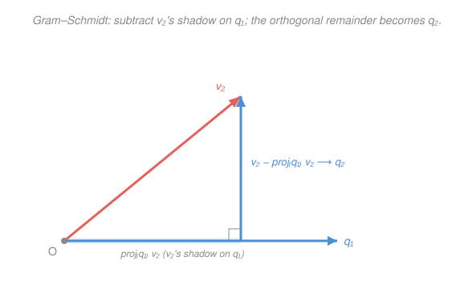

# Linear Algebra · Lesson 4.3: Gram–Schmidt and QR

> ⏱ ~15 min · Module 4: Inner products and orthogonality · Builds on: [4.2 Orthogonal projection and least squares](04-02-projection-least-squares.md), [4.1 Inner products, norms, and orthogonality](04-01-inner-products-orthogonality.md) · Unlocks: Module 5 (spectral theorem and SVD)

## Why this matters

A basis is a coordinate system, but most bases are *tilted and stretched* — to find a vector's coordinates you must solve a linear system (invert a matrix). An **orthonormal** basis is the dream coordinate system: perpendicular axes, all of unit length, so a coordinate is just a dot product — no system to solve, no inverse. This lesson does two things: it gives you **Gram–Schmidt**, the machine that turns *any* basis into an orthonormal one, and it packages that machine as the **QR factorization** $A = QR$, which is how real software solves least squares and the launchpad for the SVD in Module 5.

## The idea

Why are perpendicular unit axes so good? In the standard basis, the coordinates of $(4,2)$ are just $4$ and $2$ — you read them straight off, because $\mathbf e_1$ and $\mathbf e_2$ are orthonormal. The magic is that *any* orthonormal basis works the same way: the amount of $\mathbf v$ along an axis $\mathbf q_i$ is simply the shadow $\langle \mathbf v, \mathbf q_i\rangle$ (the projection from [4.2](04-02-projection-least-squares.md), with no denominator because $\mathbf q_i$ has length 1). So $\mathbf v = \sum_i \langle \mathbf v, \mathbf q_i\rangle \mathbf q_i$ — reconstruct the whole vector from its shadows.

Gram–Schmidt is how you *build* such axes from a crooked starting basis $\mathbf v_1, \mathbf v_2, \dots$. Keep the first direction, just rescale it to unit length. For the second, the problem is that $\mathbf v_2$ leans partly along the first axis — so **subtract off that lean** (its projection onto $\mathbf q_1$), leaving only the genuinely new, perpendicular part; normalize it. For the third, subtract its lean along *both* earlier axes; normalize. The slogan: **straighten each axis by removing what already points along the earlier ones.**

## The formal version

**Orthonormal basis.** Vectors $\mathbf q_1, \dots, \mathbf q_n$ are *orthonormal* if $\mathbf q_i^\top \mathbf q_j = \delta_{ij}$ — that is, $1$ when $i=j$ (unit length) and $0$ when $i \neq j$ (mutually perpendicular). ($\delta_{ij}$ is the Kronecker delta.) In words: unit vectors at right angles. If they also span the space, they're an *orthonormal basis*, and every $\mathbf v$ expands as

$$\mathbf v = \sum_{i=1}^{n} \langle \mathbf v, \mathbf q_i\rangle\, \mathbf q_i, \qquad \langle \mathbf v, \mathbf q_i\rangle = \mathbf q_i^\top \mathbf v.$$

In words: the coordinates are literally the inner products — no matrix inverse, ever.

**The Gram–Schmidt process.** Given a basis $\mathbf v_1, \dots, \mathbf v_n$, produce orthonormal $\mathbf q_1, \dots, \mathbf q_n$ spanning the same space:

$$\mathbf u_k = \mathbf v_k - \sum_{i=1}^{k-1} \langle \mathbf v_k, \mathbf q_i\rangle\, \mathbf q_i, \qquad \mathbf q_k = \frac{\mathbf u_k}{\lVert \mathbf u_k\rVert}.$$

In words: take the next vector, subtract its projection onto each axis already built (the sum is exactly the projection of $\mathbf v_k$ onto the earlier span), then normalize the leftover. The first step is just $\mathbf q_1 = \mathbf v_1 / \lVert \mathbf v_1\rVert$ (empty sum).

**QR factorization.** Collect the starting vectors as the columns of $A = [\,\mathbf v_1 \ \cdots \ \mathbf v_n\,]$ and the orthonormal ones as the columns of $Q = [\,\mathbf q_1 \ \cdots \ \mathbf q_n\,]$. Then

$$A = QR, \qquad R = Q^\top A \ \text{ upper triangular}, \quad R_{ij} = \langle \mathbf v_j, \mathbf q_i\rangle \ (i \le j), \quad R_{ii} = \lVert \mathbf u_i\rVert.$$

In words: $R$ is just Gram–Schmidt's bookkeeping — column $j$ of $A$ is $\mathbf v_j = \sum_{i \le j} R_{ij}\,\mathbf q_i$, and since $\mathbf v_j$ only uses axes $\mathbf q_1, \dots, \mathbf q_j$, everything below the diagonal is zero. $Q$ has orthonormal columns ($Q^\top Q = I$), $R$ is upper-triangular and invertible.

**Why least squares loves QR.** In [4.2](04-02-projection-least-squares.md) the best-fit $\hat{\mathbf x}$ solved the normal equations $A^\top A\,\hat{\mathbf x} = A^\top \mathbf b$. Substitute $A = QR$: since $Q^\top Q = I$, $A^\top A = R^\top Q^\top Q R = R^\top R$ and $A^\top \mathbf b = R^\top Q^\top \mathbf b$. Cancel the invertible $R^\top$:

$$R\,\hat{\mathbf x} = Q^\top \mathbf b.$$

In words: no need to form $A^\top A$ (which squares the numerical error) — just multiply $\mathbf b$ by $Q^\top$ and back-substitute through the triangular $R$. Same answer, far better conditioned.

## Picture

## Worked examples

**Example 1 (mechanical — Gram–Schmidt on two vectors).** Orthonormalize $\mathbf v_1 = \begin{bmatrix} 1 \\ 1 \end{bmatrix}$, $\mathbf v_2 = \begin{bmatrix} 2 \\ 0 \end{bmatrix}$.

*First axis:* $\lVert \mathbf v_1\rVert = \sqrt{1^2+1^2} = \sqrt 2$, so $\mathbf q_1 = \frac{1}{\sqrt2}\begin{bmatrix} 1 \\ 1 \end{bmatrix}$.

*Second axis:* the lean of $\mathbf v_2$ along $\mathbf q_1$ is $\langle \mathbf v_2, \mathbf q_1\rangle = \frac{1}{\sqrt2}(2\cdot 1 + 0\cdot 1) = \frac{2}{\sqrt2} = \sqrt2$. Subtract it:

$$\mathbf u_2 = \begin{bmatrix} 2 \\ 0 \end{bmatrix} - \sqrt2\cdot\frac{1}{\sqrt2}\begin{bmatrix} 1 \\ 1 \end{bmatrix} = \begin{bmatrix} 2 \\ 0 \end{bmatrix} - \begin{bmatrix} 1 \\ 1 \end{bmatrix} = \begin{bmatrix} 1 \\ -1 \end{bmatrix}, \qquad \mathbf q_2 = \frac{1}{\sqrt2}\begin{bmatrix} 1 \\ -1 \end{bmatrix}.$$

**Check:** $\mathbf q_1^\top \mathbf q_2 = \frac{1}{2}(1\cdot 1 + 1\cdot(-1)) = 0$ ✓ and both have length 1. The tilted pair $\{\mathbf v_1, \mathbf v_2\}$ became the perpendicular frame in the Picture.

**Example 2 (why you'd care — the same work, read as $A = QR$).** Stack Example 1's vectors as columns, $A = \begin{bmatrix} 1 & 2 \\ 1 & 0 \end{bmatrix}$. Gram–Schmidt already did all the arithmetic; just collect it. $Q = \begin{bmatrix} \mathbf q_1 & \mathbf q_2\end{bmatrix} = \frac{1}{\sqrt2}\begin{bmatrix} 1 & 1 \\ 1 & -1 \end{bmatrix}$, and

$$R = \begin{bmatrix} \lVert \mathbf u_1\rVert & \langle \mathbf v_2, \mathbf q_1\rangle \\ 0 & \lVert \mathbf u_2\rVert \end{bmatrix} = \begin{bmatrix} \sqrt2 & \sqrt2 \\ 0 & \sqrt2 \end{bmatrix}.$$

**Check** $A = QR$: $\frac{1}{\sqrt2}\begin{bmatrix} 1 & 1 \\ 1 & -1 \end{bmatrix}\begin{bmatrix} \sqrt2 & \sqrt2 \\ 0 & \sqrt2 \end{bmatrix} = \frac{1}{\sqrt2}\begin{bmatrix} \sqrt2 & 2\sqrt2 \\ \sqrt2 & 0 \end{bmatrix} = \begin{bmatrix} 1 & 2 \\ 1 & 0 \end{bmatrix} = A$ ✓. Now any least-squares fit with this $A$ solves $R\hat{\mathbf x} = Q^\top\mathbf b$ by back-substitution — reading $\hat x_2$ off the bottom row, then $\hat x_1$ — with no $A^\top A$ in sight.

## Watch out

- You might think you must divide by $\langle \mathbf q_i, \mathbf q_i\rangle$ when subtracting the projection. Once $\mathbf q_i$ is **normalized**, that denominator is $1$ — that's the whole point of using unit axes. (If you subtract projections onto the *un-normalized* $\mathbf u_i$ instead, you must keep the $\frac{\langle\cdot,\cdot\rangle}{\langle \mathbf u_i,\mathbf u_i\rangle}$ denominator, as in [4.2](04-02-projection-least-squares.md).)
- You might think the order of the vectors doesn't matter. It does: $\mathbf q_1$ is always the (normalized) *first* vector, and reordering gives a different orthonormal basis. The span is the same, the frame is not.
- You might think Gram–Schmidt always succeeds. If some $\mathbf v_k$ lies in the span of the earlier vectors, its projection *equals itself*, so $\mathbf u_k = \mathbf 0$ and you can't normalize (division by zero). That zero is not a bug — it's the process **detecting linear dependence** (P3).

## One-liner

> An orthonormal basis makes every coordinate a dot product; Gram–Schmidt builds one by peeling each vector's shadow off the axes already standing, and $A = QR$ is that peeling written down.

## Problems

**P1 (🟢)** Apply Gram–Schmidt to $\mathbf v_1 = \begin{bmatrix} 1 \\ 1 \\ 0 \end{bmatrix}$, $\mathbf v_2 = \begin{bmatrix} 1 \\ 0 \\ 1 \end{bmatrix}$ to get an orthonormal pair $\mathbf q_1, \mathbf q_2$. Verify $\mathbf q_1^\top \mathbf q_2 = 0$ and $\lVert\mathbf q_2\rVert = 1$.

**P2 (🟡)** Compute the QR factorization of $A = \begin{bmatrix} 2 & 1 \\ 1 & 3 \end{bmatrix}$. Verify both $Q^\top Q = I$ and $QR = A$.

**P3 (🔴)** The plane $W \subset \mathbb{R}^3$ has orthonormal basis $\mathbf q_1 = \frac{1}{\sqrt2}\begin{bmatrix} 1 \\ 1 \\ 0 \end{bmatrix}$, $\mathbf q_2 = \frac{1}{\sqrt6}\begin{bmatrix} 1 \\ -1 \\ 2 \end{bmatrix}$. Project $\mathbf b = \begin{bmatrix} 1 \\ 2 \\ 3 \end{bmatrix}$ onto $W$ using only inner products, $\hat{\mathbf b} = \langle\mathbf b,\mathbf q_1\rangle\mathbf q_1 + \langle\mathbf b,\mathbf q_2\rangle\mathbf q_2$. Confirm the residual $\mathbf b - \hat{\mathbf b}$ is orthogonal to both axes, and note what you *didn't* have to do compared with the normal equations of [4.2](04-02-projection-least-squares.md).

Solutions

**P1** *First axis:* $\lVert\mathbf v_1\rVert = \sqrt{1+1+0} = \sqrt2$, so $\mathbf q_1 = \frac{1}{\sqrt2}\begin{bmatrix} 1 \\ 1 \\ 0 \end{bmatrix}$.

*Second axis:* $\langle\mathbf v_2,\mathbf q_1\rangle = \frac{1}{\sqrt2}(1\cdot 1 + 0\cdot 1 + 1\cdot 0) = \frac{1}{\sqrt2}$. Subtract the lean:

$$\mathbf u_2 = \begin{bmatrix} 1 \\ 0 \\ 1 \end{bmatrix} - \frac{1}{\sqrt2}\cdot\frac{1}{\sqrt2}\begin{bmatrix} 1 \\ 1 \\ 0 \end{bmatrix} = \begin{bmatrix} 1 \\ 0 \\ 1 \end{bmatrix} - \frac{1}{2}\begin{bmatrix} 1 \\ 1 \\ 0 \end{bmatrix} = \begin{bmatrix} 1/2 \\ -1/2 \\ 1 \end{bmatrix}.$$

$\lVert\mathbf u_2\rVert = \sqrt{\tfrac14 + \tfrac14 + 1} = \sqrt{\tfrac32} = \frac{\sqrt3}{\sqrt2}$, so $\mathbf q_2 = \frac{\sqrt2}{\sqrt3}\begin{bmatrix} 1/2 \\ -1/2 \\ 1 \end{bmatrix} = \frac{1}{\sqrt6}\begin{bmatrix} 1 \\ -1 \\ 2 \end{bmatrix}$.

**Check:** $\mathbf q_1^\top\mathbf q_2 = \frac{1}{\sqrt2\sqrt6}(1\cdot 1 + 1\cdot(-1) + 0\cdot 2) = 0$ ✓, and $\lVert\mathbf q_2\rVert^2 = \frac{1}{6}(1+1+4) = 1$ ✓.

**P2** Columns $\mathbf v_1 = \begin{bmatrix} 2 \\ 1 \end{bmatrix}$, $\mathbf v_2 = \begin{bmatrix} 1 \\ 3 \end{bmatrix}$.

*First axis:* $\lVert\mathbf v_1\rVert = \sqrt{4+1} = \sqrt5$, so $\mathbf q_1 = \frac{1}{\sqrt5}\begin{bmatrix} 2 \\ 1 \end{bmatrix}$ and $R_{11} = \sqrt5$.

*Second axis:* $R_{12} = \langle\mathbf v_2,\mathbf q_1\rangle = \frac{1}{\sqrt5}(1\cdot 2 + 3\cdot 1) = \frac{5}{\sqrt5} = \sqrt5$. Subtract:

$$\mathbf u_2 = \begin{bmatrix} 1 \\ 3 \end{bmatrix} - \sqrt5\cdot\frac{1}{\sqrt5}\begin{bmatrix} 2 \\ 1 \end{bmatrix} = \begin{bmatrix} 1 \\ 3 \end{bmatrix} - \begin{bmatrix} 2 \\ 1 \end{bmatrix} = \begin{bmatrix} -1 \\ 2 \end{bmatrix},$$

$\lVert\mathbf u_2\rVert = \sqrt{1+4} = \sqrt5 = R_{22}$, so $\mathbf q_2 = \frac{1}{\sqrt5}\begin{bmatrix} -1 \\ 2 \end{bmatrix}$. Assemble:

$$Q = \frac{1}{\sqrt5}\begin{bmatrix} 2 & -1 \\ 1 & 2 \end{bmatrix}, \qquad R = \begin{bmatrix} \sqrt5 & \sqrt5 \\ 0 & \sqrt5 \end{bmatrix}.$$

**Check** $Q^\top Q$: columns are orthonormal — $\frac{1}{5}(2\cdot 2 + 1\cdot 1) = 1$, $\frac{1}{5}((-1)^2 + 2^2) = 1$, cross term $\frac{1}{5}(2\cdot(-1) + 1\cdot 2) = 0$, so $Q^\top Q = I$ ✓.

**Check** $QR$: $\frac{1}{\sqrt5}\begin{bmatrix} 2 & -1 \\ 1 & 2 \end{bmatrix}\begin{bmatrix} \sqrt5 & \sqrt5 \\ 0 & \sqrt5 \end{bmatrix} = \frac{1}{\sqrt5}\begin{bmatrix} 2\sqrt5 & 2\sqrt5-\sqrt5 \\ \sqrt5 & \sqrt5 + 2\sqrt5 \end{bmatrix} = \frac{1}{\sqrt5}\begin{bmatrix} 2\sqrt5 & \sqrt5 \\ \sqrt5 & 3\sqrt5 \end{bmatrix} = \begin{bmatrix} 2 & 1 \\ 1 & 3 \end{bmatrix} = A$ ✓.

**P3** Inner products: $\langle\mathbf b,\mathbf q_1\rangle = \frac{1}{\sqrt2}(1+2+0) = \frac{3}{\sqrt2}$ and $\langle\mathbf b,\mathbf q_2\rangle = \frac{1}{\sqrt6}(1-2+6) = \frac{5}{\sqrt6}$. Then

$$\hat{\mathbf b} = \frac{3}{\sqrt2}\cdot\frac{1}{\sqrt2}\begin{bmatrix} 1 \\ 1 \\ 0 \end{bmatrix} + \frac{5}{\sqrt6}\cdot\frac{1}{\sqrt6}\begin{bmatrix} 1 \\ -1 \\ 2 \end{bmatrix} = \frac{3}{2}\begin{bmatrix} 1 \\ 1 \\ 0 \end{bmatrix} + \frac{5}{6}\begin{bmatrix} 1 \\ -1 \\ 2 \end{bmatrix} = \begin{bmatrix} 7/3 \\ 2/3 \\ 5/3 \end{bmatrix}.$$

(Component-wise: $x = \tfrac{9}{6}+\tfrac{5}{6} = \tfrac{14}{6} = \tfrac73$, $y = \tfrac96 - \tfrac56 = \tfrac46 = \tfrac23$, $z = \tfrac{10}{6} = \tfrac53$.)

Residual $\mathbf r = \mathbf b - \hat{\mathbf b} = \begin{bmatrix} 1-7/3 \\ 2-2/3 \\ 3-5/3 \end{bmatrix} = \frac{1}{3}\begin{bmatrix} -4 \\ 4 \\ 4 \end{bmatrix}$.

**Check** orthogonality: $\mathbf r^\top\mathbf q_1 = \frac{1}{3\sqrt2}(-4+4+0) = 0$ ✓ and $\mathbf r^\top\mathbf q_2 = \frac{1}{3\sqrt6}(-4-4+8) = 0$ ✓ — the residual is perpendicular to the plane, as [4.2](04-02-projection-least-squares.md) demands.

*What you skipped:* with a non-orthonormal basis you'd have formed $A^\top A$ (a $2\times 2$ matrix), inverted it, and multiplied — the normal-equations grind. Orthonormality collapsed all of that into **two dot products**, because $A^\top A = I$ when the columns are already orthonormal. That is exactly the Boss-4 payoff: build the orthonormal basis once, and every projection afterward is free.

## Flashback

**From Lesson 4.2 (Orthogonal projection and least squares):** Project $\mathbf b = \begin{bmatrix} 2 \\ 3 \end{bmatrix}$ onto the line spanned by $\mathbf a = \begin{bmatrix} 1 \\ 1 \end{bmatrix}$ using $\operatorname{proj}_{\mathbf a}\mathbf b = \frac{\mathbf a^\top\mathbf b}{\mathbf a^\top\mathbf a}\,\mathbf a$, and confirm the residual is orthogonal to $\mathbf a$. (This is the single operation Gram–Schmidt subtracts, one axis at a time.)

Solution

$\mathbf a^\top\mathbf b = 1\cdot 2 + 1\cdot 3 = 5$ and $\mathbf a^\top\mathbf a = 1+1 = 2$, so

$$\operatorname{proj}_{\mathbf a}\mathbf b = \frac{5}{2}\begin{bmatrix} 1 \\ 1 \end{bmatrix} = \begin{bmatrix} 5/2 \\ 5/2 \end{bmatrix}.$$

Residual $\mathbf r = \mathbf b - \operatorname{proj}_{\mathbf a}\mathbf b = \begin{bmatrix} 2-5/2 \\ 3-5/2 \end{bmatrix} = \begin{bmatrix} -1/2 \\ 1/2 \end{bmatrix}$, and $\mathbf r^\top\mathbf a = -\tfrac12 + \tfrac12 = 0$ ✓. Note the denominator $\mathbf a^\top\mathbf a = 2 \neq 1$: since $\mathbf a$ isn't a unit vector, you keep it — normalize $\mathbf a$ first (this is the Gram–Schmidt step) and the denominator disappears.

## Connections

- **Backward:** each Gram–Schmidt step is one orthogonal projection from [4.2](04-02-projection-least-squares.md) — subtract $\mathbf v_k$'s projection onto the earlier span, keep the residual — and the "unit length" bookkeeping is [4.1](04-01-inner-products-orthogonality.md)'s norm. A failed step ($\mathbf u_k = \mathbf 0$) is [1.2](01-02-linear-independence-basis-dimension.md)'s dependence test in disguise.
- **Forward:** QR feeds [Module 5](05-01-spectral-theorem-quadratic-forms.md): the orthogonal-eigenvector basis of the spectral theorem is a Gram–Schmidt output, and the "rotate–stretch–rotate" $U\Sigma V^\top$ of the [SVD](05-02-svd.md) is orthonormal frames on both sides. The QR *algorithm* (iterating $A \to RQ$) is also how eigenvalues are computed in practice.
- **Sideways (physics/stats):** orthonormal bases are the working language of quantum mechanics (states expand as $\lvert\psi\rangle = \sum_i \langle q_i\vert\psi\rangle\,\lvert q_i\rangle$ — the exact coordinate formula here) and of Fourier analysis (orthonormal sines/cosines). In statistics, QR is the numerically stable engine behind least-squares regression, replacing the ill-conditioned $A^\top A$.
