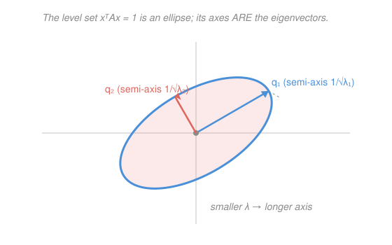

# Linear Algebra · Lesson 5.1: Symmetric matrices, the spectral theorem, and quadratic forms

> ⏱ ~15 min · Module 5: The spectral theorem and SVD · Builds on: [3.2 Diagonalization and matrix powers](03-02-diagonalization.md), [4.3 Gram–Schmidt and QR](04-03-gram-schmidt-qr.md) · Unlocks: 5.2 (the SVD)

## Why this matters

Symmetric matrices are the ones that actually show up: covariance matrices in statistics, Hessians of every smooth function, the moment-of-inertia tensor, the metric of a quadratic energy. They're special because they diagonalize in the *nicest possible way* — no messy oblique change of basis, just a **rotation** into a coordinate system where the matrix is diagonal. That rotation reveals the "grain" of a quadratic function: which directions curve up, which curve down, and how sharply. The single question "are all the eigenvalues positive?" is what the multivariable second-derivative test is secretly asking, and it's the gateway to the SVD in [5.2](05-02-svd.md).

## The idea

In [3.2](03-02-diagonalization.md) you diagonalized $A = PDP^{-1}$ — but $P$ was whatever oblique basis of eigenvectors you could scrape together, and inverting it was work. For a **symmetric** matrix ($A$ equals its own transpose), something magical happens: the eigenvectors come out **perpendicular** to each other for free. So you can choose them to be an *orthonormal* basis, and then the change-of-basis matrix $Q$ is a pure rotation — its inverse is just its transpose, no computation needed. $A = Q\Lambda Q^\top$.

Why care? Feed a symmetric matrix into the machine $q(\mathbf x) = \mathbf x^\top A\mathbf x$ — a **quadratic form**, the multivariable version of $ax^2$. In the original coordinates it's a mess of cross-terms. But rotate into the eigenvector basis and every cross-term vanishes: $q$ becomes a clean weighted sum of squares, $\lambda_1 y_1^2 + \lambda_2 y_2^2 + \cdots$. Now the sign of each eigenvalue tells you everything. All positive → the form is a bowl opening upward (a **minimum**). All negative → a dome (a **maximum**). Mixed signs → a **saddle**. The eigenvectors are the axes of that bowl; the eigenvalues are how steeply it climbs along each one.

## The formal version

**Symmetric matrix.** $A$ is *symmetric* if $A = A^\top$ (entry $a_{ij} = a_{ji}$; it's mirror-image across the diagonal). In words: the matrix reads the same whether you scan by rows or by columns.

**Spectral theorem.** Every real symmetric matrix $A$ has (i) all **real** eigenvalues, and (ii) an **orthonormal basis of eigenvectors**. Equivalently, it factors as

$$A = Q\Lambda Q^\top, \qquad Q^\top Q = I \;(\text{so } Q^{-1} = Q^\top), \qquad \Lambda = \begin{bmatrix} \lambda_1 & & \\ & \ddots & \\ & & \lambda_n \end{bmatrix}.$$

In words: a symmetric matrix is *always* diagonalizable, and you can do it with an **orthogonal** $Q$ (columns = orthonormal eigenvectors, so $Q$ is a rotation/reflection). This is [3.2](03-02-diagonalization.md)'s diagonalization in its best-behaved special case: $P^{-1}$ collapses into the free transpose $Q^\top$. The orthonormal columns are exactly what [4.3](04-03-gram-schmidt-qr.md)'s Gram–Schmidt would build.

**Quadratic form.** For symmetric $A$, the function $q(\mathbf x) = \mathbf x^\top A\mathbf x = \sum_{i,j} a_{ij}x_i x_j$ is a *quadratic form*. In words: a pure degree-2 function of the coordinates — no linear or constant part, just squares and cross-products.

**Diagonalizing the form.** Substitute $A = Q\Lambda Q^\top$ and let $\mathbf y = Q^\top\mathbf x$ (the coordinates of $\mathbf x$ in the eigenbasis):

$$q(\mathbf x) = \mathbf x^\top Q\Lambda Q^\top \mathbf x = (Q^\top\mathbf x)^\top \Lambda (Q^\top\mathbf x) = \mathbf y^\top \Lambda \mathbf y = \lambda_1 y_1^2 + \cdots + \lambda_n y_n^2.$$

In words: in the right rotated coordinates, the cross-terms disappear and $q$ is just a weighted sum of squares, weights $=$ eigenvalues.

**Definiteness.** Reading off the signs:

- **positive definite** — $q(\mathbf x) > 0$ for all $\mathbf x \neq \mathbf 0$ $\iff$ every $\lambda_i > 0$ (an upward bowl);
- **negative definite** — $q < 0$ for all $\mathbf x \neq \mathbf 0$ $\iff$ every $\lambda_i < 0$;
- **indefinite** — $q$ takes both signs $\iff$ eigenvalues of mixed sign (a saddle).

(For a 2×2, an equivalent shortcut — Sylvester's criterion — is positive definite $\iff$ the leading principal minors $a_{11} > 0$ and $\det A > 0$.)

**The level set.** When $A$ is positive definite, $\{\mathbf x : q(\mathbf x) = 1\}$ is an **ellipse** (ellipsoid in higher dimensions). In eigen-coordinates it reads $\lambda_1 y_1^2 + \lambda_2 y_2^2 = 1$, so its principal axes point along the eigenvectors and its semi-axis lengths are $1/\sqrt{\lambda_1}, 1/\sqrt{\lambda_2}$. In words: **big eigenvalue → steep climb → short axis.**

## Picture

## Worked examples

**Example 1 (mechanical — orthogonal diagonalization).** Diagonalize $A = \begin{bmatrix} 3 & 1 \\ 1 & 3 \end{bmatrix}$ as $Q\Lambda Q^\top$.

Eigenvalues: $\det(A - \lambda I) = (3-\lambda)^2 - 1 = \lambda^2 - 6\lambda + 8 = (\lambda-2)(\lambda-4)$, so $\lambda = 4, 2$.

- $\lambda = 4$: $(A - 4I) = \begin{bmatrix} -1 & 1 \\ 1 & -1 \end{bmatrix}$ gives $-x + y = 0$, eigenvector $(1,1)$.
- $\lambda = 2$: $(A - 2I) = \begin{bmatrix} 1 & 1 \\ 1 & 1 \end{bmatrix}$ gives $x + y = 0$, eigenvector $(1,-1)$.

They're already orthogonal ($(1,1)\cdot(1,-1) = 0$) — no accident, that's the spectral theorem. **Normalize** each (divide by its length $\sqrt2$) to get orthonormal columns:

$$Q = \frac{1}{\sqrt2}\begin{bmatrix} 1 & 1 \\ 1 & -1 \end{bmatrix}, \qquad \Lambda = \begin{bmatrix} 4 & 0 \\ 0 & 2 \end{bmatrix}.$$

Check $Q^\top Q = \frac12\begin{bmatrix} 1 & 1 \\ 1 & -1 \end{bmatrix}\begin{bmatrix} 1 & 1 \\ 1 & -1 \end{bmatrix} = \frac12\begin{bmatrix} 2 & 0 \\ 0 & 2 \end{bmatrix} = I$ ✓. So $Q^{-1} = Q^\top$ for free.

**Example 2 (why you'd care — classify a quadratic form).** Classify $q(x,y) = 2x^2 + 4xy + 5y^2$ and describe the curve $q = 1$.

First read off the matrix — the diagonal entries are the pure-square coefficients, and each cross-term coefficient is **split in half** across the two off-diagonal slots (so the matrix stays symmetric):

$$q(\mathbf x) = \mathbf x^\top A \mathbf x, \qquad A = \begin{bmatrix} 2 & 2 \\ 2 & 5 \end{bmatrix}.$$

Eigenvalues: $\det(A - \lambda I) = (2-\lambda)(5-\lambda) - 4 = \lambda^2 - 7\lambda + 6 = (\lambda - 1)(\lambda - 6)$, so $\lambda = 6, 1$. Both **positive** → $q$ is **positive definite** (a bowl; its only minimum is at the origin). Equivalently by Sylvester: $a_{11} = 2 > 0$ and $\det A = 10 - 4 = 6 > 0$. ✓

The level set $q = 1$ is therefore an **ellipse**. In eigen-coordinates it is $6y_1^2 + y_2^2 = 1$: semi-axis $1/\sqrt6 \approx 0.41$ along the $\lambda = 6$ eigenvector $(1,2)/\sqrt5$, and semi-axis $1/\sqrt1 = 1$ along the $\lambda = 1$ eigenvector $(2,-1)/\sqrt5$. The steep direction ($\lambda = 6$) is the short axis — exactly the picture above. This is precisely the setup of the second-derivative test: if this $A$ were the Hessian of some $f$ at a critical point, positive definite would certify a **local minimum**.

## Watch out

- You might think reading $q$ into a matrix just puts the $xy$ coefficient in one corner. **Split it in half**: $q = 4xy$ needs $a_{12} = a_{21} = 2$, not $4$ and $0$. Only the symmetric split makes $\mathbf x^\top A\mathbf x$ reproduce $q$ and gives real eigenvalues.
- You might think you must invert $Q$. For an *orthogonal* $Q$, $Q^{-1} = Q^\top$ — but this only holds once the eigenvectors are **normalized to unit length**. An orthogonal-but-not-normalized eigenvector matrix is not orthogonal, and $Q^\top Q \neq I$.
- You might think "$q = 1$ is an ellipse." Only when $A$ is positive (or negative) definite. **Indefinite** eigenvalues make $q = 1$ a **hyperbola** (a saddle's contour), and a zero eigenvalue degenerates it into a pair of lines.

## One-liner

> A symmetric matrix rotates into a diagonal one, $A = Q\Lambda Q^\top$, so its quadratic form is a weighted sum of squares $\sum\lambda_i y_i^2$ — and the signs of the eigenvalues decide bowl, dome, or saddle.

## Problems

**P1 (🟢)** Orthogonally diagonalize $A = \begin{bmatrix} 2 & 1 \\ 1 & 2 \end{bmatrix}$: find $Q$ (orthonormal columns) and $\Lambda$ with $A = Q\Lambda Q^\top$. Verify $Q^\top Q = I$ and $Q\Lambda Q^\top = A$.

**P2 (🟡)** For each symmetric matrix, classify the quadratic form (definite / indefinite?) and describe the level set $q = 1$ (which conic, and its axes):
(a) $A = \begin{bmatrix} 5 & 2 \\ 2 & 5 \end{bmatrix}$; (b) $B = \begin{bmatrix} 1 & 2 \\ 2 & 1 \end{bmatrix}$.

**P3 (🔴, optional)** Prove that every eigenvalue of a symmetric **positive definite** matrix $A$ is positive. Then state, in one line, why this is exactly the multivariable second-derivative test of [`calc-refresher` 4.2](../../calc-refresher/lessons/04-02-multivariable-optimization-lagrange.md) (Hessian positive definite ⟺ local minimum).

Solutions

**P1** Eigenvalues: $\det(A - \lambda I) = (2-\lambda)^2 - 1 = \lambda^2 - 4\lambda + 3 = (\lambda-1)(\lambda-3)$, so $\lambda = 3, 1$.

- $\lambda = 3$: $(A - 3I) = \begin{bmatrix} -1 & 1 \\ 1 & -1 \end{bmatrix} \Rightarrow x = y$, eigenvector $(1,1)$.
- $\lambda = 1$: $(A - I) = \begin{bmatrix} 1 & 1 \\ 1 & 1 \end{bmatrix} \Rightarrow x = -y$, eigenvector $(1,-1)$.

Orthogonal ($(1,1)\cdot(1,-1) = 0$); normalize by $\sqrt2$:

$$Q = \frac{1}{\sqrt2}\begin{bmatrix} 1 & 1 \\ 1 & -1 \end{bmatrix}, \qquad \Lambda = \begin{bmatrix} 3 & 0 \\ 0 & 1 \end{bmatrix}.$$

Verify $Q^\top Q = \frac12\begin{bmatrix} 1 & 1 \\ 1 & -1 \end{bmatrix}\begin{bmatrix} 1 & 1 \\ 1 & -1 \end{bmatrix} = \frac12\begin{bmatrix} 2 & 0 \\ 0 & 2 \end{bmatrix} = I$ ✓.

Verify $Q\Lambda Q^\top$: first $Q\Lambda = \frac{1}{\sqrt2}\begin{bmatrix} 3 & 1 \\ 3 & -1 \end{bmatrix}$, then

$$Q\Lambda Q^\top = \frac12\begin{bmatrix} 3 & 1 \\ 3 & -1 \end{bmatrix}\begin{bmatrix} 1 & 1 \\ 1 & -1 \end{bmatrix} = \frac12\begin{bmatrix} 4 & 2 \\ 2 & 4 \end{bmatrix} = \begin{bmatrix} 2 & 1 \\ 1 & 2 \end{bmatrix} = A. \checkmark$$

**P2** (a) $\det(A - \lambda I) = (5-\lambda)^2 - 4 = \lambda^2 - 10\lambda + 21 = (\lambda-3)(\lambda-7)$, so $\lambda = 7, 3$ — both **positive**, so $q$ is **positive definite**. The level set $q = 1$ is an **ellipse**; in eigen-coordinates $7y_1^2 + 3y_2^2 = 1$, with semi-axis $1/\sqrt7 \approx 0.38$ along the $\lambda = 7$ eigenvector $(1,1)/\sqrt2$ and semi-axis $1/\sqrt3 \approx 0.58$ along the $\lambda = 3$ eigenvector $(1,-1)/\sqrt2$. (Check via Sylvester: $a_{11} = 5 > 0$, $\det = 21 > 0$ ✓.)

(b) $\det(B - \lambda I) = (1-\lambda)^2 - 4 = \lambda^2 - 2\lambda - 3 = (\lambda-3)(\lambda+1)$, so $\lambda = 3, -1$ — **mixed signs**, so $q$ is **indefinite** (a saddle). The level set is $3y_1^2 - y_2^2 = 1$, a **hyperbola**, opening along the $\lambda = 3$ eigenvector $(1,1)/\sqrt2$. (Sylvester confirms non-definite: $\det B = 1 - 4 = -3 < 0$.)

**P3** Let $\lambda$ be any eigenvalue of $A$ with a nonzero eigenvector $\mathbf v$, so $A\mathbf v = \lambda\mathbf v$. Left-multiply by $\mathbf v^\top$:

$$\mathbf v^\top A \mathbf v = \mathbf v^\top(\lambda\mathbf v) = \lambda\,\mathbf v^\top\mathbf v = \lambda\,\lVert\mathbf v\rVert^2.$$

Positive definiteness says the left side $\mathbf v^\top A\mathbf v > 0$ (since $\mathbf v \neq \mathbf 0$), and $\lVert\mathbf v\rVert^2 > 0$. Solving,

$$\lambda = \frac{\mathbf v^\top A\mathbf v}{\lVert\mathbf v\rVert^2} > 0.$$

So every eigenvalue is positive. (The converse also holds via the spectral theorem: if all $\lambda_i > 0$ then $q(\mathbf x) = \sum\lambda_i y_i^2 > 0$ for $\mathbf x \neq \mathbf 0$.)

*The bridge:* at a critical point of a smooth $f$, the Hessian $H$ is symmetric (equal mixed partials), and Taylor's theorem gives $f(\mathbf x_0 + \mathbf h) \approx f(\mathbf x_0) + \tfrac12\,\mathbf h^\top H\,\mathbf h$. So the point is a **local minimum exactly when $H$ is positive definite** — i.e. all its eigenvalues are positive, so the quadratic form curves upward in every direction. The second-derivative test *is* a definiteness check.

## Flashback

**From Lesson 3.1 (Eigenvalues and eigenvectors):** Find the eigenvalues and eigenvectors of the *non-symmetric* $B = \begin{bmatrix} 2 & 1 \\ 0 & 3 \end{bmatrix}$. Are its eigenvectors orthogonal? Contrast with what today's theorem guarantees.

Solution

$B$ is upper triangular, so its eigenvalues are the diagonal entries: $\lambda = 2, 3$.

- $\lambda = 2$: $(B - 2I) = \begin{bmatrix} 0 & 1 \\ 0 & 1 \end{bmatrix} \Rightarrow y = 0$, eigenvector $(1, 0)$.
- $\lambda = 3$: $(B - 3I) = \begin{bmatrix} -1 & 1 \\ 0 & 0 \end{bmatrix} \Rightarrow x = y$, eigenvector $(1, 1)$.

Dot product $(1,0)\cdot(1,1) = 1 \neq 0$ — **not orthogonal**. That's allowed precisely because $B \neq B^\top$. The spectral theorem's guarantee of *perpendicular* eigenvectors is a payoff of symmetry alone; drop symmetry and you're back to the oblique eigenvectors of [3.2](03-02-diagonalization.md), where $P^{-1} \neq P^\top$.

## Connections

- **Backward:** this is [3.2](03-02-diagonalization.md)'s $A = PDP^{-1}$ in its cleanest case — symmetry forces the eigenvector matrix to be **orthogonal**, so $P^{-1}$ becomes the free transpose $Q^\top$, and the orthonormal columns are what [4.3](04-03-gram-schmidt-qr.md)'s Gram–Schmidt manufactures.
- **Forward:** [5.2](05-02-svd.md) drops the symmetry requirement — the SVD applies the spectral theorem to $A^\top A$ (always symmetric positive semidefinite) to factor *any* matrix as rotate–stretch–rotate; today's ellipse becomes the image ellipsoid.
- **Sideways (calculus):** the Hessian's definiteness in [`calc-refresher` 4.2](../../calc-refresher/lessons/04-02-multivariable-optimization-lagrange.md) *is* this lesson — positive definite Hessian ⟺ local minimum, indefinite ⟺ saddle. The eigenvalues are the principal curvatures of $f$ at the critical point.
- **Sideways (stats/physics):** covariance matrices are symmetric positive semidefinite, and their spectral decomposition is **principal component analysis** — eigenvectors are the axes of the data ellipsoid, eigenvalues the variance along each. The same math is the inertia tensor's principal axes in mechanics.
