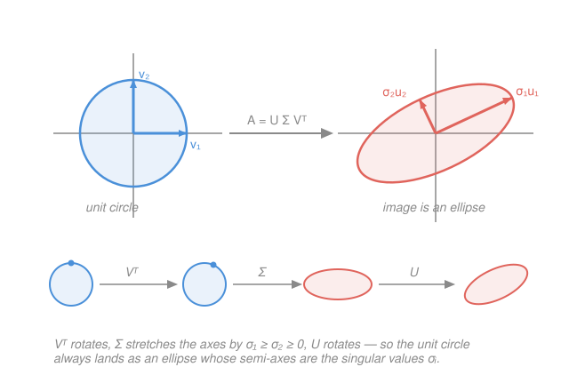

# Linear Algebra · Lesson 5.2: The singular value decomposition

> ⏱ ~15 min · Module 5: The spectral theorem and SVD · Builds on: [5.1 Symmetric matrices, the spectral theorem, and quadratic forms](05-01-spectral-theorem-quadratic-forms.md), [3.1 Eigenvalues and eigenvectors](03-01-eigenvalues-eigenvectors.md) · Unlocks: real-analysis, ML/stats, quantum mechanics (course complete)

## Why this matters

Eigenvalues ([3.1](03-01-eigenvalues-eigenvectors.md)) and the spectral theorem ([5.1](05-01-spectral-theorem-quadratic-forms.md)) are gorgeous — but they only work for *square* matrices, and even then only sometimes (a matrix has to be diagonalizable). Real data comes in rectangular tables: 10,000 users × 500 movies, a photo as a grid of pixels, an experiment with more measurements than parameters. The **singular value decomposition** is the one factorization that works for **every** matrix — square or not, invertible or not — and it reads off the map's true geometry: which directions it stretches, and by how much. It is the engine under PCA, image compression, recommender systems, and the least-squares pseudo-inverse from [4.2](04-02-projection-least-squares.md). If you keep one tool from this course, keep this one.

## The idea

Take any linear map and feed it the **unit circle** (in higher dimensions, the unit sphere). What comes out? Always an **ellipse** (ellipsoid). That is the whole geometric content of the SVD: *every* linear map, no matter how tangled it looks in coordinates, does exactly three clean things in a row — **rotate, stretch along axes, rotate again**.

- First a rotation/reflection ($V^\top$) swings a special orthonormal input frame onto the coordinate axes.
- Then a pure axis-aligned stretch ($\Sigma$) scales each axis by a factor $\sigma_i$ — turning the circle into an axis-aligned ellipse.
- Then another rotation/reflection ($U$) swings that ellipse into its final pose.

The stretch factors $\sigma_1 \ge \sigma_2 \ge \cdots \ge 0$ are the **singular values** — the semi-axis lengths of the output ellipse. They are the map's honest "how much do I stretch" numbers, measured along the *right* pair of orthonormal frames so that no shearing is left over to confuse the picture.

## The formal version

**Singular value decomposition.** Every $m\times n$ matrix $A$ factors as

$$A = U\,\Sigma\,V^\top,$$

where:
- $V$ is $n\times n$ **orthogonal** ($V^\top V = I$) — its columns $\mathbf v_1,\dots,\mathbf v_n$ are the **right singular vectors**, an orthonormal frame in the *input* space.
- $\Sigma$ is $m\times n$ **diagonal**, with entries $\sigma_1 \ge \sigma_2 \ge \cdots \ge 0$ down the diagonal — the **singular values**.
- $U$ is $m\times m$ **orthogonal** ($U^\top U = I$) — its columns $\mathbf u_1,\dots,\mathbf u_m$ are the **left singular vectors**, an orthonormal frame in the *output* space.

In words: read right to left — $V^\top$ rotates, $\Sigma$ stretches each axis by $\sigma_i$, $U$ rotates. The image of the unit sphere is the ellipsoid with semi-axes $\sigma_i \mathbf u_i$.

**Where it comes from (this is the payoff of [5.1](05-01-spectral-theorem-quadratic-forms.md)).** Suppose $A = U\Sigma V^\top$. Then

$$A^\top A = (U\Sigma V^\top)^\top (U\Sigma V^\top) = V\,\Sigma^\top U^\top U\,\Sigma\, V^\top = V\,(\Sigma^\top\Sigma)\,V^\top.$$

But $A^\top A$ is **symmetric and positive semidefinite** — exactly the objects the spectral theorem handles. So this *is* its spectral decomposition, and by matching pieces:

$$\boxed{\;\sigma_i = \sqrt{\lambda_i(A^\top A)}\;,\qquad \mathbf v_i = \text{eigenvectors of } A^\top A,\qquad \mathbf u_i = \frac{1}{\sigma_i}\,A\mathbf v_i\;}$$

In words: the $\mathbf v_i$ are the eigen-directions of $A^\top A$; the singular values are the square roots of its eigenvalues (real and $\ge 0$ because $A^\top A$ is PSD — you're never taking $\sqrt{\text{negative}}$); and each output axis $\mathbf u_i$ is just where $A$ sends $\mathbf v_i$, renormalized. The $\mathbf u_i$ come out orthonormal for free — they're the eigenvectors of $AA^\top$.

**SVD vs. eigen-decomposition.** Diagonalization $A = PDP^{-1}$ needs $A$ square, needs enough eigenvectors, and $P$ is generally *not* orthogonal. The SVD asks for none of that: it exists for **every** matrix, uses **two** orthonormal frames instead of one skewed one, and its "diagonal" $\Sigma$ is real and nonnegative. When $A$ is symmetric the two nearly coincide (Problem 3).

**Low-rank approximation.** Expanding the product columnwise,

$$A = \sum_{i} \sigma_i\, \mathbf u_i \mathbf v_i^\top,\qquad\text{and truncating to the top } k:\quad A_k = \sum_{i\le k}\sigma_i\,\mathbf u_i\mathbf v_i^\top$$

is the **best** rank-$k$ approximation of $A$ (Eckart–Young). In words: keep the few largest singular values and you keep almost all of the matrix. That single sentence *is* PCA (keep the top principal directions) and image compression (a 1000×1000 photo stored as its top 50 singular terms).

## Picture

## Worked examples

**Example 1 (mechanical — singular values of a shear).** Let $A = \begin{bmatrix} 1 & 1 \\ 0 & 1 \end{bmatrix}$ (a horizontal shear). It has *no* interesting eigenvalues — both are $1$, and it isn't even diagonalizable. But its singular values are alive and well. Form

$$A^\top A = \begin{bmatrix} 1 & 0 \\ 1 & 1 \end{bmatrix}\begin{bmatrix} 1 & 1 \\ 0 & 1 \end{bmatrix} = \begin{bmatrix} 1 & 1 \\ 1 & 2 \end{bmatrix}.$$

Eigenvalues: trace $=3$, det $=1$, so $\lambda = \frac{3\pm\sqrt{5}}{2}$. Hence

$$\sigma_1 = \sqrt{\tfrac{3+\sqrt5}{2}} = \varphi \approx 1.618,\qquad \sigma_2 = \sqrt{\tfrac{3-\sqrt5}{2}} = \tfrac{1}{\varphi}\approx 0.618.$$

The golden ratio, out of a plain shear. Sanity check: $\sigma_1\sigma_2 = \sqrt{\det(A^\top A)} = \sqrt{1} = 1 = |\det A|$ — the product of singular values is always the volume-scaling factor $|\det A|$. Geometrically, the shear stretches the unit circle into an ellipse $1.618$ long and $0.618$ thin, area preserved.

**Example 2 (why you'd care — a rank-1 matrix is one outer product).** Let $A = \begin{bmatrix} 1 & 2 \\ 2 & 4 \end{bmatrix}$. Row 2 is twice row 1, so this map collapses the plane onto a line — rank 1. Then

$$A^\top A = \begin{bmatrix} 5 & 10 \\ 10 & 20 \end{bmatrix},\qquad \text{eigenvalues } \lambda = 25,\ 0.$$

So $\sigma_1 = 5$ and $\sigma_2 = 0$. The lone direction: for $\lambda=25$, $\mathbf v_1 = \tfrac{1}{\sqrt5}(1,2)$, and $\mathbf u_1 = \tfrac{1}{\sigma_1}A\mathbf v_1 = \tfrac{1}{5}\cdot\tfrac{1}{\sqrt5}(5,10) = \tfrac{1}{\sqrt5}(1,2)$. The entire matrix is a single term:

$$A = \sigma_1 \mathbf u_1\mathbf v_1^\top = 5\cdot\tfrac{1}{\sqrt5}\begin{bmatrix}1\\2\end{bmatrix}\cdot\tfrac{1}{\sqrt5}\begin{bmatrix}1 & 2\end{bmatrix} = \begin{bmatrix}1 & 2\\ 2 & 4\end{bmatrix}.\ \checkmark$$

A zero singular value means a collapsed direction (the null space, from [4.2](04-02-projection-least-squares.md)'s four-subspaces world). This is the atom of compression: a rank-1 matrix costs one column + one row to store instead of the full grid, and every low-rank approximation is a sum of exactly these atoms, largest $\sigma_i$ first.

## Watch out

- You might think singular values are just the absolute values of eigenvalues. **Only when $A$ is symmetric** (Problem 3). In general $A$ may have complex eigenvalues, or none usable, while its singular values are always real, nonnegative, and sorted — because they live on $A^\top A$, not on $A$.
- You might think $\Sigma$ being "diagonal" makes $A$ diagonal-ish. No — the diagonal stretch is sandwiched between two *rotations* $U$ and $V^\top$. Drop those and you lose the whole map. The magic is that the messiness of $A$ is entirely explained by a choice of two orthonormal frames.
- You might forget to **sort**: singular values go $\sigma_1 \ge \sigma_2 \ge \cdots$, and the columns of $U,V$ must be permuted to match. Low-rank approximation only means "keep the top few" if they're ordered.
- You might write $\mathbf u_i = \tfrac{1}{\sigma_i}A\mathbf v_i$ when $\sigma_i = 0$. That's a $\tfrac{0}{0}$ — the zero-singular-value $\mathbf u_i$'s are filled in separately (any orthonormal completion), since they span the part of the output space the map never reaches.

## One-liner

> Every matrix is a rotation, then an axis-aligned stretch by its singular values, then another rotation — and $A^\top A$ (symmetric, PSD) hands you all three.

## Problems

**P1 (🟢)** Find the singular values of $A = \begin{bmatrix} 2 & 0 \\ 3 & 2 \end{bmatrix}$ by computing the eigenvalues of $A^\top A$. Check your answer against $\sigma_1\sigma_2 = |\det A|$.

**P2 (🟡)** Compute a full SVD $A = U\Sigma V^\top$ of $A = \begin{bmatrix} 2 & 2 \\ -1 & 1 \end{bmatrix}$: find $V$ from the eigenvectors of $A^\top A$, then $\sigma_i$, then $\mathbf u_i = A\mathbf v_i/\sigma_i$. Verify by checking $V^\top V = I$, $U^\top U = I$, and that $U\Sigma V^\top$ reconstructs $A$. *(This is the second half of Boss problem 5.)*

**P3 (🔴, optional)** Let $A = \begin{bmatrix} 1 & 2 \\ 2 & 1 \end{bmatrix}$ (symmetric).
(a) Find its eigenvalues and eigenvectors (spectral theorem, [5.1](05-01-spectral-theorem-quadratic-forms.md)).
(b) Explain why $\sigma_i = |\lambda_i|$ for a symmetric matrix, and give the singular values.
(c) Write the best rank-1 approximation $A_1 = \sigma_1\mathbf u_1\mathbf v_1^\top$ and interpret what it captures (the PCA / compression reading).

Solutions

**P1** Form $A^\top A = \begin{bmatrix} 2 & 3 \\ 0 & 2 \end{bmatrix}\begin{bmatrix} 2 & 0 \\ 3 & 2 \end{bmatrix} = \begin{bmatrix} 13 & 6 \\ 6 & 4 \end{bmatrix}$. Trace $=17$, det $=52-36=16$, so

$$\lambda = \frac{17\pm\sqrt{17^2-4\cdot16}}{2} = \frac{17\pm\sqrt{225}}{2} = \frac{17\pm 15}{2} = 16,\ 1.$$

Hence $\sigma_1 = \sqrt{16} = 4$, $\sigma_2 = \sqrt{1} = 1$. Check: $\sigma_1\sigma_2 = 4 = |\det A| = |2\cdot2 - 0\cdot3| = 4$. ✓

**P2** **Step 1 — $A^\top A$ and $V$.**

$$A^\top A = \begin{bmatrix} 2 & -1 \\ 2 & 1 \end{bmatrix}\begin{bmatrix} 2 & 2 \\ -1 & 1 \end{bmatrix} = \begin{bmatrix} 5 & 3 \\ 3 & 5 \end{bmatrix}.$$

Eigenvalues: trace $=10$, det $=25-9=16$, so $\lambda = 5\pm 3 = 8,\ 2$. Eigenvectors: for $\lambda=8$, $(5-8)x+3y=0\Rightarrow y=x$, so $\mathbf v_1 = \tfrac{1}{\sqrt2}(1,1)$; for $\lambda=2$, $y=-x$, so $\mathbf v_2 = \tfrac{1}{\sqrt2}(1,-1)$. Thus

$$V = \frac{1}{\sqrt2}\begin{bmatrix} 1 & 1 \\ 1 & -1 \end{bmatrix},\qquad \Sigma = \begin{bmatrix} \sqrt8 & 0 \\ 0 & \sqrt2 \end{bmatrix} = \begin{bmatrix} 2\sqrt2 & 0 \\ 0 & \sqrt2 \end{bmatrix}.$$

**Step 2 — $U$ from $\mathbf u_i = A\mathbf v_i/\sigma_i$.**

$$A\mathbf v_1 = \tfrac{1}{\sqrt2}\begin{bmatrix} 2+2 \\ -1+1\end{bmatrix} = \tfrac{1}{\sqrt2}\begin{bmatrix} 4 \\ 0\end{bmatrix} = \begin{bmatrix} 2\sqrt2 \\ 0\end{bmatrix},\quad \mathbf u_1 = \frac{A\mathbf v_1}{2\sqrt2} = \begin{bmatrix} 1 \\ 0\end{bmatrix}.$$

$$A\mathbf v_2 = \tfrac{1}{\sqrt2}\begin{bmatrix} 2-2 \\ -1-1\end{bmatrix} = \tfrac{1}{\sqrt2}\begin{bmatrix} 0 \\ -2\end{bmatrix} = \begin{bmatrix} 0 \\ -\sqrt2\end{bmatrix},\quad \mathbf u_2 = \frac{A\mathbf v_2}{\sqrt2} = \begin{bmatrix} 0 \\ -1\end{bmatrix}.$$

So $U = \begin{bmatrix} 1 & 0 \\ 0 & -1\end{bmatrix}$ (a reflection).

**Step 3 — verify.** $V^\top V = I$ since columns are orthonormal ($\mathbf v_1\cdot\mathbf v_2 = \tfrac12(1-1)=0$, each unit). $U^\top U = I$ likewise. Reconstruct (note $V^\top = V$ here):

$$\Sigma V^\top = \begin{bmatrix} 2\sqrt2 & 0 \\ 0 & \sqrt2\end{bmatrix}\cdot\tfrac{1}{\sqrt2}\begin{bmatrix} 1 & 1 \\ 1 & -1\end{bmatrix} = \begin{bmatrix} 2 & 2 \\ 1 & -1\end{bmatrix},$$

$$U\Sigma V^\top = \begin{bmatrix} 1 & 0 \\ 0 & -1\end{bmatrix}\begin{bmatrix} 2 & 2 \\ 1 & -1\end{bmatrix} = \begin{bmatrix} 2 & 2 \\ -1 & 1\end{bmatrix} = A.\ \checkmark$$

Geometry: $A$ rotates the input frame by $45^\circ$ ($V^\top$), stretches by $2\sqrt2$ and $\sqrt2$ ($\Sigma$), then reflects across the $x$-axis ($U$).

**P3** (a) Symmetric, so use the spectral theorem. Trace $=2$, det $=1-4=-3$, so $\lambda = \frac{2\pm\sqrt{4+12}}{2} = 1\pm 2 = 3,\ -1$. Eigenvectors: for $\lambda=3$, $(1-3)x+2y=0\Rightarrow y=x$, $\mathbf q_1 = \tfrac{1}{\sqrt2}(1,1)$; for $\lambda=-1$, $y=-x$, $\mathbf q_2 = \tfrac{1}{\sqrt2}(1,-1)$. So $A = Q\Lambda Q^\top$ with $\Lambda = \operatorname{diag}(3,-1)$.

(b) For symmetric $A = Q\Lambda Q^\top$, compute $A^\top A = A^2 = Q\Lambda^2 Q^\top$, whose eigenvalues are $\lambda_i^2$. Hence $\sigma_i = \sqrt{\lambda_i^2} = |\lambda_i|$. Here $\sigma_1 = |3| = 3$, $\sigma_2 = |-1| = 1$ (re-sorted, largest first). The negative sign doesn't vanish — it gets absorbed into $U$: $\mathbf v_1 = \mathbf q_1$ and $\mathbf u_1 = A\mathbf q_1/3 = 3\mathbf q_1/3 = \mathbf q_1$, while $\mathbf v_2 = \mathbf q_2$ but $\mathbf u_2 = A\mathbf q_2/1 = -\mathbf q_2$ (the flip is exactly why $\sigma = |\lambda|$, not $\lambda$).

(c) $A_1 = \sigma_1\mathbf u_1\mathbf v_1^\top = 3\,\mathbf q_1\mathbf q_1^\top = 3\cdot\tfrac12\begin{bmatrix} 1 & 1 \\ 1 & 1\end{bmatrix} = \begin{bmatrix} 1.5 & 1.5 \\ 1.5 & 1.5\end{bmatrix}$. It keeps only the dominant "$(1,1)$ direction" — the axis of strongest stretch, where both coordinates move together — and discards the smaller $\sigma_2=1$ correction along $(1,-1)$. In PCA terms, $\mathbf q_1$ is the first principal direction (most variance / signal), and $A_1$ is the rank-1 snapshot you'd store or plot if forced to pick one direction.

## Flashback

**From Lesson 5.1 (Spectral theorem and quadratic forms):** Orthogonally diagonalize $A = \begin{bmatrix} 2 & 1 \\ 1 & 2 \end{bmatrix}$ as $A = Q\Lambda Q^\top$, and classify the quadratic form $\mathbf x^\top A\mathbf x$ (positive definite, indefinite, …?).

Solution

Symmetric, so real eigenvalues with orthogonal eigenvectors. Trace $=4$, det $=4-1=3$, so $\lambda = \frac{4\pm\sqrt{16-12}}{2} = 2\pm 1 = 3,\ 1$. Eigenvectors: $\lambda=3\Rightarrow y=x\Rightarrow \mathbf q_1=\tfrac{1}{\sqrt2}(1,1)$; $\lambda=1\Rightarrow y=-x\Rightarrow \mathbf q_2=\tfrac{1}{\sqrt2}(1,-1)$. So

$$Q = \frac{1}{\sqrt2}\begin{bmatrix} 1 & 1 \\ 1 & -1\end{bmatrix},\qquad \Lambda = \begin{bmatrix} 3 & 0 \\ 0 & 1\end{bmatrix},\qquad A = Q\Lambda Q^\top.$$

Both eigenvalues are positive, so $\mathbf x^\top A\mathbf x > 0$ for all $\mathbf x\ne\mathbf 0$: **positive definite**. (And since $A$ is symmetric PSD, its singular values equal its eigenvalues, $3$ and $1$ — a preview of this lesson.)

## Connections

- **Backward:** the SVD *is* the spectral theorem of [5.1](05-01-spectral-theorem-quadratic-forms.md) applied to $A^\top A$ (symmetric, PSD) — that's where $V$, the $\sigma_i^2$, and the guarantee of real nonnegative stretch factors come from. The singular vectors are orthonormal frames built exactly like the orthonormal bases of [4.2](04-02-projection-least-squares.md)/[4.3](04-03-gram-schmidt-qr.md); a zero singular value marks the null space.
- **Forward (course complete!):** the SVD is the workhorse downstream. In **ML/stats**, PCA is the SVD of a centered data matrix and low-rank approximation is dimensionality reduction; the pseudo-inverse $A^+ = V\Sigma^+U^\top$ solves the least-squares problem of [4.2](04-02-projection-least-squares.md) even when $A^\top A$ is singular. In **quantum mechanics**, the SVD of a bipartite state is the Schmidt decomposition, and its singular values quantify entanglement. In **real analysis / numerics**, $\sigma_1/\sigma_n$ is the condition number governing how errors amplify.
- **Sideways (data compression):** every JPEG-style low-rank image approximation, every "top-$k$ latent factors" recommender, is $A \approx \sum_{i\le k}\sigma_i\mathbf u_i\mathbf v_i^\top$ — the same three lines of algebra, wearing an application's clothes.
