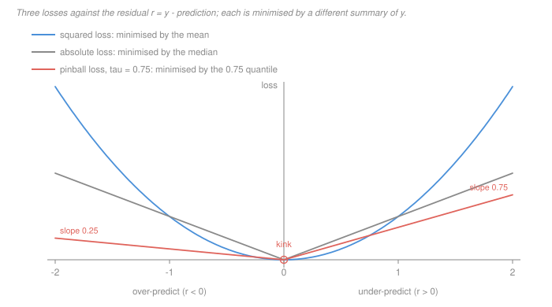

# Machine Learning · Lesson 1.1: The learning problem

> ⏱ ~15 min · Module 1: Foundations and linear models · Builds on: [prob-stat-refresher](../../prob-stat-refresher/syllabus.md) (expectation, conditioning) · Unlocks: [1.2 (generalization and the bias–variance trade-off)](01-02-generalization-and-the-bias-variance-tradeoff.md)

## Why this matters

Almost every machine-learning course opens with vocabulary: features, labels, hypothesis class, loss, risk. The vocabulary is worth ten minutes, but it is not what goes wrong in practice. What goes wrong is this:

> The loss function is a **modelling decision with consequences**, and choosing it by default is the most common unforced error in applied machine learning.

A loss is the sentence "here is what a mistake costs me." Everything downstream — which model wins a comparison, which hyperparameter cross-validation selects, which of two engineers gets promoted — is the answer to *that* question and no other. Pick the wrong loss and every subsequent step is executed flawlessly on the wrong problem. So this lesson teaches the vocabulary through the decision it exists to support, and the punchline is a fact you can compute: **different losses are minimised by different summaries of the same data**, and you can say in advance which summary each one gives you.

## The idea

One customer, five past deliveries, in minutes:

$$\{20,\ 22,\ 25,\ 28,\ 95\}$$

Four normal evenings and one snowstorm. You must quote this customer a single number. Which?

- If you are scored by **squared** error, the best single number is the **mean**, $38$.
- If you are scored by **absolute** error, it is the **median**, $25$.

Stop on the first one. Thirty-eight minutes is *larger than four of the five observations you have*. Squared loss did not malfunction; it did exactly its job, which is to be terrified of the 95. But if what you actually needed was "the time this delivery will probably take," squared loss quietly answered a different question — and it will keep answering that different question through every model you fit, every feature you add, and every comparison you run.

Nothing here is about a model yet. There are no features and no parameters — just five numbers and a choice. That is the point: the loss is upstream of everything.

## The formal version

**The setup.** There is a distribution $\mathcal D$ over pairs $(x, y)$: $x \in \mathcal X$ is the **feature vector** (what you get to see), $y \in \mathcal Y$ is the **label** (what you want to know). You never see $\mathcal D$. You see a **sample**

$$S = \{(x_1,y_1),\dots,(x_n,y_n)\} \overset{\text{i.i.d.}}{\sim} \mathcal D .$$

A **hypothesis** is a function $h : \mathcal X \to \mathcal Y$; the **hypothesis class** $\mathcal H$ is the set of hypotheses you are willing to consider (all lines, all depth-3 trees, all neural nets of a given shape). A **loss** $\ell(\hat y, y) \ge 0$ says what predicting $\hat y$ costs when the truth is $y$.

**Risk and empirical risk.** The [risk](../reference.md#empirical-risk) of a hypothesis is its expected loss on a fresh draw, and the empirical risk is its average loss on the sample you have:

$$R(h) = \mathbb E_{(x,y)\sim\mathcal D}\big[\ell(h(x), y)\big], \qquad \hat R_S(h) = \frac1n\sum_{i=1}^n \ell(h(x_i), y_i).$$

*In words:* $R$ is what you want and cannot compute; $\hat R_S$ is what you can compute and do not want. **Empirical risk minimisation** (ERM) is the leap of faith that minimising the second gets you a small value of the first:

$$\hat h = \arg\min_{h \in \mathcal H} \hat R_S(h).$$

**Supervised** learning is this problem — labels are given. **Unsupervised** learning drops $y$ entirely and asks for structure in the $x$'s alone (Module 3: PCA, clustering, mixtures), which means there is no ground truth to be scored against and the loss must be invented rather than read off the business.

**Stated here, proved elsewhere.** Restricting to a class $\mathcal H$ is not a convenience — it is the only reason learning is possible. The **no-free-lunch** theorem says that averaged over all data-generating distributions, every learning algorithm has the same expected error; so any algorithm that beats another on real problems does so because its class encodes an assumption (an **inductive bias**) that happens to be true of those problems. The proof, and the PAC/VC machinery that quantifies when $\hat R_S$ tracks $R$, belong to [`statistical-learning`](../../statistical-learning/syllabus.md) (not yet built; stated here where it is used).

**The analytical fact this lesson turns on.** Minimise the risk over *all* functions, not just over $\mathcal H$. Because $\ell$ is applied pointwise, this decouples: for each $x$ you are choosing one number $c$ to minimise $\mathbb E[\ell(c, Y) \mid X = x]$. And that one-dimensional problem has a known answer for each of the three losses below.

| loss $\ell(c, y)$ | risk minimiser $h^*(x)$ |
|---|---|
| $(c-y)^2$ | $\mathbb E[Y \mid X = x]$, the conditional **mean** |
| $\lvert c-y\rvert$ | a conditional **median** of $Y$ |
| pinball at level $\tau$ | the conditional $\tau$-**quantile** of $Y$ |

The reasons are each one line. Write $r = y - c$ for the residual (positive means you *under*-predicted), and use [expectation](../../prob-stat-refresher/lessons/02-01-expectation-variance-moments.md):

- **Squared.** $\frac{d}{dc}\mathbb E[(Y-c)^2] = -2\,\mathbb E[Y-c]$, which vanishes exactly at $c = \mathbb E Y$.
- **Absolute.** $\frac{d}{dc}\mathbb E\lvert Y-c\rvert = \Pr(Y<c) - \Pr(Y>c)$, which vanishes when $c$ splits the mass in half — a median. (At a point mass this is a subgradient, hence "a" median: the minimiser can be an interval.)
- **Pinball.** The [pinball loss](../reference.md#pinball-loss) at level $\tau \in (0,1)$ is

$$\ell_\tau(r) = \tau\, r^{+} + (1-\tau)\, r^{-}, \qquad r^{+} = \max(r, 0),\quad r^{-} = \max(-r, 0),$$

  so under-predicting is charged $\tau$ per minute and over-predicting $1-\tau$. Then

$$\frac{d}{dc}\,\mathbb E[\ell_\tau(Y-c)] = -\tau\Pr(Y>c) + (1-\tau)\Pr(Y<c) = F(c) - \tau,$$

  which vanishes at $c = F^{-1}(\tau)$: the $\tau$-quantile. Setting $\tau = 1/2$ recovers half the absolute loss, and with it the median.

*In words:* the loss you pick decides **which summary of the conditional distribution your model is trying to estimate**. Squared loss is not "the accurate one" and absolute loss is not "the robust one" — they are estimators of two different quantities, and only one of them is the number your problem is asking for.

## Picture

Read the three curves as three different opinions about mistakes. The parabola says a mistake of 10 is a hundred times worse than a mistake of 1 — that convexity is what drags the answer up toward the 95. The V says a mistake of 10 is ten times worse than a mistake of 1, full stop. The tilted V says the same, but charges three times as much on the right-hand (under-prediction) side as on the left.

Note the **kink** at $r = 0$: both the absolute and pinball losses fail to be differentiable exactly where you want to land. That is not a cosmetic detail — it is why the median and the quantile are the losses' minimisers, and it will come back in [1.4](01-04-regularization-ridge-and-lasso.md) as the reason the lasso produces exact zeros and in [1.6](01-06-gradient-descent-for-learning.md) as the reason plain gradient descent needs care.

## Worked examples

**Example 1 (mechanical): three losses, three answers, same five numbers.** Take $\mathcal H$ to be the constant predictors $h(x) = c$ — no features at all, so this is pure loss arithmetic. Three candidate constants: the median $25$, the $0.75$-quantile $28$, and the mean $38$.

The arithmetic in full for the mean under squared loss:

$$\hat R_S(38) = \tfrac15\big[18^2 + 16^2 + 13^2 + 10^2 + 57^2\big] = \tfrac15\big[324+256+169+100+3249\big] = \tfrac{4098}{5} = 819.6 .$$

The 57 from the snowstorm supplies $3249/4098 \approx 79\%$ of that total on its own. Doing the same for every cell:

| $c$ | squared $\hat R_S$ | absolute $\hat R_S$ | pinball $\hat R_S$, $\tau = 0.75$ |
|---|---|---|---|
| $25$ (median) | $988.6$ | **$16.2$** | $11.35$ |
| $28$ ($0.75$-quantile) | $919.6$ | $16.8$ | **$10.9$** |
| $38$ (mean) | **$819.6$** | $22.8$ | $11.4$ |

Every row wins its own column and loses the other two — exactly as the table of minimisers predicts, with no model, no fitting and no tuning involved.

Two things worth pausing on. First, the spread: the squared column ranges over 170 units while the absolute column ranges over 6.6, so a comparison run under one loss can rank two predictors in the opposite order to the other. Second, look at the pinball column. The mean, $38$, scores $11.4$ — *worse* than the median's $11.35$, even though the pinball loss at $\tau = 0.75$ is the one that explicitly punishes under-prediction. "Predict high because being late is expensive" is right; "so use the mean, it is bigger" is not. The correct high guess is $28$, and it is high for a reason the mean has nothing to do with.

**Example 2 (why you'd care): reading $\tau$ off the cost sheet.** Suppose a late delivery costs you three times what an early one does — a refund versus a courier idling. Then your actual loss is

$$\ell(r) = 3\,r^{+} + 1\,r^{-}.$$

Scaling a loss by a positive constant never moves its minimiser, so divide by $3 + 1 = 4$ and you have the pinball loss at

$$\tau = \frac{c_{\text{under}}}{c_{\text{under}} + c_{\text{over}}} = \frac{3}{4}.$$

Your answer is the $0.75$-quantile, $28$ minutes. Not the mean, not the median. The cost ratio *is* the quantile level, and you can read it straight off a cost sheet without fitting anything.

**And the sample is not the distribution.** Every number above is an $\hat R_S$ over five points, not an $R$. The empirical $0.75$-quantile of five observations is $28$ because four of five observations lie at or below it; the true $\Pr(\text{delivery} \le 28)$ could easily be $0.6$ or $0.9$. One snowstorm in five deliveries is either a 20 percent tail or a fluke, and five points cannot tell you which. Building the machinery to tell the difference — and to know when $\hat R_S$ stops tracking $R$ — is [1.2](01-02-generalization-and-the-bias-variance-tradeoff.md) and [4.1](04-01-model-selection-and-cross-validation.md).

## Watch out

- **You might think** the loss is a technical choice made for the optimizer's convenience — **but actually** it is the definition of "best" that every later step inherits. Squared loss is popular because it is smooth, has a closed-form minimiser, and decomposes cleanly; those are facts about *solving* the problem, not about *which* problem you have. Choose the loss from the cost of a mistake, then find an optimizer.
- **You might think** a low empirical risk means a low risk — **but actually** $\hat R_S(\hat h)$ is an average over the very sample $\hat h$ was chosen to do well on, so it is a **biased-downward** estimate of $R(\hat h)$, and the bias grows with how hard you searched. This is the whole content of the next lesson.
- **You might think** "the median is robust, so absolute loss is the safe default" — **but actually** it depends on what the prediction is *for*. If you sum your predictions across thousands of deliveries to staff a depot, you want the quantity whose sum is unbiased, which is the mean, and squared loss is correct. Robustness is a property you may or may not want; it is not a synonym for correctness.

## One-liner

> A loss function is the sentence "here is what a mistake costs me," and its risk minimiser tells you exactly which summary of the conditional distribution your model has been asked to estimate — mean for squared, median for absolute, $\tau$-quantile for pinball — so if you pick the loss by default you are, by default, answering a question nobody asked.

## Problems

**P1 (🟢)** A bike-share operator wants to know, each morning, how many bikes a station will lose in the next hour, so a truck can be sent to refill the ones about to run dry. For every station-hour of the last two years she has: air temperature, day of week, bikes currently docked, rentals in the previous hour, and the rentals that actually followed.

(a) Name $x$, $y$, and $\mathcal H$, and say whether this is supervised or unsupervised and why.

(b) She scores a candidate model on three held-out station-hours:

| station | $y$ (rentals) | prediction |
|---|---|---|
| Elm St | $12$ | $9$ |
| Dock 4 | $5$ | $11$ |
| Riverside | $20$ | $18$ |

Give the empirical risk under squared loss and under absolute loss.

(c) Is either number the risk $R$? One sentence.

**P2 (🟡)** A subscription business wants to send retention offers. For each customer, $x$ is a feature vector and $y \in \{\text{stay}, \text{churn}\}$. A retention offer costs 1 unit; a customer who churns without ever receiving one costs 10 units of lost revenue. Three candidate losses are on the table:

- **(a)** the $0$–$1$ loss on the predicted label;
- **(b)** the cost-weighted $0$–$1$ loss: $10$ for predicting "stay" when the customer churns, $1$ for predicting "churn" when the customer stays, $0$ otherwise;
- **(c)** squared loss on the $0/1$ label, $\ell(p, y) = (p - y)^2$, where the model outputs a number $p \in [0,1]$.

For each, name what the risk minimiser over **all** functions is. Then say which loss you would fit with and which you would decide with, and give the exact probability threshold your decision rule uses.

**P3 (🔴)** A colleague reports mean squared error for two candidate models. The business, however, cares about exactly one thing: the fraction of predictions that land **within 10 percent of the truth**.

Construct a four-point held-out set and two predictors $A$ and $B$ such that $A$ has the **lower** mean squared error while $B$ has the **higher** within-10-percent hit rate — so the two criteria rank the models in opposite orders. Give all the numbers.

Then: (i) write the within-10-percent criterion as a loss function $\ell(\hat y, y)$; (ii) say what its risk minimiser is, and what that tells you about how it differs from the three losses in this lesson; (iii) say what you would actually do, given that this loss is discontinuous and has zero gradient almost everywhere.

Solutions

**P1** (a) The feature vector is

$$x = (\text{temperature},\ \text{day of week},\ \text{docked bikes},\ \text{previous-hour rentals}) \in \mathbb R^4$$

with day of week one-hot encoded. $y \in \{0,1,2,\dots\}$ is the count of rentals in the next hour — a real-valued regression target in practice. $\mathcal H$ could be all linear functions of those four features, or all depth-$d$ regression trees; the choice of $\mathcal H$ is the inductive bias, and either is defensible. **Supervised**, because the historical rows carry the very quantity you want to predict: the label is recorded, not inferred.

(One sentence worth adding: the operator's real costs are asymmetric — a station that runs dry loses rentals and customers, while an unnecessary truck trip costs fuel. So squared loss is very likely the wrong loss here, and a pinball loss at $\tau = c_{\text{dry}}/(c_{\text{dry}} + c_{\text{trip}})$ is the honest one.)

(b) Residuals $\hat y - y$ are $-3$, $+6$, $-2$.

$$\hat R_S^{\text{sq}} = \tfrac13(9 + 36 + 4) = \tfrac{49}{3} \approx 16.33, \qquad \hat R_S^{\text{abs}} = \tfrac13(3 + 6 + 2) = \tfrac{11}{3} \approx 3.67 .$$

Note how differently the two weight Dock 4: it is $36/49 \approx 73\%$ of the squared risk but only $6/11 \approx 55\%$ of the absolute risk. On a larger test set that difference is enough to flip a model comparison.

(c) **No.** Both are $\hat R_S$ on a sample of three. The risk $R$ is an expectation over the whole distribution of station-hours — every station, every season, every weather — and a three-row average is an estimate of it with enormous variance.

**P2** Write $p(x) = \Pr(y = \text{churn} \mid x)$.

**(a)** The $0$–$1$ risk minimiser is the **conditional mode**: predict "churn" iff $p(x) > 1/2$. It is the right rule only if the two errors cost the same, which here they do not — off by a factor of ten.

**(b)** For the weighted loss, compare the two expected costs at a given $x$:

$$\text{predict "stay"}: \ 10\,p(x), \qquad \text{predict "churn"}: \ 1\cdot\big(1 - p(x)\big).$$

Predict "churn" when $10p > 1 - p$, i.e. when

$$p(x) > \tfrac{1}{11} \approx 0.0909 .$$

The minimiser is a thresholded conditional probability, and **the costs set the threshold**, not any property of the model. (Check at $p = 1/11$: cost of "stay" is $10/11$, cost of "churn" is $10/11$ — exactly indifferent, as it must be at the threshold.)

**(c)** For a $0/1$ label, the squared-loss minimiser is the conditional mean $\mathbb E[y \mid x]$ — which *is* $p(x)$. So squared loss (like log loss, which [1.5](01-05-logistic-regression-and-classification.md) uses instead and for better reasons) estimates the probability itself. It is not a decision rule at all; it is the ingredient every decision rule needs.

**The answer:** fit with **(c)** and decide with **(b)**. Fitting directly on a weighted $0$–$1$ loss throws away information — it only ever learns which side of a threshold each customer is on, and it must be refitted from scratch if the cost ratio changes. Estimating $p(x)$ once and thresholding at $1/11$ separates the statistics from the economics: when the retention offer gets cheaper, you move the threshold and refit nothing. This split — **estimate a distribution, then apply the costs** — is the whole of decision theory in one line, and it is why calibrated probabilities are worth caring about ([3.1](03-01-naive-bayes.md) shows a classifier that gets the argmax right and the probabilities badly wrong).

**P3** Take four held-out items whose true values are all $y = 100$, and

$$A = (89,\ 89,\ 89,\ 89), \qquad B = (100,\ 100,\ 100,\ 140).$$

**Mean squared error.** $A$: every residual is $-11$, so $\text{MSE}_A = 11^2 = 121$. $B$: three residuals of $0$ and one of $+40$, so $\text{MSE}_B = 40^2/4 = 400$. **$A$ wins, by more than a factor of three.**

**Within 10 percent.** $A$'s relative error is $11/100 = 0.11 > 0.10$ on *every* item: **0 out of 4**. $B$ is exact on three items and $40\%$ off on the fourth: **3 out of 4**. **$B$ wins, 75 percent to 0.**

So $A$ is the better model by the reported metric and worthless by the only metric anyone cares about. Note how thin the margin is that does it: $A$ misses by 11 percent, and one percentage point in the other direction would have made it perfect on the business criterion without changing its MSE much at all. **The disagreement is not a pathology of extreme numbers; it is what happens whenever a threshold metric meets a smooth one.**

(i) As a loss, the criterion is an indicator — a $0$–$1$ loss on *relative* error:

$$\ell(\hat y, y) = \mathbf 1\Big\{ \tfrac{\lvert \hat y - y\rvert}{\lvert y\rvert} > 0.1 \Big\}.$$

Its risk is $1 - \Pr(\text{within } 10\%)$, so minimising it maximises the hit rate.

(ii) Its risk minimiser is neither a mean, a median nor a quantile. Predicting $c$ scores a hit exactly when $y$ lands in the window $[\,c/1.1,\ c/0.9\,]$, so the best $c$ is the one whose window captures the **most conditional probability mass**. That is a *modal* summary, not a central one. Which makes the general lesson sharper than "pick a loss carefully": squared, absolute and pinball losses all report a location of the conditional distribution and differ only in *which* location, but a threshold loss reports where the distribution is **densest**, and no amount of tuning $\tau$ will get you there.

(iii) The indicator has zero gradient wherever it is defined and a jump where it is not, so nothing gradient-based can optimise it directly. The honest procedure is to **train on a differentiable surrogate and evaluate on the real thing**: fit with squared loss on $\log y$ (which turns "within 10 percent" into "within $\approx 0.0953$ in log space", a symmetric additive band that a smooth loss can chase), then report the hit rate and select models on it. What you must not do is the thing the colleague did — report the surrogate and let it silently do the ranking. This surrogate-versus-objective split reappears with the hinge loss in [2.3](02-03-soft-margins-and-the-svm-dual.md) and again in [4.2](04-02-classification-metrics.md), where the metric you report is chosen separately from the loss you trained on.

## Connections

- **Backward:** everything here is expectation and conditioning from [prob-stat-refresher 2.1](../../prob-stat-refresher/lessons/02-01-expectation-variance-moments.md); the minimiser arguments are one-variable calculus, with the absolute and pinball cases needing a subgradient because of the kink.
- **Forward:** [1.2](01-02-generalization-and-the-bias-variance-tradeoff.md) asks how far $\hat R_S$ can be from $R$ and decomposes the gap; [1.3](01-03-linear-regression-and-least-squares.md) takes squared loss and a linear $\mathcal H$ and solves the ERM problem in closed form; [1.5](01-05-logistic-regression-and-classification.md) swaps in a loss built for $0/1$ labels; [4.2](04-02-classification-metrics.md) returns to this lesson's argument with the full machinery of precision, recall and thresholds.
- **Sideways:** the risk-minimisation frame is decision theory under uncertainty — a hypothesis is an act, the loss is a cost, and $\arg\min_h R(h)$ is a Bayes act, the same object as the expected-utility maximiser in [microeconomics](../../micro-refresher/syllabus.md). Quantile regression, which the pinball loss defines, is the working tool behind Value-at-Risk in finance: VaR *is* a quantile, so a bank reporting a 99-percent VaR is fitting $\ell_\tau$ at $\tau = 0.99$ whether it says so or not. The theory of when $\hat R_S$ can be trusted to stand in for $R$ is [`statistical-learning`](../../statistical-learning/syllabus.md).
