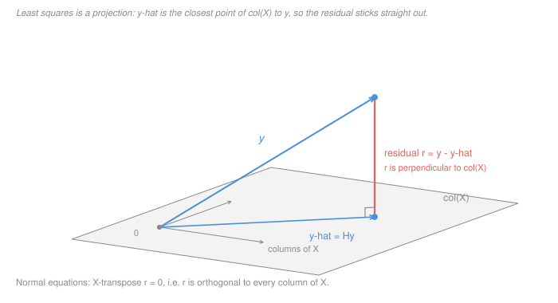

# Machine Learning · Lesson 1.3: Linear regression and least squares

> ⏱ ~15 min · Module 1: Foundations and linear models · Builds on: [1.1 (the learning problem)](01-01-the-learning-problem.md), [1.2 (bias–variance)](01-02-generalization-and-the-bias-variance-tradeoff.md) · Unlocks: [1.4 (ridge and lasso)](01-04-regularization-ridge-and-lasso.md)

## Why this matters

Linear regression is the only model in this course you can solve exactly, in closed form, by hand. That alone would make it the right place to start. But the real reason it earns a lesson is that **the solution is a piece of geometry, not a formula** — the fit is the orthogonal projection of the response onto the span of your features — and once you see that, every property of the model stops being a fact to memorise and becomes a consequence.

Residuals sum to zero? Projection. Residuals uncorrelated with every predictor? Projection. $R^2$ never falls when you add a column? Projection. Collinear features leaving the fit unchanged but the coefficients meaningless? Projection. Four separate "gotchas" in an applied-statistics course, one picture here.

And it is the picture the next three lessons deform. [1.4](01-04-regularization-ridge-and-lasso.md) shrinks the projection, [1.5](01-05-logistic-regression-and-classification.md) bends it through a sigmoid, [1.6](01-06-gradient-descent-for-learning.md) reaches it iteratively when the closed form is too expensive.

## The idea

You have $n$ observations and $p$ features. Write the features as a matrix $X$ — one row per observation, one column per feature — and the responses as a vector $y$ with $n$ entries.

Here is the whole model in one sentence: **the predictions you are allowed to make are exactly the linear combinations of the columns of $X$.**

That set is a subspace of $\mathbb{R}^n$ — a plane through the origin, if $p = 2$. Call it $\operatorname{col}(X)$. It usually has dimension $p$, and $p$ is usually much smaller than $n$, so it is a *thin* slice of the space $y$ lives in. Your response vector $y$ is almost certainly **not** in it.

So you cannot hit $y$. You can only get close. Least squares makes the obvious choice: pick the point of $\operatorname{col}(X)$ closest to $y$ in Euclidean distance. And the closest point of a plane to an outside point is the foot of the perpendicular — you drop a plumb line.

That is the entire lesson. Everything below is bookkeeping on top of "drop a perpendicular".

The one consequence worth carrying around before we do any algebra: if the segment from $\hat y$ to $y$ is perpendicular to the plane, it is perpendicular to **every vector in the plane** — in particular to every column of $X$. Whatever is left over after fitting has zero inner product with each of your features. There is no residual signal along any direction you gave the model. That is not a lucky property of a good fit; it is what "closest" means.

## The formal version

**The design matrix.** $X \in \mathbb{R}^{n \times p}$: rows are observations, columns are features. If the model has an intercept, the first column is all ones. $y \in \mathbb{R}^n$ is the response, $\beta \in \mathbb{R}^p$ the coefficient vector.

**The objective.** Least squares minimises the empirical risk under squared loss ([1.1](01-01-the-learning-problem.md)):

$$\hat\beta \;=\; \arg\min_{\beta \in \mathbb{R}^p} \; \lVert y - X\beta \rVert^2 \;=\; \arg\min_\beta \sum_{i=1}^n \big(y_i - x_i^\top\beta\big)^2 .$$

*In words:* among all predictions the columns can produce, take the one with the smallest total squared error.

**The [normal equations](../reference.md#normal-equations).** The objective is a convex quadratic in $\beta$, so a stationary point is a global minimum ([`convex-optimization` 1.3](../../convex-optimization/lessons/01-03-convex-functions-epigraph.md)). Expand and differentiate:

$$\lVert y - X\beta\rVert^2 = y^\top y - 2\beta^\top X^\top y + \beta^\top X^\top X \beta, \qquad \nabla_\beta = -2X^\top y + 2X^\top X\beta .$$

Setting the gradient to zero:

$$\boxed{\,X^\top X\,\hat\beta \;=\; X^\top y\,}$$

*In words:* $p$ linear equations in $p$ unknowns. Solve them and you are done — no iteration, no learning rate.

**The same equation, read geometrically.** Move everything to one side:

$$X^\top\big(y - X\hat\beta\big) = 0, \qquad \text{i.e.} \qquad X^\top r = 0 \ \text{ for the residual } r = y - \hat y .$$

*In words:* **the residual is orthogonal to every column of $X$.** The $j$-th row of that equation says $\sum_i x_{ij} r_i = 0$. This is the projection statement of "The idea", and it is the single most useful line in the lesson — it is a checkable identity you can run on any fit ([`linalg-refresher` 4.2](../../linalg-refresher/lessons/04-02-projection-least-squares.md) develops projection in general).

**The [hat matrix](../reference.md#hat-matrix).** If $X^\top X$ is invertible,

$$\hat\beta = (X^\top X)^{-1}X^\top y, \qquad \hat y = X\hat\beta = Hy, \qquad H = X(X^\top X)^{-1}X^\top .$$

$H$ puts the hat on $y$. It is symmetric and **idempotent** — $H^2 = H$ — which is exactly what a projection must be: project twice, land in the same place. Its trace equals $p$, the dimension of the subspace, which is the model's degrees of freedom. (The generalisation to *effective* degrees of freedom for a shrunk fit belongs to [`statistical-learning`](../../statistical-learning/syllabus.md) — not yet built; the plain $\operatorname{tr}(H) = p$ used here is all we need.)

**[$R^2$](../reference.md#coefficient-of-determination).** With $\bar y$ the response mean and an intercept column present,

$$\mathrm{SST} = \lVert y - \bar y\mathbf 1\rVert^2, \qquad \mathrm{SSE} = \lVert r \rVert^2, \qquad R^2 = 1 - \frac{\mathrm{SSE}}{\mathrm{SST}} .$$

*In words:* the fraction of the response's spread the model accounts for. Because $r$ is orthogonal to $\operatorname{col}(X)$ and $\hat y - \bar y \mathbf 1$ lies in it, Pythagoras gives $\mathrm{SST} = \lVert \hat y - \bar y\mathbf 1\rVert^2 + \mathrm{SSE}$, so $R^2$ is a ratio of squared lengths in the triangle — nothing more.

**What it costs.** Forming $X^\top X$ takes $O(np^2)$ operations; solving the $p \times p$ system takes $O(p^3)$ (Cholesky, about $p^3/3$). Asymptotic notation as in [`algorithms` 1.1](../../algorithms/lessons/01-01-asymptotic-notation.md). With $n \gg p$ the $O(np^2)$ term dominates — P3 makes that concrete.

**When it breaks.** If two columns are linearly dependent — or more generally if $\operatorname{rank}(X) < p$, which is automatic when $p > n$ — then $X^\top X$ is singular and $\hat\beta$ is **not unique**. The normal equations still have solutions; they have infinitely many. The projection $\hat y$ is unique regardless (a plane has exactly one closest point), but the coordinates naming it are not. Example 2 makes this concrete, and it is the door [1.4](01-04-regularization-ridge-and-lasso.md) walks through.

## Picture

The two faint arrows are columns of $X$; every point of the shaded plane is some combination of them, and those points are the only predictions available. The blue vector $y$ points out of the plane. Least squares slides down the coral segment to the plane, arriving at $\hat y = Hy$.

The right-angle mark is the normal equations. If the residual leaned even slightly toward the plane, you could move a little in that direction and get closer to $y$ — so at the true minimum it cannot lean at all, which is $X^\top r = 0$.

## Worked examples

**Example 1 (mechanical): a four-point fit, and the two identities.** Points $(1,2), (2,3), (3,5), (4,6)$; model $y = \beta_0 + \beta_1 x$, so

$$X = \begin{pmatrix} 1 & 1\\ 1 & 2\\ 1 & 3\\ 1 & 4\end{pmatrix}, \qquad y = \begin{pmatrix}2\\3\\5\\6\end{pmatrix}.$$

For simple regression the normal equations reduce to the familiar centred form. With $\bar x = 5/2$ and $\bar y = 4$:

$$S_{xx} = \sum (x_i - \bar x)^2 = \tfrac94 + \tfrac14 + \tfrac14 + \tfrac94 = 5, \qquad S_{xy} = \sum (x_i-\bar x)(y_i - \bar y) = 3 + \tfrac12 + \tfrac12 + 3 = 7 .$$

$$\hat\beta_1 = \frac{S_{xy}}{S_{xx}} = \frac{7}{5}, \qquad \hat\beta_0 = \bar y - \hat\beta_1 \bar x = 4 - \frac{7}{5}\cdot\frac{5}{2} = \frac12 .$$

Fitted values $\hat y = \tfrac12 + \tfrac75 x$ and residuals $r = y - \hat y$:

| $x_i$ | $y_i$ | $\hat y_i$ | $r_i$ |
|---|---|---|---|
| 1 | 2 | $19/10$ | $+1/10$ |
| 2 | 3 | $33/10$ | $-3/10$ |
| 3 | 5 | $47/10$ | $+3/10$ |
| 4 | 6 | $61/10$ | $-1/10$ |

Now the punchline. Run the two orthogonality checks — one per column of $X$:

$$\mathbf 1^\top r = \tfrac1{10} - \tfrac3{10} + \tfrac3{10} - \tfrac1{10} = 0, \qquad x^\top r = \tfrac1{10} - \tfrac6{10} + \tfrac9{10} - \tfrac4{10} = 0 .$$

Both are exactly zero, and **that is not a coincidence or a rounding artefact — those two equations *are* the normal equations.** If you ever compute a fit by hand and one of them comes out nonzero, you have made an arithmetic error, and you have found it without knowing the right answer.

Finally $\mathrm{SSE} = \frac{1+9+9+1}{100} = \frac15$ and $\mathrm{SST} = 4 + 1 + 1 + 4 = 10$, so

$$R^2 = 1 - \frac{1/5}{10} = \frac{49}{50} = 0.98 .$$

(The hat matrix here has $\operatorname{tr}(H) = 7/10 + 3/10 + 3/10 + 7/10 = 2 = p$, as promised.)

**Example 2 (why you'd care): the same data, one redundant column.** Suppose a colleague, wanting to be thorough, records the predictor in two units: $x_1 = (1,2,3,4)$ as before, and $x_2 = 3 + 2x_1 = (5,7,9,11)$ — a rescaled, shifted copy. The design is now $[\mathbf 1 \;\; x_1 \;\; x_2]$, three columns, $p = 3$.

But $x_2 = 3\cdot\mathbf 1 + 2 x_1$, so the third column adds **nothing** to the span:

$$\beta_0 \mathbf 1 + \beta_1 x_1 + \beta_2 x_2 = (\beta_0 + 3\beta_2)\,\mathbf 1 + (\beta_1 + 2\beta_2)\, x_1 .$$

$\operatorname{col}(X)$ is the same plane it was, so $\hat y$ is the same vector it was, the residuals are the same, and $R^2$ is still $49/50$. What changed is that the fit no longer has a unique *name*. Matching the coefficients of Example 1 requires only

$$\beta_0 + 3\beta_2 = \tfrac12, \qquad \beta_1 + 2\beta_2 = \tfrac75 ,$$

two equations in three unknowns — a whole line of exactly-optimal solutions. Taking $\beta_2 = 0$ gives $(\tfrac12,\ \tfrac75,\ 0)$; taking $\beta_2 = \tfrac{7}{10}$ gives $(-\tfrac85,\ 0,\ \tfrac7{10})$. **Both fit the data identically.** One of them says the effect of $x_1$ is $1.4$ per unit; the other says it is exactly zero.

So a coefficient is a statement about a *set of columns*, never about a feature on its own — and with near-collinear columns (the realistic case: $X^\top X$ barely invertible rather than exactly singular) the coefficients are not undefined but wildly unstable, swinging on tiny changes in the data while the fit itself barely moves. That instability is a variance problem in the sense of [1.2](01-02-generalization-and-the-bias-variance-tradeoff.md), and ridge in [1.4](01-04-regularization-ridge-and-lasso.md) is the fix: adding $\lambda I$ to $X^\top X$ makes it invertible and picks one member of the family.

When $p > n$ this is the *default* situation, not a pathology: the columns span all of $\mathbb{R}^n$, so $\hat y = y$, every residual is zero, $R^2 = 1$, and the coefficient vector is one point on a $(p-n)$-dimensional flat of equally perfect fits. A perfect fit that tells you nothing.

## Watch out

- **You might think** the residuals of any regression sum to zero — **but actually** that identity is the normal equation *for the intercept column*, so it holds only if the model has an intercept. Fit through the origin and $\sum_i r_i$ is generally nonzero (the residuals are still orthogonal to the columns you did include). The same caveat kills the Pythagorean split $\mathrm{SST} = \mathrm{SSreg} + \mathrm{SSE}$, which is why $R^2$ from a no-intercept fit can be negative and is not comparable to anything.
- **You might think** a higher $R^2$ means a better model — **but actually** $R^2$ cannot decrease when you add *any* column, however meaningless, because the old fit is still available in the larger span (P2). It measures fit to the sample in front of you, which is precisely the quantity [1.2](01-02-generalization-and-the-bias-variance-tradeoff.md) warned is a biased estimate of risk. Model selection needs held-out error ([4.1](04-01-model-selection-and-cross-validation.md)).
- **You might think** that since $\hat\beta = (X^\top X)^{-1}X^\top y$ is a formula, you should compute it that way — **but actually** forming $X^\top X$ squares the condition number of $X$, so a design that is merely awkward becomes numerically hopeless. Real solvers factor $X$ directly (QR, or the SVD of [`linalg-refresher` 5.2](../../linalg-refresher/lessons/05-02-svd.md)) and never build the Gram matrix. The normal equations are how you *think* about least squares, not how you compute it.

## One-liner

> Least squares drops a perpendicular from $y$ onto the span of your columns: the normal equations $X^\top X\hat\beta = X^\top y$ say nothing more than "the residual is orthogonal to every feature", and the projection is unique even when the coefficients naming it are not.

## Problems

**P1 (🟢)** Fit $y = \beta_0 + \beta_1 x$ by least squares to the points $(0,2),\ (2,4),\ (4,8),\ (6,14)$.

(a) Give $\hat\beta_0$ and $\hat\beta_1$. (b) Give the four residuals and verify **both** orthogonality identities, $\sum_i r_i = 0$ and $\sum_i x_i r_i = 0$. (c) Give $R^2$ as an exact fraction.

**P2 (🟡)** Let $X$ have an intercept column, and let $X' = [X \;\; z]$ append any new column $z$.

(a) Prove that $R^2$ never decreases: $R^2(X') \ge R^2(X)$ for every $z$. Two sentences suffice.

(b) Make it concrete on Example 1's data $(1,2), (2,3), (3,5), (4,6)$, with $z = (0,1,0,0)^\top$ — an indicator for the second observation and nothing else, a column with no relationship to anything. Without solving a $3\times 3$ system, argue what the new fit does at row 2, deduce the new $\mathrm{SSE}$, and report the new $R^2$.

(c) With $n = 4$ observations and an intercept plus $x$ already in the model, how many junk columns like $z$ does it take to force $R^2 = 1$? Say in one sentence what that does to $R^2$ as a model-selection criterion, and name what you would use instead ([4.1](04-01-model-selection-and-cross-validation.md)).

**P3 (🔴)** A dense design with $n = 10^6$ rows and $p = 5000$ columns, float64 (8 bytes per number).

(a) How much memory does $X$ take, and how much does $X^\top X$ take?

(b) Count the work for the direct solve: forming $X^\top X$ at $\approx np^2$, then a Cholesky solve at $\approx p^3/3$. Which dominates, and by what factor?

(c) An iterative method ([1.6](01-06-gradient-descent-for-learning.md)) costs one pass over $X$ per step, $\approx np$. How many passes can you afford before the direct route is cheaper? Express the answer in terms of $n$ and $p$ before plugging in numbers.

(d) Given (a), which of the two routes is the *memory*-friendly one, and what single change to the problem would flip your recommendation?

Solutions

**P1** (a) $\bar x = 3$, $\bar y = 7$.

$$S_{xx} = 9 + 1 + 1 + 9 = 20, \qquad S_{xy} = (-3)(-5) + (-1)(-3) + (1)(1) + (3)(7) = 15 + 3 + 1 + 21 = 40 .$$

So $\hat\beta_1 = 40/20 = 2$ and $\hat\beta_0 = 7 - 2\cdot 3 = 1$: the fit is $\hat y = 1 + 2x$.

(b) Fitted values $(1,\ 5,\ 9,\ 13)$, so $r = (1,\ -1,\ -1,\ 1)$.

$$\sum_i r_i = 1 - 1 - 1 + 1 = 0 \quad\checkmark \qquad \sum_i x_i r_i = 0(1) + 2(-1) + 4(-1) + 6(1) = -2 - 4 + 6 = 0 \quad\checkmark$$

(c) $\mathrm{SSE} = 1+1+1+1 = 4$; $\mathrm{SST} = 25 + 9 + 1 + 49 = 84$; so

$$R^2 = 1 - \frac{4}{84} = \frac{20}{21} \approx 0.952 .$$

**P2** (a) Every prediction reachable with $X$ is reachable with $X'$ — take the same $\beta$ and give $z$ the coefficient $0$. So $\operatorname{col}(X) \subseteq \operatorname{col}(X')$, and a minimum over a superset cannot be larger: $\mathrm{SSE}(X') \le \mathrm{SSE}(X)$. Meanwhile $\mathrm{SST}$ depends only on $y$, so $R^2 = 1 - \mathrm{SSE}/\mathrm{SST}$ cannot decrease. $\blacksquare$

(b) Write the coefficient vector as $(b_0, b_1, c)$. The fitted value at row $i$ is $b_0 + b_1 x_i + c z_i$, and $z_i = 0$ for rows 1, 3, 4 — so $c$ has **no effect on those rows at all**, and at row 2 it can be set to anything. Whatever $(b_0,b_1)$ are, choosing $c = y_2 - b_0 - 2b_1$ zeroes the second residual for free. So the minimisation splits: row 2 contributes $0$, and the rest is a simple regression on $(1,2), (3,5), (4,6)$.

That three-point fit: $\bar x = 8/3$, $\bar y = 13/3$, $S_{xx} = \frac{25 + 1 + 16}{9} = \frac{14}{3}$, $S_{xy} = \frac{35 + 2 + 20}{9} = \frac{19}{3}$, so slope $19/14$ and intercept $\frac{13}{3} - \frac{19}{14}\cdot\frac83 = \frac{5}{7}$. Its residuals are $\left(-\frac1{14},\ \frac3{14},\ -\frac2{14}\right)$, giving

$$\mathrm{SSE}' = \frac{1 + 9 + 4}{196} = \frac{14}{196} = \frac1{14} \qquad\text{(down from } \tfrac15\text{)}, \qquad R^2 = 1 - \frac{1/14}{10} = \frac{139}{140} \approx 0.9929 .$$

$R^2$ rose from $0.98$ to $0.9929$ on a column that is pure noise. (Checked against an exact solve of the full $3\times3$ system: $\hat\beta = (5/7,\ 19/14,\ -3/7)$, same $\mathrm{SSE}$.)

(c) Two. The intercept and $x$ already span a 2-dimensional subspace of $\mathbb{R}^4$; two more columns in general position make $\operatorname{col}(X') = \mathbb{R}^4$, so $\hat y = y$ and $R^2 = 1$ exactly. Since anyone can reach $R^2 = 1$ with $n$ arbitrary columns, $R^2$ ranks models by *how many parameters you spent*, not by how good they are — it is a measure of fit to the training sample, so use held-out or cross-validated error instead ([4.1](04-01-model-selection-and-cross-validation.md)).

**P3** (a) $X$: $10^6 \times 5000 \times 8 = 4\times 10^{10}$ bytes $= 40$ GB. $X^\top X$: $5000^2 \times 8 = 2\times 10^8$ bytes $= 200$ MB. The Gram matrix is **200 times smaller than a single column-block of the data** and fits in memory trivially.

(b) $np^2 = 10^6 \cdot 2.5\times10^7 = 2.5\times10^{13}$ operations to form $X^\top X$; $p^3/3 = 1.25\times10^{11}/3 \approx 4.2\times10^{10}$ to factor it. Forming the Gram matrix dominates by a factor of $3n/p = 600$. All the cost is in touching the data, not in the linear algebra — which is worth internalising, because it is the same story for most $n \gg p$ methods.

(c) One pass costs $np = 5\times10^9$. The direct route costs $np^2 + p^3/3$, so the break-even pass count is

$$\frac{np^2 + p^3}{np} = p + \frac{p^2}{n}$$

(using the generic $p^3$; with Cholesky's $p^3/3$ the second term is $p^2/3n$). Numerically: $p = 5000$ passes for the Gram matrix plus $p^2/n = 25\times10^6/10^6 = 25$ for the solve, so **about 5025 passes** — call it $p$, since $p \ll n$ makes the second term negligible.

That is a large budget: an iterative solver reaching adequate accuracy in 100–200 passes is roughly 25–50 times cheaper than the direct solve here.

(d) The **direct** route is the memory-friendly one, which is the counterintuitive part. You never need $X$ in RAM: stream it in row blocks, accumulating the partial sums $X_b^\top X_b$ and $X_b^\top y_b$ as you go, and finish with a 200 MB solve. One pass over the 40 GB, total. The iterative route must re-read all 40 GB *every step*, so if the data lives on disk its real cost is bandwidth, not flops, and 200 passes means 8 TB of reads.

What flips the recommendation: **sparsity**. If $X$ has, say, 20 nonzeros per row, a pass costs $O(\mathrm{nnz}) = 2\times10^7$ rather than $np$, while $X^\top X$ is generally dense — the $O(p^3)$ solve and the 200 MB stay, but the iterative pass gets 250 times cheaper, and iterative wins decisively. (Growing $p$ does the same: at $p = 10^5$ the Gram matrix alone is 80 GB and the direct route is simply unavailable.)

## Flashback

**From Lesson 1.1 (The learning problem):** that lesson's key fact was about *which summary a loss function asks for*: over any distribution, squared loss $\ell(c, y) = (c-y)^2$ is minimised by the **mean** of $y$, and absolute loss $\ell(c,y) = \lvert c - y\rvert$ by the **median**. Here is that fact meeting a design matrix.

A support team logs five response times, in minutes: $4,\ 6,\ 7,\ 9,\ 34$. You fit a model with an intercept and nothing else, so $X$ is a single column of ones and $\hat\beta$ is one number.

(a) Write the normal equation for this design and solve it. What is $\hat\beta$? (b) What number would you get by minimising $\sum_i \lvert y_i - c\rvert$ instead? Give the total absolute loss under each. (c) Which of Example 1's two orthogonality identities is the normal equation here, and what does that tell you about which of the two answers has zero-mean residuals?

Solution

(a) With $X = \mathbf 1$, the normal equation $X^\top X \hat\beta = X^\top y$ reads $5\hat\beta = \sum_i y_i = 60$, so

$$\hat\beta = \frac{60}{5} = 12 = \bar y .$$

**The intercept-only least-squares fit is exactly the sample mean** — 1.1's population fact, in its empirical form, falling straight out of the normal equations.

(b) The median, $7$. Total losses:

| $c$ | $\sum (y_i - c)^2$ | $\sum \lvert y_i - c\rvert$ |
|---|---|---|
| mean, $12$ | **618** | 44 |
| median, $7$ | 743 | **33** |

Each summary wins under its own loss and loses under the other, by a wide margin. Note where the mean lands: $12$ is larger than four of the five observations, dragged there by the single 34-minute outlier. If that 34 is a genuinely slow ticket, the mean is honest; if it is a data-entry error or a case nobody will ever repeat, squared loss has quietly answered a different question than the one you asked.

(c) It is $\mathbf 1^\top r = 0$ — the intercept identity, and here the *only* identity, since $\mathbf 1$ is the only column. So the least-squares answer is the one whose residuals sum to zero: $(-8, -6, -5, -3, 22)$, summing to $0$.

The median has no such identity. Its optimality condition is a *sign* count, not an inner product: the subgradient of $\sum_i \lvert y_i - c\rvert$ vanishes when as much mass sits below $c$ as above, and here the signs are $(-,-,0,+,+)$ — balanced. Residuals about the median are $(-3,-1,0,2,27)$, summing to $25$, and nothing is wrong with that. Orthogonal residuals are a property of *squared* loss, not of good fits in general.

## Connections

- **Backward:** this is [`linalg-refresher` 4.2's](../../linalg-refresher/lessons/04-02-projection-least-squares.md) orthogonal projection with statistical labels on it, and the uniqueness question is the rank/null-space story of [`linalg-refresher` 2.2](../../linalg-refresher/lessons/02-02-inverses-and-four-subspaces.md). The objective is the empirical risk of [1.1](01-01-the-learning-problem.md) under squared loss, and Example 2's unstable coefficients are the variance term of [1.2](01-02-generalization-and-the-bias-variance-tradeoff.md) showing up in a model too simple to overfit in the usual way.
- **Forward:** [1.4](01-04-regularization-ridge-and-lasso.md) repairs the singular $X^\top X$ by adding $\lambda I$, and reads the resulting fit through the [SVD](../../linalg-refresher/lessons/05-02-svd.md) as shrinkage along each singular direction. [1.5](01-05-logistic-regression-and-classification.md) keeps the linear predictor but replaces squared loss with a likelihood, and its gradient $X^\top(p - y)$ is this lesson's $X^\top(\hat y - y)$ with a sigmoid inside. [1.6](01-06-gradient-descent-for-learning.md) is what you do when P3's direct solve is too expensive. P2's monotone $R^2$ is the concrete reason [4.1](04-01-model-selection-and-cross-validation.md) exists.
- **Sideways:** "project onto the span of what you can control, and the leftover is orthogonal to all of it" is the same theorem as conditional expectation being the $L^2$-optimal predictor in [`prob-stat-refresher` 3.1](../../prob-stat-refresher/lessons/03-01-joint-distributions-covariance.md), as the Gram–Schmidt step in [`linalg-refresher` 4.1](../../linalg-refresher/lessons/04-01-inner-products-orthogonality.md), and as the least-squares problem [`convex-optimization` 5.1](../../convex-optimization/lessons/05-01-least-squares-lasso.md) solves from the optimization side.
