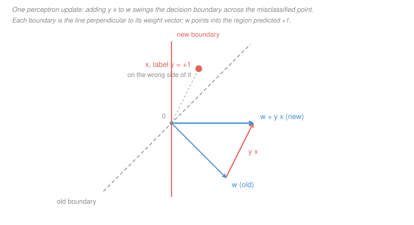

# Machine Learning · Lesson 2.1: The perceptron and linear separability

> ⏱ ~15 min · Module 2: Classification — margins, trees, and ensembles · Builds on: [1.5 (logistic regression)](01-05-logistic-regression-and-classification.md), [1.6 (gradient descent)](01-06-gradient-descent-for-learning.md) · Unlocks: 2.2 (maximum-margin classifiers)

## Why this matters

The perceptron is the first learning algorithm anybody proved anything about, and the two things proved are still the two things you want to know about any method: **a guarantee** and **a hard limit**.

The guarantee is a mistake bound, and it is startling for what it leaves out — no sample size, no dimension. Run the perceptron on four points in the plane or on four million points in a million dimensions; if the data is separable with the same geometry, the bound is the same number.

The limit is that **XOR is not linearly separable**, and this lesson owns the proof. It is three lines long, it kills every parameter at once, and it is the template for every impossibility argument in this course: [2.4](02-04-the-kernel-trick.md) and [4.4](04-04-a-taste-of-neural-networks.md) both point back here rather than re-proving it.

Learn the pair together. A method you can only praise, or only criticize, you do not understand.

## The idea

A **linear classifier** scores a point and reads off the sign:

$$h(x) = \operatorname{sign}\big(w^\top x + b\big).$$

The vector $w$ is a direction; the set where the score is zero is a hyperplane (a line in 2-D) perpendicular to it, and $w$ points into the region predicted $+1$. Learning means choosing $w$ and $b$.

The perceptron chooses them **one mistake at a time**. Look at an example. If you got it right, do nothing. If you got it wrong, nudge $w$ toward being right on that example:

$$w \;\leftarrow\; w + y\,x .$$

That is the entire algorithm. Why does adding $y x$ help? Score the *same* point again with the updated weights:

$$y\,(w + yx)^\top x \;=\; y\,w^\top x \;+\; y^2\lVert x\rVert^2 \;=\; y\,w^\top x + \lVert x\rVert^2 ,$$

using $y^2 = 1$ because labels are $\pm 1$. The score moves in the right direction by exactly $\lVert x\rVert^2$ — maybe not far enough to fix the point in one step, but **never the wrong way**. That monotone nudge is the whole mechanism, and the proof below is just the bookkeeping on it.

One housekeeping move first. Append a constant $1$ to every feature vector and call its weight $b$; then $w^\top x + b$ becomes a plain inner product and the bias disappears from the notation. Everything below assumes that has been done, so the boundary passes through the origin.

## The formal version

**Definition ([linear separability](../reference.md#linear-separability)).** A labelled set $\{(x_i, y_i)\}_{i=1}^n$ with $y_i \in \{-1,+1\}$ is **linearly separable** if there is a $w$ with $y_i\,(w^\top x_i) > 0$ for every $i$.

*In words:* one hyperplane puts every positive on one side and every negative on the other.

**Definition (margin).** For a unit vector $w^*$ that separates the data, its **margin** is

$$\gamma \;=\; \min_i\; y_i\,(w^{*\top} x_i),$$

the distance from the boundary to the closest point. Call $R = \max_i \lVert x_i\rVert$ the **radius** of the data.

**The algorithm** ([perceptron update rule](../reference.md#perceptron-update-rule)):

```
PERCEPTRON(examples (x_1,y_1) .. (x_n,y_n)):
    w <- 0
    cycle i = 1, 2, ..., n, 1, 2, ... :
        if y_i * (w . x_i) <= 0:        -- a mistake; a tie at 0 counts as one
            w <- w + y_i * x_i
    halt when n consecutive examples pass with no mistake
```

Nothing happens on a correct example, so the cost is one inner product per example, $O(p)$ in $p$ features — the algorithm is as cheap as it looks.

### The guarantee

**Theorem ([the perceptron mistake bound](../reference.md#perceptron-mistake-bound), Novikoff 1962).** Suppose $\lVert x_i\rVert \le R$ for all $i$ and some unit $w^*$ separates the data with margin $\gamma > 0$. Then, started from $w = 0$, the perceptron makes at most

$$M \;\le\; \Big(\frac{R}{\gamma}\Big)^{2}$$

mistakes in total — and therefore halts.

*In words:* the number of corrections is capped by how wide the data is relative to how much room the best separator has.

*Proof.* Let $w_k$ be the weight vector after $k$ mistakes, so $w_0 = 0$. Say mistake $k$ happens on $(x,y)$, which means $y\,w_{k-1}^\top x \le 0$, and $w_k = w_{k-1} + yx$. Two inequalities.

**(1) Progress toward $w^*$ is at least linear.**

$$w_k^\top w^* = w_{k-1}^\top w^* + y\,(w^{*\top} x) \;\ge\; w_{k-1}^\top w^* + \gamma,$$

by the definition of the margin. Iterating from $w_0 = 0$ gives $w_M^\top w^* \ge M\gamma$.

**(2) Growth in length is at most linear.**

$$\lVert w_k\rVert^2 = \lVert w_{k-1}\rVert^2 + 2\,y\,w_{k-1}^\top x + \lVert x\rVert^2 \;\le\; \lVert w_{k-1}\rVert^2 + R^2 ,$$

because the cross term is $\le 0$ — that is exactly what "this was a mistake" says. Iterating gives $\lVert w_M\rVert^2 \le M R^2$.

**Squeeze.** By [Cauchy–Schwarz](../../linalg-refresher/lessons/04-01-inner-products-orthogonality.md) and $\lVert w^*\rVert = 1$,

$$M\gamma \;\le\; w_M^\top w^* \;\le\; \lVert w_M\rVert \;\le\; \sqrt{M}\,R .$$

Divide by $\sqrt M$ and square: $M \le (R/\gamma)^2$. $\blacksquare$

The shape is worth keeping: one quantity is forced to grow **linearly** in $M$, another only as $\sqrt M$, and an inequality between them traps $M$.

**What the bound does not contain.** Not $n$: a million copies of the same four points cost the same four mistakes. Not the dimension $p$: embed the data in $\mathbb R^{10^4}$ by padding with zeros and $R$, $\gamma$ and the bound are unchanged. What it *does* depend on is the geometry — and $\gamma$ can be brutally small, at which point the bound says nothing useful.

It is also a bound on **mistakes made while training**, not on future error. Converting a mistake bound into a statement about unseen data is the online-to-batch conversion, which belongs to [`statistical-learning`](../../statistical-learning/syllabus.md) (not yet built; stated here where it is used): if an online algorithm makes at most $M$ mistakes on any sequence, then a classifier drawn uniformly from its iterates has expected error at most $M/n$ on a fresh sample. Everything this course claims about generalization is measured, not bounded — see [4.1](04-01-model-selection-and-cross-validation.md).

### The limit

**Theorem (XOR is not linearly separable).** Label the four points $(0,0)$ and $(1,1)$ as $-1$, and $(0,1)$ and $(1,0)$ as $+1$. No $w = (w_1, w_2)$ and $b$ satisfy $\operatorname{sign}(w^\top x + b) = y$ on all four.

*Proof.* Suppose some $w, b$ did. The two positive constraints are

$$w_2 + b > 0 \qquad\text{and}\qquad w_1 + b > 0 .$$

Add them: $w_1 + w_2 + 2b > 0$. The two negative constraints are

$$b < 0 \qquad\text{and}\qquad w_1 + w_2 + b < 0 .$$

Add them: $w_1 + w_2 + 2b < 0$. The same quantity is both positive and negative. Contradiction. $\blacksquare$

**This is the cleanest impossibility argument in the course**, and the reason is that adding the constraints eliminates every variable at once — no case analysis, no geometry, three lines.

The geometry behind it is worth naming, because it generalizes. The midpoint of the two positives is $(\tfrac12, \tfrac12)$; so is the midpoint of the two negatives. A separating hyperplane would have to put that one point strictly on both sides. In general:

> **A dataset is linearly separable exactly when the convex hulls of the two classes are disjoint.**

Every non-separability proof is therefore the same job: exhibit one point that is a convex combination of the positives *and* a convex combination of the negatives. Summing constraints, as above, is how you write that down. [Lesson 2.2](02-02-maximum-margin-classifiers.md) turns the same hull picture into a construction rather than an obstruction.

Two consequences worth stating plainly. On non-separable data the perceptron **does not converge slowly — it never halts**, cycling forever, and nothing in the algorithm distinguishes "not done yet" from "impossible". And XOR is not a pathological corner case: it is the parity function on two bits, i.e. "exactly one of these two conditions holds", which is an ordinary thing to want to detect.

## Picture



Here $w = (2,-2)$ and the misclassified point is $x = (1,2)$ with $y = +1$: the score is $w^\top x = 2 - 4 = -2 < 0$, the wrong sign. The update adds $y x = (1,2)$, giving $w' = (3,0)$, and now $w'^\top x = 3 > 0$.

Read it as a rotation. The boundary is always perpendicular to the weight vector, so tilting $w$ toward $x$ swings the boundary **across** $x$ — which is why the update is best pictured as the boundary sweeping past the point it got wrong, not as the point moving. And notice the update overshoots in general: it improves the score on $x$ by $\lVert x\rVert^2 = 5$ whether $5$ was needed or not, and it may well break some other point that was previously fine. The theorem says that churn is bounded; it does not say it is monotone.

## Worked examples

### Example 1 (mechanical): running the perceptron to a halt

Four points arriving in this order, with the bias already folded in (so the boundary passes through the origin):

$$x_1 = (-3,-1),\ y_1 = -1;\quad x_2 = (-2,1),\ y_2 = +1;$$
$$x_3 = (1,2),\ y_3 = +1;\quad x_4 = (3,-1),\ y_4 = -1 .$$

Start at $w = 0$ and cycle. Each row shows the score $y_i(w^\top x_i)$ computed with the $w$ standing at the time.

| step | pass | example | $y_i$ | $y_i(w^\top x_i)$ | action | $w$ after |
|---|---|---|---|---|---|---|
| 1 | 1 | $x_1 = (-3,-1)$ | $-1$ | $0$ | mistake | $(3,1)$ |
| 2 | 1 | $x_2 = (-2,1)$ | $+1$ | $-5$ | mistake | $(1,2)$ |
| 3 | 1 | $x_3 = (1,2)$ | $+1$ | $5$ | ok | $(1,2)$ |
| 4 | 1 | $x_4 = (3,-1)$ | $-1$ | $-1$ | mistake | $(-2,3)$ |
| 5 | 2 | $x_1 = (-3,-1)$ | $-1$ | $-3$ | mistake | $(1,4)$ |
| 6 | 2 | $x_2 = (-2,1)$ | $+1$ | $2$ | ok | $(1,4)$ |
| 7 | 2 | $x_3 = (1,2)$ | $+1$ | $9$ | ok | $(1,4)$ |
| 8 | 2 | $x_4 = (3,-1)$ | $-1$ | $1$ | ok | $(1,4)$ |
| 9 | 3 | $x_1 = (-3,-1)$ | $-1$ | $7$ | ok | $(1,4)$ |

Four consecutive clean examples (steps 6–9), so the algorithm **halts** with $w = (1,4)$. Four mistakes.

Two details worth pausing on. Step 1: with $w = 0$ every score is $0$, and the convention "$\le 0$ is a mistake" makes the first example an automatic mistake — that is how the algorithm gets started at all. Step 4: $x_3$ was correct at step 3 and the step-4 update to $(-2,3)$ *broke* $x_1$, which had been fine. Progress is not monotone example by example; only the bound is monotone.

### Example 2 (why you'd care): the bound, and what the answer is worth

Same data. Take $w^* = (0,1)$ — a unit vector — and check it separates:

$$y_1(w^{*\top}x_1) = 1,\quad y_2 = 1,\quad y_3 = 2,\quad y_4 = 1 .$$

So $\gamma = 1$. The radius is $R = \max_i \lVert x_i\rVert = \sqrt{10}$, from $x_1$ and $x_4$ (both have $\lVert x\rVert^2 = 10$). The bound is

$$M \;\le\; \Big(\frac{R}{\gamma}\Big)^2 = \frac{10}{1} = 10 .$$

The trace made **4**. The bound is honest but loose, and that is expected for three reasons: it is a worst case over all arrival orders; it charges every mistake the full $R^2$ even when the offending point is nowhere near the boundary; and it uses only the *smallest* margin, ignoring that three of the four points sit at margin $1$ or more.

**A sanity check that the bound is the right shape.** Multiply every feature by $10$. Then $R$ becomes $10R$ and $\gamma$ becomes $10\gamma$, so $(R/\gamma)^2$ is unchanged — as it must be, since rescaling the features cannot change which examples the algorithm gets wrong. A "bound" that moved under rescaling would be measuring the units, not the problem.

**Now the part that motivates the next lesson.** The perceptron halted at $w = (1,4)$. What is *its* margin? Its smallest score is $1$, at $x_4$, and $\lVert (1,4)\rVert = \sqrt{17}$, so its geometric margin is

$$\frac{1}{\sqrt{17}} \approx 0.243 ,$$

against the best available $\gamma = 1$. The perceptron stopped at a separator **more than four times worse than the best one**, and it stopped there for no better reason than that it ran out of mistakes. It has no preference among separators at all: it halts the instant nothing is wrong.

That is the gap [Lesson 2.2](02-02-maximum-margin-classifiers.md) closes — stop asking for *a* separator and ask for the one with the widest margin.

## Watch out

- **You might think** the mistake bound tells you how much data you need, or how well the classifier will do on new points — **but actually** it bounds only corrections made during training. It says nothing about test error on its own, and it is defined using the *best* separator's margin $\gamma$, which you do not know before you fit. Quoting $(R/\gamma)^2$ as a sample-complexity number is the standard misuse.
- **You might think** the perceptron converges to *the* separator — **but actually** it converges to *a* separator, and the answer depends on the order the data arrives in. Our four points presented as $x_1, x_4, x_2, x_3$ — both negatives, then both positives — cost only **2** mistakes and return $w = (0,2)$, which is the maximum-margin direction $(0,1)$; the order in Example 1 cost 4 mistakes and returned a separator four times worse. Same data, same algorithm, different answers.
- **You might think** "not linearly separable" means the perceptron will be slow — **but actually** it means the perceptron **never stops**. It cycles indefinitely, and there is no internal signal that distinguishes an unfinished run from an impossible one. In practice you cap the passes, which quietly turns a proof-backed algorithm into a heuristic; the principled fix is to change the objective, which is what [2.3](02-03-soft-margins-and-the-svm-dual.md) does with slack.

## One-liner

> The perceptron nudges its boundary across whichever point it just got wrong, and two inequalities — progress grows like $M$, length like $\sqrt M$ — cap the nudges at $(R/\gamma)^2$ regardless of how many points or dimensions there are; but on XOR the four constraints sum to $0 > 0$, so no line exists and the algorithm runs forever.

## Problems

**P1 (🟢)** Run the perceptron from $w = 0$, cycling in the order given, on

$$x_1 = (-3,-1),\ y_1 = +1;\quad x_2 = (-1,-2),\ y_2 = -1;$$
$$x_3 = (0,-3),\ y_3 = -1;\quad x_4 = (2,3),\ y_4 = +1 .$$

(a) Give the trace as a table (example, $y_i(w^\top x_i)$, action, $w$ after). (b) State the final $w$ and the number of mistakes. (c) Verify the final $w$ classifies all four points correctly.

**P2 (🟡)** Same dataset. You are told that $w^* = \big(-\tfrac35, \tfrac45\big)$ is a separator.

(a) Check that $w^*$ is a unit vector and compute $y_i(w^{*\top}x_i)$ for all four points, hence $\gamma$. (b) Compute $R$ and evaluate the mistake bound $(R/\gamma)^2$. (c) Compare it to P1's actual mistake count and give two distinct reasons the gap is expected. (d) Compute the geometric margin of P1's final $w$ and say how it compares with $\gamma$.

**P3 (🔴)** Impossibility in one dimension. A **threshold classifier** on $\mathbb R$ predicts $\operatorname{sign}(wx + b)$ for scalars $w, b$.

(a) Exhibit three points on the real line, with labels, that no threshold classifier separates. (b) Prove it by the same move as the XOR proof: take a nonnegative combination of the constraints that cancels both $w$ and $b$. (c) State the general shape of every such argument in one sentence, and check XOR against it.

<details>
<summary>Solutions</summary>

**P1** (a) Recall the update is $w \leftarrow w + y_i x_i$, so a $y_i = -1$ mistake *subtracts* $x_i$.

| step | pass | example | $y_i$ | $y_i(w^\top x_i)$ | action | $w$ after |
|---|---|---|---|---|---|---|
| 1 | 1 | $x_1 = (-3,-1)$ | $+1$ | $0$ | mistake | $(-3,-1)$ |
| 2 | 1 | $x_2 = (-1,-2)$ | $-1$ | $-5$ | mistake | $(-2,1)$ |
| 3 | 1 | $x_3 = (0,-3)$ | $-1$ | $3$ | ok | $(-2,1)$ |
| 4 | 1 | $x_4 = (2,3)$ | $+1$ | $-1$ | mistake | $(0,4)$ |
| 5 | 2 | $x_1 = (-3,-1)$ | $+1$ | $-4$ | mistake | $(-3,3)$ |
| 6 | 2 | $x_2 = (-1,-2)$ | $-1$ | $3$ | ok | $(-3,3)$ |
| 7 | 2 | $x_3 = (0,-3)$ | $-1$ | $9$ | ok | $(-3,3)$ |
| 8 | 2 | $x_4 = (2,3)$ | $+1$ | $3$ | ok | $(-3,3)$ |
| 9 | 3 | $x_1 = (-3,-1)$ | $+1$ | $6$ | ok | $(-3,3)$ |

Two arithmetic checks in full. Step 2: $w = (-3,-1)$, so $w^\top x_2 = (-3)(-1) + (-1)(-2) = 3 + 2 = 5$, and $y_2 = -1$ gives $-5 \le 0$; the update is $(-3,-1) - (-1,-2) = (-2, 1)$. Step 4: $w = (-2,1)$, so $w^\top x_4 = -4 + 3 = -1$, and $y_4 = +1$ gives $-1 \le 0$; the update is $(-2,1) + (2,3) = (0,4)$.

(b) Final $w = (-3,3)$, after **4 mistakes** (steps 1, 2, 4, 5).

(c) Scores with $w = (-3,3)$: $y_1(w^\top x_1) = 9 - 3 = 6$; $y_2(w^\top x_2) = -(3 - 6) = 3$; $y_3(w^\top x_3) = -(0 - 9) = 9$; $y_4(w^\top x_4) = -6 + 9 = 3$. All strictly positive, so all four are correct.

**P2** (a) $\lVert w^*\rVert^2 = \tfrac{9}{25} + \tfrac{16}{25} = 1$, so it is a unit vector. The four scores:

$$y_1(w^{*\top}x_1) = \tfrac95 - \tfrac45 = 1, \qquad y_2(w^{*\top}x_2) = -\big(\tfrac35 - \tfrac85\big) = 1,$$

$$y_3(w^{*\top}x_3) = -\big(0 - \tfrac{12}{5}\big) = \tfrac{12}{5}, \qquad y_4(w^{*\top}x_4) = -\tfrac65 + \tfrac{12}{5} = \tfrac65 .$$

All positive, so $w^*$ separates, and $\gamma = \min\{1, 1, \tfrac{12}{5}, \tfrac65\} = 1$.

(b) Squared norms: $\lVert x_1\rVert^2 = 10$, $\lVert x_2\rVert^2 = 5$, $\lVert x_3\rVert^2 = 9$, $\lVert x_4\rVert^2 = 13$. So $R^2 = 13$ (attained at $x_4$) and

$$M \le \Big(\frac{R}{\gamma}\Big)^2 = \frac{13}{1} = 13 .$$

(c) The trace made **4**, against a bound of 13 — a factor of more than three. Two reasons, both structural:

1. *It is a worst case over orderings and over datasets with these $R$ and $\gamma$.* The bound must hold for the most adversarial arrival order of any dataset with radius $\sqrt{13}$ and margin 1; this particular order is not adversarial.
2. *Step (2) of the proof is charged at full price.* It assumes every mistake adds the maximum $R^2 = 13$ to $\lVert w\rVert^2$, but only $x_4$ has $\lVert x\rVert^2 = 13$; the mistakes at steps 1, 2 and 5 involved points with $\lVert x\rVert^2 = 10, 5, 10$. Likewise step (1) credits every mistake only the minimum margin $\gamma = 1$, though $x_3$ would have earned $\tfrac{12}5$.

(A third, if you want one: the bound counts mistakes over an infinite stream, while the algorithm here halts after two passes.)

(d) $w = (-3,3)$ has $\lVert w\rVert = 3\sqrt2$, and its smallest score is $\min\{6, 3, 9, 3\} = 3$, so its geometric margin is

$$\frac{3}{3\sqrt2} = \frac{1}{\sqrt2} \approx 0.707 ,$$

against $\gamma = 1$. So the perceptron's separator has about 71 percent of the best available margin — better than Example 1's 24 percent, but still not the best, and nothing in the algorithm was trying to make it so.

**P3** (a) Take $x = 0$ with label $+1$, $x = 2$ with label $-1$, and $x = 5$ with label $+1$.

(b) Suppose $\operatorname{sign}(wx + b)$ gets all three right. The constraints are

$$b > 0, \qquad 2w + b < 0, \qquad 5w + b > 0 .$$

Combine the two positive ones with weights $\tfrac35$ and $\tfrac25$ (nonnegative, summing to 1):

$$\tfrac35\,(b) + \tfrac25\,(5w + b) \;=\; 2w + b \;>\; 0 ,$$

since a positive combination of positive quantities is positive. But the middle constraint says $2w + b < 0$. Contradiction, so no threshold classifier separates these three points. $\blacksquare$

The weights are not magic: they are the ones that write the negative point as a convex combination of the positives, $2 = \tfrac35 \cdot 0 + \tfrac25 \cdot 5$.

(c) **The general shape:** *find a point that is simultaneously a convex combination of the positives and a convex combination of the negatives; then the same convex combination of the constraints reads $0 > 0$.* Equivalently, show the two classes' convex hulls intersect.

Checking XOR against it: the positives are $(0,1)$ and $(1,0)$, whose midpoint is $(\tfrac12,\tfrac12)$; the negatives are $(0,0)$ and $(1,1)$, whose midpoint is also $(\tfrac12,\tfrac12)$. The hulls meet, so XOR is not separable — and the weights $(\tfrac12,\tfrac12)$ on each side are exactly what produced the summed constraints in the proof above (each pair was added with weight $\tfrac12$, then scaled by 2).

Note what this criterion buys you: it is a *decision procedure*, not just a proof technique. Separability is a linear-feasibility question, and its infeasibility certificate is always a pair of matching convex combinations.

</details>

## Flashback

**From Lesson 1.6 (Optimization for learning: gradient descent):** consider the quadratic

$$f(x) = \tfrac12\big(2x_1^2 + 8x_2^2\big).$$

(a) Give the exact range of constant step sizes $\eta$ for which gradient descent converges, and the $\eta$ that converges fastest. (b) Take one step from $x = (1,1)$ at that fastest $\eta$. (c) The perceptron update $w \leftarrow w + y_i x_i$ is stochastic gradient descent at step size 1 on the per-example loss $\ell_i(w) = \max\big(0,\ -y_i\,w^\top x_i\big)$. Verify that claim by computing the (sub)gradient at a misclassified point — then say what the *absence* of a step size in the perceptron corresponds to.

<details>
<summary>Solution</summary>

(a) The Hessian is $\operatorname{diag}(2, 8)$, so $\mu = 2$, $L = 8$, and $\kappa = L/\mu = 4$. Gradient descent multiplies coordinate $i$ by $(1 - \eta\lambda_i)$ each step, so it converges exactly when $|1 - \eta\lambda_i| < 1$ for both eigenvalues, i.e.

$$0 < \eta < \frac{2}{L} = \frac14 .$$

The fastest rate equalises the two contraction factors, at $\eta = 2/(\mu + L) = 2/10 = \tfrac15$, where both factors have magnitude $(\kappa - 1)/(\kappa + 1) = 3/5$.

(b) $\nabla f(x) = (2x_1,\ 8x_2)$, so at $(1,1)$ the gradient is $(2, 8)$ and

$$x \leftarrow (1,1) - \tfrac15 (2,8) = \big(\tfrac35,\ -\tfrac35\big) .$$

Both coordinates land at magnitude $3/5$ — the contraction factor from (a), with the second coordinate overshooting past zero. That sign flip is the zig-zag.

(c) At a misclassified point, $-y_i w^\top x_i > 0$, so the max is attained by the second branch and $\ell_i(w) = -y_i w^\top x_i$ locally, which is linear in $w$ with gradient

$$\nabla_w \ell_i(w) = -\,y_i x_i .$$

An SGD step is $w \leftarrow w - \eta \nabla_w\ell_i(w) = w + \eta\, y_i x_i$, which at $\eta = 1$ is precisely the perceptron update. At a correctly classified point $\ell_i = 0$ with zero gradient, matching "do nothing when right". (At the kink $y_i w^\top x_i = 0$ the loss is not differentiable and any subgradient in the segment between $0$ and $-y_ix_i$ is legal; the perceptron's tie-counts-as-a-mistake convention just picks the endpoint $-y_i x_i$.)

**What the missing step size corresponds to:** nothing is missing, because $\eta$ has no effect. The loss is positively homogeneous of degree 1 in $w$ — scaling $w$ scales every $\ell_i$ by the same factor and leaves $\operatorname{sign}(w^\top x)$ untouched. Starting from $w_0 = 0$, running at step size $\eta$ produces exactly $\eta$ times the trajectory of the $\eta = 1$ run, so the predictions, the mistakes, and the halting time are identical. (Checked numerically on Example 1's data: $\eta = 1$, $\tfrac14$ and $7$ all make the same four mistakes in the same order and return $(1,4)$ scaled by $\eta$.)

That is a sharp contrast with part (a). For the smooth quadratic, $\eta$ decides convergence versus divergence and there is a threshold at $2/L$. For the perceptron, $\eta$ is a genuinely free parameter — because the objective has no curvature to overshoot, only a kink, and the classifier cannot see the scale of $w$ at all. Scale-invariance of the *decision rule* is exactly what makes the functional margin meaningless on its own, which is where [2.2](02-02-maximum-margin-classifiers.md) starts.

</details>

## Connections

- **Backward:** the update is one SGD step ([1.6](01-06-gradient-descent-for-learning.md)) on a hinge-shaped loss, with the step size neutralised by scale-invariance. The score $w^\top x$ is the same linear score [1.5](01-05-logistic-regression-and-classification.md) pushes through a sigmoid — and the two behave in opposite ways on separable data: the perceptron *halts* the moment it separates, while the logistic MLE *diverges*, driving $\lVert w\rVert \to \infty$. Same geometry, different objectives, opposite failure modes.
- **Forward:** [2.2](02-02-maximum-margin-classifiers.md) replaces "any separator" with "the widest-margin separator", turning the $\gamma$ that appears in the bound into the thing you optimise; [2.3](02-03-soft-margins-and-the-svm-dual.md) buys survival on non-separable data with slack, which is the principled answer to "the perceptron never halts"; [2.4](02-04-the-kernel-trick.md) and [4.4](04-04-a-taste-of-neural-networks.md) both take the XOR theorem above as given — one goes around it with a feature map, the other with a second layer of units, and neither re-proves it. [2.5](02-05-decision-trees.md) meets XOR a third time, in a different guise: every axis-aligned split has zero information gain on it.
- **Sideways:** the hull criterion is the separating-hyperplane theorem from [`convex-optimization`](../../convex-optimization/syllabus.md), and the "sum the constraints until every variable cancels" move is the finite-dimensional face of duality — an infeasibility certificate. The squeeze in the mistake proof is [Cauchy–Schwarz](../../linalg-refresher/lessons/04-01-inner-products-orthogonality.md) doing the same job it does in every bound of this shape: converting a growth rate in an inner product into a growth rate in a norm. And a single perceptron is one unit of the networks in [`deep-learning`](../../deep-learning/syllabus.md), which exist because of the theorem in the second half of this lesson.
