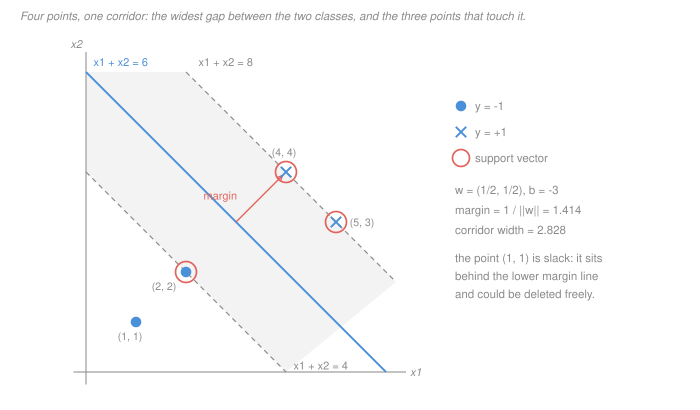

# Machine Learning · Lesson 2.2: Maximum-margin classifiers

> ⏱ ~15 min · Module 2: Classification — margins, trees, and ensembles · Builds on: [2.1 (the perceptron)](02-01-the-perceptron-and-linear-separability.md), [1.4 (regularization)](01-04-regularization-ridge-and-lasso.md) · Unlocks: 2.3 (soft margins & the dual), 2.4 (the kernel trick)

## Why this matters

The perceptron stops the instant it stops making mistakes. On separable data there are **infinitely many** separators with zero training error, and which one you get depends on the order the rows happened to arrive in — including separators that shave past a training point with a hair's clearance. Every one of them is equally good on the data you have and wildly different on the data you don't.

So you need a tie-break, and "stay as far as possible from both classes" is the obvious one. It is also the *productive* one, for three reasons that carry the rest of the module:

1. It has a closed formulation — a convex quadratic program with a **unique** answer, not an order-dependent one.
2. It depends on only a handful of points, which is what makes the dual (2.3) and kernels (2.4) affordable.
3. The margin is the quantity the generalization theory actually uses. Stated here, proved in [`statistical-learning`](../../statistical-learning/syllabus.md) (not yet built; stated here where it is used): if every training point lies within radius $R$ of the origin and a separator achieves geometric margin $\gamma$ on them, the effective complexity of the class of such separators is governed by $(R/\gamma)^2$ — **with no dependence on the dimension of $x$**. Wide margin, few effective degrees of freedom, even in a million features.

That last fact is why the same $(R/\gamma)^2$ that bounded the perceptron's *mistakes* in 2.1 turns up bounding its *generalization* here. Margin is the currency.

## The idea

Draw the two classes. Instead of drawing a line, imagine widening a **corridor** — a straight empty band — until it jams against points on both sides. The centre line of the widest corridor is your classifier, and the width of the corridor is your safety buffer.

There is a picture that lets you solve small instances without algebra. Take the **convex hull** of each class — for two points, the segment joining them. Then:

> The maximum margin is **half the distance between the two hulls**, and the boundary is the perpendicular bisector of the shortest segment joining them.

Why it must be so, in one line each way: any separating line has both hulls entirely on their own side (a hull is built from points on that side, and a half-plane is convex), so the corridor cannot be wider than the gap between the hulls; and the perpendicular bisector of the shortest joining segment achieves exactly that gap.

So finding a maximum-margin classifier by hand is a **distance-between-two-convex-sets** problem, which for a handful of points you do by looking. That is the skill this lesson trains — the algebra afterwards is bookkeeping.

## The formal version

Data $(x_1,y_1),\dots,(x_n,y_n)$ with $x_i \in \mathbb{R}^d$ and $y_i \in \{-1,+1\}$. The classifier is $f(x) = \operatorname{sign}(w^\top x + b)$, with **weight vector** $w \in \mathbb{R}^d$ and **bias** $b \in \mathbb{R}$.

**Functional margin** of point $i$ ([reference](../reference.md#functional-margin)):

$$\hat\gamma_i \;=\; y_i\,(w^\top x_i + b).$$

*In words:* positive exactly when the point is on the right side, and larger when the point sits further out on that side. Its fatal flaw: replace $(w,b)$ by $(cw,cb)$ for any $c > 0$ and **every** $\hat\gamma_i$ scales by $c$ while $f$ is the identical function. A functional margin on its own means nothing.

**Geometric margin** ([reference](../reference.md#geometric-margin)):

$$\gamma_i \;=\; \frac{y_i\,(w^\top x_i + b)}{\lVert w\rVert}, \qquad \gamma \;=\; \min_i \gamma_i .$$

*In words:* the actual perpendicular distance from $x_i$ to the hyperplane, and $\gamma$ is the distance to the closest point. The formula is just the signed distance to a hyperplane with unit normal $w/\lVert w\rVert$ (see [`linalg-refresher` 4.1](../../linalg-refresher/lessons/04-01-inner-products-orthogonality.md)); dividing by $\lVert w\rVert$ is exactly what kills the scale dependence.

**The canonical scaling.** We want to maximise $\gamma$, but $(w,b)$ has one redundant degree of freedom. Kill it by choosing the scale in which the closest point sits at functional margin exactly 1:

$$\min_i \; y_i\,(w^\top x_i + b) \;=\; 1 .$$

This is always available on separable data — the minimum is some positive number, so divide $w$ and $b$ by it. In that scaling $\gamma = 1/\lVert w\rVert$, so maximising the margin is minimising $\lVert w\rVert$, and the **hard-margin SVM** ([reference](../reference.md#hard-margin-svm)) is:

$$\min_{w,\,b}\ \tfrac12\lVert w\rVert^2 \quad\text{subject to}\quad y_i\,(w^\top x_i + b)\ \ge\ 1,\quad i = 1,\dots,n.$$

*In words:* among all separators that keep every point at functional margin at least 1, take the one with the smallest weights — because a small $w$ *is* a wide corridor, of width $2/\lVert w\rVert$.

This is a **convex quadratic program**: quadratic objective, linear constraints ([`convex-optimization` 2.2](../../convex-optimization/lessons/02-02-linear-quadratic-programs.md); the same problem from the optimizer's side is [`convex-optimization` 5.2](../../convex-optimization/lessons/05-02-support-vector-machines.md)). The objective is strictly convex in $w$, so **the optimal $w$ is unique** — the property the perceptron conspicuously lacks. Feasibility requires the data to be linearly separable; 2.3 removes that requirement.

**Support vectors.** The points where the constraint is *active*:

$$y_i\,(w^\top x_i + b) = 1 .$$

*In words:* the points sitting exactly on the edge of the corridor. Every other point has slack, and deleting it changes nothing at all.

## Picture

Note what the annotation calls **margin**: the arrow runs from the boundary to *one* margin line, not across the whole band. The margin $\gamma = 1/\lVert w\rVert$ is the half-width; the corridor is $2/\lVert w\rVert$ wide. Both numbers are useful, and confusing them is a factor-of-two error in every margin claim you make.

Also note that three of the four points touch the corridor and one does not. That ratio is not typical — in real problems it is usually a small fraction — but the *mechanism* is: only the touching points are doing any work.

## Worked examples

**Example 1 (mechanical): solve it by looking, then verify.** Negatives at $(1,1)$ and $(2,2)$; positives at $(4,4)$ and $(5,3)$.

*Step 1 — the hulls.* Each class's hull is the segment joining its two points.

*Step 2 — the shortest segment between them.* The negative hull runs along direction $(1,1)$; the positive hull along $(1,-1)$. Check the vertex-to-hull distances: from $(2,2)$, the perpendicular onto the positive segment has its foot exactly at the endpoint $(4,4)$, giving distance $\lVert(4,4)-(2,2)\rVert = 2\sqrt2 \approx 2.828$; from $(2,2)$ to $(5,3)$ is $\sqrt{10} \approx 3.162$; from $(1,1)$ to $(4,4)$ is $3\sqrt2 \approx 4.243$. The shortest is $(2,2)\!-\!(4,4)$ at $2\sqrt2$.

*Step 3 — read off the answer.* Margin $= \tfrac12(2\sqrt2) = \sqrt2 \approx 1.414$. The boundary is the perpendicular bisector of that segment: midpoint $(3,3)$, normal direction $(1,1)$, so the boundary is $x_1 + x_2 = 6$.

*Step 4 — canonical scaling.* Write $w = c\,(1,1)$. The two active constraints are

$$4c + b = -1 \quad (\text{at } (2,2)), \qquad 8c + b = +1 \quad (\text{at } (4,4)),$$

so $4c = 2$, giving $c = 1/2$ and $b = -3$. Hence $w = (1/2,\,1/2)$, $b = -3$.

*Step 5 — check every point.* With $f(x) = \tfrac12 x_1 + \tfrac12 x_2 - 3$:

| point | $y_i$ | $f(x_i)$ | $\hat\gamma_i = y_i f(x_i)$ | on the margin? |
|---|---|---|---|---|
| $(1,1)$ | $-1$ | $-2$ | $2$ | no — slack |
| $(2,2)$ | $-1$ | $-1$ | $1$ | **support vector** |
| $(4,4)$ | $+1$ | $+1$ | $1$ | **support vector** |
| $(5,3)$ | $+1$ | $+1$ | $1$ | **support vector** |

All constraints hold, three are tight, and $\lVert w\rVert = 1/\sqrt2$ gives $\gamma = 1/\lVert w\rVert = \sqrt2$ — matching Step 3, as it must.

**The one that surprises people:** $(5,3)$ is a support vector even though it is *further from the other class* than $(4,4)$ is ($\sqrt{10}$ against $2\sqrt2$). Support-vector status is about distance to the **boundary**, not to the other class, and $(5,3)$ and $(4,4)$ both lie on $x_1+x_2=8$. Meanwhile $(1,1)$, the point deepest inside its own class, is irrelevant.

**Example 2 (why you'd care): which of your rows matter.** Two experiments on the same instance.

*Delete and add far away.* Drop $(1,1)$ entirely: the three remaining constraints are unchanged, so $w$, $b$ and the margin are identical. Add a new positive at $(7,2)$: its functional margin is $\tfrac12(7) + \tfrac12(2) - 3 = 1.5 \ge 1$, so it is already satisfied and the solution does not move. You could add a million such rows and re-solving would return the same $w = (1/2,1/2)$, $b = -3$.

*Now nudge a support vector.* Move $(2,2)$ to $(2.5,2.5)$ — one point, half a step. The hull gap shrinks to $1.5\sqrt2$, so:

$$w = (2/3,\,2/3), \qquad b = -13/3, \qquad \gamma = \frac{3}{2\sqrt2} \approx 1.061 .$$

(Check: at $(2.5,2.5)$, $\tfrac23(5) - \tfrac{13}{3} = -1$; at $(4,4)$ and at $(5,3)$, $\tfrac23(8) - \tfrac{13}{3} = +1$. Three support vectors again, and the margin fell by 25 percent.)

That asymmetry is the SVM's whole personality: **the answer ignores almost all of your data and hangs on a few points at the frontier.** It is what makes the method cheap to represent and store, and it is exactly why a single mislabelled point near the boundary is catastrophic for a hard margin — the motivation for the slack variables of 2.3.

## Watch out

- **You might think** a classifier reporting big margins is confident — **but actually** multiply $w$ and $b$ by 100 and every functional margin is 100 times larger while $\operatorname{sign}(w^\top x + b)$ is unchanged, point for point. Only the geometric margin $\hat\gamma_i/\lVert w\rVert$ is a statement about the data. Whenever you compare two models' margins, check they are in the same scaling first — or compare only geometric ones.
- **You might think** the boundary bisects the closest pair of *data points* — **but actually** it bisects the shortest segment between the *hulls*, whose endpoints need not be data points at all. Negatives at $(0,0)$ and $(4,0)$, positive at $(2,3)$: the closest data pair is $(0,0)\!-\!(2,3)$ at $\sqrt{13} \approx 3.606$ (tied with $(4,0)\!-\!(2,3)$), and its bisector is $2x_1 + 3x_2 = 6.5$ — which puts $(4,0)$ at value 8, on the **positive** side. Misclassified. The true answer is the horizontal line $x_2 = 1.5$, from the hull gap of 3 realised at $(2,0)$, the midpoint of the negative edge.
- **You might think** the hard margin is a safe default — **but actually** it insists that *every* point be classified correctly, so one mislabelled row makes the QP infeasible, and one merely unlucky row can collapse the margin toward zero. Hard margin is the idealisation you learn on; 2.3's soft margin is the one you run.

## One-liner

> Fixing the scale so the nearest point sits at functional margin 1 turns "find the safest separator" into "minimise $\lVert w\rVert$" — a convex QP with a unique answer that depends only on the few points touching the corridor.

## Problems

**P1 (🟢)** Negatives at $(0,0)$ and $(1,-2)$; positives at $(4,3)$ and $(5,6)$.

(a) Find the shortest segment between the two convex hulls and give the maximum geometric margin. (b) Give $w$ and $b$ in the canonical scaling. (c) List the support vectors. (d) Give each non-support vector's functional margin, and say what would have to happen to it before the solution changed.

**P2 (🟡)** Take the lesson's solution $w = (1/2,1/2)$, $b = -3$ on the four points of Example 1, and rescale to $w' = (3/2,3/2)$, $b' = -9$.

(a) Tabulate the functional margins of all four points under both. (b) Compute the geometric margin under both. (c) Does any prediction change? (d) $(w',b')$ satisfies every constraint of the QP. So why would the QP never return it? Answer in terms of the objective value, and say what that tells you about whether the canonical scaling costs you any generality.

**P3 (🔴)** Support vectors, from the geometry alone — no dual, no KKT.

(a) Show that a point in the **interior** of its own class's convex hull can never be a support vector. (Hint: it stays in the hull if you nudge it a little in the $-y_i w$ direction, and every point of the hull satisfies the constraint.) (b) Argue that each of the two classes must contribute at least one support vector. (Hint: compare $m_+ = \min_{y_i=+1} w^\top x_i$ with $m_- = \max_{y_i=-1} w^\top x_i$; what does optimality force the gap $m_+ - m_-$ to be?) (c) Conclude the minimum possible number of support vectors for a separable 2-D problem, and give an instance that achieves it.

Solutions

**P1** (a) The negative hull is the segment $(0,0)\!-\!(1,-2)$, the positive hull the segment $(4,3)\!-\!(5,6)$. Check the vertex-to-segment distances. The positive segment is $(4,3) + t\,(1,3)$ for $t \in [0,1]$; the foot of the perpendicular from $(0,0)$ sits at

$$t = \frac{\big((0,0)-(4,3)\big)^\top (1,3)}{\lVert(1,3)\rVert^2} = \frac{-4-9}{10} < 0,$$

so it falls off the near end and the closest positive-hull point to $(0,0)$ is the endpoint $(4,3)$, at distance $\sqrt{16+9} = 5$. The same computation from $(1,-2)$ again lands on $(4,3)$, at $\sqrt{9+25} = \sqrt{34} \approx 5.83$; and from $(4,3)$ back to the negative segment the foot falls off the $(0,0)$ end, distance 5. So the shortest segment is $(0,0)\!-\!(4,3)$, length 5 — the 3-4-5 triangle.

Maximum geometric margin $= 5/2 = 2.5$.

(b) Boundary = perpendicular bisector: midpoint $(2, 1.5)$, normal $(4,3)$. Write $w = c\,(4,3)$. Active constraints:

$$0\cdot c + b = -1 \ \ (\text{at } (0,0)), \qquad 25c + b = +1 \ \ (\text{at } (4,3)),$$

so $b = -1$ and $c = 2/25$, giving $w = (8/25,\ 6/25) = (0.32,\ 0.24)$, $b = -1$. Check: $\lVert w\rVert = \tfrac{1}{25}\sqrt{64+36} = 10/25 = 2/5$, so $\gamma = 1/\lVert w\rVert = 5/2$ ✓ — it agrees with (a), which is the check worth doing every time.

(c) Functional margins: $(0,0)\to 1$; $(1,-2)\to -(0.32 - 0.48 - 1) = 1.16$; $(4,3)\to 1.28 + 0.72 - 1 = 1$; $(5,6)\to 1.6 + 1.44 - 1 = 2.04$. Support vectors: $\{(0,0),\ (4,3)\}$ — exactly two.

(d) $(1,-2)$ has functional margin $1.16$ and $(5,6)$ has $2.04$. Either could move anywhere in its own half of the corridor's exterior with no effect; the solution only changes when one of them is pushed *into* the corridor, i.e. when its functional margin under the current $(w,b)$ would drop below 1.

**P2** (a)

| point | $y_i$ | $\hat\gamma_i$ with $(w,b)$ | $\hat\gamma_i$ with $(w',b')$ |
|---|---|---|---|
| $(1,1)$ | $-1$ | 2 | 6 |
| $(2,2)$ | $-1$ | 1 | 3 |
| $(4,4)$ | $+1$ | 1 | 3 |
| $(5,3)$ | $+1$ | 1 | 3 |

Every functional margin triples, exactly as multiplying $(w,b)$ by 3 must.

(b) $\lVert w\rVert = 1/\sqrt2 \approx 0.707$ and $\lVert w'\rVert = 3/\sqrt2 \approx 2.121$. Geometric margins: $1/(1/\sqrt2) = \sqrt2$ and $3/(3/\sqrt2) = \sqrt2$. **Identical**, as they must be — the numerator and the denominator both tripled.

(c) No. $\operatorname{sign}(3(w^\top x + b)) = \operatorname{sign}(w^\top x + b)$ for every $x$: the two parameter vectors are the same classifier written twice.

(d) The objective is $\tfrac12\lVert w\rVert^2$: it is $\tfrac12 \cdot \tfrac12 = 1/4$ for $(w,b)$ and $\tfrac12\cdot\tfrac92 = 9/4$ for $(w',b')$ — nine times worse. Both are feasible; the QP minimises, so it takes the small one.

This is the point of the canonical scaling: it is **not** an extra assumption. Among all the rescalings of one geometric separator, the constraints admit exactly those with $\min_i \hat\gamma_i \ge 1$, and the objective strictly prefers the smallest such $w$, which is the one with $\min_i \hat\gamma_i = 1$. The optimizer enforces the normalisation for free; we only wrote it down to see that maximising $1/\lVert w\rVert$ and minimising $\lVert w\rVert^2$ are the same problem.

**P3** (a) Let $x$ be in the interior of the hull of the points of its class, say $y = +1$ (the $y=-1$ case is identical with signs flipped). Interior means some small ball around $x$ lies in the hull, so for small $\delta > 0$ the point $x' = x - \delta w$ is still in the hull. Every hull point is a convex combination $\sum_j \lambda_j x_j$ of same-class training points with $\sum_j \lambda_j = 1$, so

$$w^\top x' + b \;=\; \sum_j \lambda_j\,(w^\top x_j + b) \;\ge\; \sum_j \lambda_j \cdot 1 \;=\; 1,$$

using $y_j = +1$ and the constraint at each $x_j$. But $w^\top x' + b = (w^\top x + b) - \delta\lVert w\rVert^2$, so

$$w^\top x + b \;\ge\; 1 + \delta\lVert w\rVert^2 \;>\; 1 .$$

Its constraint is slack, so it is not a support vector. $\blacksquare$ (Interpretation: support vectors live on the hull's boundary, and in fact on the side of it facing the other class.)

(b) Write $m_+ = \min_{i:\,y_i=+1} w^\top x_i$ and $m_- = \max_{i:\,y_i=-1} w^\top x_i$. The constraints say exactly

$$m_+ + b \ \ge\ 1 \quad\text{and}\quad -(m_- + b) \ \ge\ 1, \qquad\text{i.e.}\qquad 1 + m_- \ \le\ b \ \le\ m_+ - 1,$$

which is possible only if $m_+ - m_- \ge 2$. Suppose the gap were strictly larger. Then rescale: put $s = 2/(m_+ - m_-) < 1$ and use $sw$, whose gap is exactly 2, together with the single $b$ that its admissible range then allows. That is feasible and its objective is $\tfrac12 s^2\lVert w\rVert^2 < \tfrac12\lVert w\rVert^2$ — so the original was not optimal.

Hence at the optimum $m_+ - m_- = 2$, which pins $b = m_+ - 1 = m_- + 1$. The positive point attaining $m_+$ then has functional margin exactly 1, and so does the negative point attaining $m_-$. **Each class contributes at least one** support vector. Geometrically: if one class were not touching the corridor you could slide the corridor toward it and then widen it.

(c) By (b) the minimum is **2**, one per class, and it is achieved — P1's instance has exactly the two support vectors $(0,0)$ and $(4,3)$. (The maximum, on the other hand, can be all $n$ points: Example 1 already has 3 of 4, and putting every point on one of the two margin lines makes all of them support vectors.)

## Flashback

**From Lesson 2.1 (the perceptron and linear separability):** four points, separated by a hyperplane **through the origin** (no bias): $(1,2)$ and $(3,1)$ labelled $+1$; $(-2,1)$ and $(-1,-3)$ labelled $-1$.

(a) Taking the unit separator $w^* = (1,0)$, compute $R = \max_i\lVert x_i\rVert$ and the margin $\gamma$ it achieves, and evaluate the perceptron mistake bound $(R/\gamma)^2$.
(b) The bound is best when $\gamma$ is best. Find the maximum-margin separator through the origin for these four points and re-evaluate the bound.
(c) The perceptron is guaranteed to stop — but with what margin? Exhibit a separator it could legitimately return whose geometric margin is below $0.05$, and say in one sentence what that shows about the relationship between the two lessons.

Solution

(a) Norms: $\lVert(1,2)\rVert = \sqrt5$, $\lVert(3,1)\rVert = \sqrt{10}$, $\lVert(-2,1)\rVert = \sqrt5$, $\lVert(-1,-3)\rVert = \sqrt{10}$. So $R = \sqrt{10}$ and $R^2 = 10$.

With $w^* = (1,0)$ (already unit norm) the margins $y_i (w^{*\top} x_i)$ are $1,\ 3,\ 2,\ 1$, so $\gamma = 1$. The bound is $(R/\gamma)^2 = 10$ mistakes.

(b) Maximise $\min_i y_i (u^\top x_i)$ over unit $u$. Reflect the negatives — put $z_i = y_i x_i$, giving $(1,2)$, $(3,1)$, $(2,-1)$, $(1,3)$ — and the problem becomes the distance from the origin to the convex hull of the $z_i$: the lesson's hull argument with one class folded onto the other. The closest hull point is $(3/2,\,1/2)$, the midpoint of the segment from $(1,2)$ to $(2,-1)$, at distance $\sqrt{10}/2$. So $u = (3,1)/\sqrt{10}$, and the four margins are

$$(+1)\frac{3+2}{\sqrt{10}} = \frac{5}{\sqrt{10}},\quad (+1)\frac{9+1}{\sqrt{10}} = \frac{10}{\sqrt{10}},\quad (-1)\frac{-6+1}{\sqrt{10}} = \frac{5}{\sqrt{10}},\quad (-1)\frac{-3-3}{\sqrt{10}} = \frac{6}{\sqrt{10}},$$

so $\gamma^* = 5/\sqrt{10} = \sqrt{10}/2 \approx 1.581$. Two constraints are tight, one from each class — $(1,2)$ and $(-2,1)$ are the support vectors, exactly the signature of an optimum that P3 describes. The bound becomes

$$(R/\gamma^*)^2 = \frac{10}{10/4} = 4 .$$

The best perceptron mistake bound available on this data is exactly the one you get from **this lesson's** classifier. That is the tie between the two lessons: the perceptron's guarantee is stated in terms of a margin it never tries to achieve.

(c) Take $w = (1,\ 1.9)$. Its functional margins are $y_i(w^\top x_i) = 4.8,\ 4.9,\ 0.1,\ 6.7$ — all positive, so it *is* a valid separator and a perceptron run could return it. But $\lVert w\rVert = \sqrt{1 + 3.61} \approx 2.147$, so its geometric margin is $0.1/2.147 \approx 0.047$, about thirty times worse than $\gamma^* \approx 1.581$. (Push the second coordinate toward 2 and the margin goes to 0: at $w=(1,1.99)$ it is $0.0045$.)

**In one sentence:** the perceptron guarantees a bounded *number of mistakes* on data that has a margin, but it makes no attempt to *return* that margin — maximising it is a separate optimisation problem, and that problem is this lesson.

## Connections

- **Backward:** [2.1](02-01-the-perceptron-and-linear-separability.md) finds *a* separator; this one picks the best one, and the flashback shows the margin was already lurking in the perceptron's own guarantee. The objective $\tfrac12\lVert w\rVert^2$ is literally [1.4's](01-04-regularization-ridge-and-lasso.md) ridge penalty — here it is the objective and the fit is the constraint. In 2.3 they swap roles and the same problem reappears as hinge loss plus a penalty.
- **Forward:** [2.3](02-03-soft-margins-and-the-svm-dual.md) adds slack so the QP survives non-separable data, and takes the dual, where "support vector" becomes "$\alpha_i > 0$". [2.4](02-04-the-kernel-trick.md) then exploits the fact that the dual sees the data only through inner products — which is only affordable *because* the solution is sparse in the points, as Example 2 showed.
- **Sideways:** the hull formulation is a **distance between two convex sets** problem, and the QP is the canonical example of [`convex-optimization` 2.2](../../convex-optimization/lessons/02-02-linear-quadratic-programs.md); the same derivation from the optimizer's side is [`convex-optimization` 5.2](../../convex-optimization/lessons/05-02-support-vector-machines.md). The margin-based generalization bound sketched in "Why this matters" belongs to [`statistical-learning`](../../statistical-learning/syllabus.md), which is where "why does a wide margin help on unseen data?" is answered rather than asserted.
