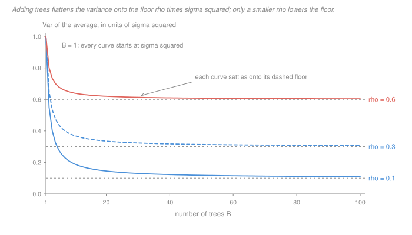

# Machine Learning · Lesson 2.6: Bagging and random forests

> ⏱ ~15 min · Module 2: Classification — margins, trees, and ensembles · Builds on: [2.5 (decision trees)](02-05-decision-trees.md), [1.2 (bias–variance)](01-02-generalization-and-the-bias-variance-tradeoff.md) · Unlocks: 2.7 (boosting)

## Why this matters

A decision tree is the most *unstable* model in this course. [Lesson 2.5](02-05-decision-trees.md) showed why: the root split is chosen by a greedy comparison of impurity gains, and when two candidate splits score close together, changing a single training row can flip the winner — and a different root means a different tree all the way down. In the language of [1.2](01-02-generalization-and-the-bias-variance-tradeoff.md), a deep tree is low bias and enormous variance.

Averaging is the cheapest variance fix in machine learning. It costs no modelling thought — no new loss, no new penalty, no tuning of a shrinkage parameter — only compute, and the compute is embarrassingly parallel. This is why random forests are still, twenty-five years on, the sane first thing to try on a tabular dataset.

But averaging has a **hard ceiling**, and the ceiling has an exact formula. That formula is this lesson. It tells you the one thing you actually need in practice: when to stop buying trees, and what to buy instead.

## The idea

Average $B$ noisy predictors and the noise partly cancels. If they were **independent**, the variance of the average would be $\sigma^2/B$ — drive $B$ up and the variance goes to zero, no limit.

They are not independent. Every tree in the forest is fit to a resample of the *same* training set, so every tree inherits whatever that particular training set happened to get wrong. That shared part does not cancel, no matter how many trees you average.

> A forest of 500 trees is a portfolio of 500 tech stocks. Diversifying kills the idiosyncratic risk of any one holding; the market-wide component survives however many you buy.

So there are two knobs, and they are not interchangeable:

| knob | what it is | what it buys |
|---|---|---|
| $B$ | how many trees | shrinks only the *non*-shared part of the variance; diminishing, then nothing |
| $\rho$ | how alike the trees are | moves the floor itself — the only knob that ever gets you below it |

Plain bagging — resample the rows, fit a tree, repeat — leaves $\rho$ high, and for a specific reason: if one feature is strongly predictive, the greedy split search puts it at the root of nearly every tree, whatever the resample. The trees agree because they all found the same obvious thing first.

**Random forests break the agreement on purpose.** At each split, hide all but a random handful of the features; a tree that cannot see the dominant feature is forced to find something else. Each individual tree gets slightly worse, and the average gets substantially better.

And there is a free bonus. A bootstrap sample of size $n$, drawn with replacement, misses roughly a third of the rows. Every tree therefore comes with its own held-out set that you never had to set aside — **out-of-bag** data, an honest error estimate for nothing.

## The formal version

**Bootstrap sample.** Given training rows $z_1,\dots,z_n$, draw $n$ rows *with replacement*. Some rows appear twice or more; some do not appear at all.

**Bagging** (bootstrap aggregating). For $b = 1,\dots,B$, draw a bootstrap sample and fit a predictor $\hat f^{*b}$ on it. Predict by averaging:

$$\hat f_{\text{bag}}(x) \;=\; \frac{1}{B}\sum_{b=1}^{B} \hat f^{*b}(x)$$

*In words:* fit the same model to $B$ jittered copies of your data and average the answers. For classification, take the majority vote (or average the class probabilities, which is usually better).

**Random forest.** Bagging, plus: at **every split of every tree**, restrict the split search to a fresh random subset of $m$ of the $p$ features. Conventional defaults are $m = \lfloor\sqrt p\rfloor$ for classification and $m = \lfloor p/3\rfloor$ for regression. Trees are grown deep and left unpruned — you want each tree's bias low and you are relying on the average to handle the variance.

### Result 1: the out-of-bag fraction

For a fixed row $i$, each of the $n$ draws misses it with probability $1 - 1/n$, and the draws are independent, so

$$\Pr(\text{row } i \text{ is out of bag}) \;=\; \Big(1 - \tfrac1n\Big)^{\!n} \;\xrightarrow[n\to\infty]{}\; e^{-1} \approx 0.368 .$$

*In words:* about 37 percent of the rows sit out of any given tree, and about 63 percent are in it (counting distinct rows). So each row can be scored by the sub-forest of trees that never saw it, and averaging that gives the **out-of-bag error** — a held-out estimate that costs one extra bookkeeping array. Forward link: [4.1](04-01-model-selection-and-cross-validation.md) treats what an honest error estimate has to satisfy, and how OOB compares with $k$-fold.

### Result 2: the correlation floor

Let $X_1,\dots,X_B$ be the $B$ trees' predictions at one fixed test point $x$. They are identically distributed (same procedure, exchangeable resamples) with variance $\sigma^2$ and **pairwise correlation** $\rho$, so $\operatorname{Cov}(X_i, X_j) = \rho\sigma^2$ for $i \ne j$. Expanding the variance of a sum ([`prob-stat-refresher` 3.1](../../prob-stat-refresher/lessons/03-01-joint-distributions-covariance.md)):

$$\operatorname{Var}\!\Big(\frac1B\sum_i X_i\Big) = \frac{1}{B^2}\Big[\sum_i \operatorname{Var}(X_i) + \sum_{i\neq j}\operatorname{Cov}(X_i,X_j)\Big] = \frac{B\sigma^2 + B(B-1)\rho\sigma^2}{B^2}$$

and collecting terms gives the formula the whole lesson turns on:

$$\boxed{\;\operatorname{Var}\big(\hat f_{\text{bag}}(x)\big) \;=\; \rho\,\sigma^2 \;+\; \frac{1-\rho}{B}\,\sigma^2\;}$$

*In words:* the variance splits into a shared part you can never average away and a private part that shrinks like $1/B$.

Four checks that it is the right formula:

- $B = 1$: gives $\rho\sigma^2 + (1-\rho)\sigma^2 = \sigma^2$, a single tree. ✓
- $\rho = 0$ (independent trees): gives $\sigma^2/B$, the textbook result. ✓
- $\rho = 1$ (identical trees): gives $\sigma^2$ for every $B$ — averaging copies of one thing is that thing. ✓
- $B \to \infty$: gives $\rho\sigma^2$. **The floor.**

**The consequence.** Once $B$ is large the variance is essentially $\rho\sigma^2$, a *product*. So the question "is this change to my forest worth it?" has one answer: **does it lower $\rho\sigma^2$?** Feature subsampling raises $\sigma^2$ a little — a tree denied its best feature is a worse tree — and lowers $\rho$ a lot, and the trade is usually favourable. Push $m$ too low and the trees get so weak that $\sigma^2$ (and the bias) climb faster than $\rho$ falls, so $m$ is a genuine hyperparameter, not a constant.

### Cost

Growing one tree costs $O(m\,n\log n)$ with pre-sorted features: $O(\log n)$ levels, each level touching all $n$ rows once per candidate feature, with $m$ features considered per node ($m = p$ for plain bagging). Multiply by $B$. Prediction is $B$ root-to-leaf traversals, $O(B\log n)$ per query. See [`algorithms` 1.1](../../algorithms/lessons/01-01-asymptotic-notation.md) for the notation.

Two things fall straight out. At $p = 100$, $m = \lfloor\sqrt{100}\rfloor = 10$, so each random-forest tree costs about a tenth of a bagged tree — the decorrelation is not just better, it is *cheaper*. And every tree is fit independently, so $B$ trees on $B$ cores take the time of one: $B$ is the one hyperparameter in this course you can buy with hardware.

## Picture

Read the figure as a *stopping rule*. Every curve is steep for the first twenty trees or so and visually flat well before a hundred — that is the $(1-\rho)/B$ term dying. After that the curve is pinned to its floor, and the floors are far apart. The vertical gaps between the three curves at $B = 100$ are almost entirely gaps between $\rho$ values, not between $B$ values.

Which is the whole practical lesson: **the distance you can still travel downward is set by $\rho$, and $B$ only decides how quickly you arrive.**

## Worked examples

**Example 1 (mechanical): what a bootstrap sample leaves behind.** Take $n = 5$ rows, numbered 1–5, and draw five with replacement — say

$$(3,\; 1,\; 4,\; 1,\; 3).$$

In-bag distinct rows: $\{1,3,4\}$. Out-of-bag: $\{2,5\}$. This tree gets scored on rows 2 and 5, which it has never seen.

That was one draw. The probability *any* particular row is out of bag at $n = 5$ is exact:

$$\Big(1-\tfrac15\Big)^{5} = \Big(\tfrac45\Big)^{5} = \frac{1024}{3125} = 0.32768 .$$

Watch it climb to its limit:

| $n$ | $(1-1/n)^n$ | expected distinct rows in bag |
|---|---|---|
| 5 | 0.3277 | 3.36 of 5 |
| 10 | 0.3487 | 6.51 of 10 |
| 100 | 0.3660 | 63.40 of 100 |
| 1000 | 0.3677 | 632.3 of 1000 |
| $\to\infty$ | $e^{-1} = 0.3679$ | 63.2 percent |

It approaches $e^{-1}$ from below and is within 1 percent of it by $n = 100$, so "each tree sees about 63 percent of the rows and is tested on the other 37 percent" is safe at any realistic $n$.

**Example 2 (why you'd care): trees are cheap, decorrelation is what you are actually buying.** A plain bagged ensemble on data with one dominant feature; suppose the trees come out with $\rho = 0.6$. Take $\sigma^2 = 1$ so every number below is a multiple of a single tree's variance.

| forest | $\rho\sigma^2 + \frac{1-\rho}{B}\sigma^2$ | value |
|---|---|---|
| one tree ($B = 1$) | $0.6 + 0.4/1$ | $1.000$ |
| $B = 25$ | $0.6 + 0.4/25$ | $0.616$ |
| $B = 100$ | $0.6 + 0.4/100$ | $0.604$ |
| $B = 200$ | $0.6 + 0.4/200$ | $0.602$ |
| $B = \infty$ | $0.6$ | $0.600$ |

Going from 100 trees to 200 buys you $0.002$. Going from 100 trees to *infinitely many* buys you $0.004$. You are done at $B = 100$; the rest of the compute is wasted.

Now subsample features instead, and suppose it drops the correlation to $\rho = 0.3$ while leaving $\sigma^2$ unchanged. At the same $B = 100$:

$$0.3 + \frac{0.7}{100} = 0.307 .$$

A saving of $0.297$ — roughly **150 times** what doubling the forest was worth, and 74 times what an *infinite* forest at $\rho = 0.6$ would have been worth. Even if the weaker trees cost you a 15 percent rise in $\sigma^2$, the variance is $1.15 \times 0.307 = 0.353$, still less than $0.604$.

That single comparison is why the method is called a random *forest* and not just bagged trees.

## Watch out

- **You might think** adding trees can eventually overfit, the way adding depth does — **but actually** $B$ is not a complexity parameter at all. The variance formula is monotonically decreasing in $B$ and converges to $\rho\sigma^2$; more trees can never make the forest worse, only slower. You stop for compute, not for overfitting. What *can* overfit is each tree's depth and, indirectly, $m$.
- **You might think** bagging improves the model in general — **but actually** it only touches the variance term. The average of identically distributed predictors has the *same expectation* as one of them, so the bias is unchanged; and since each tree sees only about 63 percent of the distinct rows, bagging typically makes the bias slightly **worse**. This is exactly why bagged trees are grown deep and unpruned: buy bias down at the tree level, buy variance down at the ensemble level. [Boosting (2.7)](02-07-boosting.md) attacks the other term, and by the opposite mechanism.
- **You might think** $\rho$ is a correlation between features — **but actually** it is the correlation between two *trees' predictions at the same test point*, taken over the randomness of the training set and the resampling. Correlated features are one cause of high $\rho$ (they let many trees find the same root split), but $\rho$ is a property of the fitted ensemble, not of the design matrix.

## One-liner

> Averaging $B$ trees drives the variance to $\rho\sigma^2 + (1-\rho)\sigma^2/B$, so past a hundred trees the only thing left to buy is a smaller $\rho$ — which is precisely what hiding features from each split is for.

## Problems

**P1 (🟢)** Two forests: **F** has $B = 200$ and $\rho = 0.1$; **G** has $B = 20$ and $\rho = 0.4$.

(a) Give each one's variance as an exact multiple of $\sigma^2$, and state each one's floor.
(b) For a forest with pairwise correlation $\rho$, find the smallest $B$ at which the variance is **within 1 percent of its own floor** — that is, the smallest $B$ with $\frac{1-\rho}{B}\sigma^2 \le 0.01\,\rho\sigma^2$. Give the general formula, then evaluate it at $\rho = 0.1$ and $\rho = 0.4$.
(c) In one sentence, say what (b) implies about the common advice "use 100 trees".

**P2 (🟡)** (a) Prove that $(1-1/n)^n \to e^{-1}$, and say (with a number from Example 1) how fast the convergence is.
(b) Out-of-bag error is often sold as free cross-validation. Give **two** distinct reasons it is not the same quantity as $k$-fold CV error on the same forest, and say which direction each reason biases the OOB estimate.

**P3 (🔴)** Bagging transforms decision trees and does essentially nothing for ordinary least squares ([1.3](01-03-linear-regression-and-least-squares.md)). Explain why, in terms of the variance formula: name which of the two terms averaging can touch, and say what $\rho$ is for bagged OLS and why. Then predict the ratio $\operatorname{Var}(\hat f_{\text{bag}})/\operatorname{Var}(\hat f_{\text{single}})$ at $B = 100$ for each of the two base learners.

Solutions

**P1** (a) Using $\rho\sigma^2 + \frac{1-\rho}{B}\sigma^2$:

$$\textbf{F}:\quad \frac{1}{10} + \frac{9/10}{200} = \frac{209}{2000} = 0.1045\,\sigma^2, \qquad \text{floor } 0.1\,\sigma^2 .$$

$$\textbf{G}:\quad \frac{2}{5} + \frac{3/5}{20} = \frac{43}{100} = 0.43\,\sigma^2, \qquad \text{floor } 0.4\,\sigma^2 .$$

Both sit close to their floors — F is 4.5 percent above its floor, G is 7.5 percent above. Neither forest's problem is a shortage of trees.

(b) Solve $\frac{1-\rho}{B} \le 0.01\rho$:

$$B \;\ge\; \frac{100(1-\rho)}{\rho}.$$

At $\rho = 0.1$: $B \ge 900$. At $\rho = 0.4$: $B \ge 150$. (Check at $\rho = 0.1$: $B = 900$ gives $0.1 + 0.9/900 = 0.101$, exactly $1.01$ times the floor; $B = 899$ gives $0.10100 \ldots$, just above.)

(c) The advice is fine for a *highly correlated* ensemble and too stingy for a well-decorrelated one — the required $B$ grows like $(1-\rho)/\rho$, so the better your forest is, the more trees it takes to realise the benefit. Ironically, the forests worth building are the ones that need the most trees.

**P2** (a) Take logs. With $u = 1/n$,

$$n\ln\Big(1-\frac1n\Big) = n\Big(-\frac1n - \frac{1}{2n^2} - \frac{1}{3n^3} - \cdots\Big) = -1 - \frac{1}{2n} - O(n^{-2}) \;\longrightarrow\; -1,$$

using the series $\ln(1-u) = -\sum_{k\ge1} u^k/k$, valid for $|u| < 1$. Exponentiating, $(1-1/n)^n \to e^{-1}$. The $-1/(2n)$ term says the approach is from **below** and the error is $O(1/n)$ — which matches Example 1: at $n = 100$ the value is $0.3660$ against $e^{-1} = 0.3679$, a gap of $0.0019 \approx 1/(2\cdot 100)\cdot e^{-1}$.

(b) Two reasons, both pushing the same way:

1. **Each row is scored by a smaller forest.** Row $i$'s OOB prediction averages only the $\approx 0.368B$ trees that missed it, not all $B$. So OOB measures the error of a forest of about 37 percent of the size. Since variance falls with $B$, this makes OOB **pessimistic** (biased upward) — badly so at small $B$, negligibly at $B = 1000$.
2. **Each tree is trained on less data.** A bootstrap sample contains only about 63 percent distinct rows, so every tree is effectively trained on $0.63n$ rows. In training-set size, OOB resembles roughly 3-fold CV, not 10-fold — and less training data means more error, so again **pessimistic**.

A third, more technical reason if you want it: the OOB "folds" are random and overlapping rather than a partition, so the OOB estimate is not an average of independent held-out errors and its standard error is harder to state honestly.

**P3** **Which term.** Averaging cannot touch bias — the average of identically distributed predictors has their common expectation — and within the variance it can only shrink the $\frac{1-\rho}{B}\sigma^2$ part. So bagging is worth doing exactly when (i) $\sigma^2$ is large relative to the bias, and (ii) $\rho$ is well below 1.

**Trees fail both conditions in the good direction.** A deep tree has small bias and large $\sigma^2$, and it is a *discontinuous* function of the data: shift one row and a split threshold can jump, re-partitioning everything below it. Two bootstrap resamples therefore give genuinely different trees, so $\rho$ is well under 1 and there is a large private part to average away.

**OLS fails both in the bad direction.** $\hat\beta = (X^\top X)^{-1}X^\top y$ is *linear* in $y$ and smooth in the data — resampling perturbs it only slightly — so the fits from two bootstrap samples are nearly the same function, and $\rho \approx 1$. Worse, averaging bootstrap replicates of an (almost) linear estimator approximately reproduces the full-sample estimator, so bagged OLS $\approx$ OLS. There is essentially no private part to remove, and OLS's variance was the small term to begin with; its error on a nonlinear problem is dominated by **bias**, which bagging cannot touch at all.

**Predicted ratios at $B = 100$**, from $\operatorname{Var}(\hat f_{\text{bag}})/\sigma^2 = \rho + (1-\rho)/100$:

- OLS, $\rho \approx 1$: ratio $\approx 1.00$ — no improvement.
- Deep tree, $\rho$ somewhere near $0.5$: ratio $\approx 0.5 + 0.5/100 = 0.505$ — the variance roughly halves.

(Checked by simulation before publishing: $n = 60$ points from $y = x + \varepsilon$ with $\varepsilon \sim \mathcal N(0, 0.5^2)$, prediction at $x_0 = 0.3$, $B = 100$, over 400 independent training sets and three seeds. Bagged OLS ratio $1.00$–$1.01$ (implied $\rho \approx 1$); bagged depth-8 tree ratio $0.46$–$0.50$ (implied $\rho \approx 0.46$–$0.50$). The single tree's variance was also about 31 times the single OLS fit's — the term bagging attacks was much bigger to start with.)

## Flashback

**From Lesson 2.5 (Decision trees):** eight rows, two binary features $A$ and $B$, binary label $y$. Use [Gini impurity](../reference.md#gini-impurity) throughout.

| row | $A$ | $B$ | $y$ |
|---|---|---|---|
| 1 | 0 | 0 | 0 |
| 2 | 0 | 1 | 0 |
| 3 | 0 | 1 | 0 |
| 4 | 0 | 1 | 0 |
| 5 | 1 | 0 | 1 |
| 6 | 1 | 0 | 1 |
| 7 | 1 | 1 | 1 |
| 8 | 1 | 1 | 0 |

(a) Compute the Gini gain of the root split on $A$ and on $B$, as exact fractions. Which feature does a greedy tree put at the root?
(b) Now flip row 1's label from $0$ to $1$ — one row, one bit. Recompute both gains. What happens, and what does it say about the variance of a single tree?

Solution

(a) Parent: 3 positives and 5 negatives out of 8, so $I = 1 - (3/8)^2 - (5/8)^2 = \tfrac{15}{32}$.

**Split on $A$.** $A = 0$ (rows 1–4): 0 positives of 4, $I = 0$. $A = 1$ (rows 5–8): 3 of 4, $I = 1 - \tfrac{9}{16} - \tfrac1{16} = \tfrac38$.

$$\Delta_A = \frac{15}{32} - \Big[\tfrac12\cdot 0 + \tfrac12\cdot\tfrac38\Big] = \frac{15}{32} - \frac{3}{16} = \frac{9}{32} \approx 0.281 .$$

**Split on $B$.** $B = 0$ (rows 1, 5, 6): 2 of 3, $I = 1 - \tfrac49 - \tfrac19 = \tfrac49$. $B = 1$ (rows 2, 3, 4, 7, 8): 1 of 5, $I = 1 - \tfrac1{25} - \tfrac{16}{25} = \tfrac8{25}$.

$$\Delta_B = \frac{15}{32} - \Big[\tfrac38\cdot\tfrac49 + \tfrac58\cdot\tfrac8{25}\Big] = \frac{15}{32} - \Big[\tfrac16 + \tfrac15\Big] = \frac{15}{32} - \frac{11}{30} = \frac{49}{480} \approx 0.102 .$$

**$A$ wins**, and not narrowly — $0.281$ against $0.102$.

(b) With row 1 relabelled the parent is 4 and 4, so $I = \tfrac12$.

$A = 0$: 1 of 4, $I = \tfrac38$. $A = 1$: 3 of 4, $I = \tfrac38$. Weighted $\tfrac38$, so $\Delta_A = \tfrac12 - \tfrac38 = \tfrac18 = 0.125$.

$B = 0$ (rows 1, 5, 6): 3 of 3, now **pure**, $I = 0$. $B = 1$: 1 of 5, $I = \tfrac8{25}$. Weighted $\tfrac58\cdot\tfrac8{25} = \tfrac15$, so $\Delta_B = \tfrac12 - \tfrac15 = \tfrac3{10} = 0.3$.

**$B$ wins now**, again not narrowly. One flipped bit reversed a decisive-looking comparison, and since the root determines which rows reach which subtree, *every* node below it changes too. That is what "a tree is a high-variance estimator" means concretely — not that its predictions wobble a little, but that the whole object is a discontinuous function of the training data.

Bagging does not fix this; it **exploits** it. A perturbation this violent is exactly what makes two bootstrap trees genuinely different, which is what keeps $\rho$ below 1, which is what makes the average worth taking. (Try deleting row 7 instead — something about a third of bootstrap samples do, since $(7/8)^8 = 0.344$ — and the two gains tie *exactly* at $\tfrac{32}{147}$. A tie at the root means the tie-break rule alone decides the model.)

## Connections

- **Backward:** the instability that makes this work is [2.5's](02-05-decision-trees.md) greedy root split, and the variance being attacked is the middle term of [1.2's](01-02-generalization-and-the-bias-variance-tradeoff.md) decomposition — bagging is the one method in this course that hits that term and *only* that term. The derivation is the covariance-of-a-sum expansion from [`prob-stat-refresher` 3.1](../../prob-stat-refresher/lessons/03-01-joint-distributions-covariance.md); the cost accounting is [`algorithms` 1.1](../../algorithms/lessons/01-01-asymptotic-notation.md).
- **Forward:** [2.7 (boosting)](02-07-boosting.md) is the same word, "ensemble", with the opposite mechanism — sequential rather than parallel, bias rather than variance, and consequently far more fragile to label noise. [4.1](04-01-model-selection-and-cross-validation.md) picks up [out-of-bag error](../reference.md#out-of-bag-error) and asks what an honest error estimate has to satisfy; [4.3](04-03-diagnosing-models-in-practice.md) uses forests as the low-variance baseline you compare a suspicious model against. Why averaging generalizes — as a theorem rather than as a variance calculation — belongs to [`statistical-learning`](../../statistical-learning/syllabus.md) (not yet built; the variance identity is stated in full above, where it is used).
- **Sideways:** $\rho\sigma^2 + \frac{1-\rho}{B}\sigma^2$ is, symbol for symbol, the variance of an equally weighted portfolio of $B$ correlated assets ([`mathematical-finance`](../../mathematical-finance/syllabus.md)). The floor $\rho\sigma^2$ is systematic risk, the part diversification cannot remove; $\frac{1-\rho}{B}\sigma^2$ is idiosyncratic risk. "Buy a smaller $\rho$, not a bigger $B$" is the same advice a portfolio manager gives, arrived at from the same algebra. The bootstrap itself is the resampling idea that also underlies confidence intervals without a distributional assumption in [`prob-stat-refresher`](../../prob-stat-refresher/syllabus.md).
