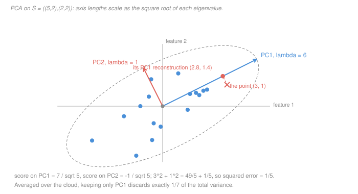

# Machine Learning · Lesson 3.2: Principal component analysis

> ⏱ ~15 min · Module 3: Probabilistic and unsupervised learning · Builds on: [1.3 (least squares as projection)](01-03-linear-regression-and-least-squares.md), [3.1 (naïve Bayes)](03-01-naive-bayes.md) · Unlocks: 3.3 (k-means)

## Why this matters

You have 500 columns and you suspect that maybe six of them, in some combination, carry the story. PCA is the answer to "which combinations?", and it is everywhere: it is how you plot 500-dimensional data on a page, how you decorrelate features before a model that hates collinearity, how you denoise a signal by throwing away its smallest directions, and — via the SVD — it is literally the same computation that read [ridge regression](01-04-regularization-ridge-and-lasso.md) as shrinkage along singular directions.

It is also the method most often run without being understood, because it is one line of library code that always returns *something*. The whole of PCA is the eigendecomposition of a [covariance matrix](../reference.md#covariance-matrix), so **every claim you can make about a PCA is a claim about eigenvalues** — how many components to keep, how much you lost, whether the answer means anything at all. This lesson is about reading those eigenvalues, and about the two places the reading goes wrong: units, and the difference between *variance* and *information*.

## The idea

Picture a cloud of points shaped like a cigar. It lives in two dimensions, but it is nearly one-dimensional: tell me where a point sits along the cigar's long axis and I can guess its other coordinate to within the cigar's thickness. Replacing two numbers by one costs you only that thickness.

PCA formalises "the long axis." There are two ways to say what makes a direction good, and the surprise is that they are the same thing:

- **Keep the most.** Project every point onto a line through the centre. Each direction gives a spread of projected values; pick the direction with the largest variance.
- **Lose the least.** Project every point onto a line, then measure how far each point is from its own shadow. Pick the direction that minimises the total squared miss.

They agree because of the Pythagorean theorem. For a centred point $x$ and a unit direction $u$, the shadow and the miss are the two legs of a right triangle:

$$\|x\|^2 \;=\; \underbrace{(u^\top x)^2}_{\text{what you keep}} \;+\; \underbrace{\|x - (u^\top x)\,u\|^2}_{\text{what you lose}}.$$

The left-hand side does not depend on $u$ at all. So the total squared length of your data is a fixed budget, and every direction just splits it into kept and lost. **Keeping the most is losing the least — they are the same sentence.** (This is the orthogonal-decomposition identity from [`linalg-refresher` 4.1](../../linalg-refresher/lessons/04-01-inner-products-orthogonality.md), and the same one that made the least-squares fit in [1.3](01-03-linear-regression-and-least-squares.md) a projection.)

The second-best direction is the best one among those perpendicular to the first, and so on down. That is exactly the recipe the spectral theorem hands you for free.

## The formal version

Let $X$ be the $n \times p$ data matrix, rows are samples. **Centre it first** — subtract the column means to get $\tilde X$ — and form the sample covariance matrix

$$S \;=\; \frac{1}{n-1}\,\tilde X^\top \tilde X \qquad (p \times p,\ \text{symmetric},\ \text{positive semidefinite}).$$

*In words:* $S_{jk}$ is the sample covariance of feature $j$ with feature $k$; the diagonal holds the variances.

Because $S$ is symmetric, the [spectral theorem](../../linalg-refresher/lessons/05-01-spectral-theorem-quadratic-forms.md) gives an **orthonormal** basis of eigenvectors $v_1,\dots,v_p$ with real eigenvalues $\lambda_1 \ge \lambda_2 \ge \dots \ge \lambda_p \ge 0$. Those eigenvectors are the **principal components**; $v_i$ is PC $i$.

**Why they are the answer.** For any unit vector $u$, the variance of the data projected onto $u$ is the quadratic form

$$\operatorname{Var}(u^\top x) \;=\; u^\top S\, u,$$

and maximising a quadratic form over the unit sphere is exactly the Rayleigh-quotient problem whose maximum is $\lambda_1$, attained at $v_1$. Restrict to $u \perp v_1$ and the maximum is $\lambda_2$ at $v_2$. *In words:* the eigenvalue **is** the variance along its eigenvector.

**Explained variance.** Since $\operatorname{tr} S = \sum_j S_{jj} = \sum_i \lambda_i$, the total variance in the data is fixed and the [explained variance](../reference.md#explained-variance) fraction of component $i$ is

$$\frac{\lambda_i}{\lambda_1 + \dots + \lambda_p}.$$

Keeping the top $k$ components keeps $(\lambda_1 + \dots + \lambda_k)/\operatorname{tr} S$ of the variance and discards the rest as reconstruction error — the same number read two ways, by the Pythagorean identity above.

**The SVD route.** Write the centred data's [singular value decomposition](../../linalg-refresher/lessons/05-02-svd.md) as $\tilde X = U\Sigma V^\top$. Then

$$S \;=\; \frac{1}{n-1}V\Sigma^\top U^\top U \Sigma V^\top \;=\; V \frac{\Sigma^2}{n-1} V^\top,$$

so **the right singular vectors are the principal components** and $\lambda_i = \sigma_i^2/(n-1)$. This is not a curiosity — it is how PCA is actually computed, for two reasons. It never forms the $p \times p$ matrix $S$ (see the cost below), and it does not square the conditioning: $\kappa(S) = \kappa(\tilde X)^2$, so a design matrix with condition number $10^4$ — unremarkable — yields a covariance matrix at $10^8$, past the point where single precision has any digits left.

**Cost.** Covariance route: $O(np^2)$ to form $S$, then $O(p^3)$ to eigendecompose it. Truncated-SVD route: $O(npk)$ for the top $k$ components.

## Picture

The cloud above has sample covariance

$$S = \begin{pmatrix} 5 & 2 \\ 2 & 2\end{pmatrix},$$

and the dashed outline is its two-standard-deviation contour. The two arrows are its eigenvectors, drawn with lengths proportional to $\sqrt{\lambda_i}$ (not $\lambda_i$ — the eigenvalue is a variance, and a length is a standard deviation). The dashed coral segment is one point's reconstruction error. Compressing this cloud to one number means recording where each point's shadow lands on the blue arrow and forgetting the dashed segment entirely.

## Worked examples

**Example 1 (mechanical): a 2×2 by trace and determinant.** Take

$$S = \begin{pmatrix} 5 & 2 \\ 2 & 2\end{pmatrix}.$$

You never need the quadratic-formula machinery — for a $2\times 2$ the characteristic polynomial is determined by two numbers you can read off:

$$\lambda^2 - (\operatorname{tr} S)\lambda + \det S = 0, \qquad \operatorname{tr} S = 7,\ \ \det S = 10 - 4 = 6,$$

so $\lambda^2 - 7\lambda + 6 = 0$ and $\lambda_1 = 6$, $\lambda_2 = 1$. (Check: they sum to 7 and multiply to 6. ✓) **This is the trick worth memorising** — sum and product pin down a pair.

Top eigenvector: solve $(S - 6I)v = 0$, whose first row reads $(5-6)x + 2y = 0$, i.e. $x = 2y$. So $v_1 \propto (2,1)$, normalised $v_1 = (2,1)/\sqrt5$, and $v_2 = (-1,2)/\sqrt5$ perpendicular to it. PC1 explains

$$\frac{\lambda_1}{\lambda_1 + \lambda_2} = \frac{6}{7} \approx 85.7\ \text{percent}$$

of the variance.

Now compress one centred point, $x = (3,1)$. Its scores are $u^\top x$ along each PC:

$$u_1^\top x = \frac{6+1}{\sqrt5} = \frac{7}{\sqrt5}, \qquad u_2^\top x = \frac{-3+2}{\sqrt5} = \frac{-1}{\sqrt5}.$$

Keep only the first. The reconstruction is $(7/5)(2,1) = (2.8,\,1.4)$, the error vector is $(0.2,\,-0.4)$, and its squared length is $0.04 + 0.16 = 1/5$ — which is exactly $(u_2^\top x)^2$, as it must be. The Pythagorean budget balances: $\|x\|^2 = 9 + 1 = 10$ and $\tfrac{49}{5} + \tfrac15 = 10$. ✓

**Example 2 (why you'd care): why nobody forms the covariance matrix.** Text data: $n = 10^4$ documents, $p = 10^5$ vocabulary features, and you want $k = 10$ components for a plot.

| | count | at $10^{10}$ flops/s |
|---|---|---|
| form $S$ | $np^2 = 10^{14}$ | ~3 hours |
| eigendecompose $S$ | $p^3 = 10^{15}$ | ~28 hours |
| truncated SVD, $k=10$ | $npk = 10^{10}$ | ~1 second |

But the arithmetic is not what stops you. $S$ has $p^2 = 10^{10}$ entries, which at 8 bytes each is **80 GB** — while the data itself, $np = 10^9$ entries, is only 8 GB. **Memory breaks first**, and it breaks on an object that was never part of the question. The truncated SVD only ever multiplies $\tilde X$ by thin blocks of vectors, so it never materialises anything bigger than the data. This is the design-under-constraint answer: at $p = 10^5$ the covariance route is not slow, it is impossible.

## Watch out

- **PCA is not scale-invariant, and this is the mistake that ruins real analyses.** You might think PCA finds structure in your data; but actually it finds structure in your *units*. Take two uncorrelated features, temperature (variance $9\ \text{deg}^2$) and pressure (variance $16\ \text{kPa}^2$):

  $$S = \begin{pmatrix} 9 & 0 \\ 0 & 16\end{pmatrix} \;\Rightarrow\; \text{PC1 is the pressure axis},\ \ \frac{16}{25} = 64\ \text{percent}.$$

  Now report pressure in bar instead of kPa — same measurements, 1 bar = 100 kPa. Its variance divides by $10^4$ to $0.0016$, and

  $$S' = \begin{pmatrix} 9 & 0 \\ 0 & 0.0016\end{pmatrix} \;\Rightarrow\; \text{PC1 is the temperature axis},\ \ \frac{9}{9.0016} \approx 99.98\ \text{percent}.$$

  PC1 flipped to the orthogonal direction and the data went from "clearly two-dimensional" to "essentially one-dimensional" because of a unit conversion. The fix is to run PCA on the **correlation** matrix — standardise each column to unit variance — whenever your columns are in incomparable units. The exception, and it is a real one: do *not* standardise when the columns share a unit and their relative sizes are meaningful (pixel intensities, asset returns in one currency, a spectrum), because there the large variances are the signal and standardising throws it away.

- **You might think uncorrelated means independent — but actually PCA only ever sees second moments.** Points spread uniformly around a circle have a covariance matrix proportional to the identity: every direction is equally "principal," every eigenvalue is equal, and PCA reports that there is no structure. There is enormous structure; it is just not linear. (This is the same gap [3.1](03-01-naive-bayes.md) traded on from the other side — there, an *assumed* independence that was false.)

- **You might think the top components are the useful ones — but actually PCA never saw your labels.** Variance is not discrimination. The direction along which your two classes differ can carry the smallest eigenvalue in the problem, in which case standard practice ("keep 95 percent of the variance") throws away the only column that mattered. P3 builds that instance exactly.

## One-liner

> PCA diagonalises the covariance matrix, so every question about it — how many components, how much lost, is it meaningful — is a question about eigenvalues; and the two things eigenvalues cannot know are what units you chose and what you were trying to predict.

## Problems

**P1 (🟢)** For the sample covariance matrix

$$S = \begin{pmatrix} 10 & 6 \\ 6 & 5\end{pmatrix}$$

(a) Find both eigenvalues by trace and determinant.
(b) Give both principal components as unit vectors, and each one's explained-variance fraction.
(c) If you keep only PC1, what is the mean squared reconstruction error per point?

**P2 (🟡)** Packages are measured by length in metres and mass in kilograms, with

$$S = \begin{pmatrix} 1 & 3.5 \\ 3.5 & 25 \end{pmatrix}.$$

(a) Give $\lambda_1,\lambda_2$, PC1, and PC1's explained-variance fraction.
(b) A colleague re-exports the same data with length in **millimetres**. Write the new covariance matrix, and give PC1 and its explained-variance fraction (the eigenvalues are irrational here, so a few decimals are fine).
(c) What does PC1 become if you standardise both columns first, and what does it explain? Name one situation in which you would deliberately *not* standardise.

**P3 (🔴)** PCA finds variance, not discrimination. Construct a two-class dataset in the plane — give the actual points — for which PC1 is *exactly* the useless direction:
(a) give the points, the covariance matrix $S$, and its eigen-decomposition;
(b) show that projecting onto PC1 makes the two classes **identical**, while PC2 separates them perfectly;
(c) rescale one feature by a factor $t$ so that PC1 explains more than 99 percent of the variance while remaining exactly as useless; give the smallest integer $t$ that works and say what a "keep 95 percent of the variance" rule would do to this dataset.

Solutions

**P1** (a) $\operatorname{tr} S = 15$ and $\det S = 50 - 36 = 14$, so $\lambda^2 - 15\lambda + 14 = 0$, giving $\lambda_1 = 14$ and $\lambda_2 = 1$. (Check: $14+1 = 15$, $14 \times 1 = 14$. ✓)

(b) First row of $(S - 14I)v = 0$: $-4x + 6y = 0$, i.e. $y = \tfrac23 x$, so $v_1 \propto (3,2)$ and

$$v_1 = \frac{(3,2)}{\sqrt{13}}, \qquad v_2 = \frac{(-2,3)}{\sqrt{13}}.$$

(Direct check: $S(3,2)^\top = (42,28)^\top = 14\,(3,2)^\top$, and $S(-2,3)^\top = (-2,3)^\top$. ✓) Explained variance: PC1 gets $14/15 \approx 93.3$ percent, PC2 gets $1/15 \approx 6.7$ percent.

(c) The discarded variance *is* the mean squared reconstruction error (averaged with the same $1/(n-1)$ convention), so it is $\lambda_2 = \mathbf{1}$ per point. (That is the Pythagorean identity averaged over the sample: total mean square $\operatorname{tr} S = 15$, kept $14$, lost $1$.)

**P2** (a) $\operatorname{tr} S = 26$, $\det S = 25 - 12.25 = 12.75$, so $\lambda^2 - 26\lambda + 12.75 = 0$ with $\lambda_1 = 25.5$, $\lambda_2 = 0.5$ (they sum to 26 and multiply to 12.75 ✓). First row of $(S - 25.5 I)v = 0$: $-24.5x + 3.5y = 0 \Rightarrow y = 7x$, so

$$v_1 = \frac{(1,7)}{\sqrt{50}} \approx (0.141,\ 0.990),$$

essentially the mass axis. Explained: $25.5/26 = 51/52 \approx 98.1$ percent.

(b) Scaling column 1 by $k = 1000$ multiplies its variance by $k^2$ and its covariance with column 2 by $k$:

$$S' = \begin{pmatrix} 10^6 & 3500 \\ 3500 & 25 \end{pmatrix}, \quad \operatorname{tr} S' = 1{,}000{,}025,\ \ \det S' = 12{,}750{,}000.$$

(Note $\det S' = k^2 \det S$ — determinants scale, so the "amount of structure" is unchanged; only its *distribution across the axes* moved.) Solving $\lambda^2 - 1000025\lambda + 12750000 = 0$ gives $\lambda_1 \approx 1{,}000{,}012.25$ and $\lambda_2 \approx 12.75$. Then $y/x = (\lambda_1 - 10^6)/3500 \approx 0.0035$, so

$$v_1 \approx (0.999994,\ 0.003500),$$

essentially the length axis — PC1 has flipped to the other coordinate — and it explains $\lambda_1/\operatorname{tr}S' \approx 99.9987$ percent. Nothing about the packages changed.

(c) Standardising replaces $S$ by the correlation matrix. The correlation is $3.5/(1 \times 5) = 0.7$, so

$$R = \begin{pmatrix} 1 & 0.7 \\ 0.7 & 1\end{pmatrix}, \quad \lambda_1 = 1.7,\ \lambda_2 = 0.3,$$

with $v_1 = (1,1)/\sqrt2$ explaining $1.7/2 = 85$ percent — and now the answer is invariant to units, which is the whole point. **When not to standardise:** when the columns share a unit and their relative variances are real information — the daily returns of 60 stocks, or the pixels of an image, where a low-variance column genuinely is a quiet one and standardising would promote noise to the top component.

**P3** (a) Take eight points, four per class, differing only in the second coordinate:

$$\text{class } {+}: (-3,1),\ (-1,1),\ (1,1),\ (3,1); \qquad \text{class } {-}: (-3,-1),\ (-1,-1),\ (1,-1),\ (3,-1).$$

The mean is $(0,0)$, so the data is already centred. With $n = 8$ and the $1/(n-1)$ convention: $\sum x_i^2 = 2(9+1+1+9) = 40$, $\sum y_i^2 = 8$, and $\sum x_i y_i = 0$ by the symmetry of the $x$ values within each class. So

$$S = \frac{1}{7}\begin{pmatrix} 40 & 0 \\ 0 & 8 \end{pmatrix}, \qquad \lambda_1 = \tfrac{40}{7} \approx 5.71,\ \ \lambda_2 = \tfrac{8}{7} \approx 1.14,$$

with $v_1 = (1,0)$ and $v_2 = (0,1)$ (a diagonal matrix is already diagonalised). PC1 explains $40/48 = 5/6 \approx 83.3$ percent.

(b) Projecting onto $v_1 = (1,0)$ keeps only the first coordinate. Class $+$ maps to $\{-3,-1,1,3\}$ and class $-$ maps to $\{-3,-1,1,3\}$ — **the same multiset**. The two class-conditional distributions along PC1 are identical, so *no* classifier built on PC1 alone can beat a coin flip; PC1 carries exactly zero bits about the label. Projecting onto the discarded $v_2 = (0,1)$ gives $+1$ for every $+$ point and $-1$ for every $-$ point: a margin of 2 and perfect separation from the component PCA ranked last.

(c) Multiplying the first coordinate by $t$ multiplies $\lambda_1$ by $t^2$ and leaves $\lambda_2$ alone, so

$$\text{explained}(t) = \frac{40t^2}{40t^2 + 8} = \frac{5t^2}{5t^2+1} > 0.99 \iff 5t^2 > 99 \iff t > \sqrt{19.8} \approx 4.45,$$

so the smallest integer is $t = 5$, giving $125/126 \approx 99.21$ percent. (Sanity check at $t = 2$: $20/21 \approx 95.2$ percent — already past the usual threshold.) Nothing about the *labels* changed, so PC1 is still exactly as useless.

**What the rule does:** "keep enough components for 95 percent of the variance" keeps one component at $t \ge 2$, throws away PC2, and hands the downstream classifier a feature that is provably uninformative — accuracy collapses to chance on data that was perfectly separable. The lesson is that unsupervised dimension reduction before a supervised task is a bet that variance and label information point the same way, and the bet has to be checked (compare classifier accuracy before and after) rather than assumed. When you need a direction that *discriminates*, you want a supervised criterion — Fisher's linear discriminant maximises between-class scatter over within-class scatter, and on this instance it returns $(0,1)$ immediately.

## Flashback

**From Lesson 3.1 (Naïve Bayes):** Ten patients: 4 have flu (class $F$), 6 have a cold (class $C$). Symptom counts:

| symptom | present in $F$ (of 4) | present in $C$ (of 6) |
|---|---|---|
| fever | 3 | 1 |
| cough | 2 | 3 |
| rash | 1 | 0 |

(a) A new patient has fever and cough (ignore rash). Using naïve Bayes with raw frequency estimates, compute $P(F \mid \text{fever},\text{cough})$.
(b) The patient also has a rash. What does the raw estimate now give, and why is that answer indefensible? Redo it with Laplace smoothing at $\alpha = 1$ (binary features, so the denominator is $n_k + 2$).

Solution

(a) Priors $P(F) = 4/10$, $P(C) = 6/10$. The unnormalised scores are the prior times the product of class-conditional likelihoods:

$$F:\ \tfrac{4}{10}\cdot\tfrac34\cdot\tfrac24 = \tfrac{3}{20}, \qquad C:\ \tfrac{6}{10}\cdot\tfrac16\cdot\tfrac36 = \tfrac{1}{20}.$$

Normalising,

$$P(F \mid x) = \frac{3/20}{3/20 + 1/20} = \frac34, \qquad P(C \mid x) = \frac14.$$

(b) Rash has count $0$ in class $C$, so $\hat P(\text{rash}\mid C) = 0$ and $C$'s entire product collapses to zero: the model reports $P(F\mid x) = 1$, absolute certainty, on the strength of one symptom never happening to appear among six colds. A single zero count vetoes a class no matter what the other evidence says — that is the zero-frequency failure, and it is a property of the estimator, not of the world.

With $\alpha = 1$ the estimates become $(c+1)/(n_k+2)$:

$$F:\ \tfrac{4}{10}\cdot\tfrac46\cdot\tfrac36\cdot\tfrac26 = \tfrac{2}{45} \approx 0.0444, \qquad C:\ \tfrac{6}{10}\cdot\tfrac28\cdot\tfrac48\cdot\tfrac18 = \tfrac{3}{320} \approx 0.00938.$$

Normalising, $P(F\mid x) = \tfrac{128}{155} \approx 0.826$ — confident but not certain, which is the honest answer.

**The link to this lesson.** Both methods make a claim with the word "independent" in it, and the difference is everything. Naïve Bayes **assumes** the features are conditionally independent given the class, and when they are not it double-counts evidence and returns miscalibrated probabilities. PCA **constructs** coordinates that are uncorrelated — it does not assume anything, it rotates until the off-diagonal entries of $S$ are zero. But uncorrelated is weaker than independent (they coincide only for jointly Gaussian data), which is exactly why PCA can look at a ring of points and report no structure at all.

## Connections

- **Backward:** the projection identity here is the same one that made the least-squares fit an orthogonal projection in [1.3](01-03-linear-regression-and-least-squares.md), and the SVD $\tilde X = U\Sigma V^\top$ is the same decomposition [1.4](01-04-regularization-ridge-and-lasso.md) used to read ridge as per-direction shrinkage — ridge shrinks the small-$\sigma_i$ directions, PCA deletes them outright. The eigenvalue machinery is [`linalg-refresher` 3.1](../../linalg-refresher/lessons/03-01-eigenvalues-eigenvectors.md) and [5.1](../../linalg-refresher/lessons/05-01-spectral-theorem-quadratic-forms.md); covariance as a matrix is [`prob-stat-refresher` 3.1](../../prob-stat-refresher/lessons/03-01-joint-distributions-covariance.md).
- **Forward:** [3.3](03-03-k-means-clustering.md) clusters in the reduced space more often than not, and PCA is the standard preprocessing for the Gaussian mixtures of [3.5](03-05-gaussian-mixture-models.md), where a full $p \times p$ covariance per component is unaffordable until $p$ is small. Replacing the inner product $x^\top z$ by a kernel $K(x,z)$ from [2.4](02-04-the-kernel-trick.md) turns this lesson into kernel PCA, which finds curved principal directions with no change to the algebra. P3's warning is why [4.1](04-01-model-selection-and-cross-validation.md) insists you cross-validate the *pipeline*, dimension reduction included.
- **Sideways:** this is one object wearing many names — the principal axes of an inertia tensor in mechanics, the normal modes of a coupled oscillator, empirical orthogonal functions in climate science, and factor models in finance are all the eigendecomposition of a symmetric positive-semidefinite matrix. Why a low-dimensional representation should generalise at all — rather than merely compress — is a question for [`statistical-learning`](../../statistical-learning/syllabus.md) (not yet built; stated here where it is used); what this course guarantees is only that the top $k$ eigenvectors minimise squared reconstruction error on the data you have.
