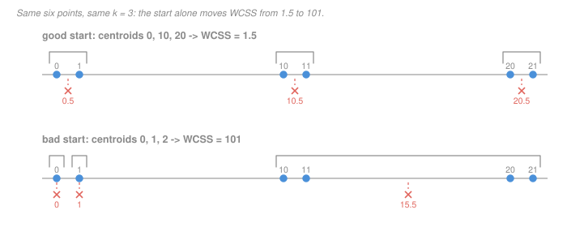

# Machine Learning · Lesson 3.3: k-means clustering

> ⏱ ~15 min · Module 3: Probabilistic and unsupervised learning · Builds on: [3.2 (PCA)](03-02-principal-component-analysis.md) · Unlocks: 3.4 (hierarchical clustering), 3.5 (mixtures), 3.6 (EM)

## Why this matters

k-means is the first thing anyone reaches for when the labels are gone. It is three lines of pseudocode, it runs on a million rows, and it always returns something.

That last part is why it is worth a careful lesson. k-means is the cleanest example in this course of an algorithm that has a **proof of termination and no proof of correctness**. It always stops; what it stops *at* can be arbitrarily bad. Most write-ups blur those two facts under the single word "converges," and the blur is expensive, because the failure is silent — no error, no warning, just a partition that looks like an answer.

So this lesson gives you two things: the invariant that makes the algorithm terminate, and a six-point instance on a line where the same algorithm, on the same data, with the same $k$, returns an objective **67 times worse** purely because of where it started.

## The idea

Fix the number of groups $k$ up front. Score a partition by how tight its groups are: take each cluster's mean, and add up the squared distances from its members to that mean. Sum over clusters. That total is the **within-cluster sum of squares**, or WCSS, and now clustering is an optimisation problem — find the partition minimising it.

Two facts make it tractable, and each is trivial *given the other half of the answer*:

- If you knew the centres, assignment is easy: send each point to the nearest centre.
- If you knew the assignment, the centres are easy: take each cluster's mean.

You know neither, so you **alternate**. Guess centres, assign, recompute centres from the assignment, reassign, and keep going until nothing moves. That is [Lloyd's algorithm](../reference.md#lloyds-algorithm), and it is what everyone means by "k-means."

The frame worth carrying: this is **coordinate descent** on WCSS over two blocks of variables. The assignment step minimises the objective exactly over assignments with the centroids frozen; the update step minimises it exactly over centroids with the assignment frozen. Each step is a *global* minimisation of its own block — which is precisely why the objective can only fall, and precisely why falling is all you get.

## The formal version

Data $x_1,\dots,x_n \in \mathbb{R}^p$. A clustering is a partition into $C_1,\dots,C_k$ together with centroids $\mu_1,\dots,\mu_k \in \mathbb{R}^p$ (the index $j$ runs over clusters). The objective is the [within-cluster sum of squares](../reference.md#within-cluster-sum-of-squares)

$$W(C,\mu) \;=\; \sum_{j=1}^{k}\ \sum_{i \in C_j} \big\lVert x_i - \mu_j \big\rVert^2 .$$

*In words:* add up the squared distance from every point to the centre of its own cluster.

**Lloyd's algorithm.**

```
LLOYD(x_1..x_n, k, initial centroids mu_1..mu_k):
    repeat
        ASSIGN:  C_j <- { i : j = argmin_m ||x_i - mu_m||^2 }   -- ties broken by index
        UPDATE:  mu_j <- (1/|C_j|) * sum of x_i over i in C_j
    until no assignment changes
    return C, mu
```

**Lemma 1 (the assignment step cannot increase $W$).** With $\mu$ fixed, $W$ splits into one independent term per point: point $i$ contributes $\lVert x_i - \mu_{a(i)}\rVert^2$ and nothing else, where $a(i)$ is its cluster. Minimising a sum of independent terms means minimising each one, and the minimiser of the $i$-th term is $a(i) = \arg\min_j \lVert x_i - \mu_j\rVert^2$ — the nearest centroid. So the assign step returns the exact minimiser over all $k^n$ assignments.

**Lemma 2 (the update step cannot increase $W$).** With $C$ fixed, the clusters decouple, so consider one. For $g(\mu) = \sum_{i \in C_j}\lVert x_i - \mu\rVert^2$,

$$\nabla g(\mu) \;=\; -2\sum_{i \in C_j}(x_i - \mu) \;=\; 0 \quad\Longrightarrow\quad \mu \;=\; \frac{1}{|C_j|}\sum_{i \in C_j} x_i .$$

$g$ is a positive-definite quadratic, so this stationary point is the unique global minimiser: **the mean is the point minimising total squared distance.** (That is [1.1's](01-01-the-learning-problem.md) squared-loss fact — the risk minimiser under squared loss is the conditional mean — in its finite-sample form.)

**Theorem (termination).** Lloyd's algorithm halts after finitely many iterations.

*Proof.* By the two lemmas, $W$ never increases. After an update step, the centroids are determined by the assignment (they are its cluster means), so the value of $W$ at the end of a round is a function of the assignment alone. There are at most $k^n$ assignments, so some assignment must recur if the algorithm ran forever. But $W$ is non-increasing, so between two occurrences of the same assignment $W$ is constant; then the assignment produced by the following ASSIGN step is the same one again, and the stopping test fires. $\blacksquare$

**What the theorem does not say.** It says nothing about the *quality* of the fixed point. Minimising $W$ exactly is NP-hard, so nobody expects a polynomial algorithm to nail it (see [algorithms 4.3](../../algorithms/lessons/04-03-approximation-algorithms.md) for what one does with such problems). Lloyd's gives you a local minimum in a specific and weak sense — one that no single reassignment and no centroid move can improve — and the next section shows how far from optimal that can be.

**Cost.** Each iteration is $O(nkp)$: every one of the $n$ points is compared to every one of the $k$ centroids in $p$ dimensions. The update pass is $O(np)$. Memory is $O(np + kp)$ — you never build an $n \times n$ anything, which is exactly the property [3.4](03-04-hierarchical-clustering.md) gives up.

## Picture



Six points on a line: $0, 1, 10, 11, 20, 21$, three obvious pairs, $k = 3$. Both panels show a **converged** run of the identical algorithm; blue dots are data, red crosses are final centroids, grey brackets are the clusters.

The top panel starts at $0, 10, 20$ and finds the pairs. The bottom starts at $0, 1, 2$ — all three centroids crammed into the leftmost pair — and burns two of its three centroids on singletons, leaving one centroid to cover four points spanning a gap of ten. Nothing in the algorithm notices. Both runs satisfy the stopping test; both are local minima.

## Worked examples

Throughout, WCSS is reported **after** the update step, i.e. against the new centroids.

### Example 1 — the good start

Points $0, 1, 10, 11, 20, 21$; $k=3$; start at $\mu = (0, 10, 20)$.

| iter | assignment | new centroids | WCSS |
|---|---|---|---|
| start | — | $0,\ 10,\ 20$ | $3$ |
| 1 | $\{0,1\}\ \{10,11\}\ \{20,21\}$ | $\tfrac12,\ \tfrac{21}{2},\ \tfrac{41}{2}$ | $3/2$ |
| 2 | unchanged | unchanged | $3/2$ |

Iteration 1 in full: $0$ and $1$ are nearer $0$ than $10$; $10$ and $11$ are nearer $10$; $20$ and $21$ are nearer $20$. Means are $1/2$, $21/2$, $41/2$. Each pair contributes $(\tfrac12)^2 + (\tfrac12)^2 = \tfrac12$, so $W = 3 \times \tfrac12 = \tfrac32$. Iteration 2 changes no assignment, so the algorithm stops.

An exhaustive search over all partitions of these six points into three groups confirms $W^* = 3/2$: this is the global optimum.

### Example 2 — the bad start, same data

Same points, same $k$, start at $\mu = (0, 1, 2)$.

| iter | assignment | new centroids | WCSS |
|---|---|---|---|
| start | — | $0,\ 1,\ 2$ | $830$ |
| 1 | $\{0\}\ \{1\}\ \{10,11,20,21\}$ | $0,\ 1,\ \tfrac{31}{2}$ | $101$ |
| 2 | unchanged | unchanged | $101$ |

Iteration 1 in full: $0$ goes to the centroid at $0$; $1$ goes to the centroid at $1$; every one of $10, 11, 20, 21$ is nearest the centroid at $2$. The two singleton clusters have their means already ($0$ and $1$), and the big cluster's mean is $\frac{10+11+20+21}{4} = \frac{62}{4} = \frac{31}{2}$. Its contribution is

$$(-\tfrac{11}{2})^2 + (-\tfrac92)^2 + (\tfrac92)^2 + (\tfrac{11}{2})^2 \;=\; \tfrac{121+81+81+121}{4} \;=\; \tfrac{404}{4} \;=\; 101 .$$

Iteration 2 confirms: $10$ is at distance $10$ from centroid $0$, $9$ from centroid $1$, and $5.5$ from $31/2$ — still nearest the big centroid. Nothing moves. Converged.

**Same algorithm, same data, same $k$: $101$ against $3/2$, a factor of $202/3 \approx 67$.** And the gap is not capped by the instance — tighten the three pairs from a spacing of $1$ to a spacing of $0.1$ and the optimum falls to $3/200$ while the bad fixed point stays near $100$, a ratio over $6{,}600$.

Two standard responses, one sentence each. **Restarts:** run Lloyd's from many random starts and keep the lowest WCSS — legitimate because WCSS is computable without any labels, so you can actually rank the runs. **k-means++:** seed the centroids by choosing them far apart with probability proportional to squared distance from the nearest chosen centre, which makes an all-three-in-one-corner start like $(0,1,2)$ very unlikely. (3.6 explains the deeper repair: k-means is the hard-assignment limit of [EM](03-06-the-em-algorithm.md), and the soft version is less brittle.)

## Watch out

- **You might think you can choose $k$ by minimising WCSS — but the best achievable WCSS is non-increasing in $k$ and hits exactly $0$ at $k = n$**, where every point is its own centroid. So "minimise the objective" always answers $n$. The elbow heuristic (plot WCSS against $k$, look for the bend) is a reading of a curve, not an optimisation, and real data often has no bend. Note the contrast with [4.1](04-01-model-selection-and-cross-validation.md): validation error turns back up as complexity grows, which is what makes supervised model selection decisive. Nothing here turns back up.
- **You might think the clusters are whatever shape the data has — but at any fixed point the clusters are a [Voronoi partition](../reference.md#voronoi-partition)**, since every point sits with its nearest centroid. Each cluster is therefore an intersection of half-spaces cut with the data: **convex**, and pushed toward equal sizes by the squared-distance penalty. Two concentric rings cannot come out as two clusters, no matter the initialization — that is a statement about the objective, not about the search.
- **You might think k-means is unit-agnostic — but it minimises Euclidean distance, so rescaling one feature reweights it.** This is exactly [3.2's](03-02-principal-component-analysis.md) warning about PCA, and for the same reason: measure a length in millimetres instead of metres and it will dominate every distance in the dataset, so it alone will decide the clusters.

## One-liner

> k-means always converges and never promises anything: the objective falls at every step, and where it stops is decided by where it started.

## Problems

**P1 (🟢)** Points $0, 2, 3, 12, 14, 16$ on a line, $k = 2$, starting centroids $\mu_1 = 0$ and $\mu_2 = 2$. Run **two** full Lloyd iterations (assign, then update). Give the assignment, the centroids, and the WCSS after each. Does a third iteration change anything?

**P2 (🟡)** Two hundred points lie on a circle of radius $1$ about the origin and two hundred on a circle of radius $5$ about the origin. You run k-means with $k = 2$. (a) Prove that it cannot return the two rings as its two clusters, *whatever* the initialization. (b) Sketch what it does return. (c) Name one lesson in this module and one in Module 2 that each offer a fix, and say in one line what each fix changes.

**P3 (🔴)** (a) Prove that $W$ is non-increasing across both the assignment step and the update step. (b) Explain precisely why that does **not** imply convergence to the global optimum — name the property the proof would need and does not have. (c) Suppose on the six-point instance above you restart by seeding with three of the six data points, chosen uniformly at random. Given that $16$ of the $20$ possible seeds reach the optimum, what is the chance that $5$ independent restarts all miss it, and what general principle about restart strategies does the counterexample illustrate?

<details>
<summary>Solutions</summary>

**P1** Distances first; the convention is that WCSS is measured against the updated centroids.

*Iteration 1.* With $\mu = (0,2)$: point $0$ is at distance $0$ and $2$, so it joins cluster 1. Every other point ($2, 3, 12, 14, 16$) is nearer $2$ than $0$. Assignment $\{0\} \mid \{2,3,12,14,16\}$. Update: $\mu_1 = 0$ and

$$\mu_2 = \tfrac{2+3+12+14+16}{5} = \tfrac{47}{5} = 9.4 .$$

The WCSS is then

$$0 + \big(7.4^2 + 6.4^2 + 2.6^2 + 4.6^2 + 6.6^2\big) = 54.76+40.96+6.76+21.16+43.56 = 167.2 = \tfrac{836}{5}.$$

*Iteration 2.* With $\mu = (0, 9.4)$: $0 \to \mu_1$ ($0$ vs $9.4$); $2 \to \mu_1$ ($2$ vs $7.4$); $3 \to \mu_1$ ($3$ vs $6.4$); $12, 14, 16 \to \mu_2$. Assignment $\{0,2,3\} \mid \{12,14,16\}$. Update: $\mu_1 = 5/3$, $\mu_2 = 14$. WCSS:

$$\Big[(\tfrac53)^2 + (\tfrac13)^2 + (\tfrac43)^2\Big] + \big[4 + 0 + 4\big] \;=\; \tfrac{42}{9} + 8 \;=\; \tfrac{14}{3} + 8 \;=\; \tfrac{38}{3} \approx 12.67 .$$

*Third iteration:* nothing changes — $0, 2, 3$ are all nearer $5/3$ than $14$, and $12, 14, 16$ are all nearer $14$ than $5/3$ (for $12$: $10.33$ versus $2$). Converged, and note the objective fell $441 \to 167.2 \to 12.67$, monotonically, as Lemmas 1 and 2 require.

**P2** (a) At any fixed point of Lloyd's, each point sits with its nearest centroid, so with $k = 2$ the two clusters are separated by the perpendicular bisector of the segment $\mu_1\mu_2$ — a single line, with one cluster strictly on each side. Suppose the clusters were the inner ring $I$ and the outer ring $O$. A line strictly separating two sets also strictly separates their convex hulls. But $\operatorname{conv}(I)$ is the closed disc of radius $1$ and $\operatorname{conv}(O)$ is the closed disc of radius $5$, and the first is *contained in* the second — they are very far from disjoint. Contradiction. No initialization can help, because the argument never mentions the initialization: **no fixed point of the algorithm has that shape.** The objective, not the search, is what rules it out.

(b) It returns two half-plane wedges: a line through roughly the origin slicing both rings, so each cluster is half of the inner ring plus half of the outer ring. (By symmetry the centroids land symmetrically about the origin, and the bisector passes near it.)

(c) [3.4 hierarchical clustering](03-04-hierarchical-clustering.md) with **single linkage**: it merges on the shortest hop between groups, so it chains around each ring and never jumps the gap — it changes the *objective* from "tight around a centre" to "connected." [2.4 the kernel trick](02-04-the-kernel-trick.md): map $x \mapsto \lVert x\rVert^2$ (or use an RBF kernel) and the rings become two well-separated values on a line, trivially $k$-means-able — it changes the *geometry* the same objective is applied to.

**P3** (a) Both are Lemmas 1 and 2 above. Assignment: with $\mu$ fixed, $W = \sum_i \lVert x_i - \mu_{a(i)}\rVert^2$ is a sum of terms depending on one point's label each, so choosing each label to minimise its own term minimises the sum — and nearest-centroid is exactly that. Update: with $C$ fixed the clusters decouple; $g(\mu) = \sum_{i\in C_j}\lVert x_i-\mu\rVert^2$ has gradient $-2\sum_{i\in C_j}(x_i-\mu)$, vanishing only at the cluster mean, and $g$ is a strictly convex quadratic so that stationary point is the global minimiser. Neither step can raise $W$; either may lower it.

(b) Monotone descent gives you a **local** guarantee only: the fixed point is a configuration that no single reassignment (with centroids held) and no centroid move (with the assignment held) can improve. To conclude global optimality you would need the objective to have no non-global local minima along the coordinate blocks — i.e. joint convexity in $(C, \mu)$, or at least the absence of spurious block-wise stationary points. $W$ has neither: it is not even a continuous function of a discrete assignment, and Example 2 exhibits a spurious fixed point directly. Monotone is compatible with terrible: $101$ is a perfectly monotone landing place.

(c) Each restart misses with probability $4/20 = 1/5$, so five independent restarts all miss with probability $(1/5)^5 = 1/3125 \approx 0.032\%$. The principle: **restarts are worth it here precisely because you can score them.** WCSS is computable from the data alone — no labels, no held-out set — so you can run $r$ starts, compare their objectives honestly, and keep the best. That is not true of most learning problems, where "which run is better" is itself a statistical question ([4.1](04-01-model-selection-and-cross-validation.md)). The counterexample also says what the restarts must be defending against: the bad fixed point spends two of three centroids inside one tight pair, so a seeding rule that spreads the initial centroids out — k-means++ — attacks the failure mode directly rather than just sampling more.

*(The $16/20$ figure is an exhaustive enumeration of the $\binom{6}{3}$ seeds; the four bad ones are the two-in-the-left-pair and two-in-the-right-pair seeds, which converge to the mirror-image fixed points with $W = 101$ each.)*

</details>

## Flashback

**From Lesson 3.2 (Principal component analysis):** A centred two-feature dataset has sample covariance

$$S = \begin{pmatrix} 3 & 2 \\ 2 & 6 \end{pmatrix}.$$

(a) Give both eigenvalues by the trace-and-determinant route, the unit PC1, and the fraction of variance PC1 explains. (b) You are about to cluster this data with k-means. Would rotating the data into the PC basis first change the clustering? Would projecting onto PC1 alone change it? When does that matter?

<details>
<summary>Solution</summary>

(a) $\operatorname{tr} S = 9$ and $\det S = 3\cdot 6 - 2^2 = 14$, so the eigenvalues solve $\lambda^2 - 9\lambda + 14 = 0$, giving $\lambda_1 = 7$ and $\lambda_2 = 2$ (check: $7 + 2 = 9$, $7 \times 2 = 14$). For $\lambda_1 = 7$, the first row of $(S - 7I)v = 0$ reads $-4v_1 + 2v_2 = 0$, so $v \propto (1,2)$ and the unit PC1 is $(1,2)/\sqrt5$. Verify directly:

$$S\begin{pmatrix}1\\2\end{pmatrix} = \begin{pmatrix}3+4\\2+12\end{pmatrix} = \begin{pmatrix}7\\14\end{pmatrix} = 7\begin{pmatrix}1\\2\end{pmatrix}. \quad\checkmark$$

PC1 explains $7/9 \approx 77.8\%$ of the total variance.

(b) **Rotating changes nothing.** The PC basis change is multiplication by an orthogonal matrix, which preserves every Euclidean distance ([linalg-refresher 4.1](../../linalg-refresher/lessons/04-01-inner-products-orthogonality.md)). k-means minimises a sum of squared Euclidean distances, so every assignment, every centroid and the WCSS itself are carried over unchanged: the clustering is the same, just written in new coordinates.

**Projecting can change everything**, because it is not a rotation — it throws away the PC2 coordinate, so distances shrink by exactly the discarded component. It matters when the cluster separation lives in a low-variance direction. Here PC2 carries $2/9$ of the variance; if the two groups are offset along $(2,-1)/\sqrt5$ and overlap along $(1,2)/\sqrt5$, projecting onto PC1 deletes the only signal there is. That is 3.2's P3 warning in clustering clothes: **PCA finds variance, not separation.** (What projection *does* buy you is cost — $O(nkp)$ per iteration with a smaller $p$ — which is the honest reason people do it on high-dimensional data.)

</details>

## Connections

- **Backward:** the update step is [1.1's](01-01-the-learning-problem.md) squared-loss minimiser — the mean — applied per cluster; the alternating structure is block coordinate descent, a cousin of the first-order methods in [1.6](01-06-gradient-descent-for-learning.md), and the scale sensitivity is exactly the one [3.2](03-02-principal-component-analysis.md) raised for PCA, since both are built on Euclidean geometry.
- **Forward:** [3.4](03-04-hierarchical-clustering.md) drops the need to fix $k$ and the need to initialize, and pays $O(n^2)$ memory for it; [3.5](03-05-gaussian-mixture-models.md) replaces the hard assignment with a responsibility; [3.6](03-06-the-em-algorithm.md) proves that k-means *is* EM in the zero-variance limit, which is where the two threads of this module join.
- **Sideways:** Lloyd's is a greedy rule in the sense of [algorithms 2.1](../../algorithms/lessons/02-01-the-greedy-method-and-interval-scheduling.md) — locally best at every step, plausible, and not optimal — and Example 2 is a counterexample built the way that lesson builds them: not by sampling random instances (four in five random seeds here find the optimum) but by constructing the one configuration that traps the rule. The termination argument is the other standard move, a monotone potential over a finite state space, and it bounds the *runtime* while saying nothing about the *quality*. Vector quantisation in signal compression is k-means under another name, with the centroids as the codebook.
