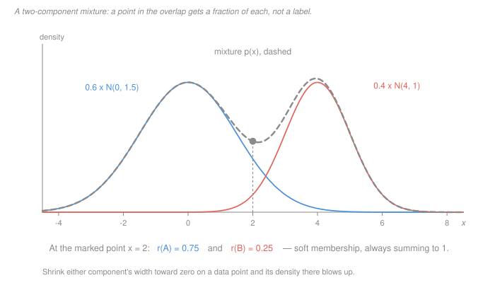

# Machine Learning · Lesson 3.5: Gaussian mixture models

> ⏱ ~15 min · Module 3: Probabilistic and unsupervised learning · Builds on: [3.3 (k-means)](03-03-k-means-clustering.md), [3.4 (hierarchical clustering)](03-04-hierarchical-clustering.md) · Unlocks: 3.6 (the EM algorithm)

## Why this matters

[k-means](03-03-k-means-clustering.md) hands back a label and nothing else. It cannot tell you a point is a 51/49 call, it cannot score a point it has never seen, and it has no way to say that one cluster is wide and another is tight — because it has no notion of *width* at all. A Gaussian mixture fixes all three by modelling the data as an actual probability density, which buys you soft memberships, a likelihood for new points, and per-cluster shape.

It also buys you a genuine mathematical problem, and this is the lesson's real payload: **the obvious thing to optimize — the likelihood — has no maximum.** Not "a hard optimum", not "many local optima". The supremum is $+\infty$ and it is not attained. Every fitter you will ever use quietly patches around this, and if you do not know it is there you will one day read a spectacular likelihood off a model that has learned nothing.

## The idea

A mixture is a **generative story** you can act out:

1. Roll a $K$-sided die whose face $k$ comes up with probability $\pi_k$.
2. Draw a point from that face's Gaussian.
3. Write down the point. **Throw away the die roll.**

Everything hard about mixtures is step 3. If you kept the die rolls, fitting would be trivial — split the data by roll, and fit each Gaussian separately with the usual sample mean and sample covariance. You do not keep them, so instead of a label per point you get a *belief* about the label: given that this point landed at $x$, how likely is it that the die said $k$?

That belief is called the **responsibility** of component $k$ for point $i$, and it is the whole vocabulary of this lesson. Component $k$ is "responsible" for a point in proportion to how well it explains it, discounted by how often that component fires at all.

Compare the three clusterings you now know:

| | what it returns | needs $K$ up front? | scores a new point? |
|---|---|---|---|
| [k-means](03-03-k-means-clustering.md) | one label per point | yes | nearest centroid, no probability |
| [hierarchical](03-04-hierarchical-clustering.md) | a nested family of labellings | no | not at all — no rule outside the data |
| **GMM** | a **fraction** of every label per point | yes | yes — a density, hence a likelihood |

## The formal version

A **[Gaussian mixture model](../reference.md#gaussian-mixture-model)** with $K$ components puts the density

$$p(x) \;=\; \sum_{k=1}^{K} \pi_k\, \mathcal N(x \mid \mu_k, \Sigma_k), \qquad \pi_k \ge 0, \quad \sum_{k=1}^{K}\pi_k = 1$$

on $x \in \mathbb R^p$, where $\mathcal N(\cdot \mid \mu, \Sigma)$ is the [Gaussian density](../../prob-stat-refresher/lessons/02-03-continuous-distributions.md) with mean $\mu$ and covariance $\Sigma$, and $\pi_k$ is the **mixing weight**.

*In words:* the population is a blend of $K$ Gaussian sub-populations, and $\pi_k$ is the share of the blend that comes from the $k$-th.

Introduce the **latent** (unobserved) component indicator $z_i \in \{1,\dots,K\}$, drawn from the die:

$$\Pr(z_i = k) = \pi_k, \qquad x_i \mid \{z_i = k\} \;\sim\; \mathcal N(\mu_k, \Sigma_k).$$

Then [Bayes' rule](../../prob-stat-refresher/lessons/01-02-conditional-probability-bayes.md) gives the **[responsibility](../reference.md#responsibility)**

$$r_{ik} \;=\; \Pr(z_i = k \mid x_i) \;=\; \frac{\pi_k\, \mathcal N(x_i \mid \mu_k, \Sigma_k)}{\sum_{j=1}^{K} \pi_j\, \mathcal N(x_i \mid \mu_j, \Sigma_j)}.$$

*In words:* prior share times fit, normalised across components. The denominator is exactly $p(x_i)$, so $\sum_k r_{ik} = 1$ automatically — **a row of responsibilities always sums to 1**, and checking that is your cheapest arithmetic guard.

The log-likelihood of $\theta = \{\pi_k,\mu_k,\Sigma_k\}$ on data $x_1,\dots,x_n$ is

$$\ell(\theta) \;=\; \sum_{i=1}^{n} \log\!\left(\sum_{k=1}^{K} \pi_k\, \mathcal N(x_i \mid \mu_k, \Sigma_k)\right).$$

The log sits *outside* a sum, so it does not split into $K$ independent Gaussian fits and there is no closed form. That single structural fact is the reason [Lesson 3.6](03-06-the-em-algorithm.md) exists.

**How many parameters is that?** This decides what you can afford, so count it. Each component needs $p$ numbers for $\mu_k$, plus the covariance, plus $K-1$ free mixing weights (the last is forced by the sum-to-one constraint):

| covariance structure | numbers per $\Sigma_k$ | total parameters | at $K=3$, $p=10$ |
|---|---|---|---|
| full | $p(p+1)/2$ | $K\big(p + p(p+1)/2\big) + K - 1$ | **197** |
| diagonal | $p$ | $K(2p) + K - 1$ | **62** |
| spherical ($\sigma_k^2 I$) | $1$ | $K(p+1) + K - 1$ | **35** |

At $n = 500$ the full model asks you to estimate 197 numbers from 500 points — about 2.5 observations per parameter, which is not a fit, it is a memory. Diagonal is the honest default in double figures of dimension and above.

It is also a cost table. One full-covariance density evaluation costs $O(p^2)$ given a Cholesky factor of $\Sigma_k$ (itself $O(p^3)$ per component per refresh), so a full sweep of responsibilities is $O(nKp^2 + Kp^3)$; diagonal covariances drop it to $O(nKp)$. At $n = 10^5$, $K = 10$, $p = 100$: $10^{10}$ multiply-adds per sweep against $10^8$, every iteration, for a modelling assumption you may not need.

## Picture

Three things to read off it.

- **The mixture is not either bump.** The dashed grey curve hugs each component where that component dominates and rises above both in the overlap, where the two densities add. Its local minimum here is at $x \approx 2.16$.
- **Responsibility is a ratio of vertical distances**, not of distances to the means. At $x = 2$ the blue curve is about three times as high as the coral one, so $r_A = 0.75$. The point is *closer* to $\mu_A = 0$ than to $\mu_B = 4$ by two units, but that is not what decided it — the widths and the weights did. The two curves actually cross just past $x = 2.4$, and that, not the midpoint $x = 2$, is where responsibility is 50/50.
- **Nothing stops a bump from getting thin.** Slide the blue curve's centre onto a data point and shrink its width: the curve at that point grows without bound, and so does the likelihood. That is the next section.

## Worked examples

Throughout: $\pi_A = 0.6$ with $\mathcal N(0, 1.5^2)$, and $\pi_B = 0.4$ with $\mathcal N(4, 1^2)$ — the mixture in the figure.

**Example 1 (mechanical): responsibilities at two points.**

At $x = 2$. The exponents first, then the normalising constants:

$$\frac{(2-0)^2}{2(1.5)^2} = \frac{4}{4.5} = \frac{8}{9}, \qquad \frac{(2-4)^2}{2(1)^2} = 2.$$

$$\mathcal N_A(2) = \frac{e^{-8/9}}{1.5\sqrt{2\pi}} = 0.265962 \times 0.411112 = 0.109340,$$

$$\mathcal N_B(2) = \frac{e^{-2}}{\sqrt{2\pi}} = 0.398942 \times 0.135335 = 0.053991.$$

Weight them and normalise:

| | $\pi_k \mathcal N_k(2)$ | $r_k$ |
|---|---|---|
| $A$ | $0.6 \times 0.109340 = 0.065604$ | $0.7523$ |
| $B$ | $0.4 \times 0.053991 = 0.021596$ | $0.2477$ |
| sum | $p(2) = 0.087200$ | $1.0000$ |

At $x = 5$, the same three steps give $\mathcal N_A(5) = 0.001028$ and $\mathcal N_B(5) = 0.241971$, hence weighted values $0.000617$ and $0.096788$, so $p(5) = 0.097405$ and

$$r_A(5) = 0.0063, \qquad r_B(5) = 0.9937.$$

Both rows sum to 1. Notice what the two points illustrate: $x = 5$ is a near-certain $B$ even though it is *outside* $B$'s mean, while $x = 2$ sits between the means and is genuinely split. k-means would have flattened both to a single bit.

**Example 2 (why you'd care): the likelihood has no maximum.**

Take four points $\{0, 1, 3, 4\}$, two components with $\pi_A = \pi_B = 1/2$. Pin component $B$ at $\mu_B = 2$, $\sigma_B = 1.5$ and pin $\mu_A = 0$ — *exactly on the first data point* — then shrink $\sigma_A$:

| $\sigma_A$ | $1$ | $0.5$ | $0.1$ | $0.01$ | $0.001$ | $10^{-5}$ |
|---|---|---|---|---|---|---|
| $\ell(\theta)$ | $-7.98$ | $-7.77$ | $-6.67$ | $-4.39$ | $-2.09$ | $\mathbf{+2.51}$ |

It climbs, it crosses zero, and it does not stop. Here is why, in two lines. Drop every term you do not need: for the anchored point $x_1 = 0$,

$$\log p(x_1) \;\ge\; \log\!\Big(\tfrac12\,\mathcal N(0 \mid 0, \sigma_A^2)\Big) \;=\; \log\frac{1}{2\sigma_A\sqrt{2\pi}} \;\xrightarrow[\sigma_A \to 0]{}\; +\infty,$$

while each of the other three points obeys

$$\log p(x_i) \;\ge\; \log\!\Big(\tfrac12\, \mathcal N(x_i \mid 2,\, 1.5^2)\Big),$$

a **constant that does not involve $\sigma_A$ at all** — here the three of them total $-7.386$. So $\ell \ge 2.9931 - 7.386 = -4.393$ at $\sigma_A = 0.01$ (the table says $-4.390$, so the bound is nearly tight), and the first term alone drives the sum to infinity.

The fitted model is worthless — one component is a zero-width spike on a single point and the other does all the work — but this is the *global* behaviour of the objective, not a local trap. **"Maximise the likelihood" is not a well-posed instruction for a mixture**, which is why every real implementation imposes a variance floor, a minimum-count rule, or a prior on $\Sigma_k$. That last one is the MAP-instead-of-MLE move you already saw in [ridge](01-04-regularization-ridge-and-lasso.md), and it rests on a general principle owned by [`statistical-learning`](../../statistical-learning/syllabus.md) (not yet built; stated here where it is used): **adding a proper prior to a likelihood whose supremum is unattained can restore a maximum, by penalising exactly the parameter that runs away.**

In $p$ dimensions the failure wears a different costume: a component that captures $p$ points or fewer has a **singular** sample covariance, $\det\Sigma_k \to 0$, and its density diverges the same way — a second reason to prefer diagonal covariances when $n$ is small.

## Watch out

- **You might think** a responsibility of $0.75$ means "75 percent chance this point really came from cluster A" — **but actually** it is $\Pr(z = k \mid x)$ *under the model you fitted*, priors and all. Fit the same data with three components and the number changes; fit it with a variance floor and it changes again. It is a statement about your model's bookkeeping, not about the world.
- **You might think** the fit with the highest likelihood is the best model, so you can pick $K$ by maximising it — **but actually** you cannot: extra components can only raise the likelihood (set a new $\pi_k$ to zero and recover the old fit exactly), so $\ell$ is non-decreasing in $K$, and by the degeneracy above it is unbounded for any $K \ge 2$. This is the exact shape of two traps you have already met: WCSS falling monotonically in $k$ in [3.3](03-03-k-means-clustering.md), and $R^2$ never decreasing when you add a column in [1.3](01-03-linear-regression-and-least-squares.md). Choosing $K$ needs held-out likelihood or a complexity penalty — [4.1](04-01-model-selection-and-cross-validation.md)'s business, and the parameter counts above are what such a penalty charges you.
- **You might think** a converged fit with a tiny $\sigma_k$ has found something sharp and real in the data — **but actually** it has usually found the degeneracy. A component whose responsibilities are $\approx 1$ on one or two points and $\approx 0$ everywhere else is the failure mode, not a discovery. Check component counts $n_k = \sum_i r_{ik}$ before you believe any mixture fit.

## One-liner

> A Gaussian mixture replaces k-means' single bit per point with a row of responsibilities that sums to one — buying you a density, per-cluster shape, and a score for new points, at the price of an objective whose supremum is infinite and never attained.

## Problems

**P1 (🟢)** A two-component 1-D mixture: $\pi_A = 0.4$ with $\mathcal N(1, 2^2)$, and $\pi_B = 0.6$ with $\mathcal N(7, 2^2)$. Compute $r_A$ and $r_B$ for $x = 3$ and for $x = 6$, and verify each row sums to 1. (The two components share $\sigma = 2$, so the $1/(\sigma\sqrt{2\pi})$ factor cancels — you only need the exponentials.) Then say in one sentence which of the two points a k-means run with these two centres would have assigned *differently* in spirit, and what is lost.

**P2 (🟡)** You have $n = 200$ points in $p = 8$ dimensions and want $K = 4$ components. (a) Count the free parameters under full, diagonal, and spherical covariances. (b) Say which you would fit and why, in terms of observations per parameter. (c) Under the full model, what is the largest number of points a component can be responsible for and still hand you a singular covariance estimate?

**P3 (🔴)** Let $x_1,\dots,x_n$ be distinct real numbers and fit a two-component 1-D mixture with $\pi_A = \pi_B = 1/2$. Fix $\mu_B$ and $\sigma_B > 0$ at any values you like. (a) Show that with $\mu_A = x_1$, the log-likelihood $\ell \to +\infty$ as $\sigma_A \to 0^+$, by bounding the $n$ terms below separately. (b) Conclude that the maximum-likelihood estimator does not exist, and name one constraint that restores a well-posed problem. (c) A colleague says "this is just a local-optimum problem, so more restarts will fix it." Say precisely why that is wrong. (d) Explain in one sentence why the analogous failure cannot happen to k-means, and why that is not evidence that k-means is the better method.

Solutions

**P1** With a shared $\sigma = 2$, write $E_A = e^{-(x-1)^2/8}$ and $E_B = e^{-(x-7)^2/8}$; the constants cancel top and bottom, so $r_A = 0.4 E_A / (0.4 E_A + 0.6 E_B)$.

At $x = 3$: exponents $-4/8 = -0.5$ and $-16/8 = -2$, so $E_A = 0.606531$, $E_B = 0.135335$.

| | weighted | $r$ |
|---|---|---|
| $A$ | $0.4 \times 0.606531 = 0.242612$ | $0.7492$ |
| $B$ | $0.6 \times 0.135335 = 0.081201$ | $0.2508$ |
| sum | $0.323813$ | $1.0000$ |

At $x = 6$: exponents $-25/8 = -3.125$ and $-1/8 = -0.125$, so $E_A = 0.043937$, $E_B = 0.882497$; weighted $0.017575$ and $0.529498$, summing to $0.547073$, giving

$$r_A(6) = 0.0321, \qquad r_B(6) = 0.9679.$$

Both rows sum to 1. (Check worth noticing: $x = 3$ is 2 units from $\mu_A$ and 4 from $\mu_B$, yet $r_A$ is only $0.75$, not the $\approx 1$ that a distance rule would suggest — the prior $0.6$ on $B$ is pulling against the distance.)

**The k-means contrast.** With centres at 1 and 7, k-means assigns by the midpoint $x = 4$: $x = 3 \to A$, $x = 6 \to B$. The *assignments* agree with the argmax of the responsibilities, so nothing changes at the label level. What is lost is that k-means reports $x = 3$ and $x = 6$ with identical confidence, when the mixture says one is a 75/25 call and the other is 97/3. Any downstream decision with an asymmetric cost needs that difference.

**P2** (a) With $K = 4$, $p = 8$: means cost $Kp = 32$, mixing weights cost $K - 1 = 3$.

| structure | per $\Sigma_k$ | covariance total | **grand total** |
|---|---|---|---|
| full | $8 \cdot 9/2 = 36$ | $144$ | $32 + 144 + 3 = \mathbf{179}$ |
| diagonal | $8$ | $32$ | $32 + 32 + 3 = \mathbf{67}$ |
| spherical | $1$ | $4$ | $32 + 4 + 3 = \mathbf{39}$ |

(b) Observations per parameter: $200/179 = 1.1$ (full), $200/67 = 3.0$ (diagonal), $200/39 = 5.1$ (spherical). None is comfortable, but the full model is absurd — roughly one data point per free number, so the covariances are essentially interpolating noise. Fit **diagonal**, and be ready to fall back to spherical; if the features are known to be correlated within a cluster, the right response is to reduce $p$ first (with [PCA](03-02-principal-component-analysis.md)) rather than to buy 144 covariance parameters.

(c) A $p \times p$ sample covariance built from $m$ points has rank at most $m - 1$ (one degree of freedom is spent on the mean), so it is singular whenever $m - 1 < p$, i.e. $m \le p = \mathbf{8}$. With soft responsibilities the effective count $n_k = \sum_i r_{ik}$ plays the role of $m$, so a component whose responsibilities concentrate on eight or fewer points is already in the singular regime — with $n = 200$ and $K = 4$ that is far from hypothetical.

**P3** (a) Write $\ell(\theta) = \sum_{i=1}^n \log p(x_i)$, where

$$p(x) \;=\; \tfrac12\, \mathcal N(x \mid x_1, \sigma_A^2) \;+\; \tfrac12\, \mathcal N(x \mid \mu_B, \sigma_B^2).$$

Every term of a mixture density is non-negative, so dropping one only decreases the value, and $\log$ is increasing. Bound the terms in two groups.

*The anchored point.* Drop the $B$ term:

$$\log p(x_1) \;\ge\; \log\!\Big(\tfrac12\,\mathcal N(x_1 \mid x_1, \sigma_A^2)\Big) \;=\; \log \frac{1}{2\sigma_A\sqrt{2\pi}} \;=\; -\log \sigma_A - \log\big(2\sqrt{2\pi}\big),$$

where the density at its own mean is $1/(\sigma_A\sqrt{2\pi})$ because the exponent is exactly zero. As $\sigma_A \to 0^+$, $-\log\sigma_A \to +\infty$.

*Every other point.* Drop the $A$ term:

$$\log p(x_i) \;\ge\; \log\!\Big(\tfrac12\,\mathcal N(x_i \mid \mu_B, \sigma_B^2)\Big) \;=\; c_i,$$

and $c_i$ is a finite constant — $\mu_B$ and $\sigma_B$ are fixed, so it does not involve $\sigma_A$. (Finiteness needs $\sigma_B > 0$, which we assumed.)

Adding up,

$$\ell(\theta) \;\ge\; -\log\sigma_A \;-\; \log\big(2\sqrt{2\pi}\big) \;+\; \sum_{i \ge 2} c_i \;\xrightarrow[\sigma_A \to 0^+]{}\; +\infty.$$

The distinctness of the $x_i$ is not even needed for the divergence; it is what makes the fit meaningless.

(b) The likelihood is therefore **unbounded above** on the parameter space, so no $\theta$ attains a maximum and the MLE does not exist. Constraints that restore one, any of which suffices: impose $\sigma_k \ge \sigma_{\min} > 0$ (a variance floor — the parameter space becomes closed and the likelihood bounded on it); require every component to have $n_k \ge$ some minimum; or maximise a posterior instead of a likelihood, putting an inverse-gamma / inverse-Wishart prior on $\sigma_k^2$ whose density vanishes fast enough at $0$ to kill the spike.

(c) Restarts search for a *better* optimum, and the trouble here is that the search is working perfectly — the spike is where the objective genuinely is largest. More restarts find the degeneracy *more* often, not less, because the basin of attraction of a spike near any data point is real and every additional random start is another chance to land in one. A local-optimum problem is fixed by searching harder; an unbounded-objective problem can only be fixed by **changing the objective or the feasible set**. (Contrast [3.3](03-03-k-means-clustering.md), where restarts genuinely are the fix, because WCSS is bounded below by 0 and the bad runs really are local minima.)

(d) k-means has no variance parameter to send to zero. Its objective,

$$\mathrm{WCSS} \;=\; \sum_{k}\sum_{i \in C_k} \lVert x_i - \mu_k \rVert^2,$$

is bounded below by 0 and attained on a finite set of assignments. There is nothing to diverge. But that immunity is exactly the missing capability — no width means no density, no likelihood, and no soft membership, so k-means avoids the failure by declining to model the thing that fails.

## Flashback

**From Lesson 3.4 (Hierarchical clustering):** five points on a line at $A = 0$, $B = 6$, $C = 8$, $D = 13$, $E = 16$.

(a) Run **single** linkage and **complete** linkage to completion, giving the merge order and the height of each merge. (b) Cut both dendrograms at $k = 2$ and report the two clusterings. (c) Now suppose instead you fit a two-component GMM to these five points. Name one thing the GMM gives you that neither dendrogram cut can, no matter where you cut it.

Solution

(a) The distance matrix (all ten distances are distinct, so no merge is ambiguous):

| | $B$ | $C$ | $D$ | $E$ |
|---|---|---|---|---|
| $A$ | 6 | 8 | 13 | 16 |
| $B$ | — | 2 | 7 | 10 |
| $C$ | | — | 5 | 8 |
| $D$ | | | — | 3 |

**Single linkage** ($d(U,V) = \min$):

| merge | height | why |
|---|---|---|
| $BC$ | 2 | smallest entry in the matrix |
| $DE$ | 3 | next smallest; $d(A,BC) = \min(6,8) = 6$ is larger |
| $BCDE$ | 5 | $d(BC,DE) = \min(7,10,5,8) = 5$ beats $d(A,BC) = 6$ |
| $ABCDE$ | 6 | $d(A, BCDE) = \min(6,8,13,16) = 6$ |

**Complete linkage** ($d(U,V) = \max$): the first two merges are identical, because a merge of singletons has only one distance to take the min or max of.

| merge | height | why |
|---|---|---|
| $BC$ | 2 | as before |
| $DE$ | 3 | as before |
| $ABC$ | 8 | $d(A,BC) = \max(6,8) = 8$ beats $d(BC,DE) = \max(7,10,5,8) = 10$ |
| $ABCDE$ | 16 | $d(ABC,DE) = \max(13,16,7,10,5,8) = 16$ |

(b) Cut at $k = 2$ — that is, undo the last merge in each tree:

- single linkage: $\{A\}$ and $\{B,C,D,E\}$;
- complete linkage: $\{A,B,C\}$ and $\{D,E\}$.

Same data, same $k$, **different clusters**, and the culprit is the third merge. Single linkage only needs the one short hop $C \to D$ (distance 5) to zip $BC$ onto $DE$, so it chains across the gap and leaves the outlier $A$ alone; complete linkage is charged the worst-case diameter $\max = 10$ for that same merge and so prefers to absorb $A$ at cost 8 instead. Chaining versus tight diameters, on five points.

(c) A GMM gives you a **density**, so it can score a point that is not in the data: ask for $p(x)$ at $x = 20$ and you get a number, and you get responsibilities for it too. A dendrogram is built from the distance matrix of the observed points only — cut it wherever you like and you still have no rule that assigns a new point to a cluster, and certainly no likelihood. (A second acceptable answer: the GMM reports that $C$ at 8 is, say, a 0.6/0.4 call, where every cut of every dendrogram gives $C$ one cluster and no confidence.)

## Connections

- **Backward:** this is [3.3](03-03-k-means-clustering.md) with the hard assignment replaced by a posterior and the implicit unit sphere replaced by a fitted $\Sigma_k$ — and the responsibility formula is just [Bayes' rule](../../prob-stat-refresher/lessons/01-02-conditional-probability-bayes.md) with the component as the hypothesis, the same inversion that drives [naïve Bayes](03-01-naive-bayes.md). The variance-floor fix is the [regularization](01-04-regularization-ridge-and-lasso.md) move again: constrain a parameter that would otherwise run away.
- **Forward:** [3.6](03-06-the-em-algorithm.md) turns the responsibility formula into an algorithm — the E-step computes exactly the $r_{ik}$ above, the M-step re-fits $\mu_k, \Sigma_k, \pi_k$ as responsibility-weighted averages, and the guarantee is monotone ascent (which, given this lesson, is ascent toward a supremum that may be infinite). Choosing $K$ honestly is [4.1](04-01-model-selection-and-cross-validation.md), and the parameter counts here are what any complexity penalty charges. The soft-membership vector $(r_{i1},\dots,r_{iK})$ is also a feature representation, which is how mixtures sneak into supervised pipelines.
- **Sideways:** general density estimation — kernel density estimation, bandwidth choice, the curse of dimensionality — belongs to [`statistical-learning`](../../statistical-learning/syllabus.md) (not yet built); a mixture is the *parametric* corner of that subject, with $K$ playing the role that bandwidth plays there. The degeneracy is the same phenomenon physicists meet when a variational ansatz collapses onto a delta function: an objective that rewards concentration without a term that pays for it will concentrate to a point, and the fix is always to add the missing term.
