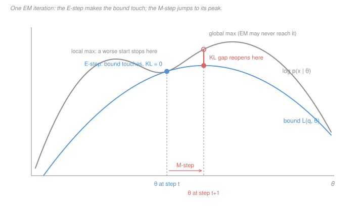

# Machine Learning · Lesson 3.6: The EM algorithm

> ⏱ ~15 min · Module 3: Probabilistic and unsupervised learning · Builds on: [3.5 (Gaussian mixture models)](03-05-gaussian-mixture-models.md), [3.3 (k-means clustering)](03-03-k-means-clustering.md) · Unlocks: 4.1 (model selection and cross-validation)

## Why this matters

Lesson 3.5 wrote down a model you could not fit. The mixture log-likelihood has a sum *inside* the logarithm, so the derivative does not separate and there is no closed form — the classic chicken-and-egg: if you knew which component made each point you could estimate the means in one line, and if you knew the means you could say which component made each point.

EM is the standard way out of that loop, and it is not a mixture trick. It is the general recipe for maximum likelihood **whenever some of the data is missing** — component labels here, but equally a hidden state in an HMM, an unobserved class in a survey, a censored measurement.

What makes EM worth a proof lesson is that it comes with exactly **one** guarantee, and that guarantee is unusually easy to state, unusually easy to prove, and unusually easy to over-read. The proof takes half a page. The over-reading — "so it converges to the MLE" — is wrong in three separate ways, and knowing which three is the difference between using EM and trusting it.

## The idea

You want to maximise $\log p(x \mid \theta)$, which is hard. So you do not.

Instead you build a **lower bound** on it — a function that sits underneath the log-likelihood everywhere, and that is *easy* to maximise because the awkward sum has been pulled outside the logarithm. Then you alternate two moves:

- **E-step:** slide the bound up until it **touches** the log-likelihood at the parameter you currently hold.
- **M-step:** forget the log-likelihood; jump to the top of the bound.

Since the bound touched at where you were, and you moved to somewhere at least as high *on the bound*, and the true log-likelihood is *above* the bound everywhere — you cannot have gone down. That is the whole argument, and it is the picture below.

The bound is not arbitrary. There is exactly one natural family of bounds here, indexed by a guessed distribution $q(z)$ over the missing data, and the amount by which the bound falls short is exactly the [KL divergence](../reference.md#kl-divergence) from $q$ to the true posterior over the missing data. So "make the bound touch" and "guess the missing data correctly, given what you currently believe" are the *same instruction*. That is why the E-step is a posterior computation and not an optimisation.

For the mixture of 3.5, that posterior is the [responsibility](../reference.md#responsibility) $r_{ik}$ you already know how to compute. EM is what those responsibilities were *for*.

## The formal version

**Setup.** Observed data $x$, missing data $z$, parameters $\theta$. The thing you want:

$$\log p(x \mid \theta) = \log \sum_z p(x, z \mid \theta).$$

**In words:** the likelihood of what you saw, averaged over everything you did not.

**The decomposition.** Let $q(z)$ be *any* distribution over the missing data with $q(z) > 0$ wherever $p(z \mid x, \theta) > 0$. Define

$$\mathcal L(q, \theta) = \sum_z q(z)\log\frac{p(x,z\mid\theta)}{q(z)}.$$

Then, for every $q$ and every $\theta$,

$$\log p(x\mid\theta) = \mathcal L(q,\theta) + \mathrm{KL}\big(q \,\big\|\, p(z\mid x,\theta)\big).$$

*Proof of the identity.* Since $q$ sums to 1, $\log p(x\mid\theta) = \sum_z q(z)\log p(x\mid\theta)$. Now use $p(x\mid\theta) = p(x,z\mid\theta)/p(z\mid x,\theta)$ inside and split the logarithm:

$$\sum_z q(z)\log\frac{p(x,z\mid\theta)}{q(z)} \;+\; \sum_z q(z)\log\frac{q(z)}{p(z\mid x,\theta)}.$$

The first sum is $\mathcal L(q,\theta)$; the second is the KL divergence. $\blacksquare$

**In words:** the log-likelihood splits, exactly, into a computable piece and a penalty for guessing the missing data wrongly. Because $\mathrm{KL} \ge 0$ — Gibbs' inequality, by Jensen; see [`information-theory` 1.4](../../information-theory/lessons/01-04-relative-entropy-kl-jensen.md) — the piece $\mathcal L(q,\theta)$ is a **lower bound**, and it is tight exactly when $q$ *is* the posterior.

**The algorithm.** From any $\theta^0$, repeat:

```
E-step:  q^{t+1}  <- p(z | x, theta^t)          -- the posterior over the missing data
M-step:  theta^{t+1} <- argmax_theta  L(q^{t+1}, theta)
```

The M-step is tractable because
$$\mathcal L(q,\theta) = \underbrace{\textstyle\sum_z q(z)\log p(x,z\mid\theta)}_{Q(\theta\mid\theta^t)} \;+\; H(q),$$
and $H(q)$ does not involve $\theta$. So the M-step maximises $Q$, the **expected complete-data log-likelihood** — the log-likelihood you would have written if the missing data were observed, averaged over your current guess of it. No sum inside a logarithm survives.

**Theorem (monotone ascent).** $\log p(x\mid\theta^{t+1}) \ \ge\ \log p(x\mid\theta^{t})$ for every $t$.

*Proof.* Four lines, one per fact.

$$
\begin{aligned}
\log p(x\mid\theta^{t+1}) &= \mathcal L(q^{t+1},\theta^{t+1}) + \mathrm{KL}\big(q^{t+1}\,\|\,p(z\mid x,\theta^{t+1})\big) && \text{(the identity, at } \theta^{t+1})\\
&\ge \mathcal L(q^{t+1},\theta^{t+1}) && (\mathrm{KL}\ge 0)\\
&\ge \mathcal L(q^{t+1},\theta^{t}) && \text{(the M-step maximised over }\theta)\\
&= \log p(x\mid\theta^{t}). && \text{(the E-step set } \mathrm{KL}=0)
\end{aligned}
$$

$\blacksquare$

Notice how little the proof used. The M-step only needed $\ge$, never $=$: **any** $\theta^{t+1}$ that does not lower $\mathcal L$ works, which is the licence for *generalized EM* (take one gradient step on $Q$ instead of maximising it). And the E-step only needed KL $=0$ at $\theta^t$, which is what makes the last line an equality rather than an inequality in the wrong direction.

**What is not guaranteed**, and all three failures are real:

1. **Not a global maximum.** The likelihood is generally multimodal; EM climbs the hill it starts on. Restarts are not optional.
2. **Not even a local maximum.** A stationary point is enough to stop EM dead — see P3, where a symmetric initialization parks it on one forever.
3. **Not a bounded quantity.** If the variances are free parameters, 3.5 showed the mixture likelihood is unbounded above. Monotone ascent then means EM climbs *into* the degeneracy, cheerfully and monotonically. Monotone is not the same as convergent.

**Cost.** For $K$ components in $p$ dimensions with $n$ points and spherical covariances, the E-step is $O(nKp)$ and the M-step is $O(nKp)$ — the same order as one Lloyd iteration in [3.3](03-03-k-means-clustering.md), with a soft weight where Lloyd has a hard one.

## Picture



The grey curve is the thing you cannot maximise. The blue curve is $\mathcal L(q,\theta)$ after the E-step: it lies below grey everywhere and touches at $\theta^t$, because that is precisely where the KL term is zero. The M-step ignores grey entirely and walks to the blue peak.

The coral segment is the KL gap *reopening* at the new parameter — the bound was built for $\theta^t$ and is stale at $\theta^{t+1}$, so the next E-step has to rebuild it. That reopened gap is the free lunch: the true likelihood at $\theta^{t+1}$ exceeds the bound value you actually maximised, by exactly the KL amount, so **you always gain at least what the bound gained, and usually more.** Note also the local maximum on the left — nothing in the argument prevents a different start from climbing that one and stopping.

## Worked examples

Throughout: a two-component 1-D Gaussian mixture with **equal weights** $\pi_A=\pi_B=\tfrac12$ and a **known, shared** standard deviation $\sigma$. Only the two means are unknown, so the M-step has one job. Data: $x = 1, 2, 4, 5$, with $\sigma = 2$, started at $\mu_A^0 = 1$, $\mu_B^0 = 5$.

**Example 1 (mechanical): the E-step is a logistic function.** Write out the responsibility and cancel:

$$r_{iB} = \frac{\pi_B\,e^{-(x_i-\mu_B)^2/2\sigma^2}}{\pi_A\,e^{-(x_i-\mu_A)^2/2\sigma^2} + \pi_B\,e^{-(x_i-\mu_B)^2/2\sigma^2}}.$$

The $1/(\sigma\sqrt{2\pi})$ factors cancel because the variances are shared. Divide top and bottom by the numerator and expand the squares, using $\Delta = \mu_B - \mu_A$ and the midpoint $m = (\mu_A+\mu_B)/2$:

$$(x-\mu_B)^2 - (x-\mu_A)^2 = -2\Delta\,(x - m),$$

so

$$r_{iB} = \sigma_{\text{logit}}\!\left(\frac{\Delta}{\sigma^2}(x_i - m) + \log\frac{\pi_B}{\pi_A}\right),$$

where $\sigma_{\text{logit}}(u) = 1/(1+e^{-u})$. **In words:** with a shared variance, the soft assignment is a logistic regression on $x$ — exactly the sigmoid of [1.5](01-05-logistic-regression-and-classification.md), with slope $\Delta/\sigma^2$ and its 0.5 crossing at the midpoint of the two means. The mixing weights enter only as an intercept.

Here $\Delta = 4$, $\sigma^2 = 4$, $m = 3$, and the weights are equal, so the whole E-step collapses to

$$r_{iB} = \frac{1}{1 + e^{-(x_i - 3)}}.$$

| $x_i$ | $x_i - 3$ | $r_{iB}$ | $r_{iA}$ | sum |
|---|---|---|---|---|
| 1 | $-2$ | $1/(1+e^{2}) = 0.11920$ | $0.88080$ | 1 |
| 2 | $-1$ | $1/(1+e^{1}) = 0.26894$ | $0.73106$ | 1 |
| 4 | $+1$ | $0.73106$ | $0.26894$ | 1 |
| 5 | $+2$ | $0.88080$ | $0.11920$ | 1 |

Every row sums to 1 by construction — the two responsibilities are a posterior over a two-valued latent. (Check: $1/(1+e^2) = 1/8.389 = 0.11920$.)

**Example 2 (why you'd care): the M-step, and where the run actually goes.** With $N_k = \sum_i r_{ik}$, maximising $Q$ over $\mu_k$ gives $\sum_i r_{ik}(x_i-\mu_k) = 0$, i.e. the responsibility-weighted mean:

$$\mu_k^{\text{new}} = \frac{1}{N_k}\sum_{i} r_{ik}\,x_i .$$

(The full model's other updates, for reference: $\pi_k = N_k/n$ and $\Sigma_k = \frac{1}{N_k}\sum_i r_{ik}(x_i-\mu_k)(x_i-\mu_k)^\top$. Here $\pi$ and $\sigma$ are fixed by assumption.)

By symmetry $N_A = N_B = 2$ exactly. And

$$\textstyle\sum_i r_{iA}x_i = 0.88080 + 2(0.73106) + 4(0.26894) + 5(0.11920) = 4.01469,$$

so $\mu_A^1 = 4.01469/2 = 2.00735$, and by symmetry $\mu_B^1 = 3.99265$. Both lie inside $[1,5]$ — a weighted average of the data always does, which is a free sanity check on any M-step you compute by hand.

Now audit the guarantee. The observed log-likelihood is $\sum_i \log\big(\tfrac12\phi(x_i;\mu_A,2) + \tfrac12\phi(x_i;\mu_B,2)\big)$:

| iterate | $\mu_A$ | $\mu_B$ | $\log p(x\mid\theta)$ |
|---|---|---|---|
| $\theta^0$ | $1.00000$ | $5.00000$ | $-8.59055$ |
| $\theta^1$ | $2.00735$ | $3.99265$ | $-7.89322$ |
| $\theta^2$ | $2.41918$ | $3.58082$ | $-7.76283$ |
| $\theta^{10}$ | $2.98698$ | $3.01302$ | $-7.69838$ |
| $\theta^{\infty}$ | $3$ | $3$ | $-7.69834$ |

Monotone, as promised, and the gains shrink — that is the shape of every EM run.

But look where it went. **The two means collapsed onto each other.** That is not a bug and not a bad local optimum: at $\sigma = 2$, $\mu_A = \mu_B = 3$ is the *global* maximum (checked over a grid on $[-2,7]^2$). A pair of Gaussians that wide simply cannot explain $\{1,2,4,5\}$ as two clusters better than one blob can. Refit the same data with $\sigma = 1$ and EM converges instead to $\mu = (1.55935,\ 4.44065)$ with log-likelihood $-6.84002$ — two real clusters.

**The moral:** EM answers "what is the best fit *in this model*," and it answered honestly both times. Nothing in the monotonicity theorem tells you the model was worth fitting.

**And the k-means limit.** Take equal weights and a shared spherical covariance $\sigma^2 I$, and divide top and bottom of $r_{ik}$ by the largest term:

$$r_{ik} = \frac{\exp\!\big(-\lVert x_i-\mu_k\rVert^2/2\sigma^2\big)}{\sum_j \exp\!\big(-\lVert x_i-\mu_j\rVert^2/2\sigma^2\big)}.$$

The exponents differ by $(d_j^2 - d_k^2)/2\sigma^2$ where $d_k = \lVert x_i - \mu_k\rVert$. As $\sigma \to 0$ that difference blows up, so every component but the nearest gets weight $\to 0$: the responsibilities go to 0/1. The M-step's weighted mean then becomes the plain mean of the points assigned to $k$ — Lloyd's centroid update. On our data, at $\mu = (1,5)$:

| $\sigma$ | $r_{1A}$ | $r_{2A}$ | $r_{4A}$ | $r_{5A}$ |
|---|---|---|---|---|
| $2$ | $0.8808$ | $0.7311$ | $0.2689$ | $0.1192$ |
| $1$ | $0.9997$ | $0.9820$ | $0.0180$ | $0.0003$ |
| $0.05$ | $1.0000$ | $1.0000$ | $0.0000$ | $0.0000$ |

At $\sigma = 0.05$ the M-step returns $1.5$ and $4.5$ — exactly the centroids of $\{1,2\}$ and $\{4,5\}$. **[k-means](03-03-k-means-clustering.md) is EM on a spherical equal-weight mixture in the zero-variance limit**, which is why Lloyd's algorithm also only guarantees monotone descent and also depends on its start.

## Watch out

- **You might think** the E-step increases the likelihood — **but actually** it does not touch $\theta$, so $\log p(x\mid\theta)$ is unchanged by it. What the E-step raises is the *bound*, up to meet a curve that stayed put. Every bit of likelihood gain comes from the M-step. (The E-step is still doing the essential work: without it, the M-step would be maximising a bound that no longer touches, and the last line of the proof would fail.)
- **You might think** "monotone" implies "converges to the maximum likelihood estimate" — **but actually** it implies neither word. A bounded increasing sequence converges *in value*, but only to a stationary point of the likelihood, and only if the likelihood is bounded at all — which for a mixture with free variances it is not ([3.5](03-05-gaussian-mixture-models.md)). Monotone ascent into a singularity is still monotone ascent.
- **You might think** the responsibility $r_{ik}$ is the probability that point $i$ really came from component $k$ — **but actually** it is that probability *under the current parameters*, which are wrong, especially early. Treating an early-iteration responsibility of 0.98 as near-certainty is the same error as trusting a logistic regression's probabilities after one gradient step.

## One-liner

> EM never climbs the likelihood directly — it builds a lower bound that touches wherever you are, climbs that instead, and the KL gap that closes at the touch point is exactly why the likelihood cannot go down.

## Problems

**P1 (🟢)** A two-component 1-D mixture, equal weights, shared known $\sigma = 2$, only the means unknown. Data $x = 0, 2, 5$; initialize $\mu_A^0 = 0$, $\mu_B^0 = 4$.

(a) Write the E-step in its logistic form for this instance (give the slope and the crossing point), then tabulate $r_{iA}$ and $r_{iB}$ for all three points and check each row sums to 1. (b) Run the M-step and give $\mu_A^1$, $\mu_B^1$ to five decimals. (c) Confirm both updated means lie inside the data range, and say in one sentence why that had to happen.

**P2 (🟡)** Continue P1. The observed log-likelihood is $-6.67204$ at $\theta^0$ and $-6.46443$ at $\theta^1$.

(a) The likelihood rose by $0.20761$. Attribute that gain to the E-step, the M-step, or both, and justify it from the proof — not from the numbers. (b) The M-step maximised $\mathcal L(q^1,\theta)$, not $\log p(x\mid\theta)$. Explain why the true likelihood at $\theta^1$ is nonetheless *at least* as high as the bound value that was maximised, and name the quantity that measures the difference. (c) A colleague's EM implementation prints a log-likelihood that decreases by $10^{-9}$ on one iteration and by $0.4$ on another. Which is a bug, and which is not?

**P3 (🔴)** Same model as P1 (two components, equal weights, shared known $\sigma$, means free), but initialize both means at the same point: $\mu_A^0 = \mu_B^0 = c$.

(a) Show that $r_{iA} = r_{iB} = \tfrac12$ for **every** data point, exactly, whatever $c$ and $\sigma$ are. (b) Show the M-step returns $\mu_A^1 = \mu_B^1 = \bar x$, and hence that EM never moves again after one step. (c) Verify on the lesson's data $\{1,2,4,5\}$ that this fixed point is the *same* one the run from $\mu^0 = (1,5)$ converged to at $\sigma = 2$ — and say what that pair of facts means for how you should read "EM got stuck." (d) State the general lesson about symmetry in EM, and name a cheap fix.

<details>
<summary>Solutions</summary>

**P1** (a) Slope $\Delta/\sigma^2 = (4-0)/4 = 1$; midpoint $m = (0+4)/2 = 2$; equal weights so no intercept. Hence

$$r_{iB} = \frac{1}{1+e^{-(x_i-2)}}.$$

| $x_i$ | $x_i-2$ | $r_{iB}$ | $r_{iA}$ | sum |
|---|---|---|---|---|
| 0 | $-2$ | $0.11920$ | $0.88080$ | 1 |
| 2 | $0$ | $0.50000$ | $0.50000$ | 1 |
| 5 | $+3$ | $0.95257$ | $0.04743$ | 1 |

Each row sums to 1 because $\{A,B\}$ exhausts the latent variable's values, so the two numbers are a posterior over a two-point set. Note the middle point sits exactly at the midpoint of the means and so is split perfectly — the sigmoid's 0.5 crossing.

(b) $N_A = 0.88080 + 0.50000 + 0.04743 = 1.42822$ and $N_B = 3 - N_A = 1.57178$.

$$\textstyle\sum_i r_{iA}x_i = 0(0.88080) + 2(0.50000) + 5(0.04743) = 1.23716,$$
$$\textstyle\sum_i r_{iB}x_i = 0(0.11920) + 2(0.50000) + 5(0.95257) = 5.76284.$$

So $\mu_A^1 = 1.23716/1.42822 = 0.86620$ and $\mu_B^1 = 5.76284/1.57178 = 3.66647$.

(c) Both lie in $[0,5]$. They had to: each is a convex combination of the data (weights $r_{ik}/N_k$ are non-negative and sum to 1), and a convex combination of points lies in their convex hull, which in 1-D is the interval from $\min x_i$ to $\max x_i$. **An M-step that returns a mean outside the data range is an arithmetic error, always.**

**P2** (a) **Entirely the M-step.** The E-step changes $q$, not $\theta$, and $\log p(x\mid\theta^0)$ does not depend on $q$ at all — it is the same number before and after. What the E-step did was set $\mathrm{KL}(q^1 \,\|\, p(z\mid x,\theta^0)) = 0$, which raises the *bound* $\mathcal L(q^1,\theta^0)$ up to equal the log-likelihood. The likelihood then moves only when $\theta$ moves, which happens in the M-step. (This is exactly the two blue-then-coral moves in the Picture: the first is vertical in the bound, not in the curve.)

(b) By the identity applied at $\theta^1$,

$$\log p(x\mid\theta^1) = \mathcal L(q^1,\theta^1) + \mathrm{KL}\big(q^1\,\|\,p(z\mid x,\theta^1)\big),$$

and KL is non-negative, so the true likelihood is at least the maximised bound value. The quantity measuring the shortfall is the KL divergence from the E-step's $q^1$ — which was the posterior at $\theta^{0}$, not at $\theta^{1}$ — to the posterior at the *new* parameters. It is zero only if the M-step did not move $\theta$, which is exactly the stopping condition.

(c) The $10^{-9}$ drop is **floating-point noise**, not a bug: the theorem is exact but the arithmetic is not, and near a stationary point the true increase is smaller than the rounding error. The $0.4$ drop is **a bug** — the theorem forbids it, so something is wrong in the code: an E-step that does not use the current $\theta$, unnormalised responsibilities, or an M-step that fails to maximise $Q$ (a common one: updating the means with new responsibilities but the variances with old ones).

**P3** (a) With $\mu_A = \mu_B = c$ the two Gaussian densities are the *same function*, so $\phi(x_i;c,\sigma)$ appears identically in both numerators. With equal weights,

$$r_{iA} = \frac{\tfrac12\phi(x_i;c,\sigma)}{\tfrac12\phi(x_i;c,\sigma)+\tfrac12\phi(x_i;c,\sigma)} = \tfrac12,$$

for every $i$, independent of $c$, of $\sigma$, and of the data. (Via the logistic form: $\Delta = 0$ kills the slope and equal weights kill the intercept, leaving $\sigma_{\text{logit}}(0) = 1/2$.) Worth noting the generalisation: with unequal weights the responsibilities are the constants $\pi_A$ and $\pi_B$, and the weight update returns $\pi_k$ unchanged, so the argument still goes through.

(b) $N_A = N_B = n/2$, and

$$\mu_A^1 = \frac{\sum_i \tfrac12 x_i}{n/2} = \frac{1}{n}\sum_i x_i = \bar x,$$

identically for $B$. So after one step both means sit at $\bar x$ — still equal — and part (a) applies again: responsibilities $\tfrac12$ forever, means $\bar x$ forever. EM has reached a fixed point in one step and cannot leave it, for any $n$, any $\sigma$, any data.

(c) On $\{1,2,4,5\}$, $\bar x = 12/4 = 3$, so the symmetric start lands at $\mu_A = \mu_B = 3$ — which is precisely where the run from $\mu^0 = (1,5)$ converged at $\sigma = 2$, with log-likelihood $-7.69834$, and which the grid search confirmed is the global maximum at that $\sigma$.

**What that means:** "EM converged to a collapsed solution" is *not* by itself evidence of a bad initialization. Here the same collapse is a genuine stationary point reached from an asymmetric start and the true optimum of the model. The diagnosis has to distinguish two cases, and only re-running from several starts does that: at $\sigma = 2$ every start collapses (the model is wrong), while at $\sigma = 1$ an asymmetric start finds $(1.55935, 4.44065)$ and only the symmetric start collapses (the *start* was wrong).

(d) **EM preserves every symmetry in its initialization.** The E- and M-steps are equivariant under relabelling the components, so if $\theta^0$ is invariant under a swap of two components, so is every subsequent iterate — the algorithm has no mechanism to break a tie it starts holding. This is a genuine stationary point of the likelihood, so no amount of monotone ascent escapes it: monotone means "never down," not "always up."

The cheap fix is to make the initialization asymmetric on purpose: perturb the means randomly, or seed them at $K$ distinct data points (k-means++ style), and run several restarts, keeping the best final log-likelihood. The same fix answers the same problem in [3.3](03-03-k-means-clustering.md) — Lloyd's algorithm with two identical starting centroids is stuck in the identical way, and for the identical reason.

</details>

## Flashback

**From Lesson 3.5 (Gaussian mixture models):** A two-component 1-D mixture with $\pi_A = 0.3$, component $A \sim \mathcal N(0, 1)$, and $\pi_B = 0.7$, component $B \sim \mathcal N(4, 2^2)$.

(a) Compute the responsibilities $r_A$ and $r_B$ for the points $x = 1$ and $x = 3$, and check each row sums to 1. (Note that the $1/\sigma$ factors do **not** cancel here.) (b) EM's monotonicity theorem says the log-likelihood never decreases. Does that guarantee protect you from 3.5's degeneracy — a component collapsing onto a single data point?

<details>
<summary>Solution</summary>

(a) With $\phi(x;\mu,\sigma) = \frac{1}{\sigma\sqrt{2\pi}}e^{-(x-\mu)^2/2\sigma^2}$, and keeping the $1/\sigma$ because the variances differ:

At $x = 1$: $\phi(1;0,1) = 0.241971$ and $\phi(1;4,2) = 0.064759$. Weighted:

$$0.3(0.241971) = 0.072591, \qquad 0.7(0.064759) = 0.045331.$$

Sum $= 0.117922$, so $r_A = 0.61559$ and $r_B = 0.38441$. Sum $= 1$. ✓

At $x = 3$: $\phi(3;0,1) = 0.004432$ and $\phi(3;4,2) = 0.176033$. Weighted:

$$0.3(0.004432) = 0.001330, \qquad 0.7(0.176033) = 0.123223.$$

Sum $= 0.124552$, so $r_A = 0.01067$ and $r_B = 0.98933$. Sum $= 1$. ✓

The point at $x = 1$ is genuinely ambiguous despite being one unit from $\mu_A$ and three from $\mu_B$ — because $B$ is both twice as wide and more than twice as likely a priori. The point at $x = 3$ is almost all $B$'s. **Distance alone does not decide a responsibility;** the prior weight and the width both bid.

(b) **No — it walks straight into it.** Monotonicity says the sequence of log-likelihoods is non-decreasing. If $\sigma_A$ is a free parameter, put $\mu_A$ on a data point and shrink $\sigma_A$: on this two-point set with $\mu_A = 1$, the log-likelihood is $-3.7720$ at $\sigma_A = 1$, $-1.8769$ at $0.1$, $+0.3923$ at $0.01$ and $+2.6915$ at $0.001$ — climbing without bound. A monotone algorithm finds that path *attractive*, and the M-step's variance update, seeing one point with responsibility near 1 and near-zero squared deviation, will happily take it.

So the guarantee and the pathology are perfectly compatible: the theorem promises the sequence goes up, and here "up" leads to a singularity where one component models one point and the fit is worthless. This is the sharpest statement of the lesson's caveat — **monotone is a statement about the sequence, not about the destination** — and it is why every practical fitter imposes a variance floor or a prior on the covariances.

</details>

## Connections

- **Backward:** the E-step is [3.5's](03-05-gaussian-mixture-models.md) responsibility, which is now revealed as a bound-tightening move rather than a definition; with a shared variance it is literally [1.5's](01-05-logistic-regression-and-classification.md) sigmoid, slope $\Delta/\sigma^2$, crossing at the midpoint. The KL non-negativity the proof rests on is Gibbs' inequality from [`information-theory` 1.4](../../information-theory/lessons/01-04-relative-entropy-kl-jensen.md), and the whole exercise is maximum likelihood in the sense of [`prob-stat-refresher` 4.1](../../prob-stat-refresher/lessons/04-01-estimation-and-mle.md) — with a sum inside the log that had to be got around.
- **Forward:** [4.1](04-01-model-selection-and-cross-validation.md) inherits the problem this lesson cannot solve. EM will happily report a higher likelihood for $K+1$ components than for $K$ — more parameters, more fit — so the number of components can never be chosen by the training likelihood, any more than $k$ could be chosen by WCSS in [3.3](03-03-k-means-clustering.md). That needs held-out data.
- **Sideways:** the decomposition $\log p = \mathcal L + \mathrm{KL}$ is the **evidence lower bound**, and EM is its special case where the E-step can be done exactly. When the posterior $p(z\mid x,\theta)$ is intractable you restrict $q$ to a family you can handle and maximise the same bound anyway — that is variational inference, and it is how the [`deep-learning`](../../deep-learning/syllabus.md) course's latent-variable models are trained. The move itself is the one from [2.3](02-03-soft-margins-and-the-svm-dual.md): when the object you want is intractable, optimise a bound you can compute and control the gap.
