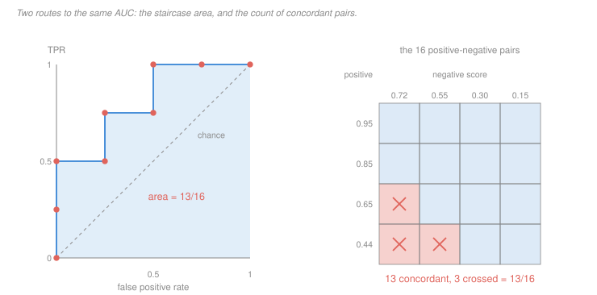

# Machine Learning · Lesson 4.2: Classification metrics

> ⏱ ~15 min · Module 4: Evaluation and the road to neural nets · Builds on: [4.1 (cross-validation)](04-01-model-selection-and-cross-validation.md), [1.5 (logistic regression)](01-05-logistic-regression-and-classification.md) · Unlocks: 4.3 (diagnosing models in practice)

## Why this matters

[Lesson 4.1](04-01-model-selection-and-cross-validation.md) got you an honest estimate of *a* number. This lesson is about which number.

Accuracy is the default, and on any problem where one class is rare it is close to useless: a spam filter that flags nothing, a fraud detector that approves everything, a screening test that sends everyone home — each of them beats a real model on accuracy, and none of them does anything. The failure is not subtle and it is not rare; it is the single most common way a model that looks fine in a notebook turns out to be worthless in deployment.

The fix is not one better metric. It is knowing that a classifier is not one classifier — it is a **family**, indexed by the threshold you put on its score — and that the number you report is a choice about which errors you are willing to make. This lesson is the vocabulary for making that choice deliberately, plus the one identity worth memorising: AUC is the probability that a random positive outscores a random negative, and on a small instance you can check that by counting.

## The idea

Almost every classifier really produces a **score** — a probability from [logistic regression](01-05-logistic-regression-and-classification.md), a signed distance from an [SVM](02-03-soft-margins-and-the-svm-dual.md), a vote share from a [forest](02-06-bagging-and-random-forests.md). You turn the score into a decision by picking a threshold $t$ and predicting positive when $s(x) \ge t$.

Move $t$ and you slide along a trade-off. Low $t$: you catch nearly every positive and drown in false alarms. High $t$: everything you flag is real and you miss most of them. **No metric evaluated at one threshold can tell you what the model does at another**, so there are two genuinely different questions:

- *How good is the ranking?* — a threshold-free question, answered by the ROC curve and its area.
- *How good is this deployed decision?* — a question about one threshold, answered by the confusion matrix and the ratios you read off it.

Confusing the two is the mistake. A model with a beautiful AUC can be badly miscalibrated and useless at the threshold you actually ship; a model with a fine precision at one threshold tells you nothing about the operating point your product manager will ask for next week.

## The formal version

**The [confusion matrix](../reference.md#confusion-matrix).** Fix a threshold. Every example lands in one of four cells: true positives $\mathrm{TP}$, false positives $\mathrm{FP}$, false negatives $\mathrm{FN}$, true negatives $\mathrm{TN}$. Everything below is a ratio of two of these, and nothing else is.

$$\text{accuracy} = \frac{\mathrm{TP}+\mathrm{TN}}{n}, \qquad P = \frac{\mathrm{TP}}{\mathrm{TP}+\mathrm{FP}}, \qquad R = \frac{\mathrm{TP}}{\mathrm{TP}+\mathrm{FN}}, \qquad \text{spec} = \frac{\mathrm{TN}}{\mathrm{TN}+\mathrm{FP}}.$$

*In words:* [precision](../reference.md#precision) $P$ asks "of the things I flagged, how many were real"; [recall](../reference.md#recall) $R$ (also sensitivity, also the true positive rate) asks "of the real things, how many did I catch"; [specificity](../reference.md#specificity) is recall for the negative class. The false positive rate is $\mathrm{FPR} = 1 - \text{spec}$. Precision has a *predicted* count in its denominator; recall and specificity have *actual* counts. That distinction is the whole of the prevalence story below.

**[$F_1$](../reference.md#f1-score)** is the harmonic mean of precision and recall:

$$F_1 = \frac{2PR}{P+R} = \left(\frac{P^{-1} + R^{-1}}{2}\right)^{-1}.$$

Harmonic, not arithmetic, and the reason is a one-line inequality. Write $m = \min(P,R)$ and $M = \max(P,R)$; then $F_1 = m \cdot \frac{2M}{m+M}$, and since $M \ge m$ the factor lies in $[1, 2)$. So

$$m \;\le\; F_1 \;<\; 2m.$$

*In words:* $F_1$ can never be more than twice your **worse** number. The arithmetic mean has no such ceiling — it happily reports 0.55 for a classifier with precision 0.1 and recall 1.0. The harmonic mean refuses to be rescued by one large component, which is exactly what you want from a summary of a trade-off.

**The [ROC curve](../reference.md#roc-curve).** Sweep $t$ from $+\infty$ down to $-\infty$ and plot $(\mathrm{FPR}(t),\ R(t))$. It starts at $(0,0)$, ends at $(1,1)$, and on a finite sample it is a staircase: each positive you pass steps **up** by $1/P_{\text{count}}$, each negative steps **right** by $1/N_{\text{count}}$, writing $P_{\text{count}}$ and $N_{\text{count}}$ for the number of positives and negatives.

**[AUC](../reference.md#auc)** is the area under it, and it has a second definition that is not obviously the same thing:

$$\mathrm{AUC} \;=\; \Pr\!\big(s(X^+) > s(X^-)\big) \;+\; \tfrac12\Pr\!\big(s(X^+) = s(X^-)\big),$$

for an independent random positive $X^+$ and negative $X^-$. *In words: the chance that the model ranks a random positive above a random negative.*

**Why the two definitions agree** — this is short enough to do here, and doing it once means you never have to trust the coincidence. Compute the area by columns. The curve moves right exactly when the sweep passes a negative $j$, by a step of width $1/N_{\text{count}}$, at height $k_j/P_{\text{count}}$ where $k_j$ is the number of positives already passed — that is, the number of positives scoring **above** negative $j$. Summing those rectangles,

$$\mathrm{AUC} \;=\; \sum_{j=1}^{N_{\text{count}}} \frac{1}{N_{\text{count}}}\cdot\frac{k_j}{P_{\text{count}}} \;=\; \frac{\#\{(i,j): s_i^+ > s_j^-\}}{P_{\text{count}}\, N_{\text{count}}},$$

which is the concordant-pair fraction. A tie makes the staircase cut a diagonal across a unit cell instead of going right-then-up, contributing exactly half that cell — the $\tfrac12$ in the definition. So the two routes are the same sum, grouped differently.

**Precision moves with prevalence; recall does not.** Let $\pi$ be the prevalence, $\Pr(y=1)$. Recall and specificity are computed *within* a class, so they are properties of the classifier alone. Precision is not — by Bayes ([`prob-stat-refresher` 1.2](../../prob-stat-refresher/lessons/01-02-conditional-probability-bayes.md)),

$$P \;=\; \frac{R\,\pi}{R\,\pi + (1-\text{spec})(1-\pi)}.$$

Take a genuinely excellent test, $R = 0.99$ and $\text{spec} = 0.95$, and run it on 10,000 people at two prevalences:

| $\pi$ | sick | $\mathrm{TP}$ | $\mathrm{FN}$ | $\mathrm{FP}$ | $\mathrm{TN}$ | precision |
|---|---|---|---|---|---|---|
| $0.20$ | 2,000 | 1,980 | 20 | 400 | 7,600 | $99/119 \approx 0.832$ |
| $0.01$ | 100 | 99 | 1 | 495 | 9,405 | $1/6 \approx 0.167$ |

Same test, same recall, same specificity. At 1 percent prevalence **five out of six positive results are wrong**, because 5 percent of a huge healthy population outnumbers 99 percent of a tiny sick one. This is why a screening programme needs a confirmatory second test, and why "99 percent accurate" in a press release means nothing.

The practical consequence: **ROC when the classes are roughly balanced, precision–recall when positives are rare.** Both axes of an ROC curve are within-class rates, so ROC is blind to $\pi$ — a virtue when comparing two rankers, a liability when you need to know what will actually land on an analyst's desk. A PR curve puts precision on an axis and therefore moves when the base rate does.

## Picture

Left: the staircase for the eight-point instance below, with the chance diagonal dashed. Right: the same number arrived at by brute force — all $4 \times 4 = 16$ ways to pick one positive and one negative, with the three the model gets backwards crossed out. The shaded area and the shaded cell count are the same $13/16$, and the paragraph above says why they must be.

## Worked examples

**Example 1 (mechanical): where accuracy lies.** A spam filter is evaluated on 500 messages, 50 of them spam. Call spam the positive class. It flags 60 messages, of which 40 really are spam.

| | predicted spam | predicted ham |
|---|---|---|
| **actually spam** | $\mathrm{TP} = 40$ | $\mathrm{FN} = 10$ |
| **actually ham** | $\mathrm{FP} = 20$ | $\mathrm{TN} = 430$ |

Read the ratios straight off:

$$\text{accuracy} = \frac{470}{500} = 0.94, \quad P = \frac{40}{60} = \frac23, \quad R = \frac{40}{50} = \frac45, \quad \text{spec} = \frac{430}{450} = \frac{43}{45}.$$

$$F_1 = \frac{2 \cdot \frac23 \cdot \frac45}{\frac23 + \frac45} = \frac{16/15}{22/15} = \frac{8}{11} \approx 0.727.$$

Now the two baselines that make the point.

- **Flag nothing.** Accuracy $450/500 = 0.90$. The real model beats it by four points — for all the work, accuracy says the model is worth 4 percent. Precision and recall say something more useful: the trivial classifier has $R = 0$ and $P$ undefined, so it scores $F_1 = 0$.
- **Flag everything.** $P = 50/500 = 0.1$, $R = 1$, accuracy $= 0.1$. The arithmetic mean of precision and recall is $0.55$ — a respectable-sounding number for a classifier that has made no decisions at all. The harmonic mean is $F_1 = 2/11 \approx 0.182$, comfortably inside the $m \le F_1 < 2m$ band with $m = 0.1$. That gap between 0.55 and 0.182 is the entire argument for the harmonic mean.

**Example 2 (the identity): both routes to one AUC.** Eight scored examples, four positive and four negative, sorted by score:

$$(0.95,+),\ (0.85,+),\ (0.72,-),\ (0.65,+),\ (0.55,-),\ (0.44,+),\ (0.30,-),\ (0.15,-).$$

*Route 1 — sweep the threshold.* Take the top $k$ as positive, for $k = 0,\dots,8$:

| $k$ | $\mathrm{TP}$ | $\mathrm{FP}$ | $\mathrm{FN}$ | $\mathrm{TN}$ | FPR | TPR |
|---|---|---|---|---|---|---|
| 0 | 0 | 0 | 4 | 4 | $0$ | $0$ |
| 1 | 1 | 0 | 3 | 4 | $0$ | $1/4$ |
| 2 | 2 | 0 | 2 | 4 | $0$ | $1/2$ |
| 3 | 2 | 1 | 2 | 3 | $1/4$ | $1/2$ |
| 4 | 3 | 1 | 1 | 3 | $1/4$ | $3/4$ |
| 5 | 3 | 2 | 1 | 2 | $1/2$ | $3/4$ |
| 6 | 4 | 2 | 0 | 2 | $1/2$ | $1$ |
| 7 | 4 | 3 | 0 | 1 | $3/4$ | $1$ |
| 8 | 4 | 4 | 0 | 0 | $1$ | $1$ |

Every step is purely vertical or purely horizontal (no ties), so the region under the staircase is four rectangles, each of width $1/4$, of heights $1/2$, $3/4$, $1$, $1$ — read off the FPR column, whose four rightward steps land at $1/4$, $1/2$, $3/4$, $1$:

$$\mathrm{AUC} = \tfrac14\!\left(\tfrac12\right) + \tfrac14\!\left(\tfrac34\right) + \tfrac14\left(1\right) + \tfrac14\left(1\right) = \frac{2 + 3 + 4 + 4}{16} = \frac{13}{16} = 0.8125.$$

*Route 2 — count pairs.* There are $4 \times 4 = 16$ positive–negative pairs. The pairs the model gets **wrong** are exactly those where a negative outscores a positive, and there are only three: $0.72$ beats $0.65$, $0.72$ beats $0.44$, and $0.55$ beats $0.44$. So $16 - 3 = 13$ concordant pairs, and

$$\mathrm{AUC} = \frac{13}{16} = 0.8125.$$

Same number, and not by luck: the third row of the table is where the negative at $0.72$ enters, and the rectangle it contributes has height $2/4$ — precisely the two positives ($0.95$ and $0.85$) that beat it. Column-by-column area **is** pair counting.

The reading: this model ranks a random spam above a random ham 81 percent of the time. That sentence transfers to any operating point; "94 percent accurate" does not.

## Watch out

- **You might think** a high accuracy means the model learned something — **but actually** you have to beat the majority-class baseline before accuracy means anything, and on a 1-percent-positive problem that baseline is 99 percent. Always report the trivial classifier's score next to your own. A model at 98.5 percent accuracy on such a problem is *worse than doing nothing*, and nothing in the number tells you so.
- **You might think** AUC summarises how well the model will do — **but actually** it summarises the *ranking* and you never deploy a ranking, you deploy a threshold. AUC also cannot see prevalence, since both its axes are within-class rates: the same AUC on a balanced test set and a 1-in-1000 production stream imply wildly different precisions. Use AUC to compare candidate models; use the confusion matrix at your chosen threshold to decide whether to ship one.
- **You might think** $F_1$ is a neutral summary — **but actually** it never looks at $\mathrm{TN}$ at all, and it is not symmetric: relabel which class you call "positive" and $F_1$ changes, from exactly the same predictions. In Example 1, calling *ham* the positive class gives $P = 430/440$ and $R = 430/450$, so $F_1 \approx 0.966$ — the same model, the same errors, a completely different headline. Accuracy is symmetric under that relabelling; $F_1$ is a choice, and it is worth making it on purpose.

## One-liner

> A classifier is a family of decisions indexed by a threshold, so report the ranking's quality with AUC — literally the chance a random positive outscores a random negative — and the deployed decision's quality with a confusion matrix, remembering that precision moves with prevalence and recall does not.

## Problems

**P1 (🟢)** A fraud detector is run on 15 transactions. Truth $y$ and prediction $\hat y$ (1 = fraud), in the same order:

$$y = (1,1,0,1,0,0,1,0,1,0,0,1,0,0,0)$$
$$\hat y = (1,1,1,1,0,0,1,1,1,0,1,0,0,0,0)$$

(a) Build the confusion matrix. (b) Compute accuracy, precision, recall, specificity and $F_1$ as exact fractions. (c) Give the accuracy of the "never flag anything" classifier and say in one sentence what the comparison shows.

**P2 (🟡)** A diagnostic test has sensitivity $0.95$ and specificity $0.90$, fixed. (a) Compute its precision at prevalence 10 percent and at prevalence 0.1 percent, showing the counts you used. (b) State which of sensitivity, specificity and precision changed between the two settings and which did not, and explain the asymmetry in one sentence in terms of what sits in each denominator. (c) The 0.1-percent test is used to screen 100,000 people. How many of the flagged patients are healthy?

**P3 (🔴)** Two fraud models are evaluated on the same test set. Their ROC curves are piecewise linear through one interior vertex each:

- model **A**: $(0,0) \to (0.2,\ 0.8) \to (1,1)$;
- model **B**: $(0,0) \to (0.4,\ 1.0) \to (1,1)$.

(a) Compute both AUCs and confirm they are equal. (b) Find the point where the two curves cross, exactly. (c) Your audit team can investigate at most 20 percent of the legitimate transactions. Which model do you deploy, and what recall do you get from each? (d) A regulator instead requires that you catch at least 95 percent of fraud. Now which model, and at what false positive rate? (e) In one sentence, say what the shared AUC hid.

Solutions

**P1** (a) Comparing the two vectors position by position: there are 6 actual frauds (positions 1, 2, 4, 7, 9, 12) and 9 legitimate transactions. The model flags 8 (positions 1, 2, 3, 4, 7, 8, 9, 11).

| | predicted fraud | predicted legit |
|---|---|---|
| **actually fraud** | $\mathrm{TP} = 5$ | $\mathrm{FN} = 1$ |
| **actually legit** | $\mathrm{FP} = 3$ | $\mathrm{TN} = 6$ |

The one miss is position 12; the three false alarms are positions 3, 8 and 11. Check: $5+1+3+6 = 15$. ✓

(b)

$$\text{accuracy} = \frac{5+6}{15} = \frac{11}{15} \approx 0.733, \qquad P = \frac{5}{8} = 0.625, \qquad R = \frac{5}{6} \approx 0.833,$$

$$\text{spec} = \frac{6}{9} = \frac23, \qquad F_1 = \frac{2 \cdot \frac58 \cdot \frac56}{\frac58 + \frac56} = \frac{25/24}{35/24} = \frac{25}{35} = \frac57 \approx 0.714.$$

(Sanity check on the $F_1$ band: $m = 5/8 = 0.625$ and $5/7 \approx 0.714$ sits in $[0.625,\ 1.25)$. ✓)

(c) "Never flag" gets the 9 legitimate transactions right and the 6 frauds wrong: accuracy $9/15 = 3/5 = 0.6$. The real model beats it by only about 13 points despite catching five of six frauds — with 40 percent positives this problem is nearly balanced, so accuracy is *not* badly broken here, but it still understates the model badly compared to $R = 5/6$. On a realistic fraud base rate of well under 1 percent, the do-nothing baseline would be above 99 percent and accuracy would be worthless.

**P2** (a) Work in counts; the fractions follow.

*Prevalence 10 percent, 1,000 people.* 100 sick: $\mathrm{TP} = 0.95 \times 100 = 95$, $\mathrm{FN} = 5$. 900 healthy: $\mathrm{FP} = 0.10 \times 900 = 90$, $\mathrm{TN} = 810$.

$$P = \frac{95}{95+90} = \frac{95}{185} = \frac{19}{37} \approx 0.514.$$

*Prevalence 0.1 percent, 100,000 people.* 100 sick: $\mathrm{TP} = 95$, $\mathrm{FN} = 5$. 99,900 healthy: $\mathrm{FP} = 0.10 \times 99{,}900 = 9{,}990$, $\mathrm{TN} = 89{,}910$.

$$P = \frac{95}{95 + 9{,}990} = \frac{95}{10{,}085} = \frac{19}{2017} \approx 0.0094.$$

(b) Sensitivity and specificity are unchanged — they were fixed by assumption, and that is the point: they are properties of the test, computed within a class, so the mix of classes cannot move them. Precision fell from about 51 percent to about 0.94 percent, a factor of 55. **The asymmetry is in the denominator:** recall divides by the number of actual positives and specificity by the number of actual negatives, while precision divides by the number of *predicted* positives, which mixes the two classes in the proportion the population supplies.

(c) $\mathrm{FP} = 9{,}990$ of the $10{,}085$ flagged. So **9,990 healthy people are flagged** — more than 99 out of every 100 positive results is a false alarm, from a test with a 95 percent detection rate and only a 10 percent false-alarm rate per healthy person. The 10 percent is applied to 99,900 people.

**P3** (a) A piecewise-linear ROC through one vertex $(a,b)$ has area

$$\frac{ab}{2} + \frac{(1-a)(b+1)}{2} = \frac{ab + b + 1 - ab - a}{2} = \frac{1 + b - a}{2}.$$

Model A: $(1 + 0.8 - 0.2)/2 = 0.8$. Model B: $(1 + 1.0 - 0.4)/2 = 0.8$. Equal. ✓

(b) Below the crossing, A is the higher curve (at $\mathrm{FPR} = 0.2$, A is at $0.8$ and B at $0.5$). So the crossing lies on A's *second* segment and B's *first*. A's second segment: from $(0.2,0.8)$ to $(1,1)$, slope $0.2/0.8 = 1/4$, so $y = 0.8 + \tfrac14(x - 0.2) = \tfrac34 + \tfrac{x}{4}$. B's first segment: $y = x/0.4 = \tfrac{5x}{2}$. Setting them equal,

$$\frac{5x}{2} = \frac34 + \frac{x}{4} \;\Longrightarrow\; 10x = 3 + x \;\Longrightarrow\; x = \frac13, \quad y = \frac56.$$

They cross at $(1/3,\ 5/6)$: A dominates for $\mathrm{FPR} < 1/3$, B for $\mathrm{FPR} > 1/3$.

(c) "At most 20 percent of the legitimate transactions" is the constraint $\mathrm{FPR} \le 0.2$, which is left of the crossing. At $\mathrm{FPR} = 0.2$: model A gives $R = 0.8$; model B gives $R = 0.2/0.4 = 0.5$. **Deploy A** — it catches 30 more percentage points of the fraud under the same audit budget.

(d) $R \ge 0.95$ is above the crossing. Model A: solve $\tfrac34 + \tfrac{x}{4} = 0.95$, giving $x = 0.8$. Model B: it is on the first segment, $\tfrac{5x}{2} = 0.95$, giving $x = 0.38$. **Deploy B** — it meets the regulator's recall at a 38 percent false positive rate against A's 80 percent, less than half the audit load.

(e) The shared AUC of 0.8 averaged over *all* operating points, including ones neither business would ever use; because the curves cross, no single ordering of the two models exists, and which one is better is decided entirely by the constraint you are actually under.

## Flashback

**From Lesson 4.1 (Model selection and cross-validation):** Two parts.

(a) A colleague has 2,000 labelled transactions, 100 of them fraud. To fix the imbalance they duplicate each fraud row 19 times, bringing the classes to 1,900 versus 1,900, and *then* split 80/20 into train and test. Cross-validated accuracy comes back at 0.97. Is that an honest estimate? If not, name the exact step that leaked and say what the correct order is.

(b) They then sweep the decision threshold over a grid of 17 values and report the accuracy at the threshold that scored best **on the test set**. Which reported number is now optimistic, which one is not, and roughly how much should it be discounted?

Solution

(a) **Not honest — the duplication must happen after the split, and only on the training half.** Duplicating before splitting puts near-identical copies of the same 100 fraud rows on both sides of the line: a test row's 19 twins are sitting in the training set, so the model can memorise rather than generalise and the "held-out" set is not held out. This is 4.1's rule in its purest form — *any transformation that lets one row see another's label cannot straddle the split.* The correct order is split first, then resample (or reweight) inside the training fold only, refitting the resampling separately in every cross-validation fold.

Note what makes this leak worse than a benign one: the leaked rows are precisely the rare class the metric is most sensitive to. And 0.97 accuracy on a set that has been rebalanced to 50/50 is being compared, implicitly, against a 0.50 baseline — while in production the base rate is 5 percent and the do-nothing baseline is 0.95.

(b) **The reported accuracy at the chosen threshold is optimistic; the AUC is not** — at least not by this step, because AUC is computed from the ranking and never consults a threshold. Choosing the best of 17 noisy estimates is a maximum over 17 correlated random variables, so it is biased upward by roughly the standard error of one estimate.

Concretely: simulating a classifier whose scores are unit-variance Gaussians with the two class means one apart, on a balanced test set of 200 rows and that 17-point grid, the best-on-test accuracy exceeds the true accuracy of the threshold it picked by about **0.019** on average — about two accuracy points, against a single-estimate standard error of about 0.033. At $n = 1000$ the optimism falls to about 0.005. So: discount by roughly one standard error, and better, pick the threshold on a validation split and report on a test split you touched exactly once.

## Connections

- **Backward:** the threshold is the decision the loss function of [Lesson 1.1](01-01-the-learning-problem.md) was always implicitly choosing — a cost matrix on the four confusion cells is a loss, and the optimal threshold is the one where the expected cost of flagging equals the expected cost of not flagging. The scores being thresholded come from [1.5](01-05-logistic-regression-and-classification.md), and the honest test set they are measured on comes from [4.1](04-01-model-selection-and-cross-validation.md).
- **Forward:** [Lesson 4.3](04-03-diagnosing-models-in-practice.md) plots these metrics against training-set size and against a hyperparameter, and the first thing it checks is that you are plotting the right one — a learning curve drawn in accuracy on a rare-positive problem is a flat line at the base rate. The prevalence effect also explains why a model that validated well can degrade the week the base rate shifts, with nothing about the model having changed.
- **Sideways:** the pair-counting definition of AUC is the Mann–Whitney $U$ statistic divided by $P_{\text{count}} N_{\text{count}}$, so an AUC is a rank test in disguise ([`prob-stat-refresher` 3.1](../../prob-stat-refresher/lessons/03-01-joint-distributions-covariance.md) for the joint-distribution machinery). The same curve is the receiver operating characteristic of signal detection theory in radar and psychophysics, which is where the name comes from — and the threshold-versus-cost argument is the same expected-utility calculation an economist would write for a decision under uncertainty.
