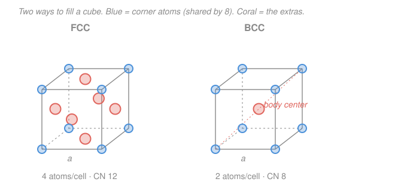

# Materials Science & Engineering · Lesson 1.2: Crystal structures & unit cells

> ⏱ ~15 min · Module 1: Structure & Bonding · Builds on: [1.1 Bonding & the energy well](01-01-bonding-energy-well.md) · Unlocks: [1.3 Directions & planes: Miller indices](01-03-miller-indices-directions-planes.md)

## Why this matters

In [1.1](01-01-bonding-energy-well.md) each pair of atoms settled into a bond-length energy well. Now let a trillion of them do it at once: they don't scatter randomly, they **stack into a repeating lattice**, and *how* they stack decides almost everything downstream. Whether iron is soft or hard, whether it's magnetic, whether it deforms gracefully or shatters — all trace back to which of a few stacking patterns its atoms chose, and how tightly those patterns pack. This lesson gives you the accounting tools: count the atoms in a repeat unit, measure how full space is, and — the payoff — **predict a metal's density from nothing but an atomic radius and an atomic mass.** That last calculation is Boss Problem 1, and you'll finish this lesson able to do half of it.

## The idea

A crystal is wallpaper in 3D: one small tile, copied edge-to-edge forever. Find the tile and you've captured the whole infinite pattern. That tile is the **unit cell** — the smallest box that, stamped repeatedly in all directions, rebuilds the crystal. For most metals the box is a cube.

Here's the one subtlety that trips everyone: an atom sitting on a *corner* of the cube isn't yours alone — it's shared with the seven other cubes meeting at that corner, so only **1/8** of it belongs to your cell. An atom on a *face* is split between two cells (1/2 each); an atom fully *inside* is all yours (1 whole). Counting atoms per cell is just this bookkeeping.

Three packings cover almost every metal:

- **BCC** (body-centered cubic): atoms on the 8 corners plus **one in the dead center**. Loose-ish. Iron (below 912 °C), chromium, tungsten.
- **FCC** (face-centered cubic): 8 corners plus **one on each of the 6 faces**. Tightly packed. Copper, aluminum, gold, nickel.
- **HCP** (hexagonal close-packed): a hexagonal prism, also tightly packed but stacked in a different rhythm than FCC. Zinc, magnesium, titanium.

FCC and HCP are the two ways to pack spheres as densely as physically possible — think oranges in a crate. BCC leaves a bit more air. That single difference in "air content" is why the same iron atoms make a softer metal in one arrangement and a harder one in another.

## The formal version

Define the players once, with units:

- $R$ = atomic radius (nm or cm), treating atoms as hard spheres that touch their nearest neighbors.
- $a$ = **lattice parameter**, the cube edge length (same units as $R$).
- $n$ = atoms per unit cell (pure count).
- **Coordination number** CN = how many nearest neighbors each atom touches.
- **APF** = atomic packing factor, the fraction of the cell's volume actually filled by atoms.

**Atoms per cell.** Apply the sharing rule ($\tfrac18$ corner, $\tfrac12$ face, $1$ interior):

$$n_{\text{BCC}} = 8\cdot\tfrac18 + 1 = 2, \qquad n_{\text{FCC}} = 8\cdot\tfrac18 + 6\cdot\tfrac12 = 4, \qquad n_{\text{HCP}} = 6.$$

*In words: the BCC cube holds 2 whole atoms, the FCC cube holds 4, the HCP prism holds 6.*

**Where atoms touch, and what that forces $a$ to be.** The spheres touch along the *most crowded line* through the cell, and setting that line's length to a multiple of $R$ pins $a$ to $R$:

- **FCC** — spheres touch along a **face diagonal**. A face diagonal spans corner–face-center–corner = $4R$, and geometrically it is $a\sqrt2$. So $a\sqrt2 = 4R$:
$$\boxed{a_{\text{FCC}} = 2R\sqrt2 = \frac{4R}{\sqrt2}.}$$
- **BCC** — spheres touch along the **body diagonal** (corner–center–corner), length $4R$, geometrically $a\sqrt3$. So:
$$\boxed{a_{\text{BCC}} = \frac{4R}{\sqrt3}.}$$
- **HCP** — the ideal ratio of prism height $c$ to base edge $a$ for touching spheres is
$$\frac{c}{a} = \sqrt{\tfrac83} \approx 1.633.$$

*In words: in FCC the atoms jam together across the face; in BCC only through the very center. The crowded direction sets the box size.*

**Coordination number.** FCC and HCP each give every atom **12** touching neighbors — the maximum possible for equal spheres. BCC gives **8**. More neighbors = denser packing.

**Atomic packing factor.** The definition is pure ratio:

$$\text{APF} = \frac{n \cdot V_{\text{atom}}}{V_{\text{cell}}} = \frac{n\cdot \tfrac43\pi R^3}{a^3}.$$

*In words: (number of atoms in the cell) × (volume of one sphere), divided by the cell's volume.* Plugging each structure's $n$ and $a(R)$ gives constants independent of the element:

$$\text{APF}_{\text{FCC}} = \text{APF}_{\text{HCP}} = 0.74, \qquad \text{APF}_{\text{BCC}} = 0.68.$$

So FCC/HCP metals are 74% atom, 26% void; BCC is 68% atom. (Example 1 derives the 0.74.)

**Theoretical density.** Mass of the cell divided by its volume. The cell holds $n$ atoms; one mole ($N_A = 6.022\times10^{23}$ atoms) has mass $A$ grams (the atomic mass, g/mol). So each atom has mass $A/N_A$, and

$$\boxed{\rho = \frac{n\,A}{V_c\,N_A}}, \qquad V_c = a^3 \ (\text{for cubic cells}).$$

*In words: pack $n$ atoms of known mass into a box of known volume and read off grams per cubic centimeter.* The only trap is units — $A$ is in g/mol, so $V_c$ **must** be in cm³ and $\rho$ comes out in g/cm³ (Example 2 handles the nm→cm conversion carefully).

## Picture

## Worked examples

**Example 1 (derive APF for FCC = 0.74).** Start from the two FCC facts: $n = 4$ and $a = 2R\sqrt2$. First the cell volume:

$$V_c = a^3 = (2R\sqrt2)^3 = 2^3\,(\sqrt2)^3\,R^3 = 8\cdot 2\sqrt2\;R^3 = 16\sqrt2\,R^3 \approx 22.63\,R^3.$$

Now the atom volume in the cell — 4 spheres:

$$n\,V_{\text{atom}} = 4\cdot\tfrac43\pi R^3 = \tfrac{16}{3}\pi R^3 \approx 16.76\,R^3.$$

Divide:

$$\text{APF} = \frac{\tfrac{16}{3}\pi R^3}{16\sqrt2\,R^3} = \frac{\pi}{3\sqrt2} = \frac{\pi}{3\sqrt2}\approx 0.7405.$$

The $R^3$ cancels — as it must, since packing efficiency is a property of the *arrangement*, not the atom size. Answer: **0.74.** (Run the identical steps with $n=2$, $a=4R/\sqrt3$ and you get $\pi\sqrt3/8 \approx 0.68$ for BCC — that's P2.)

**Example 2 (copper: find $a$ and the theoretical density — half of Boss Problem 1).** Copper is FCC with $R = 0.128$ nm and $A = 63.55$ g/mol.

*Step 1 — lattice parameter.* FCC uses $a = 2R\sqrt2$:

$$a = 2(0.128\ \mathrm{nm})\sqrt2 = 0.256 \times 1.41421\ \mathrm{nm} = 0.3620\ \mathrm{nm}.$$

This matches copper's measured $a \approx 0.3615$ nm (the tiny gap is rounding in $R$). Good sign we're on track.

*Step 2 — convert to cm before cubing.* This is where densities go wrong. $1\ \mathrm{nm} = 10^{-9}\ \mathrm{m} = 10^{-7}\ \mathrm{cm}$, so

$$a = 0.3620\ \mathrm{nm} = 0.3620\times 10^{-7}\ \mathrm{cm} = 3.620\times10^{-8}\ \mathrm{cm}.$$

*Step 3 — cell volume.*

$$V_c = a^3 = (3.620\times10^{-8}\ \mathrm{cm})^3 = 3.620^3 \times 10^{-24}\ \mathrm{cm^3} = 47.44\times10^{-24} = 4.744\times10^{-23}\ \mathrm{cm^3}.$$

*Step 4 — density.* With $n = 4$, $A = 63.55$ g/mol, $N_A = 6.022\times10^{23}$ /mol:

$$\rho = \frac{n\,A}{V_c\,N_A} = \frac{4 \times 63.55\ \mathrm{g/mol}}{(4.744\times10^{-23}\ \mathrm{cm^3})(6.022\times10^{23}\ \mathrm{/mol})} = \frac{254.2}{28.57}\ \mathrm{g/cm^3} = 8.89\ \mathrm{g/cm^3}.$$

*Check.* The handbook value for copper is 8.96 g/cm³ — within 1%, the discrepancy being real crystals' slight deviation from perfect hard-sphere touching. Units: the moles cancel (g/mol ÷ /mol × ... leaves g/cm³), and the $10^{-23}$ and $10^{23}$ nearly cancel, landing at an ordinary single-digit density. ✓ You've now done Boss Problem 1(a).

## Watch out

- **You might think a corner atom counts as one atom in the cell.** It counts as $\tfrac18$ — it's split among the 8 cubes sharing that corner. Miscounting $n$ is the single most common density error; it multiplies your answer by up to 4.
- **You might plug the lattice parameter into the density formula in nm.** Then $V_c$ is off by $(10^7)^3 = 10^{21}$ and your density is absurd. Convert $a$ to **cm first**, then cube — because $A$ is grams per mole, forcing cgs units throughout.
- **You might think "cubic" means the atoms fill the cube.** Even the tightest packing (FCC, 74%) leaves 26% empty space between spheres. That leftover room is exactly where interstitial atoms (carbon in iron, [2.1](02-01-point-defects-solid-solutions.md)) hide, and it's why one structure dissolves more carbon than another.

## One-liner

> A crystal is one unit cell copied forever; count its atoms with the 1/8–1/2–1 sharing rule, size the box from where spheres touch ($a=2R\sqrt2$ FCC, $4R/\sqrt3$ BCC), and $\rho = nA/(V_cN_A)$ turns geometry into grams per cc.

## Problems

**P1 (🟢)** Chromium is BCC with atomic radius $R = 0.125$ nm. Find its lattice parameter $a$ in nm.

**P2 (🟡)** Derive the atomic packing factor of BCC from scratch, using $n = 2$ and $a = 4R/\sqrt3$. Show it comes out to 0.68, and state in one sentence why it's lower than FCC's 0.74.

**P3 (🔴)** Iron at room temperature is BCC with $R = 0.124$ nm and atomic mass $A = 55.85$ g/mol. Compute its theoretical density in g/cm³, and compare to the measured value of 7.87 g/cm³.

Solutions

**P1** BCC uses the body-diagonal relation $a = 4R/\sqrt3$:

$$a = \frac{4(0.125\ \mathrm{nm})}{\sqrt3} = \frac{0.500}{1.73205}\ \mathrm{nm} = 0.2887\ \mathrm{nm}.$$

*Check.* Measured chromium $a \approx 0.2884$ nm ✓. Note $a > 2R = 0.250$ nm, as it must be — the cube edge is longer than one atomic diameter because in BCC the atoms only touch along the diagonal, not along the edge.

**P2** Cell volume from $a = 4R/\sqrt3$:

$$V_c = a^3 = \left(\frac{4R}{\sqrt3}\right)^3 = \frac{64R^3}{3\sqrt3} = \frac{64R^3}{5.196} \approx 12.32\,R^3.$$

Atom volume with $n = 2$:

$$n\,V_{\text{atom}} = 2\cdot\tfrac43\pi R^3 = \tfrac{8}{3}\pi R^3 \approx 8.378\,R^3.$$

Divide:

$$\text{APF} = \frac{\tfrac83\pi R^3}{\tfrac{64}{3\sqrt3}R^3} = \frac{8\pi}{3}\cdot\frac{3\sqrt3}{64} = \frac{8\pi\sqrt3}{64} = \frac{\pi\sqrt3}{8} \approx 0.680.$$

*Why lower than FCC:* BCC atoms have only 8 nearest neighbors (CN 8) versus FCC's 12, so each atom is less surrounded and the cell carries more void — 32% empty versus 26%.

**P3** Iron BCC, so first $a$, then convert, then $\rho$ with $n = 2$.

*Lattice parameter:* $a = 4R/\sqrt3 = 4(0.124)/1.73205 = 0.496/1.73205 = 0.2864\ \mathrm{nm}$.

*Convert:* $a = 0.2864\times10^{-7}\ \mathrm{cm} = 2.864\times10^{-8}\ \mathrm{cm}$.

*Cell volume:* $V_c = (2.864\times10^{-8})^3 = 2.864^3\times10^{-24} = 23.49\times10^{-24} = 2.349\times10^{-23}\ \mathrm{cm^3}$.

*Density:*

$$\rho = \frac{nA}{V_c N_A} = \frac{2\times 55.85}{(2.349\times10^{-23})(6.022\times10^{23})} = \frac{111.7}{14.15}\ \mathrm{g/cm^3} = 7.90\ \mathrm{g/cm^3}.$$

*Check.* Measured 7.87 g/cm³ — agreement to within 0.4%, confirming the hard-sphere model and, notably, showing that BCC iron (7.90) is *less* dense than FCC copper (8.89) partly because it packs looser (0.68 vs 0.74), not only because Fe is lighter than Cu. ✓

## Connections

- **Backward:** the bond-energy well of [1.1](01-01-bonding-energy-well.md) is what sets each atom's equilibrium spacing — its effective radius $R$ — and metallic bonding's *non-directional* character (electrons shared in a sea, no preferred bond angle) is precisely why metals maximize neighbors and pack into these dense, symmetric arrangements rather than open covalent networks.
- **Forward:** [1.3 Miller indices](01-03-miller-indices-directions-planes.md) uses this unit cell as a coordinate frame to name directions and planes — and the *planar density* of the FCC $(111)$ plane, which decides copper's slip behavior in Boss Problem 1(c), is measured right off the geometry you set up here. The 26% void also seeds [2.1 point defects](02-01-point-defects-solid-solutions.md).
- **Sideways:** the lattice parameter $a$ isn't just theoretical — it's what X-ray diffraction actually measures (Bragg's law reads spacings straight off a crystal), the experimental backbone of the [condensed-matter](../../condensed-matter/syllabus.md) course. Reverse Example 2 — measure $\rho$ and $a$, solve for $n$ — and you can even deduce which structure an unknown metal has.
