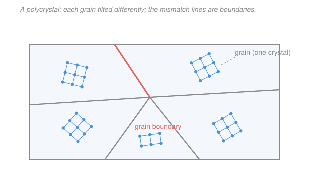

# Materials Science & Engineering · Lesson 1.4: Order, disorder & grains

> ⏱ ~15 min · Module 1: Structure & Bonding · Builds on: [1.2 Crystal structures & unit cells](01-02-crystal-structures-unit-cells.md), [1.3 Directions & planes: Miller indices](01-03-miller-indices-directions-planes.md) · Unlocks: Module 2 (defects, esp. [2.3 Interfaces & grain boundaries](02-03-interfaces-grain-boundaries.md)) and [4.3 Strengthening mechanisms](04-03-strengthening-mechanisms.md)

## Why this matters

Lessons 1.2 and 1.3 gave you a *perfect* crystal — one lattice, running forever, the same orientation everywhere. Almost nothing you can hold is like that. The steel in a wrench, the aluminum in a can, a copper wire: each is a mosaic of millions of tiny crystals, all the same lattice but pointing every which way. That mosaic structure is why a cast metal has the *same* stiffness no matter how you load it, why window glass has no crystals at all, and why a bar of iron silently rearranges its atoms at 912 °C on the way to being forged. This lesson is the bridge from "one perfect crystal" to "real material," and it sets up every defect in Module 2.

## The idea

Take the tidy lattice from 1.2 and imagine it froze not from one seed but from thousands, scattered through the melt at once. Each seed grows its own crystal outward until it bumps into its neighbors. Every crystal has the *same* atomic arrangement — but each started tilted differently, so where two of them meet, the rows don't line up. Each little crystal is a **grain**; the mismatched seam between two grains is a **grain boundary**. That's a **polycrystal**, and it's what most metals and ceramics are.

Three flavors of solid, by how far the order reaches:

- **Single crystal** — one grain, one orientation, all the way through (a silicon wafer, a turbine blade grown on purpose, a gemstone). Order runs the whole sample.
- **Polycrystalline** — many grains, many orientations, glued at boundaries. Order is perfect *inside* each grain but resets at every boundary.
- **Amorphous** — no repeating lattice at all, just a frozen liquid-like tangle (window glass, most plastics). Neighbors are still roughly spaced, but there's no long-range pattern.

The one-word summary of the difference: **long-range order**. A crystal has it; a glass doesn't. And orientation carries a consequence — a single crystal's properties depend on *which way* you push (the [1.3](01-03-miller-indices-directions-planes.md) planes and directions aren't equivalent), while a polycrystal averages all those orientations together and behaves the same in every direction.

## The formal version

**Long-range order.** A solid has long-range order if the position of an atom far away is *predictable* from the lattice — the [1.2](01-02-crystal-structures-unit-cells.md) unit cell tiles space indefinitely. *In words: you can stand on one atom and know exactly where an atom a thousand cells away sits.* Crystals (single or poly) have it; amorphous solids have only **short-range order** — a well-defined nearest-neighbor spacing set by bonding, but the pattern washes out after a few atoms.

**Grain and grain boundary.** A **grain** (or *crystallite*) is a region of single-crystal order; its lattice orientation is fixed but differs from its neighbors'. A **grain boundary** is the thin transition zone where two orientations meet — a couple of atoms wide, with atoms not sitting on either grain's lattice. (Its energy and structure are the whole story of [2.3](02-03-interfaces-grain-boundaries.md); here we just name it.) Grain *size* — typical grain diameter $d$ — is a knob that will control strength in [4.3](04-03-strengthening-mechanisms.md): smaller grains, more boundary, harder metal.

**Anisotropy vs. isotropy.** A property is **anisotropic** if it depends on direction, **isotropic** if it doesn't.

- A **single crystal is anisotropic**: because [1.3](01-03-miller-indices-directions-planes.md)'s directions $\langle uvw\rangle$ pack atoms differently, stiffness, conductivity, and growth rate all vary with direction. Example: in an FCC metal the Young's modulus $E$ is *largest* along $\langle 111\rangle$ (the close-packed body diagonal) and smallest along $\langle 100\rangle$.
- A **random polycrystal is isotropic**: with millions of grains pointing every way, any measurement averages over all orientations, so the direction dependence cancels. *In words: individual grains are picky about direction; a random pile of them is not.* (Deliberately aligned grains — a *texture* from rolling or drawing — brings the anisotropy partly back.)

**Amorphous solids.** No long-range order, so no unit cell, no grains, no boundaries — and no sharp melting point (they soften over a range, through a *glass transition*). They form when cooling is **too fast for atoms to find their lattice sites**: crystallizing means every atom shuffling into a periodic array, which takes time and atomic mobility. Quench a silica melt or a polymer fast enough and mobility dies before order forms — the liquid's disorder is frozen in. Easy glass-formers (silica, $\mathrm{SiO_2}$) have big, sluggish molecular units and tangled bonding; hard glass-formers (pure metals) need cooling rates of $10^6\ \mathrm{K/s}$.

**Polymorphism / allotropy.** One composition, more than one crystal structure, selected by temperature or pressure. (*Allotropy* is the same idea for a pure element; *polymorphism* is the general word.) The material switches structure at a **transformation temperature**, and because the two structures have different packing, the sample's **volume jumps** at the switch. The headline cases:

- **Iron.** BCC below 912 °C (called **ferrite**, $\alpha$-Fe) $\leftrightarrow$ FCC above 912 °C (**austenite**, $\gamma$-Fe). This transformation is the entire reason steel can be heat-treated — Module 3 lives on it.
- **Carbon.** Graphite (soft, layered, conducting) $\leftrightarrow$ diamond (hard, tetrahedral, insulating), same atoms, wildly different properties — diamond is the high-pressure form.

The volume change matters: heat plain iron through 912 °C and it *shrinks* (we'll see why in Example 2), a counterintuitive contraction-on-heating that stresses parts during forging and forward-references the transformation strains of [3.3](03-03-transformations-ttt-heat-treatment.md).

## Picture

Same lattice in every grain; only the *tilt* changes. The boundaries are where mismatched rows collide — the atoms there belong to neither grain's lattice.

## Worked examples

**Example 1 (single crystal vs. polycrystal — the modulus).** Take FCC copper. As a *single crystal*, its Young's modulus is direction-dependent: about $E_{\langle 111\rangle} \approx 192\ \mathrm{GPa}$ along the close-packed body diagonal but only $E_{\langle 100\rangle} \approx 67\ \mathrm{GPa}$ along a cube edge — nearly a factor of three, purely from orientation. Why $\langle 111\rangle$ stiffest? It's the close-packed direction (recall [1.3](01-03-miller-indices-directions-planes.md): highest linear density), so bonds along it are most directly loaded, and stiffness traces back to the [1.1](01-01-bonding-energy-well.md) bond curvature — steeper resistance to stretching a densely-bonded line.

Now make it *polycrystalline* with random grains. A measurement samples all orientations at once and returns a single averaged value, $E \approx 110\ \mathrm{GPa}$ for copper, the *same* whichever way you pull the bar. The anisotropy hasn't vanished grain-by-grain — it's been averaged away at the sample scale. Cast a component and you get this isotropic value for free; grow a single crystal (jet-engine blades) and you can *aim* the stiff direction along the load.

**Example 2 (iron BCC → FCC — the metal contracts on heating).** Heat pure iron through 912 °C: ferrite (BCC) becomes austenite (FCC). Which is denser? Use the atomic packing factors from [1.2](01-02-crystal-structures-unit-cells.md):

$$\mathrm{APF_{BCC}} = 0.68, \qquad \mathrm{APF_{FCC}} = 0.74.$$

APF is the fraction of space the atoms actually fill. FCC packs the *same* atoms into a tighter fraction of the volume, so at fixed number of atoms the FCC solid occupies **less** volume. Quantify it. For $N$ atoms each of volume $v_{\text{atom}}$, the solid's volume is

$$V = \frac{N\,v_{\text{atom}}}{\mathrm{APF}} \qquad(\text{atoms fill an APF fraction of }V).$$

The atoms themselves don't change size, so $N v_{\text{atom}}$ is the same before and after. The fractional volume change on BCC $\to$ FCC is therefore

$$\frac{V_{\text{FCC}}}{V_{\text{BCC}}} = \frac{1/\mathrm{APF_{FCC}}}{1/\mathrm{APF_{BCC}}} = \frac{\mathrm{APF_{BCC}}}{\mathrm{APF_{FCC}}} = \frac{0.68}{0.74} \approx 0.919.$$

So $\Delta V/V \approx 0.919 - 1 = -0.081$, about an **8 % contraction** — the metal *shrinks* as it gets hotter across 912 °C. (Ignoring the small thermal expansion within each phase, and the fact that the atomic radius shifts slightly between structures; the experimental jump is a few percent, same sign.) That's the counterintuitive part: heating usually swells a solid, but crossing an allotropic transformation to a *denser* structure overrides ordinary thermal expansion and pulls the volume down. Reverse it on cooling — austenite → ferrite *expands* — and you get the transformation stresses that crack a badly-quenched steel.

## Watch out

- **You might think grains are different materials or different phases.** They're not — in a pure metal every grain is the *same* substance with the *same* lattice; only the orientation differs. "Phase" (a distinct structure/composition, Module 3) and "grain" (an orientation domain) are different ideas; a single phase can be millions of grains.
- **You might think amorphous means "randomly packed like sand."** No — a glass still has tight short-range order (well-defined nearest-neighbor bonds and spacings from [1.1](01-01-bonding-energy-well.md)); what it lacks is the *long-range* periodicity. It's a frozen liquid, not a powder.
- **You might expect every solid to expand when heated.** Usually yes, but a polymorphic transformation to a denser structure (iron BCC→FCC) makes it *contract* at the transformation temperature — packing beats thermal expansion right there.
- **You might think a single crystal, being "perfect," is the strongest form.** For *stiffness* it can be aimed to advantage, but for *strength* it's often the opposite: grain boundaries block dislocations, so a fine-grained polycrystal is usually **harder** than a single crystal ([4.3](04-03-strengthening-mechanisms.md)).

## One-liner

> Real solids are mosaics of one lattice tilted many ways (grains) — or no lattice at all (glass); orientation makes a single crystal directional and a random polycrystal uniform, and the *same* atoms can re-stack into a denser structure and shrink on heating.

## Problems

**P1 (🟢)** Classify each and give a one-line reason: (a) a silicon wafer sliced from a boule pulled from the melt; (b) a cast aluminum engine block; (c) a pane of soda-lime window glass. For each, state whether its bulk properties are isotropic or anisotropic.

**P2 (🟡)** Titanium is allotropic: HCP ($\alpha$, APF $= 0.74$) below 882 °C, BCC ($\beta$, APF $= 0.68$) above. Using the packing-factor argument from Example 2 (atoms unchanged), does titanium *expand* or *contract* as it's heated through 882 °C, and by roughly what percent? Contrast the *sign* with iron's BCC→FCC change and explain in one sentence why they differ.

**P3 (🔴)** A random polycrystalline copper bar reads $E \approx 110$ GPa in every direction, yet each grain has $E$ ranging from 67 to 192 GPa depending on orientation. (a) Explain how a directionally-picky grain produces a direction-blind bar. (b) A sheet is heavily cold-rolled so most grains share a common orientation (a *texture*). Qualitatively, does the sheet's modulus become more or less direction-dependent, and why?

Solutions

**P1** (a) **Single crystal** — a Czochralski-pulled wafer is grown from one seed with one orientation throughout; its properties are **anisotropic** (that's why wafers are cut to a labeled crystal direction). (b) **Polycrystalline** — casting solidifies from many nuclei into many randomly-oriented grains; bulk properties are **isotropic** (the orientations average out). (c) **Amorphous** — window glass is a supercooled silica-based melt with no long-range order, hence no grains; it is **isotropic** (no lattice direction to prefer).

*Check.* The three answers span the three categories of the lesson, and isotropy tracks "no single preferred orientation": true for the random polycrystal and the glass, false for the single crystal. ✓

**P2** APF *drops* from 0.74 (HCP) to 0.68 (BCC) on heating, so the structure gets *looser* and the volume grows:

$$\frac{V_{\beta}}{V_{\alpha}} = \frac{\mathrm{APF}_{\alpha}}{\mathrm{APF}_{\beta}} = \frac{0.74}{0.68} \approx 1.088 \;\Longrightarrow\; \frac{\Delta V}{V} \approx +0.088,$$

about an **8–9 % expansion** on heating through 882 °C. This is the **opposite sign** to iron: iron goes to a *denser* structure on heating (BCC→FCC, 0.68→0.74) and contracts, while titanium goes to a *less dense* structure (HCP→BCC, 0.74→0.68) and expands. The sign is set by whether the high-temperature phase is more or less closely packed than the low-temperature phase.

*Check.* Same magnitude as iron (same two APF values, swapped), opposite sign — consistent, since the ratio is just inverted. Units: a pure ratio, dimensionless ✓.

**P3** (a) The bar is millions of grains at all orientations. Pull along any lab direction and that direction lands on a random crystal direction *within each grain*; across the whole sample you sample the full spread of grain moduli (67–192 GPa) and their aggregate response is a single averaged $E \approx 110$ GPa. Rotate the bar and you still sample the same random spread, so the reading doesn't change — direction-blindness is an *averaging* effect, not a property of any one grain. (b) Cold rolling aligns the grains toward a common orientation (texture), so the sample no longer averages over *all* directions — it now behaves more like a single crystal, and its modulus becomes **more direction-dependent** (anisotropic). The rolling and transverse directions can then differ measurably in stiffness.

*Check.* Random orientations → isotropy; aligned orientations → anisotropy. Texture destroys the averaging that produced isotropy, so anisotropy must increase. ✓

## Flashback

**From Lesson 1.3 (Miller indices):** For a cubic crystal, index the plane that intercepts the axes at $x = 1$, $y = \tfrac12$, $z = \infty$ (i.e. it cuts the $x$-axis at one lattice parameter, the $y$-axis at half a parameter, and never meets the $z$-axis). Give the Miller indices $(hkl)$.

Solution

Miller indices are the *reciprocals* of the axis intercepts, cleared to smallest integers. Intercepts (in units of the lattice parameter): $x = 1$, $y = \tfrac12$, $z = \infty$. Take reciprocals:

$$h = \frac{1}{1} = 1, \qquad k = \frac{1}{1/2} = 2, \qquad l = \frac{1}{\infty} = 0.$$

Already integers, no common factor to clear, so the plane is $(120)$.

*Check.* An intercept at infinity always gives a $0$ index (the plane is parallel to that axis — here parallel to $z$), and the *smaller* intercept ($y=\tfrac12$) yields the *larger* index ($k=2$), as reciprocals demand. ✓

## Connections

- **Backward:** grains are just the [1.2](01-02-crystal-structures-unit-cells.md) unit cell tiled over a finite region before a boundary interrupts it, and single-crystal anisotropy is the direction-dependence of the [1.3](01-03-miller-indices-directions-planes.md) planes and directions made physical. Stiffness-by-direction traces to the bond-energy curvature of [1.1](01-01-bonding-energy-well.md).
- **Forward:** grain boundaries get their full treatment in [2.3](02-03-interfaces-grain-boundaries.md), and grain *size* becomes a strength knob (Hall–Petch) in [4.3](04-03-strengthening-mechanisms.md). The iron BCC↔FCC transformation and its volume change are the engine of all of Module 3, especially [3.3](03-03-transformations-ttt-heat-treatment.md). The reason a fast quench freezes disorder previews the amorphous/martensite ideas there.
- **Sideways:** the amorphous-vs-crystalline split and the glass transition are a central theme in polymer and glass science, and the "fast cooling outruns ordering" logic is the same non-equilibrium freezing physics you meet in the supercooling and nucleation discussions of thermodynamics — see [thermodynamics-physics](../../thermodynamics-physics/syllabus.md). Directional-property engineering (aligned single crystals, textured sheet) is the applied face of the crystal anisotropy studied more deeply in [condensed-matter](../../condensed-matter/syllabus.md).
