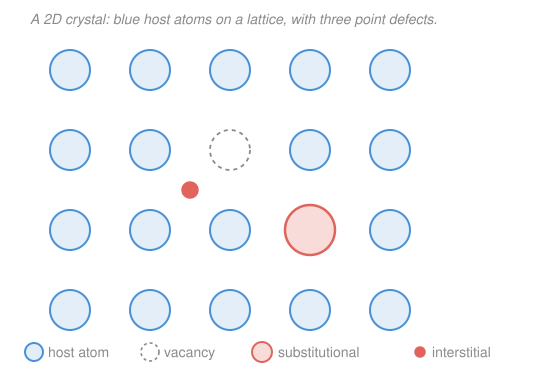

# Materials Science & Engineering · Lesson 2.1: Point defects & solid solutions

> ⏱ ~15 min · Module 2: Imperfections & Diffusion · Builds on: [1.2 Crystal structures & unit cells](01-02-crystal-structures-unit-cells.md), [1.4 Order, disorder & grains](01-04-order-disorder-grains.md) · Unlocks: [2.2 Dislocations](02-02-dislocations-plastic-flow.md), [2.4 Diffusion I](02-04-diffusion-i-ficks-first-law.md)

## Why this matters

A perfect crystal — every atom on its lattice site, forever — is inert and, frankly, useless. It wouldn't diffuse, wouldn't age, wouldn't alloy. Nearly everything an engineer *does* to a metal works through imperfections. This lesson is about the simplest ones: **point defects**, mistakes at a single atomic site. They are the seed of diffusion (atoms move by hopping into vacancies — [2.4](02-04-diffusion-i-ficks-first-law.md)) and one of the levers of strength (foreign atoms jam up sliding planes — [4.3](04-03-strengthening-mechanisms.md)). And here's the surprise the math will make precise: even a crystal at equilibrium *wants* some vacancies. Emptiness is thermodynamically favored.

## The idea

Two ways to spoil a single site. **Take an atom out** and you leave a hole — a **vacancy**. **Cram an extra atom into a gap** between the regular sites and you get a **self-interstitial**. Vacancies are cheap and common; self-interstitials cost a lot of energy (you're wedging an atom where there's no room) and are rare in metals at equilibrium.

Why would a crystal tolerate holes at all? Because temperature is restless. Making a vacancy costs energy, but it also creates *disorder* — and nature trades a little energy for a lot of disorder whenever it's warm enough. The result is a tug of war won by a **Boltzmann factor**: the fraction of empty sites climbs steeply with temperature. Near melting, roughly one site in ten thousand is vacant; cool down and vacancies become vanishingly rare.

Now bring in a *second* element. Dissolve zinc into copper (that's brass) and you have a **solid solution** — a crystal that's still one phase, but with foreign atoms mixed in. They fit one of two ways. If the newcomer is about the same size as the host, it **substitutes**, sitting on a normal lattice site (like swapping one marble for another in a rack). If it's much smaller, it **squeezes into the gaps** between host atoms — **interstitial**. Carbon in iron is the famous case, and it's the whole reason steel exists.

## The formal version

**Equilibrium vacancy concentration.** At temperature $T$ (in kelvin), the equilibrium fraction of lattice sites that are vacant is

$$\frac{N_v}{N} = \exp\!\left(-\frac{Q_v}{kT}\right),$$

where $N_v$ is the number of vacancies, $N$ the total number of lattice sites, $Q_v$ the **energy to form one vacancy** (units of energy per vacancy — eV here), and $k$ the **Boltzmann constant**, $k = 8.62\times10^{-5}\ \mathrm{eV/K}$. *In words: the odds a given site is empty are set by comparing the cost of a vacancy, $Q_v$, to the available thermal energy, $kT$.* If you quote $Q_v$ per **mole** (J/mol) instead of per vacancy, swap $k$ for the gas constant $R = 8.314\ \mathrm{J/(mol\,K)}$:

$$\frac{N_v}{N} = \exp\!\left(-\frac{Q_v}{RT}\right).$$

The quantity $\exp(-Q_v/kT)$ is the **Boltzmann factor**. Because $Q_v/kT$ sits in a *negative exponential*, small increases in $T$ shrink the exponent and blow up the fraction — this is what "thermally activated" means, and you'll meet the identical form in diffusion ([2.5](02-05-diffusion-ii-transient-arrhenius.md)) and reaction rates. Doubling $T$ doesn't double the vacancies; it can multiply them a thousandfold.

**Hume-Rothery rules (substitutional solubility).** A solute atom dissolves substitutionally in large amounts only if it resembles the host. The four rules of thumb:

1. **Size:** atomic radii within about $15\%$ of each other. Bigger mismatch strains the lattice too much.
2. **Crystal structure:** same structure (e.g. both FCC) favors full solubility.
3. **Valence:** similar valence; a metal more readily dissolves one of equal or lower valence.
4. **Electronegativity:** close electronegativities. If they differ a lot the two elements would rather form a compound than a solution.

*In words: like dissolves in like — the closer two metals are in size, structure, valence, and electronegativity, the more of one will dissolve in the other.* Copper and nickel obey all four and are soluble in *all* proportions.

**Interstitial solid solution.** When the solute is small enough to fit the interstitial voids of the host, it dissolves interstitially. The rule of thumb: the solute atom must be substantially smaller — roughly, an atomic radius less than about $0.6$ times the host's. Carbon ($r \approx 0.071\ \mathrm{nm}$) in iron ($r \approx 0.124\ \mathrm{nm}$) qualifies; nitrogen and hydrogen in metals too. Even then solubility is limited (the holes are small), which is exactly why carbon content in steel is measured in fractions of a percent.

## Picture

## Worked examples

**Example 1 (mechanical — the Boltzmann factor at work).** Estimate the equilibrium vacancy fraction in copper at $1000^\circ\mathrm{C}$, given a vacancy formation energy $Q_v \approx 0.9\ \mathrm{eV}$.

First convert temperature: $T = 1000 + 273 = 1273\ \mathrm{K}$. Then the thermal energy scale is

$$kT = (8.62\times10^{-5}\ \mathrm{eV/K})(1273\ \mathrm{K}) = 0.1097\ \mathrm{eV}.$$

The exponent is

$$\frac{Q_v}{kT} = \frac{0.9}{0.1097} = 8.20,$$

so

$$\frac{N_v}{N} = e^{-8.20} \approx 2.7\times10^{-4}.$$

About **one site in 3,700 is vacant** — tiny, yet enough to run diffusion. Notice how sensitive this is: at room temperature ($T = 293\ \mathrm{K}$), $kT = 0.0253\ \mathrm{eV}$, the exponent is $35.6$, and $N_v/N \approx e^{-35.6} \approx 3\times10^{-16}$ — twelve orders of magnitude fewer. That steepness *is* the Boltzmann factor.

**Example 2 (why you'd care — classify the solute).** Two alloys; predict whether each dissolves substitutionally or interstitially.

*Carbon in iron.* Compare radii: $r_C \approx 0.071\ \mathrm{nm}$ versus $r_{Fe} \approx 0.124\ \mathrm{nm}$. The size difference is

$$\frac{|0.071 - 0.124|}{0.124} = \frac{0.053}{0.124} \approx 43\%,$$

far beyond the $15\%$ substitutional limit — carbon can't credibly replace an iron atom. But it *is* small ($r_C/r_{Fe} \approx 0.57$), so it fits the interstitial holes. **Interstitial.** (This is the basis of steel: the trapped carbon is what makes iron hardenable.)

*Nickel in copper.* Radii $r_{Ni} \approx 0.125\ \mathrm{nm}$, $r_{Cu} \approx 0.128\ \mathrm{nm}$ — a mismatch of only $|0.125-0.128|/0.128 \approx 2.3\%$, comfortably under $15\%$. Both are **FCC** (rule 2 ✓), sit next to each other on the periodic table with similar valence and electronegativity (rules 3, 4 ✓). All four Hume-Rothery rules pass. **Substitutional** — and in fact Cu and Ni form a solid solution at *every* composition (the basis of cupronickel coins and monel).

## Watch out

- **You might think a perfect crystal is the lowest-energy state, so vacancies are just damage.** Actually the *free energy* — energy minus $T \times$ entropy — is lowered by having some vacancies, because each one adds configurational entropy. At any $T > 0$ the equilibrium number of vacancies is nonzero; a truly perfect crystal is only the ground state at absolute zero.
- **You might read $Q_v/kT$ and forget the units have to match.** If $Q_v$ is in eV, use $k = 8.62\times10^{-5}\ \mathrm{eV/K}$; if $Q_v$ is in J/mol, use $R = 8.314\ \mathrm{J/(mol\,K)}$. Mixing an eV energy with $R$ (or a per-mole energy with $k$) is the single most common error here. And $T$ is **always** absolute (kelvin) — never Celsius.
- **You might assume "small atom" always means interstitial.** Size is necessary but the host's interstitial holes must actually be big enough, and even then solubility is capped. A large solute that fails the $15\%$ rule doesn't fall back to interstitial either — it may just form a separate phase or compound instead (that's Module 3's story).

## One-liner

> Even at equilibrium a warm crystal keeps a Boltzmann-set fraction of empty sites, $N_v/N = e^{-Q_v/kT}$; foreign atoms join in by substituting (if similar in size — Hume-Rothery) or squeezing interstitially (if much smaller, like C in Fe).

## Problems

**P1 (🟢)** Aluminum has a vacancy formation energy $Q_v = 0.68\ \mathrm{eV}$. Compute the equilibrium vacancy fraction $N_v/N$ at $660^\circ\mathrm{C}$ (just below its melting point). Use $k = 8.62\times10^{-5}\ \mathrm{eV/K}$.

**P2 (🟡)** For a metal you measure $N_v/N = 1.0\times10^{-4}$ at $800\ \mathrm{K}$. What is the vacancy formation energy $Q_v$ (in eV)? *(Invert the formula.)*

**P3 (🔴)** Zinc ($r = 0.133\ \mathrm{nm}$, HCP, valence 2) and nickel ($r = 0.125\ \mathrm{nm}$, FCC, valence 2) are each candidate solutes in copper ($r = 0.128\ \mathrm{nm}$, FCC, valence... treat as 1–2). Using the Hume-Rothery rules, predict which one copper dissolves in *all* proportions and which has only limited substitutional solubility, and say which rule is the deciding factor.

Solutions

**P1** Convert: $T = 660 + 273 = 933\ \mathrm{K}$. Thermal scale:

$$kT = (8.62\times10^{-5})(933) = 0.0804\ \mathrm{eV}.$$

Exponent: $Q_v/kT = 0.68/0.0804 = 8.46$. So

$$\frac{N_v}{N} = e^{-8.46} \approx 2.1\times10^{-4}.$$

About one site in 4,700 is vacant.

*Check.* Dimensionless exponent (eV over eV) ✓, and the value is the right order of magnitude for a metal near melting ($\sim10^{-4}$), matching the copper result in Example 1. ✓

**P2** Invert $N_v/N = e^{-Q_v/kT}$. Take the natural log of both sides:

$$\ln\!\left(\frac{N_v}{N}\right) = -\frac{Q_v}{kT} \quad\Longrightarrow\quad Q_v = -kT\,\ln\!\left(\frac{N_v}{N}\right).$$

With $\ln(1.0\times10^{-4}) = -9.21$:

$$Q_v = -(8.62\times10^{-5})(800)(-9.21) = (0.0690)(9.21) \approx 0.64\ \mathrm{eV}.$$

*Check.* The minus signs cancel to give a positive energy ✓, and $\sim0.6$–$1\ \mathrm{eV}$ is the expected range for vacancy formation in metals ✓. Units: eV/K $\times$ K $\times$ (dimensionless log) $=$ eV ✓.

**P3** Apply the rules to each solute against copper:

- **Nickel:** size mismatch $|0.125-0.128|/0.128 = 2.3\%$ (well under $15\%$ ✓); same structure, both **FCC** ✓; valence 2, close to copper ✓; adjacent in the periodic table, similar electronegativity ✓. *All four rules pass* → soluble in **all proportions**.
- **Zinc:** size mismatch $|0.133-0.128|/0.128 = 3.9\%$ (under $15\%$ ✓), valence and electronegativity reasonable, **but** zinc is **HCP** while copper is **FCC** — the crystal-structure rule fails. So zinc has only **limited** substitutional solubility (real brass tops out around $35$–$40\%$ Zn before a new phase appears).

The **deciding factor is the crystal-structure rule (rule 2):** nickel matches copper's FCC and dissolves without limit; zinc's HCP structure caps its solubility despite a fine size match.

*Check.* This matches reality — Cu–Ni is a textbook complete solid solution, while Cu–Zn (brass) is a limited one that forms new phases at high zinc. ✓

## Flashback

**From Lesson 1.2 (Crystal structures & unit cells):** Aluminum is FCC with atomic radius $R = 0.143\ \mathrm{nm}$ and atomic mass $M = 26.98\ \mathrm{g/mol}$. Compute its lattice parameter $a$ and its theoretical density. *(Fresh variant — aluminum instead of the copper you did before.)*

Solution

For FCC the atoms touch along the face diagonal, giving $a = 2R\sqrt{2}$:

$$a = 2(0.143)(1.4142) = 0.4045\ \mathrm{nm} = 4.045\times10^{-8}\ \mathrm{cm}.$$

An FCC cell contains $n = 4$ atoms. Theoretical density is

$$\rho = \frac{nM}{a^3 N_A} = \frac{(4)(26.98)}{(4.045\times10^{-8})^3\,(6.022\times10^{23})}.$$

Cell volume: $a^3 = (4.045\times10^{-8})^3 = 6.62\times10^{-23}\ \mathrm{cm^3}$. Denominator: $(6.62\times10^{-23})(6.022\times10^{23}) = 39.9\ \mathrm{cm^3/mol}$. So

$$\rho = \frac{107.9}{39.9} \approx 2.71\ \mathrm{g/cm^3}.$$

*Check.* Units: $(\mathrm{g/mol})/[(\mathrm{cm^3})(\mathrm{1/mol})] = \mathrm{g/cm^3}$ ✓. The measured density of aluminum is $2.70\ \mathrm{g/cm^3}$ — spot on, confirming both the FCC geometry and the four-atom count. ✓

## Connections

- **Backward:** the vacancy and interstitial live on the crystal lattice you built in [1.2](01-02-crystal-structures-unit-cells.md) — interstitial solubility depends directly on the size of the voids in FCC/BCC packing, and "single-phase solid solution" refines the picture of order from [1.4](01-04-order-disorder-grains.md).
- **Forward:** vacancies are the vehicle of substitutional [diffusion — 2.4](02-04-diffusion-i-ficks-first-law.md), where the *same* Boltzmann/Arrhenius exponential reappears as $D = D_0 e^{-Q_d/RT}$; and solute atoms are one of the [strengthening mechanisms — 4.3](04-03-strengthening-mechanisms.md), because they pin the dislocations of [2.2](02-02-dislocations-plastic-flow.md).
- **Sideways:** the $e^{-Q/kT}$ Boltzmann factor is the same statistical-mechanics idea that governs thermally activated processes everywhere — reaction rates in chemistry, carrier populations across a semiconductor band gap ([5.1](05-01-electronic-properties-band-picture.md)), and thermal excitation in condensed-matter physics.
