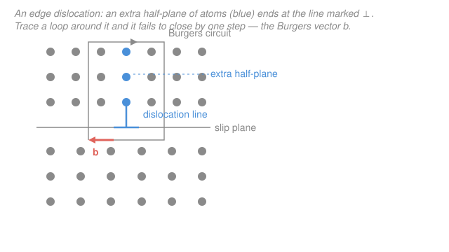

# Materials Science & Engineering · Lesson 2.2: Dislocations — the carriers of plastic flow

> ⏱ ~15 min · Module 2: Imperfections & Diffusion · Builds on: [2.1 Point defects & solid solutions](02-01-point-defects-solid-solutions.md), [1.3 Directions & planes: Miller indices](01-03-miller-indices-directions-planes.md) · Unlocks: [2.3 Interfaces & grain boundaries](02-03-interfaces-grain-boundaries.md), [4.2 Plastic deformation & Schmid's law](04-02-plastic-deformation-schmid.md), [4.3 Strengthening mechanisms](04-03-strengthening-mechanisms.md)

## Why this matters

Here is a number that should not be true. Take the bonds across one atomic plane of a metal and ask how much shear stress it takes to slide the whole plane rigidly over its neighbor — snapping every bond at once. The answer is about $G/2\pi$, roughly a *tenth of the shear modulus*: for copper that is billions of pascals, several gigapascals. Now go bend a copper wire with your hands. It yields at a few *mega*pascals — about a thousand times too easily.

A factor of 1000 is not a rounding error; it means the picture of "slip = break all the bonds together" is simply wrong. Real crystals cheat. They carry plastic deformation with a **line defect** — the **dislocation** — that lets slip happen one row of bonds at a time. Every time a metal bends, dents, draws into wire, or work-hardens, dislocations are the reason. This lesson is the mechanism behind all of Module 4.

## The idea

You want to shift a heavy rug one foot across the floor. Option A: grab the whole thing and drag — you fight the friction of the *entire* rug at once. Option B: kick a small ruck (a wrinkle) into one end and walk it across; at any instant only the little buckled strip is moving, so you fight almost nothing, yet when the ruck exits the far side the whole rug has advanced one foot.

A dislocation is that ruck, made of atoms. Instead of shearing a whole plane simultaneously, the crystal keeps a narrow strip of misregistry — a few atoms wide — and pushes *that* through the crystal. Only the handful of bonds at the moving front are ever strained at once, so the required stress collapses from "break everything" to "nudge the front along." When the dislocation exits the crystal, one full atomic step of slip has occurred across the entire plane. Deformation without ever paying the full bond-breaking bill.

There are two clean flavors. An **edge dislocation** is an *extra half-plane* of atoms jammed into the top of the crystal — its bottom edge is the defect line. A **screw dislocation** is a crystal sheared so the atomic planes spiral into a single helical ramp, like a multi-storey car park with no steps. Real dislocations are usually mixed, but these two limits carry all the intuition.

## The formal version

**The Burgers vector.** To make "one step of slip" precise, trace a loop atom-to-atom around the dislocation line — right, up, left, down, the same number of steps each way — a **Burgers circuit**. In a perfect crystal that loop closes. Around a dislocation it does *not*: it ends one lattice translation short. The vector that closes it,

$$\mathbf{b} \quad (\text{units: length, e.g. nm}),$$

is the **Burgers vector** — the magnitude and direction of the slip the dislocation carries. *In words: $\mathbf{b}$ is the "step size" of the defect — how far the crystal shifts when the dislocation passes.* It is a fixed property of the dislocation, the same everywhere along its length.

The two flavors differ in how $\mathbf b$ relates to the dislocation line direction $\boldsymbol{\xi}$:

- **Edge:** $\mathbf{b} \perp \boldsymbol{\xi}$ (slip is *across* the line — the extra half-plane pushes sideways).
- **Screw:** $\mathbf{b} \parallel \boldsymbol{\xi}$ (slip runs *along* the line — the helical ramp).

**Slip systems.** A dislocation does not glide just anywhere. It moves on a **slip plane** (the crystallographic plane containing both $\mathbf b$ and $\boldsymbol\xi$) in the **slip direction** $\mathbf b$. That pairing is a **slip system**. Slip prefers the *densest* planes and *closest-packed* directions, because there $\mathbf b$ is shortest and the atoms roll over the smoothest atomic "washboard." In FCC metals (copper, aluminum, nickel — see [1.2](01-02-crystal-structures-unit-cells.md)) the close-packed planes are $\{111\}$ and the close-packed directions are $\langle 110\rangle$, giving the FCC slip system

$$\{111\}\langle 110\rangle, \qquad \mathbf{b} = \frac{a}{2}\langle 110\rangle,$$

where $a$ is the lattice parameter (the cube-edge length, in nm; see [1.3](01-03-miller-indices-directions-planes.md) for this index notation). The magnitude follows from the length of a $\tfrac{a}{2}\langle 110\rangle$ vector:

$$|\mathbf{b}| = \frac{a}{2}\sqrt{1^2+1^2+0^2} = \frac{a}{\sqrt2}.$$

*In words: the shortest slip step in FCC runs corner-to-face-center — a full nearest-neighbor spacing $a/\sqrt2$, no shorter.* A shorter $\mathbf b$ is cheaper (see line energy below), which is exactly why nature picks the close-packed direction.

**Line tension.** A dislocation stores elastic energy in the strained bonds around its core, and that energy is proportional to its length — so it behaves like a stretched string with a **line tension**

$$T \approx \tfrac{1}{2}\,G\,|\mathbf{b}|^2 \quad (\text{units: J/m, i.e. N}),$$

with $G$ the **shear modulus** (Pa) — the material's resistance to shear. *In words: a dislocation costs energy per unit length, so it wants to stay short and straight, and the cost scales with $|\mathbf b|^2$ — another reason short Burgers vectors win.* This tension is why dislocations bow, tangle, and pin against each other; when they multiply and jam, the crystal gets harder to deform — **work hardening**, the subject of [4.3](04-03-strengthening-mechanisms.md).

## Picture

The blue column is the extra half-plane; its lower tip is the dislocation line (the $\perp$ symbol). The grey loop is a Burgers circuit — equal steps each way — and it fails to close by exactly one atomic spacing: that coral gap is $\mathbf b$, horizontal here because this is an edge dislocation ($\mathbf b \perp$ line).

## Worked examples

**Example 1 (mechanical — size of a slip step).** FCC copper has lattice parameter $a = 0.3615$ nm. Its slip system is $\{111\}\langle110\rangle$; take the dislocation $\mathbf{b} = \tfrac{a}{2}[\bar1 1 0]$. Find $|\mathbf b|$.

$$|\mathbf{b}| = \frac{a}{2}\sqrt{(-1)^2 + 1^2 + 0^2} = \frac{a}{2}\sqrt2 = \frac{a}{\sqrt2} = \frac{0.3615}{1.4142}\ \mathrm{nm} = 0.256\ \mathrm{nm}.$$

So each time this dislocation sweeps through, the crystal slips by 0.256 nm — one atomic diameter. (Sanity check: for FCC $a = 2\sqrt2\,R$, so $a/\sqrt2 = 2R$, twice the atomic radius $R = 0.128$ nm — exactly the nearest-neighbor distance, as it must be. ✓)

**Example 2 (why you'd care — the factor of 1000).** Where does the paradox in "Why this matters" resolve? Model the perfect-crystal slip with Frenkel's argument: to slide one plane rigidly over the next, the shear stress varies sinusoidally with displacement $x$,

$$\tau(x) = \frac{G\,b}{2\pi a}\,\sin\!\left(\frac{2\pi x}{b}\right),$$

where $a$ is the plane spacing and $b$ the slip distance. Its peak is the **theoretical shear strength**

$$\tau_{\text{th}} = \frac{G\,b}{2\pi a} \approx \frac{G}{2\pi}\quad(\text{taking } b \approx a).$$

For copper, $G \approx 48$ GPa, so $\tau_{\text{th}} \approx 48/(2\pi) \approx 7.6$ GPa. But a pure copper single crystal starts to slip at a **critical resolved shear stress** of order $1$ MPa. The ratio:

$$\frac{\tau_{\text{th}}}{\tau_{\text{real}}} \approx \frac{7.6\times10^{9}}{1\times10^{6}} \approx 8000.$$

Roughly *four orders of magnitude*. Rigid-plane slip is a fantasy; the crystal never pays it. A dislocation only has to strain the few bonds at its core to move one $\mathbf b$ (the tiny leftover barrier is the *Peierls stress*), so the stress to glide it is smaller by exactly this kind of factor. That is the whole reason metals are soft enough to forge.

## Watch out

- **You might think a dislocation is a "missing atom" or a point defect like a vacancy.** It is not — it is a *one-dimensional* line defect. A vacancy ([2.1](02-01-point-defects-solid-solutions.md)) is a single empty site; a dislocation is a line threading through the whole crystal, and its signature is the *closure failure* of a loop around it, not a hole.
- **You might think slip means the extra half-plane physically shoves through the crystal.** No atom travels far. As the dislocation advances one step, bonds break and *re-form* just behind the front — the half-plane you started with is not the half-plane at the next position. It is a wave of misregistry, not a projectile.
- **You might think edge and screw are different defects.** They are two ends of one continuum: the same dislocation line can be edge in one place, screw in another, and mixed in between — but its Burgers vector $\mathbf b$ is *the same everywhere along it*. What changes is the angle between $\mathbf b$ and the line, not $\mathbf b$ itself.

## One-liner

> A dislocation lets a crystal slip one atomic row at a time — carrying a fixed step $\mathbf b$ (magnitude $a/\sqrt2$ in FCC) — which is why real metals yield ~1000× below their theoretical bond-breaking strength.

## Problems

**P1 (🟢)** FCC aluminum has $a = 0.4050$ nm and slips on $\{111\}\langle110\rangle$ with $\mathbf b = \tfrac{a}{2}[110]$. (a) Compute $|\mathbf b|$. (b) State the full slip system and, for an edge segment, the angle between $\mathbf b$ and the dislocation line.

**P2 (🟡)** Aluminum has shear modulus $G = 26$ GPa. (a) Estimate its theoretical shear strength $\tau_{\text{th}} = G/2\pi$. (b) A real aluminum single crystal yields in shear at about $0.8$ MPa. By what factor does the real strength fall short of theory, and in one sentence, why?

**P3 (🔴)** Using $T \approx \tfrac12 G b^2$, estimate the line energy (energy per unit length) of a dislocation in copper ($G = 48$ GPa, $b = 0.256$ nm). Then express it as an energy *per Burgers-vector length of line* in eV, and comment on whether dislocations can be created by thermal fluctuation the way vacancies are.

Solutions

**P1** (a) $|\mathbf b| = \dfrac{a}{2}\sqrt{1^2+1^2+0^2} = \dfrac{a}{\sqrt2} = \dfrac{0.4050}{1.4142} = 0.286\ \mathrm{nm}.$

(b) The slip system is $\{111\}\langle110\rangle$: glide on a $\{111\}$ close-packed plane in a $\langle110\rangle$ close-packed direction. For an **edge** segment, $\mathbf b \perp \boldsymbol\xi$, i.e. the angle is $90^\circ$.

*Check.* $a/\sqrt2 = 2R$ gives $R = 0.143$ nm, the accepted atomic radius of Al. ✓

**P2** (a) $\tau_{\text{th}} = \dfrac{G}{2\pi} = \dfrac{26\ \mathrm{GPa}}{6.283} \approx 4.1\ \mathrm{GPa}.$

(b) Ratio $= \dfrac{4.1\times10^{9}}{0.8\times10^{6}} \approx 5000.$ The crystal never shears a whole plane at once; a dislocation glides by straining only the few bonds at its core, so slip begins about $5000\times$ below the rigid-plane estimate.

*Check.* Units: Pa/Pa is dimensionless ✓, and the ~$10^3$–$10^4$ shortfall matches the copper result in Example 2. ✓

**P3** Line energy per unit length:

$$T \approx \tfrac12 G b^2 = \tfrac12 (48\times10^{9}\ \mathrm{Pa})(0.256\times10^{-9}\ \mathrm{m})^2 = \tfrac12(48\times10^{9})(6.55\times10^{-20}) \approx 1.6\times10^{-9}\ \mathrm{J/m}.$$

(Units: $\mathrm{Pa}\cdot\mathrm{m^2} = (\mathrm{N/m^2})\,\mathrm{m^2} = \mathrm{N} = \mathrm{J/m}$ ✓.)

Energy contained in *one Burgers-vector length* of line:

$$E_b = T\cdot b \approx (1.6\times10^{-9}\ \mathrm{J/m})(0.256\times10^{-9}\ \mathrm{m}) \approx 4.1\times10^{-19}\ \mathrm{J} = \frac{4.1\times10^{-19}}{1.602\times10^{-19}}\ \mathrm{eV} \approx 2.6\ \mathrm{eV}.$$

But a *real* dislocation threads the entire crystal, so its total energy is this times millions of atomic spacings — enormous compared with the ~$1$ eV to make a single vacancy. So unlike vacancies ([2.1](02-01-point-defects-solid-solutions.md)), dislocations are **not** thermal equilibrium defects: thermal fluctuations cannot pop them into existence. They are grown in during solidification and, above all, *multiplied by deformation itself* — the seed of work hardening ([4.3](04-03-strengthening-mechanisms.md)).

*Check.* A few eV per atomic length of line is the textbook order of magnitude for dislocation core energy. ✓

## Flashback

**From Lesson 2.1 (Point defects & solid solutions):** A metal has a vacancy formation energy $Q_v = 0.90$ eV. Using the Boltzmann factor $n_v/N = \exp(-Q_v/kT)$ with $k = 8.62\times10^{-5}\ \mathrm{eV/K}$, find the equilibrium fraction of vacant sites at $1300$ K (near its melting point). Then find the fraction at $650$ K, and comment on the ratio.

Solution

At $1300$ K: $kT = (8.62\times10^{-5})(1300) = 0.1121\ \mathrm{eV}$, so

$$\frac{n_v}{N} = \exp\!\left(-\frac{0.90}{0.1121}\right) = \exp(-8.03) \approx 3.2\times10^{-4}.$$

About 3 vacant sites per 10,000 — typical for a metal near melting.

At $650$ K: $kT = 0.0560\ \mathrm{eV}$, so

$$\frac{n_v}{N} = \exp\!\left(-\frac{0.90}{0.0560}\right) = \exp(-16.07) \approx 1.05\times10^{-7}.$$

Ratio $\approx \dfrac{3.2\times10^{-4}}{1.05\times10^{-7}} \approx 3000$. *Halving the temperature drops the vacancy population ~3000-fold* — the hallmark exponential sensitivity of a thermally activated defect. (And notice the contrast with P3: vacancies are equilibrium defects that appear and vanish with temperature; dislocations are not.)

*Check.* Fractions are dimensionless and both $< 1$; the higher temperature gives more vacancies, as physical intuition demands. ✓

## Connections

- **Backward:** the Burgers vector is written in the Miller-index language of [1.3](01-03-miller-indices-directions-planes.md), and slip preferring $\{111\}\langle110\rangle$ is a direct payoff of the close-packing arithmetic there and in [1.2](01-02-crystal-structures-unit-cells.md) — densest planes, shortest $\mathbf b$. Contrast the dislocation (a line defect) with the point defects of [2.1](02-01-point-defects-solid-solutions.md).
- **Forward:** [2.3 Interfaces & grain boundaries](02-03-interfaces-grain-boundaries.md) shows that grain boundaries are themselves walls of dislocations, and that they block dislocation glide — the origin of grain-size strengthening. [4.2 Schmid's law](04-02-plastic-deformation-schmid.md) turns "which slip system activates" into the quantitative resolved shear stress, and [4.3 Strengthening mechanisms](04-03-strengthening-mechanisms.md) is entirely about making dislocations harder to move (work hardening, alloying, grain refinement).
- **Sideways:** the line-tension picture — a defect that stores energy per unit length and so wants to shorten — is the same mathematics as surface tension in a liquid film and tension in a stretched elastic string from the mechanics refresher; in each case a system minimizes energy by minimizing an interface's extent.
