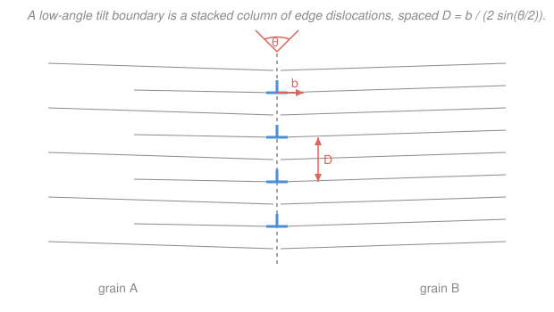

# Materials Science & Engineering · Lesson 2.3: Interfaces & grain boundaries

> ⏱ ~15 min · Module 2: Imperfections & Diffusion · Builds on: [2.2 Dislocations & plastic flow](02-02-dislocations-plastic-flow.md), [1.4 Order, disorder & grains](01-04-order-disorder-grains.md) · Unlocks: [4.3 Strengthening mechanisms](04-03-strengthening-mechanisms.md) (Hall–Petch)

## Why this matters

A real metal is not one crystal — it is a mosaic of tiny crystals (**grains**) glued together at **grain boundaries**, and almost everything you care about in engineering lives at those seams. Grain boundaries are what stop a dislocation dead, so they set a material's strength (that's the whole point of [4.3](04-03-strengthening-mechanisms.md)). They are also the express lanes for diffusion, the first places to corrode, and where impurities collect and quietly embrittle a part. If [2.1](02-01-point-defects-solid-solutions.md) was zero-dimensional defects (points) and [2.2](02-02-dislocations-plastic-flow.md) was one-dimensional (lines), this is the **two-dimensional** defect: the interface. Master it and you understand why a fine-grained steel is both stronger *and*, at high temperature, sometimes weaker.

## The idea

Every interface is a place where the perfect stacking of atoms is interrupted, and interruptions cost energy. Think of a brick wall: inside a wall the bricks are happy, each fully supported by its neighbors. At the **free surface** the outermost bricks have neighbors missing on one side — in a crystal those are unsatisfied **dangling bonds**, and paying for them is the **surface energy** $\gamma_s$ (energy per unit area). That is why liquids bead up and why small particles want to coarsen: nature is trying to hide surface.

A **grain boundary** is gentler than a free surface but the same idea. Two crystals meet at an angle; right at the seam the atoms can't sit in either crystal's ideal positions, so they're squeezed, stretched, and mis-bonded. That stored energy per area is the **grain-boundary energy** $\gamma_{gb}$ — smaller than $\gamma_s$ (the atoms still have neighbors, just imperfect ones), but real, and it drives grains to grow (fewer, bigger grains = less total boundary area = less energy).

The beautiful part: when the misorientation between the two grains is *small* — a few degrees — the boundary is nothing more than a **row of edge dislocations** stacked one above another. You already met the edge dislocation in [2.2](02-02-dislocations-plastic-flow.md) as an extra half-plane of atoms; take out one plane every so often along a seam and you have bent the lattice by a small angle. So a low-angle boundary literally *is* a wall of the line defects from the last lesson. Not all boundaries cost the same: a **twin boundary**, where the two grains are perfect mirror images, is so well-matched that its energy is tiny.

## The formal version

**Surface energy.** Creating a unit area of free surface costs

$$\gamma_s \quad \left(\mathrm{J/m^2}\right),$$

the energy of the dangling bonds left behind. *In words: it is the price, per square meter, of the missing neighbors at a surface.* Densely packed planes (fewer broken bonds per area) have the lowest $\gamma_s$, which is why crystals prefer to expose their close-packed faces.

**Grain-boundary energy.** A grain boundary stores $\gamma_{gb}\ (\mathrm{J/m^2})$, typically a third to a half of $\gamma_s$ for the same material. A boundary's energy depends on how badly the two grains are misaligned, described by the **misorientation angle** $\theta$ (the angle you'd have to rotate one grain to line it up with the other).

**Low-angle boundary = a dislocation wall (Read–Shockley).** For a **tilt boundary** — grains rotated about an axis lying *in* the boundary plane — the seam is a vertical array of edge dislocations, each carrying the same Burgers vector $\mathbf b$ (magnitude $b$, the atomic-plane offset from [2.2](02-02-dislocations-plastic-flow.md)). Geometry fixes their vertical spacing $D$:

$$D = \frac{b}{2\sin(\theta/2)} \;\approx\; \frac{b}{\theta} \quad (\theta \text{ small, in radians}).$$

*In words: to bend the lattice by a bigger angle you must pack the extra half-planes closer together.* The boundary's energy follows the **Read–Shockley** relation,

$$\gamma_{gb}(\theta) = \gamma_0\,\theta\left(A - \ln\theta\right),$$

with material constants $\gamma_0$ and $A$. *In words: energy climbs steeply as you add the first few degrees of misorientation, then bends over and saturates.* Once $\theta$ exceeds roughly $10$–$15^\circ$ the dislocations are so close their cores overlap and the "array of dislocations" picture dies — you have a **high-angle boundary**, whose energy is roughly flat (nearly independent of $\theta$). (A **twist boundary**, rotated about an axis *perpendicular* to the boundary, is instead a crossed grid of screw dislocations — same spirit, different weave.)

**Special low-energy boundaries.** A **twin boundary** is a mirror plane: atoms on one side are the reflection of atoms on the other, so bonding across it is nearly perfect and $\gamma_{gb}$ is very low (an order of magnitude below a general high-angle boundary). A **stacking fault** is a related planar defect — a single slip in the stacking sequence of close-packed layers (for FCC, an ...ABCABC... order briefly reads ...ABCACB...), costing a small **stacking-fault energy** but leaving the lattice otherwise intact.

## Picture

The two grains (A and B) are misoriented by a small angle $\theta$. Each blue tee is one edge dislocation — an extra half-plane of atoms wedged in from the left — and stacking them a distance $D$ apart bends the lattice by exactly $\theta$. Squeeze them closer (smaller $D$) and $\theta$ grows.

## Worked examples

**Example 1 (mechanical — dislocation spacing in a tilt boundary).** A low-angle tilt boundary has misorientation $\theta = 2^\circ$ in a crystal with Burgers-vector magnitude $b = 0.25\ \mathrm{nm}$. How far apart are the edge dislocations?

First convert to radians: $\theta = 2^\circ \times \dfrac{\pi}{180} = 0.0349\ \mathrm{rad}$. Then

$$D = \frac{b}{2\sin(\theta/2)} = \frac{0.25\ \mathrm{nm}}{2\sin(1^\circ)} = \frac{0.25}{2(0.01745)} = 7.16\ \mathrm{nm}.$$

The small-angle shortcut $D \approx b/\theta = 0.25/0.0349 = 7.2\ \mathrm{nm}$ agrees to within a percent. So the extra half-planes sit about $7\ \mathrm{nm}$ apart — roughly every 30 atomic planes. Push $\theta$ to $10^\circ$ and $D$ drops to about $1.4\ \mathrm{nm}$, only ~6 planes apart: the cores are now crowding each other, which is exactly why the tidy dislocation-wall model stops working at high angles.

**Example 2 (why you'd care — fine grains, two-faced).** Why do smaller grains make a metal *stronger*? A moving dislocation is the carrier of plastic flow ([2.2](02-02-dislocations-plastic-flow.md)); when it reaches a grain boundary it cannot simply glide across, because the slip planes on the far side point in a different direction. So dislocations **pile up** against the boundary like cars at a barrier. That pile-up takes ever more stress to keep feeding, so yielding is harder — and a material with *more* boundaries per unit volume (smaller grains) has more barriers, hence higher strength. Halve the grain size and you raise the yield strength; quantifying that "smaller-is-stronger" trade is precisely the **Hall–Petch** law of [4.3](04-03-strengthening-mechanisms.md).

But the same boundary that blocks dislocations at room temperature becomes a **liability when it's hot**. Grain boundaries are loosely packed, so atoms diffuse along them far faster than through the crystal interior — they are fast-diffusion highways. At high temperature that lets grains slide past one another and lets voids grow along boundaries, so a *fine*-grained part actually **creeps faster** (this is why turbine blades are grown as single crystals — see [4.4](04-04-failure-fracture-fatigue-creep.md)). Boundaries are also where impurity atoms **segregate** and where **corrosion** bites first, because the disordered seam is chemically reactive. (In a reactor, radiation drives this segregation deliberately hard — the field calls it radiation-induced segregation, and it is a central worry for the alloys that line a core.) Same defect, hero at low temperature and villain at high.

## Watch out

- **You might think a grain boundary is a crack or a gap.** It isn't — the atoms are still densely bonded across it, just imperfectly positioned. A boundary has *energy* ($\gamma_{gb}$), not empty space; a crack is what happens when a boundary fails.
- **You might think more misorientation always means more energy.** Only up to a point. Read–Shockley rises fast at first but *saturates* past ~$15^\circ$; beyond that a high-angle boundary's energy is nearly flat, and special boundaries (twins) can actually be far *lower* than a random low-angle one.
- **You might think finer grains are simply "better."** They raise strength but also multiply the boundary area that speeds diffusion, creep, and corrosion. "Stronger" at room temperature can mean "weaker" in a jet engine — grain size is a design trade, not a free win.

## One-liner

> A grain boundary is stored energy per area ($\gamma_{gb}$); at small misorientation it's literally a wall of edge dislocations spaced $D \approx b/\theta$, and it both blocks slip (strength) and speeds diffusion (creep, corrosion).

## Problems

**P1 (🟢)** A low-angle tilt boundary in aluminum has $\theta = 0.5^\circ$ and Burgers-vector magnitude $b = 0.286\ \mathrm{nm}$. Using the small-angle formula, find the spacing $D$ of the edge dislocations.

**P2 (🟡)** Two low-angle tilt boundaries in the same material have misorientations $\theta_1 = 1^\circ$ and $\theta_2 = 4^\circ$. (a) By what factor does the dislocation spacing $D$ differ between them? (b) Rank $\gamma_{gb}$ for a $2^\circ$ boundary, an $8^\circ$ boundary, and a coherent twin boundary, and explain the ranking in one sentence each.

**P3 (🔴)** A component must survive at high temperature under load without creeping, *and* it must be strong at room temperature. Fine grains help one goal and hurt the other. Explain the conflict in terms of grain boundaries, and name the microstructural choice engineers make for the hottest turbine parts.

Solutions

**P1** Convert: $\theta = 0.5^\circ \times \pi/180 = 8.73\times10^{-3}\ \mathrm{rad}$. Then

$$D \approx \frac{b}{\theta} = \frac{0.286\ \mathrm{nm}}{8.73\times10^{-3}} = 32.8\ \mathrm{nm}.$$

*Check.* Units: nm / (dimensionless radian) = nm ✓. Smaller angle than Example 1's $2^\circ$, so the dislocations are farther apart (32.8 nm vs 7.2 nm) — consistent with $D \propto 1/\theta$. ✓

**P2** (a) Since $D \approx b/\theta$ with the same $b$, the spacing scales as $1/\theta$:

$$\frac{D_1}{D_2} = \frac{\theta_2}{\theta_1} = \frac{4^\circ}{1^\circ} = 4.$$

The $1^\circ$ boundary's dislocations are $4\times$ farther apart than the $4^\circ$ boundary's.

(b) Ranking $\gamma_{gb}$: **twin $<$ $2^\circ$ $<$ $8^\circ$.** The coherent twin is a near-perfect mirror, so almost no bonds are strained — lowest energy. Between the two tilt boundaries, Read–Shockley $\gamma_{gb}(\theta)$ increases with $\theta$ over the low-angle range, so $8^\circ$ stores more energy than $2^\circ$. (Both are still below a random high-angle boundary near saturation.)

*Check.* Consistent with the physics: energy tracks how badly atoms are misfit, and a mirror-symmetric seam is barely misfit at all. ✓

**P3** Fine grains mean *more* grain-boundary area per volume. At **room temperature** that is good: each boundary blocks dislocation glide, dislocations pile up, and yield strength rises (Hall–Petch). At **high temperature** it is bad: boundaries are fast-diffusion paths and sliding surfaces, so more boundary area means *faster* creep — grains slide and voids grow along the seams. The two goals pull opposite ways because the same feature (boundary area) that is a barrier to slip is a highway for diffusion. For the hottest turbine blades engineers therefore eliminate boundaries entirely by growing the blade as a **single crystal** (no grain boundaries to creep along), trading away the room-temperature Hall–Petch benefit they don't need there.

*Check.* The logic is self-consistent: if boundaries both strengthen (block slip) and weaken (speed creep), then removing them must cost strength but buy creep resistance — exactly the single-crystal trade. ✓

## Flashback

**From Lesson 2.2 (Dislocations & plastic flow):** In an FCC crystal a full dislocation glides on a $\{111\}$ plane with Burgers vector $\mathbf b = \tfrac{a}{2}\langle 110\rangle$, where $a$ is the lattice parameter. For aluminum, $a = 0.405\ \mathrm{nm}$. Find the magnitude $b$ of the Burgers vector, and say what physical distance it represents.

Solution

The magnitude of $\tfrac{a}{2}\langle 110\rangle$ is $\tfrac{a}{2}$ times the length of the direction vector $[110]$:

$$b = \frac{a}{2}\sqrt{1^2 + 1^2 + 0^2} = \frac{a}{2}\sqrt{2} = \frac{a}{\sqrt 2} = \frac{0.405}{\sqrt 2} = 0.286\ \mathrm{nm}.$$

*Physical meaning.* In FCC the atoms touch along the face diagonal $\langle 110\rangle$, so the nearest-neighbor spacing is $a/\sqrt2$. The Burgers vector is exactly that nearest-neighbor distance — a full slip step moves the crystal above the plane over by one atomic position, restoring a perfect lattice. (This is the same $b = 0.286\ \mathrm{nm}$ used in P1's tilt boundary.)

*Check.* Units: nm ✓. And $b = 0.286\ \mathrm{nm} < a = 0.405\ \mathrm{nm}$, as it must be — the shortest lattice-restoring step is a face-diagonal half, not a full cell edge. ✓

## Connections

- **Backward:** a low-angle boundary is built from the very edge dislocations of [2.2](02-02-dislocations-plastic-flow.md) — the extra-half-plane picture, stacked — and it partitions the polycrystalline solids introduced in [1.4](01-04-order-disorder-grains.md) into grains with quantifiable seams.
- **Forward:** the pile-up of dislocations at boundaries is the mechanism behind the **Hall–Petch** law in [4.3 Strengthening mechanisms](04-03-strengthening-mechanisms.md); the fast-diffusion and sliding role of boundaries reappears as a creep mechanism in [4.4 Failure: fracture, fatigue & creep](04-04-failure-fracture-fatigue-creep.md); and the fast-path idea underlies the diffusion coefficients of [2.4](02-04-diffusion-i-ficks-first-law.md).
- **Sideways:** in nuclear materials, grain boundaries are where irradiation drives solute atoms to pile up (radiation-induced segregation) and where stress-corrosion cracking initiates — the interface you meet here as a strengthener becomes, under a neutron flux, the weakest link a reactor engineer designs around.
