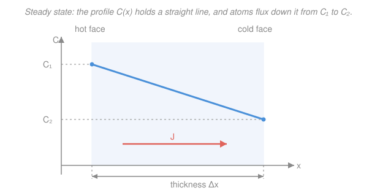

# Materials Science & Engineering · Lesson 2.4: Diffusion I — mechanisms & Fick's first law

> ⏱ ~15 min · Module 2: Imperfections & Diffusion · Builds on: [2.1 Point defects & solid solutions](02-01-point-defects-solid-solutions.md) (vacancies enable diffusion) · Unlocks: [2.5 Diffusion II: transient flux & Arrhenius](02-05-diffusion-ii-transient-arrhenius.md), Module 3 (phase transformations are diffusion-driven)

## Why this matters

Almost everything a material *becomes* — case-hardened gears, doped silicon, the pearlite in a steel, the slow creep of a turbine blade — happens because atoms move through a solid. They do move, even though a crystal looks locked solid: given a defect to jump into and enough thermal jostling, an atom hops from site to site. This lesson answers the first quantitative question: *at steady state, how fast does stuff move through a barrier?* That's Fick's first law — the diffusion twin of Ohm's law and Fourier's law of heat conduction, and the foundation for every carburizing, doping, and phase-transformation calculation to come.

## The idea

Perfume released in one corner of a still room ends up everywhere. No wind pushed it — it just wandered. Each molecule takes a random walk, but because there are *more* of them where the bottle was, more random steps happen to carry molecules *away* from the crowd than back into it. The net result is a steady drift from crowded to empty. That is diffusion: **no net force, just statistics** — a concentration difference plus random thermal motion produces a directed flow, from high concentration to low.

In a solid the random walk is harder, so it needs two things at once:

- **A place to jump into.** Atoms can't move through a full crystal; they need a defect. **Vacancy diffusion**: a substitutional atom (one sitting on a lattice site) swaps with an empty neighboring site — so the atom drifts one way while vacancies drift the other. **Interstitial diffusion**: a small atom (carbon, hydrogen, nitrogen) that lives in the *gaps* between lattice atoms hops to a neighboring gap. The gaps are almost all empty and no host atom has to move out of the way, so interstitial diffusion is **much faster** than vacancy diffusion.
- **Thermal energy.** Every hop means squeezing past neighbors — an energy barrier. Heat supplies the kicks that occasionally clear it. Hotter solid, more successful hops, faster diffusion. (Exactly *how much* faster is the Arrhenius law of [2.5](02-05-diffusion-ii-transient-arrhenius.md).)

This lesson takes the simplest case: **steady state**, where the concentration at every point has stopped changing in time. The profile is frozen; only the atoms keep flowing through it at a constant rate — like water through a full pipe. That steady flow is what Fick's first law computes.

## The formal version

Define the **diffusion flux** $J$: the net amount of diffusing species crossing a unit area per unit time, in $\mathrm{kg\,m^{-2}\,s^{-1}}$ (or $\mathrm{atoms\,m^{-2}\,s^{-1}}$). Let $C(x)$ be the **concentration** of that species (mass or atoms per unit volume, e.g. $\mathrm{kg/m^3}$) as a function of position $x$ (m).

**Fick's first law.**

$$\boxed{\,J = -D\,\frac{dC}{dx}\,}$$

*In words: atoms flow down the concentration gradient, at a rate proportional to how steep that gradient is.* Here $\dfrac{dC}{dx}$ is the **concentration gradient** — how sharply concentration changes with position ($\mathrm{kg\,m^{-4}}$) — and $D$ is the **diffusion coefficient** (or diffusivity), a material-and-temperature property with units $\mathrm{m^2/s}$. The **minus sign** encodes "downhill": where $C$ decreases as $x$ increases ($dC/dx < 0$), the flux $J$ is positive (points toward $+x$, toward the low side). Flux always runs from high concentration to low.

**Steady state and the linear profile.** *Steady state* means $C$ at each point is constant in time, so the flux $J$ is the same at every position (whatever flows in must flow out — no pile-up). With $D$ constant, $J = -D\,dC/dx$ constant forces $dC/dx$ constant: the concentration profile through the barrier is a **straight line**. For a thin plate (membrane) of thickness $\Delta x$ with faces held at concentrations $C_1$ and $C_2$,

$$J = -D\,\frac{C_2 - C_1}{\Delta x} = D\,\frac{C_1 - C_2}{\Delta x}.$$

*In words: at steady state through a flat plate, the flux is just $D$ times the concentration drop divided by the thickness.* The bracket $\dfrac{C_1 - C_2}{\Delta x}$ (mass/volume per length) is the slope of that straight line.

**A note on geometry.** The straight-line profile is special to a *flat* plate. For radial diffusion out through a **cylindrical shell** (inner radius $r_1$, outer $r_2$, length $L$), the same steady-state bookkeeping — total rate $\dot M = J\cdot A$ constant, but now the area $A = 2\pi r L$ grows with $r$ — gives a **logarithmic** profile and

$$\dot M = \frac{2\pi L D\,(C_1 - C_2)}{\ln(r_2/r_1)}\qquad(\text{cylindrical shell}).$$

*In words: same law, but because the area a species crosses grows outward, concentration falls off like $\ln r$, not linearly.* This is the identical form as steady heat flow or current through a pipe wall — swap $D$ for thermal or electrical conductivity.

## Picture

## Worked examples

**Example 1 (mechanical — steady-state flux through a plate).** Carbon diffuses through a $2\ \mathrm{mm}$ iron sheet. The hot face is held at $C_1 = 1.2\ \mathrm{kg/m^3}$ carbon, the cold face at $C_2 = 0.8\ \mathrm{kg/m^3}$; the diffusion coefficient is $D = 3\times10^{-11}\ \mathrm{m^2/s}$. Find the steady-state flux.

The gradient (with $\Delta x = 2\ \mathrm{mm} = 2\times10^{-3}\ \mathrm{m}$):

$$\frac{dC}{dx} = \frac{C_2 - C_1}{\Delta x} = \frac{0.8 - 1.2}{2\times10^{-3}} = \frac{-0.4}{2\times10^{-3}} = -200\ \mathrm{kg\,m^{-4}}.$$

Then

$$J = -D\,\frac{dC}{dx} = -\bigl(3\times10^{-11}\bigr)\bigl(-200\bigr) = 6\times10^{-9}\ \mathrm{kg\,m^{-2}\,s^{-1}}.$$

*Check.* Units: $\mathrm{m^2/s}\times\mathrm{kg\,m^{-4}} = \mathrm{kg\,m^{-2}\,s^{-1}}$ ✓. Sign: the two minus signs cancel, so $J>0$ — carbon flows from the hot (rich) face toward the cold (lean) face, as it must. ✓

**Example 2 (why you'd care — which species wins the race).** In iron, carbon (C) diffuses interstitially while nickel (Ni) diffuses substitutionally. Which is faster, and why does it matter?

**Carbon wins, by orders of magnitude.** Carbon is a small atom sitting in the interstitial gaps of the iron lattice. To move, it just hops to an adjacent gap — and nearly all neighboring gaps are empty, so a jump site is *always available*, and no iron atom has to vacate. Nickel, by contrast, occupies a regular lattice site; to move it must wait for a **vacancy** to appear on an adjacent site (rare — see [2.1](02-01-point-defects-solid-solutions.md), where the vacancy fraction is a small Boltzmann factor) and then squeeze past its neighbors. So substitutional diffusion pays *two* energy costs — forming the vacancy *and* making the jump — while interstitial diffusion pays only the jump. The result: at a given temperature $D_{\mathrm{C}} \gg D_{\mathrm{Ni}}$, typically by a factor of $10^{4}$–$10^{6}$.

*Why it matters:* this is exactly why steel is **carburized** (surface-hardened with carbon) at practical temperatures and times — carbon moves fast enough to build a hardened case in hours, whereas re-distributing the substitutional alloying elements would take geologic time.

## Watch out

- **You might think the minus sign means the flux is "negative."** It isn't a sign on the answer — it's what makes diffusion go *downhill*. When $C$ falls with increasing $x$, $dC/dx$ is negative, and the minus flips it to a positive $J$ pointing toward low concentration. Drop the sign and you'd predict atoms spontaneously climbing the gradient.
- **You might treat the straight-line profile as a law of nature.** It's a *consequence of steady state through a flat plate with constant $D$* — nothing more. Before steady state (the transient regime of [2.5](02-05-diffusion-ii-transient-arrhenius.md)) the profile is a curved, time-evolving front; in a cylindrical or spherical shell even the steady profile bends (logarithmic, not linear).
- **You might confuse flux $J$ with concentration $C$.** $C$ is *how much is there* (kg/m³); $J$ is *how fast it crosses* (kg·m⁻²·s⁻¹). A region can be rich in a species yet have zero flux — if the concentration is flat, $dC/dx = 0$ and nothing nets across, no matter how high $C$ is.

## One-liner

> At steady state, atoms trickle down a concentration gradient at a rate $J = -D\,dC/dx$ — and small interstitials, which never need to wait for a vacancy, trickle far faster than substitutionals.

## Problems

**P1 (🟢)** A sheet of iron $1.5\ \mathrm{mm}$ thick holds hydrogen at $C_1 = 0.30\ \mathrm{kg/m^3}$ on the high-pressure face and $C_2 = 0.10\ \mathrm{kg/m^3}$ on the far face. With $D = 1.0\times10^{-8}\ \mathrm{m^2/s}$, find the steady-state flux $J$.

**P2 (🟡)** Two flat plates are made of the same alloy at the same temperature (so identical $D$) and are held with the same two face concentrations. Plate B is **twice as thick** as plate A. What is the ratio $J_B/J_A$ of their steady-state fluxes? Explain in one sentence.

**P3 (🔴)** Nitrogen diffuses through a $3\ \mathrm{mm}$ steel plate. To *double* the steady-state flux without changing the temperature (so $D$ is fixed) or the plate thickness, by how much must you raise the concentration difference $C_1 - C_2$ across the plate? If instead you may only change thickness (fixed $\Delta C$), what thickness achieves the doubling?

Solutions

**P1** With $\Delta x = 1.5\times10^{-3}\ \mathrm{m}$:

$$J = D\,\frac{C_1 - C_2}{\Delta x} = \bigl(1.0\times10^{-8}\bigr)\frac{0.30 - 0.10}{1.5\times10^{-3}} = \bigl(1.0\times10^{-8}\bigr)\bigl(133.3\bigr) \approx 1.3\times10^{-6}\ \mathrm{kg\,m^{-2}\,s^{-1}}.$$

*Check.* Units: $\mathrm{m^2/s}\cdot(\mathrm{kg\,m^{-3}}/\mathrm{m}) = \mathrm{kg\,m^{-2}\,s^{-1}}$ ✓. It's larger than Example 1's carbon flux, consistent with hydrogen's much bigger $D$ and steeper gradient. ✓

**P2** Fick's law gives $J = D\,(C_1 - C_2)/\Delta x$. Everything is identical except $\Delta x_B = 2\,\Delta x_A$, and $J \propto 1/\Delta x$, so

$$\frac{J_B}{J_A} = \frac{\Delta x_A}{\Delta x_B} = \frac{1}{2}.$$

The thicker plate spreads the *same* concentration drop over twice the distance, halving the gradient — and thus the flux. (Same reason a thicker wall leaks heat more slowly.)

**P3** Fick's law $J = D\,(C_1 - C_2)/\Delta x$ is linear in the concentration difference $\Delta C = C_1 - C_2$ and inversely linear in $\Delta x$.

*Via concentration:* to double $J$ at fixed $D$ and $\Delta x$, double $\Delta C$ — raise the concentration difference by a **factor of 2** (a 100% increase).

*Via thickness:* to double $J$ at fixed $D$ and $\Delta C$, since $J \propto 1/\Delta x$, you need $\Delta x' = \Delta x/2 = 1.5\ \mathrm{mm}$ — halve the plate to $1.5\ \mathrm{mm}$.

*Check.* Both routes scale the slope $\Delta C/\Delta x$ by 2, which is exactly what doubling the flux at fixed $D$ requires. ✓

## Flashback

**From Lesson 2.1 (Point defects & solid solutions):** Aluminum has a vacancy formation energy $Q_v = 0.75\ \mathrm{eV}$. Using the equilibrium vacancy fraction $\dfrac{N_v}{N} = \exp\!\left(-\dfrac{Q_v}{kT}\right)$ with Boltzmann's constant $k = 8.62\times10^{-5}\ \mathrm{eV/K}$, estimate the fraction of lattice sites that are vacant at $900\ \mathrm{K}$. (This tiny fraction is exactly why *substitutional* diffusion is so slow — an atom can only move when one of these rare vacancies lands next door.)

Solution

Compute the exponent first:

$$\frac{Q_v}{kT} = \frac{0.75}{(8.62\times10^{-5})(900)} = \frac{0.75}{0.07758} \approx 9.67.$$

Then

$$\frac{N_v}{N} = e^{-9.67} \approx 6.3\times10^{-5}.$$

*Check.* That's about 63 vacancies per million sites — small, but not vanishing, and it climbs steeply with $T$ (the exponent shrinks as $T$ rises). Units: $Q_v$ in eV over $kT$ in eV is dimensionless ✓, as an exponent must be. This scarcity is the "wait for a vacancy" cost that makes $D_{\mathrm{Ni}} \ll D_{\mathrm{C}}$ in Example 2. ✓

## Connections

- **Backward:** diffusion runs on the defects of [2.1](02-01-point-defects-solid-solutions.md) — vacancies for substitutional atoms, interstitial sites for small ones. No defects, no diffusion; the equilibrium vacancy fraction directly throttles substitutional $D$.
- **Forward:** [2.5](02-05-diffusion-ii-transient-arrhenius.md) drops the steady-state assumption (Fick's *second* law, the transient carburizing profile) and gives $D$'s temperature law, $D = D_0 e^{-Q_d/RT}$. All of Module 3 — [phase diagrams](03-01-phase-diagrams-lever-rule.md), [eutectic microstructures](03-02-eutectics-microstructure.md), and [TTT/heat treatment](03-03-transformations-ttt-heat-treatment.md) — depends on atoms diffusing to new phases, which is why cooling *rate* changes the outcome.
- **Sideways:** $J = -D\,dC/dx$ is the same mathematics as Fourier's law of heat conduction ($q = -k\,dT/dx$) and Ohm's law in field form ($J = \sigma\,dV/dx$ shape) — a flux driven down a gradient by a transport coefficient. The cylindrical-shell version is literally the heat-through-a-pipe-wall problem you'd meet in transport phenomena.
