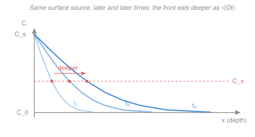

# Materials Science & Engineering · Lesson 2.5: Diffusion II — transient flux and the Arrhenius law

> ⏱ ~15 min · Module 2: Imperfections & transport · Builds on: [2.4 Fick's first law](02-04-diffusion-i-ficks-first-law.md) · Unlocks: [3.1 Phase diagrams and the lever rule](03-01-phase-diagrams-lever-rule.md); radiation-enhanced diffusion in nuclear materials

## Why this matters

Fick's first law tells you the flux *once a concentration profile is fixed* — but the profiles that make engineering materials are almost never fixed. You harden a gear by soaking it in a carbon atmosphere so carbon soaks *inward*, steepest at the surface and fading with depth, the whole profile marching deeper by the hour. That's **transient diffusion**: concentration changing in time *and* space. This lesson gives you the equation that governs it (Fick's second law), the one solution you'll use constantly (the error-function profile for a surface source), and the single fact that makes diffusion an engineering knob you can turn — its ferocious dependence on temperature, the **Arrhenius law**. Together they answer: *how hot, and for how long?*

## The idea

Picture the concentration profile as a landscape of hills and valleys. Fick's first law says atoms flow downhill — down the concentration gradient. But where do they *pile up*? An atom leaves a spot on its downhill side and another arrives from its uphill side; the spot only changes if more arrive than leave. That imbalance is exactly the **curvature** of the profile. Where the profile bulges upward (a peak, concave down), more leaves than arrives and concentration drops; where it dips (a valley, concave up), atoms accumulate and it rises. Diffusion is nature relentlessly ironing curvature out of a profile until it's flat or straight.

The second big idea is why temperature matters so much. To move, an atom must jump into a neighboring site, and to get there it has to shove past its neighbors — it needs a burst of thermal energy above some threshold. The fraction of atoms lucky enough to have that energy at any instant is the **Boltzmann factor** $e^{-Q/RT}$, and it's brutally sensitive to $T$: a modest rise in temperature multiplies the number of successful jumps, because you're pushing atoms over an exponential cliff. This is why a treatment that takes hours at one temperature can take minutes a hundred degrees hotter.

## The formal version

**Fick's second law.** In one dimension, with $C$ the concentration (say mass of solute per unit volume, or wt%), $x$ position (m), $t$ time (s), and $D$ the diffusion coefficient (m²/s):

$$\frac{\partial C}{\partial t} = D\,\frac{\partial^2 C}{\partial x^2}.$$

*In words: the concentration at a point rises or falls at a rate set by the curvature of the profile there* — positive curvature (a valley) fills in, negative curvature (a peak) drains. It's a bookkeeping statement — atoms are conserved — dressed as a partial differential equation.

**The semi-infinite-solid solution.** Suppose a solid initially holds a uniform concentration $C_0$ everywhere, and at $t=0$ we clamp its surface ($x=0$) to a fixed concentration $C_s$ and hold it there (a carburizing furnace does this). For a solid deep enough that the far side never notices ("semi-infinite"), the profile at depth $x$ and time $t$ is

$$\frac{C_x - C_0}{C_s - C_0} = 1 - \operatorname{erf}\!\left(\frac{x}{2\sqrt{Dt}}\right),$$

where $C_x$ is the concentration at depth $x$ at time $t$, and $\operatorname{erf}$ is the **error function** — an S-shaped curve running from $\operatorname{erf}(0)=0$ up toward $\operatorname{erf}(\infty)=1$, tabulated below. *In words: how far the surface value has "reached" a given depth depends only on the dimensionless combination $x/2\sqrt{Dt}$.* Everything about the shape is carried by that one grouping: double the depth and you need four times the time to keep it the same, because $x$ competes with $\sqrt{Dt}$.

A short table (linear interpolation is fine between entries):

| $z$ | 0.35 | 0.40 | 0.45 | 0.50 | 0.55 | 0.60 |
|---|---|---|---|---|---|---|
| $\operatorname{erf}(z)$ | 0.379 | 0.428 | 0.475 | 0.520 | 0.563 | 0.604 |

**The Arrhenius law.** The diffusion coefficient itself depends on temperature as

$$D = D_0\,\exp\!\left(-\frac{Q_d}{RT}\right),$$

with $D_0$ the temperature-independent **pre-exponential** (m²/s), $Q_d$ the **activation energy** for diffusion (J/mol) — the energy hill an atom must clear to jump — $R = 8.314\ \mathrm{J/(mol\,K)}$ the gas constant, and $T$ the **absolute** temperature (K). *In words: only the exponentially small fraction of atoms carrying more than $Q_d$ of thermal energy manage to jump, and that fraction climbs steeply with $T$.* Taking logs, $\ln D = \ln D_0 - \frac{Q_d}{R}\frac{1}{T}$: plot $\ln D$ against $1/T$ and you get a **straight line** of slope $-Q_d/R$ — the standard way to extract $Q_d$ from data.

**Temperature rescaling.** Two treatments produce the *same* concentration profile whenever the grouping $x/2\sqrt{Dt}$ matches at every depth — i.e. whenever the product $Dt$ is the same. So for a fixed target profile,

$$D_1 t_1 = D_2 t_2 \qquad\Longrightarrow\qquad \frac{t_2}{t_1} = \frac{D_1}{D_2}.$$

*In words: raise the temperature and $D$ jumps, so you need proportionally less time to reach the identical result.*

## Picture

Each blue curve is a snapshot of $C(x)$ at a later time. The surface stays pinned at $C_s$; the interior climbs from $C_0$ as the front penetrates. Follow the coral target line $C_x$: the depth at which the material first reaches your spec (the **case depth**) slides steadily rightward, tracking $\sqrt{Dt}$.

## Worked examples

**Example 1 (carburizing — the full erf inversion).** You carburize a low-carbon steel gear (carbon diffusing in BCC iron: $D_0 = 6.2\times10^{-7}\ \mathrm{m^2/s}$, $Q_d = 80\ \mathrm{kJ/mol}$). Initial carbon $C_0 = 0.20$ wt%, furnace surface value $C_s = 1.2$ wt%.

**(a) The diffusion coefficient at 900 °C** ($T = 1173$ K):

$$\frac{Q_d}{RT} = \frac{80{,}000}{8.314 \times 1173} = \frac{80{,}000}{9752} = 8.203,$$
$$D = 6.2\times10^{-7}\,e^{-8.203} = 6.2\times10^{-7}\,(2.74\times10^{-4}) = 1.70\times10^{-10}\ \mathrm{m^2/s}.$$

**(b) Time to reach 0.60 wt% at depth $x = 0.5\ \mathrm{mm} = 5.0\times10^{-4}\ \mathrm{m}$.** First the left side, which is just a ratio of concentrations:

$$\frac{C_x - C_0}{C_s - C_0} = \frac{0.60 - 0.20}{1.2 - 0.20} = \frac{0.40}{1.00} = 0.40.$$

So $1 - \operatorname{erf}(z) = 0.40$, i.e. $\operatorname{erf}(z) = 0.60$, where $z = x/2\sqrt{Dt}$. Invert with the table: $0.60$ sits between $\operatorname{erf}(0.55)=0.563$ and $\operatorname{erf}(0.60)=0.604$. Interpolating,

$$z = 0.55 + \frac{0.600 - 0.563}{0.604 - 0.563}\,(0.05) = 0.55 + (0.90)(0.05) = 0.595.$$

Now solve $z = x/2\sqrt{Dt}$ for $t$. Rearranging, $\sqrt{Dt} = x/(2z)$, so

$$Dt = \left(\frac{x}{2z}\right)^2 = \left(\frac{5.0\times10^{-4}}{2 \times 0.595}\right)^2 = (4.20\times10^{-4})^2 = 1.76\times10^{-7}\ \mathrm{m^2}.$$
$$t = \frac{1.76\times10^{-7}}{D} = \frac{1.76\times10^{-7}}{1.70\times10^{-10}} \approx 1.04\times10^{3}\ \mathrm{s} \approx 17\ \text{min}.$$

**(c) The same job at 1000 °C** ($T = 1273$ K). Use the rescaling $t_2/t_1 = D_1/D_2$, and note the ratio needs no separate $D$ computations:

$$\frac{t_2}{t_1} = \frac{D_1}{D_2} = \exp\!\left[-\frac{Q_d}{R}\left(\frac{1}{T_1} - \frac{1}{T_2}\right)\right] = \exp\!\left[-\frac{80{,}000}{8.314}\left(\frac{1}{1173} - \frac{1}{1273}\right)\right].$$

The inner difference is $8.525\times10^{-4} - 7.856\times10^{-4} = 6.70\times10^{-5}\ \mathrm{K^{-1}}$, and $80{,}000/8.314 = 9622$, so the bracket is $-9622 \times 6.70\times10^{-5} = -0.644$ and

$$\frac{t_2}{t_1} = e^{-0.644} = 0.53.$$

A 100 °C bump nearly **halves** the required time — from ~17 min to ~9 min — because $D$ jumped by the reciprocal factor ($1/0.53 \approx 1.9\times$). That single lever is why furnaces run hot.

**Example 2 (units and a sanity check).** Is the erf argument even allowed to sit inside a function? It must be dimensionless. Check: $Dt$ has units $\mathrm{(m^2/s)(s) = m^2}$, so $\sqrt{Dt}$ is a **length** — the natural "diffusion length" of the problem. Then

$$\frac{x}{2\sqrt{Dt}} = \frac{\mathrm{m}}{\mathrm{m}} = \text{dimensionless} \ \checkmark$$

as any function argument must be. This also hands you a back-of-envelope rule with no error function at all: the front penetrates a distance of order $\sqrt{Dt}$. Using Example 1's $D = 1.70\times10^{-10}\ \mathrm{m^2/s}$ and $t \approx 1040$ s, $\sqrt{Dt} = \sqrt{1.77\times10^{-7}} \approx 4.2\times10^{-4}\ \mathrm{m} = 0.42$ mm — the same 0.5 mm ballpark as the exact case depth, as it should be. And the scaling $x \sim \sqrt{Dt}$ says doubling the case depth costs **four times** the soak, a fact you can quote before touching a calculator.

## Watch out

- **You might think Fick's second law says atoms flow toward low concentration.** That's the *first* law (flux follows the gradient). The second law is about *accumulation* — it responds to **curvature** ($\partial^2 C/\partial x^2$), not slope. A perfectly straight (constant-gradient) profile has zero curvature, so nothing changes in time even though atoms are steadily flowing through: that's the steady state of Lesson 2.4.
- **You might plug Celsius into the Arrhenius exponent.** $T$ must be **absolute** (kelvin). Using 900 instead of 1173 doesn't just shift the answer — it changes $D$ by orders of magnitude, because $T$ sits in a sensitive exponential.
- **You might expect doubling the time to double the depth.** It doesn't. Depth grows as $\sqrt{Dt}$, so to double the case depth you need $4\times$ the time. Diffusion gives sharply diminishing returns the deeper you push.

## One-liner

> Curvature drives the profile ($\partial C/\partial t = D\,\partial^2 C/\partial x^2$), a surface source spreads it as $1-\operatorname{erf}(x/2\sqrt{Dt})$, and temperature controls the clock through $D = D_0 e^{-Q_d/RT}$ — hotter by a little, faster by a lot.

## Problems

**P1 (🟢)** For the carburizing steel of Example 1 ($D_0 = 6.2\times10^{-7}\ \mathrm{m^2/s}$, $Q_d = 80\ \mathrm{kJ/mol}$), compute the diffusion coefficient $D$ at 850 °C ($T = 1123$ K).

**P2 (🟡)** A carburizing treatment at 900 °C reaches 0.60 wt% carbon at a depth of 0.5 mm in about 1040 s (Example 1b). Holding the *same* temperature and *same* surface and initial concentrations, how long must you soak to reach 0.60 wt% at **1.0 mm** instead? Do it without re-inverting the error function.

**P3 (🔴)** A diffusion coefficient is measured as $D_1 = 1.70\times10^{-10}\ \mathrm{m^2/s}$ at 1173 K and $D_2 = 3.23\times10^{-10}\ \mathrm{m^2/s}$ at 1273 K. Extract the activation energy $Q_d$ (in kJ/mol). *(This is how $Q_d$ is measured in the lab — from the slope of $\ln D$ vs $1/T$.)*

Solutions

**P1** Absolute temperature $T = 1123$ K:

$$\frac{Q_d}{RT} = \frac{80{,}000}{8.314 \times 1123} = \frac{80{,}000}{9337} = 8.569,$$
$$D = 6.2\times10^{-7}\,e^{-8.569} = 6.2\times10^{-7}\,(1.90\times10^{-4}) = 1.18\times10^{-10}\ \mathrm{m^2/s}.$$

*Check.* Lower than the $1.70\times10^{-10}$ at 900 °C, as it must be — cooler means slower. Units: $\mathrm{(m^2/s)}\times(\text{dimensionless}) = \mathrm{m^2/s}$ ✓.

**P2** The target concentration ratio is unchanged, so the erf argument $z = x/2\sqrt{Dt}$ takes the **same value** at the new depth. Same temperature means the **same** $D$. Therefore $x/\sqrt{t}$ is fixed, i.e. $t \propto x^2$:

$$\frac{t_2}{t_1} = \left(\frac{x_2}{x_1}\right)^2 = \left(\frac{1.0}{0.5}\right)^2 = 4 \quad\Longrightarrow\quad t_2 = 4 \times 1040 \approx 4160\ \mathrm{s} \approx 69\ \text{min}.$$

*Check.* Doubling depth quadruples time — the $\sqrt{Dt}$ scaling from the "Watch out" list. ✓

**P3** Take the ratio to kill $D_0$:

$$\frac{D_2}{D_1} = \exp\!\left[-\frac{Q_d}{R}\left(\frac{1}{T_2} - \frac{1}{T_1}\right)\right] \;\Longrightarrow\; \ln\frac{D_2}{D_1} = \frac{Q_d}{R}\left(\frac{1}{T_1} - \frac{1}{T_2}\right).$$

Numbers: $\ln(3.23/1.70) = \ln(1.900) = 0.6419$, and $\frac{1}{1173} - \frac{1}{1273} = 6.70\times10^{-5}\ \mathrm{K^{-1}}$. So

$$Q_d = R\,\frac{\ln(D_2/D_1)}{1/T_1 - 1/T_2} = 8.314 \times \frac{0.6419}{6.70\times10^{-5}} = 8.314 \times 9581 \approx 7.97\times10^{4}\ \mathrm{J/mol} \approx 80\ \mathrm{kJ/mol}.$$

*Check.* Recovers the $Q_d$ that generated Example 1's numbers, and the units work: $\mathrm{J/(mol\,K)} \times \mathrm{K} = \mathrm{J/mol}$ ✓.

## Flashback

**From Lesson 2.4 (Fick's first law):** A steel sheet 2.0 mm thick separates a high-carbon gas from a low-carbon one. At steady state the carbon concentration is held at $1.0\ \mathrm{kg/m^3}$ on the high face and $0.20\ \mathrm{kg/m^3}$ on the low face; the diffusion coefficient is $D = 3.0\times10^{-11}\ \mathrm{m^2/s}$. Find the steady-state diffusion flux $J$ through the sheet.

Solution

Steady state means the profile is straight (zero curvature — nothing changing in time), so the gradient is just the concentration drop over the thickness. Fick's first law:

$$J = -D\,\frac{\Delta C}{\Delta x} = -\left(3.0\times10^{-11}\right)\frac{0.20 - 1.0}{2.0\times10^{-3}} = -\left(3.0\times10^{-11}\right)\left(-400\right) = 1.2\times10^{-8}\ \mathrm{kg/(m^2\,s)}.$$

*Check.* The flux is positive — carbon flows from the high face toward the low face, downhill in concentration, as it must. Units: $\mathrm{(m^2/s)}\times\mathrm{(kg/m^3)}/\mathrm{m} = \mathrm{kg/(m^2\,s)}$ ✓. This is the *first*-law world of a fixed profile; the moment you unclamp it and let concentration evolve, you're back in this lesson's second law.

## Connections

- **Backward:** this generalizes [2.4 Fick's first law](02-04-diffusion-i-ficks-first-law.md). The first law gives the flux for a *frozen* profile; combine it with conservation of atoms (flux in minus flux out) and you get the second law's $\partial C/\partial t = D\,\partial^2 C/\partial x^2$. Steady state (2.4) is simply the special case $\partial C/\partial t = 0$, i.e. zero curvature.
- **Forward:** [3.1 Phase diagrams and the lever rule](03-01-phase-diagrams-lever-rule.md) and the heat-treatment lessons after it rely on diffusion to *move* the microstructure — the atoms that redistribute when an alloy crosses a phase boundary get there by exactly this transient process, and whether a transformation completes is a race between the clock and $D_0 e^{-Q_d/RT}$.
- **Sideways:** the Arrhenius exponential $e^{-Q_d/RT}$ is the same Boltzmann factor that governs chemical reaction rates and vacancy concentrations — any process gated by atoms clearing an energy barrier wears this form. In nuclear materials the story gets an extra twist: irradiation slams in far more vacancies and interstitials than heat alone would supply, so diffusion runs faster than Arrhenius predicts — **radiation-enhanced diffusion**, which you'll meet when studying how reactor components age.
