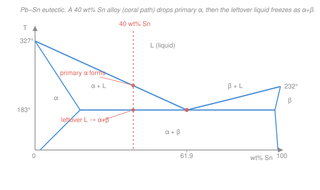

# Materials Science & Engineering · Lesson 3.2: Eutectics & microstructure development

> ⏱ ~15 min · Module 3: Phase diagrams & transformations · Builds on: [3.1 Phase diagrams & the lever rule](03-01-phase-diagrams-lever-rule.md) · Unlocks: 3.3 (the Fe–C eutectoid & heat treatment)

## Why this matters

Solder, cast bronze, dental amalgam, and the aluminium in an engine block are all **eutectic-based** — alloys engineered around the one composition that melts at the *lowest* temperature. That low melting point is why 60/40 tin–lead solder flows at a soldering-iron's touch, and it comes bundled with a bonus: on freezing, a eutectic self-assembles into a fine, alternating two-phase pattern that is stronger than either phase alone. Lesson [3.1](03-01-phase-diagrams-lever-rule.md) taught you to read a two-phase field with the lever rule. This lesson uses that same tool to predict the **microstructure** — not just *which* phases you get, but how much of each, and in what arrangement. Arrangement is what sets the mechanical properties.

## The idea

Two metals that don't much like dissolving in each other (limited solid solubility, from [2.1](02-01-point-defects-solid-solutions.md)) face a dilemma when they freeze. Neither pure solid wants to swallow the other's atoms. So the liquid does something clever: it splits into **two** solids at once, phase-separating on the spot. The special composition where the liquid can go straight to two solids — skipping any mushy solid-plus-liquid range — is the **eutectic** (Greek for "easily melted"). It freezes at a single temperature, like a pure metal, and at the *lowest* temperature anywhere on the diagram.

Now cool an alloy that is *off* to one side of that magic composition — say Pb-rich. As it crosses into the two-phase L+α field, it first grows blocky crystals of the Pb-rich solid, **α**. Call these **primary** (or proeutectic) α: they form early, one phase at a time, and grow fat. As α crystals rain out, the *leftover liquid* gets richer in Sn, sliding down the liquidus until it hits the eutectic composition exactly. That last bit of liquid then does the eutectic trick all at once — freezing into a fine, striped **α+β** microconstituent.

Here's the subtle part: you now have α of **two different origins**. Big primary α grains that formed first, and thin α lamellae woven into the eutectic stripes. Chemically identical — same phase, same composition — but they look and behave differently. Reading that story off the diagram is the whole game.

## The formal version

**The eutectic reaction.** At the eutectic temperature $T_E$ and composition $C_E$, on cooling,

$$L \;\xrightarrow{\text{cooling},\,T_E}\; \alpha + \beta,$$

where $L$ is liquid, and $\alpha$, $\beta$ are the two solid solutions (Pb-rich and Sn-rich respectively). *In words: at one fixed temperature, a single liquid freezes into two solids simultaneously.* For Pb–Sn, $T_E = 183\,^\circ\mathrm{C}$ and $C_E = 61.9$ wt% Sn. Three phases coexist at that point — by the Gibbs phase rule a two-component system pins them to a single temperature, which is why the eutectic freezes flat, like a pure substance.

**Composition landmarks (Pb–Sn, all in wt% Sn).** At $T_E$:

- $\alpha$ (Pb-rich) holds at most $C_{\alpha} = 18.3$ wt% Sn — its maximum solid solubility.
- $\beta$ (Sn-rich) sits at $C_{\beta} = 97.8$ wt% Sn.
- The eutectic liquid is at $C_E = 61.9$ wt% Sn.

An alloy with overall composition $C_0 < C_E$ is **hypoeutectic** (Pb-rich side, forms primary α); $C_0 > C_E$ is **hypereutectic** (forms primary β).

**The lever rule, applied twice.** This is the key computational move. Let $C_0$ be the overall composition.

*Just above $T_E$* the alloy is primary α + eutectic liquid. The tie line runs from $C_{\alpha}$ to $C_E$:

$$W_{\alpha,\text{primary}} = \frac{C_E - C_0}{C_E - C_{\alpha}}, \qquad W_{L} = \frac{C_0 - C_{\alpha}}{C_E - C_{\alpha}}.$$

*In words: the mass fraction of each is the opposite arm of the lever, over the whole tie line.* The liquid fraction here is exactly the fraction that will become the **eutectic microconstituent**, since all of it freezes as α+β:

$$W_{\text{eutectic}} = W_L \;\bigl(\text{evaluated just above } T_E\bigr).$$

*Just below $T_E$* everything is solid: total α + total β. The tie line now runs the full width, $C_{\alpha}$ to $C_{\beta}$:

$$W_{\alpha,\text{total}} = \frac{C_{\beta} - C_0}{C_{\beta} - C_{\alpha}}, \qquad W_{\beta,\text{total}} = \frac{C_0 - C_{\alpha}}{C_{\beta} - C_{\alpha}}.$$

The two views must reconcile: total α = primary α + the α *inside* the eutectic, so $W_{\alpha,\text{eutectic}} = W_{\alpha,\text{total}} - W_{\alpha,\text{primary}}$.

## Picture

The coral line is the 40 wt% Sn cooling path from the worked example. Where it crosses the sloping **liquidus**, primary α starts; where it crosses the flat **eutectic isotherm** at 183 °C, whatever liquid is left transforms to the α+β microconstituent.

## Worked examples

**Example 1 (the double lever rule — 40 wt% Sn Pb–Sn).** Cool a $C_0 = 40$ wt% Sn alloy slowly. Landmarks: $C_{\alpha} = 18.3$, $C_E = 61.9$, $C_{\beta} = 97.8$ wt% Sn.

*Just above 183 °C* (primary α + eutectic liquid), tie line $18.3 \to 61.9$:

$$W_{\alpha,\text{primary}} = \frac{61.9 - 40}{61.9 - 18.3} = \frac{21.9}{43.6} = 0.50, \qquad W_{L} = \frac{40 - 18.3}{43.6} = \frac{21.7}{43.6} = 0.50.$$

So about **50% primary α** and **50% liquid**. That liquid — all 50% — becomes the eutectic microconstituent: $W_{\text{eutectic}} = 0.50$.

*Just below 183 °C* (total α + total β), tie line $18.3 \to 97.8$:

$$W_{\alpha,\text{total}} = \frac{97.8 - 40}{97.8 - 18.3} = \frac{57.8}{79.5} = 0.73, \qquad W_{\beta,\text{total}} = \frac{40 - 18.3}{79.5} = \frac{21.7}{79.5} = 0.27.$$

So **73% α, 27% β** overall. Cross-check the α bookkeeping: eutectic α = total α − primary α = $0.73 - 0.50 = 0.23$, and eutectic β = total β = $0.27$ (all β lives in the eutectic). Their sum $0.23 + 0.27 = 0.50 = W_{\text{eutectic}}$ ✓ — the two lever calculations agree.

**Example 2 (why primary α and eutectic α behave differently).** Both are the *same phase* — Pb-rich solid at 18.3 wt% Sn — so a chemist mixing them in a beaker would call them identical. But the microstructure isn't:

- **Primary α** grew slowly from the liquid into large, blocky grains. It is soft and ductile, like nearly-pure lead. On its own it deforms easily.
- **Eutectic α** is locked into fine alternating **lamellae** with hard β, spacing on the order of a micron. Those closely-spaced α/β interfaces block dislocation motion (recall interfaces as barriers, [2.3](02-03-interfaces-grain-boundaries.md)) — the eutectic behaves like a natural fiber-reinforced composite, stronger and harder than either bulk phase.

Consequence: the overall alloy's strength and ductility depend on the *ratio* of primary α to eutectic, which you tune by choosing $C_0$. Push $C_0$ toward $C_E$ and you get almost all fine eutectic (strong, less ductile); pull it toward pure Pb and you get mostly soft primary α. Same two phases, wildly different parts — arrangement is the design knob.

## Watch out

- **You might think "primary α" and "eutectic α" are different phases.** They aren't — identical composition and crystal structure. Only their *origin and morphology* differ (blocky vs. lamellar). "Microconstituent" names a recognizable structural region (like "the eutectic"), not a phase.
- **You might use the wrong tie line for the eutectic fraction.** The eutectic microconstituent fraction is the *liquid* fraction evaluated **just above** $T_E$ (tie line $C_{\alpha}\to C_E$), not the total-β fraction below it. Below $T_E$ the lever gives you *total* α and β, which mixes primary and eutectic α together.
- **You might expect a mushy freezing range at the eutectic composition.** At exactly $C_E$ there's none — it freezes at a single temperature like a pure metal (that's the whole appeal for solder). The freezing *range* appears only for off-eutectic alloys, between liquidus and the eutectic isotherm.

## One-liner

> A eutectic liquid freezes to two solids at once at the lowest melting point; off to the side you first drop blocky primary α, then the leftover liquid solidifies as fine lamellar α+β — and you size every piece with the lever rule used twice.

## Problems

**P1 (🟢)** For a Pb–Sn alloy of $C_0 = 30$ wt% Sn ($C_{\alpha}=18.3$, $C_E=61.9$, $C_{\beta}=97.8$ wt% Sn): find the fraction of primary α and the fraction of eutectic microconstituent just at 183 °C, and the total α and total β fractions just below 183 °C.

**P2 (🟡)** A hypereutectic Pb–Sn alloy has $C_0 = 80$ wt% Sn. Which phase forms as the *primary* (proeutectic) constituent, and what is its fraction just above 183 °C? (Same landmark compositions.)

**P3 (🔴)** You want a Pb–Sn casting that is exactly **half primary α and half eutectic microconstituent** by mass. What overall composition $C_0$ do you pour? Which worked example does your answer match, and why does that make sense?

Solutions

**P1** Just above 183 °C, tie line $18.3 \to 61.9$:

$$W_{\alpha,\text{primary}} = \frac{61.9 - 30}{61.9 - 18.3} = \frac{31.9}{43.6} = 0.73, \qquad W_{\text{eutectic}} = W_L = \frac{30 - 18.3}{43.6} = \frac{11.7}{43.6} = 0.27.$$

Just below 183 °C, tie line $18.3 \to 97.8$:

$$W_{\alpha,\text{total}} = \frac{97.8 - 30}{97.8 - 18.3} = \frac{67.8}{79.5} = 0.85, \qquad W_{\beta,\text{total}} = \frac{30 - 18.3}{79.5} = \frac{11.7}{79.5} = 0.15.$$

So 73% primary α + 27% eutectic above $T_E$; 85% α, 15% β below. *Check:* eutectic α = $0.85 - 0.73 = 0.12$, plus eutectic β = $0.15$, sums to $0.27 = W_{\text{eutectic}}$ ✓. Fractions all lie in $[0,1]$ and a leaner-in-Sn alloy (30 vs. 40) gives *more* primary α and *less* eutectic than Example 1 — as expected, since we moved away from $C_E$. ✓

**P2** With $C_0 = 80 > C_E = 61.9$, the alloy is **hypereutectic**: it crosses the *right* liquidus first, so the primary constituent is **β** (Sn-rich). Just above 183 °C the tie line runs $C_E \to C_{\beta}$, i.e. $61.9 \to 97.8$:

$$W_{\beta,\text{primary}} = \frac{C_0 - C_E}{C_{\beta} - C_E} = \frac{80 - 61.9}{97.8 - 61.9} = \frac{18.1}{35.9} = 0.50.$$

*Check:* the remaining $0.50$ is eutectic liquid; both in $[0,1]$, and by symmetry an alloy this far above $C_E$ mirroring Example 1's distance below $C_E$ gives a comparable ~50/50 split. ✓

**P3** "Half primary α, half eutectic" is a statement about the *just-above-$T_E$* lever, so set $W_{\alpha,\text{primary}} = 0.5$:

$$\frac{C_E - C_0}{C_E - C_{\alpha}} = \frac{61.9 - C_0}{43.6} = 0.5 \;\Longrightarrow\; 61.9 - C_0 = 21.8 \;\Longrightarrow\; C_0 = 40.1,$$

i.e. about 40 wt% Sn — that's Example 1's alloy — which makes sense: there we found $W_{\alpha,\text{primary}} = W_L = 0.50$. Geometrically, a 50/50 split means $C_0$ sits at the *midpoint* of the tie line between $C_{\alpha}=18.3$ and $C_E=61.9$, namely $(18.3+61.9)/2 = 40.1$. *Check:* $40.1$ lies between $C_{\alpha}$ and $C_E$ (hypoeutectic, so primary α is right) ✓. 

## Flashback

**From Lesson 3.1 (Phase diagrams & the lever rule):** A Cu–Ni alloy (a fully isomorphous system — the two dissolve in each other in *all* proportions, so there is only a single L+α two-phase field, no eutectic) has overall composition $C_0 = 40$ wt% Ni. At some temperature its tie line gives a liquid of $C_L = 32$ wt% Ni and a solid of $C_\alpha = 45$ wt% Ni. Find the mass fractions of liquid and solid.

Solution

One tie line, one lever — each fraction is the *opposite* arm over the whole tie line ($32 \to 45$, width $13$):

$$W_L = \frac{C_\alpha - C_0}{C_\alpha - C_L} = \frac{45 - 40}{45 - 32} = \frac{5}{13} = 0.38, \qquad W_\alpha = \frac{C_0 - C_L}{C_\alpha - C_L} = \frac{40 - 32}{13} = \frac{8}{13} = 0.62.$$

*Check:* $W_L + W_\alpha = 5/13 + 8/13 = 1$ ✓, and since $C_0 = 40$ sits closer to the solid composition (45) than to the liquid (32), most of the mass is solid ($0.62 > 0.38$) — the lever "weighs" toward the near end ✓. Note the contrast with this lesson: an isomorphous system freezes over a *range* with no eutectic, so there's never a two-solid microconstituent — just a single continuously-shifting α. 

## Connections

- **Backward:** this is the lever rule from [3.1](03-01-phase-diagrams-lever-rule.md) applied twice across a three-phase reaction, and it only exists because of the *limited solid solubility* from [2.1](02-01-point-defects-solid-solutions.md) — if the two metals dissolved freely (like Cu–Ni), you'd get the flashback's single-phase α and no eutectic at all. The strengthening of the lamellae leans on interfaces as dislocation barriers from [2.3](02-03-interfaces-grain-boundaries.md).
- **Forward:** [3.3](03-03-transformations-ttt-heat-treatment.md) meets the **eutectoid** — the exact same $\to$ two-solids reaction but starting from a *solid* parent ($\gamma \to \alpha + \mathrm{Fe_3C}$, pearlite) instead of a liquid — and adds *time*: cool fast enough and diffusion can't keep up, so you trade the equilibrium eutectoid for martensite. The blocky-vs-lamellar morphology logic here carries straight over.
- **Sideways:** growing primary α while the leftover liquid enriches is *rejected-solute pile-up* driven by the diffusion of [2.4](02-04-diffusion-i-ficks-first-law.md)–[2.5](02-05-diffusion-ii-transient-arrhenius.md); how fine the eutectic lamellae come out is set by how far atoms can diffuse during freezing — faster cooling, finer (and stronger) spacing. The "lowest-melting mixture" idea reappears in chemistry as the freezing-point depression that keeps salted roads and antifreeze liquid below 0 °C.
