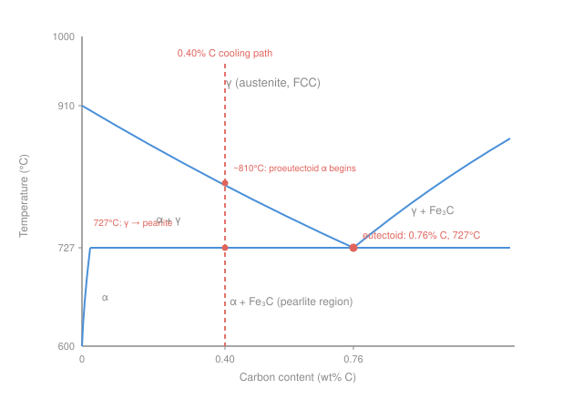

# Materials Science & Engineering · Lesson 3.3: Transformations, TTT & heat treatment

> ⏱ ~15 min · Module 3: Phase Diagrams & Transformations · Builds on: [3.1 Phase diagrams & the lever rule](03-01-phase-diagrams-lever-rule.md), [3.2 Eutectics & microstructure](03-02-eutectics-microstructure.md), [2.4 Diffusion I](02-04-diffusion-i-ficks-first-law.md) · Unlocks: [4.3 Strengthening mechanisms](04-03-strengthening-mechanisms.md), [4.4 Failure](04-04-failure-fracture-fatigue-creep.md)

## Why this matters

Two identical bars of the same 0.4% carbon steel — same composition, same phase diagram — can differ by a factor of five in hardness. The only difference is how fast they were cooled. That is the whole reason a blacksmith quenches a blade in water and then reheats it: composition sets *what phases are allowed*, but the **cooling rate** sets *what you actually get*. This lesson is where the equilibrium phase diagram you learned to read collides with kinetics — and it's the single most economically important idea in metallurgy, because it means you can tune a metal's strength without changing its chemistry.

## The idea

A phase diagram is a map of **equilibrium** — where the system ends up if you give it all the time in the world. But transformations happen by atoms *diffusing* into place ([2.4](02-04-diffusion-i-ficks-first-law.md)), and diffusion takes time. Cool slowly and atoms keep pace: you get the coarse, comfortable structure the diagram predicts. Cool fast and you outrun diffusion — atoms get frozen mid-shuffle into finer, more strained, harder structures. Quench hard enough and you can trap them so completely that a *new* structure appears that isn't on the equilibrium diagram at all.

The star system is **steel** — iron plus a little carbon. Near 727 °C it has a special point called the **eutectoid**: austenite (the high-temperature phase) transforms *in the solid state* into a fine two-phase layer cake of soft ferrite and hard iron carbide, called **pearlite**. A eutectoid is the exact solid-state cousin of the eutectic from [3.2](03-02-eutectics-microstructure.md): one solid splits into two solids on cooling, instead of a liquid splitting into two solids. Same lever-rule bookkeeping, one phase colder.

## The formal version

**The phases (Fe–Fe₃C system).** Iron dissolves carbon differently depending on its crystal structure:

- **Austenite** $\gamma$ — FCC iron, roomy interstitial sites, dissolves up to ~2% C. The high-temperature phase.
- **Ferrite** $\alpha$ — BCC iron, cramped sites, dissolves at most **0.022 wt% C** (at 727 °C). Soft and ductile.
- **Cementite** Fe₃C — an intermetallic compound, fixed at **6.70 wt% C**. Hard and brittle.

**The eutectoid reaction.** On slow cooling through 727 °C, austenite of the eutectoid composition decomposes:

$$\gamma\,(0.76\ \text{wt\% C}) \;\xrightarrow{\ 727^\circ\mathrm{C}\ }\; \alpha\,(0.022\ \text{wt\% C}) \;+\; \mathrm{Fe_3C}\,(6.70\ \text{wt\% C}).$$

*In words: one solid phase splits into two solid phases at a fixed temperature and composition.* The product is **pearlite** — alternating lamellae (thin layers) of ferrite and cementite, because the two products must reject carbon in opposite directions and it's fastest to do that side-by-side.

**Off the eutectoid composition.** A steel with less than 0.76% C is **hypoeutectoid**; more is **hypereutectoid**.

- *Hypoeutectoid* (our case): as you cool into the $\alpha+\gamma$ field, **proeutectoid ferrite** forms first at grain boundaries. This drains carbon-poor iron out, pushing the leftover austenite *toward* 0.76% C. When it reaches 0.76% C at 727 °C, that remaining austenite turns to pearlite.
- *Hypereutectoid*: symmetric story with **proeutectoid cementite** forming first.

The **lever rule** ([3.1](03-01-phase-diagrams-lever-rule.md)) gives every fraction. For proeutectoid ferrite vs. pearlite in a steel of carbon content $C_0$, apply the lever on the tie line from ferrite (0.022) to the eutectoid (0.76), *just above* 727 °C:

$$W_{\alpha'} = \frac{0.76 - C_0}{0.76 - 0.022}, \qquad W_{\text{pearlite}} = \frac{C_0 - 0.022}{0.76 - 0.022}.$$

*In words: how far your composition sits across the tie line decides how much of each you get — the near end is your phase, the fraction is the length of the far arm over the total.*

**Kinetics: the TTT curve.** Equilibrium says *whether*; kinetics says *how fast*, and cooling rate then selects the product:

- **Slow** (furnace cool): coarse pearlite — thick lamellae, soft.
- **Faster** (air cool): fine pearlite, then **bainite** — even finer, harder.
- **Quench** (water): no time to diffuse carbon at all. The FCC→BCC change happens *diffusionlessly* by a shear of the lattice, trapping all the carbon in a strained body-centered-tetragonal cell: **martensite** — very hard, very brittle. It appears *nowhere* on the equilibrium diagram.

A **TTT** (Time–Temperature–Transformation) diagram plots, at each hold temperature, how long until transformation starts and finishes — the classic "C-curve." A cooling path that stays left of the curve's nose beats diffusion and lands in martensite.

## Picture

The blue curves are equilibrium phase boundaries; the coral dashed line is a 0.40% C bar cooling straight down. It first crosses into $\alpha+\gamma$ (proeutectoid ferrite grows), then hits 727 °C where the leftover austenite snaps into pearlite.

## Worked examples

**Example 1 — Boss Problem 3: slow-cooled 0.40 wt% C steel.**

**(a) Phases just above and just below 727 °C.**

*Just above 727 °C* we're in the $\alpha+\gamma$ field. Tie line runs from ferrite (0.022) to austenite at the eutectoid (0.76):

$$W_{\alpha} = \frac{0.76 - 0.40}{0.76 - 0.022} = \frac{0.36}{0.738} = 0.49, \qquad W_{\gamma} = \frac{0.40 - 0.022}{0.738} = \frac{0.378}{0.738} = 0.51.$$

So: **ferrite** (0.022% C, fraction 0.49) + **austenite** (0.76% C, fraction 0.51).

*Just below 727 °C* the austenite has become pearlite, so the phases present are now **ferrite** (0.022% C) and **cementite** (6.70% C). Tie line runs the full width, 0.022 to 6.70:

$$W_{\alpha,\text{tot}} = \frac{6.70 - 0.40}{6.70 - 0.022} = \frac{6.30}{6.678} = 0.943, \qquad W_{\mathrm{Fe_3C},\text{tot}} = \frac{0.40 - 0.022}{6.678} = \frac{0.378}{6.678} = 0.057.$$

Ferrite jumps to 0.94 because pearlite is itself mostly ferrite. (The *phases* changed count, but total carbon is conserved — sanity: $0.943(0.022) + 0.057(6.70) = 0.021 + 0.38 = 0.40$ ✓.)

**(b) Proeutectoid ferrite vs. pearlite at room temperature.** These *microconstituents* are fixed at the moment of transformation, using the tie line just above 727 °C (ferrite 0.022 → eutectoid 0.76):

$$W_{\alpha'} = \frac{0.76 - 0.40}{0.76 - 0.022} = \frac{0.36}{0.738} = 0.49, \qquad W_{\text{pearlite}} = \frac{0.40 - 0.022}{0.738} = 0.51.$$

**≈ 49% proeutectoid ferrite, ≈ 51% pearlite.** (This is identical to the phase split just above 727 °C — because all the austenite present there becomes pearlite, and all the ferrite present there is the proeutectoid ferrite.)

**(c) What quenching changes.** Rapid quenching gives diffusion no time. There is no proeutectoid ferrite and no pearlite — instead the austenite shears wholesale into **martensite**: a supersaturated, body-centered-tetragonal solid solution holding all 0.40% C. The result is far harder and more brittle. To make it usable you'd then *temper* it (reheat moderately) to let a little carbide precipitate back out, trading some hardness for toughness.

**Example 2 — why a hair more carbon matters.** Compare our 0.40% C steel to a 0.80% C (near-eutectoid) steel, both slow-cooled. For the 0.80% C steel, $W_{\text{pearlite}} = (0.80-0.022)/0.738 \approx 1.05 \to$ essentially **100% pearlite**, almost no soft proeutectoid ferrite. Pearlite is the hard constituent, so doubling the carbon roughly doubles the pearlite fraction (0.51 → ~1.0) and markedly raises strength and hardness — before you've changed anything about how it was cooled. Composition and cooling rate are two independent knobs on the same structure; this is the lever [4.3](04-03-strengthening-mechanisms.md) pulls.

## Watch out

- **You might think the phase diagram tells you the final structure. It only tells you the *equilibrium* structure.** Martensite is real, useful, and absent from the diagram — because the diagram assumes infinite time and martensite is what you get with *no* time. Always ask "how fast was it cooled?"
- **You might confuse a phase with a microconstituent.** Below 727 °C the *phases* are just ferrite and cementite. But "pearlite" and "proeutectoid ferrite" are *microconstituents* — recognizable structural regions. Pearlite is not a phase; it's a fine mixture of the two phases. Use the eutectoid tie line (0.76) for constituents, the full tie line (6.70) for total phase amounts.
- **You might think proeutectoid ferrite forms at 727 °C.** It starts forming as soon as you cross the sloping $\alpha/\gamma$ boundary (the A₃ line), *above* 727 °C — see the upper coral dot in the figure. Only the *leftover* austenite waits until 727 °C to become pearlite.

## One-liner

> Composition picks the phases the diagram allows; cooling rate picks which of them you actually get — slow gives coarse pearlite, a quench gives martensite the diagram never mentions.

## Problems

**P1 (🟢)** A plain-carbon steel is 0.60 wt% C, slow-cooled. Using eutectoid 0.76% C, ferrite 0.022% C, cementite 6.70% C, find the fractions of proeutectoid ferrite and of pearlite at room temperature.

**P2 (🟡)** For that same 0.60% C steel just below 727 °C, find the **total** mass fractions of the ferrite and cementite *phases*. Why is the total ferrite fraction so much larger than the proeutectoid-ferrite fraction from P1?

**P3 (🔴)** A 1.0 wt% C steel is slow-cooled. Which proeutectoid constituent forms — ferrite or cementite — and what is its fraction? (Hint: it's hypereutectoid; the relevant tie line runs from the eutectoid at 0.76 to cementite at 6.70.)

Solutions

**P1** Hypoeutectoid, so proeutectoid ferrite. Tie line 0.022 → 0.76 just above 727 °C:

$$W_{\alpha'} = \frac{0.76 - 0.60}{0.76 - 0.022} = \frac{0.16}{0.738} = 0.217, \qquad W_{\text{pearlite}} = \frac{0.60 - 0.022}{0.738} = \frac{0.578}{0.738} = 0.783.$$

**≈ 22% proeutectoid ferrite, ≈ 78% pearlite.** *Check:* more carbon than Example 1's 0.40% C, so less soft ferrite and more pearlite — right direction ✓.

**P2** Total phases below 727 °C use the full tie line 0.022 → 6.70:

$$W_{\alpha,\text{tot}} = \frac{6.70 - 0.60}{6.70 - 0.022} = \frac{6.10}{6.678} = 0.913, \qquad W_{\mathrm{Fe_3C},\text{tot}} = \frac{0.60 - 0.022}{6.678} = \frac{0.578}{6.678} = 0.087.$$

**≈ 91% ferrite, ≈ 9% cementite.** The total ferrite (0.91) dwarfs the *proeutectoid* ferrite (0.22) because the pearlite is itself ~88% ferrite by mass — most of the ferrite is locked inside pearlite's lamellae, not sitting as standalone proeutectoid grains. *Check:* $0.913(0.022)+0.087(6.70)=0.020+0.583=0.60$ ✓.

**P3** 1.0% C > 0.76%, so it's **hypereutectoid** → **proeutectoid cementite** forms first (along prior-austenite grain boundaries). Tie line from eutectoid 0.76 to cementite 6.70, just above 727 °C, near end = cementite:

$$W_{\mathrm{Fe_3C}'} = \frac{1.0 - 0.76}{6.70 - 0.76} = \frac{0.24}{5.94} = 0.040.$$

**≈ 4% proeutectoid cementite** (the rest, ~96%, is pearlite). *Check:* only a small carbon excess over eutectoid, so only a thin cementite network — consistent with 1.0% C being just barely hypereutectoid ✓.

## Flashback

**From Lesson 3.2 (Eutectics & microstructure):** A lead–tin alloy of **30 wt% Sn** is cooled to just below the eutectic temperature (183 °C). Taking the eutectic composition as 61.9 wt% Sn, the maximum solubility in the $\alpha$ (Pb-rich) phase as 18.3 wt% Sn, and in $\beta$ (Sn-rich) as 97.8 wt% Sn, find the mass fraction of **primary (proeutectic) $\alpha$** and of the **eutectic constituent**.

Solution

Primary $\alpha$ is what forms *before* the eutectic reaction; its fraction comes from the tie line just above 183 °C, running from $\alpha$ (18.3) to the eutectic composition (61.9). Near end is $\alpha$, so:

$$W_{\alpha'} = \frac{61.9 - 30}{61.9 - 18.3} = \frac{31.9}{43.6} = 0.732, \qquad W_{\text{eutectic}} = \frac{30 - 18.3}{43.6} = \frac{11.7}{43.6} = 0.268.$$

**≈ 73% primary $\alpha$, ≈ 27% eutectic.** *Check:* fractions sum to 1.00 ✓, and 30% Sn sits closer to the 18.3 end than the 61.9 end, so the mixture should be mostly $\alpha$ ✓. This is the exact same lever-rule move as the eutectoid boss problem — only one phase colder (a liquid splitting, not a solid).

## Connections

- **Backward:** this is the **lever rule** of [3.1](03-01-phase-diagrams-lever-rule.md) applied twice (constituents on the eutectoid tie line, phases on the full tie line), and a **eutectic** ([3.2](03-02-eutectics-microstructure.md)) shifted into the solid state. The reason cooling rate matters at all is **diffusion** — the finite atom-hopping speed of [2.4](02-04-diffusion-i-ficks-first-law.md); a quench simply outruns it.
- **Forward:** pearlite spacing, martensite, and grain-boundary ferrite are exactly the microstructural knobs [4.3 Strengthening mechanisms](04-03-strengthening-mechanisms.md) turns into yield strength, and the brittleness of untempered martensite is a headline case for [4.4 Failure](04-04-failure-fracture-fatigue-creep.md).
- **Sideways (nuclear & structural engineering):** the ferritic/martensitic steels chosen for reactor pressure vessels and cladding are specified by precisely this heat-treatment logic — a tempered-martensite structure bought with a controlled quench-and-temper, then guarded against embrittlement in service.
