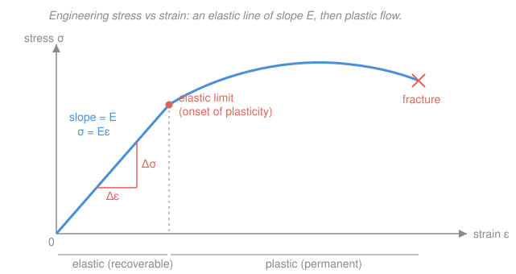

# Materials Science & Engineering · Lesson 4.1: Elastic behavior — stress, strain, modulus

> ⏱ ~15 min · Module 4: Mechanical Behavior & Failure · Builds on: [1.1 Bonding & the energy well](01-01-bonding-energy-well.md) · Unlocks: [4.2 Plastic deformation & Schmid's law](04-02-plastic-deformation-schmid.md), [4.3 Strengthening mechanisms](04-03-strengthening-mechanisms.md), [4.4 Failure: fracture, fatigue & creep](04-04-failure-fracture-fatigue-creep.md)

## Why this matters

Every load-bearing part — a bridge girder, a turbine blade, a phone screen — first responds to force by *stretching a little and springing back*. That reversible response is **elastic behavior**, and one number governs it: the stiffness, or Young's modulus $E$. Get $E$ wrong and your bookshelf sags, your bridge sways, your instrument drifts out of calibration. This lesson turns a lab tensile test into the two curves every engineer reads — stress and strain — and then traces $E$ all the way back to the bond-energy well of [1.1](01-01-bonding-energy-well.md): stiffness is atomic, not just structural.

## The idea

Pull on a rod and two obvious things change: the force you apply, and how much longer the rod gets. But "10 kN on a paperclip" and "10 kN on a bridge cable" mean completely different things, so we *normalize*. Divide force by the cross-section you're pulling on and you get **stress** — force per unit area, how hard each square meter of material is being worked. Divide the stretch by the original length and you get **strain** — the *fractional* elongation, a pure number that doesn't care whether the rod was 5 cm or 5 m.

Plot stress against strain and, for small loads, you get a **straight line**: double the stress, double the strain. The material behaves like a spring — let go and it snaps back to its original length, no harm done. The *steepness* of that line is the stiffness. A steep line (steel) barely strains under big stress; a shallow line (rubber) strains hugely under gentle stress. Push past a certain point — the elastic limit — and the line bends over: the material starts to flow and keep some of the stretch permanently. That's plasticity, and it's [4.2](04-02-plastic-deformation-schmid.md)'s story. Today we live entirely on the straight part.

## The formal version

Take a rod of original cross-sectional area $A_0$ (m²) and original length $L_0$ (m), pulled by a tensile force $F$ (newtons, N). It elongates by $\Delta L$ (m).

**Engineering stress** — force spread over the *original* area:

$$\sigma = \frac{F}{A_0} \qquad \text{units: } \mathrm{N/m^2} = \mathrm{Pa} \ (\text{usually MPa or GPa}).$$

*In words: how hard each unit of cross-section is being pulled.* We use $A_0$ (not the shrinking actual area) — that's what "engineering" means; it's the number you can compute from the undeformed part.

**Engineering strain** — stretch relative to the *original* length:

$$\varepsilon = \frac{\Delta L}{L_0} \qquad (\text{dimensionless}).$$

*In words: the fractional change in length.* A strain of $0.002$ means the rod got $0.2\%$ longer.

**Hooke's law (elastic region).** For small strains the two are proportional:

$$\boxed{\,\sigma = E\varepsilon\,}$$

where $E$ is **Young's modulus** (elastic modulus), the slope of the stress–strain line, in pascals (steels are $\approx 200$ GPa; aluminum $\approx 70$ GPa; polymers a few GPa). *In words: stiffness is the stress needed to produce one unit of strain — the price in force for a given fractional stretch.* This is exactly the spring law $F = kx$ from [`mechanics-refresher` 3.1](../../mechanics-refresher/lessons/03-01-simple-harmonic-motion.md), normalized so the constant $E$ belongs to the *material* rather than to one particular rod.

**Shear.** Pulling isn't the only way to load. Apply a force *parallel* to a face and you get **shear stress** $\tau = F/A_0$ and **shear strain** $\gamma$ (the tangent of the tilt angle). Their elastic law mirrors Hooke's:

$$\tau = G\gamma,$$

with $G$ the **shear modulus** (Pa). *In words: resistance to twisting/sliding, the shear cousin of $E$.*

**Poisson's ratio.** Stretch a rod and it gets *thinner* sideways — squeeze toothpaste lengthwise and it bulges. The ratio of that lateral shrink to the axial stretch is

$$\nu = -\frac{\varepsilon_{\text{lateral}}}{\varepsilon_{\text{axial}}},$$

a dimensionless number $\approx 0.3$ for most metals. *In words: how much a material narrows sideways for every unit it stretches lengthwise.* The minus sign makes $\nu$ positive, since a positive axial strain gives a negative (shrinking) lateral one. For an isotropic material the three constants are not independent:

$$E = 2G(1+\nu).$$

*In words: stiffness, shear stiffness, and sideways contraction are three views of the same elasticity — know two, get the third.*

**Why $E$ traces back to bonding.** Strain is nothing but *stretching bonds*. Near equilibrium the bond-energy well $U(r)$ of [1.1](01-01-bonding-energy-well.md) is a parabola, so the interatomic force $F = -dU/dr$ is linear in displacement — a tiny spring of stiffness $k_{\text{bond}} = U''(r_0)$, the *curvature* of the well at its bottom. Young's modulus is that atomic spring constant averaged over the packing:

$$E \propto \left.\frac{d^2U}{dr^2}\right|_{r_0}.$$

*In words: a material is stiff exactly when its bond-energy well is sharply curved.* This is why deep-welled, high-melting solids — diamond ($E \approx 1000$ GPa), ceramics — are stiff, while shallow-welled van der Waals solids are floppy. The same well depth that sets melting point sets stiffness; they rise together.

## Picture

The straight blue segment is the elastic region; its slope *is* $E$ (coral triangle: $E = \Delta\sigma/\Delta\varepsilon$). At the coral dot the line bends — the **elastic limit**, beyond which strain stops being fully recoverable. Everything in this lesson lives on the straight part; the roll-over is [4.2](04-02-plastic-deformation-schmid.md).

## Worked examples

**Example 1 (the tensile test — get $E$).** A cylindrical alloy rod has initial diameter $d_0 = 10$ mm and gauge length $L_0 = 50$ mm. In the elastic region a load of $F = 30$ kN produces an extension $\Delta L = 0.12$ mm. Find $\sigma$, $\varepsilon$, and $E$.

First the original area:

$$A_0 = \pi\left(\tfrac{d_0}{2}\right)^2 = \pi(0.005\ \mathrm{m})^2 = 7.854\times10^{-5}\ \mathrm{m^2}.$$

Stress and strain:

$$\sigma = \frac{F}{A_0} = \frac{30{,}000\ \mathrm{N}}{7.854\times10^{-5}\ \mathrm{m^2}} = 3.82\times10^{8}\ \mathrm{Pa} = 382\ \mathrm{MPa}, \qquad \varepsilon = \frac{\Delta L}{L_0} = \frac{0.12}{50} = 0.0024.$$

Modulus is their ratio:

$$E = \frac{\sigma}{\varepsilon} = \frac{382\ \mathrm{MPa}}{0.0024} = 1.59\times10^{5}\ \mathrm{MPa} \approx 159\ \mathrm{GPa}.$$

That lands between aluminum and steel — consistent with a copper- or titanium-family alloy. (This is the elastic part of the course boss problem for Module 4.)

**Example 2 (Poisson — how much it necks in).** Same rod, same $30$ kN load, with $\nu = 0.34$. By how much does the diameter shrink? The axial strain is $\varepsilon_{\text{axial}} = 0.0024$ from Example 1, so the lateral strain is

$$\varepsilon_{\text{lateral}} = -\nu\,\varepsilon_{\text{axial}} = -0.34 \times 0.0024 = -8.16\times10^{-4}.$$

Apply it to the diameter (lateral strain acts on any transverse length):

$$\Delta d = \varepsilon_{\text{lateral}}\, d_0 = (-8.16\times10^{-4})(10\ \mathrm{mm}) = -8.2\times10^{-3}\ \mathrm{mm} = -8.2\ \mu\mathrm{m}.$$

The rod narrows by about $8\ \mu\mathrm{m}$ — a tenth the width of a human hair — while it stretches by $120\ \mu\mathrm{m}$ lengthwise. Elastic strains are genuinely tiny; that's why you need a $50$ mm gauge and a good extensometer to see them.

## Watch out

- **You might think stress is just "force."** It isn't — it's force *per original area*. A thick rod and a thin wire under the same 30 kN are at completely different stresses, and stress (not force) is what the material actually feels. Always divide by $A_0$.
- **You might think $E$ tells you how *strong* a material is.** It doesn't — $E$ is *stiffness* (resistance to elastic stretch), not *strength* (the stress it can take before yielding or breaking). Rubber and steel can fail at similar strains but differ in $E$ by a factor of $\sim 10^5$; conversely a stiff ceramic can be weak in tension. Stiffness = slope of the line; strength = how far up the curve you can go ([4.2](04-02-plastic-deformation-schmid.md)).
- **You might expect alloying or heat treatment to raise $E$.** Barely. $E$ is set by *bonding and packing* — the well curvature of [1.1](01-01-bonding-energy-well.md) — so all steels share $E \approx 200$ GPa regardless of carbon content or quench. The tricks in [4.3](04-03-strengthening-mechanisms.md) raise *strength*, not stiffness. To change $E$ you must change the atoms or the phase, not the microstructure.

## One-liner

> Stress = force/area and strain = fractional stretch; in the elastic region they're locked by $\sigma = E\varepsilon$, and $E$ is nothing but the curvature of the atomic bond-energy well.

## Problems

**P1 (🟢)** An aluminum rod, original diameter $12.8$ mm and gauge length $50$ mm, carries a $35$ kN tensile load in the elastic region and stretches $0.30$ mm. Compute the engineering stress, the engineering strain, and Young's modulus. Does your $E$ look like aluminum?

**P2 (🟡)** A steel bar with $E = 207$ GPa and $\nu = 0.30$ is loaded to an axial (tensile) strain of $1.2\times10^{-3}$. (a) What tensile stress does that require? (b) What is the lateral strain? (c) Find the shear modulus $G$.

**P3 (🔴)** Two rods, A and B, have the *same* Young's modulus but bond-energy wells of different depth (B's is deeper). Which has the higher melting point, and can you conclude anything about which is stiffer? Explain using the well picture from [1.1](01-01-bonding-energy-well.md).

Solutions

**P1** Area first: $A_0 = \pi(0.0064\ \mathrm{m})^2 = 1.287\times10^{-4}\ \mathrm{m^2}$.

$$\sigma = \frac{35{,}000}{1.287\times10^{-4}} = 2.72\times10^{8}\ \mathrm{Pa} = 272\ \mathrm{MPa}, \qquad \varepsilon = \frac{0.30}{50} = 6.0\times10^{-3}.$$

$$E = \frac{\sigma}{\varepsilon} = \frac{272\ \mathrm{MPa}}{6.0\times10^{-3}} = 4.5\times10^{4}\ \mathrm{MPa} \approx 45\ \mathrm{GPa}.$$

*Check.* Units: $\mathrm{Pa}/(\text{dimensionless}) = \mathrm{Pa}$ ✓. The value is a bit low for pure aluminum ($\approx 70$ GPa) — so either it's a compliant alloy or the numbers are rough, but it's firmly in the "light-metal" band, nowhere near steel's 200 GPa. ✓

**P2** (a) Hooke's law: $\sigma = E\varepsilon = (207\times10^{9}\ \mathrm{Pa})(1.2\times10^{-3}) = 2.48\times10^{8}\ \mathrm{Pa} = 248\ \mathrm{MPa}.$

(b) $\varepsilon_{\text{lateral}} = -\nu\,\varepsilon_{\text{axial}} = -0.30 \times 1.2\times10^{-3} = -3.6\times10^{-4}$ (the bar narrows).

(c) From $E = 2G(1+\nu)$:

$$G = \frac{E}{2(1+\nu)} = \frac{207\ \mathrm{GPa}}{2(1.30)} = \frac{207}{2.60} = 79.6\ \mathrm{GPa}.$$

*Check.* $G$ should be roughly $0.4\,E$ for $\nu \approx 0.3$: $0.4 \times 207 \approx 83$ GPa, close to our $80$ GPa ✓. Shear stiffness is a bit under half the tensile stiffness, as expected for metals.

**P3** Well *depth* sets the energy to pull atoms apart, i.e. the melting/vaporization tendency — so **B (deeper well) has the higher melting point.** But stiffness $E$ is set by the well's *curvature* at the bottom, $U''(r_0)$, which is a **different** feature of the curve. A well can be deep yet gently curved, or shallow yet sharply curved. Since A and B are stated to have equal $E$, their curvatures match even though their depths differ — so from equal $E$ you can conclude nothing about depth, and from B's greater depth you can conclude nothing about stiffness. Depth ↔ melting point; curvature ↔ modulus; the two usually *trend* together but are not the same number.

*Check.* Consistent with [1.1](01-01-bonding-energy-well.md): the well is characterized independently by its depth (bond energy) and its curvature (stiffness), which is exactly why the problem is answerable. ✓

## Flashback

**From Lesson 3.1 (Phase diagrams & the lever rule):** A Cu–Ni alloy of overall composition $40$ wt% Ni sits in the two-phase (liquid + solid) region at a temperature where the tie line meets the liquidus at $C_L = 32$ wt% Ni and the solidus at $C_\alpha = 45$ wt% Ni. Using the lever rule, find the mass fraction of solid ($\alpha$) and of liquid.

Solution

The lever rule: each phase's mass fraction equals the length of the *opposite* arm of the tie line divided by the whole tie line. The overall composition $C_0 = 40$ wt% Ni. Total tie-line length $C_\alpha - C_L = 45 - 32 = 13$ wt%.

$$W_\alpha = \frac{C_0 - C_L}{C_\alpha - C_L} = \frac{40 - 32}{13} = \frac{8}{13} = 0.615, \qquad W_L = \frac{C_\alpha - C_0}{C_\alpha - C_L} = \frac{45 - 40}{13} = \frac{5}{13} = 0.385.$$

So about $62\%$ solid, $38\%$ liquid.

*Check.* The fractions sum to $0.615 + 0.385 = 1.000$ ✓ (all the material is accounted for). Sanity: $C_0 = 40$ sits closer to the solidus (45) than to the liquidus (32), so more of the material should be solid — and $W_\alpha = 0.615 > W_L$, consistent. ✓

## Connections

- **Backward:** the modulus $E$ is the bond-energy well of [1.1](01-01-bonding-energy-well.md) wearing an engineering uniform — $E \propto U''(r_0)$, the curvature at the bottom of the well — which is why stiffness and melting point rise together across the materials. Hooke's law $\sigma = E\varepsilon$ is the spring law $F = kx$ from [`mechanics-refresher` 3.1](../../mechanics-refresher/lessons/03-01-simple-harmonic-motion.md), rescaled so the constant belongs to the material, not the specimen.
- **Forward:** push past the elastic limit and the curve bends over into plastic flow — [4.2 Plastic deformation & Schmid's law](04-02-plastic-deformation-schmid.md) explains *why* it yields (dislocations gliding on slip planes), and [4.3](04-03-strengthening-mechanisms.md) shows how to raise the yield stress without touching $E$. [4.4](04-04-failure-fracture-fatigue-creep.md) follows the curve all the way to fracture.
- **Sideways (structural & mechanical engineering):** the same $\sigma = E\varepsilon$ underlies beam deflection, column buckling, and the natural frequencies of a vibrating structure — anywhere a solid stores energy elastically, this modulus sets the stiffness that appears in the design equations.
