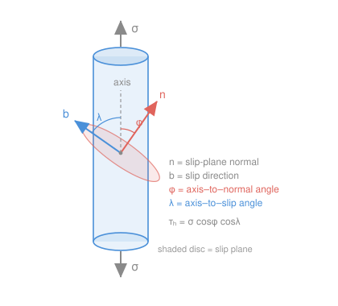

# Materials Science & Engineering · Lesson 4.2: Plastic deformation & Schmid's law

> ⏱ ~15 min · Module 4: Mechanical Behavior & Failure · Builds on: [4.1 Elastic behavior](04-01-elastic-behavior-stress-strain.md), [2.2 Dislocations](02-02-dislocations-plastic-flow.md), [1.3 Miller indices & slip systems](01-03-miller-indices-directions-planes.md) · Unlocks: [4.3 Strengthening mechanisms](04-03-strengthening-mechanisms.md)

## Why this matters

In [4.1](04-01-elastic-behavior-stress-strain.md) you stretched a metal and it sprang back — stress proportional to strain, energy stored and returned. But push past a point and the metal *stays* stretched: bend a paperclip, it stays bent. That permanent, unrecoverable strain is **plastic deformation**, and it's the whole reason metals can be forged, rolled, drawn into wire, and dented instead of shattered. The question this lesson answers is a sharp one: *when* does a crystal start to yield, and why does a single crystal's answer depend on how you've rotated it relative to the load? The tool is **Schmid's law**, and it turns "will it yield?" into a one-line geometry calculation.

## The idea

Where does permanent strain come from? Not from stretching bonds — that's elastic and reversible. It comes from **dislocations gliding**, the line defects from [2.2](02-02-dislocations-plastic-flow.md). A dislocation lets one plane of atoms slide over the next *one row of bonds at a time*, like shoving a wrinkle across a rug instead of dragging the whole rug. Each pass leaves the crystal permanently offset by one atomic step. Pile up billions of these and you get a visibly bent paperclip.

Here's the crucial twist: dislocations glide on specific **slip systems** — a close-packed plane paired with a close-packed direction in it ([1.3](01-03-miller-indices-directions-planes.md)). And they respond only to **shear** stress along that direction, never to the raw pull. So even though you apply a straight tensile pull, what matters is how much of that pull *shears* the slip plane in the slip direction. Tilt the crystal so the slip system lies at a lazy 45° to the pull and it shears easily; align the pull straight along the plane normal and no shear reaches the system at all — it can't slip no matter how hard you pull. Yielding is geometry, not just force.

## The formal version

**Yield strength and the 0.2% offset.** The **yield strength** $\sigma_y$ (units: MPa) is the stress at which plastic flow begins. The catch is that the elastic-to-plastic transition is gradual — there's no sharp corner to point at. So we *define* it by construction: on the stress–strain curve, take the elastic slope (Young's modulus $E$ from [4.1](04-01-elastic-behavior-stress-strain.md)), draw a line **parallel to it starting from strain $\varepsilon = 0.002$** (that's 0.2%), and $\sigma_y$ is where that offset line crosses the curve. *In words: the yield strength is the stress that leaves behind 0.2% permanent strain* — a small, agreed-upon amount of "stays bent."

**Resolved shear stress.** Apply a tensile stress $\sigma = F/A$, where $F$ is the axial force (N) and $A$ is the cross-section perpendicular to the axis (m²). Let

- $\phi$ = angle between the tensile axis and the **slip-plane normal**,
- $\lambda$ = angle between the tensile axis and the **slip direction**.

The shear stress actually felt along the slip direction, on the slip plane, is the **resolved shear stress**:

$$\boxed{\,\tau_R = \sigma\cos\phi\cos\lambda\,}$$

*In words: only the fraction $\cos\phi\cos\lambda$ of your applied stress shows up as shear on that slip system.* This factor

$$m = \cos\phi\cos\lambda$$

is the **Schmid factor** (dimensionless). Where does the double cosine come from? The force along the slip direction is $F\cos\lambda$. The slip plane, tilted by $\phi$, has area $A/\cos\phi$ (an inclined slice is bigger than the straight cross-section). Shear stress is force-over-area:

$$\tau_R = \frac{F\cos\lambda}{A/\cos\phi} = \frac{F}{A}\cos\phi\cos\lambda = \sigma\cos\phi\cos\lambda.$$

**Schmid's law (the yield criterion).** A slip system activates when its resolved shear stress reaches a material constant, the **critical resolved shear stress** $\tau_{\mathrm{CRSS}}$ (MPa):

$$\tau_R \ge \tau_{\mathrm{CRSS}} \quad\Longleftrightarrow\quad \text{slip begins.}$$

*In words: it's not the pull that yields the crystal, it's the shear you resolve onto the slip system — cross that critical value and dislocations run.* Rearranged, the crystal yields when $\sigma$ reaches $\sigma_y = \tau_{\mathrm{CRSS}}/m$: the **larger** the Schmid factor, the **less** stress you need.

**The magic number 0.5.** Because $m = \cos\phi\cos\lambda$, and the axis's angles to the (perpendicular) normal and slip direction are geometrically linked, $m$ can never exceed $\tfrac12$. The most favorable orientation is $\phi = \lambda = 45^\circ$, giving $m = \cos45^\circ\cos45^\circ = \tfrac12$ — you get half your applied stress as shear, and no more (proved in P3). A crystal sitting at this "soft" orientation yields first.

## Picture

The tensile axis is vertical (load $\sigma$). The shaded disc is the inclined slip plane; $\mathbf n$ is its normal at angle $\phi$ from the axis, and $\mathbf b$ is the slip direction *lying in the plane* at angle $\lambda$. Note $\mathbf n \perp \mathbf b$ — so $\phi$ and $\lambda$ are **not** two views of the same angle, and they need not add to $90^\circ$.

## Worked examples

**Example 1 (mechanical — plug in and compare).** A single crystal is loaded to $\sigma = 12\ \mathrm{MPa}$. Its active slip system has a slip-plane normal at $\phi = 60^\circ$ to the axis and a slip direction at $\lambda = 30^\circ$. Its critical resolved shear stress is $\tau_{\mathrm{CRSS}} = 6\ \mathrm{MPa}$. Does it yield?

$$m = \cos60^\circ\cos30^\circ = (0.500)(0.866) = 0.433,$$
$$\tau_R = \sigma\, m = 12 \times 0.433 = 5.20\ \mathrm{MPa}.$$

Since $\tau_R = 5.20\ \mathrm{MPa} < 6\ \mathrm{MPa} = \tau_{\mathrm{CRSS}}$, it **does not yet slip**. How much stress *would* it take? $\sigma_y = \tau_{\mathrm{CRSS}}/m = 6/0.433 = 13.9\ \mathrm{MPa}$ — a touch more pull and it goes.

**Example 2 (direction cosines — the boss-problem geometry).** A single crystal is loaded along the $[010]$ direction with a $1.2\ \mathrm{kN}$ force on a rod of diameter $10\ \mathrm{mm}$. For the FCC slip system $(111)[\bar101]$, find $\tau_R$ and compare to $\tau_{\mathrm{CRSS}} = 6\ \mathrm{MPa}$.

*Step 1 — get $\sigma$.* Area $A = \pi r^2 = \pi(5\times10^{-3}\,\mathrm{m})^2 = 7.854\times10^{-5}\ \mathrm{m^2}$.
$$\sigma = \frac{F}{A} = \frac{1200\ \mathrm{N}}{7.854\times10^{-5}\ \mathrm{m^2}} = 1.528\times10^{7}\ \mathrm{Pa} = 15.28\ \mathrm{MPa}.$$

*Step 2 — direction cosines by dot products.* The tensile axis is $\mathbf t = [010]$, the plane normal is $\mathbf n = [111]$, the slip direction is $\mathbf b = [\bar101] = (-1,0,1)$. For any two lattice vectors, $\cos(\text{angle}) = (\mathbf u\cdot\mathbf v)/(|\mathbf u||\mathbf v|)$.

$$\cos\phi = \frac{\mathbf t\cdot\mathbf n}{|\mathbf t||\mathbf n|} = \frac{(0)(1)+(1)(1)+(0)(1)}{\sqrt{1}\,\sqrt{3}} = \frac{1}{\sqrt3} = 0.577,$$
$$\cos\lambda = \frac{\mathbf t\cdot\mathbf b}{|\mathbf t||\mathbf b|} = \frac{(0)(-1)+(1)(0)+(0)(1)}{\sqrt{1}\,\sqrt{2}} = \frac{0}{\sqrt2} = 0.$$

*Step 3 — resolve.* $\tau_R = \sigma\cos\phi\cos\lambda = 15.28 \times 0.577 \times 0 = 0\ \mathrm{MPa}.$

So $\tau_R = 0 < 6\ \mathrm{MPa}$: this system carries **no shear at all** and can *never* slip under a $[010]$ pull, no matter how hard you load it — because the slip direction $[\bar101]$ sits exactly perpendicular to the tensile axis ($\lambda = 90^\circ$). That's not a dead end for the crystal, though: the same $(111)$ plane also hosts the slip directions $[\bar110]$ and $[0\bar11]$, and for a $[010]$ axis each of those has $\cos\lambda = 1/\sqrt2$, so $m = (1/\sqrt3)(1/\sqrt2) = 0.408$ and $\tau_R = 15.28\times0.408 = 6.24\ \mathrm{MPa} \ge 6\ \mathrm{MPa}$. The crystal yields — just on a *different* slip direction than the one you were handed. Always check the whole slip-system family.

## Watch out

- **You might think $\phi + \lambda = 90^\circ$.** They usually don't add to anything tidy. Both are measured from the *same* tensile axis, but to two *different* (perpendicular) directions — the plane normal and the slip direction. They're independent, subject only to $\cos^2\phi + \cos^2\lambda \le 1$. Compute each with its own dot product.
- **You might think a bigger Schmid factor means it takes more stress to yield.** Backwards. $m$ is how *efficiently* your pull becomes shear, so a large $m$ ($\approx 0.5$) is the **soft** orientation — it yields at the *lowest* stress, $\sigma_y = \tau_{\mathrm{CRSS}}/m$. Small $m$ is the hard orientation.
- **You might think any tensile load eventually yields any slip system.** Not if $m = 0$. When the axis is parallel to the slip-plane normal ($\phi = 0,\ \lambda = 90^\circ$) or perpendicular to the slip direction ($\lambda = 90^\circ$), $\tau_R$ stays zero at *every* stress — that system is geometrically locked out, as in Example 2.

## One-liner

> A crystal yields when the shear it resolves onto a slip system, $\sigma\cos\phi\cos\lambda$, reaches that system's critical value — so orientation, not just stress, decides who slips first, and the best you ever resolve is half ($m \le 0.5$).

## Problems

**P1 (🟢)** A single crystal under $\sigma = 15\ \mathrm{MPa}$ has its slip-plane normal at $\phi = 40^\circ$ and slip direction at $\lambda = 50^\circ$ to the load axis, with $\tau_{\mathrm{CRSS}} = 6\ \mathrm{MPa}$. Find the Schmid factor and the resolved shear stress. Does it yield?

**P2 (🟡)** The same crystal as Example 2, but now loaded along $[001]$ on the system $(111)[\bar101]$. Use dot products to find $\cos\phi$, $\cos\lambda$, and $m$. If $\sigma = 18\ \mathrm{MPa}$ and $\tau_{\mathrm{CRSS}} = 6\ \mathrm{MPa}$, does this system slip? Why is the answer so different from the $[010]$ case?

**P3 (🔴)** Prove that the Schmid factor can never exceed $\tfrac12$. (Hint: take the case where the tensile axis, the slip-plane normal, and the slip direction all lie in one plane, so $\lambda = 90^\circ - \phi$.)

Solutions

**P1** Schmid factor and resolved shear:
$$m = \cos40^\circ\cos50^\circ = (0.766)(0.643) = 0.492,$$
$$\tau_R = \sigma\, m = 15 \times 0.492 = 7.39\ \mathrm{MPa}.$$
Since $\tau_R = 7.39\ \mathrm{MPa} \ge 6\ \mathrm{MPa} = \tau_{\mathrm{CRSS}}$, the crystal **yields**.
*Check.* $m = 0.492$ is close to the ideal $0.5$ (both angles near $45^\circ$), so this is a soft orientation that yields readily — consistent. Units: $\mathrm{MPa}\times(\text{dimensionless}) = \mathrm{MPa}$ ✓.

**P2** Axis $\mathbf t = [001]$, normal $\mathbf n = [111]$, slip direction $\mathbf b = [\bar101] = (-1,0,1)$:
$$\cos\phi = \frac{(0)(1)+(0)(1)+(1)(1)}{\sqrt1\,\sqrt3} = \frac{1}{\sqrt3} = 0.577,\qquad \cos\lambda = \frac{(0)(-1)+(0)(0)+(1)(1)}{\sqrt1\,\sqrt2} = \frac{1}{\sqrt2} = 0.707.$$
$$m = 0.577\times0.707 = 0.408,\qquad \tau_R = 18\times0.408 = 7.35\ \mathrm{MPa}.$$
Since $7.35 \ge 6\ \mathrm{MPa}$, this system **slips**. It differs from the $[010]$ case because there the slip direction $[\bar101]$ was perpendicular to the axis ($\cos\lambda = 0$, so $\tau_R = 0$); loading along $[001]$ instead gives the slip direction a real projection ($\cos\lambda = 1/\sqrt2$), so shear reaches it. Same slip system, different loading axis, completely different fate — the essence of Schmid's law.
*Check.* $m = 0.408 = 1/\sqrt6$, below the $0.5$ ceiling ✓.

**P3** With the axis, normal, and slip direction coplanar and $\mathbf n \perp \mathbf b$, the axis's angles satisfy $\lambda = 90^\circ - \phi$. Then
$$m = \cos\phi\cos\lambda = \cos\phi\cos(90^\circ-\phi) = \cos\phi\sin\phi = \tfrac12\sin(2\phi).$$
Since $\sin(2\phi) \le 1$ for all $\phi$, we get $m \le \tfrac12$, with equality when $2\phi = 90^\circ$, i.e. $\phi = \lambda = 45^\circ$. (When the three are *not* coplanar, the axis wastes some length on a third, out-of-plane direction, so $\cos^2\phi + \cos^2\lambda < 1$ and $m$ is even smaller.) Hence $m_{\max} = \tfrac12$. $\blacksquare$
*Check.* At $\phi = 45^\circ$: $m = \tfrac12\sin90^\circ = 0.5$ ✓; at $\phi = 0^\circ$ (axis along the normal): $m = \tfrac12\sin0^\circ = 0$, matching the "locked-out" case ✓.

## Flashback

**From Lesson 4.1 (Elastic behavior):** A cylindrical rod of diameter $8\ \mathrm{mm}$ and gauge length $40\ \mathrm{mm}$ is pulled in tension. Still within the elastic region, a $20\ \mathrm{kN}$ load produces a $0.09\ \mathrm{mm}$ extension. Find Young's modulus $E$. (Fresh variant — new geometry and load.)

Solution

Engineering stress and strain, then $E = \sigma/\varepsilon$ from Hooke's law:
$$A = \pi r^2 = \pi(4\times10^{-3}\,\mathrm{m})^2 = 5.027\times10^{-5}\ \mathrm{m^2},\qquad \sigma = \frac{20000\ \mathrm{N}}{5.027\times10^{-5}\ \mathrm{m^2}} = 397.9\ \mathrm{MPa},$$
$$\varepsilon = \frac{\Delta L}{L_0} = \frac{0.09}{40} = 2.25\times10^{-3},\qquad E = \frac{\sigma}{\varepsilon} = \frac{397.9\ \mathrm{MPa}}{2.25\times10^{-3}} = 1.77\times10^{5}\ \mathrm{MPa} \approx 177\ \mathrm{GPa}.$$
*Check.* Strain is dimensionless, so $E$ carries stress units ✓. $177\ \mathrm{GPa}$ is right in the range for steel — a sensible metal ✓. This is exactly the elastic bookkeeping we now push *past* to reach the plastic regime.

## Connections

- **Backward:** the sliding itself is dislocation glide from [2.2](02-02-dislocations-plastic-flow.md), running on the close-packed slip systems you learned to index in [1.3](01-03-miller-indices-directions-planes.md) — and $\tau_R$ picks up exactly where [4.1](04-01-elastic-behavior-stress-strain.md)'s elastic curve bends over into permanent strain.
- **Forward:** [4.3 Strengthening mechanisms](04-03-strengthening-mechanisms.md) is all about *raising* $\tau_{\mathrm{CRSS}}$ — grain boundaries, solute atoms, and tangled dislocations each make slip harder to start or sustain. Why polycrystals yield *gradually* (each grain has a different Schmid factor, so grains yield one orientation at a time) is the bridge into Hall–Petch there. UTS and necking, the top of the curve, come in [4.4](04-04-failure-fracture-fatigue-creep.md).
- **Sideways:** the double cosine $\cos\phi\cos\lambda$ is a pure vector-projection move — the same "project the force onto a direction, project the area onto a plane" bookkeeping you use to resolve forces onto axes in statics and mechanics. Schmid's law is that projection dressed in crystallography.
