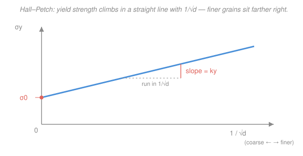

# Materials Science & Engineering · Lesson 4.3: Strengthening mechanisms

> ⏱ ~15 min · Module 4: Mechanical behavior · Builds on: [4.2 Plastic deformation & Schmid's law](04-02-plastic-deformation-schmid.md), [2.2 Dislocations & plastic flow](02-02-dislocations-plastic-flow.md), [2.3 Interfaces & grain boundaries](02-03-interfaces-grain-boundaries.md), [2.1 Point defects & solid solutions](02-01-point-defects-solid-solutions.md) · Unlocks: [4.4 Failure: fracture, fatigue, creep](04-04-failure-fracture-fatigue-creep.md)

## Why this matters

A metal yields when its dislocations start to glide ([4.2](04-02-plastic-deformation-schmid.md)). So there is exactly **one way to make a metal stronger: make dislocations harder to move.** Every metallurgical trick a jet-engine designer or a bridge builder reaches for — refining the grains, alloying, cold-rolling — is a variation on that single theme: litter the slip planes with obstacles. Learn to see all of strengthening as *obstacle engineering* and a scattered chapter collapses into one idea, with a predictable price tag attached to each move.

## The idea

Picture a dislocation as a ripple you're trying to drag across a rug. On a clean rug it slides easily — that's a soft, pure, coarse-grained metal. Now start dropping obstacles in its path:

- **Grain boundaries** (from [2.3](02-03-interfaces-grain-boundaries.md)): a dislocation can't cross into a neighboring grain whose lattice is tilted — the slip plane doesn't line up. It piles up at the wall. *More walls, closer together (finer grains) = more stopping.*
- **Solute atoms** (from [2.1](02-01-point-defects-solid-solutions.md)): a foreign atom, bigger or smaller than the host, warps the lattice around it. Dislocations get pinned in those strain fields. *More solute = more pins.*
- **Other dislocations** (from [2.2](02-02-dislocations-plastic-flow.md)): deform the metal and you *multiply* dislocations until they tangle and block each other — a traffic jam that jams itself. This is **strain hardening**, and it's why bending a paperclip back and forth makes the crease progressively stiffer, then snaps it.

Same mechanism every time; only the obstacle changes. And each obstacle carries a tradeoff — usually you buy strength with ductility. There's one famous exception, coming up.

## The formal version

**1. Grain-size strengthening — the Hall–Petch relation.**

$$\sigma_y = \sigma_0 + k_y\, d^{-1/2}$$

- $\sigma_y$ = yield strength (MPa).
- $d$ = average grain diameter (here in mm; keep units consistent with $k_y$).
- $\sigma_0$ = the "friction stress" (MPa) — the yield you'd have with enormous grains ($d\to\infty$, so $d^{-1/2}\to 0$): the lattice's own resistance to dislocation glide.
- $k_y$ = the Hall–Petch slope (MPa·mm$^{1/2}$) — how strongly boundaries reward you.

*In words: shrink the grains and the yield strength rises in proportion to $1/\sqrt{\text{grain size}}$.* The special virtue here: grain refinement raises strength **and** toughness together (finer grains blunt cracks too — see [4.4](04-04-failure-fracture-fatigue-creep.md)). That's the metallurgist's rare **free lunch** — every other method trades ductility away. The catch: heat the metal too hot and grains coarsen (grain growth), erasing the gain.

**2. Solid-solution strengthening.** Dissolve $c$ (atomic fraction) of a solute into the lattice; the extra strength scales roughly as

$$\Delta\sigma_y \;\propto\; \sqrt{c}.$$

*In words: strength grows with the square root of solute concentration — the first few percent buy the most.* Cost: a modest loss of ductility. (Brass is Cu strengthened this way by Zn; steel, by C and Mn.)

**3. Strain hardening (cold work).** Plastically deforming a metal *below* its recrystallization temperature drives up the dislocation density until they entangle. We quantify how much you've worked it by **percent cold work**:

$$\%\mathrm{CW} = \frac{A_0 - A_d}{A_0}\times 100$$

- $A_0$ = original cross-sectional area, $A_d$ = area after deformation (mm², or any consistent area unit).

*In words: percent cold work is the fraction of cross-section you squeezed away.* More %CW raises yield and tensile strength but **lowers ductility** (percent elongation) — the metal is running out of easy dislocation motion.

**4. Undoing it — annealing.** Heat cold-worked metal and it recovers in three stages:

$$\text{recovery} \;\to\; \text{recrystallization} \;\to\; \text{grain growth}.$$

*In words:* **recovery** relieves internal stress (dislocations rearrange, little strength change); **recrystallization** nucleates brand-new strain-free grains that consume the deformed ones — strength drops, ductility returns; **grain growth** then coarsens those grains (which, by Hall–Petch, gives back a little strength — so don't over-bake).

## Picture

The whole relation is one straight line: intercept $\sigma_0$, slope $k_y$. Finer grains live to the *right* (larger $1/\sqrt d$), higher up.

## Worked examples

**Example 1 (Hall–Petch — read strength off two grain sizes).** A steel has $\sigma_0 = 50$ MPa and $k_y = 10\ \mathrm{MPa\cdot mm^{1/2}}$. Compare a fine-grained batch, $d_1 = 0.01$ mm, with a coarse one, $d_2 = 0.04$ mm.

First the $d^{-1/2}$ factors:

$$d_1^{-1/2} = \frac{1}{\sqrt{0.01}} = \frac{1}{0.1} = 10\ \mathrm{mm^{-1/2}}, \qquad d_2^{-1/2} = \frac{1}{\sqrt{0.04}} = \frac{1}{0.2} = 5\ \mathrm{mm^{-1/2}}.$$

Then:

$$\sigma_{y,1} = 50 + 10(10) = 150\ \mathrm{MPa}, \qquad \sigma_{y,2} = 50 + 10(5) = 100\ \mathrm{MPa}.$$

Quartering the grain diameter (0.04 → 0.01 mm) *halves* $d^{-1/2}$'s complement and lifts yield strength by 50%, from 100 to 150 MPa — no change in composition, just microstructure.

**Example 2 (cold work — the tradeoff, then the anneal).** A copper rod is drawn from diameter $d_0 = 15$ mm to $d_d = 12$ mm. How much cold work, and what does it do?

Areas go as diameter squared, so the ratio is clean:

$$\%\mathrm{CW} = \left(1 - \frac{A_d}{A_0}\right)\times 100 = \left[1 - \left(\frac{d_d}{d_0}\right)^2\right]\times 100 = \left[1 - \left(\frac{12}{15}\right)^2\right]\times 100 = (1 - 0.64)\times 100 = 36\%.$$

At 36% CW the copper's yield and tensile strength rise sharply while its ductility (percent elongation) falls — a heavily worked rod is strong but brittle-feeling, near the end of its cold-forming life. Now **recrystallization-anneal** it (hold above copper's recrystallization temperature): new strain-free grains nucleate and grow, the dislocation tangle is wiped out, strength drops back toward the soft annealed value, and ductility is restored — ready for another drawing pass. Cold-work then anneal, repeat: that cycle is how wire is pulled to fine gauge without shattering.

## Watch out

- **You might think finer grains mean a *smaller* number in Hall–Petch — but $d$ is in the denominator under a root**, so smaller $d$ gives *larger* $d^{-1/2}$ and *higher* strength. The metal you refine moves up-and-right on the plot, not down.
- **You might think all strengthening costs ductility — but grain refinement is the exception**, boosting strength and toughness at once. Solid-solution and (especially) strain hardening do charge you ductility; grain size is the free lunch.
- **You might think cold work is permanent — but annealing above the recrystallization temperature erases it.** That's not a bug: it's how you reset a metal mid-forming. Conversely, a component that gets hot in service can *soften on its own*, an unwanted anneal.

## One-liner

> Every way to strengthen a metal is the same move — put obstacles (boundaries, solutes, or tangled dislocations) in the path of gliding dislocations — and every move but grain refinement charges you ductility.

## Problems

**P1 (🟢)** A brass has $\sigma_0 = 25$ MPa and $k_y = 12.5\ \mathrm{MPa\cdot mm^{1/2}}$. Find the yield strength when the grain diameter is $d = 0.0625$ mm.

**P2 (🟡)** A cylindrical rod of steel is cold-drawn from a diameter of 10 mm to 8 mm. (a) Compute the percent cold work. (b) State qualitatively what happens to its tensile strength and its ductility, and (c) what a recrystallization anneal would do to each.

**P3 (🔴)** Two aluminum bars are meant to hit the same yield strength. Bar A is pure Al with grain diameter 0.02 mm giving $\sigma_y = 90$ MPa. Bar B must reach the same 90 MPa but is being made with coarser grains, $d = 0.08$ mm. Using $\sigma_0 = 35$ MPa and $k_y = 7.8\ \mathrm{MPa\cdot mm^{1/2}}$ for this alloy family, check whether grain size *alone* can get bar B to 90 MPa, and if not, name a second mechanism you'd add.

Solutions

**P1** $d^{-1/2} = 1/\sqrt{0.0625} = 1/0.25 = 4\ \mathrm{mm^{-1/2}}$. Then

$$\sigma_y = 25 + 12.5(4) = 25 + 50 = 75\ \mathrm{MPa}.$$

*Check.* Units: $\mathrm{MPa} + (\mathrm{MPa\cdot mm^{1/2}})(\mathrm{mm^{-1/2}}) = \mathrm{MPa}$ ✓. The boundary term (50 MPa) dominates the friction term (25 MPa) for this fine grain — sensible for a well-refined alloy.

**P2** (a) Area ratio $= (d_d/d_0)^2 = (8/10)^2 = 0.64$, so

$$\%\mathrm{CW} = (1 - 0.64)\times 100 = 36\%.$$

(b) Tensile strength **rises** (more tangled dislocations resisting glide); ductility, i.e. percent elongation, **falls** — the classic strength-for-ductility trade. (c) A recrystallization anneal nucleates new strain-free grains: tensile strength **drops back down** toward the annealed value and ductility is **restored**. (Push the anneal too far and grain growth begins, giving back a little strength via Hall–Petch.)

*Check.* Same $(d_d/d_0)^2$ shortcut as Example 2, and 8/10 = 0.8 → 0.64, so 36%. The directions (up/down, then reversed) match the "cold work strengthens and embrittles; annealing reverses it" rule. ✓

**P3** Grain-size contribution alone for bar B: $d^{-1/2} = 1/\sqrt{0.08} = 1/0.2828 = 3.54\ \mathrm{mm^{-1/2}}$, so

$$\sigma_y = 35 + 7.8(3.54) = 35 + 27.6 = 62.6\ \mathrm{MPa}.$$

That's well short of 90 MPa — with grains this coarse, Hall–Petch can't close the gap (you'd need $d^{-1/2} = (90-35)/7.8 = 7.05\ \mathrm{mm^{-1/2}}$, i.e. $d \approx 0.020$ mm, four times finer). Since the spec fixes coarse grains, add a **second obstacle**: solid-solution alloying (e.g. Mg into the Al) or strain hardening (cold work) to supply the missing $\approx 27$ MPa. The mechanisms stack because each independently impedes dislocation motion.

*Check.* Required $d^{-1/2}$: $(90-35)/7.8 = 55/7.8 = 7.05$, and $d = (1/7.05)^2 = 0.0201$ mm ✓ — consistent with bar A's 0.02 mm reaching 90 MPa. So bar A *does* hit the target by grain size alone; bar B, forced coarse, cannot — confirming a second mechanism is needed.

## Flashback

**From Lesson 4.2 (Plastic deformation & Schmid's law):** A single crystal is loaded in tension to $\sigma = 52$ MPa. On its active slip system the slip-plane normal makes $\phi = 60^\circ$ with the tensile axis and the slip direction makes $\lambda = 35^\circ$ with it. (a) Find the resolved shear stress $\tau_R$. (b) If the critical resolved shear stress is $\tau_{\mathrm{crss}} = 20$ MPa, does the crystal yield?

Solution

(a) Schmid's law, $\tau_R = \sigma\cos\phi\cos\lambda$:

$$\tau_R = 52 \times \cos 60^\circ \times \cos 35^\circ = 52 \times 0.500 \times 0.819 = 21.3\ \mathrm{MPa}.$$

(b) Since $\tau_R = 21.3\ \mathrm{MPa} > \tau_{\mathrm{crss}} = 20\ \mathrm{MPa}$, the resolved shear stress exceeds the threshold, so **yes — the crystal yields** (dislocations begin to glide on that system).

*Check.* The Schmid factor $\cos\phi\cos\lambda = 0.500\times 0.819 = 0.41$ lies below the 0.5 maximum, as it must for non-ideal orientation ✓; and $\tau_R < \sigma$ always, since resolving onto the slip plane can only reduce the stress. This connects straight to today's lesson: strengthening raises $\tau_{\mathrm{crss}}$ (the obstacle-set threshold) so that a larger $\sigma$ is needed before $\tau_R$ can overtake it.

## Connections

- **Backward:** this lesson is the payoff of Module 2 — grain boundaries ([2.3](02-03-interfaces-grain-boundaries.md)), solute atoms ([2.1](02-01-point-defects-solid-solutions.md)), and dislocation multiplication ([2.2](02-02-dislocations-plastic-flow.md)) each reappear here as an *obstacle*, and [4.2](04-02-plastic-deformation-schmid.md)'s critical resolved shear stress is exactly the quantity all four mechanisms push upward.
- **Forward:** [4.4 Failure](04-04-failure-fracture-fatigue-creep.md) shows the dark side — cold-worked, low-ductility metal cracks more readily, while at high temperature the grain-growth and softening seen here become creep. Precipitation (age) hardening, a fourth mechanism of the same family, comes from the heat treatments in [3.3 Transformations & heat treatment](03-03-transformations-ttt-heat-treatment.md).
- **Sideways (nuclear materials):** neutron irradiation is a strengthening mechanism nobody asked for — energetic collisions litter the lattice with tiny defect clusters and dislocation loops that pin glide exactly as solutes do. The result, radiation hardening, raises yield strength but drains ductility and pushes the ductile-to-brittle transition temperature upward, a central life-limiting concern for reactor pressure-vessel steel.
