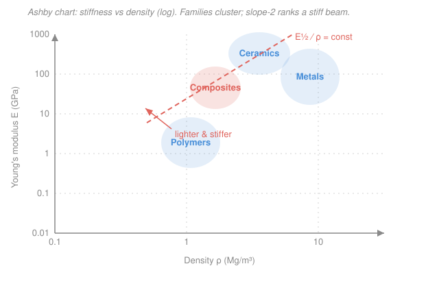

# Materials Science & Engineering · Lesson 5.3: The materials classes

> ⏱ ~15 min · Module 5: Functional Properties & the Materials Classes · Builds on: the whole course — bonding [1.1](01-01-bonding-energy-well.md), dislocations [2.2](02-02-dislocations-plastic-flow.md), elastic modulus [4.1](04-01-elastic-behavior-stress-strain.md), fracture toughness [4.4](04-04-failure-fracture-fatigue-creep.md), bands [5.1](05-01-electronic-properties-band-picture.md) · Unlocks: [`nuclear-materials`](../../nuclear-materials/syllabus.md) — where these same tradeoffs get re-run under a neutron flux

## Why this matters

Every design decision eventually becomes a material decision: what do I make this *out of*? This closing lesson is the payoff for the whole course. You've spent four modules learning that **structure sets property** — bond type sets stiffness, defects set strength, microstructure sets toughness. Now we cash that in. First we sort all engineering solids into four families whose behavior you can predict from their bonding alone, then we make selection quantitative with a single number — a **material index** — that tells you which family (and which member) wins a given job. This is exactly the reasoning a reactor designer uses to pick fuel and cladding, only with "survives a neutron flux" added to the constraint list.

## The idea

There are only four big families of engineering material, and you already know why each behaves as it does — it's all downstream of the bond.

- **Metals** bond by a shared *sea of electrons* ([1.1](01-01-bonding-energy-well.md)). That bond is strong but **non-directional**, so planes of atoms can slide past each other — dislocations glide easily ([2.2](02-02-dislocations-plastic-flow.md)). Result: **tough, ductile, dense, and conductive** (the free electrons carry both charge and heat). Steel, aluminum, copper.
- **Ceramics** bond ionically or covalently — **directional and charged**. Sliding a plane would shove like charges together, so dislocations are locked. Result: **hard, stiff, high-melting — but brittle** (no way to blunt a crack by flowing, so it just runs; low fracture toughness, [4.4](04-04-failure-fracture-fatigue-creep.md)). Alumina, silicon carbide, diamond, glass, and the fuel pellet [`nuclear-materials`](../../nuclear-materials/syllabus.md) runs on.
- **Polymers** are long covalent chains held *to each other* by weak **van der Waals** forces. Stretching one means pulling those weak secondary bonds apart, so the stiffness is set by the *weak* link. Result: **light, compliant, low-melting, easily formed.** Polyethylene, nylon, epoxy.
- **Composites** cheat by combining two families — stiff, strong fibers in a light, forgiving matrix — to reach property combinations no single family can. Carbon-fiber-reinforced polymer (**CFRP**) buys ceramic-like stiffness at polymer-like weight.

Selecting between them isn't taste. If your goal is "stiff but light," there's a *number* that ranks candidates, and — surprisingly — it isn't just "pick the stiffest material." A light stiff **beam** ranks materials differently than a light stiff **tie**, because bending rewards putting material far from the axis, which you get for free by making a low-density part *thicker*. That's the whole trick of the material index.

## The formal version

**The four classes, structure to property.** Read this table as one causal chain — bond in the first column drives everything to its right.

| Class | Bond | Why | Signature properties |
|---|---|---|---|
| Metals | metallic (electron sea) | non-directional → dislocations glide; free electrons | tough, ductile, dense, conductive; moderate–high $E$ |
| Ceramics | ionic / covalent | directional & charged → dislocations locked | hard, stiff, high-melting, **brittle**; usually insulating |
| Polymers | covalent chains + van der Waals | secondary bonds are the weak link | light, compliant, low-melting, formable |
| Composites | two classes together | stiff fiber + light matrix | tunable — high $E$ and strength at low $\rho$ |

**The material index.** For a component we want to make **as light as possible** while meeting a **stiffness** target, define a **material index** $M$ — a group of material properties, built so that *maximizing $M$ minimizes the mass*. Which properties enter depends on the loading:

$$M_\text{tie} = \frac{E}{\rho}, \qquad M_\text{beam} = \frac{E^{1/2}}{\rho}, \qquad M_\text{strong beam} = \frac{\sigma_y^{2/3}}{\rho},$$

where $E$ is Young's modulus (GPa, [4.1](04-01-elastic-behavior-stress-strain.md)), $\sigma_y$ the yield strength (MPa, [4.2](04-02-plastic-deformation-schmid.md)), and $\rho$ the density (Mg/m³). *In words: for a light–stiff **rod pulled in tension**, maximize $E/\rho$; for a light–stiff **beam in bending**, maximize $E^{1/2}/\rho$; for a light–**strong** beam, maximize $\sigma_y^{2/3}/\rho$.* The fractional powers are what make bending different from pulling — they come from the geometry, derived in Example 1.

**The selection workflow.** Four questions, in order:

1. **Function** — what does the part do? (carry a bending load, insulate, conduct heat…)
2. **Objective** — what are we minimizing? (mass, cost, energy…)
3. **Constraint** — what must be met, and what's free? (stiffness required; length fixed; cross-section free to change.)
4. **Index** — the property group that, maximized, satisfies 2 subject to 3. Read it off an **Ashby chart**.

*In words: translate the design goal into "maximize this one number," then find the material that maximizes it.*

**Reading an Ashby chart.** Plot every material's $\log E$ against its $\log \rho$ ([Picture](#picture)). Families cluster into blobs. A material index of the form $E^{1/n}/\rho = C$ becomes, on log–log axes, a **straight line of slope $n$**: taking logs of $E^{1/2}/\rho = C$ gives $\log E = 2\log\rho + \text{const}$, slope 2. Slide that guideline toward the upper-left (lower $\rho$, higher $E$) and the last family it touches is your winner.

## Picture

The guideline has slope 2 because it is a contour of constant $E^{1/2}/\rho$; "better" means pushing it up and to the left. Notice composites and ceramics sit *above* metals along that direction — for a stiff, light beam they beat steel, even though a lump of steel is stiffer than a lump of polymer.

## Worked examples

**Example 1 (derive the beam index $E^{1/2}/\rho$).** We want the lightest beam of fixed length $L$ and a required bending stiffness $S$. Take a square cross-section, side $b$ (free to choose). The bending stiffness of a beam scales as

$$S = \frac{C_1 E I}{L^3}, \qquad I = \frac{b^4}{12},$$

where $I$ (m⁴) is the second moment of area and $C_1$ is a constant fixed by how it's loaded and supported. The mass is $m = \rho\,(b^2)\,L$. The move: **eliminate the free variable $b$** using the constraint, so mass depends only on material properties. From the stiffness requirement,

$$S = \frac{C_1 E b^4}{12 L^3} \;\Longrightarrow\; b^2 = \left(\frac{12\,S\,L^3}{C_1\,E}\right)^{1/2}.$$

Substitute into the mass:

$$m = \rho L\, b^2 = \underbrace{\left(\frac{12\,S}{C_1}\right)^{1/2} L^{5/2}}_{\text{fixed by the design}}\;\cdot\;\frac{\rho}{E^{1/2}}.$$

Everything in the brace is set by the specification, not the material. So $m$ is smallest when $\rho/E^{1/2}$ is smallest — i.e. when $M_\text{beam}=E^{1/2}/\rho$ is **largest**. That's the index, and the $\tfrac12$ power is a direct fingerprint of bending stiffness scaling as $b^4$ while mass scales as $b^2$.

**Rank two candidates.** Steel ($E=210$ GPa, $\rho=7.8$ Mg/m³) versus aluminum alloy ($E=70$ GPa, $\rho=2.7$ Mg/m³):

$$M_\text{steel} = \frac{\sqrt{210}}{7.8} = \frac{14.5}{7.8} = 1.86, \qquad M_\text{Al} = \frac{\sqrt{70}}{2.7} = \frac{8.37}{2.7} = 3.10.$$

Aluminum wins. For the *same* bending stiffness, mass scales as $1/M$, so the steel beam is $3.10/1.86 = 1.67\times$ **heavier** — even though steel is 3× stiffer as a bulk material. (Do the *tie* version, $E/\rho$: steel $26.9$ vs. Al $25.9$ — a near tie. Aluminum's advantage lives entirely in bending. This is why airframes are aluminum, not steel.)

**Example 2 (pick a class from structure).** Two goals, opposite answers:

- **A lathe cutting-tool tip.** Function: hold a sharp edge while abrading hot metal. Constraint: extreme **hardness** and hot-hardness; the tip sees mostly *compression*, so brittleness is tolerable. → **Ceramic** (alumina, tungsten carbide, cubic boron nitride). *Why from structure:* directional ionic/covalent bonds lock dislocations, so the material resists the plastic scratching that dulls an edge, and the high bond energy keeps it hard when the cut runs hot. Its Achilles' heel — low toughness — doesn't bite, because the tip isn't loaded in tension.
- **A car bumper.** Function: absorb a low-speed impact without shattering, and stay light for fuel economy. Constraint: **toughness** and low density; stiffness secondary. → **Polymer or polymer composite** (e.g. glass-reinforced polypropylene). *Why from structure:* polymer chains uncoil and slide, soaking up impact energy in a large, forgiving deformation, at a third the density of steel. A ceramic bumper would be stiff and hard — and would explode into fragments on the first curb, because it has no mechanism to blunt a crack.

Same physics — dislocation mobility and crack tolerance — pointing two different directions because the *function* is different.

## Watch out

- **You might think "light and stiff" just means "pick the stiffest material and machine it thin."** But for a *beam* the index is $E^{1/2}/\rho$, not $E$: a low-density material lets you make the section thicker for the same mass, and bending stiffness rewards thickness as $b^4$. That's why balsa, foam-cored panels, and CFRP beat solid steel per kilogram in bending.
- **You might think ceramics are the "strong" material because they're hard and high-modulus.** Hard and stiff, yes; *tough*, no. Ceramics have terrible fracture toughness ([4.4](04-04-failure-fracture-fatigue-creep.md)) — they carry huge loads in compression but crack from a tiny flaw in tension. "Strong" always needs the qualifier: strong in *which* mode?
- **You might think the material index is a fixed property of a material.** It isn't — it's a property of the **problem**. The same aluminum that loses to steel on stiffness-per-volume wins on stiffness-per-mass-in-bending. Change the function (tie vs. beam vs. panel) or the objective (mass vs. cost) and the ranking reshuffles.

## One-liner

> Bond type sets the family and its properties; a material index — $E/\rho$ for a tie, $E^{1/2}/\rho$ for a beam — turns "which material?" into "maximize this one number on the Ashby chart."

## Problems

**P1 (🟢)** A structural panel must be as light as possible for a required *bending* stiffness. You're choosing between CFRP ($E=100$ GPa, $\rho=1.6$ Mg/m³) and a titanium alloy ($E=115$ GPa, $\rho=4.5$ Mg/m³). Compute the light-stiff-beam index for each and say which wins, and by what mass ratio for equal stiffness.

**P2 (🟡)** Classify each part and justify from bonding: (a) a window pane, (b) a copper wire, (c) a nonstick frying-pan handle. For each, name the class, one property that makes it right, and the structural reason.

**P3 (🔴)** For a light–stiff **tie** (axial tension, stiffness $S=EA/L$ with area $A$ free, length $L$ fixed), derive the index by eliminating $A$, and show it is $E/\rho$ — a *different* power of $E$ than the beam. Explain in one sentence why the beam gets the square root and the tie doesn't.

Solutions

**P1** Beam index $M = E^{1/2}/\rho$:

$$M_\text{CFRP} = \frac{\sqrt{100}}{1.6} = \frac{10}{1.6} = 6.25, \qquad M_\text{Ti} = \frac{\sqrt{115}}{4.5} = \frac{10.72}{4.5} = 2.38.$$

CFRP wins. For equal bending stiffness, mass $\propto 1/M$, so the titanium panel is $6.25/2.38 = 2.6\times$ heavier.

*Check.* Titanium is slightly *stiffer* in bulk ($115>100$ GPa) yet loses badly — its 2.8× higher density dominates once you're paying by mass in bending. Units: $\sqrt{\mathrm{GPa}}/(\mathrm{Mg/m^3})$ is consistent across both, so the ratio is meaningful. ✓

**P2**
- (a) **Window pane → ceramic** (silica glass). Property: transparent and hard/scratch-resistant. Structure: covalent/ionic network with a wide band gap ([5.1](05-01-electronic-properties-band-picture.md)) — no electronic states to absorb visible light, and locked bonds give hardness. (Its brittleness is why windows crack rather than dent.)
- (b) **Copper wire → metal.** Property: high electrical conductivity (and ductile enough to draw into wire). Structure: the delocalized electron sea carries current, and non-directional bonding lets dislocations glide so it draws without fracturing.
- (c) **Frying-pan handle → polymer** (e.g. phenolic/Bakelite). Property: low thermal conductivity — it stays cool. Structure: no free electrons and weak van der Waals coupling between chains, so heat conducts poorly; also light and cheaply molded.

**P3** Constraint: stiffness $S = EA/L$ must be met, $A$ free, $L$ fixed. Solve for the free variable: $A = SL/E$. Mass:

$$m = \rho A L = \rho L \cdot \frac{SL}{E} = \underbrace{S L^2}_{\text{fixed}} \cdot \frac{\rho}{E}.$$

Minimizing mass maximizes $E/\rho$. The **tie** gives a *first* power of $E$ because both its stiffness ($\propto A$) and its mass ($\propto A$) scale the same way with the free cross-section, so $A$ cancels linearly. The **beam** gets a *square root* because bending stiffness scales as $b^4$ while mass scales as $b^2$ — the mismatch in powers is exactly what leaves $E^{1/2}$ behind after eliminating $b$.

*Check.* Both indices put $\rho$ in the denominator (lighter is always better) and $E$ on top (stiffer is always better); only the *power* of $E$ differs, and it tracks the geometry of the load path. ✓

## Flashback

**From Lesson 5.2 (Semiconductors, optics & thermal response):** Gallium arsenide (GaAs) has a band gap $E_g = 1.42$ eV. Find the longest wavelength of light it can absorb, and state whether it is transparent or absorbing at $\lambda = 1.5\ \mu\mathrm{m}$ (a telecom wavelength). Use $hc = 1240\ \mathrm{eV\cdot nm}$.

Solution

A photon is absorbed only if it carries at least the gap energy — it must lift an electron across $E_g$. The threshold ("absorption edge") is where photon energy equals the gap, $E = hc/\lambda = E_g$:

$$\lambda_\text{max} = \frac{hc}{E_g} = \frac{1240\ \mathrm{eV\cdot nm}}{1.42\ \mathrm{eV}} = 873\ \mathrm{nm} \approx 0.87\ \mu\mathrm{m}.$$

Photons *longer* than 873 nm (lower energy) can't bridge the gap and pass through; shorter ones are absorbed. At $\lambda = 1.5\ \mu\mathrm{m} = 1500\ \mathrm{nm} > 873\ \mathrm{nm}$, GaAs is **transparent** — its photon energy $1240/1500 = 0.83$ eV is below the 1.42 eV gap.

*Check.* Units: $(\mathrm{eV\cdot nm})/\mathrm{eV} = \mathrm{nm}$ ✓. Sanity: 873 nm sits just past the red end of the visible ($\sim700$ nm), so GaAs absorbs all visible light and looks opaque/dark — consistent with it being an optoelectronic (LED/laser) material. ✓

## Connections

- **Backward:** this lesson ties the whole course together — the four classes' properties are exactly the bond-and-defect story from [1.1](01-01-bonding-energy-well.md) (why metals bond non-directionally), [2.2](02-02-dislocations-plastic-flow.md) (why dislocation glide makes metals ductile and its absence makes ceramics brittle), [4.1](04-01-elastic-behavior-stress-strain.md) ($E$), [4.4](04-04-failure-fracture-fatigue-creep.md) (toughness), and [5.1](05-01-electronic-properties-band-picture.md) (why ceramics with wide gaps are transparent insulators).
- **Forward:** [`nuclear-materials`](../../nuclear-materials/syllabus.md) runs this exact selection logic under a neutron flux. A fuel is chosen ceramic (UO₂) for a high melting point and dimensional stability; cladding is chosen from zirconium alloys and steels for a *new* index that adds low neutron absorption and resistance to radiation-induced swelling and embrittlement to the mechanical constraints you just used. The function–objective–constraint–index workflow is identical; only the constraint list grows.
- **Sideways:** the material-index method is the same constrained-optimization move you meet everywhere — eliminate a free variable using a constraint, then minimize an objective in what's left. It's mechanical design's cousin of the Lagrange-multiplier trick from calculus (minimize cost subject to a fixed performance requirement), just done by algebra because there's a single free variable.
