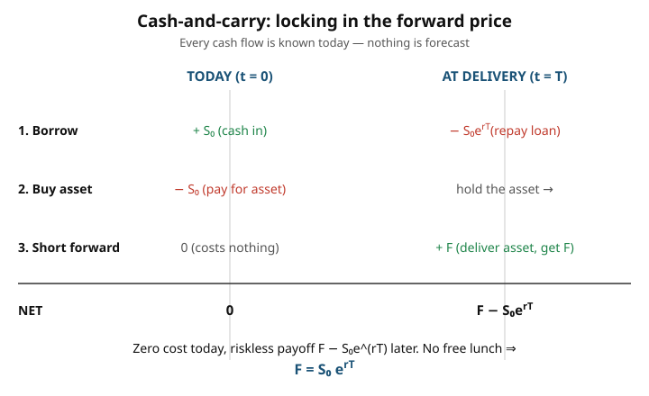

# Mathematical Finance · Lesson 1.1: Arbitrage and the law of one price

> ⏱ ~15 min · Module 1: No-arbitrage and risk-neutral pricing · Builds on: your [stochastic calculus and measure-theoretic probability](../../probability-theory/syllabus.md) background · Unlocks: [1.2 Replication and complete markets](01-02-replication-complete-markets.md)

## Why this matters

Here is the single idea the whole course is built on, and it is almost embarrassingly cheap: **you can price things you cannot forecast.** You have no idea what a stock will be worth in a year — but you can pin down, to the penny and with no probability distribution at all, what a *contract to buy that stock in a year* must cost today. The lever is the refusal to leave free money lying on the table. If two things deliver the same cash in every possible future, they must cost the same now; otherwise someone buys the cheap one, sells the dear one, and pockets the difference at zero risk. Markets full of people looking for exactly that force prices into rigid relationships. Those relationships — not forecasts — are what we compute. Everything later (risk-neutral measures, Black–Scholes, the term structure) is this one move, dressed for continuous time.

## The idea

Set the whole world on a single sheet of paper: **finitely many states of the world**, one of which will occur at time $T$, and a handful of traded assets. A *portfolio* is just a basket of those assets; its **payoff** is the vector of what it's worth in each state, and its **price** is what you pay for the basket today. That's the entire stage.

An **arbitrage** is a portfolio that is *free money*: it never loses, and it makes a profit for free. Two flavors, and it's worth keeping them straight:

- **Type A** — you pay nothing (or are paid) to set it up, $\text{cost} \le 0$ today, and later the payoff is $\ge 0$ in *every* state with a *strictly* positive payoff in *at least one*. You put in nothing and have a real shot at coming out ahead, with no downside.
- **Type B** — you are *paid* to enter, $\text{cost} < 0$ today, and later the payoff is $\ge 0$ in every state. You get handed cash now to hold a position that can never cost you anything later.

Both are "something for nothing." A market with either is broken; real markets have people (and machines) who erase them in milliseconds. So we *assume no arbitrage* and see what that assumption alone forces.

What it forces immediately is the **law of one price**: if two portfolios have *identical payoffs in every state*, they have *identical prices today*. Why — if portfolio $X$ were cheaper than portfolio $Y$ with the same payoff, buy $X$, sell $Y$, collect the price gap today, and at $T$ the two payoffs cancel exactly. That's a Type B arbitrage. No arbitrage $\Rightarrow$ no price gap. This one sentence is the engine.

## The formal version

Let there be states $\omega_1, \dots, \omega_K$ and a portfolio with price $P_0 \in \mathbb{R}$ today and payoff vector $P_T = (P_T(\omega_1), \dots, P_T(\omega_K)) \in \mathbb{R}^K$ at time $T$.

**Arbitrage (no reference to probabilities of states, only which are possible).** A portfolio is an arbitrage if either
$$P_0 \le 0,\quad P_T(\omega) \ge 0\ \forall \omega,\quad P_T(\omega) > 0 \text{ for some } \omega \qquad (\text{Type A}),$$
$$\text{or}\qquad P_0 < 0,\quad P_T(\omega) \ge 0\ \forall \omega \qquad (\text{Type B}).$$
*In words:* a position that can't lose and either costs nothing while it might win, or pays you upfront while it can't lose.

**Law of one price.** If two portfolios satisfy $X_T(\omega) = Y_T(\omega)$ for every state $\omega$, then no-arbitrage forces $X_0 = Y_0$. *In words:* same future cash in all scenarios $\Rightarrow$ same price now.

Notice what is **absent**: nowhere did a state's *probability* or the asset's *expected return* appear. Prices are fixed by the *pattern of payoffs across states*, not by how likely any state is or how the asset is expected to drift. That absence is the philosophy of the entire course — we will even build a special "probability" measure later whose only job is to make this pricing bookkeeping automatic, and it will deliberately *not* be the real-world probability.

**The workhorse consequence: the forward price.** A *forward contract* locks in today the price $F$ at which you'll buy one unit of an asset at delivery date $T$; no cash changes hands until $T$. Take a non-dividend asset with spot price $S_0$ and a continuously compounded riskless rate $r$ (a bond paying $1$ at $T$ costs $e^{-rT}$ today). Then no-arbitrage forces
$$\boxed{F = S_0\,e^{rT}}\qquad\text{(discretely compounded: } F = S_0(1+r)^T\text{).}$$
*In words:* the fair forward price is just today's spot carried forward at the riskless rate — the cost of borrowing the money to hold the asset until delivery.

**Why, by cash-and-carry.** Build the delivery yourself. Today: borrow $S_0$ and buy one unit of the asset — net cost $0$. Also enter the forward as the *short* (you'll deliver), which costs nothing to enter. At $T$: deliver the unit into the forward and collect $F$, then repay the loan $S_0 e^{rT}$. You put in $0$ today; you collect $F - S_0 e^{rT}$ at $T$ with *certainty*. If $F > S_0 e^{rT}$ that's a riskless profit (Type A) — so it can't stand. If $F < S_0 e^{rT}$, run the whole thing in reverse (short the asset, lend $S_0$, go long the forward) for a riskless profit the other way. The only price leaving no free lunch is $F = S_0 e^{rT}$. We never asked where $S_T$ will land.

## Picture

## Worked examples

**Example 1 (mechanical — a forward price).** A non-dividend stock trades at $S_0 = 80$ dollars. The continuously compounded rate is $r = 5\%$, and delivery is in $T = 0.5$ years. Then
$$F = S_0 e^{rT} = 80\, e^{0.05 \times 0.5} = 80\, e^{0.025} = 80 \times 1.02532 \approx 82.03 \text{ dollars.}$$
That's the *only* forward price consistent with no free lunch — no view on the stock required.

**Example 2 (exploiting a mispricing, both directions).** Same stock but with $S_0 = 50$, $r = 6\%$, $T = 1$, so the fair forward is $F^* = 50\, e^{0.06} = 53.09$ dollars. Suppose a dealer misquotes it.

*Quote too high, $F = 55$.* Sell the expensive thing (the forward), manufacture it cheaply (cash-and-carry):

| Leg | Today ($t=0$) | At $T=1$ |
|---|---|---|
| Short forward at $F=55$ | $0$ | $55 - S_T$ |
| Borrow $S_0$ | $+50$ | $-50\,e^{0.06} = -53.09$ |
| Buy 1 share | $-50$ | $+S_T$ |
| **Net** | $\mathbf{0}$ | $\mathbf{+1.91}$ |

Zero in, $1.91$ dollars out for certain — the $S_T$ terms cancel. That is the arbitrage that pushes $F$ back down.

*Quote too low, $F = 51$.* Buy the cheap forward, run cash-and-carry in reverse (short the share, lend the proceeds):

| Leg | Today ($t=0$) | At $T=1$ |
|---|---|---|
| Long forward at $F=51$ | $0$ | $S_T - 51$ |
| Short 1 share | $+50$ | $-S_T$ |
| Lend $S_0$ | $-50$ | $+50\,e^{0.06} = +53.09$ |
| **Net** | $\mathbf{0}$ | $\mathbf{+2.09}$ |

Again riskless profit, pushing $F$ back up. Trapped from both sides, the quote has exactly one arbitrage-free resting point: $F = S_0 e^{rT}$.

## Watch out

- **"The forward price is the market's forecast of $S_T$."** No. $F = S_0 e^{rT}$ is a *carry cost*, built from today's spot and the interest rate only. Two assets with wildly different expected returns but the same spot have the *same* forward. Expected future price never enters — that's the whole point.
- **"Arbitrage depends on the odds."** The definition uses only which states are *possible*, never their probabilities. A payoff that is $\ge 0$ in every possible state is an arbitrage regardless of whether the good states are likely — you only need them possible.
- **Frictions are real.** The clean argument assumes you can borrow and lend at the same $r$, short-sell freely, and trade without cost. Bid–ask spreads, borrowing fees, and shorting limits create a *no-arbitrage band* around $S_0 e^{rT}$ rather than a single point. The logic is unchanged; the equality becomes a narrow interval.
- **Dividends and carry costs shift the anchor.** If holding the asset *pays* you (a dividend) or *costs* you (storage), the cash-and-carry ledger gains a line and $F$ moves off $S_0 e^{rT}$ — see P3.

## One-liner

> Price by ruling out free money, never by forecasting: identical payoffs command identical prices, and a forward is just today's spot carried to delivery at the riskless rate.

## Problems

**P1 (🟢)** (a) A non-dividend stock trades at $S_0 = 120$ dollars; the continuously compounded rate is $r = 3\%$ and delivery is in $T = 2$ years. Find the arbitrage-free forward price. (b) Separately, a one-year forward on a different non-dividend stock is quoted at $F = 130$ dollars with $r = 4\%$. What spot price $S_0$ does no-arbitrage imply?

**P2 (🟡)** A one-year forward on a non-dividend stock is quoted at $F = 105$ dollars. The stock trades at $S_0 = 100$ and the one-year continuously compounded rate is $r = 3\%$ (so a bond paying $1$ dollar in a year costs $e^{-0.03}$ today). Exhibit two portfolios of stock and bond that have the *same* payoff at $T$ but different prices today, and write out the trade — with today-and-$T$ cash flows — that harvests the gap. State the riskless profit.

**P3 (🔴)** Now the asset pays a **known cash dividend** of $D = 3$ dollars at time $t_d = 0.5$ years (think: a stock going ex-dividend mid-life of the contract). With $S_0 = 100$, $r = 4\%$ continuously compounded, and $T = 1$: redo the cash-and-carry ledger to find the arbitrage-free forward price, and give the general formula. (Hint: while you carry the asset to $T$, you *receive* the dividend at $t_d$ and can reinvest it at $r$.)

Solutions

**P1.** (a) $F = S_0 e^{rT} = 120\, e^{0.03 \times 2} = 120\, e^{0.06} = 120 \times 1.06184 \approx 127.42$ dollars. (b) Invert: $S_0 = F e^{-rT} = 130\, e^{-0.04} = 130 \times 0.96079 \approx 124.90$ dollars. (Spot is the forward discounted back — same relation, read the other way.)

**P2.** The fair forward is $S_0 e^{rT} = 100\, e^{0.03} = 103.05$, so the quote $F = 105$ is too high. Two portfolios both delivering $S_T$ at $T$:

- **Portfolio A:** buy one share today. Cost $= 100$. Payoff at $T = S_T$.
- **Portfolio B:** go long the forward (cost $0$; payoff $S_T - 105$) *and* buy a bond paying $105$ at $T$ (cost $105\,e^{-0.03} = 105 \times 0.97045 = 101.90$). Payoff at $T = (S_T - 105) + 105 = S_T$. Cost $= 101.90$.

Same payoff $S_T$ in every state, but $A$ costs $100$ and $B$ costs $101.90$ — a law-of-one-price violation of $1.90$. **Buy cheap $A$, short dear $B$.** Concretely: buy the share ($-100$), short the forward ($0$; you must deliver a share for $105$ at $T$), and sell the $105$-bond, i.e. borrow, receiving $+101.90$ today.

| Leg | Today | At $T=1$ |
|---|---|---|
| Buy 1 share | $-100$ | $+S_T$ |
| Short forward at $105$ | $0$ | $105 - S_T$ |
| Sell bond (borrow) | $+101.90$ | $-105$ |
| **Net** | $\mathbf{+1.90}$ | $\mathbf{0}$ |

You collect $1.90$ dollars today and owe nothing ever: at $T$ you hand your share into the short forward for $105$ and use it to repay the bond. Riskless profit $\approx 1.90$ dollars, equal to $(F - S_0 e^{rT})e^{-rT} = (105 - 103.05)(0.97045) = 1.90$. ✓

**P3.** Carry the asset but credit the dividend. Today: borrow $S_0$, buy one share (net $0$), and short the forward (net $0$). At $t_d = 0.5$: collect the dividend $D = 3$ and reinvest it at $r$, so by $T$ it has grown to $D\,e^{r(T - t_d)}$. At $T$: deliver the share into the forward for $F$, repay the loan $S_0 e^{rT}$, and you still hold the grown dividend. The certain time-$T$ net is
$$F + D\,e^{r(T - t_d)} - S_0 e^{rT}.$$
No-arbitrage forces this to $0$, giving the general formula
$$F = S_0 e^{rT} - D\,e^{r(T - t_d)} = \big(S_0 - D e^{-r t_d}\big)e^{rT}.$$
*In words:* the dividend you'll pocket lowers the effective cost of carrying the asset, so the forward drops by the future value of that dividend (equivalently, carry the spot *net of* the dividend's present value). Numerically:
$$D\,e^{r(T-t_d)} = 3\,e^{0.04 \times 0.5} = 3\,e^{0.02} = 3.061,\qquad S_0 e^{rT} = 100\,e^{0.04} = 104.081,$$
$$F = 104.081 - 3.061 \approx 101.02 \text{ dollars.}$$
Check via the other form: $\big(100 - 3e^{-0.02}\big)e^{0.04} = (100 - 2.941)(1.04081) = 97.059 \times 1.04081 \approx 101.02$. ✓ (A *storage cost* $c$ paid to hold the asset flips the sign — it *raises* $F$ to $S_0 e^{rT} + c\,e^{r(T-t_c)}$ — because now carrying costs you extra rather than paying you.)

## Connections

- **Backward:** the discounting here is the same machine as the perpetuity/present-value idea from the calculus refresher — a future dollar is worth $e^{-rT}$ today, and $F = S_0 e^{rT}$ is that relation run *forward*. Everything is "carry at the riskless rate."
- **Forward:** [1.2 Replication and complete markets](01-02-replication-complete-markets.md) generalizes Example-2's trick — we built the forward's payoff out of a stock and a bond, and *replication* asks which payoffs (options included) can be manufactured that way. Price = cost of the replicating portfolio, by exactly today's law of one price.
- **Sideways (micro):** "no arbitrage" is the finance name for the general-equilibrium *no-free-lunch* condition — an allocation where no costless trade makes you better off in some state and worse off in none. The pricing functional we're about to build is the market's version of a supporting price vector from the [grad-micro](../../grad-micro/syllabus.md) welfare theorems.
