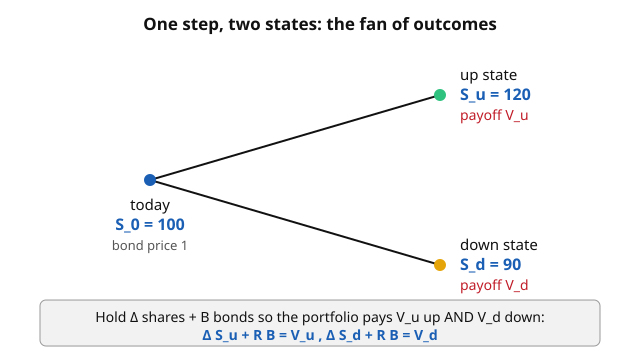

# Mathematical Finance · Lesson 1.2: Replication and complete markets

> ⏱ ~15 min · Module 1: No-arbitrage and risk-neutral pricing · Builds on: [1.1 Arbitrage and the law of one price](01-01-arbitrage-law-of-one-price.md) · Unlocks: [1.3 The one-period model and the pricing measure](01-03-one-period-model-pricing-measure.md)

## Why this matters

Lesson 1.1 gave you a slogan: two things with the same payoff must have the same price, or there's free money. But it left the crucial question open — *how do you find something with the same payoff as the derivative you're trying to price?* This lesson is the answer, and it's the engine of the entire course. The trick is not to forecast whether the stock rises. It's to build a **portfolio of things you can already trade** — a stock, a bond — whose value moves in lockstep with the derivative in *every* future state. Match the payoff, and the law of one price hands you the price for free. Get this and Black–Scholes is just the same move in continuous time.

## The idea

You want to price some derivative that pays $V_u$ if the market goes up and $V_d$ if it goes down. You don't know its price. But suppose you can assemble a portfolio out of assets you *do* know the price of — a stock and a bond — that pays exactly $V_u$ up and exactly $V_d$ down. Then that portfolio and the derivative are the **same payoff wearing two labels**. If their prices differed, you'd buy the cheap one, sell the dear one, and pocket the gap with zero risk — an arbitrage. So the law of one price forces

$$\text{price of derivative} = \text{price of the replicating portfolio}.$$

The portfolio doesn't just *bound* the price; it *pins* it to a single number, computed from prices you already observe. No probabilities, no risk preferences, no view on the market — just payoff-matching plus "no free lunch." That's the whole idea. The rest is the linear algebra of when the matching is possible.

## The formal version

**The one-period model.** One date now ($t=0$), one date later ($t=1$), and two possible states at $t=1$: "up" and "down." Two traded assets:

- A **bond**: costs $1$ today, pays the gross riskless return $R = 1+r$ in *both* states ($r$ is the per-period interest rate).
- A **stock**: costs $S_0$ today, worth $S_u$ up and $S_d$ down, with $S_u > S_d$.

A **portfolio** is a pair $(\Delta, B)$: hold $\Delta$ shares of stock and put $B$ dollars in the bond. Its cost today is $\Delta S_0 + B$, and at $t=1$ it pays $\Delta S_u + RB$ up, $\Delta S_d + RB$ down.

**Replication.** To replicate a target payoff $(V_u, V_d)$, solve the two linear equations

$$\Delta S_u + R B = V_u, \qquad \Delta S_d + R B = V_d.$$

*In words: pick share count and bond dollars so the portfolio pays the target in each state.* Subtract the equations — the bond term cancels because the bond pays $R$ either way — and

$$\boxed{\ \Delta = \dfrac{V_u - V_d}{S_u - S_d}\ }, \qquad B = \frac{V_u - \Delta S_u}{R}.$$

The share count $\Delta$ (the **delta**, or hedge ratio) is the *slope*: how much the target's payoff changes per dollar of stock-payoff change. Once you have $(\Delta, B)$, the derivative's only arbitrage-free price is the portfolio's cost today:

$$\boxed{\ V_0 = \Delta S_0 + B\ }.$$

**Spanning and completeness.** Think of a payoff as a vector in $\mathbb{R}^2$: coordinates $(\text{up value}, \text{down value})$. Each traded asset is such a vector — the bond is $(R, R)$, the stock is $(S_u, S_d)$. The set of payoffs you can build is the **span** of these vectors (all linear combinations $\Delta(S_u,S_d) + B(R,R)$). A market is **complete** when that span is *all* of payoff space — every conceivable $(V_u, V_d)$ is replicable.

*In words: complete = every payoff you can dream up can be manufactured from traded assets.* The condition is a rank count: **the number of independent traded assets must be at least the number of states.** Two states, two independent assets (a stock and a bond that aren't scalar multiples — true whenever $S_u/S_d \neq 1$) $\Rightarrow$ the two vectors span $\mathbb{R}^2 \Rightarrow$ **complete**. Every derivative on this stock has a unique arbitrage-free price.

**Incompleteness.** Add a third possible state but keep only two assets. Now you have two vectors trying to span $\mathbb{R}^3$ — impossible; they span at most a 2-dimensional plane. Payoffs off that plane are **not replicable**, and for them arbitrage alone gives only a *range* of prices, not a number. Pricing then needs an extra ingredient (a choice of measure, a preference) — the theme of [1.4](01-04-fundamental-theorem-asset-pricing.md) and [4.5](04-05-incomplete-markets-model-risk.md).

## Picture

## Worked examples

**Example 1 (replicate and price a one-period call).** Take $S_0 = 100$, $S_u = 120$, $S_d = 90$, and a per-period rate $r = 12.5\%$ so $R = 1.125$ (a high toy rate, chosen to keep arithmetic clean). Price a call with strike $K = 105$: it pays $\max(S_1 - K, 0)$, so

$$V_u = \max(120 - 105, 0) = 15, \qquad V_d = \max(90 - 105, 0) = 0.$$

Delta first:

$$\Delta = \frac{V_u - V_d}{S_u - S_d} = \frac{15 - 0}{120 - 90} = \frac{15}{30} = 0.5.$$

Then the bond leg from the up equation: $0.5(120) + 1.125\,B = 15 \Rightarrow 60 + 1.125 B = 15 \Rightarrow B = -40$. (Negative: you *borrow* 40 dollars.) The price:

$$V_0 = \Delta S_0 + B = 0.5(100) - 40 = 10.$$

**Verify the hedge pays off in both states.** Up: $0.5(120) + 1.125(-40) = 60 - 45 = 15 = V_u$ ✓. Down: $0.5(90) + 1.125(-40) = 45 - 45 = 0 = V_d$ ✓. The call is worth exactly $10$ — buy half a share, borrow 40 dollars, and you *are* the call.

*Foreshadow of [1.3](01-03-one-period-model-pricing-measure.md):* define $q = \dfrac{R - S_d/S_0}{S_u/S_0 - S_d/S_0} = \dfrac{1.125 - 0.9}{1.2 - 0.9} = 0.75$. Then $\frac{1}{R}\big(q V_u + (1-q)V_d\big) = \frac{1}{1.125}(0.75 \cdot 15) = 10$ — the *same* price, re-expressed as a discounted expectation under a special "risk-neutral" probability. That reframing is the next lesson.

**Example 2 (incompleteness — the system goes inconsistent).** Three states $\{1,2,3\}$. Two assets: a bond paying $(1,1,1)$ (take $r=0$ here) and a stock paying $(3, 2, 1)$. Try to replicate the **Arrow security** that pays $1$ in state 1 and nothing otherwise, target $(1, 0, 0)$. We need $\Delta(3,2,1) + B(1,1,1) = (1,0,0)$:

$$3\Delta + B = 1, \qquad 2\Delta + B = 0, \qquad \Delta + B = 0.$$

Subtract the third from the second: $\Delta = 0$. Then $B = 0$. But the first equation demands $3(0) + 0 = 1$, i.e. $0 = 1$ — **contradiction**. No portfolio replicates $(1,0,0)$.

Geometrically: the two asset vectors span the plane $\{(x,y,z) : x - 2y + z = 0\}$ (check: $3 - 4 + 1 = 0$ and $1 - 2 + 1 = 0$ ✓). The target gives $1 - 0 + 0 = 1 \neq 0$, so it lies *off* the plane — unreachable. With three states and two assets the market is incomplete, and no amount of arbitrage reasoning prices that Arrow security.

## Watch out

- **$\Delta$ is a ratio of payoffs, not a probability.** It's the slope $\frac{\Delta V}{\Delta S}$ across states, and it can exceed 1 or go negative. It never involves how *likely* up or down is — the real-world probability of the stock rising plays **no role** in the price. That absence is the whole point, and it stuns everyone the first time.
- **"Complete" is about counting independent assets vs. states, not about how many assets you have.** Ten assets that are all scalar multiples of the bond still span a 1-dimensional line. What matters is the *rank* of the payoff matrix, not the number of columns.
- **Incompleteness doesn't mean "no information."** Arbitrage still bounds unreplicable payoffs to an interval — it just can't collapse the interval to a point. Pinning a single price then requires a modeling choice, and different honest choices give different prices (model risk, [4.5](04-05-incomplete-markets-model-risk.md)).
- **$B$ is dollars in the bond today, growing to $RB$; don't double-count the discounting.** The equations already carry $R$ on the payoff side, so $V_0 = \Delta S_0 + B$ uses $B$ raw.

## One-liner

> If you can build a traded portfolio that matches a derivative's payoff in every state, the law of one price *is* the pricing formula — and you can always build it exactly when independent assets outnumber (or tie) the states.

## Problems

**P1 (🟢)** A one-period market has $S_0 = 50$, $S_u = 75$, $S_d = 25$, and $r = 25\%$ (so $R = 1.25$). A derivative pays $(V_u, V_d) = (40, 10)$. Find the replicating $(\Delta, B)$ and the price $V_0$.

**P2 (🟡)** In the Example 1 market ($S_0 = 100$, $S_u = 120$, $S_d = 90$, $R = 1.125$), price a **digital (cash-or-nothing) call** that pays $1$ if the stock goes up and $0$ if it goes down — target $(1, 0)$. Find $(\Delta, B)$ and $V_0$, and check your price against the risk-neutral shortcut $V_0 = \frac{1}{R}\,q$ with $q = 0.75$ from Example 1.

**P3 (🔴)** A market has three states and two assets: a bond paying $(1,1,1)$ (take $r = 0$) and a stock paying $(4, 2, 1)$. (a) What is the dimension of the set of replicable payoffs? (b) Using the augmented-matrix rank test — a payoff $w$ is replicable iff adding it as a column doesn't raise the rank — decide which of $w_1 = (1,0,0)$ and $w_2 = (5,1,-1)$ can be replicated. (c) For the replicable one, find the portfolio $(\Delta, B)$.

Solutions

**P1.** Delta: $\Delta = \dfrac{40 - 10}{75 - 25} = \dfrac{30}{50} = 0.6$. Bond from the up equation: $0.6(75) + 1.25\,B = 40 \Rightarrow 45 + 1.25 B = 40 \Rightarrow B = -4$. Price: $V_0 = 0.6(50) + (-4) = 30 - 4 = 26$. Check down: $0.6(25) + 1.25(-4) = 15 - 5 = 10 = V_d$ ✓.

**P2.** $\Delta = \dfrac{1 - 0}{120 - 90} = \dfrac{1}{30}$. Bond: $\frac{1}{30}(120) + 1.125\,B = 1 \Rightarrow 4 + 1.125 B = 1 \Rightarrow B = -\frac{3}{1.125} = -\frac{8}{3}$. Price:

$$V_0 = \frac{1}{30}(100) - \frac{8}{3} = \frac{10}{3} - \frac{8}{3} = \frac{2}{3} \approx 0.667.$$

Risk-neutral check: $\frac{1}{R}\,q = \frac{1}{1.125}(0.75) = \frac{2}{3}$ ✓. (A digital is a bet on the *state*, so its price is exactly the discounted risk-neutral probability of that state — the Arrow-security price of Example 2, now nonzero because this two-state market is complete.)

**P3.** (a) The two asset payoff vectors $(1,1,1)$ and $(4,2,1)$ are not scalar multiples, so they're independent: the marketed subspace is a **2-dimensional** plane inside $\mathbb{R}^3$. Its rank is 2.

(b) The plane is $\{(x,y,z) : x - 3y + 2z = 0\}$ (normal $= (1,1,1)\times(4,2,1) = (-1,3,-2)$; check $1 - 3 + 2 = 0$ and $4 - 6 + 2 = 0$ ✓). Equivalently, $\operatorname{rank}[\,\text{bond}\;|\;\text{stock}\;|\;w\,] = 2$ iff $w$ satisfies this equation.
- $w_1 = (1,0,0)$: $1 - 0 + 0 = 1 \neq 0$ — augmenting raises the rank to 3, **not replicable**.
- $w_2 = (5,1,-1)$: $5 - 3 + (-2) = 0$ — rank stays 2, **replicable**.

(c) Replicate $w_2 = (5,1,-1)$: solve $\Delta(4,2,1) + B(1,1,1) = (5,1,-1)$, i.e. $4\Delta + B = 5$, $2\Delta + B = 1$, $\Delta + B = -1$. Subtract the third from the second: $\Delta = 2$. Then $B = -1 - \Delta = -3$. Check the first: $4(2) + (-3) = 5$ ✓, and $2(2) - 3 = 1$ ✓. Portfolio: $\Delta = 2$ shares, $B = -3$ in the bond (borrow 3).

## Connections

- **Backward:** this is [1.1](01-01-arbitrage-law-of-one-price.md)'s law of one price made constructive — 1.1 said equal payoffs force equal prices; here you *build* the equal payoff and read off the price.
- **Forward:** [1.3](01-03-one-period-model-pricing-measure.md) re-expresses the very same $V_0$ as a discounted expectation $\frac{1}{R}\mathbb{E}^{\mathbb{Q}}[V]$ under the risk-neutral measure (you already saw the seed, $q = 0.75$). [1.4](01-04-fundamental-theorem-asset-pricing.md) ties completeness to the *uniqueness* of that measure. In continuous time, [2.1](02-01-continuous-time-market-self-financing.md) upgrades the two-equation solve into a self-financing hedging strategy, and $\Delta$ becomes the Black–Scholes delta of [2.2](02-02-black-scholes-pde-delta-hedging.md).
- **Sideways (linear algebra):** replication is solving a linear system, completeness is a *spanning* condition, and incompleteness is a *rank deficiency* — payoff space, span, and rank straight out of the [linear algebra refresher](../../linalg-refresher/syllabus.md). Arrow securities are just the standard basis vectors of payoff space.
