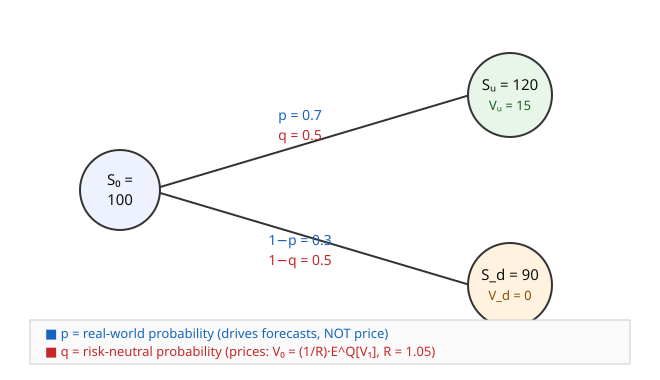

# Mathematical Finance · Lesson 1.3: The one-period model and the pricing measure

> ⏱ ~15 min · Module 1: No-arbitrage and risk-neutral pricing · Builds on: [1.2 Replication and complete markets](01-02-replication-complete-markets.md) · Unlocks: [1.4 The fundamental theorem of asset pricing](01-04-fundamental-theorem-asset-pricing.md)

## Why this matters

In [1.2](01-02-replication-complete-markets.md) you priced a derivative by *building* it — find the stock-and-bond portfolio that matches its payoff, and its cost today is the only arbitrage-free price. That works, but it's mechanical: solve two equations, read off a number. It hides a structure that turns out to be the entire subject. Take that same replication price, do nothing but algebra, and it reorganizes into a **discounted expectation** — as if the payoff were an ordinary gamble you average and discount. The catch is that the probabilities in that average are *not* the real-world odds. They're a synthetic set of weights, the **risk-neutral measure** $Q$, manufactured precisely so that pricing becomes averaging. Every pricing formula in this course — the binomial recursion, Black–Scholes, the whole Module 2 machine — is this one identity scaled up. Learn it here, on two states, where you can see all of it at once.

## The idea

The replication price $V_0 = \Delta S_0 + B$ is a weighted combination of two payoffs, $V_u$ (stock goes up) and $V_d$ (down). Regroup those weights and a clean thing happens: they turn into two numbers that are **positive and sum to one** — a probability distribution — divided by the riskless growth factor. So

$$V_0 = \frac{1}{R}\big[\,q\,V_u + (1-q)\,V_d\,\big],$$

where $R$ is one plus the riskless rate (the bond turns 1 dollar into $R$) and $q$ is a number cooked up from the stock's own up/down sizes. Read the bracket as an expected payoff and the $\tfrac{1}{R}$ as discounting it back to today: **price = discounted expected payoff.**

The twist is *whose* expectation. The real world has some probability $p$ that the stock rises — but $p$ appears *nowhere* in $V_0$. Replication doesn't care how likely "up" is; it hedges both states no matter what. So the $q$ in the formula can't be $p$. It's the probability that would make the stock a *fair bet* after discounting — the odds under which nobody is compensated for risk, everything just drifts up at the riskless rate. That's why it's called **risk-neutral**: it's the imaginary world where investors demand no risk premium, and — remarkably — prices computed in that fake world are the correct real-world prices, because they're the no-arbitrage prices.

## The formal version

**Setup.** One period, two dates ($t=0$ now, $t=1$ later). A **bond** (the *numéraire*, defined below): 1 dollar today grows to $R>0$. A **stock** worth $S_0$ today takes one of two values at $t=1$: $S_u = uS_0$ (up) or $S_d = dS_0$ (down), with $d < u$. A **derivative** pays $V_u$ or $V_d$ in those states.

**From replication to expectation.** The replicating portfolio ($\Delta$ shares, $B$ in the bond) solves $\Delta S_u + RB = V_u$ and $\Delta S_d + RB = V_d$, giving $\Delta = \frac{V_u - V_d}{S_u - S_d}$ and $V_0 = \Delta S_0 + B$. Substitute and collect terms on $V_u,V_d$ (done in full in Example 1):

$$\boxed{\,V_0 = \frac{1}{R}\big[q\,V_u + (1-q)\,V_d\big] = \frac{1}{R}\,\mathbb{E}^Q[V_1],\qquad q = \frac{R - d}{u - d}.\,}$$

*In words:* the arbitrage-free price is today's discount factor times the payoff averaged with the weights $q,1-q$. Note $q$ is built only from $u,d,R$ — the stock and bond — never from the derivative or from $p$.

**Why $q$ is a probability — and when.** $q + (1-q) = 1$ automatically. And

$$0 < q < 1 \iff d < R < u.$$

*In words:* $q$ is a genuine probability exactly when the riskless return sits strictly between the stock's down and up returns. That condition is precisely **no-arbitrage** (Problem 3): if $R \ge u$ the stock never beats the bond and you short it for free; if $R \le d$ it never loses to the bond and you lever into it. So *the pricing measure exists iff the market is arbitrage-free* — a first glimpse of the theorem in [1.4](01-04-fundamental-theorem-asset-pricing.md).

**The martingale property.** Apply the formula to the stock itself ($V_1 = S_1$):

$$\frac{1}{R}\,\mathbb{E}^Q[S_1] = \frac{1}{R}\big[q\,uS_0 + (1-q)\,dS_0\big] = S_0.$$

*In words:* under $Q$, the stock's **discounted** price $S_t/R^t$ doesn't drift — today's price is the discounted expected future price. That's the defining property of a **martingale** ("fair game"). Equivalently $\mathbb{E}^Q[S_1]/S_0 = R$: **under $Q$ every asset earns exactly the riskless rate.** Real drift $p$ is gone; risk premia are gone. This is the property that generalizes — in [2.3](02-03-risk-neutral-pricing-girsanov-feynman-kac.md), Girsanov is the continuous-time engine that produces exactly this $Q$.

**State prices (Arrow–Debreu).** Define $\psi_u$ = price today of a security paying 1 dollar if "up" happens and 0 otherwise; $\psi_d$ likewise for "down." These are the **state prices**. Any payoff is a bundle of Arrow securities, so

$$V_0 = \psi_u V_u + \psi_d V_d.$$

Matching this against the boxed formula, $\psi_u = q/R$ and $\psi_d = (1-q)/R$, i.e.

$$q = R\,\psi_u, \qquad 1-q = R\,\psi_d,\qquad \psi_u + \psi_d = \frac{1}{R}.$$

*In words:* the risk-neutral probability of a state is its state price **grown forward** at the riskless rate; conversely a state price is a risk-neutral probability discounted. And the two state prices sum to $1/R$ — the price of a sure dollar, i.e. the bond. Same object, two dialects: probabilists say $Q$, general-equilibrium economists say Arrow–Debreu prices (`grad-micro`).

**Numéraire.** The **numéraire** is the asset you quote all other prices *in units of* — here the bond, $B_0 = 1,\ B_1 = R$. "Discounting" is just dividing by it: $S_t/B_t$ is what the stock is worth in bond-units, and it's that ratio which is a $Q$-martingale. Choosing a *different* numéraire gives a different martingale measure for the same market — the freedom [4.3](04-03-forward-measures-changing-numeraire.md) exploits with the forward measure.

## Picture

A fully worked one-period tree. The two probability systems live on the same branches: **real** $p$ (blue) forecasts, **risk-neutral** $q$ (red) prices. Here $R = 1.05$, and $q = \frac{1.05 - 0.9}{1.2 - 0.9} = 0.5$ — nothing to do with the real $p = 0.7$.

Discounted-expectation pricing of the call ($V_u=15,\,V_d=0$): $V_0 = \frac{1}{1.05}\big[0.5\cdot 15 + 0.5\cdot 0\big] = \frac{7.5}{1.05} \approx 7.14$. The real odds $p=0.7$ never enter.

## Worked examples

**Example 1 (the algebra — replication becomes expectation).** With $\Delta = \frac{V_u - V_d}{S_u - S_d}$ and $RB = V_u - \Delta S_u$,

$$V_0 = \Delta S_0 + \frac{V_u - \Delta S_u}{R} = \frac{1}{R}\Big[V_u - \Delta\,(S_u - R S_0)\Big] = \frac{1}{R}\Big[V_u - \frac{(V_u - V_d)(S_u - R S_0)}{S_u - S_d}\Big].$$

Collect the $V_u$ and $V_d$ coefficients:

$$V_0 = \frac{1}{R}\left[\,V_u\underbrace{\frac{R S_0 - S_d}{S_u - S_d}}_{q} + V_d\underbrace{\frac{S_u - R S_0}{S_u - S_d}}_{1-q}\,\right],\qquad q = \frac{R S_0 - S_d}{S_u - S_d} = \frac{R - d}{u - d},$$

using $S_u = uS_0,\ S_d = dS_0$ in the last step. (Check the weights sum to 1: numerators $R S_0 - S_d$ and $S_u - R S_0$ add to $S_u - S_d$, the denominator. ✓)

*Numbers.* $S_0=100,\ u=1.2,\ d=0.9,\ R=1.05$, call with $K=105$: $V_u=\max(120-105,0)=15,\ V_d=\max(90-105,0)=0$. Then $q=0.5$ and $V_0 = \frac{7.5}{1.05} \approx 7.14$. **Verify against 1.2 replication:** $\Delta = \frac{15-0}{120-90}=0.5$, $B=\frac{15 - 0.5\cdot 120}{1.05}=\frac{-45}{1.05}=-42.86$, so $V_0 = 0.5\cdot 100 - 42.86 = 7.14$. ✓ Identical number — the discounted-expectation formula is replication wearing a probability costume.

**Example 2 (state prices, and "everything earns $R$").** Same market, $q=0.5$. State prices:

$$\psi_u = \frac{q}{R} = \frac{0.5}{1.05} \approx 0.4762,\qquad \psi_d = \frac{1-q}{R} = \frac{0.5}{1.05} \approx 0.4762,\qquad \psi_u+\psi_d \approx 0.9524 = \frac{1}{1.05}.$$

Now price *any* claim by dotting state prices with payoffs — no re-hedging. A digital that pays 200 up, 50 down:

$$V_0 = \psi_u\cdot 200 + \psi_d\cdot 50 = 0.4762\,(200) + 0.4762\,(50) \approx 119.05.$$

And confirm the numéraire claim on the stock: $\mathbb{E}^Q[S_1] = 0.5(120)+0.5(90) = 105$, so the stock's $Q$-expected return is $105/100 = 1.05 = R$. Under $Q$ the risky stock earns exactly the riskless rate — the risk premium that $p=0.7$ would create has been priced away.

## Watch out

- **$q$ is not $p$, ever.** The real probability drives forecasts and P&L expectations; it plays *zero* role in the arbitrage-free price. If a problem hands you $p$, it's usually bait. (The two coincide only in a knife-edge risk-neutral world — never assume it.)
- **$q$ must be strictly inside $(0,1)$.** $q=0$ or $q=1$ isn't "a valid edge case," it's a market with an arbitrage ($R=d$ or $R=u$). A negative $q$ means you mis-signed $u,d$ or the market is broken.
- **Discount with the numéraire's growth, not the stock's.** You divide by $R$ (the bond), never by the stock's return — the whole point of $Q$ is that it lets you discount at the riskless rate.
- **State prices price everything; deltas re-solve each time.** Once you have $\psi_u,\psi_d$ (equivalently $q$), any new payoff is one dot product. Don't redo the two-equation hedge for each claim unless you actually want the hedge.

## One-liner

> Replication's price is a discounted expectation under a manufactured "risk-neutral" measure $Q = R\cdot(\text{state prices})$ — the odds that make every asset drift at the riskless rate — and that measure exists exactly when the market has no arbitrage.

## Problems

**P1 (🟢)** A stock trades at $S_0 = 20$; in one period it's either $S_u = 24$ or $S_d = 15$. The bond gives $R = 1.05$. (a) Find the risk-neutral probability $q$. (b) Price a call with strike $K = 20$ by discounted risk-neutral expectation.

**P2 (🟡)** Same market as P1 ($S_0=20,\ S_u=24,\ S_d=15,\ R=1.05$). (a) Compute the state prices $\psi_u,\psi_d$. (b) Use them to price claim A (pays 10 up, 4 down) and claim B (pays 0 up, 9 down). (c) For claim A, build the replicating portfolio $(\Delta, B)$ and confirm its cost matches the state-price answer.

**P3 (🔴)** Show explicitly that $q = \frac{R-d}{u-d} \in (0,1)$ **iff** $d < R < u$. Then suppose instead $R \ge u$ (so the bond weakly dominates the stock): construct an explicit zero-cost portfolio that never loses and wins with positive probability, i.e. an arbitrage. What is $q$ at the boundary $R = u$, and why does that flag the same problem?

Solutions

**P1.** Up/down factors: $u = 24/20 = 1.2$, $d = 15/20 = 0.75$.
(a) $q = \dfrac{R-d}{u-d} = \dfrac{1.05 - 0.75}{1.2 - 0.75} = \dfrac{0.30}{0.45} = \dfrac{2}{3}$.
(b) Payoffs $V_u = \max(24-20,0) = 4$, $V_d = \max(15-20,0) = 0$. Then

$$V_0 = \frac{1}{1.05}\Big[\tfrac{2}{3}(4) + \tfrac{1}{3}(0)\Big] = \frac{8/3}{1.05} = \frac{2.6667}{1.05} \approx 2.54.$$

**P2.** With $q = 2/3$:
(a) $\psi_u = \dfrac{q}{R} = \dfrac{2/3}{1.05} \approx 0.6349$, $\psi_d = \dfrac{1-q}{R} = \dfrac{1/3}{1.05} \approx 0.3175$ (and $\psi_u+\psi_d \approx 0.9524 = 1/1.05$ ✓).
(b) Claim A: $V_0 = 0.6349(10) + 0.3175(4) = 6.349 + 1.270 = 7.62$.  Claim B: $V_0 = 0.6349(0) + 0.3175(9) = 2.86$.
(c) Claim A replication: $\Delta = \dfrac{10-4}{24-15} = \dfrac{6}{9} = \dfrac{2}{3}$; $B = \dfrac{V_u - \Delta S_u}{R} = \dfrac{10 - \frac{2}{3}(24)}{1.05} = \dfrac{10 - 16}{1.05} = \dfrac{-6}{1.05} = -5.71$. Cost today: $V_0 = \Delta S_0 + B = \tfrac{2}{3}(20) - 5.71 = 13.333 - 5.71 = 7.62$. ✓ Matches the state-price price exactly — as it must, since state prices *are* the repackaged replication weights.

**P3.** *Equivalence.* Since $u > d$, the denominator $u - d > 0$. Then $q > 0 \iff R - d > 0 \iff R > d$, and $q < 1 \iff R - d < u - d \iff R < u$. Both together: $q \in (0,1) \iff d < R < u$. ∎

*Arbitrage when $R \ge u$.* Because $u > d$, we also have $R \ge u > d$, so the bond weakly beats the stock in **both** states. Strategy at $t=0$: **short one share** (receive $S_0$) and **invest that $S_0$ in the bond** — net cost 0. At $t=1$ the bond is worth $R S_0$; closing the short costs $S_1 \in \{uS_0,\, dS_0\}$. Profit:

$$RS_0 - S_1 = \begin{cases} (R-u)S_0 \ge 0 & \text{up state}\\ (R-d)S_0 > 0 & \text{down state.}\end{cases}$$

Never negative, strictly positive in the down state (probability $1-p > 0$) — a textbook arbitrage. If $R > u$ it's strictly positive in *both* states. (Mirror image for $R \le d$: borrow $S_0$ from the bond, buy the share; the stock weakly dominates and you profit risk-free.)

*Boundary.* At $R = u$: $q = \frac{u-d}{u-d} = 1$. It sits on the edge of $(0,1)$, not inside it — exactly signaling the weak arbitrage above (the up-state profit is 0, the down-state profit positive). A "probability" of 1 on the up state is the algebra's way of saying the down state has been priced as impossible, which only happens when the market lets you harvest it for free.

## Flashback

**From [1.1 (Arbitrage and the law of one price)](01-01-arbitrage-law-of-one-price.md):** A non-dividend stock trades at 100 dollars. The one-period riskless rate is 4% ($R = 1.04$). A forward contract to buy the stock in one period is quoted at a delivery price of 106 dollars. Is there an arbitrage? If so, construct it explicitly; state the fair forward price.

Solution

The fair forward price is the spot grown at the riskless rate (cash-and-carry): $F = R\,S_0 = 1.04 \times 100 = 104$. The quote 106 exceeds this, so the forward is **overpriced** — sell the expensive thing, buy the cheap replica.

At $t=0$: **borrow 100** from the bond, **buy one share** for 100 (net cash 0), and **sell the forward** at delivery price 106 (costs nothing to enter). At $t=1$: deliver the share you already hold into the forward, collect 106; repay the loan $100 \times 1.04 = 104$. Locked-in profit $106 - 104 = 2$ dollars, with zero net investment and zero risk — an arbitrage. It disappears exactly when the forward is quoted at $F = 104$. (This $F = RS_0$ is the same relation the pricing measure enforces: $\mathbb{E}^Q[S_1] = RS_0$, so the forward is priced by the risk-neutral expectation of the spot.)

## Connections

- **Backward:** the price here is *literally the [1.2](01-02-replication-complete-markets.md) replication price* — same $V_0$, re-derived by algebra (Example 1). Nothing new was assumed; a new lens was applied. Completeness (every payoff replicable) is what guarantees the two Arrow securities exist, hence that $\psi_u,\psi_d$ — and $Q$ — are uniquely defined.
- **Forward:** [1.4](01-04-fundamental-theorem-asset-pricing.md) promotes "$q\in(0,1) \iff$ no-arbitrage" into the **First Fundamental Theorem** (no-arbitrage $\iff$ an equivalent martingale measure exists) and completeness into the **Second** (the measure is *unique*). [1.5](01-05-binomial-model-risk-neutral-valuation.md) chains this one-period step into a tree; [2.3](02-03-risk-neutral-pricing-girsanov-feynman-kac.md) is the continuous-time incarnation — Girsanov manufactures $Q$, and discounted prices are $Q$-martingales, exactly as here.
- **Sideways (micro):** $\psi_u,\psi_d$ are **Arrow–Debreu state prices** — the price today of a claim on one unit of consumption in a given future state. Risk-neutral pricing is the finance dialect of state-contingent general equilibrium; the two vocabularies describe one object (`](../../grad-micro/syllabus.md)`). The state-price/martingale duality returns in [3.3](03-03-expected-utility-stochastic-discount-factor.md) as the stochastic discount factor.
