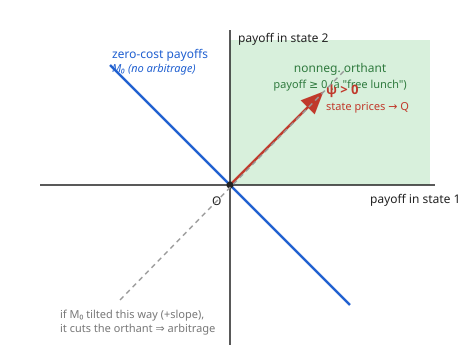

# Mathematical Finance · Lesson 1.4: The fundamental theorem of asset pricing

> ⏱ ~15 min · Module 1: No-arbitrage and risk-neutral pricing · Builds on: [1.3 The one-period model and the pricing measure](01-03-one-period-model-pricing-measure.md) · Unlocks: [1.5 The binomial model and risk-neutral valuation](01-05-binomial-model-risk-neutral-valuation.md)

## Why this matters

In 1.3 you built a risk-neutral measure by hand for a two-state market and priced by taking a discounted expectation under it. That felt like a lucky trick. The **fundamental theorems of asset pricing (FTAP)** say it is not luck at all — it is the *entire* logical structure of no-arbitrage pricing, and it comes in two clean statements. FTAP I says the pricing measure exists *exactly when* the market admits no arbitrage; FTAP II says it is *unique* exactly when the market is complete. Together they turn "no free lunch" into linear algebra you can actually check, and they tell you precisely when a price is forced (unique $Q$) versus merely constrained to an interval (many $Q$). That interval is where hedging fails and model risk lives — the whole back half of this course.

## The idea

Fix a finite market: today (time 0) and one future date (time 1) with finitely many possible states $\omega_1,\dots,\omega_n$. You can trade a few assets. Discount everything by the risk-free asset (the **numéraire**) so a bond is worth $1$ at both dates. An **arbitrage** is a portfolio that costs $\le 0$ today and pays $\ge 0$ in every state with $>0$ somewhere: money for nothing.

Now the geometry. Line up each asset's discounted payoff as a vector in $\mathbb{R}^n$ (one coordinate per state). No-arbitrage says the set of payoffs you can build for *zero cost* never pokes into the non-negative orthant $\mathbb{R}^n_{\ge 0}$ except at the origin — you can't manufacture something-for-nothing. Two convex sets that meet only at $0$ can be pried apart by a **hyperplane**, and — because one of them is the orthant — the hyperplane's normal vector can be taken **strictly positive**. That strictly positive normal is a vector of **state prices** $\psi=(\psi_1,\dots,\psi_n)$, one price per state. Normalize the $\psi_i$ to sum to $1$ and you have a **probability measure** $Q$; the fact that every asset's price equals $\sum_i \psi_i \times(\text{its payoff in state } i)$ is exactly the statement that its discounted price is a $Q$-expectation. That is the pricing measure, born from a hyperplane.

"Equivalent" is the subtle word. $Q$ must be **equivalent** to the physical measure $P$: they agree on which states are possible ($P(\omega_i)>0 \iff Q(\omega_i)>0$). This is why the normal must be *strictly* positive — a state price of $0$ would let $Q$ silently delete a state the world says can happen, or a negative one would price a state as a liability. $Q$ is allowed to *reweight* reality but never to *rewrite the list of what can occur*.

## The formal version

**Setup.** Discounted asset prices: today's vector $S_0\in\mathbb{R}^d$ ($d$ assets), and a payoff matrix $D\in\mathbb{R}^{d\times n}$ whose row $k$ is asset $k$'s discounted payoff across the $n$ states. A portfolio is $\theta\in\mathbb{R}^d$; its cost is $\theta^\top S_0$ and its state-payoff vector is $\theta^\top D\in\mathbb{R}^n$. An **arbitrage** is $\theta$ with $\theta^\top S_0\le 0$ and $\theta^\top D\ge 0$ (componentwise), not both zero.

> **In words:** an arbitrage is a trade you're paid (or at least not charged) to enter that never loses and sometimes wins.

**Equivalent martingale measure (EMM).** A probability $Q=(q_1,\dots,q_n)$ with every $q_i>0$ (hence equivalent to $P$, assuming $P$ charges every state) such that for each asset $k$,
$$S_0^{(k)} \;=\; \mathbb{E}^{Q}\!\big[\,\text{discounted payoff of }k\,\big]\;=\;\sum_{i=1}^n q_i\,D_{ki}.$$

> **In words:** under $Q$, today's price is the average of tomorrow's discounted payoffs — the discounted price process is a **martingale** (no predictable drift once you strip out the risk-free growth).

**FTAP I (existence).** The market has **no arbitrage** $\iff$ **there exists an EMM** $Q$.

> **In words:** no free lunch is the same statement as "there's a consistent set of strictly positive state prices." One direction is easy — if $Q$ exists, any $\theta^\top D\ge 0$ with a strict entry has $\theta^\top S_0=\mathbb{E}^Q[\theta^\top D]>0$, so no arbitrage. The hard direction is the separating-hyperplane argument above (finite-dimensional: **Stiemke's / Farkas' lemma** — exactly one of "arbitrage exists" or "strictly positive state prices exist" holds).

**FTAP II (uniqueness).** Given no arbitrage, the market is **complete** (every state-payoff $X\in\mathbb{R}^n$ is replicable by some portfolio) $\iff$ the EMM $Q$ is **unique**.

> **In words:** you can hedge everything exactly when there's only one consistent price system. The count: the marketed payoffs are the row space of $D$; completeness means those rows span all of $\mathbb{R}^n$, i.e. $\operatorname{rank}(D)=n$. The EMMs are the *strictly positive* solutions $q$ of $Dq = S_0$ with $\sum q_i=1$ — an affine slice of a solution space of dimension $n-\operatorname{rank}(D)$. Full rank $\Rightarrow$ a single solution; a deficit $\Rightarrow$ a whole affine family. **Spanning $\iff$ a point; a gap $\iff$ a line (or plane).**

**What generalizes.** In continuous time the payoff space is infinite-dimensional, "no arbitrage" must be strengthened to **No Free Lunch with Vanishing Risk (NFLVR)**, and the separating hyperplane becomes a functional-analytic separation (Hahn–Banach / Kreps–Yan). The punchline survives intact: NFLVR $\iff$ an EMM exists; completeness $\iff$ it's unique. Girsanov (Lesson [2.3](02-03-risk-neutral-pricing-girsanov-feynman-kac.md)) is how you actually *construct* that measure for a diffusion.

## Picture

The blue line $M_0$ is every payoff you can build at zero cost (a subspace of payoff space). No-arbitrage $=$ it meets the green orthant only at $O$. The red normal $\psi>0$ is the separating direction — pointing *into* the positive orthant — and its coordinates are the state prices. Tilt $M_0$ the other way (grey dashed) so it slices into the orthant, and a zero-cost strictly-positive payoff appears: arbitrage, and no positive normal can exist.

## Worked examples

**Example 1 — a two-state market: unique $Q$, verified martingale.** Numéraire is a bond with gross return $R=1.05$. A stock has $S_0=100$ today and pays $S^u=120$ or $S^d=90$ at time 1. Sanity check for no-arbitrage: $S^d=90 < R\,S_0 = 105 < 120 = S^u$ — the forward price sits strictly between the two outcomes, so neither "always buy stock" nor "always short it" wins. Good.

The EMM $Q=(q,1-q)$ must make the *discounted* stock a martingale: $S_0=\tfrac1R\mathbb{E}^Q[S_1]$, i.e. $R S_0 = q S^u+(1-q)S^d$. Solve:
$$q=\frac{R\,S_0-S^d}{S^u-S^d}=\frac{105-90}{120-90}=\frac{15}{30}=\tfrac12.$$
Both $q=\tfrac12$ and $1-q=\tfrac12$ are strictly positive, so $Q$ is equivalent to $P$. Check the martingale property directly: $\tfrac1R\mathbb{E}^Q[S_1]=\tfrac{1}{1.05}\big(\tfrac12\cdot120+\tfrac12\cdot90\big)=\tfrac{105}{1.05}=100=S_0.$ ✓ Two states, two independent assets (bond + stock) $\Rightarrow \operatorname{rank}(D)=2=n \Rightarrow$ complete $\Rightarrow Q$ unique. This is the whole binomial engine of [1.5](01-05-binomial-model-risk-neutral-valuation.md) in one line.

**Example 2 — a three-state, two-asset market: a whole line of EMMs.** Now $R=1.25$ (discount factor $1/R=0.8$). A stock has $S_0=4$ and pays $S=(10,\,5,\,0)$ across states $\omega_1,\omega_2,\omega_3$. Two assets, three states: $\operatorname{rank}(D)=2<3$, so the market is **incomplete**. The EMM conditions are
$$\underbrace{q_1+q_2+q_3=1}_{\text{it's a probability}},\qquad \underbrace{10q_1+5q_2+0\,q_3=R\,S_0=5}_{\text{discounted stock is a martingale}},\qquad q_i>0.$$
The second equation is $2q_1+q_2=1$, so $q_2=1-2q_1$; substituting into the first gives $q_3=q_1$. Parametrize by $s=q_1$:
$$Q_s=(s,\;1-2s,\;s),\qquad s\in\left(0,\tfrac12\right)\ \text{(the open interval forced by positivity)}.$$
A one-parameter **family** — a line segment of EMMs — exactly the $n-\operatorname{rank}(D)=1$ degree of freedom.

What does that cost you? Consider the digital claim paying $1$ in state $\omega_3$ only, $X=(0,0,1)$. Is it hedgeable? The marketed payoffs are spanned by the bond $(1,1,1)$ and stock $(10,5,0)$; solving $a(1,1,1)+b(10,5,0)=(0,0,1)$ forces $a=1$, $b=-\tfrac15$, then $a+10b=-1\ne0$ — **not replicable**. So its price isn't pinned. Under $Q_s$ it is worth
$$\pi_s(X)=\tfrac1R\,\mathbb{E}^{Q_s}[X]=0.8\,q_3=0.8\,s,\qquad s\in\left(0,\tfrac12\right)\;\Rightarrow\;\pi(X)\in(0,\,0.4).$$
Not a price — a **no-arbitrage price interval** $(0,0.4)$. Every value in it is consistent with no arbitrage; the market simply doesn't decide. (Endpoints excluded: a price of $0$ or $0.4$ corresponds to a boundary $Q$ with a zero — no longer equivalent — and would itself create an arbitrage.)

## Watch out

- **Equivalent, not just "a martingale measure."** A boundary weighting like $Q_0=(0,1,0)$ can still make the stock a martingale ($5=5$), but it kills states $\omega_1,\omega_3$. It is not equivalent to $P$, and pricing with it *manufactures* arbitrage. Strict positivity is the whole game.
- **Martingale is about the *discounted* price.** The raw stock has positive drift (it grows like $R$ on average, plus a risk premium under $P$). It's $S_t/(\text{numéraire})$ that has no drift under $Q$. Forget to discount and every "martingale" check fails.
- **Uniqueness $\ne$ correctness.** FTAP II says complete markets pin one price; it says nothing about whether your *model* of the states and payoffs is right. Incomplete markets are honest about their ignorance (an interval); complete-market models hide it inside modeling assumptions — see [4.5](04-05-incomplete-markets-model-risk.md).
- **More assets don't automatically complete a market.** Completeness is $\operatorname{rank}(D)=n$, not $d\ge n$. Three redundant assets in a three-state world can still leave rank $2$.

## One-liner

> No-arbitrage means a strictly positive state-price vector exists (an equivalent martingale measure); completeness means it's the *only* one — spanning collapses a price interval to a point.

## Problems

**P1 (🟢) — verify an EMM.** A market has numéraire return $R=1.02$ and a stock with $S_0=50$ paying $S=(60,50,40)$ across three states. A colleague proposes $Q=(0.4,\,0.3,\,0.3)$. Is $Q$ an equivalent martingale measure? Justify all three requirements.

**P2 (🟡) — the EMM family and price bounds.** Take $R=1$ (zero rate). A stock has $S_0=2$ and pays $S=(4,2,1)$ across $\omega_1,\omega_2,\omega_3$; a bond pays $(1,1,1)$. (a) Find every EMM, as a one-parameter family. (b) Find the no-arbitrage price interval for the call $X=\max(S-2,0)=(2,0,0)$. (c) Is $X$ replicable? What would pin its price to a single number?

**P3 (🔴) — arbitrage from a missing state-price vector.** A market has $R=1$, a bond paying $(1,1)$ at price $1$, and a stock paying $(2,1)$ at price $S_0=0.9$. (a) Show no strictly positive state-price vector $\psi$ can price both assets. (b) Use that failure to build an explicit arbitrage portfolio, and state its cost today and payoff in each state. (c) Explain in one sentence how this is the separating-hyperplane picture failing.

Solutions

**P1.** Three checks. **(i) Probability:** $0.4+0.3+0.3=1$ ✓. **(ii) Equivalent:** all entries strictly positive, so $Q$ charges exactly the states $P$ does ✓. **(iii) Discounted martingale:** need $S_0=\tfrac1R\mathbb{E}^Q[S_1]$.
$$\mathbb{E}^Q[S_1]=0.4(60)+0.3(50)+0.3(40)=24+15+12=51,\qquad \tfrac{51}{1.02}=50=S_0.\ \checkmark$$
(The bond is automatically a martingale: its discounted price is the constant $1$.) All three hold, so **yes, $Q$ is an EMM.** (The market is 3-state, 2-asset, hence incomplete, so this is one EMM among a family — but the question only asked to verify this one.)

**P2. (a)** With $R=1$, discounted $=$ undiscounted. EMM $q=(q_1,q_2,q_3)$ solves $q_1+q_2+q_3=1$ and $\mathbb{E}^Q[S]=4q_1+2q_2+q_3=S_0=2$, with $q_i>0$. Subtract the first from the second: $3q_1+q_2=1\Rightarrow q_2=1-3q_1$. Then $q_3=1-q_1-q_2=2q_1$. Set $t=q_1$:
$$Q_t=(t,\;1-3t,\;2t),\qquad t\in\left(0,\tfrac13\right)\ \text{(positivity: } t>0 \text{ and } 1-3t>0).$$
**(b)** $\pi_t(X)=\mathbb{E}^{Q_t}[X]=2q_1=2t$. As $t$ ranges over $(0,\tfrac13)$, $\pi(X)\in(0,\tfrac23)$. The no-arbitrage price interval is $\boxed{(0,\,2/3)}$.
**(c)** Marketed payoffs are $\operatorname{span}\{(1,1,1),(4,2,1)\}$, a 2-plane in $\mathbb{R}^3$. Solve $a(1,1,1)+b(4,2,1)=(2,0,0)$: from coords, $a+b\cdot? $ — set up $a+4b=2$, $a+2b=0$, $a+b=0$. The last two give $b=0,a=0$, contradicting $a+4b=2$. **Not replicable.** Its price would be pinned to a point only if the market were completed — e.g. by adding a third independent asset (say an Arrow security) so that $\operatorname{rank}(D)=3=n$, forcing a unique $Q$ by FTAP II.

**P3. (a)** A state-price vector $\psi=(\psi_1,\psi_2)$ prices each asset as $\text{price}=\psi\cdot\text{payoff}$ (with $R=1$, no discount factor needed). Bond: $\psi_1+\psi_2=1$. Stock: $2\psi_1+\psi_2=0.9$. Subtract: $\psi_1=0.9-1=-0.1<0$. No **strictly positive** $\psi$ exists — in fact no non-negative one — so by FTAP I the market has an arbitrage.
**(b)** The stock dominates the bond: it pays *more* in state 1 ($2>1$), the *same* in state 2 ($1=1$), yet costs *less* ($0.9<1$). Buy one stock, short one bond: portfolio $\theta=(\text{stock } +1,\ \text{bond } -1)$.
- **Cost today:** $0.9-1=-0.1$ — you are *paid* $0.1$ to put it on.
- **Payoff state 1:** $2-1=+1$. **Payoff state 2:** $1-1=0$.

You collect $0.1$ now and never owe anything later, winning $1$ in state 1: a textbook arbitrage.
**(c)** The portfolio's (−cost, payoff) vector $(0.1,\,1,\,0)$ lands in the non-negative orthant away from the origin, so no zero-cost marketed line can be separated from the orthant by a strictly positive normal — the state-price hyperplane of the Picture simply does not exist.

## Flashback

**From Lesson [1.3](01-03-one-period-model-pricing-measure.md) (risk-neutral probability, fresh numbers).** A one-period market has zero interest rate ($R=1$). A stock is $S_0=80$ today and pays $S^u=100$ or $S^d=60$ at time 1. Find the risk-neutral probability $q$ of the up-state, then price a call with strike $K=80$ (payoff $\max(S-80,0)$) two ways — by risk-neutral expectation and by replication — and check they agree.

Solution

**Risk-neutral probability.** $q=\dfrac{R\,S_0-S^d}{S^u-S^d}=\dfrac{80-60}{100-60}=\dfrac{20}{40}=\tfrac12$ (and $1-q=\tfrac12>0$, so it's a valid EMM).

**Call payoff:** $\max(100-80,0)=20$ up, $\max(60-80,0)=0$ down.

**Risk-neutral price:** $C_0=\tfrac1R\big(q\cdot20+(1-q)\cdot0\big)=\tfrac12\cdot20=10.$

**Replication:** find $\Delta$ shares and $B$ bonds matching the call: $100\Delta+B=20$ and $60\Delta+B=0$. Subtract: $40\Delta=20\Rightarrow\Delta=\tfrac12$, then $B=-30$. Cost to build $=\Delta S_0+B=\tfrac12\cdot80-30=40-30=10.$

Both give $\boxed{C_0=10}$ — precisely FTAP's promise that discounted expectation under $Q$ equals the replication cost.

## Connections

- **Backward:** the "pricing measure" you constructed concretely in [1.3](01-03-one-period-model-pricing-measure.md) *is* the EMM of FTAP I — this lesson explains why it had to exist and be positive. Completeness here is exactly the spanning/replication condition of [1.2](01-02-replication-complete-markets.md): a market is complete $\iff$ its asset payoffs span every claim $\iff$ the EMM is unique.
- **Forward:** [2.3](02-03-risk-neutral-pricing-girsanov-feynman-kac.md) builds the continuous-time EMM explicitly via **Girsanov**, changing the drift of a Brownian motion so the discounted price is a martingale — the diffusion analogue of solving $Dq=S_0$. And [4.5](04-05-incomplete-markets-model-risk.md) is this lesson's incomplete case taken seriously: non-unique $Q$ $\Rightarrow$ price intervals $\Rightarrow$ model risk and the need for a pricing/hedging criterion beyond no-arbitrage.
- **Sideways (micro):** FTAP I is the finance face of the welfare/no-free-lunch results in [grad-micro](../../grad-micro/syllabus.md) — strictly positive state prices are the Arrow–Debreu contingent-claim prices supporting a competitive equilibrium; "no arbitrage" is "no unbounded improvement."
- **Sideways (functional analysis):** the engine is the separating-hyperplane theorem — two disjoint convex sets can be split by a plane. In finite dimensions it's Farkas/Stiemke and plain linear algebra; the infinite-dimensional Hahn–Banach version is what upgrades FTAP to real continuous-time markets.
</content>
