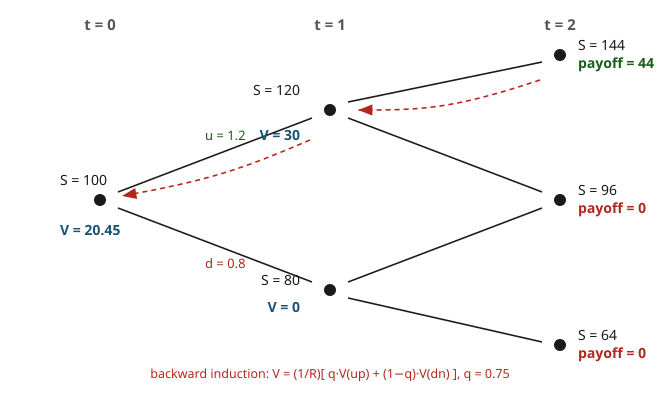

# Mathematical Finance · Lesson 1.5: The binomial model and risk-neutral valuation

> ⏱ ~15 min · Module 1: No-arbitrage and risk-neutral pricing · Builds on: [1.3 The one-period model and the pricing measure](01-03-one-period-model-pricing-measure.md), [1.4 The fundamental theorem of asset pricing](01-04-fundamental-theorem-asset-pricing.md) · Unlocks: Module 2 — [2.1 The continuous-time market](02-01-continuous-time-market-self-financing.md)

## Why this matters

One period was a warm-up: a single coin flip, a single equation for the price. Real derivatives live and die over many periods, and their value depends on the *whole path* the stock might take. The Cox–Ross–Rubinstein (CRR) binomial tree is the smallest honest model of that — a stock that ticks up or down each step — and it does three jobs at once. It **prices** any European payoff by a mechanical recursion. It **hedges** it, handing you the exact share position to hold at every node so you never lose or make a cent beyond the fair price. And, as the steps get finer, it **converges to Black–Scholes** — so this lesson is Module 2's continuous theory with the measure theory swapped out for arithmetic you can do by hand. Everything downstream is this picture, refined.

## The idea

Take the one-period story from [1.3](01-03-one-period-model-pricing-measure.md) and staple copies of it end to end. At each node the stock is worth $S$; one step later it is $Su$ (up) or $Sd$ (down), and one dollar in the bank becomes $R$ (the gross per-step rate). No-arbitrage forces $d < R < u$, and — exactly as in one period — there is a unique **risk-neutral probability** $q$ making the discounted stock a fair game:

$$q = \frac{R - d}{u - d}.$$

The tree **recombines**: an up-then-down move lands on the same node as down-then-up ($Sud = Sdu$), so $N$ steps give only $N+1$ terminal nodes, not $2^N$. That's what makes the model computable.

To price a claim, start at expiry — where the payoff is known — and walk *backward*. At every node the value is the one-period risk-neutral price of its two children:

$$V = \frac{1}{R}\big[\,q\,V_{\text{up}} + (1-q)\,V_{\text{down}}\,\big].$$

Roll that back to the root and you have today's price. The genius is that this recursion isn't a *forecast* — $q$ is not anyone's belief about the stock. It's the number that makes replication break even, and the whole tree is just [1.4](01-04-fundamental-theorem-asset-pricing.md)'s theorem turned into a spreadsheet.

## The formal version

**The market.** A stock $S$ and a bond. Over $N$ steps of length $\Delta t = T/N$, at each node the stock multiplies by $u$ (up) or $d$ (down) with $0 < d < R < u$, and the bond multiplies by $R = $ (gross risk-free return per step). A **European claim** pays $g(S_T)$ at the terminal time — for a call, $g(S) = (S-K)^+ = \max(S-K,0)$ with strike $K$.

**Risk-neutral measure.** The per-step measure $q = \dfrac{R-d}{u-d}$, $1-q = \dfrac{u-R}{u-d}$. In words: $q$ is the unique probability under which each step's discounted stock price is a martingale — $E^Q[S_{\text{next}}] = R\,S$. The condition $d < R < u$ is exactly what puts $q$ strictly between $0$ and $1$; it *is* no-arbitrage for this market (FTAP, [1.4](01-04-fundamental-theorem-asset-pricing.md)).

**Backward induction (dynamic programming).** At the terminal nodes $V = g(S_T)$. At every earlier node,

$$V = \frac{1}{R}\big[q\,V_{\text{up}} + (1-q)\,V_{\text{down}}\big].$$

In words: a claim is worth the discounted risk-neutral average of what it becomes one step later — applied recursively.

**Closed form.** Unrolling the recursion, the stock reaches $S_0 u^k d^{N-k}$ after $k$ ups (any order), which happens with risk-neutral probability $\binom{N}{k}q^k(1-q)^{N-k}$. So

$$V_0 = R^{-N}\,E^Q\!\big[g(S_T)\big] = R^{-N}\sum_{k=0}^{N}\binom{N}{k}q^k(1-q)^{N-k}\,g\!\big(S_0 u^k d^{N-k}\big).$$

In words: discount the payoff and average it under the binomial risk-neutral law. Backward induction and this sum are the *same* number computed two ways — recursion vs. its closed form.

**Delta-hedging (replication).** At each node hold

$$\Delta = \frac{V_{\text{up}} - V_{\text{down}}}{S_{\text{up}} - S_{\text{down}}}$$

shares of stock, financed by a bond position $B$ chosen so the portfolio is worth $V$ now. Then $\Delta S_{\text{up}} + RB = V_{\text{up}}$ and $\Delta S_{\text{down}} + RB = V_{\text{down}}$ — the portfolio reproduces the claim in *both* states. Re-solving for a fresh $\Delta$ at each new node gives a **self-financing** strategy (no cash added or withdrawn after inception) that tracks $V$ exactly down every path. Because that replicating cost equals the discounted expectation at every node, the two valuations agree everywhere. This is FTAP made computational: unique price $=$ cost of replication $=$ discounted $E^Q$.

**The continuous limit (CRR calibration).** To make the tree approximate a real stock with volatility $\sigma$ and continuous rate $r$ over horizon $T$, take $N$ steps of size $\Delta t = T/N$ and set

$$u = e^{\sigma\sqrt{\Delta t}}, \qquad d = e^{-\sigma\sqrt{\Delta t}} = \tfrac{1}{u}, \qquad R = e^{r\Delta t}.$$

Expanding $q$ to leading order in $\Delta t$ (worked below),

$$q = \frac{1}{2} + \frac{1}{2}\left(\frac{r}{\sigma} - \frac{\sigma}{2}\right)\sqrt{\Delta t} + O(\Delta t).$$

The per-step log-return is $\pm\sigma\sqrt{\Delta t}$; under $Q$ its mean is $(r - \tfrac{\sigma^2}{2})\Delta t$ and its variance is $\sigma^2\Delta t + O(\Delta t^2)$. Summing $N$ of them and applying the CLT, $\ln(S_T/S_0)$ becomes **normal** with mean $(r-\tfrac{\sigma^2}{2})T$ and variance $\sigma^2 T$ — i.e. $S_T$ is log-normal — and the binomial call price converges to the **Black–Scholes formula**

$$C_0 = S_0\,N(d_1) - K e^{-rT} N(d_2), \quad d_{1,2} = \frac{\ln(S_0/K) + (r \pm \tfrac{\sigma^2}{2})T}{\sigma\sqrt{T}},$$

where $N(\cdot)$ is the standard normal CDF. We take this as the *target* now; Module 2 derives it from the same log-normal limit through the PDE ([2.2](02-02-black-scholes-pde-delta-hedging.md)) and the integral ([2.4](02-04-black-scholes-formula.md)).

## Picture

The black lines are the forward tree (stock ticks up by $u$ or down by $d$); the red dashed arrows are backward induction carrying values *right to left*. Note the middle terminal node ($S=96$) is shared — the tree recombines.

## Worked examples

**Example 1 (two-step call, two ways, plus the root delta).** Let $S_0 = 100$, $u = 1.2$, $d = 0.8$, $R = 1.1$ per step, and price a two-step European **call** with strike $K = 100$. First the measure:

$$q = \frac{R-d}{u-d} = \frac{1.1 - 0.8}{1.2 - 0.8} = \frac{0.3}{0.4} = 0.75, \qquad 1-q = 0.25.$$

Terminal stock and payoffs: $S_{uu} = 100(1.2)^2 = 144 \Rightarrow 44$; $\;S_{ud} = 100(1.2)(0.8) = 96 \Rightarrow 0$; $\;S_{dd} = 100(0.8)^2 = 64 \Rightarrow 0$.

*Backward induction.* At the up node ($S=120$): $V_u = \frac{1}{1.1}[0.75\cdot 44 + 0.25\cdot 0] = \frac{33}{1.1} = 30$. At the down node ($S=80$): $V_d = \frac{1}{1.1}[0.75\cdot 0 + 0.25\cdot 0] = 0$. At the root:

$$V_0 = \frac{1}{1.1}\big[0.75\cdot 30 + 0.25\cdot 0\big] = \frac{22.5}{1.1} = 20.45.$$

*Summation formula.* Only $k=2$ pays, so

$$V_0 = R^{-2}\binom{2}{2}q^2\cdot 44 = \frac{(0.75)^2 \cdot 44}{(1.1)^2} = \frac{24.75}{1.21} = 20.45.\ \checkmark$$

Same number. The **root delta** — how many shares to hold today —

$$\Delta_0 = \frac{V_u - V_d}{S_u - S_d} = \frac{30 - 0}{120 - 80} = 0.75.$$

Hold $0.75$ shares (75 dollars of stock) and borrow the rest: bond position $B$ solves $\Delta_0 S_0 u + RB = V_u$, i.e. $0.75\cdot 120 + 1.1B = 30 \Rightarrow B = -54.55$. Then $\Delta_0 S_0 + B = 75 - 54.55 = 20.45 = V_0$ — the replicating cost *is* the price.

**Example 2 (the CRR calibration and its log-normal limit).** With $u = e^{\sigma\sqrt{\Delta t}}$, $d = e^{-\sigma\sqrt{\Delta t}}$, $R = e^{r\Delta t}$, write $\varepsilon = \sigma\sqrt{\Delta t}$ (so $\Delta t = \varepsilon^2/\sigma^2$) and expand:

$$u = 1 + \varepsilon + \tfrac{\varepsilon^2}{2} + \cdots,\quad d = 1 - \varepsilon + \tfrac{\varepsilon^2}{2} + \cdots,\quad R = 1 + \tfrac{r}{\sigma^2}\varepsilon^2 + \cdots$$

So $u - d = 2\varepsilon + O(\varepsilon^3)$ and $R - d = \varepsilon + \big(\tfrac{r}{\sigma^2} - \tfrac12\big)\varepsilon^2 + O(\varepsilon^3)$, giving

$$q = \frac{R-d}{u-d} = \frac{1}{2} + \frac{1}{2}\left(\frac{r}{\sigma} - \frac{\sigma}{2}\right)\sqrt{\Delta t} + O(\Delta t).$$

The per-step log-return $X_i = \ln(S_{i+1}/S_i)$ takes values $\pm\varepsilon$ with probabilities $q, 1-q$. A two-point variable at $\pm\varepsilon$ has mean $\varepsilon(2q-1)$ and variance $\varepsilon^2\big[1-(2q-1)^2\big]$. Since $2q-1 = \big(\tfrac{r}{\sigma}-\tfrac{\sigma}{2}\big)\sqrt{\Delta t}$,

$$E^Q[X_i] = \sigma\sqrt{\Delta t}\cdot\Big(\tfrac{r}{\sigma}-\tfrac{\sigma}{2}\Big)\sqrt{\Delta t} = \Big(r - \tfrac{\sigma^2}{2}\Big)\Delta t, \qquad \mathrm{Var}^Q[X_i] = \sigma^2\Delta t\,\big(1 + O(\Delta t)\big).$$

Summing $N = T/\Delta t$ independent steps: $E^Q[\ln(S_T/S_0)] \to (r-\tfrac{\sigma^2}{2})T$ and $\mathrm{Var}^Q \to \sigma^2 T$. By the CLT for triangular arrays, $\ln(S_T/S_0) \Rightarrow \mathcal N\big((r-\tfrac{\sigma^2}{2})T,\ \sigma^2 T\big)$ — $S_T$ is log-normal, and $R^{-N}E^Q[(S_T-K)^+]$ converges to the Black–Scholes call above. The mysterious $-\tfrac{\sigma^2}{2}$ drift is *not* an assumption; it fell out of $q$'s expansion.

## Watch out

- **$q$ is not a forecast.** It's the no-arbitrage weight, independent of the true up-probability $p$. The real $p$ never appears in any price — pricing is about replication cost, not prediction. (This is [1.3](01-03-one-period-model-pricing-measure.md)'s central lesson, repeated at every node.)
- **Recompute $\Delta$ at every node.** A single hedge ratio does *not* work for two steps; self-financing means you rebalance as the stock moves. A "static" delta leaves you exposed. Delta changes because the claim's local slope changes — that changing slope is gamma, the star of [2.5](02-05-greeks-dynamic-hedging.md).
- **Only $d<R<u$ is admissible.** If $R \ge u$ the bond dominates the stock (short the stock, hold cash — arbitrage); if $R \le d$ the reverse. Then $q\notin(0,1)$ and no risk-neutral measure exists — precisely the FTAP failure of [1.4](01-04-fundamental-theorem-asset-pricing.md).
- **The drift $r$, not $\mu$.** Under $Q$ the log-return drifts at $r - \sigma^2/2$, never the stock's real expected return. Beginners plug in the historical drift and misprice everything.

## One-liner

> Price any claim by rolling the discounted risk-neutral average $V = R^{-1}[qV_{\text{up}}+(1-q)V_{\text{down}}]$ backward down a recombining tree; the node-by-node delta $\tfrac{V_{\text{up}}-V_{\text{down}}}{S_{\text{up}}-S_{\text{down}}}$ replicates it exactly, and refining the tree turns the whole thing into Black–Scholes.

## Problems

**P1 (🟢)** Two-step European **call**, $S_0 = 100$, $u = 1.1$, $d = 0.9$, $R = 1$ (zero interest), strike $K = 100$. Find $q$ and price the call by backward induction.

**P2 (🟡, mini boss)** Two-step European **put**, $S_0 = 100$, $u = 1.2$, $d = 0.8$, $R = 1$, strike $K = 100$. Price it **two ways**: (a) by replication — give the root $\Delta_0$ and bond position, and show the money balances into both children; (b) by the discounted expectation $R^{-2}E^Q[\cdot]$. Confirm they agree.

**P3 (🔴)** Using the CRR calibration $u = e^{\sigma\sqrt{\Delta t}}$, $d = e^{-\sigma\sqrt{\Delta t}}$, $R = e^{r\Delta t}$ with $\Delta t = T/N$, show that as $N\to\infty$ the risk-neutral log-return $\ln(S_T/S_0)$ has mean $(r-\tfrac{\sigma^2}{2})T$ and variance $\sigma^2 T$. (This is the seed of Black–Scholes.)

Solutions

**P1.** $q = \dfrac{R-d}{u-d} = \dfrac{1 - 0.9}{1.1 - 0.9} = \dfrac{0.1}{0.2} = 0.5$. Terminal stock/payoffs: $S_{uu} = 121 \Rightarrow 21$; $S_{ud} = 99 \Rightarrow 0$; $S_{dd} = 81 \Rightarrow 0$. Backward (with $R=1$): up node $V_u = 0.5\cdot 21 + 0.5\cdot 0 = 10.5$; down node $V_d = 0$. Root:

$$V_0 = 0.5\cdot 10.5 + 0.5\cdot 0 = 5.25.$$

Check by the sum: $V_0 = \binom{2}{2}(0.5)^2\cdot 21 = 0.25\cdot 21 = 5.25.\ \checkmark$

**P2.** $q = \dfrac{1 - 0.8}{1.2 - 0.8} = 0.5$. Terminal stock: $S_{uu}=144$, $S_{ud}=96$, $S_{dd}=64$; put payoffs $(K-S)^+$: $0,\ 4,\ 36$.

Backward induction ($R=1$): up node ($S=120$) $V_u = 0.5\cdot 0 + 0.5\cdot 4 = 2$; down node ($S=80$) $V_d = 0.5\cdot 4 + 0.5\cdot 36 = 20$; root $V_0 = 0.5\cdot 2 + 0.5\cdot 20 = 11$.

*(a) Replication.* Root delta:

$$\Delta_0 = \frac{V_u - V_d}{S_u - S_d} = \frac{2 - 20}{120 - 80} = \frac{-18}{40} = -0.45$$

(negative — a put hedge is short stock). Bond position from $\Delta_0 S_0 u + RB = V_u$: $-0.45\cdot 120 + B = 2 \Rightarrow -54 + B = 2 \Rightarrow B = 56$. Check the down child: $\Delta_0 S_0 d + RB = -0.45\cdot 80 + 56 = -36 + 56 = 20 = V_d.\ \checkmark$ Both states reproduced. Cost today: $V_0 = \Delta_0 S_0 + B = -45 + 56 = 11$.

*(b) Discounted expectation.*

$$V_0 = R^{-2}\!\sum_k \binom{2}{k}q^k(1-q)^{2-k}(K-S)^+ = (0.25)(36) + 2(0.25)(4) + (0.25)(0) = 9 + 2 = 11.\ \checkmark$$

Replication and $E^Q$ give the same 11 — the two faces of FTAP.

**P3.** Let $\varepsilon = \sigma\sqrt{\Delta t}$, so $\Delta t = \varepsilon^2/\sigma^2$. Taylor-expand: $u = e^\varepsilon = 1+\varepsilon+\tfrac{\varepsilon^2}{2}+O(\varepsilon^3)$, $d = e^{-\varepsilon} = 1-\varepsilon+\tfrac{\varepsilon^2}{2}+O(\varepsilon^3)$, $R = e^{r\Delta t} = 1 + \tfrac{r}{\sigma^2}\varepsilon^2 + O(\varepsilon^4)$. Then

$$u - d = 2\varepsilon + O(\varepsilon^3), \qquad R - d = \varepsilon + \Big(\tfrac{r}{\sigma^2} - \tfrac{1}{2}\Big)\varepsilon^2 + O(\varepsilon^3),$$

$$q = \frac{R-d}{u-d} = \frac{1}{2} + \frac{1}{2}\Big(\frac{r}{\sigma} - \frac{\sigma}{2}\Big)\sqrt{\Delta t} + O(\Delta t), \quad\text{so}\quad 2q-1 = \Big(\frac{r}{\sigma} - \frac{\sigma}{2}\Big)\sqrt{\Delta t}.$$

The step log-return $X_i = \pm\varepsilon$ with prob $q, 1-q$. Mean and variance of a two-point $\pm\varepsilon$ variable:

$$E^Q[X_i] = \varepsilon(2q-1) = \sigma\sqrt{\Delta t}\cdot\Big(\tfrac{r}{\sigma}-\tfrac{\sigma}{2}\Big)\sqrt{\Delta t} = \Big(r - \tfrac{\sigma^2}{2}\Big)\Delta t,$$

$$\mathrm{Var}^Q[X_i] = \varepsilon^2\big[1 - (2q-1)^2\big] = \sigma^2\Delta t\Big[1 - \big(\tfrac{r}{\sigma}-\tfrac{\sigma}{2}\big)^2\Delta t\Big] = \sigma^2\Delta t + O(\Delta t^2).$$

The steps are i.i.d., so over $N = T/\Delta t$ of them:

$$E^Q\big[\ln(S_T/S_0)\big] = N\Big(r-\tfrac{\sigma^2}{2}\Big)\Delta t = \Big(r-\tfrac{\sigma^2}{2}\Big)T, \qquad \mathrm{Var}^Q = N\sigma^2\Delta t + O(N\Delta t^2) = \sigma^2 T + O(\Delta t).$$

As $N\to\infty$ the higher-order terms vanish, and the Lindeberg CLT (bounded triangular array) gives $\ln(S_T/S_0) \Rightarrow \mathcal N\big((r-\tfrac{\sigma^2}{2})T,\ \sigma^2 T\big)$. So $S_T$ is log-normal under $Q$, and $R^{-N}E^Q[(S_T-K)^+] \to S_0 N(d_1) - Ke^{-rT}N(d_2)$: Black–Scholes. $\blacksquare$

## Flashback

**From Lesson 1.3 (The one-period model and the pricing measure):** A one-period market has $S_0 = 50$, $u = 1.4$, $d = 0.9$, and gross risk-free return $R = 1.05$. (a) Find the risk-neutral probability $q$. (b) Price a claim paying $S_1^2/100$ at time 1.

Solution

(a) $q = \dfrac{R-d}{u-d} = \dfrac{1.05 - 0.9}{1.4 - 0.9} = \dfrac{0.15}{0.5} = 0.3$, so $1-q = 0.7$. (Check $d < R < u$: $0.9 < 1.05 < 1.4$ ✓, so $q\in(0,1)$ and the market is arbitrage-free.)

(b) Up state $S_1 = 70 \Rightarrow$ payoff $70^2/100 = 49$; down state $S_1 = 45 \Rightarrow 45^2/100 = 20.25$. Price is the discounted risk-neutral expectation:

$$V_0 = \frac{1}{R}\big[q\cdot 49 + (1-q)\cdot 20.25\big] = \frac{0.3\cdot 49 + 0.7\cdot 20.25}{1.05} = \frac{14.7 + 14.175}{1.05} = \frac{28.875}{1.05} = 27.5.$$

The stock's true up-probability is nowhere in the calculation — only $q$. That single-step move is exactly one node of this lesson's tree.

## Connections

- **Backward:** every node runs [1.3](01-03-one-period-model-pricing-measure.md)'s one-period pricing, and the existence of a unique $q\in(0,1)$ (hence a unique price) is [1.4](01-04-fundamental-theorem-asset-pricing.md)'s FTAP made concrete — completeness means *every* claim replicates, which is why backward induction always closes.
- **Forward:** this whole module *is* Module 2 in discrete disguise. The self-financing replication becomes [2.1](02-01-continuous-time-market-self-financing.md)'s continuous trading; the delta-hedge becomes [2.2](02-02-black-scholes-pde-delta-hedging.md)'s PDE; the log-normal limit becomes [2.3](02-03-risk-neutral-pricing-girsanov-feynman-kac.md)'s change of measure; and the Black–Scholes formula this tree converges to is derived head-on in [2.4](02-04-black-scholes-formula.md). The changing node-by-node delta is gamma, [2.5](02-05-greeks-dynamic-hedging.md).
- **Sideways (probability):** the terminal law $\binom{N}{k}q^k(1-q)^{N-k}$ is a binomial distribution, and its convergence to a normal is the CLT — the same de Moivre–Laplace limit that anchors [probability theory](../../probability-theory/syllabus.md). The resulting log-normal $S_T$ is the discrete cousin of geometric Brownian motion in [stochastic calculus](../../stochastic-calculus/syllabus.md), whose Euler discretization *is* a fine binomial tree.
