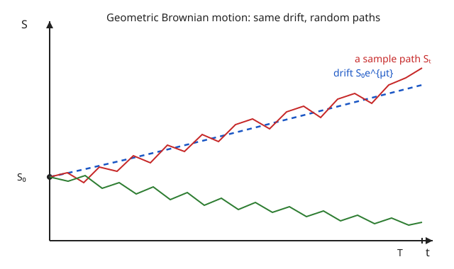

# Mathematical Finance · Lesson 2.1: The continuous-time market and self-financing portfolios

> ⏱ ~15 min · Module 2: The Black–Scholes model · Builds on: [1.5 The binomial model](01-05-binomial-model-risk-neutral-valuation.md) · Unlocks: [2.2 Deriving the Black–Scholes PDE](02-02-black-scholes-pde-delta-hedging.md)

## Why this matters

The binomial model got everything right in principle: price a claim by *replicating* it with stock and bond, and read the price off the cost of the replicating portfolio. But it lives on a discrete tree, and the real market ticks continuously. Black and Scholes' move was to take the binomial limit — infinitely many, infinitely small time steps — and land in a world where the stock follows a diffusion and you rebalance your hedge *instantaneously*.

Before we can hedge in that world (that's 2.2) we need the two objects the hedge is built from: a precise model of the tradable assets, and a precise definition of what it means to *hold a portfolio and rebalance it without ever adding or removing cash*. That second idea — **self-financing** — is the continuous heir of the node-by-node hedge from 1.5, and getting it exactly right is what makes every later pricing formula honest.

## The idea

Two assets. A **bank account** $B_t$ that grows deterministically at the riskless rate $r$ — money you lend compounds smoothly, no surprises. And a **stock** $S_t$ that trends upward at some average rate but jitters randomly around that trend, with the size of the jitter proportional to its own price (a 100-dollar stock and a 10-dollar stock don't wiggle by the same *dollar* amount — they wiggle by the same *percentage*). That "returns are noisy, noise scales with price" picture is exactly **geometric Brownian motion**.

A **trading strategy** is your recipe for how many shares $\varphi_t$ and how many units of bank account $\psi_t$ to hold at each instant. Your wealth is whatever those holdings are worth. The crucial constraint: once you start, no cash enters or leaves the portfolio. Every dollar of wealth change comes from the *assets moving*, never from your wallet. Rebalancing is allowed — sell some stock, buy some bond — but only by trading the proceeds *inside* the portfolio, a self-funded swap. That is the **self-financing** condition, and its whole content is that when you rebalance, the value you take out of one asset exactly equals the value you put into the other, so the repricing of your *changing* position never injects wealth.

## The formal version

**The riskless asset.** The bank account solves the ODE

$$dB_t = r\,B_t\,dt, \qquad B_0 = 1 \;\Longrightarrow\; B_t = e^{rt}.$$

In words: the account earns interest at the constant continuously-compounded rate $r$ on its current balance; no randomness, so no $dW$ term. $B_t$ is our **numéraire** — the yardstick we'll measure all other wealth against.

**The risky asset (geometric Brownian motion).** Under the physical (real-world) measure $\mathbb{P}$, with $W_t$ a $\mathbb{P}$-Brownian motion,

$$dS_t = \mu\,S_t\,dt + \sigma\,S_t\,dW_t.$$

In words: over an instant $dt$ the stock returns $\mu\,dt$ on average (the **drift**) plus a random shock of size $\sigma\,dW_t$ (the **volatility** $\sigma$ scaling Brownian noise), and both terms are proportional to $S_t$ so the *percentage* return $dS_t/S_t = \mu\,dt + \sigma\,dW_t$ has constant statistics. This is a linear SDE; its solution (derived in Example 1) is

$$S_t = S_0 \exp\!\Big(\big(\mu - \tfrac{1}{2}\sigma^2\big)t + \sigma W_t\Big).$$

Note the $-\tfrac12\sigma^2$: the **Itô correction**. Naive calculus would give $\exp(\mu t + \sigma W_t)$; the drift of $\ln S$ is *not* $\mu$ but $\mu - \tfrac12\sigma^2$, because volatility drags the log down even as it leaves the average $\mathbb{E}[S_t] = S_0 e^{\mu t}$ untouched.

**Trading strategy and portfolio value.** A strategy is a pair of adapted processes $(\varphi_t, \psi_t)$ — shares of stock and units of bank account held at $t$ (both may be negative: shorting, borrowing). The **portfolio value** is

$$X_t = \varphi_t\,S_t + \psi_t\,B_t.$$

**Self-financing condition.** The strategy is self-financing if

$$dX_t = \varphi_t\,dS_t + \psi_t\,dB_t.$$

In words: the *only* sources of wealth change are the price moves of the assets you hold — no external cash flows in or out. Contrast with the general product rule, which for the *value* $X_t = \varphi_t S_t + \psi_t B_t$ would read

$$dX_t = \underbrace{\varphi_t\,dS_t + \psi_t\,dB_t}_{\text{price moves}} + \underbrace{S_t\,d\varphi_t + B_t\,d\psi_t + d\varphi_t\,dS_t}_{\text{rebalancing terms}}.$$

Self-financing is exactly the demand that the second bracket vanishes:

$$S_t\,d\varphi_t + B_t\,d\psi_t + d\varphi_t\,dS_t = 0.$$

In words: whatever you spend changing your share count, $S_t\,d\varphi_t$ (plus the cross-term from trading during a price move), is exactly funded by changing your bond holding, $B_t\,d\psi_t$ — a closed, self-funded swap. This is the continuous analog of the discrete constraint in 1.5, where the hedge at each node was rebalanced using only the wealth carried into that node.

**Discounted wealth.** Measure everything in units of the bank account: $\tilde X_t = X_t / B_t = e^{-rt}X_t$ and $\tilde S_t = S_t/B_t = e^{-rt}S_t$. Then for a self-financing strategy

$$d\tilde X_t = \varphi_t\,d\tilde S_t.$$

In words: in discounted units the bond becomes a constant (it *is* the yardstick, $\tilde B_t \equiv 1$, $d\tilde B_t = 0$), so all discounted wealth change comes through the discounted stock alone. This one identity is the engine of risk-neutral pricing in 2.3: find a measure under which $\tilde S_t$ is a martingale, and $\tilde X_t$ inherits the martingale property for free.

**Admissibility.** Not every self-financing strategy is legal. A strategy is **admissible** if its wealth is bounded below: $X_t \ge -c$ for some constant $c$, for all $t$. In words: you're allowed to borrow, but your losses can't run to $-\infty$ unchecked. Without this, continuous time readmits arbitrage through **doubling strategies** — bet, and if you lose, double the stake and bet again, infinitely fast — which manufacture a sure profit out of nothing by tolerating unbounded intermediate debt. Admissibility is the continuous-time fine print that keeps "no arbitrage" meaningful (Problem 3).

## Picture

Same starting price $S_0$, same drift $\mu$ and volatility $\sigma$ — two different draws of the noise $W_t$ send the paths above and below the deterministic drift curve. The drift is the trend; volatility is the width of the fan of possible paths around it.

## Worked examples

**Example 1 (mechanical — solve the GBM SDE with Itô).** We want $S_t$ explicitly from $dS_t = \mu S_t\,dt + \sigma S_t\,dW_t$. Guess that $\ln S_t$ is tractable and apply Itô's formula to $f(S) = \ln S$, with $f'(S) = 1/S$, $f''(S) = -1/S^2$:

$$d(\ln S_t) = f'(S_t)\,dS_t + \tfrac{1}{2}f''(S_t)\,(dS_t)^2.$$

The quadratic variation uses $(dW_t)^2 = dt$ and $dt\cdot dW_t = (dt)^2 = 0$:

$$(dS_t)^2 = \big(\mu S_t\,dt + \sigma S_t\,dW_t\big)^2 = \sigma^2 S_t^2\,dt.$$

Substitute:

$$d(\ln S_t) = \frac{1}{S_t}\big(\mu S_t\,dt + \sigma S_t\,dW_t\big) + \tfrac{1}{2}\Big(-\frac{1}{S_t^2}\Big)\sigma^2 S_t^2\,dt = \big(\mu - \tfrac{1}{2}\sigma^2\big)dt + \sigma\,dW_t.$$

The right side has *constant* coefficients, so integrate from $0$ to $t$ (with $W_0 = 0$):

$$\ln S_t - \ln S_0 = \big(\mu - \tfrac{1}{2}\sigma^2\big)t + \sigma W_t \;\Longrightarrow\; S_t = S_0\exp\!\Big(\big(\mu - \tfrac12\sigma^2\big)t + \sigma W_t\Big).$$

The $-\tfrac12\sigma^2$ is Itô's fingerprint: it comes entirely from the $f''$ term, and it's why $\ln S_t \sim \mathcal N\big(\ln S_0 + (\mu-\tfrac12\sigma^2)t,\ \sigma^2 t\big)$ — the stock is **lognormal**, never negative, exactly the property a share price should have.

**Example 2 (verify self-financing, and see the driftless discounted wealth).** Consider the trivial "all in the bank" strategy: $\varphi_t \equiv 0$, $\psi_t \equiv \psi_0$ (a fixed number of bank units, no stock). Then $X_t = \psi_0 B_t = \psi_0 e^{rt}$.

*Is it self-financing?* Compute $dX_t$ directly: $dX_t = \psi_0\,dB_t = \psi_0 r B_t\,dt$. The self-financing prescription $\varphi_t\,dS_t + \psi_t\,dB_t = 0 + \psi_0\,dB_t$ gives the same thing. ✓ (Both share-count and bond-count are constant, so every rebalancing term is trivially zero.)

*Discounted wealth:* $\tilde X_t = e^{-rt}X_t = \psi_0$, a constant, so $d\tilde X_t = 0$. This matches the discounted self-financing identity $d\tilde X_t = \varphi_t\,d\tilde S_t = 0\cdot d\tilde S_t = 0$. **Money left in the numéraire has zero discounted drift and zero discounted noise** — it just sits at par. That's the sanity check every risk-neutral computation leans on: holding the numéraire is a flat line once you measure in numéraire units. Any *non*-flat discounted wealth had to come from the stock position $\varphi_t$.

## Watch out

- **The product rule is not self-financing.** $X_t = \varphi_t S_t + \psi_t B_t$ is just a definition, and its differential by the Itô product rule carries the extra terms $S_t\,d\varphi_t + B_t\,d\psi_t + d\varphi_t\,dS_t$. Self-financing is the *separate assumption* that those vanish — never assume $dX_t = \varphi\,dS + \psi\,dB$ holds automatically; it's a constraint you impose.
- **$\mu$ is not the growth rate of $\ln S$.** The average $\mathbb{E}[S_t]=S_0e^{\mu t}$ grows at $\mu$, but the *typical* (median, log) path grows at $\mu - \tfrac12\sigma^2$. Confusing the two overstates long-run performance — the gap is the "volatility drag," and it's pure Itô.
- **Continuous time needs admissibility, discrete time didn't.** On a finite tree, no-arbitrage was fully captured by the risk-neutral measure. In continuous time you must *also* forbid unbounded-debt strategies, or doubling schemes sneak arbitrage back in. Don't quote "no arbitrage ⇔ EMM exists" without the admissibility fine print.
- **$(dW_t)^2 = dt$, not $0$.** Every Itô correction in this course is this one rule. Drop it and you lose the $-\tfrac12\sigma^2$, the Black–Scholes PDE's second-derivative term, everything.

## One-liner

> Model the stock as $dS = \mu S\,dt + \sigma S\,dW$ (lognormal, via Itô), require wealth to change only through $dX = \varphi\,dS + \psi\,dB$ (self-financing), and in numéraire units this collapses to $d\tilde X = \varphi\,d\tilde S$ — the seed of every no-arbitrage price.

## Problems

**P1 (🟢)** Starting from $dS_t = \mu S_t\,dt + \sigma S_t\,dW_t$, apply Itô's formula to $f(S)=\ln S$ and fill in every step to derive $S_t = S_0\exp\!\big((\mu-\tfrac12\sigma^2)t + \sigma W_t\big)$. State explicitly where $(dW_t)^2 = dt$ enters and which term produces the $-\tfrac12\sigma^2$.

**P2 (🟡)** For a self-financing strategy $(\varphi_t,\psi_t)$ with value $X_t = \varphi_t S_t + \psi_t B_t$, prove the discounted self-financing identity $d\tilde X_t = \varphi_t\,d\tilde S_t$, where $\tilde X_t = e^{-rt}X_t$ and $\tilde S_t = e^{-rt}S_t$. (Hint: apply Itô's product rule to $\tilde X_t = e^{-rt}X_t$, use self-financing for $dX_t$, and check that $e^{-rt}$ is smooth so it contributes no $dW$ or quadratic-variation term.)

**P3 (🔴)** *Admissibility and doubling.*
(a) Give a candidate strategy on $[0,1]$ that is self-financing but produces $X_1 = 1$ almost surely from $X_0 = 0$ — a continuous-time arbitrage — and explain in one line which admissibility clause it violates. (You may describe it schematically via a doubling / bounded-below argument; no closed form needed.)
(b) Suppose instead you hold $\varphi_t \equiv 1$ share of stock funded entirely by borrowing: $\psi_t = -S_0/B_0 \cdot$ (whatever makes $X_0=0$). Write $X_t$, check self-financing, and decide whether it is admissible.

Solutions

**P1** With $f(S)=\ln S$, $f'(S)=1/S$, $f''(S)=-1/S^2$, Itô's formula gives

$$d(\ln S_t) = f'(S_t)\,dS_t + \tfrac12 f''(S_t)(dS_t)^2.$$

The **quadratic-variation term is where $(dW_t)^2=dt$ enters**: squaring $dS_t = \mu S_t\,dt + \sigma S_t\,dW_t$ and keeping only $O(dt)$ terms ($dt^2 = 0$, $dt\,dW=0$, $(dW)^2=dt$) leaves $(dS_t)^2 = \sigma^2 S_t^2\,dt$. Then

$$d(\ln S_t) = \frac{\mu S_t\,dt + \sigma S_t\,dW_t}{S_t} + \tfrac12\Big(-\frac{1}{S_t^2}\Big)\sigma^2 S_t^2\,dt = \Big(\mu \underbrace{-\tfrac12\sigma^2}_{\text{from }f''}\Big)dt + \sigma\,dW_t.$$

The $-\tfrac12\sigma^2$ **comes from the $\tfrac12 f''(dS)^2$ term** and nowhere else. Integrating the constant-coefficient right side over $[0,t]$ with $W_0=0$:

$$\ln S_t = \ln S_0 + (\mu-\tfrac12\sigma^2)t + \sigma W_t \;\Longrightarrow\; S_t = S_0\exp\!\big((\mu-\tfrac12\sigma^2)t+\sigma W_t\big). \qquad\blacksquare$$

**P2** Write $\tilde X_t = e^{-rt}X_t$. The factor $e^{-rt}$ has finite variation (it's smooth and deterministic), so the Itô product rule $d(YZ)=Y\,dZ + Z\,dY + dY\,dZ$ with $Y=e^{-rt}$, $Z=X_t$ has $dY\,dZ = 0$ (a $dt$-order factor times anything is higher order, since $e^{-rt}$ contributes no $dW$). Thus

$$d\tilde X_t = e^{-rt}\,dX_t + X_t\,d(e^{-rt}) = e^{-rt}\,dX_t - r e^{-rt}X_t\,dt.$$

Now use **self-financing**, $dX_t = \varphi_t\,dS_t + \psi_t\,dB_t = \varphi_t\,dS_t + \psi_t r B_t\,dt$, and substitute $X_t = \varphi_t S_t + \psi_t B_t$ into the discount term:

$$d\tilde X_t = e^{-rt}\big(\varphi_t\,dS_t + \psi_t r B_t\,dt\big) - r e^{-rt}\big(\varphi_t S_t + \psi_t B_t\big)\,dt.$$

The two $\psi_t r B_t e^{-rt}\,dt$ terms cancel, leaving

$$d\tilde X_t = e^{-rt}\varphi_t\,dS_t - r e^{-rt}\varphi_t S_t\,dt = \varphi_t\big(e^{-rt}\,dS_t - r e^{-rt}S_t\,dt\big).$$

The bracket is exactly $d\tilde S_t$: applying the same product rule to $\tilde S_t = e^{-rt}S_t$ gives $d\tilde S_t = e^{-rt}dS_t - re^{-rt}S_t\,dt$. Hence

$$d\tilde X_t = \varphi_t\,d\tilde S_t. \qquad\blacksquare$$

The bond dropped out entirely — in numéraire units, the position in the numéraire itself is inert, and only the stock position drives discounted wealth. (Plugging in GBM, $d\tilde S_t = (\mu-r)\tilde S_t\,dt + \sigma\tilde S_t\,dW_t$: the discounted stock still drifts at $\mu - r$, the excess return — killing *that* drift with a change of measure is Girsanov in 2.3.)

**P3** (a) **Doubling scheme.** Compress infinitely many independent fair bets into $[0,1)$ (e.g. bet over $[1-2^{-n},\,1-2^{-(n-1)})$ for $n=1,2,\dots$). On bet $n$ stake enough that a win nets $1$ and clears all prior losses; if you lose, double down on the next. Since each bet wins with positive probability and there are infinitely many, you win *some* bet almost surely, stop, and finish with $X_1=1$ from $X_0=0$ — self-financing throughout (you never add outside cash; each stake is funded by borrowing against the portfolio). It violates the **wealth-bounded-below** clause: to keep doubling you must tolerate intermediate wealth $X_t \to -\infty$ along the losing runs (no finite $c$ with $X_t\ge -c$). Ruling out such unbounded-debt paths is precisely why we demand admissibility; with it, this arbitrage is illegal and no-arbitrage is restored.

(b) Hold $\varphi_t\equiv 1$ share, financed by borrowing its full cost at $t=0$. With $B_0=1$, set $\psi_t \equiv -S_0$ so that $X_0 = 1\cdot S_0 + (-S_0)\cdot 1 = 0$. Then

$$X_t = S_t - S_0 B_t = S_t - S_0 e^{rt}.$$

*Self-financing:* both $\varphi_t=1$ and $\psi_t=-S_0$ are constant, so $dX_t = 1\cdot dS_t + (-S_0)\,dB_t = \varphi_t\,dS_t + \psi_t\,dB_t$. ✓ (No rebalancing terms — nothing is being rebalanced.)

*Admissible?* $X_t = S_t - S_0 e^{rt}$. Since $S_t > 0$ always (lognormal), $X_t > -S_0 e^{rt} \ge -S_0 e^{rT}$ on any finite horizon $[0,T]$ — bounded below by the constant $c = S_0 e^{rT}$. So **yes, admissible** on a finite horizon. It's just a leveraged long position: worst case the stock goes to (near) zero and you owe the loan $S_0 e^{rt}$, a finite bounded loss — no doubling pathology. (This is exactly the kind of honest levered strategy admissibility is meant to *permit*, in contrast to (a).)

## Flashback

**From Lesson 1.5 (The binomial model):** A stock is at $S_0 = 100$. Over one period it goes up to $uS_0 = 120$ or down to $dS_0 = 90$; the one-period gross riskless return is $R = 1.05$. A European call has strike $K = 105$.
(a) Find the risk-neutral probability $q$ of an up-move.
(b) Price the call by risk-neutral valuation.

Solution

(a) The risk-neutral (martingale) probability makes the *discounted* stock a martingale: $S_0 = \frac{1}{R}\big(q\,uS_0 + (1-q)\,dS_0\big)$, i.e. $q = \dfrac{R - d}{u - d}$. With $u = 1.2$, $d = 0.9$, $R = 1.05$:

$$q = \frac{1.05 - 0.9}{1.2 - 0.9} = \frac{0.15}{0.30} = 0.5.$$

(Check $d < R < u$, i.e. $0.9 < 1.05 < 1.2$ ✓ — no-arbitrage holds, so $q\in(0,1)$.)

(b) Payoffs: up, $(120-105)^+ = 15$; down, $(90-105)^+ = 0$. Price = discounted risk-neutral expectation:

$$C_0 = \frac{1}{R}\big(q\cdot 15 + (1-q)\cdot 0\big) = \frac{1}{1.05}\big(0.5\cdot 15\big) = \frac{7.5}{1.05} \approx 7.14.$$

So the call is worth about $7.14$ dollars. Notice we never used the *real* up-probability — pricing is by replication/no-arbitrage, not forecasting. That's the same logic 2.1 sets up continuously, and 2.3 will turn $q$ into an equivalent martingale measure via Girsanov.

## Connections

- **Backward:** self-financing is the continuous limit of the node-by-node rebalancing hedge in [1.5](01-05-binomial-model-risk-neutral-valuation.md), and the "wealth changes only through asset moves" idea is the replicating portfolio of [1.2](01-02-replication-complete-markets.md) written in differentials. The discounted-wealth identity $d\tilde X = \varphi\,d\tilde S$ is the martingale bookkeeping that made the FTAP work in [1.4](01-04-fundamental-theorem-asset-pricing.md).
- **Forward:** [2.2](02-02-black-scholes-pde-delta-hedging.md) picks a *specific* self-financing strategy — the delta hedge $\varphi_t = \partial V/\partial S$ — and forces its wealth to replicate an option, producing the Black–Scholes PDE. [2.3](02-03-risk-neutral-pricing-girsanov-feynman-kac.md) changes measure so $\tilde S_t$ becomes a martingale, turning $d\tilde X = \varphi\,d\tilde S$ into "prices are discounted expectations."
- **Sideways (stochastic calculus):** the GBM solution, the Itô correction $-\tfrac12\sigma^2$, and the product rule used here are the Itô toolkit developed in the [stochastic-calculus](../../stochastic-calculus/syllabus.md) course — this lesson is that machinery deployed on the market model.
