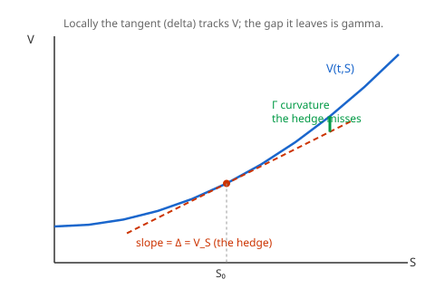

# Mathematical Finance · Lesson 2.2: Deriving the Black–Scholes PDE by delta-hedging

> ⏱ ~15 min · Module 2: The Black–Scholes model · Builds on: [2.1 The continuous-time market](02-01-continuous-time-market-self-financing.md) · Unlocks: [2.3 Risk-neutral pricing via Girsanov and Feynman–Kac](02-03-risk-neutral-pricing-girsanov-feynman-kac.md)

## Why this matters

In [1.5](01-05-binomial-model-risk-neutral-valuation.md) you priced an option node by node: at each step you held exactly enough stock to make your book insensitive to the next up/down move, and the option's price fell out of "the hedged book must earn the riskless rate." This lesson takes that same idea to the continuous limit and gets a single, famous equation — the **Black–Scholes PDE** — that every option value must obey. The punchline you should carry in from [1.1](01-01-arbitrage-law-of-one-price.md): the stock's real-world expected return $\mu$ will **vanish** from the price. You are not forecasting where the stock goes. You are pricing the cost of a hedge that neutralizes wherever it goes.

## The idea

An option value $V(t,S)$ depends on time $t$ and the current stock price $S$. As $S$ jiggles, $V$ jiggles — but locally, a curve looks like its tangent line. The **slope** of $V$ in $S$, call it $\Delta = V_S$, tells you how many shares move $V$-worth for a small stock move. So if you hold the option and simultaneously **short $\Delta$ shares**, the two $S$-driven wiggles cancel to first order: your combined book barely notices the next tick.

"Barely" is exact in the instantaneous limit. Over $[t, t+dt]$ the randomness — the $dW$ term — is *perfectly* cancelled, so the hedged book is momentarily **riskless**. A riskless book can't earn more or less than cash in the bank without opening an arbitrage, so it must grow at the riskless rate $r$. Writing "the hedged book grows at $r$" as an equation, and reading off the leftover deterministic terms from Itô's lemma, *is* the Black–Scholes PDE. The one thing the tangent line misses — the **curvature** $V_{SS}$ (gamma) — is exactly the term that survives into the PDE and gets paid for by time decay.

## The formal version

Model the stock as geometric Brownian motion (GBM), as in [2.1](02-01-continuous-time-market-self-financing.md):

$$dS = \mu S\,dt + \sigma S\,dW,$$

where $\mu$ is the real-world drift, $\sigma>0$ the volatility, and $W$ a Brownian motion. **Itô's lemma** applied to $V(t,S)$ (keeping the $\tfrac12 V_{SS}(dS)^2$ term, with $(dS)^2 = \sigma^2 S^2\,dt$):

$$dV = \Big(V_t + \mu S\,V_S + \tfrac12\sigma^2 S^2 V_{SS}\Big)dt + \sigma S\,V_S\,dW.$$

In words: the option's change has a predictable drift plus a random kick proportional to the same $dW$ that drives the stock.

**Form the hedged portfolio** $\Pi = V - \Delta S$ with $\Delta = V_S$ (long the option, short $V_S$ shares). Treating $\Delta$ as fixed over the instant,

$$d\Pi = dV - V_S\,dS = \Big(V_t + \tfrac12\sigma^2 S^2 V_{SS}\Big)dt.$$

In words: the $\mu S V_S\,dt$ and $\sigma S V_S\,dW$ terms both cancel against $V_S\,dS$ — **the risk is gone**, and so is $\mu$.

**No-arbitrage** forces this riskless increment to equal the riskless return on the same capital:

$$d\Pi = r\,\Pi\,dt = r\big(V - S\,V_S\big)dt.$$

Equating the two expressions for $d\Pi$ and cancelling $dt$ gives the **Black–Scholes PDE**:

$$\boxed{\,V_t + \tfrac12\sigma^2 S^2 V_{SS} + r S\,V_S - rV = 0\,}$$

with the **terminal condition** $V(T,S) = \text{payoff}(S)$ — for a European call, $V(T,S) = (S-K)^+$.

Three things to notice, each load-bearing:

1. **$\mu$ is gone.** The real-world drift — the market's opinion about the stock's expected return — does not appear. Price by hedging, not by forecasting ([1.1](01-01-arbitrage-law-of-one-price.md)).
2. **This is [1.5](01-05-binomial-model-risk-neutral-valuation.md) in the limit.** The node-by-node delta-hedge, with the time step shrinking to zero, becomes exactly this equation.
3. **It's backward-parabolic — the heat equation in disguise.** Data is specified at the *final* time $T$ and diffused *backward* to $t$. Under $\tau = T-t$ and $x = \ln S$ it becomes a forward diffusion equation (Problem 3, and fully in [2.4](02-04-black-scholes-formula.md)); the diffusion machinery lives in the PDEs course ([heat equation](../../pdes/syllabus.md)).

**Boundary conditions.** For a **call** ($V(T,S)=(S-K)^+$): $V(t,0)=0$ (a worthless stock gives a worthless call) and $V(t,S)\sim S - K e^{-r(T-t)}$ as $S\to\infty$ (deep in the money it behaves like a forward). For a **put** ($V(T,S)=(K-S)^+$): $V(t,0)=K e^{-r(T-t)}$ (the discounted strike) and $V(t,S)\to 0$ as $S\to\infty$.

## Picture

The tangent line at $S_0$ has slope $\Delta = V_S$ — that's the hedge, and it tracks $V$ perfectly for infinitesimal moves. The green gap is the curvature $V_{SS}$ (gamma) the straight line can't follow. That gap is why the hedge must be *re-set* continuously, and why $\tfrac12\sigma^2 S^2 V_{SS}$ shows up in the PDE.

## Worked examples

**Example 1 — the full derivation.** Start from GBM $dS = \mu S\,dt + \sigma S\,dW$ and $V(t,S)$. Itô's lemma needs first and second derivatives; with $(dW)^2 = dt$ and $(dS)^2 = \sigma^2 S^2\,dt$,

$$dV = V_t\,dt + V_S\,dS + \tfrac12 V_{SS}(dS)^2 = \Big(V_t + \mu S V_S + \tfrac12\sigma^2 S^2 V_{SS}\Big)dt + \sigma S V_S\,dW.$$

Set $\Delta = V_S$ and $\Pi = V - \Delta S$. Over the instant,

$$d\Pi = dV - \Delta\,dS = \Big(V_t + \mu S V_S + \tfrac12\sigma^2 S^2 V_{SS}\Big)dt + \sigma S V_S\,dW - V_S\big(\mu S\,dt + \sigma S\,dW\big).$$

The $\mu S V_S\,dt$ terms cancel and the $\sigma S V_S\,dW$ terms cancel:

$$d\Pi = \Big(V_t + \tfrac12\sigma^2 S^2 V_{SS}\Big)dt.$$

No $dW$: riskless. No-arbitrage ⇒ $d\Pi = r\Pi\,dt = r(V - S V_S)\,dt$. Equate:

$$V_t + \tfrac12\sigma^2 S^2 V_{SS} = rV - rS V_S \;\Longrightarrow\; V_t + \tfrac12\sigma^2 S^2 V_{SS} + rS V_S - rV = 0. \quad\checkmark$$

**Example 2 — two sanity checks and the call's data.** A valid pricing PDE had better price the *underlying instruments* correctly, so test the two simplest portfolios.

*Holding one share, $V = S$:* then $V_t = 0$, $V_S = 1$, $V_{SS} = 0$. Substitute:

$$0 + \tfrac12\sigma^2 S^2\cdot 0 + rS\cdot 1 - r\cdot S = 0. \quad\checkmark$$

*Holding the money-market account, $V = e^{rt}$:* then $V_t = r e^{rt}$, $V_S = V_{SS} = 0$. Substitute:

$$r e^{rt} + 0 + 0 - r\,e^{rt} = 0. \quad\checkmark$$

Both the stock and the bond satisfy the equation — as they must, since each is its own trivial hedge. Now the **call's boundary data**: terminal $V(T,S) = (S-K)^+$; left edge $V(t,0)=0$; far field $V(t,S)\sim S - K e^{-r(T-t)}$ as $S\to\infty$. Those three conditions plus the PDE pin down a *unique* function — which [2.4](02-04-black-scholes-formula.md) writes in closed form.

## Watch out

- **Do not forecast.** The most common conceptual error is thinking a bullish view on the stock (high $\mu$) should raise the call's price. It doesn't — $\mu$ cancels. Only $\sigma$, $r$, $K$, $T$ and current $S$ enter. Your view lives in $\mu$; the price lives in the hedge.
- **The hedge is only instantaneously riskless.** Holding $\Delta$ *fixed* over a finite interval leaves the gamma gap (the picture), so real hedging means *continuous* rebalancing. Treating $\Delta$ as constant while differentiating is legitimate only because we immediately take $dt\to 0$.
- **Gamma vs. theta — where the P&L is.** The surviving increment $d\Pi = (V_t + \tfrac12\sigma^2 S^2 V_{SS})\,dt$ splits into **theta** $V_t$ (time decay) and **gamma** $\tfrac12\sigma^2 S^2 V_{SS}$ (curvature). The PDE says they must exactly offset the financing cost $r(V - S V_S)$. Long gamma earns from every move but bleeds theta; the PDE is the break-even. This is the whole story of [2.5](02-05-greeks-dynamic-hedging.md).
- **Sign of time.** The condition is at $T$ (terminal), not at $t=0$ (initial). You diffuse *backward*. Getting this backward gives a nonsense (blow-up) solution.

## One-liner

> Cancel the option's randomness with $\Delta = V_S$ shares, force the leftover riskless book to earn $r$, and $\mu$ drops out — leaving $V_t + \tfrac12\sigma^2 S^2 V_{SS} + rSV_S - rV = 0$.

## Problems

**P1 (🟢)** A forward contract to buy the stock at $K$ at time $T$ has value $V(t,S) = S - K e^{-r(T-t)}$. Verify directly that it satisfies the Black–Scholes PDE. (No terminal-condition check needed — just the equation.)

**P2 (🟡)** Redo the hedge from the **dealer's** side: you are *short* one call and hold $\Delta = V_S$ shares against it, so your book is $\Pi = \Delta S - V$. Show the $dW$ term cancels, impose $d\Pi = r\Pi\,dt$, and confirm you recover the *same* Black–Scholes PDE. (Moral: the sign convention doesn't matter.)

**P3 (🔴)** Change variables to $\tau = T - t$ and $x = \ln S$, writing $V(t,S) = u(\tau, x)$. Show the Black–Scholes PDE becomes the constant-coefficient equation

$$u_\tau = \tfrac12\sigma^2 u_{xx} + \big(r - \tfrac12\sigma^2\big)u_x - r\,u,$$

a forward convection–diffusion equation. Then set up (don't finish) the substitution $u = e^{\alpha x + \beta \tau} w(\tau,x)$ that kills the $u_x$ and $u$ terms, and find the $\alpha$ that removes the $u_x$ term. (The full reduction to the bare heat equation is [2.4](02-04-black-scholes-formula.md).)

Solutions

**P1** With $V = S - K e^{-r(T-t)}$: since $\frac{d}{dt}e^{-r(T-t)} = r\,e^{-r(T-t)}$,

$$V_t = -K r\,e^{-r(T-t)}, \qquad V_S = 1, \qquad V_{SS} = 0.$$

Substitute into the PDE:

$$V_t + \tfrac12\sigma^2 S^2 V_{SS} + rS V_S - rV = -Kr e^{-r(T-t)} + 0 + rS - r\big(S - K e^{-r(T-t)}\big).$$

The $rS$ terms cancel and $-Kr e^{-r(T-t)} + rK e^{-r(T-t)} = 0$, so the sum is $0$. $\checkmark$ (Note $V_{SS}=0$: a forward is linear in $S$, has zero gamma, and needs no dynamic rehedging — its delta is a constant $1$.)

**P2** With $\Pi = \Delta S - V$ and $\Delta = V_S$:

$$d\Pi = V_S\,dS - dV = V_S(\mu S\,dt + \sigma S\,dW) - \Big[\big(V_t + \mu S V_S + \tfrac12\sigma^2 S^2 V_{SS}\big)dt + \sigma S V_S\,dW\Big].$$

The $\mu S V_S\,dt$ and $\sigma S V_S\,dW$ terms cancel, leaving

$$d\Pi = -\big(V_t + \tfrac12\sigma^2 S^2 V_{SS}\big)dt \quad(\text{riskless — no }dW).$$

No-arbitrage: $d\Pi = r\Pi\,dt = r(S V_S - V)\,dt$. Equate:

$$-\big(V_t + \tfrac12\sigma^2 S^2 V_{SS}\big) = r S V_S - rV \;\Longrightarrow\; V_t + \tfrac12\sigma^2 S^2 V_{SS} + rS V_S - rV = 0. \quad\checkmark$$

Identical PDE. Both sides of the trade — the buyer hedging with a short stock position and the dealer hedging with a long one — arrive at the same equation, because the PDE describes the *option*, not who holds it.

**P3** Let $V(t,S) = u(\tau, x)$ with $\tau = T-t$, $x = \ln S$ (so $\partial\tau/\partial t = -1$, $\partial x/\partial S = 1/S$). Chain rule:

$$V_t = -u_\tau, \qquad V_S = \frac{1}{S}u_x, \qquad V_{SS} = \frac{\partial}{\partial S}\!\Big(\frac{u_x}{S}\Big) = \frac{u_{xx}}{S^2} - \frac{u_x}{S^2} = \frac{u_{xx} - u_x}{S^2}.$$

Substitute into $V_t + \tfrac12\sigma^2 S^2 V_{SS} + rS V_S - rV = 0$:

$$-u_\tau + \tfrac12\sigma^2 S^2\cdot\frac{u_{xx}-u_x}{S^2} + rS\cdot\frac{u_x}{S} - r u = 0.$$

The $S^2$ and $S$ factors cancel cleanly (that's the point of $x=\ln S$):

$$-u_\tau + \tfrac12\sigma^2(u_{xx} - u_x) + r\,u_x - r u = 0 \;\Longrightarrow\; u_\tau = \tfrac12\sigma^2 u_{xx} + \big(r - \tfrac12\sigma^2\big)u_x - r u. \quad\checkmark$$

Constant coefficients now — a diffusion term $\tfrac12\sigma^2 u_{xx}$, a convection (drift) term $(r-\tfrac12\sigma^2)u_x$, and a decay term $-ru$.

*Setting up the last cleanup.* Try $u = e^{\alpha x + \beta\tau}w(\tau,x)$. Then $u_\tau = e^{\alpha x+\beta\tau}(\beta w + w_\tau)$, $u_x = e^{\alpha x+\beta\tau}(\alpha w + w_x)$, $u_{xx} = e^{\alpha x+\beta\tau}(\alpha^2 w + 2\alpha w_x + w_{xx})$. Dividing through by $e^{\alpha x+\beta\tau}$ and collecting the coefficient of $w_x$ gives $\sigma^2\alpha + (r - \tfrac12\sigma^2)$; setting it to zero,

$$\alpha = -\frac{r - \tfrac12\sigma^2}{\sigma^2} = \frac12 - \frac{r}{\sigma^2}.$$

With this $\alpha$ the convection term is gone; choosing $\beta$ to zero out the remaining $w$-coefficient then leaves the bare heat equation $w_\tau = \tfrac12\sigma^2 w_{xx}$. Finishing $\beta$ and applying the Gaussian heat kernel to the transformed payoff is exactly [2.4](02-04-black-scholes-formula.md).

## Flashback

**From [2.1](02-01-continuous-time-market-self-financing.md) (Itô on GBM):** With $dS = \mu S\,dt + \sigma S\,dW$, use Itô's lemma on $Y = \ln S$ to find $dY$, and hence write the closed-form solution $S_t$.

Solution

For $f(S) = \ln S$: $f'(S) = 1/S$, $f''(S) = -1/S^2$. Itô's lemma with $(dS)^2 = \sigma^2 S^2\,dt$:

$$dY = f'\,dS + \tfrac12 f''(dS)^2 = \frac{1}{S}(\mu S\,dt + \sigma S\,dW) + \tfrac12\Big(-\frac{1}{S^2}\Big)\sigma^2 S^2\,dt = \big(\mu - \tfrac12\sigma^2\big)dt + \sigma\,dW.$$

The $-\tfrac12\sigma^2$ is the Itô correction — log-price drifts *slower* than $\mu$. Integrating from $0$ to $t$ (constant coefficients, $W_0=0$):

$$\ln S_t - \ln S_0 = \big(\mu - \tfrac12\sigma^2\big)t + \sigma W_t \;\Longrightarrow\; S_t = S_0\exp\!\Big(\big(\mu - \tfrac12\sigma^2\big)t + \sigma W_t\Big).$$

That same $-\tfrac12\sigma^2$ correction is the $\alpha$-shift you saw in Problem 3's change of variables, and it's what makes $\ln S_t$ (not $S_t$) the naturally Gaussian coordinate.

## Connections

- **Backward:** the hedge $\Pi = V - V_S\,S$ is the self-financing replicating strategy of [2.1](02-01-continuous-time-market-self-financing.md) written in continuous time, and the whole argument is [1.5](01-05-binomial-model-risk-neutral-valuation.md)'s node-by-node delta-hedge with the time step sent to zero.
- **Forward (same price, other route):** [2.3](02-03-risk-neutral-pricing-girsanov-feynman-kac.md) gets the identical price as a discounted *expectation* under the risk-neutral measure — Feynman–Kac is the theorem that this PDE and that expectation are the same object. [2.4](02-04-black-scholes-formula.md) solves the PDE explicitly.
- **Sideways (PDEs):** after $\tau = T-t$, $x=\ln S$ this is the [heat equation](../../pdes/syllabus.md) with lower-order terms — backward-parabolic diffusion, solved by a Gaussian kernel.
- **Sideways (stochastic calculus):** the engine is Itô's lemma and the quadratic-variation rule $(dW)^2 = dt$ from [stochastic calculus](../../stochastic-calculus/syllabus.md); the $\tfrac12\sigma^2 S^2 V_{SS}$ term is Itô's second-order correction made financial.
- **Forward (the Greeks):** the leftover $d\Pi = (\text{theta} + \text{gamma})\,dt$ is the P&L decomposition that [2.5](02-05-greeks-dynamic-hedging.md) turns into a hedging discipline.
