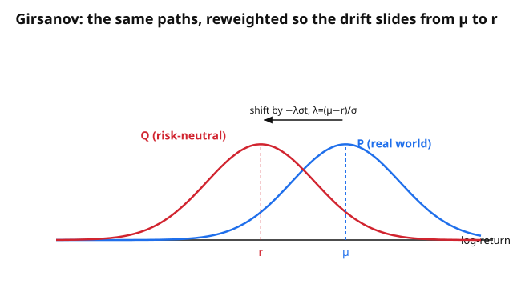

# Mathematical Finance · Lesson 2.3: Risk-neutral pricing via Girsanov and Feynman–Kac

> ⏱ ~15 min · Module 2: The Black–Scholes model · Builds on: [2.2 Deriving the Black–Scholes PDE](02-02-black-scholes-pde-delta-hedging.md) · Unlocks: [2.4 The Black–Scholes formula](02-04-black-scholes-formula.md)

## Why this matters

Lesson 2.2 priced an option by building a hedging portfolio and forcing the drift out with a PDE. That's the *analyst's* route. There is a second, completely different-looking route — write the price as a plain expectation of the discounted payoff — and the punchline of this lesson is that **the two routes compute the same number, because the PDE and the expectation are literally the same object**. Feynman–Kac is the theorem that welds them together; Girsanov is the change of measure that makes the expectation the *right* one to take. Once you see the weld, the Black–Scholes formula in 2.4 is a five-minute integral, not a new derivation.

## The idea

Under the real-world measure $P$, the stock earns its risk premium: $dS = \mu S\,dt + \sigma S\,dW$, with $\mu > r$ because investors demand compensation for risk. That premium is exactly what makes naive "expected discounted payoff" pricing wrong — it would double-count the risk that hedging already neutralizes.

Girsanov's trick is to **tilt the probabilities** — not the paths, the *odds* on the paths — until the stock's expected growth rate drops to the risk-free rate $r$. Under this tilted measure $Q$, every tradable asset drifts at $r$: the premium has been engineered away. In that world discounting at $r$ is honest, so the price is just $e^{-r(T-t)}$ times the $Q$-expected payoff. The tilt is not a forecast — nobody believes the stock will really only grow at $r$. $Q$ is a *pricing device*: it reweights outcomes precisely so that no-arbitrage prices come out as expectations.

The amount of tilt is set by one number, the **market price of risk** $\lambda = (\mu - r)/\sigma$: excess return per unit of volatility, i.e. how much drift each unit of noise has to carry. Girsanov shifts the Brownian motion by exactly $\lambda\,t$, which slides the stock's drift from $\mu$ down to $r$.

## The formal version

**Market price of risk.**
$$\lambda = \frac{\mu - r}{\sigma}.$$
In words: the Sharpe-ratio-like quantity that says how much extra drift the market pays per unit of volatility. It is the "exchange rate" between risk and return that Girsanov will zero out.

**Girsanov's theorem (the version we need).** Let $W_t$ be a $P$-Brownian motion. Define a new measure $Q$ via the density $\frac{dQ}{dP} = \exp\!\big(-\lambda W_T - \tfrac12\lambda^2 T\big)$. Then
$$W^Q_t = W_t + \lambda t$$
is a **Brownian motion under $Q$**. In words: adding a deterministic drift $\lambda t$ to a Brownian motion is exactly undone by re-weighting the probabilities — under the new odds, the shifted process is again "pure noise," standard Brownian motion.

**Consequence for the stock.** Substitute $dW = dW^Q - \lambda\,dt$ into $dS = \mu S\,dt + \sigma S\,dW$:
$$dS = \mu S\,dt + \sigma S(dW^Q - \lambda\,dt) = (\mu - \sigma\lambda)S\,dt + \sigma S\,dW^Q = rS\,dt + \sigma S\,dW^Q,$$
using $\sigma\lambda = \mu - r$. In words: the excess return $\mu - r$ is exactly absorbed; under $Q$ the stock drifts at the risk-free rate.

**Discounted stock is a $Q$-martingale.** Let $\tilde S_t = e^{-rt}S_t$. Then $d\tilde S_t = \sigma \tilde S_t\,dW^Q_t$ — no drift term (worked below). In words: after discounting, the stock is a fair game under $Q$; its expected future value equals its price today. This $Q$ is the continuous-time **equivalent martingale measure (EMM)** whose one-period discrete cousin was the $q$ of [1.3](01-03-one-period-model-pricing-measure.md)–[1.4](01-04-fundamental-theorem-asset-pricing.md).

**Risk-neutral pricing formula.** For a claim paying $\text{payoff}(S_T)$ at $T$,
$$V(t,S) = e^{-r(T-t)}\,\mathbb{E}^Q\!\big[\text{payoff}(S_T)\,\big|\,S_t = S\big].$$
In words: price = discounted expected payoff, expectation taken under the tilted measure $Q$, *not* under $P$.

**Feynman–Kac (the bridge).** If $u(t,x)$ solves the terminal-value PDE
$$u_t + b(x)\,u_x + \tfrac12 a(x)^2\,u_{xx} - r\,u = 0, \qquad u(T,x) = g(x),$$
then it has the stochastic representation
$$u(t,x) = \mathbb{E}\!\big[e^{-r(T-t)}\,g(X_T)\,\big|\,X_t = x\big], \qquad dX = b(X)\,dt + a(X)\,dW.$$
In words: the solution of a linear parabolic PDE with a $-ru$ term equals a discounted expectation of its terminal data, taken along the diffusion whose drift and volatility are the PDE's first- and second-order coefficients. Match coefficients against the Black–Scholes PDE $V_t + \tfrac12\sigma^2 S^2 V_{SS} + rSV_S - rV = 0$ — its drift coefficient is $rS$, its diffusion is $\sigma S$, exactly the **$Q$-dynamics** — and Feynman–Kac hands you the pricing formula above. The PDE of 2.2 and this expectation are one object seen from two sides.

## Picture

The paths are unchanged; only the *probability weight* on each outcome moves. Girsanov re-centers the log-return's distribution from mean $\mu$ (blue, $P$) to mean $r$ (red, $Q$) by shifting the driving noise by $-\lambda\sigma t$. Under the red odds, discounting at $r$ prices every claim.

## Worked examples

**Example 1 (Girsanov applied — $Q$-dynamics and the log-normal law).**
Start from $dS = \mu S\,dt + \sigma S\,dW$. With $\lambda = (\mu-r)/\sigma$ and $W^Q_t = W_t + \lambda t$, the substitution above gives
$$dS = rS\,dt + \sigma S\,dW^Q.$$
Apply Itô to $\ln S$ (recall $d\ln S = \frac{dS}{S} - \frac12\frac{(dS)^2}{S^2}$, and $(dS)^2 = \sigma^2 S^2\,dt$):
$$d\ln S = \Big(r - \tfrac12\sigma^2\Big)dt + \sigma\,dW^Q.$$
Integrating from $t$ to $T$,
$$S_T = S_t\exp\!\Big(\big(r - \tfrac12\sigma^2\big)(T-t) + \sigma\,(W^Q_T - W^Q_t)\Big).$$
Since $W^Q_T - W^Q_t \sim \mathcal N(0,\,T-t)$ under $Q$, $S_T$ is **log-normal under $Q$**, with $\mathbb{E}^Q[S_T\mid S_t] = S_t\,e^{r(T-t)}$ (the mean of the log-normal — the $-\tfrac12\sigma^2$ and the $+\tfrac12\sigma^2$ from the variance cancel). The stock grows at $r$ in $Q$-expectation, as it must. This log-normal is precisely what 2.4 will integrate against the call payoff.

**Example 2 (Feynman–Kac in action — discounted price is driftless).**
Suppose $V(t,S)$ solves the Black–Scholes PDE $V_t + \tfrac12\sigma^2 S^2 V_{SS} + rSV_S - rV = 0$. Discount it: consider $Y_t = e^{-rt}V(t,S_t)$ with $S$ following the $Q$-dynamics $dS = rS\,dt + \sigma S\,dW^Q$. By Itô (product rule plus Itô on $V$, using $(dS)^2 = \sigma^2S^2\,dt$):
$$dY_t = e^{-rt}\Big[\big(-rV + V_t + rSV_S + \tfrac12\sigma^2S^2V_{SS}\big)dt + \sigma S V_S\,dW^Q\Big].$$
The bracketed $dt$-coefficient is **exactly the left side of the BS PDE, which is zero.** So
$$dY_t = e^{-rt}\sigma S_t V_S\,dW^Q_t,$$
a driftless Itô integral — $Y_t = e^{-rt}V(t,S_t)$ is a **$Q$-martingale**. Therefore $e^{-rt}V(t,S_t) = \mathbb{E}^Q[e^{-rT}V(T,S_T)\mid \mathcal F_t] = \mathbb{E}^Q[e^{-rT}\text{payoff}(S_T)\mid \mathcal F_t]$, which rearranges to the pricing formula. The PDE *is* the statement "the discounted price has no drift under $Q$." That is Feynman–Kac, done by hand.

## Watch out

- **$Q$ is not a forecast.** $\mathbb{E}^Q[\text{payoff}]$ is a *pricing* expectation, not a prediction of what will happen. Under $Q$ the stock drifts at $r$; nobody believes that in the real world. Reporting a $Q$-expectation as "the expected payoff" is a category error.
- **The premium doesn't vanish into thin air — it's absorbed, exactly.** $\mu$ disappears from every pricing formula not because it's irrelevant but because $\lambda = (\mu-r)/\sigma$ measured it and Girsanov cancelled it. The option price depends on $\sigma$, $r$, not $\mu$ — a feature, not a bug.
- **Same $\sigma$ under $P$ and $Q$.** Girsanov changes drift, never volatility (a measure change can't alter quadratic variation). If your $Q$-dynamics have a different $\sigma$, you've made an error.
- **The $-ru$ term matters.** Feynman–Kac without the $-ru$ term represents an *undiscounted* expectation. The $-r$ in the PDE is exactly what puts the $e^{-r(T-t)}$ discount factor in front of the expectation.

## One-liner

> Girsanov tilts the odds until every asset drifts at $r$; Feynman–Kac then reads the Black–Scholes PDE as "discounted price = $Q$-expected discounted payoff" — the analyst's PDE and the probabilist's expectation are one object.

## Problems

**P1 (🟢)** A stock has real-world dynamics $dS = 0.11\,S\,dt + 0.20\,S\,dW$ and the risk-free rate is $r = 0.03$. Compute the market price of risk $\lambda$, and write the stock's dynamics under the risk-neutral measure $Q$ in terms of a $Q$-Brownian motion $W^Q$.

**P2 (🟡)** With the same $Q$-dynamics $dS = rS\,dt + \sigma S\,dW^Q$, show directly (via Itô) that the discounted price $\tilde S_t = e^{-rt}S_t$ satisfies $d\tilde S_t = \sigma\tilde S_t\,dW^Q_t$ and is therefore a $Q$-martingale. State in one sentence why this is the continuous-time version of the EMM condition from [1.4](01-04-fundamental-theorem-asset-pricing.md).

**P3 (🔴)** Feynman–Kac both directions.
(a) Let $u(t,x)$ solve $u_t + \tfrac12\sigma^2 u_{xx} - r\,u = 0$ on $t<T$ with $u(T,x) = x^2$. Write $u(t,x)$ as an expectation over a diffusion $X$, identify that diffusion, and evaluate the expectation in closed form. (Here $X$ has zero drift and constant volatility $\sigma$.)
(b) Conversely, express $w(t,x) = \mathbb{E}\big[e^{-r(T-t)}\cos(X_T)\mid X_t=x\big]$, where $dX = \sigma\,dW$, as the solution of a terminal-value PDE — just write the PDE and terminal condition, don't solve it.

Solutions

**P1** $\lambda = \dfrac{\mu - r}{\sigma} = \dfrac{0.11 - 0.03}{0.20} = \dfrac{0.08}{0.20} = 0.40.$
Setting $W^Q_t = W_t + \lambda t$, Girsanov makes $W^Q$ a $Q$-Brownian motion, and the drift collapses to $r$:
$$dS = 0.03\,S\,dt + 0.20\,S\,dW^Q.$$
(Check: $\mu - \sigma\lambda = 0.11 - 0.20\cdot 0.40 = 0.11 - 0.08 = 0.03 = r$. ✓)

**P2** Let $f(t,S) = e^{-rt}S$, so $f_t = -re^{-rt}S$, $f_S = e^{-rt}$, $f_{SS} = 0$. Itô on $\tilde S_t = f(t,S_t)$ with $dS = rS\,dt + \sigma S\,dW^Q$ and $(dS)^2 = \sigma^2 S^2\,dt$:
$$d\tilde S_t = f_t\,dt + f_S\,dS + \tfrac12 f_{SS}(dS)^2 = -re^{-rt}S\,dt + e^{-rt}(rS\,dt + \sigma S\,dW^Q).$$
The two $rS$ drift terms cancel:
$$d\tilde S_t = e^{-rt}\sigma S_t\,dW^Q_t = \sigma\,\tilde S_t\,dW^Q_t.$$
No $dt$-term ⇒ $\tilde S_t$ is a driftless Itô integral ⇒ a $Q$-martingale (geometric Brownian motion with zero drift, in fact $\tilde S_t = \tilde S_0\exp(\sigma W^Q_t - \tfrac12\sigma^2 t)$). This is the EMM condition of [1.4](01-04-fundamental-theorem-asset-pricing.md): no-arbitrage ⟺ there is a measure $Q$ under which the *discounted* asset price is a martingale — here demonstrated in continuous time rather than one period.

**P3 (a)** Match $u_t + \tfrac12\sigma^2 u_{xx} - ru = 0$ against Feynman–Kac ($b=0$, $a=\sigma$): the diffusion is $dX = \sigma\,dW$, i.e. $X_T = x + \sigma(W_T - W_t)$, so $X_T \sim \mathcal N(x,\ \sigma^2(T-t))$. Then
$$u(t,x) = \mathbb{E}\big[e^{-r(T-t)}X_T^2 \mid X_t = x\big] = e^{-r(T-t)}\,\mathbb{E}[X_T^2].$$
For $X_T\sim\mathcal N(x,\sigma^2(T-t))$, $\mathbb{E}[X_T^2] = \text{Var} + \text{mean}^2 = \sigma^2(T-t) + x^2$. Hence
$$u(t,x) = e^{-r(T-t)}\big(x^2 + \sigma^2(T-t)\big).$$
(Sanity check by plugging into the PDE: $u_t = re^{-r(T-t)}(x^2+\sigma^2(T-t)) - e^{-r(T-t)}\sigma^2 = ru - e^{-r(T-t)}\sigma^2$; and $\tfrac12\sigma^2 u_{xx} = \tfrac12\sigma^2\cdot 2e^{-r(T-t)} = e^{-r(T-t)}\sigma^2$. So $u_t + \tfrac12\sigma^2 u_{xx} - ru = -e^{-r(T-t)}\sigma^2 + e^{-r(T-t)}\sigma^2 = 0$. ✓ And $u(T,x)=x^2$. ✓)

**(b)** Read Feynman–Kac backward with $g(x) = \cos x$, drift $b=0$, volatility $a=\sigma$, discount $r$. The function $w(t,x)$ solves
$$w_t + \tfrac12\sigma^2 w_{xx} - r\,w = 0, \qquad w(T,x) = \cos x.$$

## Flashback

**From Lesson 2.2 (Black–Scholes PDE):** Verify that $V(t,S) = S$ (holding one share) and $V(t,S) = e^{-r(T-t)}K$ (a guaranteed cash payment $K$ at $T$) each satisfy the Black–Scholes PDE $V_t + \tfrac12\sigma^2 S^2 V_{SS} + rS V_S - rV = 0$. What does each represent, and why is it reassuring that both are solutions?

Solution

**$V = S$:** $V_t = 0$, $V_S = 1$, $V_{SS} = 0$. Plug in: $0 + 0 + rS\cdot 1 - rS = 0.$ ✓ This is the price of the stock itself — one share is a (trivial) tradable claim with payoff $S_T$, and it had better price to $S$ today.

**$V = e^{-r(T-t)}K$:** $V_t = re^{-r(T-t)}K$, $V_S = 0$, $V_{SS} = 0$. Plug in: $re^{-r(T-t)}K + 0 + 0 - r\,e^{-r(T-t)}K = 0.$ ✓ This is the price today of a guaranteed $K$ paid at $T$ — a zero-coupon bond, worth the discounted face value.

Reassuring because the two most basic claims — "own the stock" and "hold cash to $T$" — must be priced correctly by any valid pricing equation. By linearity, any portfolio $aS + b\,e^{-r(T-t)}K$ also solves the PDE, which is exactly the replicating-portfolio structure behind option pricing. (In the language of this lesson: $S$ and the bond are the two assets whose *discounted* values are $Q$-martingales, and every price is built from them.)

## Connections

- **Backward:** this is the probabilistic twin of [2.2](02-02-black-scholes-pde-delta-hedging.md)'s hedging PDE — Feynman–Kac proves they price identically. The measure $Q$ is the continuous-time [equivalent martingale measure](01-04-fundamental-theorem-asset-pricing.md); the drift-cancelling tilt is the continuous limit of choosing the risk-neutral probability $q$ in the [one-period model](01-03-one-period-model-pricing-measure.md).
- **Forward:** [2.4](02-04-black-scholes-formula.md) simply evaluates $e^{-r(T-t)}\mathbb{E}^Q[(S_T-K)^+]$ using the log-normal law from Example 1 — no new theory, just a Gaussian integral. In [Module 4](04-03-forward-measures-changing-numeraire.md), the same Girsanov machinery reappears as **change of numéraire**: discounting by a bond instead of cash defines a *forward measure*, turning messier interest-rate claims back into clean expectations.
- **Sideways (stochastic calculus):** Girsanov's theorem and Feynman–Kac are the two load-bearing results of the [stochastic-calculus](../../stochastic-calculus/syllabus.md) course; here you see why finance cares — they are the entire bridge between "hedge with a PDE" and "price with an expectation."
