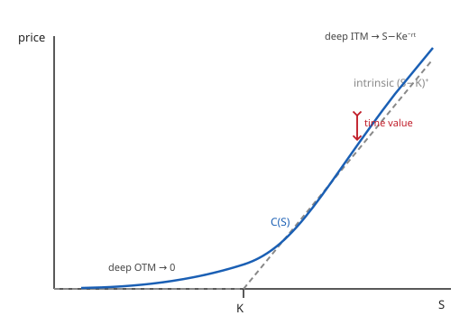

# Mathematical Finance · Lesson 2.4: The Black–Scholes formula

> ⏱ ~15 min · Module 2: The Black–Scholes model · Builds on: [2.3 Risk-neutral pricing](02-03-risk-neutral-pricing-girsanov-feynman-kac.md) · Unlocks: [2.5 The Greeks and dynamic hedging](02-05-greeks-dynamic-hedging.md)

## Why this matters

Lesson 2.3 handed you the master rule: the arbitrage-free price of any European claim is its **discounted risk-neutral expected payoff**, $C = e^{-rT}\,\mathbb{E}^{\mathbb{Q}}[\text{payoff}]$. That's the theory. But an expectation is just an integral, and until you can actually *evaluate* it you have a principle, not a price. For the one payoff that built the whole field — the European call $(S_T - K)^+$ — the integral collapses into a closed form you can type into a calculator. That formula, Black–Scholes, is the "hydrogen atom" of the subject: every later idea (the Greeks, implied vol, the smile) is a derivative, limit, or distortion of *this* object. Learn it cold.

## The idea

The call pays $(S_T - K)^+$: everything above the strike $K$, nothing below. Under $\mathbb{Q}$ the stock is **log-normal** — $\ln S_T$ is Gaussian — so pricing the call is just integrating a hockey-stick payoff against a bell curve. When you do, two clean pieces fall out:

$$C = \underbrace{S_0\,N(d_1)}_{\text{the shares you'd hold}} \;-\; \underbrace{K e^{-rT}\,N(d_2)}_{\text{the cash you'd owe}}.$$

The formula literally *is* a portfolio: a call is worth like holding $N(d_1)$ shares financed by borrowing $K e^{-rT} N(d_2)$ in cash — the replicating hedge of Lesson 2.2, priced. The two $N(\cdot)$'s are standard-normal probabilities, and each answers a real question:

- $N(d_2)$ = the **risk-neutral probability the option finishes in the money**, $\mathbb{Q}(S_T > K)$.
- $S_0 N(d_1)$ = the **discounted expected stock value, conditional on exercise** — the value the shares actually deliver you when you do exercise.

Time value is the gap between this curve and the intrinsic payoff (the picture below). It comes entirely from log-normality: the chance the stock drifts further into the money before $T$ is worth paying for.

## The formal version

**Black–Scholes call price.** In a market with constant rate $r$ and volatility $\sigma$, with the stock following $dS_t = r S_t\,dt + \sigma S_t\,dW_t^{\mathbb{Q}}$ under the risk-neutral measure $\mathbb{Q}$, the price at time $0$ of a European call struck at $K$, maturity $T$, is

$$\boxed{\,C = S_0\,N(d_1) - K e^{-rT} N(d_2)\,}, \qquad
d_1 = \frac{\ln(S_0/K) + (r + \tfrac{1}{2}\sigma^2)T}{\sigma\sqrt{T}}, \quad d_2 = d_1 - \sigma\sqrt{T},$$

where $N(x) = \int_{-\infty}^x \tfrac{1}{\sqrt{2\pi}} e^{-z^2/2}\,dz$ is the standard-normal CDF, $S_0$ the spot price, and $\sigma\sqrt{T}$ the total volatility over the option's life.

*In words:* the price is today's stock times a probability, minus the discounted strike times a smaller probability.

**Put–call parity.** Holding a call and shorting a put (same $K$, $T$) has payoff $(S_T-K)^+ - (K-S_T)^+ = S_T - K$ in every state — a forward. Pricing that forward gives

$$C - P = S_0 - K e^{-rT} \quad\Longrightarrow\quad P = K e^{-rT} N(-d_2) - S_0 N(-d_1),$$

using $N(-x) = 1 - N(x)$. *In words:* the put is the mirror image; you never derive it separately.

**Delta.** The hedge ratio is

$$\Delta = \frac{\partial C}{\partial S_0} = N(d_1),$$

which is what makes $S_0 N(d_1)$ the "shares you hold" — you'll verify this clean identity in P3.

## Deriving it — the risk-neutral integral

Under $\mathbb{Q}$, $S_T = S_0 \exp\!\big((r - \tfrac{1}{2}\sigma^2)T + \sigma\sqrt{T}\,Z\big)$ with $Z \sim N(0,1)$. The call finishes in the money iff

$$S_T > K \iff Z > \frac{\ln(K/S_0) - (r-\tfrac12\sigma^2)T}{\sigma\sqrt{T}} = -d_2.$$

So, writing $\varphi(z) = \tfrac{1}{\sqrt{2\pi}}e^{-z^2/2}$,

$$C = e^{-rT}\mathbb{E}^{\mathbb{Q}}[(S_T-K)^+] = e^{-rT}\!\int_{-d_2}^{\infty}\!\big(S_0 e^{(r-\frac12\sigma^2)T + \sigma\sqrt{T}z} - K\big)\varphi(z)\,dz.$$

**The cash term** is immediate: $e^{-rT}K\int_{-d_2}^\infty \varphi(z)\,dz = e^{-rT}K\,\mathbb{Q}(Z > -d_2) = K e^{-rT}N(d_2)$.

**The stock term** needs a *complete-the-square*. Fold the exponentials together:

$$(r-\tfrac12\sigma^2)T + \sigma\sqrt{T}\,z - \tfrac{z^2}{2} = rT - \tfrac{1}{2}\big(z - \sigma\sqrt{T}\big)^2.$$

The $e^{rT}$ cancels the discount, and the Gaussian is now *recentered* at $\sigma\sqrt{T}$ — this shift is exactly the change of numéraire (measuring value in shares instead of cash). Substitute $w = z - \sigma\sqrt{T}$; the lower limit $-d_2$ becomes $-d_2 - \sigma\sqrt{T} = -d_1$:

$$e^{-rT}S_0\!\int_{-d_2}^\infty e^{(r-\frac12\sigma^2)T+\sigma\sqrt{T}z}\varphi(z)\,dz = S_0\!\int_{-d_1}^{\infty}\varphi(w)\,dw = S_0\,N(d_1).$$

Subtract, and $C = S_0 N(d_1) - K e^{-rT}N(d_2)$. The two integrals *are* the two terms.

## The second route — PDE to heat equation (boss problem 2, sketch)

The same price solves the Black–Scholes PDE from Lesson 2.2,

$$\frac{\partial C}{\partial t} + \tfrac12\sigma^2 S^2\frac{\partial^2 C}{\partial S^2} + rS\frac{\partial C}{\partial S} - rC = 0, \qquad C(S,T) = (S-K)^+.$$

Change variables to kill the $S$-dependence of the coefficients: let $x = \ln(S/K)$, $\tau = \tfrac12\sigma^2(T-t)$, and write $C = K\,v(x,\tau)$. This turns the PDE into $v_\tau = v_{xx} + (k-1)v_x - k v$ with $k = 2r/\sigma^2$. Absorb the drift and decay terms with $v = e^{\alpha x + \beta\tau}u$, choosing $\alpha = -\tfrac{k-1}{2}$, $\beta = -\tfrac{(k+1)^2}{4}$, and you land on the pure **heat equation** $u_\tau = u_{xx}$ with an initial hockey-stick $u(x,0) = (e^{(k+1)x/2} - e^{(k-1)x/2})^+$. Convolve against the Gaussian heat kernel $\tfrac{1}{\sqrt{4\pi\tau}}e^{-(x-s)^2/4\tau}$; the two exponential pieces each integrate to an $N(\cdot)$, and unwinding the substitutions reassembles $S_0 N(d_1) - K e^{-rT}N(d_2)$ exactly. Same formula, no probability used — see the [PDEs syllabus](../../pdes/syllabus.md) for the heat-kernel machinery.

## Picture

The smooth curve is $C(S_0)$; the dashed kink is intrinsic value $(S-K)^+$. The vertical gap is **time value**, fattest near the strike and vanishing at both extremes: deep out-of-the-money the call is worthless, deep in-the-money it converges to the forward $S_0 - Ke^{-rT}$, and as $T\to 0$ the whole curve collapses onto the kink.

## Worked examples

**Example 1 (plug in numbers).** Take $S_0 = 100$, $K = 100$, $r = 5\%$, $\sigma = 20\%$, $T = 1$.

$$d_1 = \frac{\ln 1 + (0.05 + 0.02)(1)}{0.20\sqrt{1}} = \frac{0.07}{0.20} = 0.35, \qquad d_2 = 0.35 - 0.20 = 0.15.$$

From a normal table, $N(0.35) = 0.6368$ and $N(0.15) = 0.5596$; also $e^{-0.05} = 0.9512$. Then

$$C = 100(0.6368) - 100(0.9512)(0.5596) = 63.68 - 53.23 = 6.\!\ldots\; \Rightarrow\; C \approx 10.45.$$

(That is $63.68 - 53.23 = 10.45$.) The put follows from parity without any new $N$ lookups:

$$P = C - S_0 + K e^{-rT} = 10.45 - 100 + 95.12 = 5.57.$$

Cross-check via the put formula: $P = 95.12\,N(-0.15) - 100\,N(-0.35) = 95.12(0.4404) - 100(0.3632) = 41.89 - 36.32 = 5.57$. ✓ An at-the-money call is worth about 10.5% of spot here — a useful rule of thumb ($C_{\text{ATM}} \approx 0.4\,S_0\sigma\sqrt{T}$).

**Example 2 (the complete-the-square, watched closely).** Why does the stock term produce $N(d_1)$ and not $N(d_2)$? Track the exponent. Starting from $\sigma\sqrt{T}z - \tfrac{z^2}{2}$ inside the integral, complete the square:

$$-\tfrac12 z^2 + \sigma\sqrt{T}\,z = -\tfrac12\big(z^2 - 2\sigma\sqrt{T}z\big) = -\tfrac12\big(z-\sigma\sqrt{T}\big)^2 + \tfrac12\sigma^2 T.$$

That leftover $+\tfrac12\sigma^2 T$ is precisely what cancels the $-\tfrac12\sigma^2 T$ in the drift, leaving a clean $rT$ to cancel the discount. The recentered variable $w = z - \sigma\sqrt{T}$ pushes the integration limit from $-d_2$ down to $-d_1$ — a shift of exactly $\sigma\sqrt{T}$, the gap between $d_1$ and $d_2$. So the *only* difference between the two terms' probabilities is this one measure shift: the cash term integrates the raw density (giving $N(d_2)$), the stock term integrates the density weighted by $S_T$ itself (giving $N(d_1)$). That weighting is the share-numéraire change of measure in miniature.

## Watch out

- **$d_1$ and $d_2$ are not interchangeable.** $N(d_2)$ is the true probability of exercise; $N(d_1)$ is a *reweighted* probability (the delta). Confusing them is the single most common Black–Scholes error. Always $d_1 > d_2$.
- **The drift $\mu$ is gone.** The formula contains $r$, never the stock's real expected return. That's the whole point of Lesson 2.3: risk-neutral pricing replaces $\mu$ with $r$. If you see a "$\mu$" in a Black–Scholes formula, something is wrong.
- **Log-normality is load-bearing.** Every step used $\ln S_T$ Gaussian. Real returns have fat tails and stochastic vol; the formula's failure there is *exactly* what the implied-vol smile in [2.6](02-06-implied-volatility-smile.md) measures. The formula isn't wrong so much as it defines the language the market's disagreements are quoted in.
- **Watch the units of time.** $r$, $\sigma$, and $T$ must share a clock (usually annual). $\sigma = 20\%$ means $0.20$, and $\sigma\sqrt{T}$ is the total, not per-year, volatility.

## One-liner

> A call is worth $N(d_1)$ shares minus $N(d_2)$ discounted strikes — evaluate the log-normal expectation $e^{-rT}\mathbb{E}^{\mathbb{Q}}[(S_T-K)^+]$ and the hockey-stick splits cleanly into exactly those two Gaussian pieces.

## Problems

**P1 (🟢)** A stock trades at $S_0 = 50$ with $\sigma = 25\%$; the risk-free rate is $r = 4\%$. Price a European call and put struck at $K = 45$ with $T = 0.5$ years, and verify put–call parity. (Use $N(0.7975) = 0.7874$, $N(0.6208) = 0.7326$.)

**P2 (🟡)** Show directly that $N(d_2) = \mathbb{Q}(S_T > K)$, the risk-neutral probability the call finishes in the money. Then explain in one sentence why $N(d_1) \neq \mathbb{Q}(S_T > K)$ despite also being a probability-like number.

**P3 (🔴, boss problem 2)** Prove the delta identity $\dfrac{\partial C}{\partial S_0} = N(d_1)$ directly from the formula. The trap: differentiating $S_0 N(d_1)$ and $K e^{-rT}N(d_2)$ produces extra terms through $\partial d_1/\partial S_0$ and $\partial d_2/\partial S_0$ — show they cancel exactly. (Key lemma: $S_0\,\varphi(d_1) = K e^{-rT}\varphi(d_2)$.)

Solutions

**P1.** Compute the arguments:

$$d_1 = \frac{\ln(50/45) + (0.04 + \tfrac12(0.25)^2)(0.5)}{0.25\sqrt{0.5}} = \frac{0.10536 + 0.035625}{0.17678} = \frac{0.140985}{0.17678} = 0.7975,$$
$$d_2 = 0.7975 - 0.25\sqrt{0.5} = 0.7975 - 0.17678 = 0.6208.$$

With $N(d_1) = 0.7874$, $N(d_2) = 0.7326$, and $e^{-rT} = e^{-0.02} = 0.98020$:

$$C = 50(0.7874) - 45(0.98020)(0.7326) = 39.37 - 32.32 = 7.05.$$

Put via parity: $P = C - S_0 + Ke^{-rT} = 7.05 - 50 + 45(0.98020) = 7.05 - 50 + 44.11 = 1.16.$

Direct check: $P = Ke^{-rT}N(-d_2) - S_0 N(-d_1) = 44.11(0.2674) - 50(0.2126) = 11.79 - 10.63 = 1.16$. ✓ Parity holds: $C - P = 7.05 - 1.16 = 5.89 = 50 - 44.11 = S_0 - Ke^{-rT}$. ✓

**P2.** From the derivation, $S_T > K \iff Z > -d_2$ where $Z\sim N(0,1)$ under $\mathbb{Q}$. Therefore

$$\mathbb{Q}(S_T > K) = \mathbb{Q}(Z > -d_2) = 1 - N(-d_2) = N(d_2),$$

using symmetry of the standard normal. So $N(d_2)$ is literally the exercise probability. $N(d_1) = N(d_2 + \sigma\sqrt{T})$ is *larger*; it is the exercise probability computed under the **share measure** $\mathbb{Q}^S$ (the one with the stock as numéraire), not under $\mathbb{Q}$ — a probability, but of a different event-weighting, which is why it equals the delta rather than the odds of finishing ITM.

**P3.** Write $\varphi = N'$ for the standard-normal density. Differentiate term by term, noting $\partial d_1/\partial S_0 = \partial d_2/\partial S_0 = \dfrac{1}{S_0\sigma\sqrt{T}}$ (since $d_1$ and $d_2$ differ by the constant $\sigma\sqrt{T}$):

$$\frac{\partial C}{\partial S_0} = N(d_1) + S_0\varphi(d_1)\frac{\partial d_1}{\partial S_0} - Ke^{-rT}\varphi(d_2)\frac{\partial d_2}{\partial S_0} = N(d_1) + \big[S_0\varphi(d_1) - Ke^{-rT}\varphi(d_2)\big]\frac{1}{S_0\sigma\sqrt{T}}.$$

Now the lemma. Compute the ratio of densities:

$$\frac{\varphi(d_1)}{\varphi(d_2)} = \exp\!\Big(-\tfrac12(d_1^2 - d_2^2)\Big), \qquad d_1^2 - d_2^2 = (d_1-d_2)(d_1+d_2) = \sigma\sqrt{T}\,(2d_1 - \sigma\sqrt{T}).$$

Since $d_1\sigma\sqrt{T} = \ln(S_0/K) + (r+\tfrac12\sigma^2)T$, we get $\sigma\sqrt{T}(2d_1 - \sigma\sqrt{T}) = 2\ln(S_0/K) + 2rT$, so

$$\frac{\varphi(d_1)}{\varphi(d_2)} = \exp\!\big(-\ln(S_0/K) - rT\big) = \frac{K}{S_0}e^{-rT} \;\Longrightarrow\; S_0\varphi(d_1) = Ke^{-rT}\varphi(d_2).$$

The bracket vanishes, and $\dfrac{\partial C}{\partial S_0} = N(d_1)$. ∎ This cancellation is why delta reads straight off the formula, and it's the seed of every Greek in [2.5](02-05-greeks-dynamic-hedging.md).

## Flashback

**From Lesson 2.3 (Girsanov and the $\mathbb{Q}$-dynamics).** Under the physical measure $\mathbb{P}$, a stock follows $dS_t = \mu S_t\,dt + \sigma S_t\,dW_t^{\mathbb{P}}$. Write the market price of risk $\theta$ and the risk-neutral dynamics of $S$, then confirm $\mathbb{E}^{\mathbb{Q}}[S_T] = S_0 e^{rT}$.

Solution

Girsanov shifts the drift by the **market price of risk** $\theta = \dfrac{\mu - r}{\sigma}$: define $W_t^{\mathbb{Q}} = W_t^{\mathbb{P}} + \theta t$, a $\mathbb{Q}$-Brownian motion. Substituting $dW_t^{\mathbb{P}} = dW_t^{\mathbb{Q}} - \theta\,dt$,

$$dS_t = \mu S_t\,dt + \sigma S_t(dW_t^{\mathbb{Q}} - \theta\,dt) = (\mu - \sigma\theta)S_t\,dt + \sigma S_t\,dW_t^{\mathbb{Q}} = rS_t\,dt + \sigma S_t\,dW_t^{\mathbb{Q}},$$

since $\mu - \sigma\theta = \mu - (\mu - r) = r$. The real drift $\mu$ is erased and replaced by $r$ — exactly the input Black–Scholes uses. The solution is $S_T = S_0\exp\!\big((r-\tfrac12\sigma^2)T + \sigma W_T^{\mathbb{Q}}\big)$ with $W_T^{\mathbb{Q}}\sim N(0,T)$, so using $\mathbb{E}[e^{\sigma W_T^{\mathbb{Q}}}] = e^{\frac12\sigma^2 T}$:

$$\mathbb{E}^{\mathbb{Q}}[S_T] = S_0 e^{(r-\frac12\sigma^2)T}\,e^{\frac12\sigma^2 T} = S_0 e^{rT}.$$

The discounted stock $e^{-rt}S_t$ is a $\mathbb{Q}$-martingale — the defining property of the risk-neutral measure. ✓

## Connections

- **Backward:** the whole formula is [2.3](02-03-risk-neutral-pricing-girsanov-feynman-kac.md)'s $e^{-rT}\mathbb{E}^{\mathbb{Q}}[\text{payoff}]$ with the log-normal integral actually done; the second derivation is [2.2](02-02-black-scholes-pde-delta-hedging.md)'s PDE solved. And it's the continuous limit of [1.5](01-05-binomial-model-risk-neutral-valuation.md)'s binomial tree — send the number of steps to infinity and CRR converges to exactly this $C$ (a de Moivre–Laplace / CLT statement).
- **Forward:** [2.5](02-05-greeks-dynamic-hedging.md)'s Greeks are the partial derivatives of *this* $C$ — delta $= N(d_1)$ is the first one, done here. [2.6](02-06-implied-volatility-smile.md) inverts the formula: given a market price, solve for the $\sigma$ that reproduces it, exposing where log-normality breaks.
- **Sideways (PDEs):** the change of variables to the heat equation and its Gaussian-kernel solution live in the [PDEs syllabus](../../pdes/syllabus.md) — Black–Scholes is the finance world's most famous heat-equation problem.
- **Sideways (probability):** the log-normal distribution and the complete-the-square Gaussian integral are standard tools from the [probability theory syllabus](../../probability-theory/syllabus.md); the share-measure reinterpretation of $N(d_1)$ is a change-of-measure exercise in disguise.
