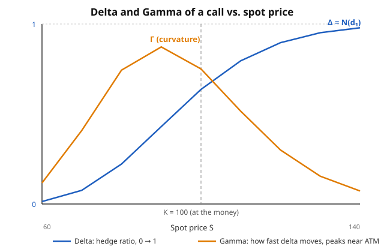

# Mathematical Finance · Lesson 2.5: The Greeks and dynamic hedging

> ⏱ ~15 min · Module 2: The Black–Scholes model · Builds on: [2.4 The Black–Scholes formula](02-04-black-scholes-formula.md) · Unlocks: [2.6 Implied volatility and the smile](02-06-implied-volatility-smile.md)

## Why this matters

Lesson 2.4 handed you a closed-form price. But a price is a snapshot — the moment you *sell* the option you have a risk you must manage, and the option's value moves with the spot, with time, with volatility, with rates. The **Greeks** are the partial derivatives of the price along each of those axes: they tell you how much you'll gain or lose when the world nudges, and therefore exactly what to trade to stay neutral. Delta-hedging in continuous time is what actually *manufactures* the option out of stock and cash (the replication of Lesson 2.2), and the whole scheme lives or dies on one tension — the hedged book earns nothing for standing still except time decay, and pays for that decay only when the stock moves. Getting that trade-off in your bones is the difference between quoting a price and running a book.

## The idea

Take the call price $C(S,t)$ and Taylor-expand it in the two things that move fastest — the spot $S$ and the clock $t$:

$$dC \approx \underbrace{\frac{\partial C}{\partial S}}_{\Delta}\,dS + \underbrace{\frac{1}{2}\frac{\partial^2 C}{\partial S^2}}_{\tfrac{1}{2}\Gamma}\,(dS)^2 + \underbrace{\frac{\partial C}{\partial t}}_{\Theta}\,dt.$$

In words: the option's P&L over a short step is a slope term ($\Delta$, first order in the move), a curvature term ($\Gamma$, which cares about the *size* of the move regardless of sign), and a pure passage-of-time term ($\Theta$). Every Greek is just one of these knobs.

The **hedge** kills the first term: hold $\Delta$ shares against a short call and the $\Delta\,dS$ pieces cancel — you no longer care which way the stock ticks, to first order. What's left is the second-order life of the book: you *own* curvature ($\Gamma > 0$ if you're long the option) but you *pay* for it in time decay ($\Theta < 0$). Those two are not independent — the Black–Scholes PDE is precisely the accountant's identity that ties them together. That's the punchline of the lesson: **theta is the rent you pay to be long gamma**, and whether the rent was worth it depends on how much the stock actually moved.

## The formal version

Write $N(\cdot)$ for the standard normal CDF and $N'(x) = \frac{1}{\sqrt{2\pi}}e^{-x^2/2}$ for its density. From Lesson 2.4,

$$C = S\,N(d_1) - K e^{-rT} N(d_2), \qquad d_1 = \frac{\ln(S/K) + (r + \tfrac{1}{2}\sigma^2)T}{\sigma\sqrt{T}}, \qquad d_2 = d_1 - \sigma\sqrt{T},$$

with $S$ = spot, $K$ = strike, $r$ = risk-free rate, $\sigma$ = volatility, $T$ = time to expiry. Differentiating (a useful identity does the heavy lifting: $S\,N'(d_1) = K e^{-rT} N'(d_2)$, which makes the "obvious" extra terms cancel):

| Greek | Symbol | Call formula | In words |
|---|---|---|---|
| **Delta** | $\Delta = \partial C/\partial S$ | $N(d_1)$ (call), $\;N(d_1)-1$ (put) | shares to hold per option — the hedge ratio |
| **Gamma** | $\Gamma = \partial^2 C/\partial S^2$ | $\dfrac{N'(d_1)}{S\sigma\sqrt{T}}$ | curvature: how fast $\Delta$ itself moves (same for call & put) |
| **Theta** | $\Theta = \partial C/\partial t$ | $-\dfrac{S N'(d_1)\sigma}{2\sqrt{T}} - rKe^{-rT}N(d_2)$ | time decay (per calendar time; negative for a long call) |
| **Vega** | $\nu = \partial C/\partial \sigma$ | $S\,N'(d_1)\sqrt{T}$ | sensitivity to volatility (same for call & put) |
| **Rho** | $\rho = \partial C/\partial r$ | $K T e^{-rT} N(d_2)$ | sensitivity to the interest rate |

In words: delta is a probability-like number between 0 and 1 telling you how stock-like the option currently is; gamma is highest near the money where delta swings fastest; theta and vega measure the bleed of time and the price of uncertainty. (**"Vega" is not a Greek letter** — the name is a trader's coinage; you'll see $\mathcal{V}$, $\nu$, or "kappa" used for it. Everything else is genuinely Greek.)

**Dynamic delta-hedging.** To replicate/hedge a short call, hold $\Delta_t = N(d_1)$ shares at every instant and finance the rest with the money-market account, rebalancing *continuously*. The hedge is only **local**: $\Delta$ is the tangent slope at the current $S$, so the instant $S$ moves the slope is wrong and you must re-trade. Gamma is exactly how wrong: $\Delta$ changes by $\approx \Gamma\,dS$, so a large $\Gamma$ means frequent, larger rebalancing trades.

**The gamma–theta identity.** Substitute the Greeks into the Black–Scholes PDE from Lesson 2.2 (here $V$ is the option value):

$$\Theta + \tfrac{1}{2}\sigma^2 S^2 \Gamma + rS\Delta - rV = 0.$$

In words: for a delta-hedged book the PDE is not abstract — it's a P&L statement. Since $rS\Delta - rV = rKe^{-rT}N(d_2)$ (the financing/carry term), it rearranges to

$$\Theta = -\tfrac{1}{2}\sigma^2 S^2 \Gamma - \underbrace{rKe^{-rT}N(d_2)}_{\text{carry}}.$$

Theta decay is what *pays for* gamma convexity. Strip out the carry and the daily P&L of a delta-hedged long option is

$$\boxed{\;dP\&L \;\approx\; \tfrac{1}{2}\Gamma\,S^2\big(\sigma_{\text{realized}}^2 - \sigma_{\text{implied}}^2\big)\,dt\;}$$

In words: a delta-hedged option is a **bet on realized versus implied volatility**. You're long gamma (you gain from big moves in either direction) but you bleed theta every day; you come out ahead exactly when the stock actually moves more than the volatility you paid for. Rebalancing only at discrete times leaves residual gamma risk — the identity is exact only in the continuous limit.

## Picture

Delta is the slope of the call-price curve, so as spot rises it climbs from 0 (deep out-of-the-money, the option barely reacts) to 1 (deep in-the-money, it moves dollar-for-dollar with the stock). Gamma is the *slope of delta* — it's largest near the strike, where the option is most undecided and the hedge needs the most attention, and it fades to nearly zero at both extremes where delta is pinned flat.

## Worked examples

Reuse the Lesson 2.4 option throughout: $S_0 = 100$, $K = 100$, $r = 5\%$, $\sigma = 20\%$, $T = 1$. There $d_1 = 0.35$, $d_2 = 0.15$, and the price is $C \approx 10.45$. We'll need $N(d_1)=N(0.35)=0.6368$, $N(d_2)=N(0.15)=0.5596$, and the density $N'(d_1) = \frac{1}{\sqrt{2\pi}}e^{-0.35^2/2} = 0.3752$.

**Example 1 (mechanical — all five Greeks).**

$$\Delta = N(d_1) = 0.637 \quad(\text{hold } \approx 0.64 \text{ shares per call}).$$
$$\Gamma = \frac{N'(d_1)}{S\sigma\sqrt{T}} = \frac{0.3752}{100 \cdot 0.20 \cdot 1} = \frac{0.3752}{20} = 0.0188.$$
$$\nu = S\,N'(d_1)\sqrt{T} = 100 \cdot 0.3752 \cdot 1 = 37.5 \quad(\text{per 1.00 change in }\sigma;\ \text{so } 0.375 \text{ per vol point}).$$
$$\rho = K T e^{-rT} N(d_2) = 100 \cdot 1 \cdot 0.9512 \cdot 0.5596 = 53.2 \quad(\text{per 1.00 in }r;\ 0.532 \text{ per } 1\%).$$
$$\Theta = -\frac{S N'(d_1)\sigma}{2\sqrt{T}} - rKe^{-rT}N(d_2) = -\frac{100 \cdot 0.3752 \cdot 0.20}{2} - 0.05\cdot 100 \cdot 0.9512 \cdot 0.5596.$$
$$\Theta = -3.752 - 2.662 = -6.41 \text{ per year} \;=\; -\frac{6.41}{365} \approx -0.0176 \text{ per calendar day.}$$

So this call loses about 1.8 cents a day to time decay, all else equal, and its curvature $\Gamma = 0.0188$ means every 1-point move in $S$ shifts its delta by about $0.019$.

**Example 2 (gamma–theta — the PDE as a P&L statement).** Verify the Greeks satisfy Black–Scholes. Compute each PDE term:

$$\tfrac{1}{2}\sigma^2 S^2 \Gamma = \tfrac{1}{2}(0.04)(10000)(0.0188) = 3.75, \qquad rS\Delta = 0.05\cdot 100 \cdot 0.637 = 3.18, \qquad rV = 0.05 \cdot 10.45 = 0.52.$$

Add them to theta:

$$\Theta + \tfrac{1}{2}\sigma^2 S^2\Gamma + rS\Delta - rV = -6.41 + 3.75 + 3.18 - 0.52 = 0.\ \checkmark$$

The identity holds exactly. Now read it as a hedger. Suppose over one day $S$ moves by $1\%$ (from 100 to 101). Your delta-hedged long call gains from convexity but loses to decay:

- **Gamma gain:** $\tfrac{1}{2}\Gamma (dS)^2 = \tfrac{1}{2}(0.0188)(1)^2 = 0.0094.$
- **Theta bleed (gamma part):** $\tfrac{1}{2}\sigma^2 S^2\Gamma\,dt = 3.75/365 = 0.0103.$

The move implied by $\sigma = 20\%$ is $S\sigma\sqrt{dt} = 100\cdot 0.20\cdot\sqrt{1/365} \approx 1.05\%$ per day — the *break-even* daily move. A realized $1\%$ move is a hair *smaller* than that, so the long-gamma hedger loses a sliver: net vol P&L $\approx \tfrac{1}{2}\Gamma S^2(\sigma_r^2 - \sigma_i^2)dt \approx -0.0009$. Move more than $1.05\%$ any given day and you'd pocket the difference. (The financing/carry term $rKe^{-rT}N(d_2)$ is the rest of theta; in a fully self-financing hedge the interest on the borrowed stock position offsets it, leaving the clean vol bet above.)

## Watch out

- **You might think a delta-hedged book is riskless.** It's only *first-order* riskless. You've swapped directional risk for a bet on volatility: long gamma / short theta. If the stock sits still, you bleed; the hedge protects you from *direction*, not from *stillness*.
- **You might think theta is bad and you want to avoid it.** Theta and gamma are two sides of one coin via the PDE — you cannot be long gamma without paying theta, and a short-option book *earns* theta precisely because it's short gamma and will bleed on a big move. Neither sign is "good"; it's a trade.
- **You might treat vega as a Greek on the same footing as the others.** Black–Scholes assumes $\sigma$ is *constant*, so strictly $\partial C/\partial\sigma$ is a derivative with respect to a parameter the model swears never changes. That contradiction is the whole subject of the next lesson — vega is the sensitivity you invert to *back out* the market's $\sigma$, and the fact that it isn't constant across strikes is the smile.
- **You might think gamma peaks exactly at $S = K$.** With drift and the $1/S$ factor it peaks slightly *below* the strike (near the forward-at-the-money point); the picture's bump is a touch left of $K$. Close enough to say "near the money," but not literally at $K$.

## One-liner

> A delta-hedged option isn't riskless — it's a bet that pays you gamma when the stock moves and charges you theta when it doesn't, and the Black–Scholes PDE is just the receipt.

## Problems

**P1 (🟢)** For the lesson's option ($\Delta = 0.637$, $\Gamma = 0.0188$) you are **long 100 calls**, each on one share. (a) How many shares do you short to be delta-neutral, and what is your position gamma? (b) The spot then rises by 2 points. Roughly what is your new delta per option, and how many shares must you now be short? Which way did you trade to re-hedge?

**P2 (🟡)** The lesson's option has vega $\nu = S N'(d_1)\sqrt{T} = 37.5$. (a) Implied vol rises from $20\%$ to $21\%$ (one vol point) with everything else fixed — approximately how much does the call price change, and what's the new price? (b) Explain in one or two sentences why vega is largest for at-the-money options and nearly zero deep in- or out-of-the-money.

**P3 (🔴, optional)** You are long the lesson's call and delta-hedged, with $\Gamma = 0.0188$, $S = 100$, and implied $\sigma = 20\%$. Over one **trading** day ($dt = 1/252$) the stock moves by $1.5\%$. (a) Compute the gamma gain $\tfrac{1}{2}\Gamma S^2 (\Delta S/S)^2$ and the implied/theta cost $\tfrac{1}{2}\Gamma S^2 \sigma^2 dt$. (b) What is the net vol P&L for the day, and what annualized *realized* volatility does the $1.5\%$ move correspond to? Did you win or lose, and why?

Solutions

**P1** (a) Position delta $= 100 \times 0.637 = 63.7$. To neutralize, **short 63.7 shares** (round to 64 in practice). Position gamma $= 100 \times 0.0188 = 1.88$ — that's how much your *total* delta changes per 1-point move in $S$.

(b) New delta per option $\approx 0.637 + \Gamma\cdot\Delta S = 0.637 + 0.0188(2) = 0.637 + 0.0376 = 0.675$. Position delta $= 100 \times 0.675 = 67.5$, so you must be **short 67.5 shares** — you had 63.7 short, so you **sell about 3.8 more shares short** as the stock rose. (Selling into a rally: the mechanical signature of a long-gamma hedge, and the reason continuous rebalancing is only an idealization.)

**P2** (a) $\Delta C \approx \nu \cdot \Delta\sigma = 37.5 \times 0.01 = 0.375$. The price rises from about $10.45$ to $\approx 10.82$. (One "vol point" is $\Delta\sigma = 0.01$ because $\sigma$ is in decimals; vega quoted "per vol point" is $\nu/100 = 0.375$, exactly this move.)

(b) Vega $= S N'(d_1)\sqrt{T}$, and $N'(d_1)$ is the normal density, which peaks at $d_1 = 0$ — i.e. near the money. Intuitively, an at-the-money option is maximally *undecided*: extra volatility adds the most probability-weighted payoff there. Deep in- or out-of-the-money the option is nearly deterministic (delta pinned near 1 or 0), so wiggling $\sigma$ barely changes what it's worth — the density $N'(d_1)$ is tiny in the tails.

**P3** (a) $\tfrac{1}{2}\Gamma S^2 = \tfrac{1}{2}(0.0188)(10000) = 94$. Gamma gain $= 94 \times (0.015)^2 = 94 \times 0.000225 = 0.0212$. Implied/theta cost $= 94 \times \sigma^2 dt = 94 \times \dfrac{0.04}{252} = 94 \times 0.0001587 = 0.0149$.

(b) Net vol P&L $= 0.0212 - 0.0149 = +0.0063$ per option for the day — a **win**. The realized daily move of $1.5\%$ annualizes to $\sigma_r = 0.015\sqrt{252} = 0.015 \times 15.87 \approx 23.8\%$, above the $20\%$ implied you paid for. Since you were long gamma and the stock moved *more* than the option's implied vol priced in, your convexity gain beat the theta bleed. Equivalently, $\tfrac{1}{2}\Gamma S^2(\sigma_r^2 - \sigma_i^2)dt = 94(0.238^2 - 0.20^2)/252 = 94(0.0166)/252 \approx +0.0062$. ✓ (The break-even daily move here is $\sigma_i\sqrt{dt} = 0.20/\sqrt{252} \approx 1.26\%$; the realized $1.5\%$ cleared it.)

## Flashback

**From Lesson 2.4 (The Black–Scholes formula):** Price a European call with $S_0 = 100$, $K = 110$, $r = 5\%$, $\sigma = 20\%$, $T = 1$, and state its delta. (Use $N(-0.13) \approx 0.4496$ and $N(-0.33) \approx 0.3720$.)

Solution

Compute the arguments:

$$d_1 = \frac{\ln(100/110) + (0.05 + 0.02)(1)}{0.20} = \frac{-0.0953 + 0.07}{0.20} = \frac{-0.0253}{0.20} = -0.127,$$
$$d_2 = d_1 - \sigma\sqrt{T} = -0.127 - 0.20 = -0.327.$$

Then $N(d_1) = 0.4496$, $N(d_2) = 0.3720$, and with $e^{-rT} = e^{-0.05} = 0.9512$:

$$C = S N(d_1) - K e^{-rT} N(d_2) = 100(0.4496) - 110(0.9512)(0.3720) = 44.96 - 38.92 = 6.04.$$

The delta is $\Delta = N(d_1) = 0.450$. Sanity check: this call is out-of-the-money ($K > S$), so it's worth *less* than the at-the-money $10.45$ call and its delta is *below* $0.5$ — both hold. ✓

## Connections

- **Backward (2.4):** every Greek here is a partial derivative of the [2.4](02-04-black-scholes-formula.md) closed-form price; the cancellations that keep the formulas clean all trace to the identity $S N'(d_1) = K e^{-rT} N'(d_2)$.
- **Backward (2.2):** the gamma–theta identity *is* the [2.2 Black–Scholes PDE](02-02-black-scholes-pde-delta-hedging.md) re-read as the P&L of a delta-hedged book — the PDE you derived by replication reappears as an accounting statement about convexity and decay.
- **Forward (2.6):** vega is the lever you invert to solve for the market's volatility; the next lesson [Implied volatility and the smile](02-06-implied-volatility-smile.md) shows that the recovered $\sigma$ isn't constant across strikes, breaking the very assumption vega is defined under.
- **Sideways (calculus):** the whole lesson is a second-order Taylor expansion plus the chain rule — partial derivatives and the $(dS)^2$ curvature term are the calc-refresher machinery ([Taylor and partial derivatives](../../calc-refresher/syllabus.md)) wearing a trading hat.
