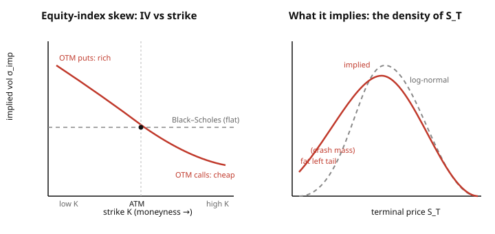

# Mathematical Finance · Lesson 2.6: Implied volatility and the smile

> ⏱ ~15 min · Module 2: The Black–Scholes model · Builds on: [2.5 The Greeks and dynamic hedging](02-05-greeks-dynamic-hedging.md) · Unlocks: Module 3 — [3.1 Mean–variance analysis](03-01-mean-variance-efficient-frontier.md)

## Why this matters

Black–Scholes has exactly one input you cannot read off a screen: the volatility $\sigma$. Everything else — $S$, $K$, $T$, $r$ — is quoted. So traders run the formula *backwards*: take the option's market price as given, and ask which $\sigma$ reproduces it. That number, the **implied volatility**, has become the actual unit options trade in. Nobody quotes a call at "8 dollars and 50 cents"; they quote it at "21.3 vol." And the moment you extract that number across many strikes, the model betrays itself — the implied vol is not one flat number, but a *curve*. That curve, the **smile**, is the market telling you, in Black–Scholes's own language, exactly where Black–Scholes is wrong. Learning to read it is the whole point of this module.

## The idea

From [2.4](02-04-black-scholes-formula.md) the call price $C_{BS}(\sigma)$ is a strictly increasing function of $\sigma$: more volatility means fatter tails, more upside for a payoff that is capped below at zero, so the option is worth more. Strictly increasing means **invertible** — for any market price in the valid range there is exactly one $\sigma$ that hits it. Call it $\sigma_{\text{imp}}$, defined by

$$C_{BS}(\sigma_{\text{imp}}) = C_{\text{market}}.$$

In words: implied vol is the market price re-expressed in volatility units. It is *not* a forecast of future realized vol, and *not* a claim about the "true" $\sigma$ — it is just a change of coordinates on the price, chosen because vol is a more stable, comparable number than dollars.

Here is the tell. If Black–Scholes were literally true — if $S$ really followed geometric Brownian motion with one constant $\sigma$ — then every option on that stock would return the *same* $\sigma_{\text{imp}}$, regardless of strike or maturity. Plot implied vol against strike and you'd get a flat line. You never do. Equity indices give a downward **skew** (low strikes — out-of-the-money puts — carry higher IV); FX gives a symmetric **smile** (both wings richer than the middle). The single free parameter, forced to absorb a mispricing at every strike, bends into a shape. That shape is a diagnosis, not a decoration.

## The formal version

**Implied volatility (definition).** Given a market price $C_{\text{market}}$ for a call with fixed $S, K, T, r$, the implied vol $\sigma_{\text{imp}}$ is the unique solution of $C_{BS}(\sigma) = C_{\text{market}}$. Uniqueness is guaranteed by

$$\frac{\partial C_{BS}}{\partial \sigma} = \text{vega} = S\,\varphi(d_1)\sqrt{T} > 0,$$

where $\varphi$ is the standard-normal density and $d_1 = \frac{\ln(S/K) + (r + \sigma^2/2)T}{\sigma\sqrt{T}}$. In words: vega is strictly positive, so price climbs monotonically with vol and the inverse is well-defined.

**Inverting it — Newton's method.** No closed form exists for $\sigma_{\text{imp}}$, so solve $f(\sigma) := C_{BS}(\sigma) - C_{\text{market}} = 0$ numerically. Newton's step needs $f'(\sigma) = \text{vega}$, which we already have in closed form:

$$\sigma_{n+1} = \sigma_n - \frac{f(\sigma_n)}{f'(\sigma_n)} = \sigma_n + \frac{C_{\text{market}} - C_{BS}(\sigma_n)}{\text{vega}(\sigma_n)}.$$

In words: if the model price is below market, nudge vol *up* by the gap divided by how many dollars a unit of vol buys you. Vega is large near the money, so convergence is fast — usually two or three steps. (This is exactly the Newton iteration from [`calc-refresher`](../../calc-refresher/syllabus.md), with vega playing the role of the derivative.)

**The implied-vol surface.** Do this for every listed strike $K$ and maturity $T$ and you get a function $\sigma_{\text{imp}}(K, T)$ — the **implied-vol surface**. This surface, not any single $\sigma$, is the true market data object. Modern practice inverts the logic of this course's derivation: instead of *predicting* prices from a model, you *calibrate* a model so that it reproduces the observed surface, then use it to price the exotics that aren't quoted.

**What a non-flat surface implies.** Black–Scholes prices a European call by integrating its payoff against a **log-normal** risk-neutral density for $S_T$. A flat surface $\Leftrightarrow$ that log-normal density is right. A downward skew means the market pays *more* than log-normal for low-strike puts — i.e. it puts **more probability mass in the left tail** than log-normal does. The true risk-neutral density has **fatter tails and negative skew**: crash fear bids up out-of-the-money puts. Constant-$\sigma$ GBM simply generates the wrong distribution.

**Why constant-$\sigma$ fails (the causes).** Real returns show volatility *clustering* (calm and turbulent regimes — vol is itself random), *jumps* (gaps that GBM's continuous paths forbid), and the *leverage effect* (vol rises when prices fall, tying big moves to the downside). Each fattens tails and skews the distribution; the smile is all of it compressed back into the one dial Black–Scholes left free. Two families of models restore the missing structure — **local volatility** $\sigma(S,t)$ (a deterministic surface fitted to today's smile) and **stochastic volatility** (vol driven by its own SDE, as in Heston). We take these up properly in [4.5](04-05-incomplete-markets-model-risk.md); for now, just hold the picture that the smile is a *symptom* and these models are the *treatments*.

## Picture

Left: implied vol against strike bends into a downward skew; Black–Scholes would predict the flat dashed line. Right: the same information as a distribution — the implied risk-neutral density (solid) has a fatter left tail and negative skew than the log-normal (dashed) Black–Scholes assumes. The two panels are one fact seen twice.

## Worked examples

**Example 1 (back out implied vol with one Newton step).** A one-year at-the-money call has $S = K = 100$, $r = 0$, and trades at $C_{\text{market}} = 8.50$ dollars. Start from a guess $\sigma_0 = 0.20$.

At $\sigma_0 = 0.20$: with $r=0$, $d_1 = \tfrac{1}{2}\sigma_0\sqrt{T} = 0.10$ and $d_2 = -0.10$, so
$$C_{BS}(0.20) = 100\big(N(0.10) - N(-0.10)\big) = 100(2\cdot 0.5398 - 1) = 7.97.$$
Vega at the guess: $\text{vega} = S\,\varphi(d_1)\sqrt{T} = 100\cdot\varphi(0.10)\cdot 1 = 100(0.3970) = 39.7$ (dollars per unit of vol, i.e. per $1.00$ change in $\sigma$).

Newton step:
$$\sigma_1 = \sigma_0 + \frac{C_{\text{market}} - C_{BS}(\sigma_0)}{\text{vega}} = 0.20 + \frac{8.50 - 7.97}{39.7} = 0.20 + 0.0134 = 0.2134.$$

So $\sigma_{\text{imp}} \approx 21.3\%$. Check: at $\sigma = 0.2134$, $d_1 = 0.1067$, $C_{BS} = 100(2N(0.1067)-1) = 100(2\cdot 0.5425 - 1) = 8.50$. ✓ One step nailed it — because near the money the price is almost linear in $\sigma$ (vega large, its own slope small).

**Example 2 (read a skew).** On the same underlying you observe two one-year puts:

| strike | $\sigma_{\text{imp}}$ |
|---|---|
| $K = 90$ (OTM put) | $24\%$ |
| $K = 100$ (ATM) | $18\%$ |

The low-strike put implies a *higher* vol than the at-the-money option. Black–Scholes, forced to one number, would price the $K=90$ put with $18\%$ and get a *smaller* value than the market pays. So the market considers a drop below 90 **more likely than log-normal-with-18%-vol says** — it assigns extra probability to the left tail. Equivalently: the OTM put is "expensive" relative to a flat-vol Black–Scholes benchmark, and that richness *is* the crash premium. The risk-neutral density here is fatter-tailed and negatively skewed than log-normal. You are reading the distribution straight off the option chain.

## Watch out

- **IV is not a forecast.** $\sigma_{\text{imp}} = 21\%$ does not predict 21% realized vol over the year. It is a price coordinate, set by supply and demand for that strike, and typically sits *above* subsequent realized vol (the variance risk premium — people overpay for insurance).
- **Don't average across the smile.** "The stock's vol is 18%" is meaningless once the surface is non-flat: the $K=90$ and $K=110$ options genuinely trade at different vols *simultaneously*. There is no single $\sigma$; there is a surface.
- **A skew is not an arbitrage.** Different IVs at different strikes are fully consistent with no-arbitrage — they're just a non-log-normal density. What *would* be arbitrage is a call price that isn't decreasing and convex in $K$; the smile lives comfortably inside those bounds.
- **Newton can stall in the deep wings.** Far out-of-the-money, vega $\to 0$, so the update $\tfrac{\Delta C}{\text{vega}}$ blows up and iterations get unstable. There, bisection on the monotone $C_{BS}(\sigma)$ is safer than Newton.

## One-liner

> Implied vol is the market price rewritten in vol units; the fact that it *isn't flat* across strikes is the market telling you, in Black–Scholes's own language, that $S_T$ is fatter-tailed and more skewed than log-normal.

## Problems

**P1 (🟢)** A call trades at $C_{\text{market}} = 6.20$ dollars. Your current model guess is $\sigma_0 = 0.25$, at which $C_{BS}(0.25) = 5.80$ and $\text{vega} = 20.0$ (dollars per unit vol). Perform one Newton iteration for the implied vol.

**P2 (🟡)** An equity index shows ATM implied vol $18\%$ and, at a $90\%$-of-spot strike (an OTM put), implied vol $26\%$. (a) State what this skew implies about the risk-neutral distribution of $S_T$ relative to log-normal. (b) Is the OTM put cheap or expensive versus a Black–Scholes price computed with the ATM $18\%$ vol, and why?

**P3 (🔴)** Argue in words that a *flat* implied-vol smile is equivalent to a log-normal risk-neutral distribution for $S_T$, and that an observed skew therefore forces a *non*-log-normal density. Use the Breeden–Litzenberger idea: the risk-neutral density $q(K)$ of $S_T$ satisfies $q(K) \propto \dfrac{\partial^2 C}{\partial K^2}$.

Solutions

**P1** Newton step, with vega as the derivative:
$$\sigma_1 = \sigma_0 + \frac{C_{\text{market}} - C_{BS}(\sigma_0)}{\text{vega}} = 0.25 + \frac{6.20 - 5.80}{20.0} = 0.25 + \frac{0.40}{20.0} = 0.25 + 0.02 = 0.27.$$
Model was below market, so vol steps up: $\sigma_{\text{imp}} \approx 27\%$ after one iteration.

**P2** (a) The OTM put's higher IV ($26\%$ vs $18\%$) means the market pays more than a single-vol Black–Scholes would for protection against a large down-move. Pricing is by integrating the payoff against the risk-neutral density, so paying extra for a low-strike put means the market places **more probability mass in the left tail** than the log-normal-with-18%-vol does. The implied risk-neutral density is **fatter-tailed and negatively skewed** than log-normal.

(b) It is **expensive** relative to that benchmark. Black–Scholes with $\sigma = 18\%$ would use the thinner log-normal left tail and produce a *lower* put value than the market's. The market's richer price is the crash/insurance premium — which is precisely why its implied vol prints above the ATM level.

**P3** Two links.

*Flat smile $\Rightarrow$ log-normal.* If $\sigma_{\text{imp}}$ is the same constant $\sigma$ at every strike, then the entire call curve $C(K)$ is exactly the Black–Scholes curve $C_{BS}(K;\sigma)$ for that one $\sigma$. By Breeden–Litzenberger, the risk-neutral density is recovered from the curvature of prices in the strike, $q(K) \propto \partial^2 C/\partial K^2$. Differentiating the *Black–Scholes* call price twice in $K$ returns exactly the log-normal density for $S_T$ (that's the density Black–Scholes integrated against in the first place). Same prices at every strike $\Rightarrow$ same second derivative $\Rightarrow$ the density is log-normal.

*Skew $\Rightarrow$ non-log-normal.* Now the observed $C(K)$ is *not* any single Black–Scholes curve — it's steeper at low strikes (higher IV there) and flatter at high strikes. Its second derivative in $K$ is therefore a different function of $K$ than the log-normal one: reshaped to put more mass in the left tail and less on the right. Since $q(K) \propto \partial^2 C/\partial K^2$ reads the density directly off that curvature, a strike-dependent smile *is* a non-log-normal density — mechanically, not by assumption. The smile and the density are the same object viewed through two lenses: quote-in-vol-units versus probability-of-$S_T$. (The proportionality also forces $C$ to be convex in $K$, since $q \ge 0$ — the no-arbitrage bound mentioned in *Watch out*.)

## Flashback

**From Lesson 2.5 (The Greeks and dynamic hedging):** A trader is long one at-the-money call with vega $= 40$ (dollars per unit vol) and delta $= 0.55$. She delta-hedges by shorting $0.55$ shares. Overnight the *spot doesn't move*, but the option's implied vol jumps from $20\%$ to $23\%$. Roughly what is her P&L, and did delta-hedging protect her from it?

Solution

Delta-hedging neutralizes the *price* sensitivity to $S$, but the spot didn't move — so the delta hedge contributes nothing here. The move was in vol. To first order the option value changes by vega times the vol change:
$$\Delta C \approx \text{vega}\cdot \Delta\sigma = 40 \times (0.23 - 0.20) = 40 \times 0.03 = 1.20 \text{ dollars gain per option.}$$
She is long the call, so long vega, so a vol *rise* is a **gain of about 1.20 dollars**. Delta-hedging did **not** protect her from it — delta hedges the $S$-risk, not the $\sigma$-risk. Neutralizing vol exposure requires trading *another option* (only options carry vega), the natural bridge to this lesson: implied vol is a risk factor you can be long or short, and the smile is its price across strikes.

## Connections

- **Backward:** this lesson just runs [2.4](02-04-black-scholes-formula.md) in reverse — invert $C_{BS}(\sigma)$ using the vega from [2.5](02-05-greeks-dynamic-hedging.md) as Newton's derivative. Vega $> 0$ (monotonicity) is what makes implied vol well-defined at all.
- **Forward:** the smile is the fingerprint of an *incomplete* market where constant-$\sigma$ GBM fails; [4.5](04-05-incomplete-markets-model-risk.md) treats local- and stochastic-vol models and the model risk of choosing among them. The calibrate-to-the-surface workflow reappears in rates when we fit [4.2](04-02-short-rate-models-vasicek-cir.md) to quoted bonds.
- **Sideways (statistics):** "fatter tails and negative skew" are the excess-kurtosis and skewness diagnostics of [`probability-theory`](../../probability-theory/syllabus.md) — the smile is those two distributional defects read straight off option prices. Breeden–Litzenberger even hands you the whole risk-neutral density as $\partial^2 C/\partial K^2$.
- **Sideways (numerics):** the inversion is the Newton's-method root-find from [`calc-refresher`](../../calc-refresher/syllabus.md), with the closed-form vega saving you a finite-difference derivative — and with the deep-wing caveat that vanishing vega sends you back to bisection.
