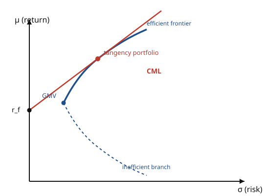

# Mathematical Finance · Lesson 3.1: Mean–variance analysis and the efficient frontier

> ⏱ ~15 min · Module 3: Preferences, portfolios, and equilibrium · Builds on: [2.6 Implied volatility and the smile](02-06-implied-volatility-smile.md) · Unlocks: [3.2 The CAPM](03-02-capm.md)

## Why this matters

Module 2 priced derivatives by *ruling out arbitrage*: given the stock, the option's fair value is forced, and no one's tastes enter. But that only prices things **relative** to the stock — it never says where the stock's own price, or its expected return, comes from. For that you need the other half of finance: **preferences**. Investors dislike risk and like return, and prices adjust until the market clears given those tastes.

This lesson is the pivot. Markowitz's mean–variance framework compresses every asset to two numbers — expected return and variance — and asks: of all portfolios, which give the most return per unit of risk? The answer, the **efficient frontier**, is the scaffolding for the CAPM ([3.2](03-02-capm.md)) and every equilibrium pricing story that follows.

## The idea

Hold $n$ assets in proportions (weights) $w = (w_1,\dots,w_n)^\top$ that must sum to one — you invest all your wealth, nothing more. Each asset $i$ has an expected return $\mu_i$ and the assets co-move through a covariance matrix $\Sigma$. Two facts drive everything:

1. **Portfolio return is linear in weights** — a weighted average, $\mu_p = w^\top\mu$.
2. **Portfolio risk is *not* linear** — it's a quadratic form $\sigma_p^2 = w^\top\Sigma w$, and cross-terms let assets partially cancel.

That non-linearity is the entire gift. Because two assets rarely move in lockstep, blending them produces a portfolio *less* risky than the average of its parts — **diversification**. You get to lower risk without lowering expected return, a free lunch that arbitrage pricing never offered. The whole subject is: exploit that curvature optimally.

## The formal version

**Setup.** Weights $w\in\mathbb{R}^n$ with $w^\top\mathbf{1}=1$ ($\mathbf{1}$ the all-ones vector); expected-return vector $\mu$; covariance matrix $\Sigma$ (symmetric, positive definite). Then

$$\mu_p = w^\top \mu, \qquad \sigma_p^2 = w^\top \Sigma w.$$

*In words:* portfolio mean is the weighted-average mean; portfolio variance is a quadratic form in the weights, so correlations matter.

**Two-asset variance (the diversification engine).** With weights $w_1, w_2=1-w_1$, standard deviations $\sigma_1,\sigma_2$, and correlation $\rho$,

$$\sigma_p^2 = w_1^2\sigma_1^2 + w_2^2\sigma_2^2 + 2 w_1 w_2\,\rho\,\sigma_1\sigma_2.$$

*In words:* if $\rho<1$ the cross-term is smaller than it would be for perfectly-linked assets, so $\sigma_p$ falls **below** the weighted average of $\sigma_1,\sigma_2$. Only at $\rho=1$ (identical risk, no diversification) does risk add up linearly; anything less than perfect correlation shrinks it.

**The efficient frontier.** Fix a target mean and buy it as cheaply (in variance) as possible:

$$\min_{w}\ \tfrac{1}{2} w^\top\Sigma w \quad\text{s.t.}\quad w^\top\mu = \mu_{\text{target}},\ \ w^\top\mathbf{1}=1.$$

Sweeping $\mu_{\text{target}}$ traces a curve in the $(\sigma,\mu)$ plane that is a **hyperbola**. Its leftmost point is the global minimum-variance (GMV) portfolio; the **upper** branch — highest return for each level of risk — is the **efficient frontier**. Anything on the lower branch is dominated (same risk, less return) and no one rational holds it.

**Solving it (Lagrange).** Two equality constraints, two multipliers:

$$\mathcal{L} = \tfrac{1}{2} w^\top\Sigma w - \lambda\,(w^\top\mu - \mu_{\text{target}}) - \gamma\,(w^\top\mathbf{1}-1).$$

Stationarity $\partial\mathcal{L}/\partial w = \Sigma w - \lambda\mu - \gamma\mathbf{1} = 0$ gives

$$\boxed{\,w = \Sigma^{-1}(\gamma\mathbf{1} + \lambda\mu)\,} = \Sigma^{-1}(a\mathbf{1} + b\mu),$$

with $a=\gamma,\ b=\lambda$ pinned down by the two constraints (worked in P3). *In words:* the optimal portfolio is always a fixed combination of two special vectors, $\Sigma^{-1}\mathbf{1}$ and $\Sigma^{-1}\mu$ — the weights on them slide linearly as you change your return target. Everyone's efficient portfolio is built from the same two ingredients.

**Add a risk-free asset.** Let one asset pay a certain return $r_f$ (zero variance, zero covariance with everything). Now you can mix "cash" with any risky portfolio. The best risk-return trade-offs no longer lie on the hyperbola — they lie on the **straight line** from $(0,r_f)$ that is *tangent* to the risky efficient frontier. This is the **Capital Market Line (CML)**, and its slope is the highest attainable **Sharpe ratio**

$$S = \frac{\mu_p - r_f}{\sigma_p}.$$

The point where the line touches the hyperbola is the **tangency portfolio** — the risky mix with the maximum Sharpe ratio. Its weights are

$$w_{\text{tan}} \propto \Sigma^{-1}(\mu - r_f\mathbf{1}), \quad\text{normalized so } w^\top\mathbf{1}=1.$$

*In words:* among all risky portfolios, one has the steepest reward-per-risk; combine it with cash and you can't do better.

**Two-fund (mutual-fund) separation.** Every mean–variance investor — timid or aggressive — holds only **two** things: the risk-free asset and the *same* tangency portfolio. Risk appetite changes only the *split* between them, never the composition of the risky part. That's why a single "market" index can, in principle, serve everyone — the launch pad for the CAPM.

## Picture

## Worked examples

**Example 1 — diversification, with numbers.** Two risky assets: $\mu_1=8\%,\ \sigma_1=20\%$ and $\mu_2=12\%,\ \sigma_2=30\%$, correlation $\rho=0.2$. So $\sigma_1^2=0.04,\ \sigma_2^2=0.09$, and covariance $\sigma_{12}=\rho\sigma_1\sigma_2=0.2(0.20)(0.30)=0.012$.

The global minimum-variance weight in asset 1 is

$$w_1 = \frac{\sigma_2^2 - \sigma_{12}}{\sigma_1^2+\sigma_2^2-2\sigma_{12}} = \frac{0.09-0.012}{0.04+0.09-0.024} = \frac{0.078}{0.106} = 0.736,\qquad w_2 = 0.264.$$

Its variance (clean closed form for two assets):

$$\sigma_{\min}^2 = \frac{\sigma_1^2\sigma_2^2(1-\rho^2)}{\sigma_1^2+\sigma_2^2-2\sigma_{12}} = \frac{(0.04)(0.09)(0.96)}{0.106} = 0.03260,\qquad \sigma_{\min}=18.1\%.$$

Read that off: **18.1% is below both 20% and 30%.** Mixing a *safer* asset with a *riskier* one produced something safer than the safe asset alone — pure correlation arbitrage on risk, impossible if $\rho=1$. Its expected return is $\mu_p = 0.736(8\%)+0.264(12\%)=9.06\%$.

**Example 2 — the tangency portfolio.** Same two assets but now take them uncorrelated ($\rho=0$, so $\sigma_{12}=0$) and add cash at $r_f=2\%$. With a diagonal $\Sigma$, $\Sigma^{-1}(\mu-r_f\mathbf{1})$ is componentwise $(\mu_i-r_f)/\sigma_i^2$:

$$z_1=\frac{0.08-0.02}{0.04}=1.50,\qquad z_2=\frac{0.12-0.02}{0.09}=1.111.$$

Normalize by the sum $z_1+z_2=2.611$:

$$w_{\text{tan}} = \Big(\tfrac{1.50}{2.611},\ \tfrac{1.111}{2.611}\Big) = (0.575,\ 0.425).$$

Its return $\mu_p = 0.575(8\%)+0.425(12\%)=9.70\%$; variance $\sigma_p^2 = 0.575^2(0.04)+0.425^2(0.09)=0.02950$, so $\sigma_p=17.2\%$. The maximum Sharpe ratio:

$$S = \frac{9.70\%-2\%}{17.2\%}=0.448.$$

Check via the shortcut $S^2 = (\mu-r_f\mathbf{1})^\top\Sigma^{-1}(\mu-r_f\mathbf{1}) = \frac{0.06^2}{0.04}+\frac{0.10^2}{0.09}=0.09+0.1111=0.2011$, and $\sqrt{0.2011}=0.448$. ✓ Every investor here holds this 57.5/42.5 risky mix, levered up or down with cash to taste.

## Watch out

- **Diversification cuts risk, not return.** $\mu_p$ is a plain weighted average — no curvature, no free return. The gift is entirely on the variance side.
- **Below-the-average risk needs $\rho<1$, and it's bounded.** As $\rho\to 1$ the benefit vanishes ($\sigma_p$ becomes the linear average); as $\rho\to -1$ you can drive $\sigma_p$ to *zero*. Real assets sit in between.
- **Mean–variance is exact only under a joint-normal (or quadratic-utility) assumption.** Variance is a symmetric risk measure — it penalizes upside surprises as much as crashes. Fat tails and skew (recall the volatility smile, [2.6](02-06-implied-volatility-smile.md)) live entirely outside this two-moment world.
- **$\Sigma$ and $\mu$ are estimated, and $\mu$ badly.** $w\propto\Sigma^{-1}\mu$ amplifies estimation error in $\mu$ into wild, often extreme long/short weights. The clean geometry is far more stable than any single portfolio it spits out.

## One-liner

> Return adds up linearly but risk doesn't — so mixing imperfectly-correlated assets buys return-per-risk, and with a risk-free asset everyone optimally holds the *same* max-Sharpe tangency portfolio, cash-scaled to taste.

## Problems

**P1 (🟢)** Assets $X$ ($\mu_X=10\%,\ \sigma_X=25\%$) and $Y$ ($\mu_Y=6\%,\ \sigma_Y=15\%$), correlation $\rho=0.4$.
(a) For the equal-weight portfolio $w_X=w_Y=0.5$, find $\mu_p$ and $\sigma_p$.
(b) Find the global minimum-variance weight $w_X$.

**P2 (🟡)** Two risky assets $\mu=(12\%,\ 7\%)$, uncorrelated, with $\sigma_1=20\%,\ \sigma_2=10\%$, and a risk-free rate $r_f=3\%$. Find the tangency (maximum-Sharpe) portfolio weights and its Sharpe ratio.

**P3 (🔴)** Derive the minimum-variance weights via the Lagrangian for $\min\ \tfrac12 w^\top\Sigma w$ s.t. $w^\top\mu=\mu_{\text{target}},\ w^\top\mathbf{1}=1$. Reduce to the constants $A=\mathbf{1}^\top\Sigma^{-1}\mathbf{1}$, $B=\mathbf{1}^\top\Sigma^{-1}\mu$, $C=\mu^\top\Sigma^{-1}\mu$, $D=AC-B^2$, then evaluate for
$$\mu=(10\%,\,5\%),\quad \Sigma=\begin{pmatrix}0.04 & 0.01\\ 0.01 & 0.02\end{pmatrix},\quad \mu_{\text{target}}=9\%.$$

Solutions

**P1.** (a) $\mu_p = 0.5(10\%)+0.5(6\%)=8\%$. Covariance $\sigma_{XY}=\rho\sigma_X\sigma_Y=0.4(0.25)(0.15)=0.015$.
$$\sigma_p^2 = 0.5^2(0.0625)+0.5^2(0.0225)+2(0.5)(0.5)(0.015)=0.015625+0.005625+0.0075=0.02875,$$
so $\sigma_p=\sqrt{0.02875}=16.96\%$.

(b) Minimum-variance weight:
$$w_X = \frac{\sigma_Y^2-\sigma_{XY}}{\sigma_X^2+\sigma_Y^2-2\sigma_{XY}} = \frac{0.0225-0.015}{0.0625+0.0225-0.030} = \frac{0.0075}{0.055}=0.136,\qquad w_Y=0.864.$$
(Its risk, for interest: $\sigma_{\min}^2=\frac{(0.0625)(0.0225)(1-0.16)}{0.055}=0.02148$, $\sigma_{\min}=14.7\%$ — below both assets.)

**P2.** Uncorrelated ⇒ $\Sigma$ diagonal, so $z_i=(\mu_i-r_f)/\sigma_i^2$:
$$z_1=\frac{0.12-0.03}{0.04}=2.25,\qquad z_2=\frac{0.07-0.03}{0.01}=4.00,\qquad z_1+z_2=6.25.$$
$$w_{\text{tan}}=\Big(\tfrac{2.25}{6.25},\ \tfrac{4.00}{6.25}\Big)=(0.36,\ 0.64).$$
Return $\mu_p=0.36(12\%)+0.64(7\%)=8.8\%$; variance $\sigma_p^2=0.36^2(0.04)+0.64^2(0.01)=0.005184+0.004096=0.00928$, so $\sigma_p=9.63\%$.
$$S=\frac{8.8\%-3\%}{9.63\%}=0.602.$$
(Check: $S^2=\frac{0.09^2}{0.04}+\frac{0.04^2}{0.01}=0.2025+0.16=0.3625$, $\sqrt{}=0.602$. ✓)

**P3.** Lagrangian $\mathcal{L}=\tfrac12 w^\top\Sigma w-\lambda(w^\top\mu-\mu_{\text{target}})-\gamma(w^\top\mathbf 1-1)$. Stationarity:
$$\Sigma w-\lambda\mu-\gamma\mathbf 1=0\ \Rightarrow\ w=\Sigma^{-1}(\lambda\mu+\gamma\mathbf 1).$$
Impose the two constraints. Using $A,B,C$ as defined:
$$w^\top\mathbf 1 = \lambda B+\gamma A = 1,\qquad w^\top\mu = \lambda C+\gamma B = \mu_{\text{target}}.$$
Solve the $2\times2$ linear system (determinant $D=AC-B^2$):
$$\lambda=\frac{A\,\mu_{\text{target}}-B}{D},\qquad \gamma=\frac{C-B\,\mu_{\text{target}}}{D}.$$

*Numerical.* $\det\Sigma=(0.04)(0.02)-(0.01)^2=0.0007$, so
$$\Sigma^{-1}=\frac{1}{0.0007}\begin{pmatrix}0.02 & -0.01\\ -0.01 & 0.04\end{pmatrix}=\frac{1}{7}\begin{pmatrix}200 & -100\\ -100 & 400\end{pmatrix}.$$
Then $\Sigma^{-1}\mathbf 1=\tfrac17(100,300)$ and $\Sigma^{-1}\mu=\tfrac17(15,10)$ (with $\mu=(0.10,0.05)$), giving
$$A=\tfrac{400}{7}=57.14,\quad B=\tfrac{25}{7}=3.571,\quad C=\tfrac{2}{7}=0.2857,\quad D=AC-B^2=\tfrac{800-625}{49}=\tfrac{175}{49}=\tfrac{25}{7}=3.571.$$
With $\mu_{\text{target}}=0.09$:
$$\lambda=\frac{(400/7)(0.09)-25/7}{25/7}=\frac{(36-25)/7}{25/7}=\frac{11}{25}=0.44,\qquad \gamma=\frac{2/7-(25/7)(0.09)}{25/7}=\frac{(2-2.25)/7}{25/7}=-0.01.$$
$$w=\lambda\,\Sigma^{-1}\mu+\gamma\,\Sigma^{-1}\mathbf 1 = 0.44\cdot\tfrac17(15,10)-0.01\cdot\tfrac17(100,300)=\tfrac17(6.6-1,\ 4.4-3)=\tfrac17(5.6,1.4)=(0.8,\ 0.2).$$
Check: weights sum to 1 ✓; mean $=0.8(10\%)+0.2(5\%)=9\%=\mu_{\text{target}}$ ✓. Variance $w^\top\Sigma w=0.0296$, $\sigma_p=17.2\%$.

## Flashback

**From [2.5 Greeks and dynamic hedging](02-05-greeks-dynamic-hedging.md):** A one-year European call is at the money ($S=K$) on a stock with volatility $\sigma=20\%$; the risk-free rate is $r=0$. Find the call's delta, and say how many shares to hold to delta-hedge a short position in one call. (Recall $\Delta_{\text{call}}=N(d_1)$ with $d_1=\frac{\ln(S/K)+(r+\sigma^2/2)T}{\sigma\sqrt T}$; use $N(0.1)\approx0.540$.)

Solution

At the money, $\ln(S/K)=0$ and $r=0$, so
$$d_1=\frac{0+(0+\tfrac12(0.2)^2)(1)}{0.2\sqrt1}=\frac{0.02}{0.2}=0.10,\qquad \Delta=N(0.10)\approx0.540.$$
To hedge a **short** call you replicate the call and hold it long: buy $\Delta\approx0.54$ shares per call. Then a small move $dS$ changes the share position by $+0.54\,dS$ and the short call by $-0.54\,dS$, netting to zero — the position is instantaneously insensitive to $S$ (it must be rebalanced as $\Delta$ drifts, exactly the dynamic-hedging point of 2.5).

## Connections

- **Backward (Module 2):** arbitrage pricing forced option values *relative* to the stock without anyone's preferences; mean–variance is the complementary view — it's where the risky assets' own expected returns come from once risk-averse investors trade. The smile ([2.6](02-06-implied-volatility-smile.md)) is precisely the market pricing the tail risk that variance-only analysis ignores.
- **Forward:** [3.2 The CAPM](03-02-capm.md) is this lesson in equilibrium — impose market clearing and the tangency portfolio *becomes* the market portfolio, delivering $\mu_i-r_f=\beta_i(\mu_m-r_f)$. Lesson 3.3 then generalizes reward-for-risk into the stochastic discount factor, unifying the arbitrage and preference views.
- **Sideways (economics):** the constrained optimization here is the same Lagrange-multiplier machinery as constrained expected-utility maximization in grad-micro choice-under-uncertainty ([grad-micro syllabus](../../grad-micro/syllabus.md)) — the multipliers are shadow prices of the return and budget constraints.
- **Sideways (linear algebra):** $\sigma_p^2=w^\top\Sigma w$ is a positive-definite quadratic form, and $w=\Sigma^{-1}(a\mathbf 1+b\mu)$ is just its normal-equation solution; the efficient set is a two-dimensional affine slice spanned by $\Sigma^{-1}\mathbf 1$ and $\Sigma^{-1}\mu$ ([linalg-refresher syllabus](../../linalg-refresher/syllabus.md)).
