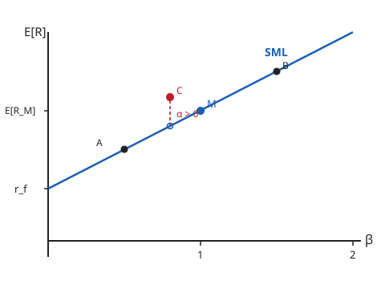

# Mathematical Finance · Lesson 3.2: The CAPM

> ⏱ ~15 min · Module 3: Preferences, portfolios, and equilibrium · Builds on: [3.1 Mean–variance analysis and the efficient frontier](03-01-mean-variance-efficient-frontier.md) · Unlocks: [3.3 Expected utility and the stochastic discount factor](03-03-expected-utility-stochastic-discount-factor.md)

## Why this matters

Lesson 3.1 told each investor what to do: hold the risk-free asset plus one special risky bundle — the **tangency portfolio**. But it left a question dangling. If *everyone* runs that same optimization, what happens to prices? Individually rational demand has to clear against fixed supply, and the prices that clear it are an *equilibrium*. The CAPM is the punchline: when every investor is a 3.1 optimizer sharing the same beliefs, the tangency portfolio can only be the **whole market**, and that forces an iron law on expected returns — an asset's risk premium depends on *one number*, its exposure to market moves. Everything else you could measure about the asset's risk is uncompensated. This is the first time the course prices a risky asset from *equilibrium* rather than from replication, and it's the bridge to the stochastic discount factor in 3.3.

## The idea

Two-fund separation (3.1) says every investor holds cash plus the tangency portfolio $T$ — same $T$ for everyone, differing only in *how much* cash. Now add up everyone's holdings. The risky part of aggregate demand is a pile of $T$'s. In equilibrium aggregate demand must equal aggregate supply, and aggregate supply of risky assets *is* the market — every share held by someone, in proportion to its market value. So $T$ must equal the **market portfolio** $M$: hold each asset in proportion to its total market capitalization. Tangency and market are the same point.

Now the consequence. You already own $M$. When you consider nudging a tiny bit more into asset $i$, what risk do you actually take on? Not $i$'s standalone variance — you hold a giant diversified pile, so $i$'s idiosyncratic wobble washes out against everything else. What *survives* is how $i$ moves **together with the market you already hold** — its covariance $\mathrm{Cov}(R_i, R_M)$. That's the only risk you can't diversify away, so that's the only risk the market pays you to bear. Normalize it and you get **beta**, and beta alone sets the premium:

$$\beta_i = \frac{\mathrm{Cov}(R_i, R_M)}{\mathrm{Var}(R_M)}, \qquad \mathbb{E}[R_i] - r_f \;=\; \beta_i\big(\mathbb{E}[R_M] - r_f\big).$$

Contrast this sharply with 3.1. Standing *alone*, an asset's risk was its own variance $\sigma_i^2$. Standing *inside the market portfolio everyone holds*, its risk is its covariance with $M$. Own-variance ruled the single-asset world; covariance rules equilibrium.

## The formal version

**Setup.** All investors are mean–variance optimizers (3.1) with identical beliefs about the mean vector and covariance matrix, one common risk-free rate $r_f$ for lending and borrowing, and no frictions. Let $R_i$ be asset $i$'s return, $R_M$ the market return.

**Equilibrium claim.** The tangency portfolio equals the market portfolio $M$ (value-weighted over all assets).
*In words: if everyone wants the same risky bundle, the only bundle that can clear the market is the market itself.*

**CAPM relation.** For every asset $i$,

$$\boxed{\;\mathbb{E}[R_i] = r_f + \beta_i\big(\mathbb{E}[R_M] - r_f\big), \qquad \beta_i = \frac{\mathrm{Cov}(R_i, R_M)}{\mathrm{Var}(R_M)}.\;}$$

*In words: an asset's expected return is the risk-free rate plus its beta times the market's risk premium — nothing about the asset except its beta enters.* The quantity $\mathbb{E}[R_M]-r_f$ is the **market risk premium** (the price of one unit of beta); $\beta_i$ is the *quantity* of market risk in asset $i$.

**Derivation (the covariance argument).** Take the market $M$ — which is efficient, being the tangency portfolio — and blend a weight $w$ into asset $i$ against $1-w$ in $M$. The blend has

$$\mathbb{E}[R_p] = w\,\mathbb{E}[R_i] + (1-w)\,\mathbb{E}[R_M], \qquad \sigma_p^2 = w^2\sigma_i^2 + (1-w)^2\sigma_M^2 + 2w(1-w)\,\sigma_{iM},$$

writing $\sigma_{iM} = \mathrm{Cov}(R_i,R_M)$. As $w$ ranges, this traces a curve in $(\sigma, \mathbb{E})$ space passing through $M$ at $w=0$. Because $M$ is efficient, that curve must be **tangent to the Capital Market Line** at $M$ — otherwise you could tilt toward $i$ and beat the CML, contradicting $M$'s efficiency. Match slopes. Differentiate at $w=0$:

$$\left.\frac{d\mathbb{E}[R_p]}{dw}\right|_{0} = \mathbb{E}[R_i] - \mathbb{E}[R_M], \qquad \left.\frac{d\sigma_p^2}{dw}\right|_{0} = 2\sigma_{iM} - 2\sigma_M^2, \quad\text{so}\quad \left.\frac{d\sigma_p}{dw}\right|_{0} = \frac{\sigma_{iM}-\sigma_M^2}{\sigma_M}.$$

The curve's slope $\dfrac{d\mathbb{E}}{d\sigma}$ at $M$ is the ratio, and it must equal the CML slope $\dfrac{\mathbb{E}[R_M]-r_f}{\sigma_M}$:

$$\frac{\sigma_M\big(\mathbb{E}[R_i]-\mathbb{E}[R_M]\big)}{\sigma_{iM}-\sigma_M^2} = \frac{\mathbb{E}[R_M]-r_f}{\sigma_M}.$$

Solve for $\mathbb{E}[R_i]$: cross-multiplying gives $\sigma_M^2(\mathbb{E}[R_i]-\mathbb{E}[R_M]) = (\mathbb{E}[R_M]-r_f)(\sigma_{iM}-\sigma_M^2)$, i.e. $\mathbb{E}[R_i]-\mathbb{E}[R_M] = (\mathbb{E}[R_M]-r_f)(\beta_i - 1)$. Adding $\mathbb{E}[R_M]$ to both sides collapses it to $\mathbb{E}[R_i] = r_f + \beta_i(\mathbb{E}[R_M]-r_f)$. $\blacksquare$

**Risk decomposition.** Regress $R_i$ on $R_M$: $R_i = \alpha_i + \beta_i R_M + \varepsilon_i$ with $\mathrm{Cov}(R_M, \varepsilon_i)=0$. Then

$$\mathrm{Var}(R_i) = \underbrace{\beta_i^2\,\mathrm{Var}(R_M)}_{\text{systematic}} + \underbrace{\mathrm{Var}(\varepsilon_i)}_{\text{idiosyncratic}}.$$

*In words: total risk splits into a market-driven part and an asset-specific part.* Only the first is priced; the second earns nothing because a diversified holder has already cancelled it away. **Alpha** is any expected return *above* what the SML grants — under the CAPM every $\alpha_i = 0$; a nonzero $\alpha$ is a claim that the asset is mispriced (positive $\alpha$ = underpriced, a buy).

## Picture

The **Security Market Line** plots $\mathbb{E}[R_i]$ against $\beta_i$ — a straight line from $(0, r_f)$ through $(1, \mathbb{E}[R_M])$. Every correctly priced asset sits *on* it (A and B). Asset C floats *above*: same beta, higher expected return than the line permits — that vertical gap is its positive alpha.

Note what the horizontal axis is: **beta, not variance**. The whole content of the CAPM is that this axis — covariance with the market — is the *right* one, and own-variance is off the chart.

## Worked examples

**Example 1 (beta → required return, mechanical).** Take $r_f = 3\%$, $\mathbb{E}[R_M] = 8\%$, so the market risk premium is $5\%$. An asset has $\mathrm{Cov}(R_i, R_M) = 0.024$ and $\mathrm{Var}(R_M) = 0.04$. Then

$$\beta_i = \frac{0.024}{0.04} = 0.6, \qquad \mathbb{E}[R_i] = 3\% + 0.6\times 5\% = 6\%.$$

A defensive asset ($\beta < 1$, moves less than the market) is *required* to return only $6\%$. If it's expected to return more, it's a bargain; if less, overpriced.

**Example 2 (risk decomposition — equal total variance, different price).** Market: $\sigma_M^2 = 0.04$ ($\sigma_M = 20\%$), $r_f = 3\%$, $\mathbb{E}[R_M]=8\%$. Two assets each have **total variance $0.12$**:

| | $\beta$ | systematic $\beta^2\sigma_M^2$ | idiosyncratic $\mathrm{Var}(\varepsilon)$ | required $\mathbb{E}[R]$ |
|---|---|---|---|---|
| Asset P | $1.5$ | $1.5^2(0.04)=0.09$ | $0.12-0.09=0.03$ | $3\%+1.5(5\%)=10.5\%$ |
| Asset Q | $0.5$ | $0.5^2(0.04)=0.01$ | $0.12-0.01=0.11$ | $3\%+0.5(5\%)=5.5\%$ |

Identical total risk, yet P must earn $10.5\%$ and Q only $5.5\%$. The difference is entirely *where* the risk lives: P's risk is mostly systematic (priced), Q's is mostly idiosyncratic (free to the diversified holder, so uncompensated). A single-asset mean–variance investor from 3.1 would have called these two equally risky — the CAPM says the market pays them very differently.

## Watch out

- **Own-variance is a trap here.** Total variance does *not* set the premium; only the systematic slice $\beta^2\sigma_M^2$ does. An asset can be wildly volatile yet earn a *low* premium if that volatility is idiosyncratic (Example 2's Q). This is the exact reversal of 3.1's standalone view — internalize it.
- **Beta can be negative.** If $\mathrm{Cov}(R_i,R_M)<0$, then $\mathbb{E}[R_i] < r_f$: the asset is *insurance*, pays off when the market tanks, so investors accept a return below the risk-free rate for it. Not a mistake — a hedge is worth paying for.
- **Alpha is a disequilibrium statement.** Inside the CAPM every alpha is zero *by construction*. A measured $\alpha \ne 0$ means either the model is incomplete or the asset is genuinely mispriced — the CAPM can't tell you which; it only defines the benchmark line you're deviating from.
- **The market portfolio is a value-weighted ideal**, not "the stocks I like." Every asset, weighted by capitalization. Using a bad proxy (an index that isn't the true market) is Roll's critique — betas measured against the wrong $M$ needn't obey the relation.

## One-liner

> In equilibrium everyone holds the market, so an asset is paid only for the risk it *adds to the market* — its covariance, i.e. its beta — and idiosyncratic wobble earns exactly nothing.

## Problems

**P1 (🟢)** An asset has $\beta = 1.2$. The risk-free rate is $r_f = 2\%$ and the expected market return is $\mathbb{E}[R_M] = 9\%$. What return does the CAPM require of it?

**P2 (🟡)** You estimate $\mathrm{Cov}(R_i, R_M) = 0.030$ and $\mathrm{Var}(R_M) = 0.025$. With $r_f = 2\%$ and $\mathbb{E}[R_M] = 9\%$, a fund's research desk forecasts this asset will return $12\%$ next year. Compute its beta and its SML-required return, and state whether the asset carries positive or negative alpha and what you'd do.

**P3 (🔴)** Derive the CAPM beta relation $\mathbb{E}[R_i] = r_f + \beta_i(\mathbb{E}[R_M]-r_f)$ from the fact that the market portfolio $M$ is mean–variance efficient. (Use the covariance / tangency argument: blend asset $i$ into $M$ and impose that the resulting curve is tangent to the Capital Market Line at $M$.)

Solutions

**P1** Market risk premium $= 9\% - 2\% = 7\%$. So

$$\mathbb{E}[R] = r_f + \beta(\mathbb{E}[R_M]-r_f) = 2\% + 1.2\times 7\% = 2\% + 8.4\% = 10.4\%.$$

**P2** Beta first:

$$\beta = \frac{\mathrm{Cov}(R_i,R_M)}{\mathrm{Var}(R_M)} = \frac{0.030}{0.025} = 1.2.$$

SML-required return: $\mathbb{E}[R] = 2\% + 1.2\times(9\%-2\%) = 2\% + 8.4\% = 10.4\%$. The forecast $12\%$ exceeds the required $10.4\%$, so

$$\alpha = 12\% - 10.4\% = +1.6\% > 0.$$

Positive alpha ⇒ the asset offers more than its beta-risk warrants ⇒ **underpriced**. You'd buy it (it plots *above* the SML, like point C in the figure).

**P3** The market $M$ is efficient, so it lies on the Capital Market Line, whose slope is $(\mathbb{E}[R_M]-r_f)/\sigma_M$. Form the blend "$w$ in asset $i$, $1-w$ in $M$":

$$\mathbb{E}[R_p] = w\,\mathbb{E}[R_i] + (1-w)\,\mathbb{E}[R_M], \qquad \sigma_p^2 = w^2\sigma_i^2 + (1-w)^2\sigma_M^2 + 2w(1-w)\sigma_{iM},$$

with $\sigma_{iM}=\mathrm{Cov}(R_i,R_M)$. At $w=0$ the blend *is* $M$. Because $M$ is efficient, no small tilt toward $i$ can push the blend above the CML, so the blend curve is tangent to the CML at $w=0$: its slope $d\mathbb{E}/d\sigma$ there equals the CML slope. Differentiate at $w=0$:

$$\frac{d\mathbb{E}[R_p]}{dw}\Big|_0 = \mathbb{E}[R_i]-\mathbb{E}[R_M], \qquad \frac{d\sigma_p^2}{dw}\Big|_0 = 2\sigma_{iM}-2\sigma_M^2 \;\Rightarrow\; \frac{d\sigma_p}{dw}\Big|_0 = \frac{\sigma_{iM}-\sigma_M^2}{\sigma_M}.$$

(The second uses $d\sigma_p/dw = (d\sigma_p^2/dw)/(2\sigma_p)$ with $\sigma_p=\sigma_M$ at $w=0$.) Their ratio is the curve's slope; set it equal to the CML slope:

$$\frac{\mathbb{E}[R_i]-\mathbb{E}[R_M]}{(\sigma_{iM}-\sigma_M^2)/\sigma_M} = \frac{\mathbb{E}[R_M]-r_f}{\sigma_M} \;\Longrightarrow\; \mathbb{E}[R_i]-\mathbb{E}[R_M] = \big(\mathbb{E}[R_M]-r_f\big)\frac{\sigma_{iM}-\sigma_M^2}{\sigma_M^2}.$$

Since $\sigma_{iM}/\sigma_M^2 = \beta_i$, the fraction is $\beta_i - 1$, so $\mathbb{E}[R_i]-\mathbb{E}[R_M] = (\mathbb{E}[R_M]-r_f)(\beta_i-1)$. Add $\mathbb{E}[R_M]$:

$$\mathbb{E}[R_i] = \mathbb{E}[R_M] + (\mathbb{E}[R_M]-r_f)(\beta_i-1) = r_f + \beta_i(\mathbb{E}[R_M]-r_f). \qquad\blacksquare$$

Sanity checks: $\beta_i = 1 \Rightarrow \mathbb{E}[R_i]=\mathbb{E}[R_M]$ ✓; $\beta_i=0 \Rightarrow \mathbb{E}[R_i]=r_f$ (zero market exposure earns only the risk-free rate) ✓.

## Flashback

**From Lesson 3.1 (diversification and the tangency portfolio):** You hold $N$ assets in equal weights $1/N$. Each has variance $\sigma^2 = 0.04$, and every pair has the same correlation $\rho = 0.3$. Find the portfolio variance for $N=1$, $N=10$, and $N\to\infty$. What does the limit represent, and how does it foreshadow today's lesson?

Solution

Equal-weight portfolio variance with common pairwise covariance $\rho\sigma^2$:

$$\sigma_p^2 = \frac{1}{N}\sigma^2 + \frac{N-1}{N}\,\rho\sigma^2.$$

(The $N$ diagonal terms contribute $N\cdot(1/N^2)\sigma^2 = \sigma^2/N$; the $N(N-1)$ off-diagonal terms contribute $N(N-1)(1/N^2)\rho\sigma^2 = \frac{N-1}{N}\rho\sigma^2$.)

- $N=1$: $\sigma_p^2 = 0.04$.
- $N=10$: $\sigma_p^2 = \frac{0.04}{10} + \frac{9}{10}(0.3)(0.04) = 0.004 + 0.0108 = 0.0148$.
- $N\to\infty$: the first term vanishes, leaving $\sigma_p^2 \to \rho\sigma^2 = 0.3\times 0.04 = 0.012$.

The limit is an irreducible floor: diversification kills the $\sigma^2/N$ piece (the **idiosyncratic** risk) but cannot touch $\rho\sigma^2$ — the **common, systematic** risk that every asset shares. This *is* today's lesson in embryo: the risk you cannot diversify away is exactly the risk the CAPM prices via beta, while the vanishing $\sigma^2/N$ part earns nothing.

## Connections

- **Backward:** the whole model is 3.1 run in equilibrium — [3.1](03-01-mean-variance-efficient-frontier.md)'s tangency portfolio *becomes* the market once you impose market clearing, and 3.1's Capital Market Line is the object the SML derivation leans on. The Flashback's diversification floor is the systematic risk beta measures.
- **Forward:** [3.3](03-03-expected-utility-stochastic-discount-factor.md) shows the CAPM is one special case of the **stochastic discount factor** $m$: pricing via $\mathbb{E}[m R_i]=1$ reduces to the beta relation when $m$ is affine in the market return. Boss problem 3 of the module ties $m$, the equivalent martingale measure, and marginal utility to this same equilibrium logic.
- **Sideways (economics):** market clearing here is the same equilibrium notion as in general-equilibrium micro — aggregate demand meets fixed supply and prices adjust (see [grad-micro](../../grad-micro/syllabus.md)).
- **Sideways (econometrics):** the decomposition $R_i = \alpha_i + \beta_i R_M + \varepsilon_i$ is literally an OLS regression — beta is the slope coefficient, alpha the intercept, and testing $\alpha=0$ is the empirical CAPM test (see [econometrics](../../econometrics/syllabus.md)).
