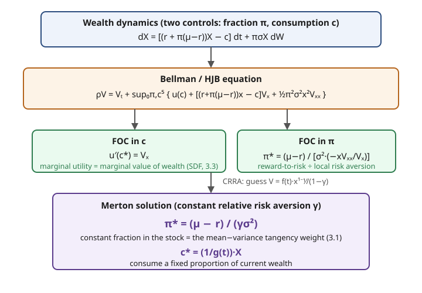

# Mathematical Finance · Lesson 3.4: Merton's optimal consumption and portfolio problem

> ⏱ ~15 min · Module 3: Preferences, portfolios, and equilibrium · Builds on: [3.3 Expected utility and the stochastic discount factor](03-03-expected-utility-stochastic-discount-factor.md) · Unlocks: Module 4 — [4.1 The term structure and bond pricing](04-01-term-structure-bond-pricing.md)

## Why this matters

So far Module 3 has been about *valuing* assets a market hands you. Merton (1969) asks the harder question: given the market, how much should *you* hold, and how much should you *spend*, moment by moment, over a lifetime? The answer is a single tidy formula — the **Merton rule** — and it turns out to be the same tangency portfolio from [3.1](03-01-mean-variance-efficient-frontier.md), now derived dynamically instead of in one static period. Along the way the machinery is exactly grad-macro's: a value function, a Bellman equation, first-order conditions. This lesson is the bridge — mean-variance investing, the SDF of [3.3](03-03-expected-utility-stochastic-discount-factor.md), and consumption-based asset pricing all meet here.

## The idea

You own wealth $X_t$. Each instant you choose two things: what fraction $\pi_t$ of that wealth sits in a risky stock (the rest earns the safe rate $r$), and how fast you drain wealth into consumption, $c_t$. Consuming feels good now; investing lets wealth compound for later. You want to maximize total discounted lifetime enjoyment.

The trick that makes an infinite-dimensional choice (a whole path of $\pi_t, c_t$) tractable is **dynamic programming**: define a *value function* $V(t,x)$ = the best lifetime payoff still achievable starting at time $t$ with wealth $x$. Then optimal behavior at each instant only has to balance the enjoyment of consuming *now* against the change it causes in $V$ — a local trade-off. That local balance is the **Hamilton–Jacobi–Bellman (HJB)** equation, and its two first-order conditions hand you the consumption rule and the portfolio rule directly.

The punchline: with constant-relative-risk-aversion tastes, the optimal stock fraction is **constant** — it never depends on your wealth, your age, or the horizon:
$$\pi^* = \frac{\mu - r}{\gamma \sigma^2}.$$
Excess return over variance, damped by risk aversion. It is the tangency portfolio of [3.1](03-01-mean-variance-efficient-frontier.md), reincarnated.

## The formal version

**The market.** A riskless asset grows at rate $r$. A stock follows geometric Brownian motion with drift $\mu$ and volatility $\sigma$: $dS/S = \mu\,dt + \sigma\,dW$, with $W$ a Brownian motion. Let $\pi_t$ = fraction of wealth in the stock (the *control*; $\pi>1$ means borrowing to buy stock), $c_t \ge 0$ = consumption rate (the second control).

**Wealth dynamics.** Holding fraction $\pi$ in an asset earning $\mu$ and $1-\pi$ at rate $r$, then subtracting spending:
$$dX_t = \big[(r + \pi_t(\mu - r))X_t - c_t\big]\,dt + \pi_t \sigma X_t\,dW_t.$$
In words: wealth drifts up at the blended portfolio return minus what you spend, and inherits the stock's noise scaled by how much you hold.

**The objective.** With subjective discount rate $\rho$, felicity $u$, horizon $T$, and optional bequest $B$:
$$V(t,x) = \sup_{\pi,\,c}\ \mathbb{E}\!\left[\int_t^T e^{-\rho(s-t)}u(c_s)\,ds + e^{-\rho(T-t)}B(X_T)\ \Big|\ X_t = x\right].$$

**The HJB equation.** The Bellman principle plus Itô's lemma turn that supremum-over-paths into a PDE (I fold the discount into a current-value $V$, which produces the $\rho V$ term):
$$\rho V = V_t + \sup_{\pi,\,c}\Big\{\, u(c) + \big[(r + \pi(\mu - r))x - c\big]V_x + \tfrac{1}{2}\pi^2 \sigma^2 x^2 V_{xx} \,\Big\}.$$
In words: the "required return" $\rho$ on holding the value equals the flow of enjoyment plus the best expected drift you can steer $V$ into. The last two terms are just the drift and diffusion of $V(t,X_t)$ from Itô — this is the stochastic-control cousin of Feynman–Kac from [2.3](02-03-risk-neutral-pricing-girsanov-feynman-kac.md).

**First-order conditions.** Maximize the brace pointwise.

- In $c$: $\ u'(c^*) = V_x.$ *In words:* consume until the marginal pleasure of a dollar spent equals the marginal value of a dollar kept. This is the SDF link — $V_x$ is the shadow price of wealth, exactly the marginal-utility object that *is* the stochastic discount factor of [3.3](03-03-expected-utility-stochastic-discount-factor.md).
- In $\pi$: differentiate $\pi(\mu-r)xV_x + \tfrac12\pi^2\sigma^2x^2V_{xx}$ and set to zero:
$$\pi^* = -\frac{(\mu - r)V_x}{\sigma^2 x\,V_{xx}} = \frac{\mu - r}{\sigma^2}\cdot\frac{1}{\big(-xV_{xx}/V_x\big)}.$$
The bracket $-xV_{xx}/V_x$ is the value function's **relative risk aversion**. *In words:* hold reward-to-risk $(\mu-r)/\sigma^2$, throttled by how risk-averse the value function is.

**CRRA closes it.** Take $u(c) = c^{1-\gamma}/(1-\gamma)$ (relative risk aversion $\gamma$). Guess the separable form
$$V(t,x) = f(t)\,\frac{x^{1-\gamma}}{1-\gamma}.$$
Then $V_x = f x^{-\gamma}$, $V_{xx} = -\gamma f x^{-\gamma-1}$, so $-xV_{xx}/V_x = \gamma$ — **constant**. The portfolio rule collapses to
$$\boxed{\ \pi^* = \frac{\mu - r}{\gamma \sigma^2}\ }$$
independent of $x$ and $t$, and consumption $c^* = f(t)^{-1/\gamma}x$ is a wealth-proportional stream. That $\pi^*$ is precisely 3.1's tangency weight: the myopic mean–variance demand, optimal even dynamically because GBM's constant investment opportunities give zero hedging demand.

## Picture

## Worked examples

**Example 1 (set up the HJB, take FOCs, get the Merton rule).** Start from the brace in the HJB with CRRA $u$. The $c$-FOC is $c^{-\gamma} = V_x$. The $\pi$-FOC is $(\mu-r)xV_x + \pi\sigma^2x^2V_{xx} = 0$. Plug the guess $V = f(t)x^{1-\gamma}/(1-\gamma)$:
$$-\frac{xV_{xx}}{V_x} = -\frac{x(-\gamma f x^{-\gamma-1})}{f x^{-\gamma}} = \gamma \;\Rightarrow\; \pi^* = \frac{\mu-r}{\gamma\sigma^2}.$$
And $c^{-\gamma} = f x^{-\gamma} \Rightarrow c^* = f^{-1/\gamma}x$: spend a fixed fraction of wealth. Two knobs, two clean rules — the entire Merton solution in three lines once you commit to the separable guess.

**Example 2 (numbers, and the tangency comparison).** Take $\mu = 0.10$, $r = 0.02$, $\sigma = 0.20$, so excess return $\mu-r = 0.08$ and variance $\sigma^2 = 0.04$.

| $\gamma$ | $\pi^* = (\mu-r)/(\gamma\sigma^2)$ | reading |
|---|---|---|
| $1.5$ | $0.08/(1.5\cdot 0.04) = 1.33$ | borrow 33% of wealth, hold 133% in stock — **leverage** |
| $2$ | $0.08/(2\cdot 0.04) = 1.00$ | all-in, no borrowing |
| $4$ | $0.08/(4\cdot 0.04) = 0.50$ | half stock, half cash |

Every entry is the same *direction* — the stock is the tangency (max-Sharpe) portfolio here since it's the only risky asset — scaled by risk tolerance $1/\gamma$. This is exactly 3.1's two-fund result: everyone holds the tangency portfolio; only the *fraction* differs. The Sharpe ratio $\theta = (\mu-r)/\sigma = 0.4$ is what all of them are cashing in on. Note $\pi^*$ can exceed 1: risk-tolerant investors lever up, which is impossible to see in a long-only static picture but falls right out of the dynamics.

## Watch out

- **$\pi^*$ constant is special, not generic.** It holds because opportunities ($r,\mu,\sigma$) are constant. If $\mu$ or $\sigma$ moved with a state variable, a *hedging demand* term appears (Merton's ICAPM) and $\pi^*$ shifts — the myopic formula is then only the first piece.
- **$V_x$, not $u'$, is what the portfolio rule uses.** The FOC couples them ($u'(c^*)=V_x$), but risk aversion of the *value function* — the curvature $-xV_{xx}/V_x$ — is what sets $\pi^*$. For CRRA they happen to coincide at $\gamma$; don't assume that in general.
- **Discounting conventions.** Whether you write the HJB with a $\rho V$ term (current-value, as here) or carry $e^{-\rho t}$ inside the brace is bookkeeping — the FOCs and $\pi^*$ are identical. Just don't mix the two mid-derivation.
- **Bequest/horizon lives entirely in $f(t)$.** The *portfolio* rule ignores $T$; only the *consumption* rate $c^*/x = f(t)^{-1/\gamma}$ feels the finite horizon (you spend faster as $T$ nears).

## One-liner

> Marginal utility of a dollar spent equals its marginal value if kept ($u'(c^*)=V_x$, the SDF), and you hold reward-over-variance shaved by risk aversion ($\pi^*=(\mu-r)/\gamma\sigma^2$, the tangency portfolio).

## Problems

**P1 (🟢)** An investor has CRRA utility with $\gamma = 3$. The stock has $\mu = 0.09$, the safe rate is $r = 0.03$, and $\sigma = 0.20$. Compute the optimal risky fraction $\pi^*$ and state in words what portfolio it prescribes.

**P2 (🟡)** Log utility, $u(c)=\ln c$ (the $\gamma \to 1$ case), infinite horizon. Guess a stationary value function $V(x) = A\ln x + B$ and use the current-value HJB $\rho V = \sup_{\pi,c}\{\ln c + [(r+\pi(\mu-r))x - c]V_x + \tfrac12\pi^2\sigma^2x^2V_{xx}\}$. Derive $\pi^*$ and show the optimal consumption-wealth ratio $c^*/x$ is the constant $\rho$.

**P3 (🔴)** CRRA, finite horizon $T$, no bequest ($V(T,x)=0$). Plug the separable guess $V(t,x)=f(t)\,x^{1-\gamma}/(1-\gamma)$ and the optimal controls back into the HJB and reduce it to an ODE for $f(t)$. Then via the substitution $g = f^{1/\gamma}$ show it linearizes, solve for $g(t)$, and read off the consumption-wealth ratio $c^*/x$. (Let $\lambda \equiv (\mu-r)^2/\sigma^2$.)

Solutions

**P1** Direct plug-in: $\pi^* = (\mu-r)/(\gamma\sigma^2) = (0.09-0.03)/(3\cdot 0.04) = 0.06/0.12 = 0.5$. Hold **half** of wealth in the stock and half in the safe asset, rebalancing continuously to keep that 50/50 split as wealth moves — no leverage, no shorting.

**P2** With $V = A\ln x + B$: $V_x = A/x$, $V_{xx} = -A/x^2$.

- $c$-FOC: $1/c = V_x = A/x \Rightarrow c^* = x/A$, so $c^*/x = 1/A$.
- $\pi$-FOC: $\pi^* = -\dfrac{(\mu-r)V_x}{\sigma^2 x V_{xx}} = -\dfrac{(\mu-r)(A/x)}{\sigma^2 x(-A/x^2)} = \dfrac{\mu-r}{\sigma^2}.$ (The $\gamma=1$ Merton rule.)

Substitute back to pin $A$. Write $\lambda = (\mu-r)^2/\sigma^2$; note $\pi^*(\mu-r)=\lambda$ and $\pi^{*2}\sigma^2 = \lambda$. The brace at the optimum:
$$\ln(x/A) + \big[(r+\lambda)x - x/A\big]\tfrac{A}{x} + \tfrac12\lambda x^2\!\left(-\tfrac{A}{x^2}\right) = \ln x - \ln A + (r+\lambda)A - 1 - \tfrac12\lambda A.$$
The HJB $\rho(A\ln x + B) = V_t + \text{brace}$ has $V_t = 0$ (stationary). Match the $\ln x$ coefficients:
$$\rho A = 1 \;\Rightarrow\; A = \frac1\rho \;\Rightarrow\; \frac{c^*}{x} = \frac1A = \rho.$$
Consume a constant fraction $\rho$ of wealth each instant, and hold $\pi^*=(\mu-r)/\sigma^2$ in the stock. (The constant term fixes $B = [\ln\rho + (r+\tfrac12\lambda)/\rho - 1]/\rho$, not needed for the policy.)

**P3** With $V = f(t)x^{1-\gamma}/(1-\gamma)$: $V_t = f'x^{1-\gamma}/(1-\gamma)$, $V_x = fx^{-\gamma}$, $V_{xx} = -\gamma f x^{-\gamma-1}$. The optimal controls are $\pi^* = (\mu-r)/(\gamma\sigma^2)$ and $c^* = f^{-1/\gamma}x$. Evaluating each piece of the brace (all $\propto x^{1-\gamma}$):

- $u(c^*) = \dfrac{(f^{-1/\gamma}x)^{1-\gamma}}{1-\gamma} = f^{1-1/\gamma}\dfrac{x^{1-\gamma}}{1-\gamma}.$
- drift $\cdot V_x$: with $\pi^*(\mu-r) = \lambda/\gamma$, $\ \big[(r+\lambda/\gamma)x - f^{-1/\gamma}x\big]fx^{-\gamma} = \big[(r+\lambda/\gamma)f - f^{1-1/\gamma}\big]x^{1-\gamma}.$
- diffusion: with $\pi^{*2}\sigma^2 = \lambda/\gamma^2$, $\ \tfrac12\dfrac{\lambda}{\gamma^2}x^2(-\gamma f x^{-\gamma-1}) = -\tfrac{\lambda}{2\gamma}f\,x^{1-\gamma}.$

Divide the whole HJB by $x^{1-\gamma}$ and collect. The $f^{1-1/\gamma}$ terms give $\big[\tfrac1{1-\gamma} - 1\big]f^{1-1/\gamma} = \tfrac{\gamma}{1-\gamma}f^{1-1/\gamma}$; the $f$ terms give $(r + \tfrac{\lambda}{2\gamma})f$. So
$$\frac{\rho f}{1-\gamma} = \frac{f'}{1-\gamma} + \frac{\gamma}{1-\gamma}f^{1-1/\gamma} + \Big(r + \frac{\lambda}{2\gamma}\Big)f.$$
Multiply by $(1-\gamma)$ and solve for $f'$:
$$f' = \Big[\rho - (1-\gamma)\big(r + \tfrac{\lambda}{2\gamma}\big)\Big]f - \gamma f^{1-1/\gamma}.$$
This is a Bernoulli ODE. Let $K \equiv \tfrac1\gamma\big[\rho - (1-\gamma)(r+\tfrac{\lambda}{2\gamma})\big]$ so $f' = \gamma(Kf - f^{1-1/\gamma})$. Substitute $g = f^{1/\gamma}$ (so $f = g^\gamma$, $f' = \gamma g^{\gamma-1}g'$ and $f^{1-1/\gamma}=g^{\gamma-1}$):
$$\gamma g^{\gamma-1}g' = \gamma\big(Kg^\gamma - g^{\gamma-1}\big) \;\Rightarrow\; g' = Kg - 1,$$
a **linear** ODE. Terminal $V(T,\cdot)=0 \Rightarrow f(T)=0 \Rightarrow g(T)=0$. Solving $g'-Kg=-1$ backward:
$$g(t) = \frac{1 - e^{-K(T-t)}}{K}.$$
Since $c^* = f^{-1/\gamma}x = x/g$, the consumption-wealth ratio is
$$\frac{c^*}{x} = \frac1{g(t)} = \frac{K}{1 - e^{-K(T-t)}}, \qquad K = \frac1\gamma\Big[\rho - (1-\gamma)\big(r + \tfrac{(\mu-r)^2}{2\gamma\sigma^2}\big)\Big].$$
As $T-t\to\infty$ this tends to the constant $K$ (the CRRA analogue of P2's $\rho$); as $t\to T$ it blows up (spend everything before the end). The portfolio rule $\pi^* = (\mu-r)/(\gamma\sigma^2)$ held throughout — untouched by $f$ or $T$.

## Flashback

**From [3.3](03-03-expected-utility-stochastic-discount-factor.md) (the stochastic discount factor).** An investor with CRRA utility $u(c)=c^{1-\gamma}/(1-\gamma)$, $\gamma = 2$, discount factor $\beta = 0.95$, consumes $c_0 = 100$ today. Next period there are two equally likely states: bad ($c_1 = 90$) and good ($c_1 = 110$). Using the SDF $m_s = \beta\,(c_{1,s}/c_0)^{-\gamma}$, (a) find the SDF in each state and the implied gross risk-free rate, and (b) price a claim paying 0 in the bad state and 20 in the good state.

Solution

**(a)** $m_s = \beta (c_{1,s}/c_0)^{-2}$.
$$m_{\text{bad}} = 0.95\,(90/100)^{-2} = 0.95/0.81 = 1.173, \qquad m_{\text{good}} = 0.95\,(110/100)^{-2} = 0.95/1.21 = 0.785.$$
The SDF is high in the bad state (a dollar there is precious) — the whole point of 3.3. Risk-free: $1/R_f = \mathbb{E}[m] = \tfrac12(1.173 + 0.785) = 0.979$, so $R_f = 1.021$, i.e. $r \approx 2.1\%$.

**(b)** Price $= \mathbb{E}[m\cdot\text{payoff}] = \tfrac12(1.173\cdot 0 + 0.785\cdot 20) = \tfrac12(15.70) = 7.85$. The payoff is cheap relative to its expected value $\tfrac12(0+20)=10$ discounted at $R_f$ ($10/1.021 = 9.79$) because it pays only in the good, low-marginal-utility state — a risk *premium* baked in by the SDF. This same object $m$ is $V_x/\mathbb{E}[V_x]$-flavored: the FOC $u'(c^*)=V_x$ in today's lesson is what makes the SDF and the value function's wealth-derivative the same thing.

## Connections

- **Backward:** $\pi^* = (\mu-r)/(\gamma\sigma^2)$ is [3.1](03-01-mean-variance-efficient-frontier.md)'s tangency portfolio derived dynamically — the two-fund separation reappears with hedging demand switched off. The $c$-FOC $u'(c^*)=V_x$ is [3.3](03-03-expected-utility-stochastic-discount-factor.md)'s SDF: marginal utility equals the marginal value of wealth.
- **Forward:** Module 4 turns the same discounting machinery onto fixed income — [4.1](04-01-term-structure-bond-pricing.md) prices bonds as expected discounted cashflows, and the SDF here is what a consumption-based term-structure model discounts with.
- **Sideways (macro):** $u'(c^*)=V_x$ is the seed of consumption-based asset pricing — the Euler equation and the equity-premium puzzle. The whole value-function/Bellman/HJB apparatus is grad-macro's dynamic programming; see [`grad-macro/syllabus.md`](../../grad-macro/syllabus.md). Stochastic optimal control in plain terms: pick a policy each instant to steer a value function, exactly as in deterministic Hamiltonian control but with an Itô diffusion term.
- **Sideways (stochastic calculus):** the wealth SDE, Itô's lemma producing the $\tfrac12\pi^2\sigma^2x^2V_{xx}$ term, and the HJB as the control analogue of Feynman–Kac all come from [`stochastic-calculus/syllabus.md`](../../stochastic-calculus/syllabus.md).
