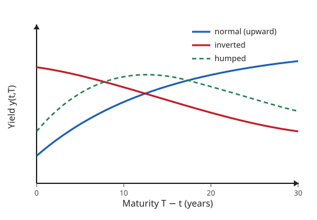

# Mathematical Finance · Lesson 4.1: The term structure and bond pricing

> ⏱ ~15 min · Module 4: Interest rates and extensions · Builds on: [3.4 Merton's optimal consumption and portfolio problem](03-04-merton-optimal-consumption-portfolio.md) · Unlocks: [4.2 Short-rate models: Vasicek and CIR](04-02-short-rate-models-vasicek-cir.md)

## Why this matters

Everything so far discounted at a single constant rate $r$. That was a convenience, and it is time to pay it back. Real markets quote a **different** interest rate for every horizon — one number to lock money for a year, another for ten — and that whole schedule, the **yield curve**, is itself a traded object that moves daily and forecasts recessions. Module 4 makes the discount rate first term-dependent (this lesson) and then genuinely random (4.2 onward). The payoff is one idea worth the whole module: once $r$ is stochastic, **discounting stops being multiplication and becomes an expectation**. A bond is the simplest derivative — payoff exactly 1 dollar — so it is the perfect place to see that shift cleanly, before options ride on top of it.

## The idea

Fix today $t$. A **zero-coupon bond** $P(t,T)$ is the price *now* of a contract paying exactly 1 dollar at the future date $T$, and nothing else. It is a pure discount factor with a market price attached, pinned at the end by $P(T,T)=1$ (a dollar at $T$ is worth a dollar at $T$).

Three ways to say the same curve, each answering a different question:

- **Price** $P(t,T)$ — "what do I pay today?"
- **Yield** $y(t,T)$ — "what constant rate makes that price?" Just repackage the price as an exponential: $P(t,T)=e^{-y(t,T)(T-t)}$. Plotting $T \mapsto y(t,T)$ gives the **yield curve**.
- **Forward rate** $f(t,T)$ — "what rate can I *lock in today* for borrowing over an instant starting at $T$?" This is the marginal cost of extending the horizon a hair further, so it is a derivative of $\ln P$ in $T$.

The one relation to internalize: a **forward rate is a ratio of discount factors**. If today you buy a bond maturing at $T$ and short one maturing at $T+\Delta$, you have costlessly arranged to receive a dollar at $T$ and pay a known amount at $T+\Delta$ — a loan agreed today, executed later. No arbitrage forces its rate to be exactly $P(t,T)/P(t,T+\Delta)$ per unit time. Forwards are yields *stripped of overlap*: the yield to $T+\Delta$ is a blend of everything up to $T$ plus the forward beyond it.

## The formal version

Let the **instantaneous short rate** be $r_t$: the rate on a loan over the next instant, $[t,t+dt]$.

**Yield (continuously compounded).**
$$P(t,T)=e^{-y(t,T)(T-t)} \quad\Longleftrightarrow\quad y(t,T)=-\frac{\ln P(t,T)}{T-t}.$$
*In words:* the yield is the flat rate that would reproduce the bond's price if it applied over the whole life $T-t$.

**Instantaneous forward rate.**
$$f(t,T)=-\frac{\partial \ln P(t,T)}{\partial T}, \qquad P(t,T)=\exp\!\left(-\int_t^T f(t,u)\,du\right).$$
*In words:* $f(t,T)$ is the locked-in rate for an instant at horizon $T$; stacking those instantaneous rates from $t$ to $T$ and discounting by them rebuilds the price. Differentiating $-\ln P=\int_t^T f\,du$ in $T$ recovers the first equation — the forward rate is just the fundamental theorem of calculus applied to the log-price (see `](../../calc-refresher/syllabus.md)`).

**Short rate as the near end of the curve.**
$$r_t=f(t,t)=\lim_{T\to t} y(t,T).$$
*In words:* zoom the forward (or the yield) into an infinitesimal horizon and you get the overnight rate.

**Discrete forward (the arbitrage relation you compute with).** For a period $[T,T+\Delta]$,
$$e^{\,f(t,T)\,\Delta}=\frac{P(t,T)}{P(t,T+\Delta)}, \qquad\text{equivalently}\qquad P(t,T+\Delta)=P(t,T)\,e^{-f(t,T)\Delta}.$$
*In words:* rolling to a later maturity costs exactly the forward discount for the extra stretch — otherwise a static bond-vs-bond trade is free money.

**The master formula.** Under the risk-neutral measure $Q$ (numéraire = money-market account $B_t=\exp\!\big(\int_0^t r_s\,ds\big)$ from [2.3](02-03-risk-neutral-pricing-girsanov-feynman-kac.md)),
$$\boxed{\,P(t,T)=\mathbb{E}^Q_t\!\left[\exp\!\left(-\int_t^T r_s\,ds\right)\right].\,}$$
*In words:* when the future short rate is uncertain, the bond price is the **expected** stochastic discount factor over $[t,T]$ — you no longer just discount by a known $r$, you average $e^{-\int r}$ over every path $r$ might take. When $r$ is deterministic the expectation is trivial and this collapses to $P(t,T)=e^{-\int_t^T r_s ds}$; the whole content of Module 4 is that $r$ is *not* deterministic. Lesson 4.2 picks a dynamics for $r_s$ and actually computes this expectation.

**Reading the curve.** *Upward/normal:* long yields above short — the typical state, compensation for locking money up longer and expecting rates or inflation to rise. *Inverted:* long yields below short — the market pricing in future rate cuts, historically a recession signal. *Humped:* mid-maturity yields highest. See `](../../grad-macro/syllabus.md)` for the monetary-policy side of the same picture.

**Coupon bonds and bootstrapping.** A coupon bond is a *bundle* of zeros: coupons $c_i$ at dates $T_i$ plus face $F$ at $T_n$ price as $\sum_i c_i P(t,T_i)+F\,P(t,T_n)$. Markets quote coupon bonds, not zeros, so you recover the zero curve by **bootstrapping**: use the shortest bond to solve for $P(t,T_1)$, substitute into the next bond to solve for $P(t,T_2)$, and march outward.

## Picture

## Worked examples

**Example 1 (prices → yields → forwards).** Suppose today ($t=0$) the annually-spaced continuously-compounded zero yields are
$$y(0,1)=3\%,\quad y(0,2)=3.5\%,\quad y(0,3)=4\%\ \text{(upward-sloping)}.$$
The discount factors are $P(0,T)=e^{-y(0,T)\,T}$:
$$P(0,1)=e^{-0.03}=0.9704,\quad P(0,2)=e^{-0.07}=0.9324,\quad P(0,3)=e^{-0.12}=0.8869.$$
The one-year **forward rates** come from ratios of consecutive discount factors, $e^{f\cdot 1}=P(0,T)/P(0,T+1)$:
$$f(0\to1)=y(0,1)=3\%,\quad f(1\to2)=\ln\frac{P(0,1)}{P(0,2)}=0.07-0.03=4\%,\quad f(2\to3)=0.12-0.07=5\%.$$
Notice the forwards $3\%,4\%,5\%$ **average** to the spot yields ($\tfrac{3+4}{2}=3.5=y(0,2)$, $\tfrac{3+4+5}{3}=4=y(0,3)$): a spot yield is the mean of the forwards inside it. When the curve slopes up, forwards sit *above* spot yields — locking a future period costs more than the average so far.

**Example 2 (coupon bond as a sum of zeros; YTM vs the curve).** Price a 3-year bond, face 100, paying a 5% annual coupon, on the curve above. Cashflows: $5$ at years 1 and 2, and $105$ at year 3.
$$\text{Price}=5(0.9704)+5(0.9324)+105(0.8869)=4.852+4.662+93.127=102.64.$$
Its **yield-to-maturity** $y$ is the single rate solving $5e^{-y}+5e^{-2y}+105e^{-3y}=102.64$. Solving numerically gives $y\approx 3.97\%$. That sits *below* the 3-year zero yield of $4\%$: YTM is a cashflow-weighted blend of the zero yields, and this bond's early coupons are discounted at the lower short-maturity rates, dragging the average down. **Moral:** on a sloped curve, a bond's YTM is a summary statistic of the zero curve, not a rate you can read off any single maturity — always price off the zeros.

## Watch out

- **YTM is not a discount rate for individual cashflows.** Discount each cashflow at *its own* maturity's zero rate; the YTM is only the internal-rate-of-return summary that falls out afterward. Confusing the two mis-prices any bond on a non-flat curve.
- **Forward $\ne$ forecast.** $f(t,T)$ is a rate you can *lock in today* by trading two bonds; it is an arbitrage-enforced price, not the market's prediction of the future short rate. Under $Q$ they coincide only up to a risk premium (the "term premium").
- **Sign and calculus of the forward.** $f(t,T)=-\partial_T \ln P(t,T)$ carries a minus sign because prices *fall* with maturity ($P$ decreasing in $T$), so $\ln P$ has negative slope; the forward rate is positive. Drop the sign and you get rates backwards.
- **Two compounding conventions coexist.** We used continuous compounding ($P=e^{-yT}$); quote sheets often use annual or semiannual ($P=(1+y)^{-T}$). The curve is the same object; only the label on $y$ changes. Fix the convention before comparing numbers.

## One-liner

> A bond is a dollar seen through the discount curve; when the short rate turns random, its price stops being $e^{-rT}$ and becomes $\mathbb{E}^Q\big[e^{-\int r}\big]$ — discounting is now an expectation.

## Problems

**P1 (🟢)** Today the zero-coupon prices are $P(0,2)=0.94$ and $P(0,3)=0.90$. (a) Find the continuously-compounded yields $y(0,2)$ and $y(0,3)$. (b) Find the forward rate $f(2\to3)$ for borrowing between years 2 and 3, and confirm it is consistent with the two yields.

**P2 (🟡)** Bootstrap a 2-year discount curve from two coupon bonds (annual coupons, face 100).
- Bond A: 1-year, 4% coupon, priced at 100.88.
- Bond B: 2-year, 6% coupon, priced at 104.40.

Find $P(0,1)$ and $P(0,2)$, then the yields $y(0,1)$ and $y(0,2)$.

**P3 (🔴)** Show the master formula $P(t,T)=\mathbb{E}^Q_t\big[\exp(-\int_t^T r_s\,ds)\big]$ is arbitrage-consistent by proving the *discounted* bond price $Z_t := P(t,T)/B_t$, with $B_t=\exp(\int_0^t r_s\,ds)$, is a $Q$-martingale, and check the terminal condition. Explain in one line why "discounted price is a $Q$-martingale" *is* no-arbitrage.

Solutions

**P1.** (a) $y(0,T)=-\ln P(0,T)/T$:
$$y(0,2)=-\tfrac{1}{2}\ln 0.94=-\tfrac{1}{2}(-0.06188)=3.094\%,\qquad y(0,3)=-\tfrac{1}{3}\ln 0.90=-\tfrac{1}{3}(-0.10536)=3.512\%.$$
(b) $e^{f}=P(0,2)/P(0,3)=0.94/0.90=1.04444$, so $f(2\to3)=\ln 1.04444=4.349\%$. Consistency check: the 3-year yield must be the average of the two-year yield and the forward, $\tfrac{2\,y(0,2)+f}{3}=\tfrac{2(0.03094)+0.04349}{3}=\tfrac{0.10536}{3}=3.512\%=y(0,3)$. ✓ (The forward sits above both spot yields, as it must on an upward curve.)

**P2.** Bond A pays $104$ at year 1, so $P(0,1)=100.88/104=0.9700.$ Bond B pays $6$ at year 1 and $106$ at year 2:
$$104.40=6\,P(0,1)+106\,P(0,2)=6(0.97)+106\,P(0,2)=5.82+106\,P(0,2)\ \Rightarrow\ P(0,2)=\frac{98.58}{106}=0.9300.$$
Yields: $y(0,1)=-\ln 0.97=3.046\%$, and $y(0,2)=-\tfrac{1}{2}\ln 0.93=-\tfrac{1}{2}(-0.07257)=3.629\%$. Bootstrapping worked because the 1-year bond pins $P(0,1)$ with no other unknown, and that single number unlocks $P(0,2)$ from the 2-year bond.

**P3.** By definition $P(t,T)=\mathbb{E}^Q_t\big[e^{-\int_t^T r_s ds}\big]$. Divide by $B_t=e^{\int_0^t r_s ds}$, which is $\mathcal F_t$-measurable, so it slides inside the conditional expectation:
$$Z_t=\frac{P(t,T)}{B_t}=\mathbb{E}^Q_t\!\left[e^{-\int_0^t r_s ds}\,e^{-\int_t^T r_s ds}\right]=\mathbb{E}^Q_t\!\left[e^{-\int_0^T r_s ds}\right]=\mathbb{E}^Q_t[X],$$
where $X:=e^{-\int_0^T r_s ds}$ is a *fixed*, $\mathcal F_T$-measurable, integrable random variable that does **not** depend on $t$. A running conditional expectation of a fixed random variable is a martingale by the tower property: for $s\le t$,
$$\mathbb{E}^Q_s[Z_t]=\mathbb{E}^Q_s\big[\mathbb{E}^Q_t[X]\big]=\mathbb{E}^Q_s[X]=Z_s.$$
So $Z$ is a $Q$-martingale. Terminal check: $Z_T=\mathbb{E}^Q_T[X]=X=e^{-\int_0^T r_s ds}=P(T,T)/B_T=1/B_T$, i.e. $P(T,T)=1$. ✓

Why this is no-arbitrage: the First Fundamental Theorem ([1.4](01-04-fundamental-theorem-asset-pricing.md)) says a market is arbitrage-free iff there is a measure under which **every** asset, discounted by the numéraire $B$, is a martingale. The formula is *engineered* to make the bond's discounted price such a martingale under $Q$, so the bond is priced consistently with all other assets — no static or dynamic trade against the money-market account produces a riskless profit. (Equivalently, $P(t,T)=\mathbb{E}^Q_t[e^{-\int_t^T r}\cdot 1]$ is the [3.3](03-03-expected-utility-stochastic-discount-factor.md) pricing identity $\text{price}=\mathbb{E}[m\cdot\text{payoff}]$ for the constant payoff 1, with $Q$-SDF $m_{t,T}=e^{-\int_t^T r}$.)

## Flashback

**From [3.3](03-03-expected-utility-stochastic-discount-factor.md) (Stochastic discount factor):** A one-period market has two equally-likely states. The SDF takes values $m_{\text{up}}=0.88$ and $m_{\text{down}}=1.10$. (a) Find the risk-free gross return $R_f$. (b) A risky asset pays $X_{\text{up}}=120$, $X_{\text{down}}=90$. Find its price and expected gross return, and confirm the sign of its risk premium against $\operatorname{cov}(m,X)$.

Solution

The pricing rule is $\text{price}=\mathbb{E}[mX]$ for any payoff $X$.

(a) The risk-free asset pays 1 in both states, so its price is $\mathbb{E}[m]=\tfrac12(0.88)+\tfrac12(1.10)=0.99$, and $R_f=1/\mathbb{E}[m]=1/0.99=1.0101$ (i.e. $r_f\approx1.01\%$). Note this is exactly a one-period bond: $P=\mathbb{E}[m]=0.99$ — the bond price *is* the expected SDF, the discrete cousin of this lesson's master formula.

(b) Price: $\;p=\mathbb{E}[mX]=\tfrac12(0.88)(120)+\tfrac12(1.10)(90)=52.8+49.5=102.3.$ Expected payoff $\mathbb{E}[X]=\tfrac12(120)+\tfrac12(90)=105$, so expected gross return $\mathbb{E}[R]=105/102.3=1.0264$ ($2.64\%$). Risk premium $=2.64\%-1.01\%=1.63\%>0$.

Covariance check: $p=\mathbb{E}[m]\mathbb{E}[X]+\operatorname{cov}(m,X)$, and $\mathbb{E}[m]\mathbb{E}[X]=0.99(105)=103.95$, so $\operatorname{cov}(m,X)=102.3-103.95=-1.65<0$. The asset pays *more* when the SDF is *low* (good states, when a marginal dollar is cheap), so it is risky, is priced below its expected payoff discounted at $R_f$, and earns a **positive** premium. Quantitatively $\mathbb{E}[R]-R_f=-R_f\operatorname{cov}(m,R)=-1.0101\cdot\frac{-1.65}{102.3}=1.63\%$ — matches. ✓

## Connections

- **Backward:** this is [1.1](01-01-arbitrage-law-of-one-price.md)'s discounting and forward prices, promoted from one rate to a whole curve — a forward rate is the law of one price applied to two bonds. The master formula is [3.3](03-03-expected-utility-stochastic-discount-factor.md)'s $\text{price}=\mathbb{E}[m\cdot\text{payoff}]$ with payoff 1 and $m=e^{-\int r}$; a bond is *the* purest SDF measurement. It closes Module 3's arc: [3.4](03-04-merton-optimal-consumption-portfolio.md) optimized consumption against a fixed $r$; now $r$ becomes the object of study.
- **Forward:** [4.2](04-02-short-rate-models-vasicek-cir.md) picks a stochastic dynamics for $r_s$ (Vasicek, CIR) and *computes* $\mathbb{E}^Q_t[e^{-\int r}]$ in closed form via Feynman–Kac. [4.3](04-03-forward-measures-changing-numeraire.md) flips $P(t,T)$ itself into the numéraire (the "forward measure"), which makes forward rates martingales and trivializes bond-option pricing.
- **Sideways (calculus):** the forward rate as $-\partial_T \ln P$ is a clean instance of a marginal quantity being the derivative of a log — see `](../../calc-refresher/syllabus.md)`.
- **Sideways (macro):** the shape of the yield curve and its inversion-as-recession-signal are the finance face of monetary policy and the expectations hypothesis — see `](../../grad-macro/syllabus.md)`.
