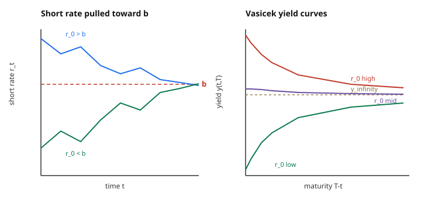

# Mathematical Finance · Lesson 4.2: Short-rate models — Vasicek and CIR

> ⏱ ~15 min · Module 4: Interest rates and extensions · Builds on: [4.1 The term structure and bond pricing](04-01-term-structure-bond-pricing.md) · Unlocks: [4.3 Forward measures and changing numéraire](04-03-forward-measures-changing-numeraire.md)

## Why this matters

Lesson 4.1 gave you the one formula that runs the whole rates business: the time-$t$ price of a zero-coupon bond maturing at $T$ is

$$P(t,T) = \mathbb{E}^Q\!\left[\exp\!\left(-\int_t^T r_s\,ds\right)\,\middle|\,\mathcal{F}_t\right].$$

Beautiful, but useless until you say *what $r_s$ actually does*. Pick a stochastic process for the short rate under $Q$, and this expectation becomes a number — the entire yield curve, every maturity at once, from a single scalar $r_t$. That is the payoff of a **short-rate model**: it is the smallest possible engine (one diffusion) that spits out a whole curve.

This lesson builds the two classics — **Vasicek** and **CIR** — and shows why both are *affine*: bond prices come out as $\exp(A - Br)$, linear in the current short rate inside the exponent. That structure is what makes them tractable enough to hedge with, and it is exactly boss problem 4.

## The idea

Interest rates don't wander off to infinity or crash to zero and stay there — they get **pulled back toward a normal level**. High rates cool the economy and come down; low rates stimulate and drift up. So the modeling instinct is a *mean-reverting* diffusion: a drift that points toward a long-run level $b$, with strength proportional to how far you've strayed, plus noise.

That single sentence is the **Vasicek** model: drift $a(b - r)$ (a spring pulling $r$ to $b$ at speed $a$), diffusion $\sigma\,dW^Q$. It's the Ornstein–Uhlenbeck process — the same OU you met as the canonical mean-reverting SDE in stochastic calculus. It is Gaussian, hence gorgeously tractable: everything is a normal random variable, and normals are closed under the integrals and exponentials the bond formula throws at them.

Gaussianity has one embarrassing cost: a normal variable can go **negative**, so Vasicek allows negative rates. **CIR** patches this with one surgical change — multiply the noise by $\sqrt{r}$. As $r$ falls toward zero the volatility shuts off, the drift $ab > 0$ still pushes up, and (under a mild condition) $r$ never reaches zero. You trade the clean normal for a non-central chi-square, but — the crucial fact — **you keep the affine bond price**. Both models live in the same tractable family; they just differ in whether they let rates go negative.

## The formal version

**Vasicek (Ornstein–Uhlenbeck under $Q$).**
$$dr_t = a(b - r_t)\,dt + \sigma\,dW_t^Q, \qquad a,\sigma > 0.$$
In words: $r$ is dragged toward $b$ at rate $a$; $\sigma$ sets the noise, constant regardless of the level. Solving (integrating factor, worked below) gives $r_t$ **Gaussian** with
$$\mathbb{E}^Q[r_t] = b + (r_0 - b)e^{-at} \xrightarrow{t\to\infty} b, \qquad \operatorname{Var}(r_t) = \frac{\sigma^2}{2a}\left(1 - e^{-2at}\right) \xrightarrow{t\to\infty} \frac{\sigma^2}{2a}.$$
The stationary law is $\mathcal{N}(b,\ \sigma^2/2a)$. Because it's Gaussian, $r_t$ can be negative.

**CIR (Cox–Ingersoll–Ross).**
$$dr_t = a(b - r_t)\,dt + \sigma\sqrt{r_t}\,dW_t^Q.$$
In words: same mean-reverting drift, but the noise scales with $\sqrt{r}$, so volatility vanishes as $r\to 0$. If the **Feller condition** $2ab \geq \sigma^2$ holds, the up-drift near zero dominates the (shrinking) noise and $r_t$ stays strictly positive; $r_t$ follows a scaled **non-central chi-square** distribution. Variance now scales with the level — high rates are noisier — which is empirically realistic.

**Affine term structure.** For *either* model the bond price is exponential-affine in the current short rate:
$$\boxed{\,P(t,T) = \exp\!\big(A(t,T) - B(t,T)\,r_t\big).\,}$$
In words: freeze the clock at $t$; the entire curve of prices $\{P(t,T)\}_T$ is determined by one number $r_t$ through two deterministic functions $A,B$ of the time-to-maturity. This is not an accident you assume — it *follows* from the drift and diffusion both being affine in $r$ (drift $a(b-r)$ is affine; the *squared* diffusion, $\sigma^2$ for Vasicek and $\sigma^2 r$ for CIR, is affine). That is the defining feature of the **affine class**.

**Where $A,B$ come from (two routes, same answer).** Plug the ansatz $P=e^{A-Br}$ into the bond PDE (the Feynman–Kac PDE for $\mathbb{E}^Q[e^{-\int r}]$),
$$P_t + a(b-r)P_r + \tfrac12\sigma^2 P_{rr} - rP = 0, \qquad P(T,T)=1.$$
For Vasicek $P_r=-BP$, $P_{rr}=B^2P$, $P_t=(A'-B'r)P$ (primes are $\partial_t$). Divide by $P$ and collect powers of $r$:
$$\underbrace{\big(A' - a b B + \tfrac12\sigma^2 B^2\big)}_{r^0}\; +\; \underbrace{\big(-B' + aB - 1\big)}_{r^1}\,r = 0.$$
Both brackets must vanish for all $r$, giving the **Riccati/linear ODE system** (here linear because Vasicek's $\sigma$ is constant), with terminal data $A(T,T)=B(T,T)=0$:
$$B'(t,T) = aB - 1, \qquad A'(t,T) = abB - \tfrac12\sigma^2 B^2.$$
Solving the first (it's linear) and integrating the second gives the closed forms below. The second route — compute the expectation directly because $\int r$ is Gaussian — is the worked boss problem and lands on the identical $A,B$.

**Vasicek closed form.** Writing $\tau = T-t$,
$$B(t,T) = \frac{1 - e^{-a\tau}}{a}, \qquad A(t,T) = \big(B(t,T) - \tau\big)\!\left(b - \frac{\sigma^2}{2a^2}\right) - \frac{\sigma^2 B(t,T)^2}{4a}.$$

**Yields and curve shapes.** The continuously-compounded yield is
$$y(t,T) = -\frac{\ln P(t,T)}{\tau} = \frac{B(t,T)\,r_t - A(t,T)}{\tau},$$
which is **affine in $r_t$**: a level ($-A/\tau$) plus a slope ($B/\tau$) times today's short rate. As $\tau\to 0$, $y\to r_t$ (the curve starts at the short rate); as $\tau\to\infty$, $B/\tau\to 0$ and $-A/\tau \to b - \sigma^2/2a^2$, a **constant long yield** $y_\infty = b - \sigma^2/2a^2$ (the mean level, minus a convexity correction from volatility). Because only a handful of parameters $(a,b,\sigma,r_t)$ feed the whole curve, Vasicek can produce **upward, inverted, or gently humped** curves — but *not* arbitrary shapes. A one-factor model gives you a low-dimensional family, no more.

## Picture

Left: whatever $r_0$ you start at, the spring drags $r$ back to $b$ (up if you're low, down if you're high). Right: the *same* model produces an upward curve when today's rate is low, an inverted one when it's high, and a near-flat/humped curve in between — every curve flattening toward the one long-rate limit $y_\infty$.

## Worked examples

**Example 1 — solve the OU SDE and pin down the Gaussian.** Start from $dr_t = a(b-r_t)\,dt + \sigma\,dW_t^Q$. Multiply by the integrating factor $e^{at}$ and use Itô on $e^{at}r_t$:
$$d\!\left(e^{at}r_t\right) = e^{at}\big(dr_t + a r_t\,dt\big) = e^{at}\,ab\,dt + \sigma e^{at}\,dW_t^Q.$$
Integrate from $0$ to $t$:
$$e^{at}r_t = r_0 + b\big(e^{at}-1\big) + \sigma\!\int_0^t e^{as}\,dW_s^Q \;\Longrightarrow\; r_t = b + (r_0-b)e^{-at} + \sigma\!\int_0^t e^{-a(t-s)}\,dW_s^Q.$$
The Itô integral of a *deterministic* integrand is a **mean-zero Gaussian**, so $r_t$ is normal. Its mean is the deterministic part, $\mathbb{E}^Q[r_t] = b + (r_0-b)e^{-at}$. By Itô isometry,
$$\operatorname{Var}(r_t) = \sigma^2\!\int_0^t e^{-2a(t-s)}\,ds = \sigma^2\cdot\frac{1-e^{-2at}}{2a}.$$
Now the key fact for bond pricing: $\int_0^T r_s\,ds$ is a *linear functional* of a Gaussian process, hence **itself Gaussian**. That is everything the next example needs.

**Example 2 — boss problem 4: the bond price as a Gaussian expectation.** We want $P(0,T) = \mathbb{E}^Q\!\big[\exp(-\int_0^T r_s\,ds)\big]$. Let $I = \int_0^T r_s\,ds$, Gaussian with mean $M$ and variance $V$. The magic of a Gaussian in an exponential (the moment generating function at $-1$):
$$\mathbb{E}^Q\!\left[e^{-I}\right] = \exp\!\left(-M + \tfrac12 V\right).$$

*Mean.* $M = \int_0^T \mathbb{E}^Q[r_s]\,ds = \int_0^T\!\big[b + (r_0-b)e^{-as}\big]ds = bT + (r_0-b)\,\frac{1-e^{-aT}}{a} = bT + (r_0-b)B(0,T).$

*Variance.* Substitute the OU solution's noise part and swap the order of integration (stochastic Fubini): $\int_0^T\!\!\int_0^s e^{-a(s-u)}dW_u\,ds = \int_0^T\!\Big(\int_u^T e^{-a(s-u)}ds\Big)dW_u = \int_0^T B(u,T)\,dW_u$, so by Itô isometry
$$V = \sigma^2\!\int_0^T B(u,T)^2\,du = \frac{\sigma^2}{a^2}\!\int_0^T\!\big(1-e^{-a(T-u)}\big)^2 du = \frac{\sigma^2}{a^2}\!\left[T - \frac{2(1-e^{-aT})}{a} + \frac{1-e^{-2aT}}{2a}\right].$$

*Read off $A,B$.* Now assemble $\ln P(0,T) = -M + \tfrac12 V$. Split $M$ using $M = r_0 B(0,T) + b\big(T - B(0,T)\big)$ (regroup the mean around $r_0$):
$$\ln P(0,T) = \underbrace{-B(0,T)}_{\text{coeff of }r_0}\,r_0 \;\underbrace{-\,b\big(T-B(0,T)\big) + \tfrac12 V}_{=\,A(0,T)}.$$
So the coefficient of $-r_0$ is $B(0,T)=(1-e^{-aT})/a$ — **the price is affine in $r_0$**, exactly the boxed form — and grinding $-b(T-B)+\tfrac12 V$ through the algebra collapses (using $e^{-2aT}=(1-aB)^2$) to the closed form quoted above:
$$A(0,T) = \big(B(0,T)-T\big)\!\left(b-\frac{\sigma^2}{2a^2}\right) - \frac{\sigma^2 B(0,T)^2}{4a}.$$
The yield $y(0,T) = -\ln P/T = (B r_0 - A)/T$ is affine in $r_0$; its $T\to\infty$ limit is $b-\sigma^2/2a^2$, independent of $r_0$. That long-rate anchor plus the single knob $r_0$ is *why* the curve can only slope up, slope down, or hump — the shape space is tiny.

## Watch out

- **Two $B$'s, one meaning.** $B(t,T)$ (the affine coefficient) and $B(u,T)$ (inside the variance integral) are the *same function* $\frac{1-e^{-a(T-\cdot)}}{a}$ — the variance computation reuses the very object it's building. Don't read them as different symbols.
- **Vasicek's negative rates are a feature of the math, not a bug you can hedge away.** $r_t$ is genuinely $\mathcal{N}(\text{mean},\text{var})$, so $P(r_t<0)>0$ for any $t$. Post-2008 this became less embarrassing (rates *did* go negative), but if you need $r\geq 0$, that's the whole reason CIR exists.
- **CIR's positivity needs the Feller condition.** $2ab \geq \sigma^2$ is what keeps $r$ from touching $0$; violate it and $r$ can hit zero (and reflect). The $\sqrt{r}$ alone isn't a guarantee.
- **"Affine" is about $r$, not about the yield being linear in maturity.** $y(t,T)$ is affine in the *state* $r_t$; as a function of $\tau$ it's very much nonlinear (that's the whole curve shape).
- **The MGF trick needs the drift sign right.** $\mathbb{E}[e^{-I}] = e^{-M+V/2}$, *plus* one-half variance. Sign-flipping to $e^{-M-V/2}$ is the classic boss-problem error — the convexity term *raises* the bond price (lowers the yield), it doesn't lower it.

## One-liner

> Model the short rate as a mean-reverting diffusion and the whole yield curve becomes $\exp(A-Br)$ — Gaussian and negative-rate-prone (Vasicek) or $\sqrt{r}$-floored and non-negative (CIR), but affine, and hence tractable, either way.

## Problems

**P1 (🟢)** Vasicek with $a=0.3$, $b=0.05$, $\sigma=0.02$, $r_0=0.03$. (a) Find $\mathbb{E}^Q[r_2]$ and $\operatorname{Var}(r_2)$. (b) State the long-run (stationary) distribution of $r_t$. (c) In one sentence, why can this $r_t$ go negative while a CIR rate with the same $a,b$ cannot?

**P2 (🟡)** Same parameters, and take $r_t = 0.03$. For a bond with $\tau = T-t = 5$ years: (a) compute $B(t,T)$; (b) compute $A(t,T)$; (c) give the bond price $P(t,T)$ and the yield $y(t,T)$.

**P3 (🔴 — boss problem 4)** For general Vasicek, derive $P(0,T)=\exp(A(0,T)-B(0,T)r_0)$ by evaluating $\mathbb{E}^Q[\exp(-\int_0^T r_s\,ds)]$ as a Gaussian expectation: identify the mean $M$ and variance $V$ of $\int_0^T r_s\,ds$, apply $\mathbb{E}[e^{-I}]=e^{-M+V/2}$, and read off $B(0,T)$ from the coefficient of $r_0$. Then write the yield $y(0,T)$, take its $T\to\infty$ limit, and explain in two or three sentences why a one-factor Vasicek curve can only be upward, inverted, or humped — never an arbitrary shape.

Solutions

**P1.** (a) $e^{-at}=e^{-0.6}=0.5488$. Mean: $\mathbb{E}^Q[r_2]=0.05+(0.03-0.05)(0.5488)=0.05-0.01098=\mathbf{0.03902}$ (≈ 3.90%). Variance: $e^{-2at}=e^{-1.2}=0.3012$, so $\operatorname{Var}(r_2)=\dfrac{\sigma^2}{2a}(1-e^{-1.2})=\dfrac{0.0004}{0.6}(0.6988)=\mathbf{4.66\times10^{-4}}$ (SD ≈ 0.0216, about 2.16%). (b) Stationary law $r_\infty\sim\mathcal{N}\!\big(b,\ \sigma^2/2a\big)=\mathcal{N}(0.05,\ 6.67\times10^{-4})$ (SD ≈ 2.58%). (c) Because Vasicek $r_t$ is exactly Gaussian, its support is all of $\mathbb{R}$ and it assigns positive probability to $r<0$; CIR's $\sqrt{r}$ shuts the noise off as $r\to0$ while the drift $ab>0$ still pushes up, so (with $2ab\ge\sigma^2$) $r$ never reaches zero.

**P2.** (a) $\tau=5$, $a\tau=1.5$, $e^{-1.5}=0.22313$. $B=\dfrac{1-0.22313}{0.3}=\dfrac{0.77687}{0.3}=\mathbf{2.5896}.$
(b) $b-\dfrac{\sigma^2}{2a^2}=0.05-\dfrac{0.0004}{0.18}=0.05-0.002222=0.047778.$ Then $B-\tau=2.5896-5=-2.4104$, so the first term is $-2.4104\times0.047778=-0.115166$. Second term: $\dfrac{\sigma^2 B^2}{4a}=\dfrac{0.0004\times6.7062}{1.2}=0.0022354$. Hence $A=-0.115166-0.002235=\mathbf{-0.117401}.$
(c) $\ln P = A - B r_t = -0.117401-(2.5896)(0.03)=-0.117401-0.077688=-0.195089$, so $P=e^{-0.195089}=\mathbf{0.8228}$. Yield $y=-\ln P/\tau=0.195089/5=\mathbf{0.03902}$ (≈ 3.90%). (Sanity: $y$ sits between the short rate 3% and the long yield $y_\infty=0.047778$, so the 5-year curve is upward-sloping here.)

**P3.** *Setup.* $I=\int_0^T r_s\,ds$ is Gaussian (linear functional of the Gaussian OU process), so $P(0,T)=\mathbb{E}^Q[e^{-I}]=\exp(-M+\tfrac12 V)$ with $M=\mathbb{E}^Q[I],\ V=\operatorname{Var}(I)$.

*Mean.* Using $\mathbb{E}^Q[r_s]=b+(r_0-b)e^{-as}$,
$$M=\int_0^T\!\big[b+(r_0-b)e^{-as}\big]ds = bT + (r_0-b)\frac{1-e^{-aT}}{a}=bT+(r_0-b)B,\quad B\equiv B(0,T)=\frac{1-e^{-aT}}{a}.$$
Regroup around $r_0$: $M = r_0 B + b(T-B)$.

*Variance.* From $r_s = (\text{det}) + \sigma\int_0^s e^{-a(s-u)}dW_u$, stochastic Fubini gives $I_{\text{stoch}}=\sigma\int_0^T B(u,T)\,dW_u$ with $B(u,T)=\frac{1-e^{-a(T-u)}}{a}$, so by Itô isometry
$$V=\sigma^2\int_0^T B(u,T)^2\,du=\frac{\sigma^2}{a^2}\Big[T-\frac{2(1-e^{-aT})}{a}+\frac{1-e^{-2aT}}{2a}\Big].$$

*Assemble and read off.* $\ln P(0,T)=-M+\tfrac12 V = -B\,r_0 - b(T-B)+\tfrac12 V.$ The coefficient of $r_0$ is $-B$, so $\boxed{B(0,T)=\frac{1-e^{-aT}}{a}}$ and $A(0,T)=-b(T-B)+\tfrac12 V$. Using $e^{-2aT}=(1-aB)^2$ to simplify $V$ (so $\tfrac{1-e^{-2aT}}{2a}=B-\tfrac{a}{2}B^2$) collapses this to
$$A(0,T)=(B-T)\Big(b-\frac{\sigma^2}{2a^2}\Big)-\frac{\sigma^2 B^2}{4a}.$$
The form is $\exp(A-Br_0)$: affine in $r_0$. ✓

*Yield and shapes.* $y(0,T)=-\frac{\ln P}{T}=\frac{B\,r_0 - A}{T}$, affine in $r_0$ with slope $B/T>0$. As $T\to\infty$, $B\to 1/a$ is bounded so $B/T\to0$ and $-A/T\to b-\frac{\sigma^2}{2a^2}$; thus $y_\infty=b-\sigma^2/2a^2$ is a constant, independent of $r_0$. Because the entire curve is generated by just $(a,b,\sigma)$ and the *single* state $r_0$ — pinned at the short end to $r_0$ (the $\tau\to0$ limit) and at the long end to the fixed $y_\infty$ — there are only enough free degrees of freedom to bend it once: monotone up (when $r_0$ is well below $y_\infty$), monotone down/inverted (when $r_0$ is well above), or a single hump in between. Wiggles or multiple turning points would require more factors.

## Flashback

**From Lesson 4.1 (term structure and bond pricing):** A zero-coupon curve is observed as $P(0,1)=0.97$, $P(0,2)=0.93$. (a) Find the continuously-compounded 1-year and 2-year spot yields. (b) Find the 1-year *forward* rate $f(0,1,2)$ for borrowing between years 1 and 2. (c) Is this segment of the curve upward- or downward-sloping in yields, and is the forward above or below the 2-year spot?

Solution

(a) $y(0,1)=-\ln(0.97)/1 = 0.030459$ (≈ 3.05%); $y(0,2)=-\ln(0.93)/2 = 0.072571/2 = 0.036286$ (≈ 3.63%).

(b) The forward rate locks in the return from a 1-year loan starting at $t=1$: $e^{f}=\dfrac{P(0,1)}{P(0,2)}=\dfrac{0.97}{0.93}=1.043011$, so $f(0,1,2)=\ln(1.043011)=\mathbf{0.042109}$ (≈ 4.21%). (Equivalently $f = 2\,y(0,2)-1\,y(0,1)=0.072571-0.030459=0.042112$, matching up to rounding.)

(c) Yields rise with maturity (3.05% → 3.63%), so the curve is **upward-sloping**; the forward (4.21%) sits **above** the 2-year spot. That's the general rule — when spot yields are rising, the marginal (forward) rate must exceed the average (spot) that it's pulling up, exactly as in a mean.

## Connections

- **Backward:** this lesson is [4.1](04-01-term-structure-bond-pricing.md)'s pricing formula $P=\mathbb{E}^Q[e^{-\int r}]$ made concrete — choose the process, get the curve. The whole thing lives under the risk-neutral measure $Q$ built in [2.3](02-03-risk-neutral-pricing-girsanov-feynman-kac.md) via Girsanov; the bond PDE route is Feynman–Kac from that same lesson, now with a *stochastic* discount rate $r_t$ instead of a constant.
- **Forward:** [4.3](04-03-forward-measures-changing-numeraire.md) swaps the numéraire from the money-market account to the bond $P(t,T)$ itself — under that **$T$-forward measure**, the messy $\mathbb{E}^Q[e^{-\int r}(\cdots)]$ expectations collapse, and Vasicek bond *options* get Black-like closed forms.
- **Sideways (stochastic calculus):** Vasicek *is* the Ornstein–Uhlenbeck process — same integrating-factor solution, same stationary Gaussian — see the OU material in [stochastic calculus](../../stochastic-calculus/syllabus.md). CIR is the squared-Bessel / non-central-chi-square cousin.
- **Sideways (PDEs):** the affine ansatz turning a pricing PDE into ODEs for $A,B$ is the term-structure instance of separation-of-variables reductions; the bond PDE itself is a Feynman–Kac parabolic problem, cf. [PDEs](../../pdes/syllabus.md).
