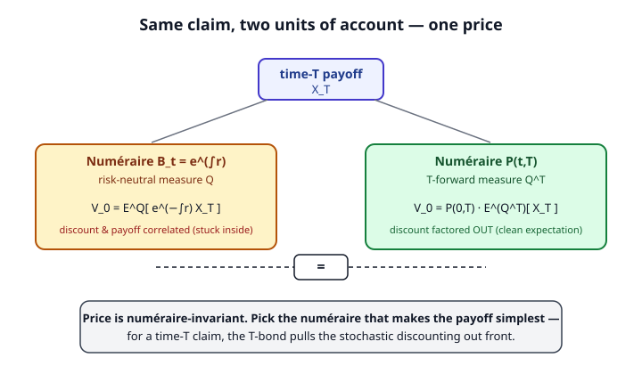

# Mathematical Finance · Lesson 4.3: Forward measures and changing numéraire

> ⏱ ~15 min · Module 4: Interest rates and extensions · Builds on: [4.2 Short-rate models: Vasicek and CIR](04-02-short-rate-models-vasicek-cir.md) · Unlocks: [4.4 American options and optimal stopping](04-04-american-options-optimal-stopping.md)

## Why this matters

Under the risk-neutral measure $Q$, a time-$T$ payoff $X_T$ is worth $V_0 = E^Q\!\big[e^{-\int_0^T r_s\,ds}\,X_T\big]$. When rates were constant that discount factor slid out front and life was easy. But once $r_s$ is a stochastic process (all of Module 4), the discount factor $e^{-\int_0^T r_s\,ds}$ is a *random variable* tangled up with $X_T$ inside the same expectation — and worse, the discount and the payoff are usually **correlated** (a bond option pays exactly when rates moved). You cannot factor a covariance out of an expectation.

The fix is a change of perspective, not a harder integral. Prices are always quoted *relative to some unit* — dollars, or shares, or a bond. Choosing a smarter unit of account (the **numéraire**) collapses that nasty correlated expectation into a clean one times a bond price. Same price, easier arithmetic. This is the single most useful computational trick in rates and it recurs everywhere downstream.

## The idea

A **numéraire** is any strictly positive traded asset used as the yardstick — the thing "one unit" means. The money-market account $B_t = e^{\int_0^t r_s\,ds}$ is the usual one, but there's nothing sacred about it. A zero-coupon bond $P(t,T)$ (pays 1 dollar at maturity $T$) is just as legitimate a yardstick.

The deep fact: **for every choice of numéraire $N$ there is a measure $Q^N$ under which every traded asset, measured in units of $N$, is a martingale.** Change the yardstick, change the measure — but the *price* you compute is the same, because a price is a real economic quantity and can't depend on the units you carry it in. That invariance is the whole lesson. You get to shop for the numéraire that makes your particular payoff simplest, and for a payoff that lands at a single date $T$, the winning choice is the $T$-maturity bond: it soaks up the stochastic discounting so it factors cleanly out front.

## The formal version

**Master pricing formula (numéraire-invariant).** For any numéraire $N$ with its measure $Q^N$, the time-$t$ price of a claim paying $X_T$ at $T$ is
$$V_t = N_t\, E^{Q^N}\!\left[\frac{X_T}{N_T}\,\middle|\,\mathcal{F}_t\right].$$
*In words:* value the payoff in $N$-units (that ratio is a martingale, so its expectation is today's value), then multiply back by today's $N$ to return to dollars.

**The two workhorse numéraires.**
- $N_t = B_t = e^{\int_0^t r_s\,ds}$, with $B_0 = 1$, gives the **risk-neutral measure** $Q$: $\;V_t = E^Q\!\big[e^{-\int_t^T r_s\,ds}X_T\mid\mathcal F_t\big]$.
- $N_t = P(t,T)$, with $P(T,T)=1$, gives the **$T$-forward measure** $Q^T$. Because $N_T = P(T,T) = 1$, the master formula loses its denominator entirely:
$$\boxed{\,V_t = P(t,T)\,E^{Q^T}\!\left[X_T\mid\mathcal{F}_t\right].\,}$$
*In words:* under $Q^T$ the messy random discount factor is gone — discounting is done once, deterministically, by the bond price $P(t,T)$ out front, and what's left inside is a plain conditional expectation of the payoff.

**Change-of-numéraire density (Radon–Nikodým).** Moving from numéraire $N_1$ (measure $Q^{N_1}$) to $N_2$ (measure $Q^{N_2}$),
$$\frac{dQ^{N_2}}{dQ^{N_1}}\bigg|_{\mathcal F_T} = \frac{N_2(T)/N_2(0)}{N_1(T)/N_1(0)}.$$
*In words:* reweight each scenario by how well the new numéraire grew relative to the old one. (It integrates to 1 under $Q^{N_1}$ precisely because $N_2/N_1$ is a $Q^{N_1}$-martingale — that is what "equivalent martingale measure" buys you.)

**The forward price is a $Q^T$-martingale.** For a non-dividend traded asset $S$, its time-$t$ forward price for delivery at $T$ is $F(t,T) = S_t / P(t,T)$ — a ratio of two traded assets in $P(\cdot,T)$-units, hence a $Q^T$-martingale. So
$$E^{Q^T}[S_T\mid\mathcal F_t] = E^{Q^T}[F(T,T)\mid\mathcal F_t] = F(t,T),\qquad\text{in particular } E^{Q^T}[S_T] = F(0,T).$$
*In words:* the forward measure is exactly the measure that makes today's forward price the expected future spot — the forward is an unbiased forecast *under $Q^T$*, no drift correction needed.

**Girsanov, geometrically.** If $\,dN_t/N_t = r_t\,dt + \sigma_N(t)\,dW_t^Q\,$ under $Q$, then $\,W_t^{Q^N} = W_t^Q - \int_0^t \sigma_N(s)\,ds\,$ is a $Q^N$-Brownian motion. *In words:* switching numéraire shifts every drift by the numéraire's own volatility $\sigma_N$. For $Q^T$ the shift is the bond's volatility $\sigma_P(t,T)$ — which in a short-rate model is set by the bond's rate-sensitivity from [4.2](04-02-short-rate-models-vasicek-cir.md).

## Picture

## Worked examples

**Example 1 — numéraire-invariance, verified in a one-period model.** One period, two states (up/down). Money market grows by a factor $B_1 = 1.25$ (so $B_0=1$). A stock: $S_0 = 100$, $S_1 \in \{150,\,75\}$. First pin down the risk-neutral measure $Q$ from $S_0 = B_1^{-1}E^Q[S_1]$:
$$100 = \tfrac{1}{1.25}\big(150\,q_u + 75\,q_d\big),\ \ q_u+q_d=1 \ \Rightarrow\ 125 = 75 + 75\,q_u \ \Rightarrow\ q_u = \tfrac23,\ q_d = \tfrac13.$$
Price the call $X_1 = (S_1 - 100)^+ = \{50,\,0\}$ two ways.

*Money-market numéraire ($Q$):*
$$V_0 = \tfrac{1}{1.25}\,E^Q[X_1] = \tfrac{1}{1.25}\big(\tfrac23\cdot 50 + \tfrac13\cdot 0\big) = \tfrac{1}{1.25}\cdot\tfrac{100}{3} = \tfrac{80}{3}\approx 26.67.$$

*Stock numéraire ($Q^S$).* The density from $Q$ to $Q^S$ is $\dfrac{dQ^S}{dQ} = \dfrac{S_1/S_0}{B_1/B_0}$: up $= \dfrac{1.5}{1.25}=1.2$, down $=\dfrac{0.75}{1.25}=0.6$. Check: $\tfrac23(1.2)+\tfrac13(0.6)=1$. ✓ So $q_u^S = \tfrac23(1.2)=0.8,\ q_d^S = \tfrac13(0.6)=0.2$. The master formula with $N=S$:
$$V_0 = S_0\,E^{Q^S}\!\left[\frac{X_1}{S_1}\right] = 100\left(0.8\cdot\frac{50}{150} + 0.2\cdot\frac{0}{75}\right) = 100\cdot 0.8\cdot\tfrac13 = \tfrac{80}{3}\approx 26.67.$$
Identical. The units and the measure both changed; the price did not.

**Example 2 — a claim on $S_T$ under stochastic rates, via $Q^T$.** Let rates be a genuine stochastic process (so $e^{-\int r}$ and $S_T$ are correlated) and price a claim paying $X_T = a\,S_T + b$ (a stock forward, a prepaid forward, any linear payoff). Under $Q^T$ the discount factors out and linearity plus the martingale fact finish it:
$$V_0 = P(0,T)\,E^{Q^T}[a\,S_T + b] = P(0,T)\big(a\,F(0,T) + b\big) = a\,S_0 + b\,P(0,T),$$
using $P(0,T)\,F(0,T) = P(0,T)\cdot \dfrac{S_0}{P(0,T)} = S_0$. Notice what *didn't* happen: no covariance between the discount factor and $S_T$ ever appeared. The risk-neutral route $V_0 = E^Q\!\big[e^{-\int_0^T r_s ds}(aS_T+b)\big]$ would have forced you to compute exactly that covariance. Sanity check: set $a=1, b=0$ — the prepaid forward on a non-dividend stock is worth $S_0$, as it must be by static replication (buy the share today, hold it).

## Watch out

- **"Change of measure changes the price."** It never does. Only the drifts and the probabilities change; $V_t$ is invariant by construction. If two numéraires give different prices you have an arithmetic error, not a discovery.
- **Under $Q^T$ the discounting is gone — do not discount again.** $V_t = P(t,T)\,E^{Q^T}[X_T\mid\mathcal F_t]$ has no $e^{-\int r}$ inside. Sticking one in double-counts the discount. The bond out front *is* the discount.
- **The forward price is a martingale under $Q^T$, not under $Q$.** Under the risk-neutral $Q$ it generally carries a drift (the "convexity"/correlation term). Picking $Q^T$ is precisely what kills that drift — that's the whole point.
- **$N_T$ in the denominator, evaluated at maturity.** The reason the bond numéraire is magic for a $T$-claim is $P(T,T)=1$. Use a bond of the *wrong* maturity $T'\neq T$ and the denominator $P(T,T')\neq 1$ survives — no simplification.

## One-liner

> A price doesn't care what you measure it in — so measure a time-$T$ payoff in $T$-bonds, and the stochastic discounting factors out into a single bond price: $V_t = P(t,T)\,E^{Q^T}[X_T\mid\mathcal F_t]$.

## Problems

**P1 (🟢)** In Example 1's one-period model ($B_1=1.25$, $S_0=100$, $S_1\in\{150,75\}$, $q_u=\tfrac23$, and $q_u^S=0.8$), price a **digital** paying $X_1 = \{100,\,0\}$ (100 dollars in the up state, nothing in the down state). Compute $V_0$ under the money-market numéraire and again under the stock numéraire, and confirm they agree.

**P2 (🟡)** Let $S$ be a non-dividend traded asset and $P(\cdot,T)$ the $T$-bond. Show that $E^{Q^T}[S_T] = F(0,T)$, the time-0 forward price, by arguing $S_t/P(t,T)$ is a $Q^T$-martingale. Why is this the natural sense in which "the forward price is the market's forecast of the spot"?

**P3 (🔴)** Write the change-of-numéraire density $\dfrac{dQ^T}{dQ}\big|_{\mathcal F_T}$ between the risk-neutral measure $Q$ (numéraire $B_t=e^{\int_0^t r}$) and the $T$-forward measure $Q^T$ (numéraire $P(t,T)$). Then use it to show directly that $E^Q\!\big[e^{-\int_0^T r_s ds}X_T\big] = P(0,T)\,E^{Q^T}[X_T]$ — i.e. that the discounting factors out.

Solutions

**P1** *Money-market numéraire:*
$$V_0 = \tfrac{1}{1.25}\,E^Q[X_1] = \tfrac{1}{1.25}\big(\tfrac23\cdot 100 + \tfrac13\cdot 0\big) = \tfrac{1}{1.25}\cdot\tfrac{200}{3} = \tfrac{160}{3}\approx 53.33.$$
*Stock numéraire* (using $q_u^S=0.8,\ q_d^S=0.2$ from Example 1):
$$V_0 = S_0\,E^{Q^S}\!\left[\frac{X_1}{S_1}\right] = 100\left(0.8\cdot\frac{100}{150} + 0.2\cdot\frac{0}{75}\right) = 100\cdot 0.8\cdot\tfrac23 = \tfrac{160}{3}\approx 53.33.$$
Agree. ✓ (The digital's $X_1/S_1$ in the up state is $100/150=\tfrac23$; the reweighted stock measure exactly compensates.)

**P2** Both $S$ and $P(\cdot,T)$ are traded assets, so in units of the numéraire $P(\cdot,T)$ the ratio $S_t/P(t,T)$ is — by definition of the measure $Q^T$ — a $Q^T$-martingale. Hence
$$\frac{S_0}{P(0,T)} = E^{Q^T}\!\left[\frac{S_T}{P(T,T)}\right] = E^{Q^T}[S_T]\quad(\text{since }P(T,T)=1).$$
The left side is $F(0,T)$, the forward price (deliver $S$ at $T$; the no-arbitrage forward on a non-dividend asset is $S_0/P(0,T)$, spot compounded to $T$). So $E^{Q^T}[S_T] = F(0,T)$.

It's the "market forecast" only in the very specific sense that under $Q^T$ — the pricing measure attached to the $T$-bond — the expected spot equals the traded forward, with zero risk/drift adjustment. Under the physical measure, or even under $Q$, the expected spot differs from $F(0,T)$ by risk premia and a discount–payoff covariance term. Choosing $Q^T$ is what makes the forward an *unbiased* predictor.

**P3** The density is the general formula with $N_2 = P(\cdot,T)$, $N_1 = B$:
$$\frac{dQ^T}{dQ}\bigg|_{\mathcal F_T} = \frac{P(T,T)/P(0,T)}{B_T/B_0} = \frac{1/P(0,T)}{e^{\int_0^T r_s ds}} = \frac{e^{-\int_0^T r_s\,ds}}{P(0,T)},$$
using $P(T,T)=1$, $B_0=1$, $B_T=e^{\int_0^T r_s ds}$. Now change measure in the expectation, pulling out the constant $P(0,T)$ (known at time 0):
$$E^{Q^T}[X_T] = E^Q\!\left[\frac{dQ^T}{dQ}\,X_T\right] = E^Q\!\left[\frac{e^{-\int_0^T r_s ds}}{P(0,T)}\,X_T\right] = \frac{1}{P(0,T)}\,E^Q\!\left[e^{-\int_0^T r_s ds}X_T\right].$$
Rearranging, $E^Q\!\big[e^{-\int_0^T r_s ds}X_T\big] = P(0,T)\,E^{Q^T}[X_T]$. The random discount factor $e^{-\int_0^T r}$ is *absorbed into the density* and reappears only as the constant $P(0,T)=E^Q[e^{-\int_0^T r}]$ out front — which is exactly "the discounting factors out." ∎

## Flashback

**From [4.2](04-02-short-rate-models-vasicek-cir.md) (Vasicek):** In Vasicek the $T$-bond is affine, $P(t,T) = \exp\!\big(A(t,T) - B(t,T)\,r_t\big)$ with $B(t,T) = \dfrac{1 - e^{-a(T-t)}}{a}$, where $a$ is the mean-reversion speed. With $a = 0.5\ \text{yr}^{-1}$, compute $B(0,2)$ and say what it measures — and why this lesson cares about it.

Solution

$$B(0,2) = \frac{1 - e^{-0.5\cdot 2}}{0.5} = \frac{1 - e^{-1}}{0.5} = \frac{1 - 0.3679}{0.5} = \frac{0.6321}{0.5} \approx 1.264.$$
$B(t,T)$ is the semi-elasticity of the bond to the short rate: $-\partial \ln P/\partial r = B(t,T)$, i.e. the bond's "duration" with respect to $r$ — a 1% rise in $r_t$ drops the log price by about $B(0,2)\approx 1.264\%$ here.

Why this lesson cares: applying Itô to $P(t,T)=\exp(A - B r_t)$ with $dr = \dots + \sigma\,dW^Q$ gives bond volatility $\sigma_P(t,T) = -\sigma\,B(t,T)$. By this lesson's Girsanov note, *that* $\sigma_P$ is exactly the drift shift moving you from the risk-neutral $Q$ to the $T$-forward measure $Q^T$: $W^{Q^T}_t = W^Q_t - \int_0^t \sigma_P(s,T)\,ds$. So 4.2's rate-sensitivity $B(t,T)$ is the concrete gear that drives 4.3's change of numéraire.

## Connections

- **Backward:** the machinery is [2.3](02-03-risk-neutral-pricing-girsanov-feynman-kac.md)'s Girsanov and equivalent-martingale-measure story, generalized from "the one measure $Q$" to "a measure per numéraire" — $Q$ is just the $N=B$ special case. The bonds being repriced are the $P(t,T)$ from [4.1](04-01-term-structure-bond-pricing.md), with dynamics from [4.2](04-02-short-rate-models-vasicek-cir.md).
- **Forward:** [4.4](04-04-american-options-optimal-stopping.md) values early-exercise claims where clean conditional expectations matter; [4.5](04-05-incomplete-markets-model-risk.md) revisits which numéraire/measure to trust when the market can't pin one down.
- **Sideways (stochastic calculus):** the change-of-numéraire density is a Radon–Nikodým derivative and the drift shift is Girsanov's theorem verbatim — see [stochastic calculus](../../stochastic-calculus/syllabus.md).
- **Sideways (probability):** "equivalent measures, same null sets, reweight by a density integrating to 1" is the measure-theoretic backbone from [probability theory](../../probability-theory/syllabus.md).
