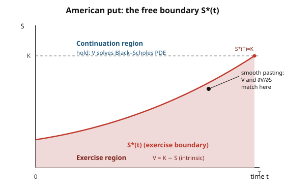

# Mathematical Finance · Lesson 4.4: American options and optimal stopping (taste)

> ⏱ ~15 min · Module 4: Interest rates and extensions · Builds on: [4.3 Forward measures and changing numéraire](04-03-forward-measures-changing-numeraire.md) · Unlocks: [4.5 Incomplete markets and model risk](04-05-incomplete-markets-model-risk.md)

## Why this matters

Everything we've priced so far pays off at one fixed date $T$: you write the contract, you wait, you collect. An **American option** breaks that. The holder may exercise at *any* moment up to $T$ — so pricing it is no longer "take an expectation," it's "find the best possible exercise policy, then take the expectation under it." That extra freedom is worth money (the *early-exercise premium*), and it turns a valuation problem into a decision problem: at every instant, holding versus striking. This is the finance face of **optimal stopping** — the same mathematics behind when to sell a house, exercise a real option to build a plant, or quit while you're ahead. It's also where the clean closed forms stop and numerical methods take over, which is exactly the doorstep of Lesson 4.5.

## The idea

Strip it to one decision. You hold an American option; the stock sits at some price. You can grab the **intrinsic value** right now — $(K-S)^+$ for a put, $(S-K)^+$ for a call — or you can wait, keeping the option alive for a payoff that might be bigger later. The value of waiting is the **continuation value**: the price of the very same option if you promised not to exercise this instant. So at every node,

$$\text{value} = \max\big(\underbrace{\text{intrinsic now}}_{\text{take it}},\ \underbrace{\text{continuation}}_{\text{hold on}}\big).$$

That single $\max$ is the entire subject. In the binomial tree of Lesson [1.5](01-05-binomial-model-risk-neutral-valuation.md) you already did backward induction with the continuation value alone; American pricing is the *same* backward pass with a $\max$ against intrinsic bolted onto every node. Where the $\max$ picks "take it," you're in the **exercise region**; where it picks "hold on," the **continuation region**. The surface separating them is a moving critical price $S^*(t)$ — the exercise boundary — and finding it is what makes the problem hard, because you're solving for the price and the optimal policy at once.

## The formal version

Let the discounted payoff process be $g(S_t)$ (the intrinsic value), $r$ the risk-free rate, $Q$ the risk-neutral measure. The American price is a **supremum over stopping times**:

$$V_0 = \sup_{\tau \le T}\ \mathbb{E}^{Q}\!\left[e^{-r\tau}\,g(S_\tau)\right],$$

where $\tau$ ranges over all **stopping times** — exercise rules that use only information available up to the exercise date, no peeking at the future. *In words:* the option is worth what the best non-clairvoyant exercise strategy earns on average, discounted, under the pricing measure.

**Snell envelope / dynamic programming.** The value process $V_t$ is the **smallest supermartingale that dominates the payoff** $g$. *In words:* $V$ is the cheapest running valuation that (i) never sits below what you could grab by exercising, and (ii) doesn't drift up on average once discounted. In discrete time this is exactly the backward recursion

$$V_T = g(S_T), \qquad V_t = \max\Big(g(S_t),\ e^{-r\Delta t}\,\mathbb{E}^Q_t[V_{t+\Delta t}]\Big).$$

The optimal policy: exercise the first time intrinsic ties the value, i.e. the first time $g(S_t) \ge$ continuation.

**Free-boundary / smooth pasting (continuous time).** In the continuation region the option is just a tradeable derivative, so it obeys the Black–Scholes PDE from [2.2](02-02-black-scholes-pde-delta-hedging.md):

$$\frac{\partial V}{\partial t} + rS\frac{\partial V}{\partial S} + \tfrac12\sigma^2 S^2\frac{\partial^2 V}{\partial S^2} - rV = 0 \quad (\text{continuation region}),$$

while in the exercise region $V = g(S)$ exactly. The two pieces meet at $S^*(t)$ under **value matching** ($V$ continuous) and **smooth pasting** ($\partial V/\partial S$ continuous). *In words:* value *and* delta glue together at the boundary with no kink — that smoothness condition is the extra equation that pins down where the unknown boundary $S^*(t)$ lives. This is a **free-boundary problem**: PDE plus an unknown frontier, generically with no closed-form solution.

## Picture

For a put, low stock prices are where exercising wins (you lock in $K-S$ before the stock climbs back), so the exercise region sits *below* $S^*(t)$; the boundary rises to meet the strike $K$ at expiry.

## Worked examples

**Example 1 — American put on a two-step tree (backward induction with the $\max$).**

Parameters: $S_0 = 100$, up factor $u = 1.2$, down factor $d = 0.8$, per-period gross risk-free $R = e^{r\Delta t} = 1.05$, strike $K = 100$, put payoff $(K-S)^+$. Risk-neutral probability

$$q = \frac{R-d}{u-d} = \frac{1.05-0.8}{1.2-0.8} = \frac{0.25}{0.40} = 0.625.$$

Stock tree: $S_0=100 \to \{120, 80\} \to \{144,\,96,\,64\}$. Terminal put payoffs: $(100-144)^+=0$, $(100-96)^+=4$, $(100-64)^+=36$.

*Node $u$ ($S=120$):* continuation $= \frac{1}{1.05}(0.625\cdot 0 + 0.375\cdot 4) = \frac{1.5}{1.05} = 1.43$; intrinsic $=(100-120)^+=0$. So $V_u = \max(0,\,1.43) = 1.43$ — **hold**.

*Node $d$ ($S=80$):* continuation $= \frac{1}{1.05}(0.625\cdot 4 + 0.375\cdot 36) = \frac{2.5+13.5}{1.05} = \frac{16}{1.05} = 15.24$; intrinsic $=(100-80)^+ = 20$. So $V_d = \max(20,\,15.24) = 20$ — **exercise early!** The stock is deep enough in the money that grabbing 20 now beats the 15.24 of waiting.

*Root ($S=100$):* continuation $= \frac{1}{1.05}(0.625\cdot 1.43 + 0.375\cdot 20) = \frac{0.893 + 7.5}{1.05} = \frac{8.393}{1.05} = 7.99$; intrinsic $= 0$. So $V_0 = \max(0,\,7.99) = \boxed{7.99}$ — **hold** at the root.

Contrast the **European** put (same tree, no early-exercise $\max$): at node $d$ it's stuck holding, worth $15.24$; root value $= \frac{1}{1.05}(0.625\cdot 1.43 + 0.375\cdot 15.24) = \frac{0.893+5.714}{1.05} = 6.29$. The American put is worth $7.99$ versus $6.29$ — an **early-exercise premium of $1.70$**, all of it created by the single node where we chose to strike.

**Example 2 — an American call on a non-dividend stock is never exercised early (so it equals the European call).**

Claim: with no dividends and $r>0$, the American call value equals the European call value $C^{\text{Eur}}$. It's enough to show the option is always worth more *alive* than the intrinsic $S_t - K$ you'd collect by exercising.

Start from the no-arbitrage lower bound. Compare two portfolios held to $T$: (A) one European call plus cash $Ke^{-r(T-t)}$ (which grows to exactly $K$ at $T$); (B) one share. At $T$, portfolio A is worth $(S_T-K)^+ + K = \max(S_T,\,K) \ge S_T$ = value of B. No arbitrage forces the same order today:

$$C^{\text{Eur}}_t + Ke^{-r(T-t)} \ge S_t \quad\Longrightarrow\quad C^{\text{Eur}}_t \ge S_t - Ke^{-r(T-t)}.$$

Since $r>0$ and $t<T$, we have $Ke^{-r(T-t)} < K$, hence

$$C^{\text{Eur}}_t \ge S_t - Ke^{-r(T-t)} > S_t - K = \text{intrinsic}.$$

The living option already beats what exercising would hand you (and it's also $\ge 0$). Exercising early throws away two things at once — the option's remaining time value *and* the interest you'd earn on $K$ by paying it later — with nothing to gain, because a non-dividend stock pays you nothing for holding it early. So the American holder never strikes before $T$; the extra freedom is worthless, and $C^{\text{Am}} = C^{\text{Eur}}$. $\blacksquare$

## Watch out

- **"American always means early exercise."** No — the *right* to exercise early is what you pay for; whether it's ever *optimal* is a separate question. American call on a non-dividend stock: never (Example 2). American put, or a dividend-paying call: sometimes (Example 1, Problem 3). The premium is only positive when early exercise is actually optimal somewhere.
- **Don't set intrinsic $=$ payoff at maturity and forget the interior.** The whole game is the interior nodes, where you compare intrinsic to continuation. At $T$ there's no decision left.
- **The boundary is unknown, not given.** You can't solve the Black–Scholes PDE on the continuation region without knowing $S^*(t)$, but $S^*(t)$ is determined *by* the solution via smooth pasting. That circularity is why there's no general closed form — you solve for price and boundary together, almost always numerically.
- **Continuation value is not the European price at that node** in general. It's the discounted risk-neutral expectation of the *American* value one step ahead — which itself already contains future early-exercise decisions. The recursion carries them.

## One-liner

> An American option is priced by one repeated decision — $\max(\text{exercise now},\ \text{hold})$ — and the frontier between those two answers, the free boundary, is what you're really solving for.

## Problems

**P1 (🟢)** Reprice the American put of Example 1 but with strike $K = 105$ (everything else identical: $S_0=100$, $u=1.2$, $d=0.8$, $R=1.05$, so $q=0.625$). Find the price and name every node where early exercise is optimal.

**P2 (🟡)** Show directly from the recursion $V_t = \max\big(g(S_t),\, e^{-r\Delta t}\mathbb{E}^Q_t[V_{t+\Delta t}]\big)$ that for an American **call** on a non-dividend stock, the "hold" branch always wins at an interior node — i.e. reproduce the no-early-exercise result in the one-step binomial. Use $S=100$, $u=1.25$, $d=0.8$, $R=1.05$, $K=90$, one step.

**P3 (🔴)** A stock trades at $100$ *cum-dividend* just before an ex-dividend date, and will pay a discrete dividend $D=10$, dropping the price to $90$ ex-dividend. A call has strike $K=80$. From the ex-dividend date to expiry there is one binomial step with $u=1.1$, $d=0.9$, $R=1.02$. Show that exercising the American call *just before* the dividend is optimal, and show that with **no** dividend (stock stays at $100$) it is *not*. Explain the flip via intrinsic-versus-continuation.

Solutions

**P1.** Terminal payoffs with $K=105$: $(105-144)^+=0$, $(105-96)^+=9$, $(105-64)^+=41$.

*Node $u$ ($S=120$):* continuation $=\frac{1}{1.05}(0.625\cdot 0 + 0.375\cdot 9) = \frac{3.375}{1.05}=3.21$; intrinsic $=(105-120)^+=0$. $V_u=\max(0,3.21)=3.21$ — hold.

*Node $d$ ($S=80$):* continuation $=\frac{1}{1.05}(0.625\cdot 9 + 0.375\cdot 41)=\frac{5.625+15.375}{1.05}=\frac{21}{1.05}=20.00$; intrinsic $=(105-80)^+=25$. $V_d=\max(25,20)=25$ — **exercise early**.

*Root ($S=100$):* continuation $=\frac{1}{1.05}(0.625\cdot 3.21 + 0.375\cdot 25)=\frac{2.009+9.375}{1.05}=\frac{11.384}{1.05}=10.84$; intrinsic $=(105-100)^+=5$. $V_0=\max(5,10.84)=\boxed{10.84}$ — hold.

Early exercise is optimal only at node $d$ (the down state, $S=80$). Raising the strike deepened the put's moneyness there, so the exercise decision is unchanged from Example 1, just larger.

**P2.** One step from $S=100$: up $\to 125$, down $\to 80$. $q=\frac{R-d}{u-d}=\frac{1.05-0.8}{1.25-0.8}=\frac{0.25}{0.45}=0.5\overline{5}$. Call payoffs at $T$: $(125-90)^+=35$, $(80-90)^+=0$.

Continuation $= \frac{1}{1.05}\big(0.5556\cdot 35 + 0.4444\cdot 0\big)=\frac{19.444}{1.05}=18.52$.

Intrinsic now $=(100-90)^+=10$. Then $V_0=\max(10,\,18.52)=18.52$: the hold branch wins, $10 < 18.52$, so no early exercise. This is the binomial shadow of Example 2's bound — with no dividend the discounting of $K$ ($Ke^{-r} = 90/1.05 = 85.7 < 90$) plus retained time value keeps continuation strictly above intrinsic. $\blacksquare$

**P3.** Risk-neutral probability for the post-dividend step: $q=\frac{R-d}{u-d}=\frac{1.02-0.9}{1.1-0.9}=\frac{0.12}{0.20}=0.6$.

*With the dividend.* If you **hold** through the ex-dividend date, the stock starts the final step from the ex-dividend price $90$: up $\to 90\cdot1.1=99$ (payoff $(99-80)^+=19$), down $\to 90\cdot0.9=81$ (payoff $(81-80)^+=1$). Continuation $=\frac{1}{1.02}(0.6\cdot 19 + 0.4\cdot 1)=\frac{11.4+0.4}{1.02}=\frac{11.8}{1.02}=11.57$.

If you **exercise just before** ex-dividend, you pay $K=80$ and receive the stock at its cum-dividend value $100$ (so you also collect the $10$ dividend): intrinsic $=100-80=20$.

$\max(20,\,11.57)=20$ → **exercise early**. Holding forgoes the dividend, and the $10$ price drop it causes is bigger than the time value you'd keep.

*Without the dividend.* The stock stays at $100$ into the final step: up $\to 110$ (payoff $30$), down $\to 90$ (payoff $10$). Continuation $=\frac{1}{1.02}(0.6\cdot 30 + 0.4\cdot 10)=\frac{18+4}{1.02}=\frac{22}{1.02}=21.57$; intrinsic $=100-80=20$. $\max(20,\,21.57)=21.57$ → **hold**.

The flip: the dividend transfers value out of the stock (and out of the call's continuation payoff) but *not* out of the intrinsic value you can seize by exercising cum-dividend. When that transfer $D$ exceeds the time value you'd sacrifice, exercising just before the drop becomes optimal. This is exactly why the *only* time an American call on a stock is exercised early is immediately before a dividend. $\blacksquare$

## Flashback

**From Lesson [1.5](01-05-binomial-model-risk-neutral-valuation.md) (binomial risk-neutral valuation):** price a one-step **European** call. $S_0=50$, $u=1.2$, $d=0.9$, gross risk-free $R=1.05$, strike $K=50$. Find $q$ and the call value — then say in one line why no $\max$ appears here.

Solution

$q=\frac{R-d}{u-d}=\frac{1.05-0.9}{1.2-0.9}=\frac{0.15}{0.30}=0.5$. Terminal stock: up $\to 60$ (payoff $(60-50)^+=10$), down $\to 45$ (payoff $(45-50)^+=0$).

$$C_0 = \frac{1}{1.05}\big(0.5\cdot 10 + 0.5\cdot 0\big)=\frac{5}{1.05}=4.76.$$

No $\max$ appears because a *European* option can only be exercised at $T$ — there's no intermediate decision to optimize. The American recursion of this lesson is precisely this backward pass with a $\max(\text{intrinsic},\,\cdot)$ inserted at every interior node.

## Connections

- **Backward:** the engine is [1.5](01-05-binomial-model-risk-neutral-valuation.md)'s backward induction, now carrying an early-exercise $\max$ at each node; the continuation region is governed by [2.2](02-02-black-scholes-pde-delta-hedging.md)'s Black–Scholes PDE, which holds everywhere you choose to hold.
- **Forward:** because the free boundary has no closed form, American options are the standard motivation for the numerical methods and the completeness questions of [4.5](04-05-incomplete-markets-model-risk.md) — the binomial tree here *is* the natural numerical scheme.
- **Sideways (optimal stopping / dynamic programming):** the $\sup$ over stopping times and the Snell-envelope recursion are the finance instance of the Bellman equation — "value $=$ max(stop payoff, discounted expected continue)" — the same object driving sequential decision problems in [grad-macro dynamic programming](../../grad-macro/syllabus.md).
- **Sideways (stochastic calculus):** the Snell envelope, supermartingales, and the optional stopping that justifies the $\sup$ representation are exactly the martingale machinery developed in [stochastic calculus](../../stochastic-calculus/syllabus.md).
