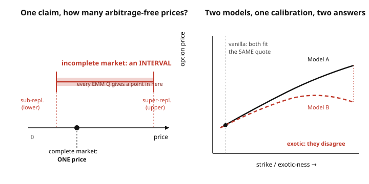

# Mathematical Finance · Lesson 4.5: Incomplete markets and model risk (a closing note)

> ⏱ ~15 min · Module 4: Interest rates and extensions · Builds on: [4.4 American options and optimal stopping](04-04-american-options-optimal-stopping.md) · Unlocks: end of course — see the [syllabus](../syllabus.md); natural next steps are grad-macro and further stochastic modeling

## Why this matters

The whole course has sold you one clean promise: rule out arbitrage and the *price is forced* — a single number, no opinions, no forecasting. That promise has a fine-print clause you've now met three times without naming it. In [1.4](01-04-fundamental-theorem-asset-pricing.md) the equivalent martingale measure (EMM) was unique *only* when the market was complete. In [2.6](02-06-implied-volatility-smile.md) the volatility smile was the market screaming that reality is not one log-normal. In [4.4](04-04-american-options-optimal-stopping.md) you priced against a *given* model and never asked whether it was right.

This note is the clause read aloud. In an **incomplete market**, no-arbitrage no longer pins one price — it pins an *interval*. Choosing a number inside that interval requires something arbitrage alone doesn't provide: preferences, a calibration, a modeling judgment. That is where mathematical finance stops being pure mathematics and becomes engineering. Knowing exactly where the clean theory stops is the last thing a good pricer needs — because that boundary is where money is actually lost.

## The idea

Replication is the engine of everything you've done. A claim is priced *exactly* when you can build a self-financing portfolio of traded assets whose payoff equals the claim's in **every** state; then no-arbitrage forces price = cost of that portfolio ([1.2](01-02-replication-complete-markets.md)). Completeness means *every* payoff is replicable.

Completeness is a **counting** condition: you need at least as many independent traded assets as there are independent sources of risk. One stock driven by one Brownian motion, plus a bond, spans a one-factor world — complete. But bolt on a *second* random driver you can't trade directly — a randomly moving volatility, a jump — and now there are two sources of risk and still one hedging instrument. The span falls short. Some payoffs are **unspanned**: no portfolio reproduces them state-by-state, so no-arbitrage can't quote them a single price.

What survives is a *range*. Any measure $Q$ that (i) is equivalent to the real world and (ii) makes discounted traded assets martingales still forbids arbitrage — and when the market is incomplete there is a whole **family** of such $Q$. Each one assigns the unspanned claim a different expectation. The set of all these expectations is an interval $[\,\underline{\pi},\,\overline{\pi}\,]$. Anything strictly inside is an arbitrage-free price. The theory has gone from *a point* to *a segment*, and it will not narrow that segment for you.

## The formal version

**FTAP, both halves ([1.4](01-04-fundamental-theorem-asset-pricing.md)).** No arbitrage $\iff$ at least one EMM $Q$ exists. Market complete $\iff$ that $Q$ is **unique**. In words: existence of a pricing measure is the no-free-lunch condition; *uniqueness* is the extra luxury of completeness. Incomplete = arbitrage-free but many $Q$.

**The no-arbitrage price interval.** For a claim with payoff $H$ (discounted), let $\mathcal{Q}$ be the set of EMMs. The arbitrage-free prices are exactly the open interval between

$$\underline{\pi}(H) = \inf_{Q\in\mathcal{Q}} \mathbb{E}^{Q}[H], \qquad \overline{\pi}(H) = \sup_{Q\in\mathcal{Q}} \mathbb{E}^{Q}[H].$$

In words: the lowest and highest expectations any legitimate pricing measure will assign bracket every price the market can't rule out. A replicable claim has $\underline{\pi}=\overline{\pi}$ — the interval collapses to the point you already know.

**The super-/sub-replication duality.** The upper bound has a hedging identity:

$$\overline{\pi}(H) = \min\{\, \text{cost of a portfolio whose payoff} \ge H \ \text{in every state} \,\}.$$

In words: the most you should pay is the cheapest position that **dominates** the claim no matter what happens — a super-hedge. Symmetrically, $\underline{\pi}(H)$ is the *dearest* portfolio the claim dominates (a sub-hedge). Selling above $\overline{\pi}$ or buying below $\underline{\pi}$ is a genuine arbitrage; anywhere between, you're exposed.

**Named sources of incompleteness.**
- **Stochastic volatility** — vol is itself random, e.g. Heston: $dv_t = \kappa(\theta - v_t)\,dt + \xi\sqrt{v_t}\,dW^{v}_t$ alongside $dS_t = \dots + \sqrt{v_t}\,S_t\,dW^{S}_t$. Two Brownian risks $(W^S, W^v)$, one traded stock $\Rightarrow$ incomplete. The extra freedom is the **market price of volatility risk**, which no-arbitrage leaves undetermined.
- **Jumps** — Merton jump-diffusion adds a Poisson jump to $S$. A jump of random size can't be hedged by continuous trading in $S$ (you can't rebalance through a discontinuity), so jump risk is unspanned.
- **Frictions** — transaction costs, illiquidity, position limits, and unspanned macro risks all break the "trade freely and continuously" premise replication rests on.

## Picture

Left: completeness gives a point; incompleteness gives a red segment, every EMM landing somewhere inside, capped by the super-/sub-replication bounds. Right: **model risk** — two models forced through the *same* vanilla quote still disagree the moment you ask about an exotic.

## Worked examples

**Example 1 — a trinomial market with a price interval.** One period, interest rate $0$ (so no discounting, and the martingale condition is just $\mathbb{E}^{Q}[S_1]=S_0$). Stock $S_0 = 2$; at time $1$ it takes **three** values $S_1 \in \{3, 2, 1\}$ (states up/mid/down). Traded assets: the stock and the bond — a 2-dimensional span in a 3-dimensional state space, so this market is incomplete.

*The EMMs.* A measure $Q=(q_u,q_m,q_d)$ is an EMM iff all $q>0$, they sum to 1, and $\mathbb{E}^{Q}[S_1]=S_0$:

$$q_u+q_m+q_d = 1, \qquad 3q_u + 2q_m + 1q_d = 2.$$

Subtracting twice the first from the second gives $q_u - q_d = 0$. So $q_u = q_d = t$ and $q_m = 1-2t$, a **one-parameter family**

$$Q_t = (t,\ 1-2t,\ t), \qquad 0 < t < \tfrac12$$

(the strict inequalities keep every probability positive — equivalence to the real world). Not one measure: a segment of them.

*A non-replicable claim.* Take a call struck at $K=2$: payoff $(S_1-2)^+ = (1,0,0)$ across states $(3,2,1)$. It isn't replicable — solving $a\,(3,2,1)+b\,(1,1,1)=(1,0,0)$ forces $a=b=0$, contradicting the up-state. Its arbitrage-free prices are

$$\mathbb{E}^{Q_t}[(1,0,0)] = t\cdot 1 + (1-2t)\cdot 0 + t\cdot 0 = t \in (0,\ \tfrac12).$$

An **open interval of prices**, not a number. No-arbitrage says "somewhere in $(0,\tfrac12)$" and refuses to say more.

*The bounds as hedges.* The upper bound $\overline{\pi}=\tfrac12$ is the cheapest super-hedge: minimize cost $2a+b$ subject to $a\,S_1+b \ge (1,0,0)$. The portfolio $a=\tfrac12,\ b=-\tfrac12$ pays $(1,\tfrac12,0)\ge(1,0,0)$ and costs $2(\tfrac12)-\tfrac12=\tfrac12$. The lower bound $\underline{\pi}=0$ is the trivial sub-hedge $a=b=0$, paying $(0,0,0)\le(1,0,0)$ at cost $0$. Exactly the $\sup$/$\inf$ of the interval — the duality in the flesh.

**Example 2 — model risk (qualitative).** Two desks price the same book.
- Desk A runs **Black–Scholes**, constant $\sigma$, calibrated so its at-the-money 1-year call matches the market quote of, say, 7.97 (the price you'll re-derive in the Flashback).
- Desk B runs a **stochastic-vol/jump** model, its parameters *also* calibrated to hit 7.97 on that same ATM call.

On vanillas they agree by construction. Now price a **deep out-of-the-money put** or a **down-and-out barrier**. These payoffs live in the tails and depend on the *shape* of the terminal distribution and the *path*, not just the ATM level. Desk B's model carries a fat left tail and jump mass (the smile of [2.6](02-06-implied-volatility-smile.md) made mechanical); Desk A's log-normal doesn't. Their exotic prices can differ by tens of percent — from *identical* vanilla calibrations. Nothing was mispriced in the vanilla sense; the disagreement is pure **model risk**, the danger of "calibrate to what's liquid, then extrapolate to what isn't." The smile was the early warning: the market quotes a *surface* of vols precisely because one $\sigma$ is a fiction.

## Watch out

- **"Incomplete means arbitrage exists."** No — an incomplete market can be perfectly arbitrage-free. It just has *many* EMMs instead of one. Incompleteness is about **uniqueness**, not existence.
- **"Calibration fixes the model."** Fitting today's vanilla surface pins the marginal distribution of $S_T$, not the dynamics or the joint/path law. Infinitely many models share one surface and disagree on path-dependent and forward-starting payoffs. A perfect vanilla fit is *necessary*, never *sufficient*.
- **"Hedging still eliminates risk."** In incomplete markets you can only *super*-replicate (often far too expensive to be a real quote) or minimize residual risk (quadratic/variance hedging, minimal-martingale measure). The hedge reduces risk; it does not zero it. Some risk is structurally unhedgeable — that leftover is what a *price* has to compensate.
- **"Pick the EMM that looks nicest."** The choice is an economic statement. Calibration lets the market choose it for you; utility-indifference pricing lets *preferences* choose it (Module 3's SDF $m$ selects a $Q$); variance-optimal/minimal-martingale measures choose by a hedging criterion. Different criteria, different prices — be explicit about which one you're standing on.

## One-liner

> Arbitrage pins the price to a *point* only in complete markets; everywhere else it pins an *interval*, and choosing a number inside means importing a preference, a calibration, or a model — so know which one you're using and where it breaks.

## Problems

**P1 (🟢)** In the Example 1 market ($S_0=2$, $S_1\in\{3,2,1\}$, rate $0$, EMMs $Q_t=(t,1-2t,t)$ for $0<t<\tfrac12$), price the **range claim** that pays $1$ only in the middle state: payoff $(0,1,0)$. Find the interval of arbitrage-free prices and give its super-replication (upper) and sub-replication (lower) bounds.

**P2 (🟡)** A stock's price is driven by its own Brownian motion *and* a second Brownian motion driving its volatility (a Heston-type world); only the stock and a bond trade. (a) Explain, by counting risk sources against hedging instruments, why the market is incomplete. (b) Name **two** distinct principled ways to still select a single price for a volatility-sensitive claim, and say what each one is really choosing.

**P3 (🔴)** In the Example 1 market, consider the convex claim with payoff $(4,1,0)$ across states $(3,2,1)$. (a) Using the EMM family, find its arbitrage-free price interval. (b) Find the cheapest super-replicating portfolio $(a,b)$ (stock units $a$, bond units $b$), its cost, and confirm the cost equals the upper bound. Interpret the slack in the payoff.

Solutions

**P1.** Price under $Q_t$: $\mathbb{E}^{Q_t}[(0,1,0)] = t\cdot 0 + (1-2t)\cdot 1 + t\cdot 0 = 1-2t$. As $t$ runs over $(0,\tfrac12)$, $1-2t$ runs over $(0,1)$ — the arbitrage-free interval is $(0,1)$.

*Upper (super-replication):* minimize cost $2a+b$ subject to $a\,S_1+b \ge (0,1,0)$, i.e. $3a+b\ge0,\ 2a+b\ge1,\ a+b\ge0$. The middle constraint says $2a+b\ge1$, so the cost is $\ge 1$; and $2a+b=1$ is achievable (e.g. $a=0,b=1$, paying $(1,1,1)\ge(0,1,0)$). So $\overline{\pi}=1$, matching $\sup(0,1)$.

*Lower (sub-replication):* maximize $2a+b$ subject to $a\,S_1+b\le(0,1,0)$. The zero portfolio $a=b=0$ pays $(0,0,0)\le(0,1,0)$ at cost $0$, and one checks no dominated portfolio does better, so $\underline{\pi}=0$, matching $\inf(0,1)$. The bet on the middle state is almost entirely unpinned — the interval is nearly the whole $[0,1]$, because that payoff is the *most* unspanned direction here.

**P2.** (a) There are **two** independent sources of randomness — the Brownian motion $W^S$ driving the stock and $W^v$ driving its volatility — but only **one** risky asset you can hold to hedge (the stock; the bond carries no risk). Two risks, one hedging instrument: you cannot form a portfolio that neutralizes both, so some payoffs (any that depend on realized vol) are unspanned and the market is incomplete. Equivalently, the market price of volatility risk is a free parameter no-arbitrage doesn't fix, so the EMM is non-unique.

(b) Any two of:
- **Market calibration** — fit the model's free parameter(s) to observed vanilla/implied-vol quotes ([2.6](02-06-implied-volatility-smile.md)); this lets *the market* pick the EMM (it reveals the price of vol risk actually being charged).
- **Utility-indifference / SDF pricing** — pick the price at which the agent is indifferent to adding a small position, given a utility function; the stochastic discount factor $m$ from [3.3](03-03-expected-utility-stochastic-discount-factor.md) selects a specific $Q$. This chooses via *preferences*.
- **A canonical measure by a hedging criterion** — the minimal-martingale or variance-optimal measure, which selects $Q$ to minimize residual hedging error. This chooses via a *risk-minimization* rule.

Each "extra way" is really a way of importing the information no-arbitrage lacks: the market's, the agent's, or a hedging objective's.

**P3.** (a) $\mathbb{E}^{Q_t}[(4,1,0)] = 4t + (1-2t)\cdot1 + 0 = 1+2t$. Over $t\in(0,\tfrac12)$ this sweeps $(1,\ 2)$. Interval $(1,2)$: lower $1$, upper $2$.

(b) Super-replication: minimize $2a+b$ subject to $3a+b\ge4,\ 2a+b\ge1,\ a+b\ge0$. Try making the up- and down-state constraints tight: $3a+b=4$ and $a+b=0$ give $a=2,\ b=-2$. Check the middle: $2(2)-2=2\ge1$ ✓. Cost $=2a+b=2(2)-2=2$, which equals the upper bound $\overline{\pi}=2$ ✓ (no cheaper dominating portfolio exists, since any EMM value $1+2t<2$ is a lower bound on the super-hedge cost and $2$ is attained in the limit $t\to\tfrac12$). 

The super-hedge pays $a\,S_1+b=(4,2,0)$, dominating the claim $(4,1,0)$ with **slack $1$ in the middle state**. That wasted dollar in the state you didn't need it is exactly why super-replication is only an *upper* bound, not a fair price: you overpay to be safe against a state the claim doesn't reward. A real quote lives strictly below, at $1+2t$ for whatever $t$ the market or your model selects.

## Flashback

**From [2.4](02-04-black-scholes-formula.md) (Black–Scholes formula):** Price a European call with $S_0 = 100$, $K = 100$, $r = 0$, $\sigma = 0.20$, $T = 1$. Then compare it to the trader's at-the-money rule of thumb, price $\approx 0.4\,S_0\,\sigma\sqrt{T}$.

Solution

With $r=0$ the discount factor is $1$ and

$$d_{1,2} = \frac{\ln(S_0/K) + (r \pm \tfrac12\sigma^2)T}{\sigma\sqrt{T}} = \frac{0 \pm \tfrac12(0.04)(1)}{0.20} = \pm 0.10.$$

So $d_1 = 0.10$, $d_2 = -0.10$, and

$$C = S_0\,N(d_1) - K e^{-rT} N(d_2) = 100\big(N(0.10) - N(-0.10)\big).$$

Using $N(0.10) \approx 0.5398$, $N(-0.10) \approx 0.4602$: $C \approx 100(0.5398 - 0.4602) = 100(0.0796) \approx 7.97$.

The rule of thumb gives $0.4 \times 100 \times 0.20 \times \sqrt{1} = 8.0$ — within a rounding whisker. (It's the first-order expansion of the formula at the money: near $d\approx0$, $N(d_1)-N(d_2)\approx N'(0)\cdot 2d_1 = \tfrac{1}{\sqrt{2\pi}}\sigma\sqrt{T}\approx 0.399\,\sigma\sqrt{T}$.) This $7.97$ is the single number Desk A and Desk B were both calibrated to in Example 2 — and the seed of their exotic disagreement.

## Connections

- **Backward:** this note is the fine print of [1.4](01-04-fundamental-theorem-asset-pricing.md)'s FTAP II — the non-unique-$Q$ case finally given its price interval. It is the smile of [2.6](02-06-implied-volatility-smile.md) explained: the market prices a whole vol surface because one log-normal (one EMM) is the wrong object in an incomplete world. And the tool for *choosing* among EMMs is Module 3's stochastic discount factor ([3.3](03-03-expected-utility-stochastic-discount-factor.md)) — preferences re-enter exactly where arbitrage falls silent.
- **The course, in one arc:** you started by ruling out arbitrage ([1.1](01-01-arbitrage-law-of-one-price.md)), turned that into a pricing measure ([1.3](01-03-one-period-model-pricing-measure.md)–[1.4](01-04-fundamental-theorem-asset-pricing.md)), pushed it to continuous time and Black–Scholes ([2.x](02-04-black-scholes-formula.md)), read the Greeks and the smile, then let *preferences* price what arbitrage couldn't (Module 3) and built a term structure (Module 4). The honest ending: **arbitrage pins prices exactly only in complete markets.** Outside them — which is to say, in the real market — models and judgment come back, and finance is as much engineering as mathematics. Black–Scholes is a *language* for quoting risk, not a claim about the truth.
- **Forward:** the machinery generalizes to incomplete-market equilibrium and risk-sharing in **grad-macro** (asset pricing with heterogeneous, uninsurable risk), and the modeling side deepens in further **stochastic modeling** — Lévy processes, rough volatility, model-free/robust pricing. See the [syllabus](../syllabus.md) for where these branch.
- **Sideways:** the incompleteness here is exactly the "not enough independent drivers to span the risk" phenomenon from `stochastic-calculus` (the [syllabus](../../stochastic-calculus/syllabus.md)); and the broader lesson — that a calibrated model can fit everything you've seen and still be wrong about what you haven't — is the universal caution of all quantitative modeling, in or out of finance.
