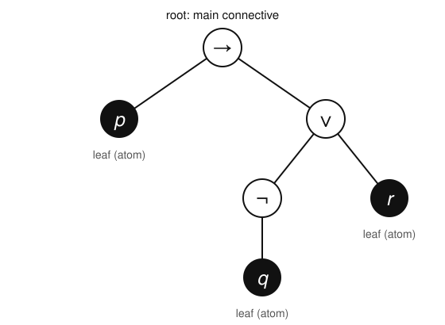

# Logic & Set Theory · Lesson 1.1: Syntax & Connectives

> ⏱ ~15 min · Module 1: Propositional Logic · Builds on: nothing (course start) · Unlocks: 1.2 ([Semantics & Truth Tables](01-02-semantics-truth-tables.md))

## Why this matters

You have spent years reading formulas and trusting that "$p \to (\neg q \lor r)$" means one definite thing. This course starts by earning that trust. Before we can talk about whether a formula is *true* (Lesson 1.2) or *provable* (Lesson 1.4), we need to say precisely what counts as a formula at all — because the entire method of this course is proving things *about* formulas, and you can only run a proof over objects with a crisp, finite definition. That definition, and the induction principle that rides on it, is the tool behind every theorem in Module 1.

## The idea

A propositional formula is a *sentence built out of Lego bricks*. There are two kinds of pieces.

The **atoms** are indivisible truth-bearing statements — "it is raining," "the market cleared" — that we don't look inside. We abbreviate them with letters $p, q, r, \dots$ and treat each as a single opaque brick that will eventually be either true or false.

The **connectives** are the couplers that snap atoms (and already-built formulas) together into bigger ones: *not*, *and*, *or*, *if–then*, *if-and-only-if*. Snap "$\neg$" onto $q$ to get "$\neg q$"; snap "$\lor$" between "$\neg q$" and $r$ to get "$(\neg q \lor r)$"; keep going.

The crucial move — the one that makes logic mechanical rather than a matter of taste — is that "formula" is defined **recursively**: a thing is a formula exactly when it is either an atom, or something you built from smaller formulas by one legal snap. Nothing else gets in. Because every formula is assembled in finitely many snaps from atoms, if you want to prove a property holds for *all* formulas, you only need to check the atoms and check that each connective *preserves* the property. That is structural induction, and it is the workhorse of this entire module.

## The formal version

Fix a countable set of **propositional variables** (atoms) $\{p_0, p_1, p_2, \dots\}$; in practice we write $p, q, r$. Fix the five **connectives**

$$\neg \ (\text{negation}), \quad \land \ (\text{conjunction}), \quad \lor \ (\text{disjunction}), \quad \to \ (\text{conditional}), \quad \leftrightarrow \ (\text{biconditional}),$$

read *not, and, or, if…then, iff*. Now the definition.

**Definition (well-formed formula, wff).** The set of well-formed formulas is the *smallest* set $\mathcal{F}$ of strings such that:

1. **(Base)** every propositional variable $p$ is in $\mathcal{F}$;
2. **(Negation)** if $\varphi \in \mathcal{F}$, then $\neg\varphi \in \mathcal{F}$;
3. **(Binary)** if $\varphi \in \mathcal{F}$ and $\psi \in \mathcal{F}$, then each of $(\varphi \land \psi)$, $(\varphi \lor \psi)$, $(\varphi \to \psi)$, $(\varphi \leftrightarrow \psi)$ is in $\mathcal{F}$;
4. nothing is in $\mathcal{F}$ except by finitely many applications of (1)–(3).

*In words:* atoms are formulas, you may negate any formula, and you may join any two formulas with a binary connective wrapped in its own pair of parentheses — and those are the only formulas there are.

Here $\varphi$ (phi) and $\psi$ (psi) are **metavariables**: they are not part of the logic, they are *our* shorthand, in the **metalanguage** (the ordinary math/English we reason in), for "some formula, whichever one you like." The formulas themselves — strings like $(p \to \neg q)$ — live in the **object language**, the language we are studying. Keeping the two apart is a habit worth forming now: $p$ is a symbol *in* the logic; $\varphi$ is a name *we* use to talk about arbitrary symbols of the logic.

**The point of clause (4).** Saying $\mathcal{F}$ is the *smallest* such set is what licenses proof by induction:

**Structural induction on formulas.** To prove that every wff has a property $P$, it suffices to show: (i) $P(p)$ holds for every atom $p$; (ii) if $P(\varphi)$ then $P(\neg\varphi)$; (iii) if $P(\varphi)$ and $P(\psi)$ then $P$ holds of $(\varphi \star \psi)$ for each binary $\star \in \{\land,\lor,\to,\leftrightarrow\}$.

*In words:* check the atoms, then check that each connective hands the property up from parts to whole; the property then holds everywhere, because every formula was built by exactly those steps.

**Parentheses and unique readability.** Clause (3) forces a pair of parentheses around every binary application, and this is not decoration — it guarantees **unique readability**: every wff is either an atom, or $\neg\varphi$ for a unique $\varphi$, or $(\varphi \star \psi)$ for a unique connective $\star$ and unique $\varphi, \psi$. So a formula parses in exactly one way, and phrases like "*the* main connective" and "*the* left subformula" are well-defined.

*In words:* the parentheses make sure a formula can be taken apart in only one way, so its meaning is never ambiguous.

Writing all those parentheses is tiring, so — purely as metalanguage shorthand — we adopt **precedence** (binding order, tightest first): $\neg$, then $\land$, then $\lor$, then $\to$, then $\leftrightarrow$; binary connectives associate to the right. This lets us *write* $p \to \neg q \lor r$ and *mean* the official $(p \to ((\neg q) \lor r))$. The convention lives in our heads; the parenthesized string is the real formula.

## Picture

The formula $(p \to (\neg q \lor r))$ drawn as its **formation tree** (equivalently, parse tree): atoms sit at the leaves, every internal node is a connective, and the node at the very top is the **main connective**. Reading the tree from the leaves upward *is* the recursive construction — each node is one application of a clause of the definition.

The root is $\to$, so the whole formula is a conditional $(\varphi \to \psi)$ with $\varphi = p$ and $\psi = (\neg q \lor r)$. Its right subtree's root is $\lor$, splitting into $\neg q$ and $r$; and $\neg q$ is a negation node over the leaf $q$. Unique readability is exactly the statement that *this tree is the only tree* that could have produced the string.

## Worked examples

**Example 1 (build one, mechanically).** Show that $(\neg(p \land q) \to r)$ is a wff by giving its formation sequence — a list where each entry is an atom or is built from earlier entries.

1. $p$ — atom, by clause (1).
2. $q$ — atom, by clause (1).
3. $(p \land q)$ — from lines 1, 2 by clause (3).
4. $\neg(p \land q)$ — from line 3 by clause (2).
5. $r$ — atom, by clause (1).
6. $(\neg(p \land q) \to r)$ — from lines 4, 5 by clause (3). ✓

Every line is justified by the definition, so the final string is a wff. Its main connective is the $\to$ built at line 6.

**Example 2 (why you'd care — reject a non-formula, and count what a machine must track).** Is the string $(p \land \lor q)$ a wff? Try to parse it. The outer parentheses promise a binary application $(\varphi \star \psi)$. Scanning for the pieces, we hit $\land$ immediately followed by $\lor$: after $\land$ we need a *formula* as its right operand, but $\lor$ is a connective, not a formula, and no clause ever places two binary connectives adjacently. There is no formation sequence producing this string, so it is **not** a wff — it is nonsense, the logical analogue of a mis-nested bracket in code.

This is precisely what a compiler's parser does when it rejects `x + * y`: unique readability is what lets a parser decide *yes/no* and, on *yes*, hand back one unambiguous syntax tree. The recursive definition is not philosophy — it is the specification a parser implements.

## Watch out

- You might think $\neg q \lor r$ and $\neg(q \lor r)$ say the same thing because "it's all one expression" — but their formation trees differ (main connective $\lor$ vs. $\neg$), so they are *different formulas* and, you'll see in 1.2, can take different truth values. Precedence resolves the bare string $\neg q \lor r$ to the *first* one; when in doubt, draw the tree.
- You might think $p$, "$p$ is true," and $\varphi$ are interchangeable — but $p$ is an object-language atom, "$p$ is true" is a metalanguage claim *about* $p$ (which needs the semantics of Lesson 1.2, not present yet), and $\varphi$ is a metavariable ranging over formulas. Syntax alone knows nothing of truth; it only knows *well-formed vs. not*.
- You might think dropping parentheses is harmless because "everyone knows the precedence" — but precedence is a *reading* convention in our heads, not part of the object language. The official formula always carries its parentheses; unique readability is a theorem about the fully-parenthesized strings, and it is what precedence is silently leaning on.

## One-liner

> A formula is a finite tree of connectives over atoms, defined recursively so that it reads exactly one way — which is precisely what makes "prove it for every formula" mean "check the atoms and check each connective."

## Problems

**P1 (🟢)** For the formula $((p \leftrightarrow \neg q) \land r)$: (a) give a formation sequence justifying each line by clause number; (b) name its main connective; (c) draw or describe its formation tree.

**P2 (🟡)** Restore full official parentheses to the shorthand string $\neg p \to q \land r \lor s$, using the precedence order ($\neg$ tightest, then $\land$, $\lor$, $\to$, $\leftrightarrow$; binaries associate right). Then state the main connective.

**P3 (🔴, optional)** Use structural induction to prove that in every wff, the number of left parentheses "$($" equals the number of binary-connective occurrences (i.e. occurrences of $\land,\lor,\to,\leftrightarrow$). *(This is a baby version of the counting lemmas behind unique readability.)*

Solutions

**P1** (a) A formation sequence:
1. $p$ — clause (1).
2. $q$ — clause (1).
3. $\neg q$ — from 2, clause (2).
4. $(p \leftrightarrow \neg q)$ — from 1, 3, clause (3).
5. $r$ — clause (1).
6. $((p \leftrightarrow \neg q) \land r)$ — from 4, 5, clause (3). ✓

(b) The main connective is the $\land$ introduced at line 6: the whole formula has the shape $(\varphi \land \psi)$ with $\varphi = (p \leftrightarrow \neg q)$ and $\psi = r$.

(c) Tree: root $\land$; left child the node $\leftrightarrow$ (whose children are the leaf $p$ and a $\neg$-node over leaf $q$); right child the leaf $r$.

**P2** Insert parentheses tightest-binding first.
- $\neg$ binds tightest: $\neg p$ becomes $(\neg p)$.
- $\land$ next: $q \land r$ becomes $(q \land r)$.
- $\lor$ next, over the results so far: $(q \land r) \lor s$ becomes $((q \land r) \lor s)$.
- $\to$ last (loosest here), joining $(\neg p)$ on the left with $((q \land r) \lor s)$ on the right:
$$((\neg p) \to ((q \land r) \lor s)).$$
The main connective is $\to$. (Sanity check: the top-level split is $\neg p$ on the left of the $\to$, everything else on the right, matching "$\to$ is looser than $\land,\lor$.")

**P3** Let $P(\varphi)$ be the statement "$L(\varphi) = B(\varphi)$," where $L(\varphi)$ counts occurrences of the symbol "$($" in $\varphi$ and $B(\varphi)$ counts occurrences of binary connectives in $\varphi$. Induct on the structure of $\varphi$.

*Base.* If $\varphi = p$ is an atom, it contains no parentheses and no binary connectives, so $L(p) = 0 = B(p)$. ✓

*Negation.* Suppose $P(\varphi)$ holds, i.e. $L(\varphi) = B(\varphi)$. Then $\neg\varphi$ adds one symbol $\neg$ and no parentheses and no binary connective, so $L(\neg\varphi) = L(\varphi)$ and $B(\neg\varphi) = B(\varphi)$; hence $L(\neg\varphi) = B(\neg\varphi)$. ✓

*Binary.* Suppose $P(\varphi)$ and $P(\psi)$ hold, and let $\star \in \{\land,\lor,\to,\leftrightarrow\}$. The formula $(\varphi \star \psi)$ is the concatenation "$($", $\varphi$, "$\star$", $\psi$, "$)$". Counting:
$$L((\varphi \star \psi)) = 1 + L(\varphi) + L(\psi), \qquad B((\varphi \star \psi)) = 1 + B(\varphi) + B(\psi),$$
the leading $1$'s coming from the one new "$($" and the one new binary connective $\star$ (the "$)$" is not a left parenthesis and is not counted). Applying the two induction hypotheses $L(\varphi)=B(\varphi)$ and $L(\psi)=B(\psi)$ gives $L((\varphi \star \psi)) = B((\varphi \star \psi))$. ✓

By structural induction, $P(\varphi)$ holds for every wff $\varphi$. $\blacksquare$

## Connections

- **Forward:** Lesson 1.2 ([Semantics & Truth Tables](01-02-semantics-truth-tables.md)) attaches *meaning* to these strings — a valuation reads the formation tree bottom-up, exactly the recursion introduced here, to assign each formula a truth value. Unique readability is what makes that assignment well-defined.
- **Forward:** every theorem in this module (soundness in 1.4, and the whole method throughout) is proved by structural induction on formulas — the principle set up in this lesson is the module's engine, not a one-off.
- **Sideways (proofs-primer):** structural induction is ordinary mathematical induction relocated from $\mathbb{N}$ to "number of construction steps." If you're comfortable with induction on the naturals, you already own this; the novelty is only that the objects are trees, not numbers.
- **Sideways (CS):** a formation tree is an abstract syntax tree, and unique readability is exactly the property a parser relies on to turn source text into one unambiguous tree — the same recursion reappears when you study grammars in [theory-of-computation](../../theory-of-computation/syllabus.md).
