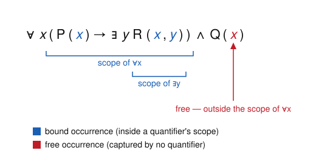

# Logic & Set Theory · Lesson 2.1: Quantifiers & Syntax

> ⏱ ~15 min · Module 2: First-Order Logic, Models & Completeness · Builds on: [Lesson 1.1](01-01-syntax-connectives.md) · Unlocks: [Lesson 2.2](02-02-structures-satisfaction.md)

## Why this matters

Propositional logic can say "$p$ and $q$", but it cannot say "*every* natural number has a successor" or "*some* real is bigger than $x$". Almost all of mathematics lives in that second register — "for all", "there exists", statements *about objects and their relations*. First-order logic is the language that makes those statements formal, and everything downstream in this course (structures, satisfaction, Gödel's theorems) is written in it. But before you can ask whether a statement is *true*, you have to know it's a *legal string* — and the one genuinely new syntactic idea here, variable **binding**, is exactly what trips people up when they translate English into logic (Lesson 2.3) or substitute one term for another in a proof.

## The idea

In propositional logic the atoms were opaque letters $p, q$. First-order logic cracks them open: an atom is now a *relation applied to objects*, like $x < y$ or $\operatorname{Prime}(n)$. So we need names for objects (**terms**) and then statements about them (**formulas**) — two different kinds of thing, and keeping them straight is the whole game.

The second new idea is the quantifier. Write $\exists y\,(x < y)$: "there is some $y$ above $x$." Notice the two variables play totally different roles. The $y$ is a *dummy* — it's introduced, used, and discarded by the $\exists y$; renaming it to $z$ changes nothing. The $x$ is a genuine *parameter*: the truth of the statement depends on what $x$ is. We say $y$ is **bound** (a quantifier owns it) and $x$ is **free** (nobody owns it — it's dangling, waiting for a value).

Same distinction you already use in calculus without naming it. In $\int_0^x t^2\,dt$, the $t$ is bound (it's the dummy of integration, rename it freely) and the $x$ is free (the answer depends on it). "Bound vs. free" is just that, made syntactic.

## The formal version

**Signature (language).** A *first-order signature* $\sigma$ is a set of symbols, each tagged with an **arity** (how many inputs it takes):

- **constant symbols** $c, d, \dots$ (arity $0$) — names for specific objects, e.g. $0$, $1$, $\varnothing$;
- **function symbols** $f, g, \dots$, each of some arity $n \ge 1$ — e.g. binary $+$, unary "successor" $S$;
- **relation (predicate) symbols** $R, P, \dots$, each of some arity $n \ge 1$ — e.g. binary $<$, unary $\operatorname{Prime}$.

Equality $=$ is built in — always available, not part of $\sigma$. On top of $\sigma$ we always have an infinite supply of **variables** $x, y, z, \dots$.

*In words:* the signature is the vocabulary — which objects, operations, and relations you're allowed to talk about — with each symbol's number of slots fixed in advance.

**Terms** name objects. They are built by structural recursion (exactly the recipe from [Lesson 1.1](01-01-syntax-connectives.md), now for a richer alphabet):

1. every variable is a term, and every constant symbol is a term;
2. if $f$ is an $n$-ary function symbol and $t_1, \dots, t_n$ are terms, then $f(t_1, \dots, t_n)$ is a term;
3. nothing else is a term.

*In words:* a term is a variable, a constant, or a function stacked on top of terms — e.g. $S(S(0))$ or $x + (y \cdot z)$. **A term never contains a relation symbol, a connective, or a quantifier.** It denotes an *object*, not a truth value.

**Formulas** make claims. **Atomic formulas** come in two shapes:

- $R(t_1, \dots, t_n)$ for an $n$-ary relation symbol $R$ and terms $t_i$ — e.g. $x < S(y)$;
- $t_1 = t_2$ for terms $t_1, t_2$.

**Formulas** are then built by recursion:

1. every atomic formula is a formula;
2. if $\varphi, \psi$ are formulas, so are $\neg\varphi,\ (\varphi \land \psi),\ (\varphi \lor \psi),\ (\varphi \to \psi),\ (\varphi \leftrightarrow \psi)$;
3. if $\varphi$ is a formula and $x$ is a variable, then $\forall x\,\varphi$ and $\exists x\,\varphi$ are formulas;
4. nothing else is a formula.

*In words:* atomic formulas are relations-applied-to-terms (or equalities); everything else is those glued together with the propositional connectives you already know, plus the two quantifiers. The single hard boundary: **terms go inside relation/equality symbols; the connectives and quantifiers act on formulas.** Writing $\neg(x+y)$ or $R(\forall z\,\psi)$ is a category error — as ungrammatical as a verb where a noun belongs.

**Scope, free, and bound.** In $\forall x\,\varphi$ or $\exists x\,\varphi$, the subformula $\varphi$ is the **scope** of that quantifier. An occurrence of a variable $x$ in a formula is **bound** if it lies inside the scope of some $\forall x$ or $\exists x$ (and is then owned by the *innermost* such quantifier); otherwise it is **free**.

*In words:* draw the bracket around what the quantifier reaches; a variable occurrence inside a matching bracket is bound, an occurrence outside every matching bracket is free. The *same variable letter* can occur both free and bound in one formula (you'll see this in the problems) — "free" and "bound" describe **occurrences**, not variables.

**Sentence.** A formula with **no free occurrences** of any variable is a **sentence** (or *closed formula*).

*In words:* a sentence has no dangling parameters, so it makes a self-contained claim — the kind of thing that can be flatly true or false once we fix a structure (next lesson). A formula with free variables, like $x < y$, is only true *relative to* values for $x$ and $y$.

**Substitution and "free for."** Write $\varphi[x := t]$ for the formula obtained by replacing every **free** occurrence of $x$ in $\varphi$ with the term $t$ (bound occurrences are left alone — they belong to their quantifier). One trap: if $t$ contains a variable $y$ and some free $x$ sits inside the scope of a $\forall y$/$\exists y$, then that $y$ gets **captured** — swallowed by the quantifier — and the meaning is corrupted. We say $t$ is **free for** $x$ in $\varphi$ when no such capture happens, i.e. substituting $t$ traps none of $t$'s variables. When $t$ is *not* free for $x$, first rename the offending bound variable (a harmless relabeling of a dummy) and then substitute.

## Picture

The formula $\forall x\,(P(x) \to \exists y\,R(x,y)) \land Q(x)$, with each quantifier's scope bracketed and every variable occurrence colored. Trace it: the $x$ in $P(x)$ and the $x$ in $R(x,y)$ sit inside the bracket of $\forall x$, so they're bound; the $y$ sits inside $\exists y$, bound. But the final $x$ in $Q(x)$ is **outside** the $\forall x$ bracket (the parentheses close before the $\land$), so it is **free** — which makes the whole formula *not* a sentence.



## Worked examples

**Example 1 (mechanical — read off free/bound).** Classify every occurrence in
$$\varphi \ :=\ \forall x\,\big(x = y \ \to\ \exists z\, R(x, z)\big).$$
Scope of $\forall x$: all of $(x = y \to \exists z\,R(x,z))$. Scope of $\exists z$: just $R(x,z)$.

- $x$ in "$x = y$": inside $\forall x$'s scope → **bound**.
- $y$ in "$x = y$": no quantifier mentions $y$ anywhere → **free**.
- $x$ in "$R(x,z)$": inside $\forall x$'s scope → **bound**.
- $z$ in "$R(x,z)$": inside $\exists z$'s scope → **bound**.

Free variables: just $\{y\}$. Since $y$ occurs free, $\varphi$ is **not a sentence** — its truth depends on what $y$ is. Close it up as $\forall y\,\varphi$ (which *is* a sentence) and it asserts something definite: "every object equal to $x$... " — wait, no: $\forall y\forall x(x=y \to \exists z\,R(x,z))$ says "every object has an $R$-successor." Binding the free variable turned a parametric formula into a claim.

**Example 2 (why you'd care — substitution done wrong).** Let $\varphi(x) := \exists y\,(x < y)$, read "$x$ has something above it." Suppose we want to substitute the term $t = y$ for $x$. Blindly replacing gives
$$\varphi[x := y] \ \overset{?}{=}\ \exists y\,(y < y),$$
which says "something is below itself" — always **false**, and nothing like the original. The bug: the $y$ we substituted got **captured** by $\exists y$. Formally, $t = y$ is *not free for* $x$ in $\varphi$. The fix is to rename the bound dummy first ($y \rightsquigarrow w$, harmless), then substitute:
$$\varphi \ \equiv\ \exists w\,(x < w), \qquad \varphi[x := y] \ =\ \exists w\,(y < w),$$
which faithfully says "$y$ has something above it." This capture-avoidance is not pedantry: it is *exactly* the discipline that keeps the proof rules for $\forall$ and $\exists$ sound in Lesson 2.4, and it's the same $\alpha$-renaming a compiler does to your local variables.

## Watch out

- **You might think** a term and a formula are interchangeable — **but** a term names an *object* and a formula makes a *claim*. $x + y$ is a term (no truth value); $x + y = 0$ is a formula. You can't quantify a term ($\forall x\,(x+y)$ is nonsense) and you can't feed a formula into a function ($S(x = y)$ is nonsense).
- **You might think** "bound" and "free" are properties of a *variable* — **but** they're properties of an *occurrence*. In $R(x,y) \land \exists x\,S(x)$ the letter $x$ occurs free (in $R(x,y)$) *and* bound (in $\exists x\,S(x)$) in the same formula.
- **You might think** substitution just means "swap the letter everywhere" — **but** it only touches *free* occurrences, and only when the incoming term is *free for* the variable. Skip the capture check and you'll silently prove false things (Example 2).
- **You might think** renaming a bound variable could change a formula's meaning — **but** it never does, precisely because the bound variable is a dummy: $\forall x\,P(x)$ and $\forall z\,P(z)$ are the same statement. (Renaming a *free* variable, of course, changes everything.)

## One-liner

> A term names an object and a formula makes a claim; a quantifier owns every variable occurrence in its scope, and the ones it doesn't own are the free parameters that decide whether you even have a sentence.

## Problems

**P1 (🟢)** For the formula
$$\varphi \ :=\ \exists x\,\big(R(x,y) \ \land\ \forall y\,(S(y) \to R(x,y))\big),$$
(a) give the scope of each quantifier; (b) classify **every** variable occurrence as free or bound (there are five: one $x$ and one $y$ in the first $R(x,y)$, then $y$ in $S(y)$, and $x, y$ in the second $R(x,y)$ — plus the two quantifier-attached variables); (c) list the free variables and decide whether $\varphi$ is a sentence.

**P2 (🟡)** Let $\varphi(x) := \forall y\,(y \cdot x = y)$ over a signature with a binary function $\cdot$. (a) Is the term $t = y + 1$ free for $x$ in $\varphi$? (b) Compute $\varphi[x := t]$ correctly, renaming a bound variable first if you must, and (c) say in one sentence what goes wrong if you substitute without renaming.

**P3 (🔴, optional)** Fix the signature $\sigma$ with a constant $c$, a unary function $f$, a binary function $g$, and a binary relation $R$. (a) For each string below, say whether it is a well-formed **term**, a well-formed **formula**, or **neither**, with a one-line reason: (i) $f(g(x,c))$; (ii) $g\big(f(x),\, R(x,c)\big)$; (iii) $R(c, f(c))$. (b) Write a first-order **sentence** over $\sigma$ expressing "$f$ is injective," and confirm it has no free variables.

<details>
<summary>Solutions</summary>

**P1** (a) Scope of $\exists x$: the entire body $\big(R(x,y) \land \forall y\,(S(y) \to R(x,y))\big)$. Scope of $\forall y$: just $(S(y) \to R(x,y))$.

(b) Go occurrence by occurrence:
- First conjunct $R(x,y)$: the $x$ is inside $\exists x$'s scope → **bound**; the $y$ is *not* inside any $y$-quantifier's scope (the $\forall y$ owns only the second conjunct) → **free**.
- $S(y)$: this $y$ is inside $\forall y$'s scope → **bound**.
- Second $R(x,y)$: the $x$ is inside $\exists x$ → **bound**; the $y$ is inside $\forall y$ → **bound**.

(c) The only free occurrence is the $y$ in the first $R(x,y)$, so the free variables are $\{y\}$. Because there is a free variable, $\varphi$ is **not a sentence**. Note the payoff: the letter $y$ occurs both **free** (first conjunct) and **bound** (rest) in the very same formula — the point of Watch-out #2.

**P2** (a) The bound variable of $\varphi$ is $y$, and $t = y + 1$ *contains* $y$. Every free occurrence of $x$ in $\varphi$ sits inside the scope of $\forall y$, so substituting $t$ would let $\forall y$ capture the $y$ of $t$. Hence $t$ is **not free for** $x$ in $\varphi$.

(b) Rename the bound $y$ to a fresh $w$ first: $\varphi \equiv \forall w\,(w \cdot x = w)$. Now substitute:
$$\varphi[x := t] \ =\ \forall w\,\big(w \cdot (y + 1) = w\big).$$
Read: "$y+1$ is a right identity" — the honest instance of "$x$ is a right identity."

(c) Without renaming you'd get $\forall y\,(y \cdot (y+1) = y)$, where the substituted $y$ is captured by $\forall y$: the parameter $y+1$ has been silently fused with the dummy, turning a statement *about the object $y+1$* into an unrelated universal claim. Meaning corrupted.

**P3** (a)
- (i) $f(g(x,c))$: $x$ and $c$ are terms, so $g(x,c)$ is a term (binary $g$ on two terms), so $f(\cdot)$ of it is a term. **Well-formed term.**
- (ii) $g(f(x), R(x,c))$: $f(x)$ is a fine term, but $R(x,c)$ is a *formula* (relation applied to terms), and $g$ demands **terms** in both slots. Feeding a formula to a function is a category error. **Neither** (ill-formed).
- (iii) $R(c, f(c))$: $c$ is a term and $f(c)$ is a term, and $R$ is a binary relation applied to two terms. **Well-formed formula** (atomic).

(b) "$f$ is injective" means equal outputs force equal inputs:
$$\forall x\,\forall y\,\big(f(x) = f(y) \ \to\ x = y\big).$$
Both $x$ and $y$ occur only inside the scopes of $\forall x$ and $\forall y$, so every occurrence is bound and there are **no free variables** — it is a sentence. (Contrast the sub-formula $f(x) = f(y) \to x = y$ on its own, which has free $x, y$ and is not a sentence.)

</details>

## Flashback

**From [Lesson 1.1](01-01-syntax-connectives.md) (Syntax & Connectives):** Consider the propositional string $\neg(p \to (q \lor \neg r))$. (a) Draw its formation (parse) tree, and (b) name the **main connective** — the one at the root, applied last when the formula is built up.

<details>
<summary>Solution</summary>

(a) Build outward from the atoms:
- $\neg r$ is $\neg$ applied to atom $r$.
- $q \lor \neg r$ is $\lor$ applied to $q$ and $\neg r$.
- $p \to (q \lor \neg r)$ is $\to$ applied to $p$ and the previous.
- $\neg(\,\cdots)$ is $\neg$ applied to that whole implication.

```
        ¬                (root)
        |
        →
       / \
      p   ∨
         / \
        q   ¬
            |
            r
```

(b) The last connective applied — the root — is the outer **negation $\neg$**. So the formula is a *negation* (of the implication $p \to (q \lor \neg r)$), not an implication. This is the same "peel from the outside" reading you now do with quantifier scopes: the outermost operator governs the whole string.

</details>

## Connections

- **Backward:** the term/formula recursion is [Lesson 1.1](01-01-syntax-connectives.md)'s "recursion on structure" run on a bigger alphabet — atoms have split into *relations applied to terms*, and two quantifiers joined the connectives. The parse-tree reading (peel the outermost operator) is unchanged.
- **Forward:** [Lesson 2.2](02-02-structures-satisfaction.md) supplies the *meaning* this lesson deliberately withheld — a structure interprets each symbol of $\sigma$ and an assignment feeds values to the *free* variables, so a formula's truth depends on exactly the free occurrences you learned to spot here. Sentences (no free variables) are the ones that come out plainly true or false. The capture-avoidance discipline returns in [Lesson 2.4](02-04-soundness-completeness-fol.md), where the proof rules for $\forall$ and $\exists$ are sound *only* because substitution respects "free for."
- **Sideways (CS / analysis):** binding, scope, and capture-avoiding substitution are the same concepts behind local variables and $\alpha$-renaming in programming languages and the $\lambda$-calculus, and behind the dummy variable of an integral or a $\sum$ — in every case, renaming the bound name is free but the free names carry the meaning.
