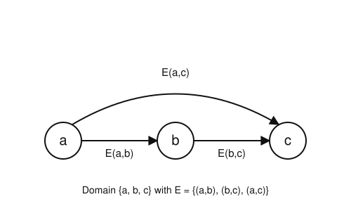

# Logic & Set Theory · Lesson 2.2: Structures & Satisfaction

> ⏱ ~15 min · Module 2: First-Order Logic, Models & Completeness · Builds on: [Lesson 2.1](02-01-quantifiers-syntax.md) · Unlocks: [Lesson 2.3](02-03-translation-quantifier-order.md)

## Why this matters

In Lesson 2.1 you learned to *write* first-order formulas — but a formula like $\forall x\,\exists y\, E(x,y)$ is just a string of marks. It has no truth value until you say what the marks *mean*: what objects $x$ ranges over, what relation $E$ names. Supplying that meaning is a **structure**, and the recipe for turning "meaning + formula" into "true or false" is **Tarski's definition of satisfaction** — arguably the single most important definition in logic. It is what lets us say a group *satisfies* the group axioms, or that $(\mathbb{Z},<)$ has no least element. Every later payoff — soundness, Gödel's completeness theorem, the independence of the Continuum Hypothesis — rests on being able to check whether a given sentence holds in a given structure.

## The idea

Think of a first-order sentence as a *contract* written in a fixed vocabulary of symbols, and a structure as a *possible world* that either honors the contract or breaks it. To evaluate the contract you need two things:

1. A **world**: a nonempty set of actual objects (the *domain*), plus a concrete meaning for every symbol — each constant points at some object, each function symbol becomes an actual function on the domain, each relation symbol becomes an actual set of tuples.
2. A **temporary bookkeeping of the free variables**: an *assignment* that parks each variable on some domain object, so that even a formula with dangling variables can be checked.

Once both are fixed, evaluation is purely mechanical and follows the *shape* of the formula: an atomic formula asks a yes/no question about the world ("is this tuple actually in the relation?"), connectives combine answers the way truth tables did in Module 1, and a quantifier $\forall x$ says "sweep $x$ across *every object in the domain* and check the inside each time." Nothing more mysterious than that — but the recursion has to be stated exactly, because "for every object" quietly does all the heavy lifting of infinity.

## The formal version

Fix a **signature** (or *language*) $\mathcal{L}$: a set of constant symbols, function symbols (each with an *arity* $n\ge 1$), and relation symbols (each with an arity). This is the vocabulary from Lesson 2.1.

**Definition (structure).** An $\mathcal{L}$-**structure** $\mathcal{M}$ consists of:

- a nonempty set $M$, its **domain** (or *universe*), written $|\mathcal{M}|$;
- for each constant symbol $c$, an element $c^{\mathcal{M}} \in M$;
- for each $n$-ary function symbol $f$, a function $f^{\mathcal{M}} : M^n \to M$;
- for each $n$-ary relation symbol $R$, a set $R^{\mathcal{M}} \subseteq M^n$.

*In words:* a structure is one honest-to-goodness set with a chosen meaning bolted onto every symbol of the language. The superscript $^{\mathcal{M}}$ always means "the real-world thing this symbol names in $\mathcal{M}$."

**Definition (assignment).** A **variable assignment** in $\mathcal{M}$ is a function $s : \text{Var} \to M$ sending each variable to a domain element. Write $s[x \mapsto d]$ for the assignment identical to $s$ except that it sends the variable $x$ to $d$.

**Definition (value of a term).** Each term $t$ gets a value $t^{\mathcal{M}}[s] \in M$, defined by recursion on how $t$ is built:

- a variable: $x^{\mathcal{M}}[s] = s(x)$;
- a constant: $c^{\mathcal{M}}[s] = c^{\mathcal{M}}$;
- a compound term: $\big(f(t_1,\dots,t_n)\big)^{\mathcal{M}}[s] = f^{\mathcal{M}}\big(t_1^{\mathcal{M}}[s],\dots,t_n^{\mathcal{M}}[s]\big)$.

*In words:* to evaluate a term, look up the variables in $s$, look up the constants in $\mathcal{M}$, then apply the interpreted functions from the inside out — exactly like evaluating an arithmetic expression once you know the values of its letters.

**Definition (satisfaction — Tarski).** For a formula $\varphi$, define "$\mathcal{M}$ **satisfies** $\varphi$ under $s$", written $\mathcal{M} \models \varphi[s]$, by recursion on $\varphi$:

- **atomic (relation):** $\mathcal{M} \models R(t_1,\dots,t_n)[s]$ iff $\big(t_1^{\mathcal{M}}[s],\dots,t_n^{\mathcal{M}}[s]\big) \in R^{\mathcal{M}}$;
- **atomic (equality):** $\mathcal{M} \models (t_1 = t_2)[s]$ iff $t_1^{\mathcal{M}}[s] = t_2^{\mathcal{M}}[s]$;
- **negation:** $\mathcal{M} \models \neg\varphi\,[s]$ iff $\mathcal{M} \not\models \varphi[s]$;
- **connectives:** $\mathcal{M} \models (\varphi \land \psi)[s]$ iff both hold; $\lor, \to, \leftrightarrow$ follow the Module 1 truth tables of the parts;
- **universal:** $\mathcal{M} \models \forall x\,\varphi\,[s]$ iff for **every** $d \in M$, $\ \mathcal{M} \models \varphi\,[s[x \mapsto d]]$;
- **existential:** $\mathcal{M} \models \exists x\,\varphi\,[s]$ iff for **some** $d \in M$, $\ \mathcal{M} \models \varphi\,[s[x \mapsto d]]$.

*In words:* atomic formulas ask whether the computed tuple really lives in the relation; connectives combine truth values as before; and a quantifier reassigns its variable to each domain element in turn — $\forall$ demands the body hold for *all* of them, $\exists$ for *at least one*.

**Truth of a sentence.** A **sentence** is a formula with no free variables. One proves (by induction on $\varphi$) the *coincidence lemma*: $\mathcal{M} \models \varphi[s]$ depends only on the values $s$ gives to the *free* variables of $\varphi$. A sentence has none, so its truth value does not depend on $s$ at all — we drop the assignment and simply write $\mathcal{M} \models \sigma$, read "$\mathcal{M}$ is a **model** of $\sigma$" or "$\sigma$ is **true in** $\mathcal{M}$".

**Model of a theory.** A **theory** $T$ is a set of sentences. $\mathcal{M} \models T$ means $\mathcal{M} \models \sigma$ for every $\sigma \in T$: one world honoring the whole contract at once. (This is the notion that makes "a group," "a linear order," or "a model of ZFC" precise.)

## Picture

This is a complete worked structure $\mathcal{M}$ over the signature with a single binary relation symbol $E$. Domain $|\mathcal{M}| = \{a,b,c\}$, and $E^{\mathcal{M}} = \{(a,b),(b,c),(a,c)\}$ — read $E(x,y)$ as "there is an arrow from $x$ to $y$." Notice this is exactly the strict order $a < b < c$ drawn as arrows. Let us check two sentences *by the definition*, expanding every quantifier.

**Claim 1: $\mathcal{M} \models \exists x\,\forall y\,\neg E(y,x)$** ("some node has no incoming arrow — a source").

By the $\exists$ clause we need one $d \in \{a,b,c\}$ making $\forall y\,\neg E(y,x)$ true under $s[x\mapsto d]$. Try $d = a$. The $\forall y$ clause requires $\neg E(y,a)$ for every $y \in \{a,b,c\}$:

- $y=a$: is $(a,a)\in E^{\mathcal{M}}$? No, so $\mathcal{M}\models \neg E(y,a)$. ✓
- $y=b$: is $(b,a)\in E^{\mathcal{M}}$? No. ✓
- $y=c$: is $(c,a)\in E^{\mathcal{M}}$? No. ✓

All three hold, so $x=a$ witnesses the existential. **True.**

**Claim 2: $\mathcal{M} \models \forall x\,\exists y\, E(x,y)$** ("every node has an outgoing arrow").

By the $\forall x$ clause this must hold for *every* $d \in \{a,b,c\}$. Test $d=c$: we need some $y$ with $(c,y) \in E^{\mathcal{M}}$. The pairs starting with $c$? There are none — $c$ has no outgoing arrow. So $\exists y\,E(c,y)$ is **false**, and one failing case kills a $\forall$. Therefore $\mathcal{M} \not\models \forall x\,\exists y\, E(x,y)$ — **false**. (Equivalently $\mathcal{M} \models \exists x\,\forall y\,\neg E(x,y)$: the node $c$ is a *sink*.)

## Worked examples

**Example 1 (mechanical — a term, then an atomic formula).** Work in the arithmetic structure $\mathcal{N}$ over the signature with constant $0$, unary function $S$ ("successor"), binary function $+$, and binary relation $<$, interpreted the standard way on $|\mathcal{N}| = \mathbb{N}$: $0^{\mathcal{N}}=0$, $S^{\mathcal{N}}(n)=n+1$, $+^{\mathcal{N}}$ is addition, $<^{\mathcal{N}}$ is the usual order. Let $s(x)=2,\ s(y)=3$.

Evaluate the term $t = S(x) + y$ from the inside out:
$$t^{\mathcal{N}}[s] = +^{\mathcal{N}}\big(S^{\mathcal{N}}(s(x)),\, s(y)\big) = +^{\mathcal{N}}\big(S^{\mathcal{N}}(2),\,3\big) = +^{\mathcal{N}}(3,3) = 6.$$
Now the atomic formula $y < S(x)$: its truth is $\big(s(y),\,S^{\mathcal{N}}(s(x))\big) = (3,3) \in\, <^{\mathcal{N}}$? Since $3 < 3$ is false, $\mathcal{N} \not\models (y < S(x))[s]$. Every symbol was replaced by its real meaning before any question was asked — that is the whole discipline.

**Example 2 (why you'd care — the same sentence, two structures).** Consider the sentence $\sigma :\;\forall x\,\exists y\, (y < x)$ over the signature with one binary relation $<$. *In words:* "every element has something strictly below it," i.e. there is no least element.

- In $\mathcal{Z} = (\mathbb{Z}, <)$: fix any $d \in \mathbb{Z}$; take $y = d-1$, and $d-1 < d$, so $\exists y\,(y<x)$ holds under $s[x\mapsto d]$. This works for *every* $d$, so $\mathcal{Z} \models \sigma$. **True.**
- In $\mathcal{N} = (\mathbb{N}, <)$: test $d = 0$. Is there $y \in \mathbb{N}$ with $y < 0$? No. So $\exists y\,(y<0)$ fails, one failing $d$ breaks the $\forall$, and $\mathcal{N} \not\models \sigma$. **False.**

One string, opposite truth values — because truth is *relative to a structure*. This is precisely the phenomenon that makes model theory possible: a theory like "no least element" *selects* some structures and rejects others, and $\mathcal{Z} \models \sigma$ while $\mathcal{N} \not\models \sigma$ shows $\sigma$ is neither valid (true in all structures) nor unsatisfiable. Keep this next to the group example from Boss problem 2: "every element has an inverse" carves the groups out of all structures the very same way.

## Watch out

- **You might think $\forall x$ ranges over the terms or names of the language — but it ranges over the *domain objects*.** Some domain elements may have no term naming them at all (think of an irrational in $(\mathbb{R},<)$ over a language with only $0$ and $S$), yet $\forall x$ still sweeps over them. Quantifiers quantify *things*, not *symbols*.
- **You might think you can ask "$\mathcal{M} \models \varphi$?" for any formula — but a bare $\models$ (no assignment) is only meaningful for *sentences*.** For a formula with a free variable, e.g. $E(x,y)$, the answer genuinely depends on where $s$ parks $x$ and $y$; you must supply $s$ and write $\mathcal{M}\models\varphi[s]$. Sentences are special *because* the coincidence lemma frees them from $s$.
- **You might read $\models$ as one symbol — but it does two jobs, so mind the sides.** Here $\mathcal{M}\models\varphi$ has a *structure* on the left (satisfaction). In Lesson 1.3 and again in [Lesson 2.4](02-04-soundness-completeness-fol.md), $\Gamma\models\varphi$ has a *set of formulas* on the left (entailment: true in every structure that makes $\Gamma$ true). Same glyph, different relation — the left-hand side tells you which.
- **The domain must be nonempty.** First-order logic bakes this in; without it $\forall x\,\varphi \to \exists x\,\varphi$ would fail and the whole proof theory would wobble.

## One-liner

> A structure is a world that gives every symbol a real meaning; Tarski's recursion then reads a formula off that world clause by clause, with $\forall x$ meaning "sweep $x$ over the entire domain."

## Problems

**P1 (🟢)** Let $\mathcal{G}$ be the structure over signature $\{E\}$ ($E$ binary) with domain $\{1,2,3\}$ and $E^{\mathcal{G}} = \{(1,2),(2,3),(3,1)\}$ — a directed 3-cycle. Decide, with a one-line justification from the definition, whether $\mathcal{G}$ satisfies each:
(a) $\forall x\,\neg E(x,x)$;  (b) $\forall x\,\exists y\, E(x,y)$;  (c) $\exists x\,\forall y\,\neg E(y,x)$.

**P2 (🟡)** Consider $\sigma :\; \exists x\,\forall y\,(x \le y)$ ("there is a least element") over signature $\{\le\}$. Determine whether $\sigma$ is true in $(\mathbb{N}, \le)$ and in $(\mathbb{Z}, \le)$, expanding the $\exists$ and $\forall$ clauses to justify each verdict. Why does swapping the quantifier order to $\forall y\,\exists x\,(x\le y)$ change the answer in $(\mathbb{Z},\le)$?

**P3 (🔴, optional)** Let $\mathcal{M}$ be the transitive-order structure from the Picture: domain $\{a,b,c\}$, $E^{\mathcal{M}} = \{(a,b),(b,c),(a,c)\}$. Let $T$ be the theory of *strict total orders*:
$$\text{(irr)}\ \forall x\,\neg E(x,x), \quad \text{(tr)}\ \forall x\forall y\forall z\big(E(x,y)\land E(y,z)\to E(x,z)\big), \quad \text{(tri)}\ \forall x\forall y\big(x=y \lor E(x,y)\lor E(y,x)\big).$$
Show $\mathcal{M} \models T$ by verifying all three axioms. (You may check the finitely many relevant tuples directly.)

Solutions

**P1** Domain $\{1,2,3\}$, $E^{\mathcal{G}}=\{(1,2),(2,3),(3,1)\}$.

(a) **True.** $\forall x\,\neg E(x,x)$ needs $(x,x)\notin E^{\mathcal{G}}$ for each $x$: none of $(1,1),(2,2),(3,3)$ is in $E^{\mathcal{G}}$, so every case holds.

(b) **True.** Each node has an outgoing arrow: $E(1,2)$, $E(2,3)$, $E(3,1)$. So for every $d$ there is a witness $y$, satisfying the $\forall x\,\exists y$.

(c) **False.** $\exists x\,\forall y\,\neg E(y,x)$ asks for a node with *no* incoming arrow. But every node has one: $(3,1)$ into $1$, $(1,2)$ into $2$, $(2,3)$ into $3$. So no choice of $x$ makes $\forall y\,\neg E(y,x)$ true, and the existential fails.

**P2** Expand $\sigma:\exists x\,\forall y\,(x\le y)$.

- **$(\mathbb{N},\le)$: True.** Take $x = 0$. The $\forall y$ clause needs $0 \le y$ for every $y\in\mathbb{N}$, which holds. So $x=0$ witnesses the existential.
- **$(\mathbb{Z},\le)$: False.** For *any* candidate $d\in\mathbb{Z}$, the body $\forall y\,(d\le y)$ fails at $y=d-1$, since $d\le d-1$ is false. No $d$ survives, so the existential fails.

Swapping to $\forall y\,\exists x\,(x\le y)$: now $x$ may be chosen *after* $y$ is fixed. In $(\mathbb{Z},\le)$, given any $y$, take $x=y$ (or $x=y-1$); then $x\le y$ holds. So this weaker sentence is **true** in $(\mathbb{Z},\le)$. The difference is the order of the sweeps: $\exists x\,\forall y$ demands *one* $x$ good for all $y$ (a global least element — none exists in $\mathbb{Z}$), whereas $\forall y\,\exists x$ lets the witness $x$ depend on $y$. This $\forall\exists$-vs-$\exists\forall$ gap is exactly the subject of [Lesson 2.3](02-03-translation-quantifier-order.md).

**P3** Check each axiom against $E^{\mathcal{M}}=\{(a,b),(b,c),(a,c)\}$.

*(irr)* No pair $(x,x)$ is in $E^{\mathcal{M}}$ (the only pairs are $(a,b),(b,c),(a,c)$, all with distinct entries), so $\forall x\,\neg E(x,x)$ holds.

*(tr)* We need: whenever $E(x,y)$ and $E(y,z)$, also $E(x,z)$. The only way to chain two edges is $E(a,b)$ then $E(b,c)$, requiring $E(a,c)$ — and $(a,c)\in E^{\mathcal{M}}$. ✓ Every other pair of edges shares no middle vertex (e.g. after $(b,c)$ there is no edge out of $c$; after $(a,c)$ none out of $c$), so no further obligation arises. Transitivity holds.

*(tri)* For each unordered pair of distinct elements, at least one direction is an edge: $\{a,b\}$ has $E(a,b)$; $\{b,c\}$ has $E(b,c)$; $\{a,c\}$ has $E(a,c)$. And $x=y$ covers the equal case. So $\forall x\forall y\,(x=y\lor E(x,y)\lor E(y,x))$ holds.

All three axioms hold, so $\mathcal{M}\models T$: the graph is literally the strict total order $a<b<c$, which is why $(a,b,c)$ behaves just like $(0,1,2)$ under $<$.

## Flashback

**From Lesson 2.1 (Quantifiers & Syntax):** In the formula below (signature: $R$ binary, $P$ unary), state the **scope** of each quantifier, then classify every variable *occurrence* as free or bound, and list the free variables of the whole formula.
$$\Big(\forall x\,\big(R(x,y) \to \exists y\, R(y,z)\big)\Big) \;\lor\; P(x)$$

Solution

**Scopes.** $\forall x$ scopes the parenthesized conjunct $\big(R(x,y)\to\exists y\,R(y,z)\big)$. The $\exists y$ scopes only $R(y,z)$. The final $P(x)$ lies *outside* the $\forall x$ parentheses.

**Occurrence-by-occurrence.**

| occurrence | bound by | status |
|---|---|---|
| $x$ in $R(x,y)$ | $\forall x$ | **bound** |
| $y$ in $R(x,y)$ | — (the $\exists y$ has not yet opened) | **free** |
| $y$ in $R(y,z)$ | $\exists y$ | **bound** |
| $z$ in $R(y,z)$ | — | **free** |
| $x$ in $P(x)$ | — (outside the $\forall x$ scope) | **free** |

**Free variables of the whole formula:** $\{x, y, z\}$ — $x$ is free through $P(x)$, $y$ is free through the first $R(x,y)$, and $z$ is free throughout. The key subtlety: the variable $y$ has *both* a free occurrence (in $R(x,y)$) and a bound occurrence (in $R(y,z)$); "free vs. bound" is a property of each *occurrence*, not of the letter. Because it has free variables, this formula is **not** a sentence — which is exactly why, in this lesson, its truth in a structure would require an assignment $s$.

## Connections

- **Backward:** this lesson gives the strings from [Lesson 2.1](02-01-quantifiers-syntax.md) their meaning, and its connective clauses are the Module 1 truth tables ([Lesson 1.2](01-02-semantics-truth-tables.md)) reappearing at the atomic level — first-order semantics *contains* propositional semantics.
- **Forward:** [Lesson 2.3](02-03-translation-quantifier-order.md) leans on the $\forall x$/$\exists x$ clauses to explain why quantifier *order* matters (the $\exists\forall$ vs. $\forall\exists$ gap in P2), and [Lesson 2.4](02-04-soundness-completeness-fol.md) uses "true in a structure" to state soundness and Gödel's completeness theorem — the bridge from this semantic $\models$ to the syntactic $\vdash$.
- **Sideways (algebra & order theory):** "$\mathcal{M}\models T$" is the exact meaning of "$\mathcal{M}$ is a group / a linear order / a field." The transitive-order graph being a model of the strict-total-order axioms (P3) is the same move by which the group axioms of Boss problem 2 pick out the groups; the ordinals of [Lesson 4.1](04-01-relations-orderings-well-ordering.md) are structures satisfying a strengthening of P3's order theory.
