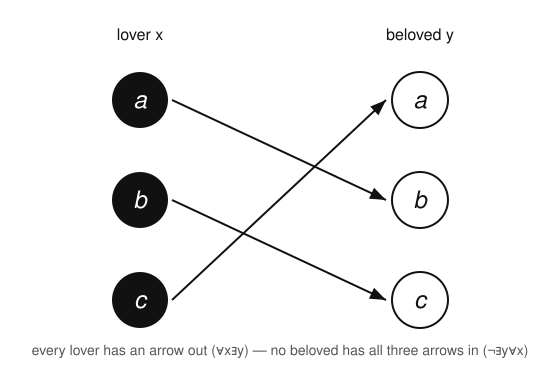

# Logic & Set Theory · Lesson 2.3: Translation & Quantifier Order

> ⏱ ~15 min · Module 2: First-Order Logic, Models & Completeness · Builds on: [Lesson 2.2 (Structures & Satisfaction)](02-02-structures-satisfaction.md) · Unlocks: [Lesson 2.4 (Soundness & Gödel's Completeness Theorem)](02-04-soundness-completeness-fol.md)

## Why this matters

Every theorem you'll ever prove starts life as an English sentence, and the first move — before any argument — is to pin down exactly what it claims. First-order logic is the language that forces you to be exact: it makes you name the objects you're quantifying over, and it makes the *order* of "for all" and "there exists" visible. That order is not a formality. "Every real number is less than some real number" is true; swap the quantifiers and "some real number is greater than every real number" is false. The definition of a limit, the definition of continuity, the difference between "pointwise" and "uniform" — all of analysis lives or dies on $\forall\exists$ versus $\exists\forall$. This lesson is where you learn to hear the difference.

## The idea

Translating into logic is three decisions:

1. **Pick a domain of discourse** — the set of objects your variables range over (people, integers, real numbers). This is the same *universe* $|\mathfrak{A}|$ you met as a structure's carrier in Lesson 2.2; every quantifier silently ranges over it.
2. **Pick predicates** — the properties and relations you'll name: $L(x)$ for "$x$ is a logician," $\mathrm{Loves}(x,y)$ for "$x$ loves $y$."
3. **Assemble** the sentence, getting two things right: which connective glues a quantifier to its body ($\to$ or $\land$), and in which *order* the quantifiers stack.

The two traps live in steps 3 and 3. The connective trap: "all A are B" wants $\to$, "some A is B" wants $\land$ — and swapping them silently changes the meaning. The order trap: $\forall x\,\exists y$ lets the witness $y$ **depend on** $x$ (a different one for each), while $\exists y\,\forall x$ demands **one** $y$ that works for everybody. "Everyone loves someone" versus "someone is loved by everyone." Same words, different worlds.

## The formal version

Fix a domain $D$ and predicates. The two standard patterns:

**"All A are B"** $\quad=\quad \forall x\,(A(x) \to B(x))$.
*In words:* pick any object at all; **if** it's an $A$, **then** it's a $B$. Objects that aren't $A$ are let off the hook — the implication is vacuously true for them, which is exactly what we want ("all cats are mammals" says nothing about dogs).

**"Some A is B"** $\quad=\quad \exists x\,(A(x) \land B(x))$.
*In words:* there is at least one object that is **both** an $A$ **and** a $B$.

Now the two quantifier orders. With $\mathrm{Loves}(x,y)$ read "$x$ loves $y$":

$$\forall x\,\exists y\;\mathrm{Loves}(x,y) \qquad\text{vs.}\qquad \exists y\,\forall x\;\mathrm{Loves}(x,y).$$

*In words (left):* for **every** person $x$ there **exists** a person $y$ that $x$ loves — everyone loves someone, but the someone may differ from person to person. *In words (right):* there **exists** one person $y$ such that **every** person $x$ loves $y$ — a single universally-beloved individual.

The left is weaker; the right is stronger. In fact $\exists y\,\forall x\,\varphi \;\models\; \forall x\,\exists y\,\varphi$ always (a witness that works for all $x$ certainly works for each $x$ separately), but the converse **fails** — the next section builds a model proving it.

**Negation** is the most mechanical and most useful skill here. Two rules, applied by pushing $\neg$ **inward** one quantifier at a time:

$$\neg\,\forall x\,\varphi \;\equiv\; \exists x\,\neg\varphi, \qquad\qquad \neg\,\exists x\,\varphi \;\equiv\; \forall x\,\neg\varphi.$$

*In words:* "not everything satisfies $\varphi$" means "**something** fails it"; "nothing satisfies $\varphi$" means "**everything** fails it." Each quantifier you pass flips ($\forall\leftrightarrow\exists$), and the negation keeps travelling until it hits the atomic core, where De Morgan handles the connectives ($\neg(A\land B)\equiv \neg A\lor\neg B$, $\neg(A\to B)\equiv A\land\neg B$).

## Picture

Take the domain $D=\{a,b,c\}$ and let $\mathrm{Loves}$ be exactly the three arrows: $a$ loves $b$, $b$ loves $c$, $c$ loves $a$.

Read the left column as lovers, the right as beloveds. **Every** node on the left has an arrow leaving it — so $\forall x\,\exists y\,\mathrm{Loves}(x,y)$ is **true** (everyone loves someone). But **no** node on the right has all three arrows coming in — each beloved is loved by exactly one person — so $\exists y\,\forall x\,\mathrm{Loves}(x,y)$ is **false** (nobody is loved by everyone). One structure, the left sentence holds, the right fails: that is the proof that the two orders are genuinely different.

## Worked examples

**Example 1 (the connective trap, both patterns).** Domain: all animals. $C(x)$: "$x$ is a cat." $M(x)$: "$x$ is a mammal." $B(x)$: "$x$ is black."

- "All cats are mammals" $=\forall x\,(C(x)\to M(x))$. Writing $\forall x\,(C(x)\land M(x))$ instead would claim *every animal is a cat and a mammal* — false, and not what was said. The $\to$ quarantines the claim to cats.
- "Some cat is black" $=\exists x\,(C(x)\land B(x))$. Writing $\exists x\,(C(x)\to B(x))$ instead is a disaster: that formula is satisfied by any **non-cat** (a dog makes $C(x)$ false, so $C(x)\to B(x)$ is vacuously true), so it would be true even in a world with no black cats at all. Use $\land$ with $\exists$.

Rule of thumb: **$\forall$ pairs with $\to$, $\exists$ pairs with $\land$.**

**Example 2 (order matters — and negating a $\forall\exists$).** Domain: real numbers $\mathbb{R}$, with the usual $<$.

- "Every number has something bigger": $\forall x\,\exists y\,(x<y)$. **True** — take $y=x+1$, and note $y$ *depends on* $x$.
- Swap the order: $\exists y\,\forall x\,(x<y)$, "some number is bigger than everything." **False** — no largest real exists.

Now negate the true one, $\varphi:\ \forall x\,\exists y\,(x<y)$, purely mechanically:
$$\neg\varphi \;\equiv\; \neg\,\forall x\,\exists y\,(x<y) \;\equiv\; \exists x\,\neg\,\exists y\,(x<y) \;\equiv\; \exists x\,\forall y\,\neg(x<y) \;\equiv\; \exists x\,\forall y\,(x\ge y).$$
Each step flipped one quantifier as $\neg$ moved right; at the core, $\neg(x<y)$ became $x\ge y$. Reading the result: "there is a number $\ge$ every number" — a greatest real. That is false, exactly as it must be, since $\varphi$ is true.

## Watch out

- **You might think $\forall$ goes with $\land$** ("all A *and* B"), but "all A are B" is $\forall x(A(x)\to B(x))$. The $\land$ version overclaims that everything is an $A$. Conversely $\exists$ with $\to$ *under*claims — it's satisfied by irrelevant non-$A$ objects. Memorize the pairing $\forall/\!\to$, $\exists/\land$.
- **You might think $\forall x\,\exists y$ and $\exists y\,\forall x$ are stylistic variants** — they are not. $\exists\forall$ is strictly stronger: it forces a *single* witness for all $x$. The implication runs one way only ($\exists\forall \Rightarrow \forall\exists$), and the Picture is a standing counterexample to the reverse.
- **You might think you can negate by just flipping the outermost quantifier**, but $\neg$ has to travel through *every* quantifier and connective to the atoms — each $\forall$ becomes $\exists$ and vice versa, and $\to$/$\land$/$\lor$ get De Morgan'd on the way. Stop early and you get a formula that isn't actually the negation.

## One-liner

> $\forall$ takes $\to$ and $\exists$ takes $\land$; and $\forall x\exists y$ lets the witness chase $x$, while $\exists y\forall x$ demands one witness for all — negate by pushing $\neg$ inward, flipping every quantifier it passes.

## Problems

**P1 (🟢)** Domain: people. Predicates $S(x)$: "$x$ is a student," $H(x)$: "$x$ is happy," $K(x,y)$: "$x$ knows $y$." Translate into first-order logic:
(a) "Every student is happy." (b) "Some student is not happy." (c) "Every student knows some student." (d) "There is a student that every student knows."

**P2 (🟡)** Let $\psi$ be "someone is loved by everyone," i.e. $\exists y\,\forall x\,\mathrm{Loves}(x,y)$.
(a) Write $\neg\psi$ with the negation pushed all the way in (only $\neg$ on the atom).
(b) Translate your $\neg\psi$ back into a plain English sentence.
(c) Exhibit a domain and a $\mathrm{Loves}$ relation on it where $\psi$ is **true** (so $\neg\psi$ is false), confirming your two forms are consistent.

**P3 (🔴, optional)** The sentence $\chi:\ \forall x\,\exists y\,\big(\mathrm{Loves}(x,y)\land \mathrm{Loves}(y,x)\big)$ says "everyone has someone they love mutually." Negate it, pushing $\neg$ inward to the atoms (use De Morgan on the $\land$), and state the result in English.

Solutions

**P1**
(a) $\forall x\,(S(x)\to H(x))$ — "all A are B" pattern, so $\to$.
(b) $\exists x\,(S(x)\land \neg H(x))$ — "some A is B" pattern with $B=\neg H$, so $\land$. (Equivalently this is $\neg\forall x(S(x)\to H(x))$, the negation of (a): $\neg\forall x(S\to H)\equiv\exists x\,\neg(S\to H)\equiv\exists x(S\land\neg H)$. ✓)
(c) $\forall x\,\big(S(x)\to \exists y\,(S(y)\land K(x,y))\big)$ — outer "every student…" is $\forall/\!\to$; the inner "…knows some student" is $\exists/\land$. This is a $\forall\exists$ statement: the known student may differ per knower.
(d) $\exists y\,\big(S(y)\land \forall x\,(S(x)\to K(x,y))\big)$ — "there is a student known by every student." This is the $\exists\forall$ form: one fixed $y$ for all $x$. Note (d) $\models$ (c) but not conversely — the same order asymmetry as the Picture.

**P2**
(a) $\neg\psi=\neg\,\exists y\,\forall x\,\mathrm{Loves}(x,y)\equiv \forall y\,\neg\,\forall x\,\mathrm{Loves}(x,y)\equiv \forall y\,\exists x\,\neg\mathrm{Loves}(x,y)$. So
$$\neg\psi\;\equiv\;\forall y\,\exists x\,\neg\mathrm{Loves}(x,y).$$
(b) "For every person $y$, there is someone $x$ who does not love $y$" — i.e. **no one is loved by everyone** (everybody has at least one non-admirer). That is precisely the denial of "someone is loved by everyone." ✓
(c) Take $D=\{a,b\}$ with $\mathrm{Loves}=\{(a,a),(b,a)\}$: both $a$ and $b$ love $a$. Then $y=a$ is loved by every $x$, so $\psi$ is true. Check $\neg\psi$ is false: it would need some $y$ loved by nobody-universally, but $a$ is loved by all, so $\neg\psi$ fails. Consistent. ✓

**P3** Push $\neg$ inward, flipping each quantifier and applying De Morgan to the $\land$:
$$\neg\chi\equiv\neg\,\forall x\,\exists y\,(\mathrm{Loves}(x,y)\land\mathrm{Loves}(y,x))\equiv\exists x\,\forall y\,\neg(\mathrm{Loves}(x,y)\land\mathrm{Loves}(y,x))\equiv\exists x\,\forall y\,\big(\neg\mathrm{Loves}(x,y)\lor\neg\mathrm{Loves}(y,x)\big).$$
In English: "**there is someone $x$** such that, for **every** person $y$, either $x$ doesn't love $y$ or $y$ doesn't love $x$" — i.e. somebody has *no* mutually-loving partner. Note $\land$ became $\lor$ under De Morgan, and both quantifiers flipped. $\blacksquare$

## Flashback

**From [Lesson 2.2](02-02-structures-satisfaction.md) (Structures & Satisfaction):** Let $\mathfrak{A}$ be the structure with domain $|\mathfrak{A}|=\{1,2,3\}$ and one binary predicate $P$ interpreted as the strict order $<$, so $P^{\mathfrak{A}}=\{(1,2),(1,3),(2,3)\}$. Decide, by checking satisfaction directly, whether $\mathfrak{A}$ satisfies each sentence:
(a) $\forall x\,\exists y\,P(x,y)$. (b) $\exists y\,\forall x\,P(x,y)$.

Solution

(a) $\forall x\,\exists y\,P(x,y)$ asks: does every element have something strictly above it? Test each $x$: for $x=1$, $y=2$ works ($(1,2)\in P^{\mathfrak{A}}$); for $x=2$, $y=3$ works; for $x=3$, we need some $y$ with $(3,y)\in P^{\mathfrak{A}}$, but $3$ is the top — no pair $(3,y)$ exists. The witness fails at $x=3$, so **$\mathfrak{A}\not\models\forall x\,\exists y\,P(x,y)$**.

(b) $\exists y\,\forall x\,P(x,y)$ asks: is there a single $y$ strictly above *every* $x$ (including itself)? For any candidate $y$, take $x=y$: $(y,y)\notin P^{\mathfrak{A}}$ since $<$ is irreflexive. So no $y$ works, and **$\mathfrak{A}\not\models\exists y\,\forall x\,P(x,y)$**.

Both are false here — a reminder that satisfaction is checked witness-by-witness against the *actual* interpreted relation $P^{\mathfrak{A}}$, and that the $\exists\forall$ form is the harder one to satisfy. $\blacksquare$

## Connections

- **Backward:** the domain of discourse is the carrier set $|\mathfrak{A}|$ and the predicates are its interpreted relations from [Lesson 2.2](02-02-structures-satisfaction.md); "is this English sentence true?" is just satisfaction ($\mathfrak{A}\models\varphi$) once you've translated. Free vs. bound variables and scope from [Lesson 2.1](02-01-quantifiers-syntax.md) are what make quantifier order well-defined.
- **Forward:** [Lesson 2.4](02-04-soundness-completeness-fol.md) asks which translated sentences are true in *every* structure (logically valid) versus provable — and Boss Problem 2 turns "every element has an inverse" into a formal $\forall\exists$ sentence, exactly this skill under load.
- **Sideways (analysis):** the definition of a limit, $\forall\varepsilon>0\,\exists\delta>0\,\forall x\,(|x-a|<\delta\to|f(x)-f(a)|<\varepsilon)$, is a stacked $\forall\exists\forall$; **uniform** continuity moves the $\exists\delta$ *outside* the $\forall x$, and that single quantifier swap — the very $\forall\exists$ vs. $\exists\forall$ distinction from the Picture — is the whole difference between pointwise and uniform. You'll meet it head-on in [real-analysis](../../real-analysis/syllabus.md).
